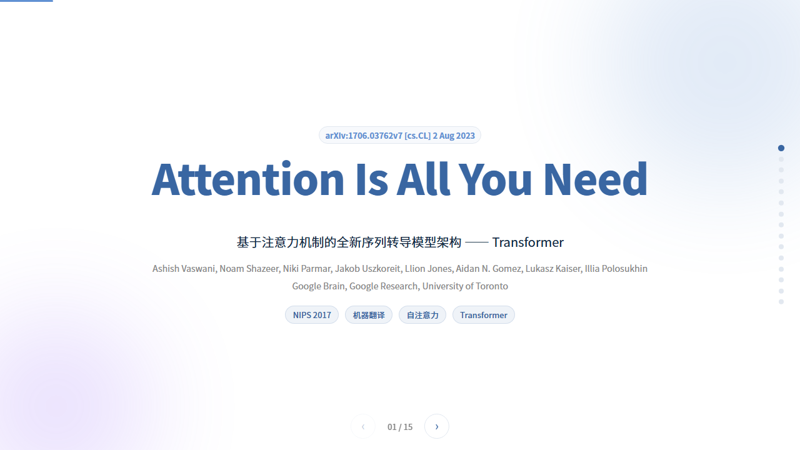
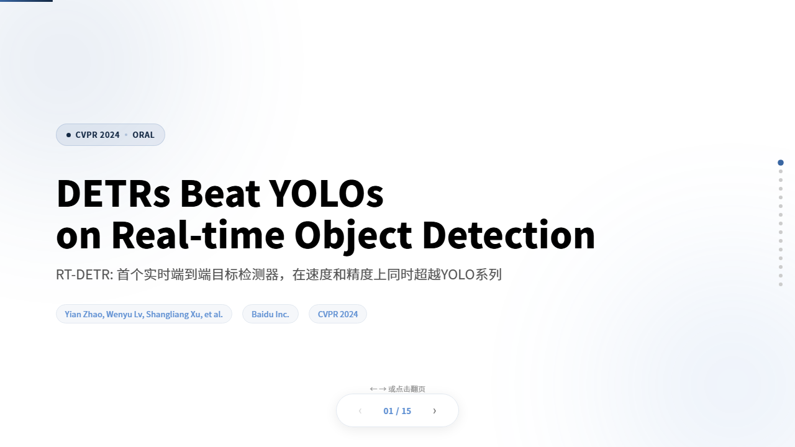
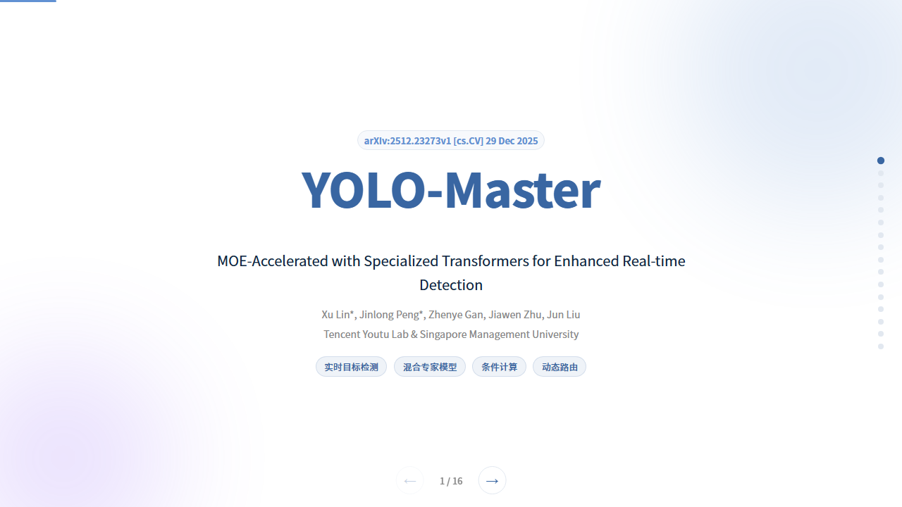
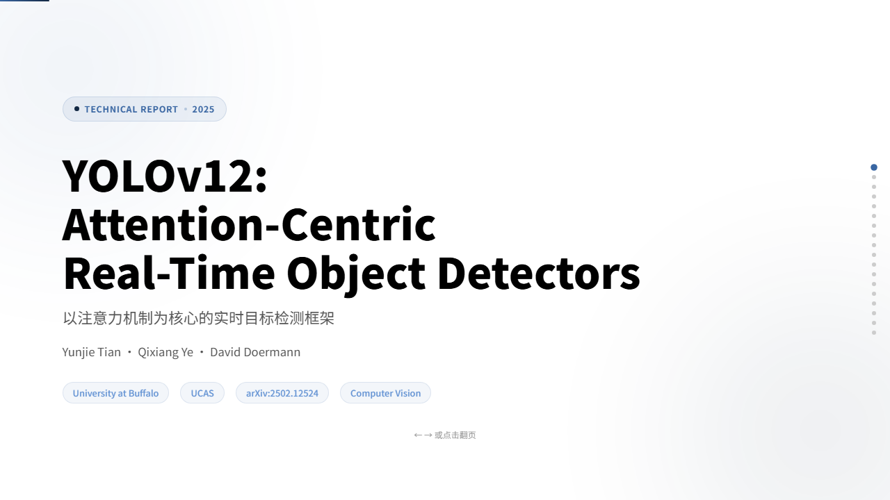
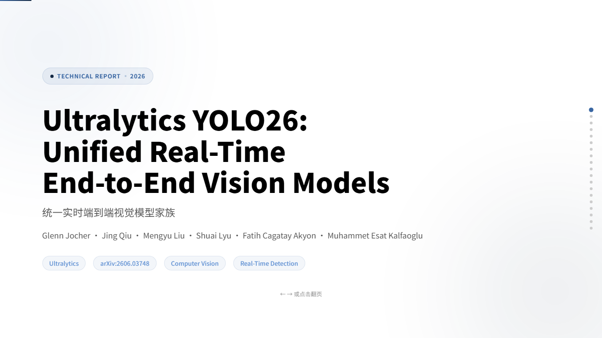
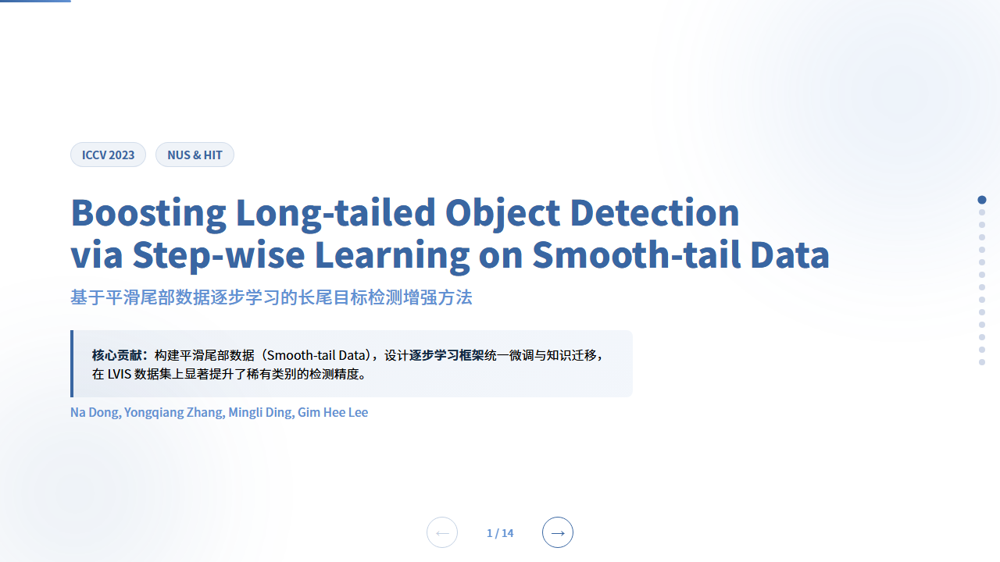
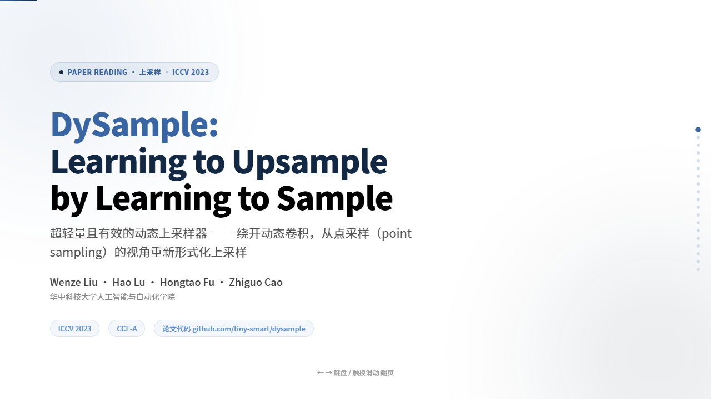

# Paper-Master

🌐 [中文](README.md) · [English](#)

> **"Feed it one PDF. Get two lasting assets back: a Chinese reading note + a playable HTML deck."**
> *嵌入各类 AI 编程工具 / AI 办公工具的科研人 AI 原生论文知识库:喂给 AI 一篇论文,它同时替你写好博客笔记、做组会 PPT,并把知识长期攒成个人知识库。*

[](LICENSE)
[](https://luoqianshi.github.io/Paper-Master/)
[](#-skill-matrix)
[](#-contact)
[]()

---

## Acknowledgements

- [html-presentation](https://github.com/juanjuanjie/html-presentation) — original HTML slide template and playback engine reference
- The Cnblogs ["乌漆WhiteMoon" Paper Reading column](https://www.cnblogs.com/linfangnan/p/17636482.html) — the distillation source of the `lzk-paper-reading` note paradigm
- [Claude Code](https://claude.com/claude-code) · [CodeBuddy](https://www.codebuddy.ai/) · [TRAE](https://www.trae.ai/) — AI Agent platforms
- All open-source paper authors and the open-source community

---

## 30-Second Overview

`Paper-Master` is an **AI-native paper knowledge base for researchers**, designed to embed into AI coding tools / AI office tools such as Claude Code / TRAE / CodeBuddy. It turns "reading one paper" into two long-lived, reusable assets — a structured **Chinese reading note (blog post)** and a **single-file HTML deck** you can present directly. The whole flow is automated by an AI Agent through 3 SKILLs: drop the PDF into `pdf-papers/`, and it writes the note, builds the deck — directly from the PDF, or by converting the finished reading note — and archives both into a version-controllable e-bookshelf you can deploy to GitHub Pages in one click.

- Read a paper deeply & distill it into a blog note → `lzk-paper-reading`
- Have a PDF and want a group-meeting / defense deck right away → `html-paper-slides`
- Already have a reading note and want to turn it into a deck → `blog-to-slides`

**The essential difference from generic PPT tools**: what we deliver is not "one-off slides" but **two searchable assets in a knowledge base** — Markdown notes (diff-able, full-text searchable, re-processable) + offline single-file HTML decks (playable via `file://`, embeddable in your homepage). Every paper you read keeps stacking up in this bookshelf.

---

## Quick Start

```bash
git clone https://github.com/luoqianshi/Paper-Master.git
cd Paper-Master
```

Open the project in any AI coding tool / AI office tool that supports Skills (Claude Code / TRAE / CodeBuddy), and send the Agent either prompt:

**Produce a Chinese reading note:**

```markdown
Please use the lzk-paper-reading skill (skills\lzk-paper-reading\SKILL.md)
to write a Chinese paper-reading note for ./pdf-papers/my-paper.pdf.
The final .md file should be saved in the paper-blogs directory,
with extracted figures archived under assets/paper-imgs (one folder per paper title).
```

**Produce an HTML deck:**

```markdown
Please use the html-paper-slides skill (skills\html-paper-slides\SKILL.md)
to make an HTML paper-presentation PPT for ./pdf-papers/my-paper.pdf.
The final file should be saved in the paper-slides directory.
```

**Turn an existing note into an HTML deck (no PDF needed):**

```markdown
Please use the blog-to-slides skill (.trae\skills\blog-to-slides\SKILL.md)
to make an HTML paper-presentation PPT for paper-blogs/my-paper.md
(a Chinese reading note). The final file should be saved in the
paper-slides directory.
```

A few minutes later, a structured Chinese note appears in `paper-blogs/`, or a browser-playable single-file HTML deck appears in `paper-slides/` — the latter is auto-listed in the gallery at `index.html`.

---

## Skill Matrix

The repository ships with 3 SKILLs, covering the core ways of distilling "reading a paper":

| SKILL | Typical Scenario | Input | Output | Typical Time |
|------|------------------|-------|--------|--------------|
| [`lzk-paper-reading`](skills/lzk-paper-reading/SKILL.md) | Paper deep-reading · Blog note · Knowledge distillation | A PDF / arXiv link / title | Structured Chinese Markdown note (`paper-blogs/`) + figure library (`assets/paper-imgs/`) | 5–12 min |
| [`html-paper-slides`](skills/html-paper-slides/SKILL.md) | Group meeting · Thesis defense · Research progress report | One PDF paper | Single-file HTML deck + thumbnail | 8–15 min |
| [`blog-to-slides`](.trae/skills/blog-to-slides/SKILL.md) | Note-to-deck · Fast group-meeting draft | A finished Chinese reading note (`paper-blogs/*.md`) + extracted figures | Single-file HTML deck + thumbnail | 5–10 min |

- **`lzk-paper-reading`** produces a Chinese note on a fixed five-section skeleton (Motivation / Contributions / Method / Experiments / Strengths & Innovations) + a paper-info table + a disclaimer. It enforces the formula pattern "lead-in sentence → LaTeX → where-explanation", the "2–3 sentences + 1 figure" experiment rhythm, and gates output with `scripts/new_note.py` (scaffold) and `scripts/check_note.py` (validator).
- **`html-paper-slides`** generates Apple-style / Notion-style single-file HTML decks: zero external dependencies, `file://` open, keyboard navigation, fade-in animations, CSS-Grid responsive layout. Deploy with one click to GitHub Pages / Vercel / Netlify.
- **`blog-to-slides`** takes a Chinese reading note produced by `lzk-paper-reading` as its **single source of truth** and reuses the figures already extracted under `assets/paper-imgs/` — no PDF needed: it maps the five-section note onto a single-file HTML deck (Cover → Overview → Introduction → Method → Experiments → Summary & Discussion), typesets formulas with HTML/CSS, references figures by relative path without copying, and stays dependency-free under `file://`.

> `lzk-paper-reading` and `html-paper-slides` share the same "paper understanding" layer: `pdf_extractor.py` first pulls transparent-background figures from the PDF and archives them per paper title under `assets/paper-imgs/<paper-title>/`; the figures then feed the note flow and the deck flow. `blog-to-slides` adds a third path — it consumes the note flow's outputs (note + figures) directly and turns an existing note into a deck without ever touching the PDF. One paper can produce "note + deck" in a single pass.

---

## Showcase · Real Paper Decks

The 8 decks below were all generated with `html-paper-slides` assisted by an AI Agent. Click any thumbnail to preview:

<table>
  <tr>
    <td align="center" width="50%">
      <a href="paper-slides/Attention_Is_All_You_Need.html">
        
      </a>
      <br><b>Attention Is All You Need</b>
      <br><sub>Transformer classic · Multi-head attention · SOTA on machine translation</sub>
    </td>
    <td align="center" width="50%">
      <a href="paper-slides/DETRs_Beat_YOLOs_on_Real-time_Object_Detection.html">
        
      </a>
      <br><b>DETRs Beat YOLOs on Real-time Object Detection</b>
      <br><sub>CVPR 2024 Oral · RT-DETR · End-to-end real-time detection</sub>
    </td>
  </tr>
  <tr>
    <td align="center" width="50%">
      <a href="paper-slides/YOLO-Master_Presentation.html">
        
      </a>
      <br><b>YOLO-Master: MoE-Accelerated YOLO</b>
      <br><sub>Specialized decoders · MoE acceleration · Real-time detection</sub>
    </td>
    <td align="center" width="50%">
      <a href="paper-slides/YOLOv12_Attention-Centric.html">
        
      </a>
      <br><b>YOLOv12: Attention-Centric Real-Time Detectors</b>
      <br><sub>Area Attention · R-ELAN · Attention-centric</sub>
    </td>
  </tr>
  <tr>
    <td align="center" width="50%">
      <a href="paper-slides/YOLO26_Unified_Real-Time_Vision.html">
        
      </a>
      <br><b>Ultralytics YOLO26: Unified Real-Time Vision</b>
      <br><sub>DFL-free · MuSGD · Unified multi-task</sub>
    </td>
    <td align="center" width="50%">
      <a href="paper-slides/smooth-tail_learning.html">
        
      </a>
      <br><b>Boosting Long-tailed Object Detection</b>
      <br><sub>ICCV 2023 · Smooth-tail data · Step-wise learning</sub>
    </td>
  </tr>
  <tr>
    <td align="center" width="50%">
      <a href="paper-slides/Dialogue_Director.html">
        
      </a>
      <br><b>Dialogue Director</b>
      <br><sub>Dialogue visualization · Three-agent framework · Film knowledge integration</sub>
    </td>
    <td align="center" width="50%">
      <a href="paper-slides/DySample_Learning_to_Upsample.html">
        
      </a>
      <br><b>DySample: Learning to Upsample by Learning to Sample</b>
      <br><sub>Dynamic upsampling · Content-aware · Plug-and-play</sub>
    </td>
  </tr>
</table>

> Online gallery: https://luoqianshi.github.io/Paper-Master/

---

## Core Workflow: pdf-papers → paper-blogs → paper-slides

The repository's differentiator is unifying "paper reading" into one **reproducible, version-controlled** three-stage pipeline, where a single paper can yield both a "note" and a "deck":

```
┌────────────┐    ┌────────────┐    ┌──────────────────────────┐
│ pdf-papers │ →  │   paper-blogs   │ →  │      paper-slides        │
│  Original  │    │  Chinese   │    │  ┌────────────────────┐  │
│  PDFs only │    │  MD notes  │    │  │ single-file deck   │  │
└────────────┘    └────────────┘    │  └────────────────────┘  │
  traceable         5-section MD     └──────────────────────────┘
                    figures → assets/paper-imgs/<paper-title>/
```

### 1. `pdf-papers/` — Original Paper PDF Archive
Store only the original papers, in PDF format — no supplementary materials, web links, or temporary excerpts. Don't polish; just keep sources traceable with clear file names (the paper title is recommended), so later steps can build the per-paper figure folder by title.

### 2. `paper-blogs/` — Chinese Reading Notes (MD Blogs)
The output layer of the `lzk-paper-reading` skill: each PDF paper maps to one structured Chinese Markdown reading note (blog post), organized on a fixed five-section skeleton + paper-info table + disclaimer, distilling *research problem & motivation, core contributions, method framework, key modules, experimental setup, core metrics, ablation conclusions, visualization evidence, limitations,* and a *narrative thread*. Notes are the knowledge base's *searchable text assets*: diff-able, full-text searchable, re-processable.

Paper figures are centralized: key screenshots extracted by `pdf_extractor.py` go into a folder named after the paper title, under `assets/paper-imgs/<paper-title>/`, shared by both the note flow and the deck flow.

### 3. `paper-slides/` — HTML Decks
Produced by `html-paper-slides` (PDF input) or `blog-to-slides` (reading-note input from `paper-blogs/`, no PDF needed) — single-file decks built on the same paper's reading note and the figures in `assets/paper-imgs/`, compressed into a 13–22 page presentation structure. Keep a clear chapter flow: **Cover → Abstract → Introduction → Method → Experiments → Ablation → Conclusion & Outlook**, reinforced with cards, flow diagrams, comparison tables, metric highlights, and navigation controls. After a deck is added, **always update `slides-manifest.json`** so `index.html` can render title, path, description, kind, and accent correctly. Then run `python skills/html-paper-slides/scripts/generate-thumbnails.py` to generate real cover thumbnails for the gallery cards.

### Quality Checklist
Before moving to the next stage, confirm:
- `pdf-papers/` can be traced back to the original source (PDF only, trackable names)
- Notes in `paper-blogs/` pass the `check_note.py` gate (skeleton / spacing / banned phrases / strengths section / no fabrication) and support an 8–15 page report
- Figures are archived per paper under `assets/paper-imgs/<paper-title>/`
- The HTML deck opens as a single file, supports keyboard navigation, and has clear visual hierarchy
- `slides-manifest.json` covers all HTML files in `paper-slides/`
- `assets/thumbnails/` contains matching thumbnails, with the `thumbnail` field correctly set in manifest

---

## Project Structure

```
Paper-Master/
├── index.html            # Single-page portal: left sidebar (Home / Slides / Blogs) + right content area with refresh-free view switching (auto-deployed via GitHub Pages)
├── pages/                # Standalone feature pages
│   └── note.html         #   Full-screen reading deep link for notes (Markdown rendering + LaTeX math)
├── slides-manifest.json  # paper-slides deck manifest
├── blogs-manifest.json   # paper-blogs note manifest (regenerate locally with `python scripts/generate_manifests.py` and commit; also rebuilt by the Pages workflow)
├── README.md             # Chinese README (default)
├── README.en.md          # English README
├── LICENSE               # MIT License
├── paper-slides/         # HTML PPT outputs from html-paper-slides + matching _assets/ figures
│   ├── Attention_Is_All_You_Need.html
│   ├── DETRs_Beat_YOLOs_on_Real-time_Object_Detection.html
│   └── ... (more paper decks)
├── skills/               # Note/slide-creation skills, scripts, and template docs
│   ├── lzk-paper-reading/        # Paper reading → Chinese reading note
│   │   ├── SKILL.md
│   │   ├── scripts/
│   │   │   ├── new_note.py        # Generate frontmatter + five-section skeleton
│   │   │   └── check_note.py      # Note gate validation
│   │   └── references/            # Skeleton variants, phrase corpus, domain transfer, examples
│   └── html-paper-slides/        # Paper reading → HTML presentation deck
│       ├── SKILL.md
│       ├── scripts/
│       │   ├── pdf_extractor.py   # Extract key figures from paper PDFs (shared by both flows)
│       │   └── generate-thumbnails.py  # Generate first-screen thumbnails
│       └── templates/
│           └── presentation.html  # Paper-presentation HTML slide template
├── .trae/skills/         # TRAE skills dir: hosts lzk-paper-reading / html-paper-slides / blog-to-slides
│   └── blog-to-slides/           # Reading note → HTML deck (no PDF needed)
│       ├── SKILL.md
│       ├── scripts/
│       │   └── generate-thumbnails.py  # Generate first-screen thumbnails
│       └── templates/
│           └── presentation.html  # Paper-presentation HTML slide template
├── assets/               # Shared static assets
│   ├── paper-imgs/       # Paper figure library: one folder per paper title
│   │   └── <paper-title>/ # key figures extracted from that paper
│   ├── thumbnails/       # HTML slide first-screen thumbnails (auto-generated)
│   ├── design-prompts/   # Style design prompt collection
│   ├── accmulate-ppts.png
│   └── favicon.png
├── pdf-papers/           # Original paper PDFs only (gitignored)
└── paper-blogs/               # Chinese reading notes (.md blogs) from lzk-paper-reading (gitignored)
```

---

## Getting Started

### 1. Prepare the environment

```bash
git clone https://github.com/luoqianshi/Paper-Master.git
cd Paper-Master
```

- Delete all `.html` files in `paper-slides/`, all notes in `paper-blogs/`, and all per-paper figure folders in `assets/paper-imgs/` (these are the author's personal knowledge-base data)
- Clear the `slides` array in `slides-manifest.json`
- (Optional) Install thumbnail dependencies: `pip install playwright && playwright install chromium`
- (Optional) Install PDF-extraction dependencies: `pip install pymupdf Pillow`

### 2. Choose an output, launch the AI Agent

Open the project in an AI coding tool / AI office tool such as `Claude Code` / `TRAE` / `CodeBuddy`.

**Chinese reading-note scenario:**

```markdown
Please use the lzk-paper-reading skill (skills\lzk-paper-reading\SKILL.md)
to write a Chinese paper-reading note for [path to your PDF paper].
The final .md file should be saved in the paper-blogs directory,
with extracted figures archived under assets/paper-imgs (one folder per paper title).
```

**Paper presentation scenario:**

```markdown
Please use the html-paper-slides skill (skills\html-paper-slides\SKILL.md)
to make an HTML paper-presentation PPT for [path to your PDF paper].
The final file should be saved in the paper-slides directory.
```

**Note-to-deck scenario (input: an existing reading note, no PDF needed):**

```markdown
Please use the blog-to-slides skill (.trae\skills\blog-to-slides\SKILL.md)
to make an HTML paper-presentation PPT for [path to a Chinese reading
note .md file under paper-blogs/]. The final file should be saved in
the paper-slides directory.
```

> For the same paper, you can run the note flow first to read it deeply, then the deck flow to present it (`html-paper-slides` reads the PDF directly, `blog-to-slides` reads the note) — both share the notes in `paper-blogs/` and the figures in `assets/paper-imgs/`.

### 3. Generate thumbnails and auto-include in the gallery

```bash
python skills/html-paper-slides/scripts/generate-thumbnails.py
```

After that, the new HTML PPT will appear in the `index.html` gallery with its **real first-screen cover**. Pushing to GitHub triggers GitHub Actions to auto-deploy to GitHub Pages.

---

## Tech Stack

- **HTML5 + CSS3** — Deck body
- **Vanilla JavaScript** — Pagination engine, keyboard interaction, fade-in animations (no framework dependency)
- **CSS Grid / Flexbox** — 16:9 responsive layout
- **CSS Variables** — Theme color and font variable management
- **Markdown + LaTeX** — Note carrier (inline `$...$`, display `$$...$$`)
- **PyMuPDF + Pillow** — Extract transparent-background figures from paper PDFs
- **Playwright (Python)** — Auto-generate HTML PPT first-screen thumbnails
- **GitHub Actions** — Auto-deploy `index.html` to GitHub Pages

---

## Limitations

We pursue an 80-point stable, usable experience rather than 100-point perfection:

1. **PDF figure extraction has redundancy**: we recommend manually deleting redundant images after the first version, with VLM-based figure selection coming in future releases
2. **Multimodal models work best**: native multimodal models like KIMI K2.6 and Minimax M3 are recommended — pure text models will miss paper figures
3. **Current version is a high-quality first draft**: we recommend multiple rounds of dialog refinement with the Agent, e.g. "replace page 5 method diagram with architecture diagram" / "add the school logo to the footer"
4. **Note paradigm has domain skew**: the `lzk-paper-reading` corpus is mostly tabular-data ML; for vision/detection papers, switch the experiments-section style per `references/research/domain-transfer.md`
5. **No direct generation from LaTeX source**: if you need LaTeX fidelity, please use Beamer; this repository focuses on "start with PDF / Markdown"
6. **Thumbnails depend on Playwright**: the first run requires `pip install playwright && playwright install chromium`; headless server environments need `--with-deps`

---

## Contact

Stars, forks, issues, and PRs are welcome. If you want to discuss graduate studies / paper reading / Agent workflows, find me via:

| Platform | Account / Link |
|----------|----------------|
| GitHub | [@luoqianshi](https://github.com/luoqianshi) |
| Online Gallery | [luoqianshi.github.io/Paper-Master](https://luoqianshi.github.io/Paper-Master/) |

---

## Star History

If this repository helps you, please consider giving a Star to support our continued iteration:

<a href="https://star-history.com/#luoqianshi/Paper-Master&Date">
  
</a>

---

*Last Updated: 2026-09-06 · v1.2 · AI-native paper knowledge base for researchers · 3 SKILLs · 8 paper decks collected*
