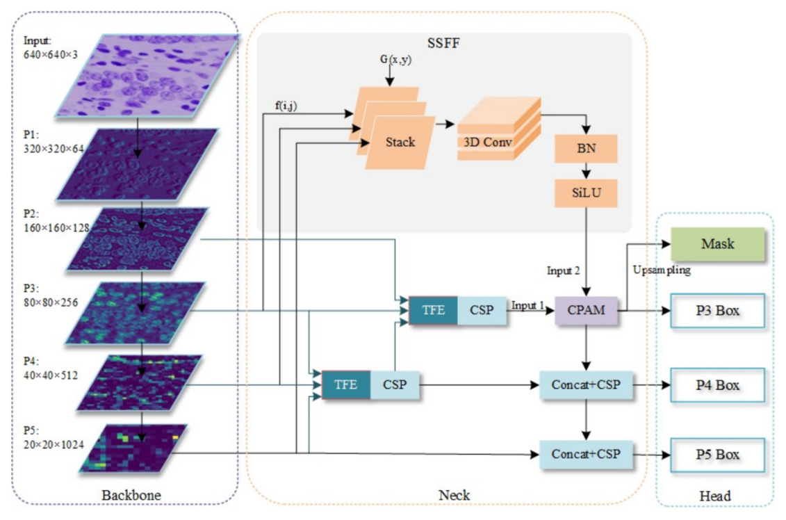
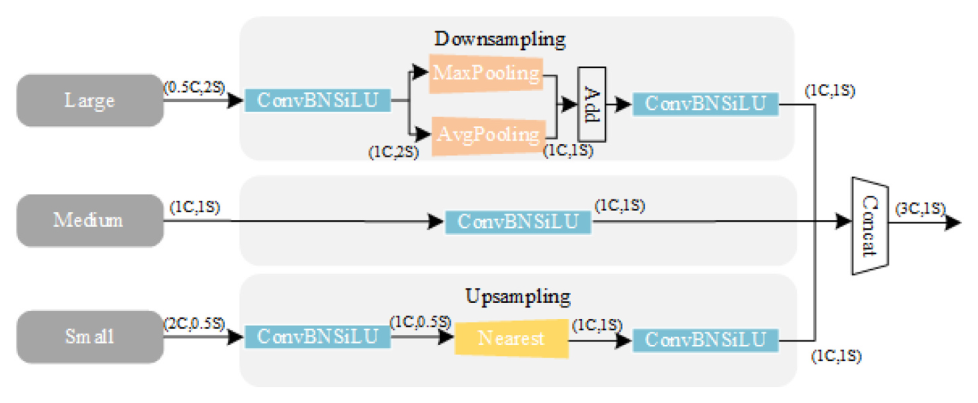
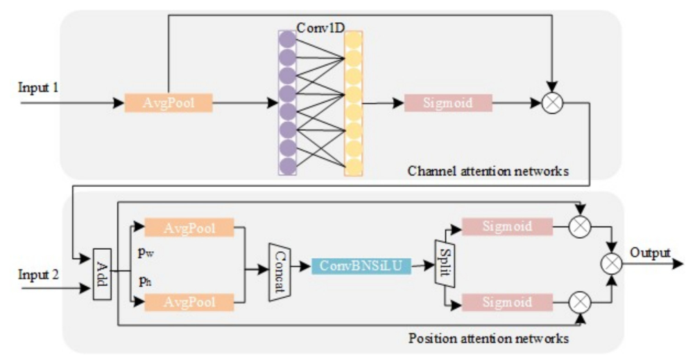
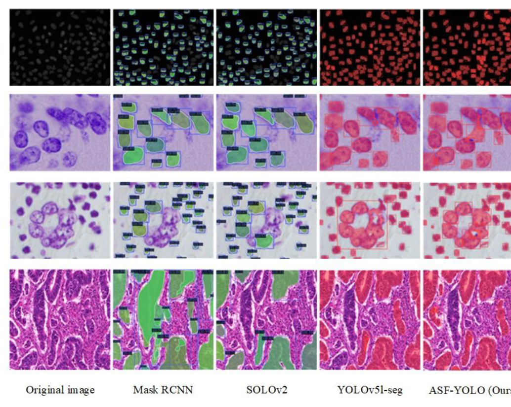
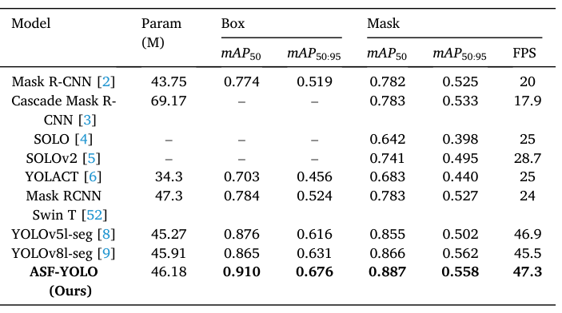
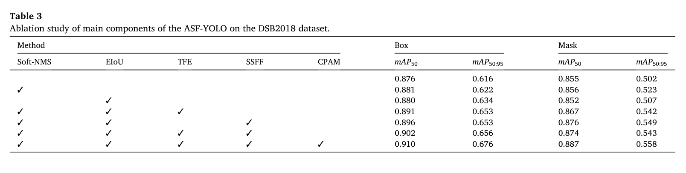
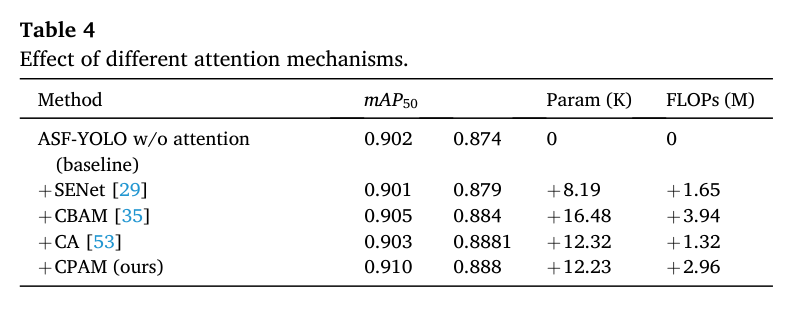
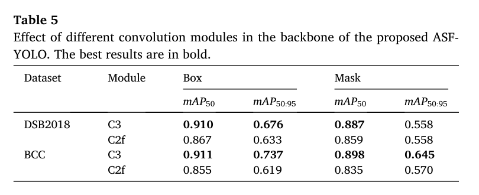
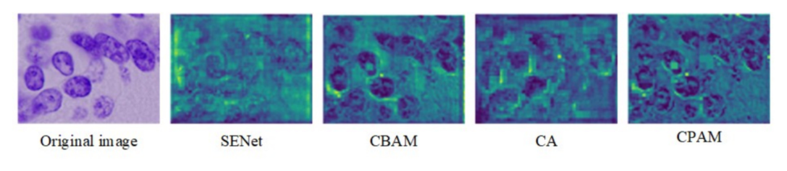

# ASF-YOLO: A novel YOLO model with attentional scale sequence fusion for cell instance segmentation

Paper Reading 是从个人角度进行的一些总结分享，受到个人关注点的侧重和实力所限，可能有理解不到位的地方。具体的细节还需要以原文的内容为准，博客中的图表若未另外说明则均来自原文。

| 论文概况 | 详细 |
| --- | --- |
| 标题 | 《ASF-YOLO: A novel YOLO model with attentional scale sequence fusion for cell instance segmentation》 |
| 作者 | Ming Kang、Chee-Ming Ting、Fung Fung Ting、Raphaël C.-W. Phan |
| 发表期刊 | Image and Vision Computing |
| 期刊等级 | CCF-C |
| 发表年份 | 2024 |
| 论文代码 | [https://github.com/mkang315/ASF-YOLO](https://github.com/mkang315/ASF-YOLO) |

作者单位：

1. 马来西亚蒙纳士大学信息技术学院（School of Information Technology, Monash University, Malaysia Campus）

## 研究动机

细胞实例分割是医学图像分析与细胞生物学的重要问题，表现为需要在显微图像中同时给出每个细胞的检测框与像素级掩码，导致细胞计数等下游任务高度依赖其分割精度。以 Mask R-CNN 为代表的两阶段框架与 SSD、U-Net、BlendMask 等一阶段方法是细胞实例分割的经典路线，但两阶段方法速度慢、难以满足实时检测与分割的需要，一阶段方法在密集且细小的细胞上分割质量又有限。YOLO 系列在自然图像实例分割上取得了速度与精度的平衡，然而其架构并未针对医学图像中的小目标做优化：细胞尺寸小、分布密集、相互重叠且边界模糊，不同细胞图像在颜色、形态、纹理上差异巨大；YOLOv5 的颈部采用 FPN，只以简单的相加与拼接融合金字塔特征，主要利用小尺寸特征图，无法充分挖掘各层特征图之间的相关性。YOLOMask、PR-YOLO、YOLO-SF 等改进模型引入了注意力机制，但都面向自然图像设计。暂未有工作将基于 YOLO 的模型用于细胞实例分割，并系统处理其中的多尺度融合与小目标注意力问题。

## 文章贡献

针对 YOLOv5 的 FPN 无法充分利用金字塔特征相关性、且缺乏对小目标关注的问题，本文提出了 ASF-YOLO，一个构建在 YOLOv5 之上的一阶段细胞实例分割模型。其核心是在颈部插入 SSFF 与 TFE 两个互补的特征融合模块，并用 CPAM 通道与位置注意力对二者整合。首先 SSFF 将 P3、P4、P5 归一化、上采样并堆叠为尺度序列送入 3D 卷积，融合跨尺度的全局语义信息；接着 TFE 把大、中、小三种尺寸的特征在通道维拼接，保留小目标的局部细节，并经 PANet 结构融入各特征分支；最终 CPAM 自适应地聚焦于与小目标相关的信息通道与空间位置，再配合 EIoU 损失与 Soft-NMS 后处理优化框回归与密集重叠抑制。实验表明，ASF-YOLO 在 DSB2018 数据集上取得 0.91 的 box mAP50 与 0.887 的 mask mAP50，推理速度达 47.3 FPS，精度与速度均优于现有方法。

## 本文方法

### 整体架构

ASF-YOLO 沿用 YOLO 的 backbone-neck-head 三段式结构，全部改进集中在颈部。整体架构如下图所示。

图中左侧 backbone 为 CSPDarknet53，从 640×640 的输入中逐级提取 P1 至 P5 五层特征；颈部对 P3、P4、P5 做融合：SSFF 把三层特征归一化、上采样、堆叠后送 3D 卷积提取尺度序列特征，TFE 把三种尺寸特征拼接后经 PANet 结构融入各分支，CPAM 置于 P3 分支上完成通道与位置加权；头部在三个尺度上输出检测框与原型掩码，掩码被裁剪在检测框内。各组件的分工如下表所示。

| 组件 | 模块 | 功能 |
| --- | --- | --- |
| Backbone | CSPDarknet53 | 提取 P1–P5 多尺度特征 |
| Neck | SSFF + TFE + CPAM + PANet | 尺度序列融合、细节保留、通道与位置注意力 |
| Head | YOLO 分割头 | 输出检测框与原型掩码 |
| 损失与后处理 | EIoU + Soft-NMS | 优化框回归、缓解密集重叠抑制 |

backbone 的多尺度输出是 SSFF 与 TFE 的共同输入，颈部融合后的特征最终汇入 P3、P4、P5 三个检测分支。

### 尺度序列特征融合模块

SSFF 的目标是把多尺度特征图沿尺度维组织成序列，用 3D 卷积挖掘金字塔各层之间的相关性。P3、P4、P5 特征图先与一系列标准差递增的高斯核做卷积，定义如下：

$$F_{\sigma}(i, j) = \sum_{u}\sum_{v} f(i-u, i-v) \times G_{\sigma}(u, v), \quad G_{\sigma}(x, y) = \frac{1}{2\pi\sigma^2} e^{-(x^2+y^2)/2\sigma^2}$$

| 符号 | 含义 |
| --- | --- |
| $f$ | 二维输入特征图 |
| $F_{\sigma}$ | 高斯平滑后生成的特征图 |
| $\sigma$ | 高斯核标准差，在一系列卷积中递增 |
| $G_{\sigma}$ | 二维高斯滤波核 |

这等价于以逐渐增大的平滑带宽对特征图做尺度空间表示，得到一组从细到粗的尺度样本。由于高斯平滑后各特征图分辨率不同，本文用最近邻插值把它们对齐到 P3 的分辨率，因为高分辨率的 P3 层包含对小目标检测与分割最关键的信息，SSFF 模块因此基于 P3 层级设计。对齐之后的具体组件为：

- 用 1×1 卷积把 P4 与 P5 特征层的通道数改为 256；
- 用最近邻插值把它们的尺寸调整到 P3 层大小；
- 用 unsqueeze 把每个特征层从 [height, width, channel] 的 3D 张量扩为 [depth, height, width, channel] 的 4D 张量；
- 将 4D 特征图沿 depth 维拼接，形成供后续卷积使用的 3D 特征图；
- 用 3D 卷积、3D 批归一化与 SiLU 激活函数完成尺度序列特征提取。

SSFF 的输出随后作为 Input 2 送入位置注意力网络，与通道注意力网络的输出叠加后汇入 P3 分支。

### 三特征编码模块

TFE 用于把大尺寸特征图引入融合过程，保留小目标的细粒度空间细节。常规 FPN 只上采样小尺寸特征图再与上一层相加或拼接，忽略了大尺寸特征层中丰富的细节信息；TFE 则把大、中、小三种尺寸的特征在空间维对齐后拼接。模块结构如下图所示。

大尺寸特征图经卷积模块把通道数调整为 1C 后，用最大池化加平均池化的混合结构下采样，在压缩空间维度的同时获得平移不变性；小尺寸特征图经卷积调整通道数后用最近邻插值上采样，利用邻域像素填充以保留小目标的局部特征；三路特征尺寸一致后各做一次卷积，再在通道维拼接，计算为：

$$F_{TFE} = \mathrm{Concat}(F_l, F_m, F_s)$$

| 符号 | 含义 |
| --- | --- |
| $F_{TFE}$ | TFE 模块的输出特征图 |
| $F_l$ | 大尺寸特征图 |
| $F_m$ | 中尺寸特征图 |
| $F_s$ | 小尺寸特征图 |

$F_{TFE}$ 与 $F_m$ 分辨率相同、通道数为其 3 倍。给出一个简单的例子，假设中尺寸特征图为 256 通道、80×80 大小，即 C = 256、S = 80。1. 大尺寸特征图为 128 通道（0.5C）、160×160（2S），经卷积模块调为 256 通道（1C），再经混合池化下采样到 80×80（1S）；2. 中尺寸特征图经卷积模块后保持 256 通道、80×80；3. 小尺寸特征图为 512 通道（2C）、40×40（0.5S），经卷积调为 256 通道后由最近邻插值上采样到 80×80；4. 三路沿通道维拼接，得到 768 通道（3C）、80×80（1S）的输出。可以看到，TFE 不改变空间分辨率，只把三个尺度的细节信息打包进同一张特征图。TFE 的输出经 PANet 结构融入各特征分支，并与 SSFF 的多尺度信息一起汇入 P3 分支；经 PANet 之后的特征图同时作为 Input 1 送入通道注意力网络。

### 通道注意力网络

通道注意力网络用于在不降维的前提下捕获跨通道交互，其输入 Input 1 是经 PANet 之后、包含 TFE 细节信息的特征图，模块整体结构如下图所示。

SENet 式的通道注意力对每个通道独立做全局平均池化，再用两个全连接层与 Sigmoid 生成通道权重，但降维会给通道注意力预测带来副作用，捕获全部通道间的依赖也低效且不必要。本文改用无降维的方案：逐通道全局平均池化后，用大小为 k 的 1D 卷积捕获每个通道与其 k 个最近邻之间的局部跨通道交互，k 代表局部跨通道交互的覆盖范围。由于卷积核大小 k 与通道维 C 成正比，二者之间的非线性映射定义为：

$$C = \psi(k) = 2^{(\gamma \times k - b)}, \quad k = \Psi(C) = \left| \frac{\log_2(C) + b}{\gamma} \right|_{odd}$$

| 符号 | 含义 |
| --- | --- |
| $C$ | 通道维度 |
| $k$ | 1D 卷积核大小，即局部跨通道交互的覆盖范围 |
| $\gamma$、$b$ | 控制 k 与 C 比例的缩放参数 |
| $\lvert \cdot \rvert_{odd}$ | 取最近的奇数 |

实验中 $\gamma$ 取 2、$b$ 取 1。按上述映射，高值通道的交互更长、低值通道的交互更短，通道注意力因此能对多通道特征做更深的挖掘。直观上，通道数自动决定了核大小 k，省去了在不同网络结构中手动调 k 的过程。通道注意力的输出与 SSFF 特征叠加构成 Input 2，送入位置注意力网络。

### 位置注意力网络

位置注意力网络用于从 Input 2 中提取每个细胞的关键位置信息，与通道注意力形成互补。与通道注意力不同，它先把输入特征图按宽度与高度两个方向拆分，分别做特征编码后再合并。输入特征图在水平与垂直两个轴上池化以保留空间结构信息，计算为：

$$p_w(i) = \frac{1}{H}\sum_{0 \le j \le H} E(i, j), \quad p_h(j) = \frac{1}{W}\sum_{0 \le i \le W} E(i, j)$$

| 符号 | 含义 |
| --- | --- |
| $W$、$H$ | 输入特征图的宽与高 |
| $E(i, j)$ | 输入特征图在位置 (i, j) 的值 |
| $p_w$、$p_h$ | 水平轴与垂直轴的池化结果 |

生成位置注意力坐标时，对两个轴的结果做拼接与卷积，即 $P(a_w, a_h) = \mathrm{Conv}[\mathrm{Concat}(p_w, p_h)]$，其中 Conv 为 1×1 卷积；拆分注意力特征时生成一对位置依赖的特征图 $s_w = \mathrm{Split}(a_w)$ 与 $s_h = \mathrm{Split}(a_h)$。CPAM 的最终输出定义为：

$$F_{CPAM} = E \times s_w \times s_h$$

其中 $E$ 是通道与位置注意力的权重矩阵；$s_w$、$s_h$ 分别为拆分输出的宽与高方向注意力图。直观上，两个方向的一维池化把空间结构压缩进两条方向向量，融合后再拆回两个方向的注意力权重，逐位置乘回原特征图。CPAM 的输出进入 P3 检测分支，完成颈部改进的收尾。

### 锚框优化：EIoU 与 Soft-NMS

锚框优化在训练与后处理两个环节完成：训练阶段用 EIoU 替换 YOLOv5 使用的 CIoU 作为框定位损失，后处理阶段用 Soft-NMS 替换经典 NMS。CIoU 只反映宽高比的差异，而非标注框与预测框宽高之间的真实关系；EIoU 直接最小化目标框与锚框的宽高差异，能更好地捕捉小目标的位置。EIoU 损失分为 IoU 损失、距离损失与宽高损失三部分，公式如下：

$$L_{EIoU} = L_{IoU} + L_{dis} + L_{asp} = 1 - IoU + \frac{\rho^2(b, b^{gt})}{w_c^2 + h_c^2} + \frac{\rho^2(w, w^{gt})}{w_c^2} + \frac{\rho^2(h, h^{gt})}{h_c^2}$$

| 符号 | 含义 |
| --- | --- |
| $\rho(\cdot)$ | 欧氏距离 |
| $b$、$b^{gt}$ | 预测框与真实框的中心点 |
| $w$、$h$ 与 $w^{gt}$、$h^{gt}$ | 预测框与真实框的宽和高 |
| $w_c$、$h_c$ | 覆盖两个框的最小闭包的宽和高 |

相比 CIoU，EIoU 既加快预测框的收敛速度，也提高回归精度。后处理方面，经典 NMS 把与最高分检测框 IoU 超过阈值的边界框分数直接置零；Soft-NMS 改用高斯函数作为权重函数降低预测边界的分数，以衰减代替直接置零，修改了删除边界框的规则，从而缓解密集重叠细胞之间的错误抑制。这等价于把宽高比惩罚拆成宽与高两个独立回归项，并把后处理从硬删除改为分数衰减。二者分别作用于三个检测头的训练与推理阶段，与颈部的融合改进共同构成完整模型。

## 实验结果

### 实验设置

本文在两个细胞图像数据集上评测，数据集划分如下表所示。

| 数据集 | 图像数 | 训练 / 测试 | 特点 |
| --- | --- | --- | --- |
| DSB2018 | 670 | 536 / 134 | 细胞核图像，覆盖不同细胞类型、放大倍率与成像模式 |
| BCC | 160 | 128 / 32 | H&E 染色的乳腺癌病理图像 |

评测指标为 Box mAP50、Box mAP50:95、Mask mAP50、Mask mAP50:95 与 FPS。所有模型使用 COCO 预训练权重，输入尺寸 640×640，batch size 为 16，训练 100 个 epoch，优化器为 SGD，动量 0.9、初始学习率 0.001、权重衰减 0.0005，实验在 NVIDIA GeForce 3090（24G）GPU 上完成。对比方法包括 Mask R-CNN、Cascade Mask R-CNN、SOLO、SOLOv2、YOLACT、Mask RCNN Swin T、YOLOv5l-seg 与 YOLOv8l-seg。

### 定性效果对比

DSB2018 上各模型的分割效果对比如下图所示。

在 (a)(b) 两组较简单的图像上各模型结果接近；在 (c)(d) 两组中，Mask R-CNN 因两阶段算法的设计原理误检率较高，SOLO 存在大量漏检，YOLOv5l-seg 无法分割边界模糊的细胞，而 ASF-YOLO 对单通道密集小细胞与复杂背景下的大尺寸细胞都给出了完整分割，可见 TFE 与 SSFF 分别改善了对密集小目标的召回与对多尺度细胞的分割精度。

### 定量对比

DSB2018 上的主对比结果如下表所示。

ASF-YOLO 以 46.18 M 参数量取得 0.910 的 Box mAP50、0.676 的 Box mAP50:95、0.887 的 Mask mAP50 与 47.3 FPS，四项均为表中最佳；YOLOv5l-seg 与 YOLOv8l-seg 的 Box mAP50 为 0.876 与 0.865，FPS 为 46.9 与 45.5，Mask R-CNN 系列则只有 20 FPS 上下，Mask RCNN Swin T 因 800×1200 的输入尺寸精度与速度都不高，表明颈部改进让一阶段框架在细胞实例分割上同时拿到了精度与速度。BCC 数据集上的对比如下表所示。

ASF-YOLO 在 BCC 上取得 0.911 的 Box mAP50、0.737 的 Box mAP50:95 与 0.898 的 Mask mAP50，均为最佳，验证了模型对不同细胞类型数据集的泛化能力。

### 消融实验

DSB2018 上各组件的消融结果如下表所示。

从 YOLOv5l-seg 基线出发，单独加入 Soft-NMS 把 Box mAP50 提至 0.881，单独加入 EIoU 把 Box mAP50:95 提升 1.8%，依次叠加 TFE、SSFF、CPAM 后达到 0.910 与 0.887，说明每个模块都对密集小细胞的实例分割有正向贡献。不同注意力机制的对比如下表所示。

CPAM 取得 0.910 的 box mAP50 与 0.888 的 mask mAP50，高于 SENet、CBAM 与 CA，而参数量仅增加 12.23 K、FLOPs 仅增加 2.96 M，可见无降维通道注意力与位置注意力的组合性价比更高。骨干卷积模块的对比如下表所示。

把骨干中的 C3 模块替换为 YOLOv8 的 C2f 模块后，两个数据集上的 Box mAP50 分别降至 0.867 与 0.855，说明 C3 骨干与本文改进的颈部更为匹配。

### 可视化分析

不同注意力模块的分割特征可视化如下图所示。

SENet 的特征响应接近均匀背景，CBAM 与 CA 已能给出细胞位置响应但仍有残留干扰，CPAM 对细胞区域的响应最清晰，表明 CPAM 从原始图像中挖掘了更丰富的通道与位置特征信息。

## 优点和创新点

个人认为，本文有如下一些优点和创新点可供参考学习：

1. 针对小目标重新设计 YOLOv5 的颈部，SSFF 把金字塔特征组织为尺度序列送 3D 卷积，TFE 保留大尺寸特征图细节，二者互补，消融增益逐级可查。
2. CPAM 用无降维的 1D 卷积捕获跨通道交互，并配合方向分解的位置注意力，以约 12 K 参数的代价在四种注意力机制中取得最高 mAP。
3. 首次将 YOLO 一阶段框架用于细胞实例分割，在两个细胞数据集上精度与速度均超过 Mask R-CNN、YOLOv5l-seg 等方法，实验覆盖消融与可视化，说服力强。
