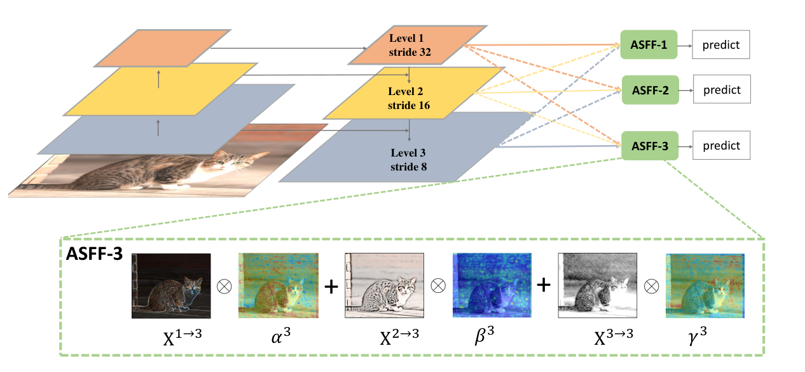
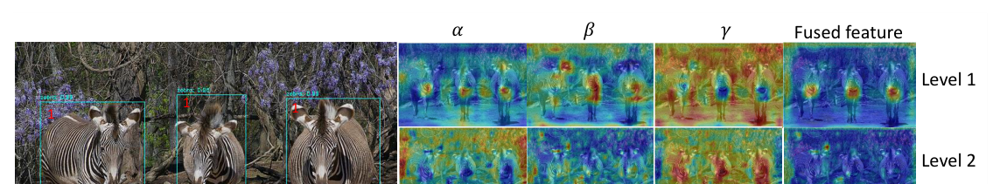
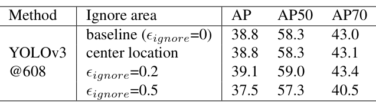
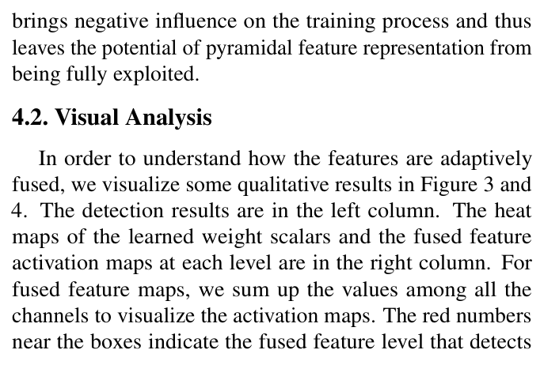
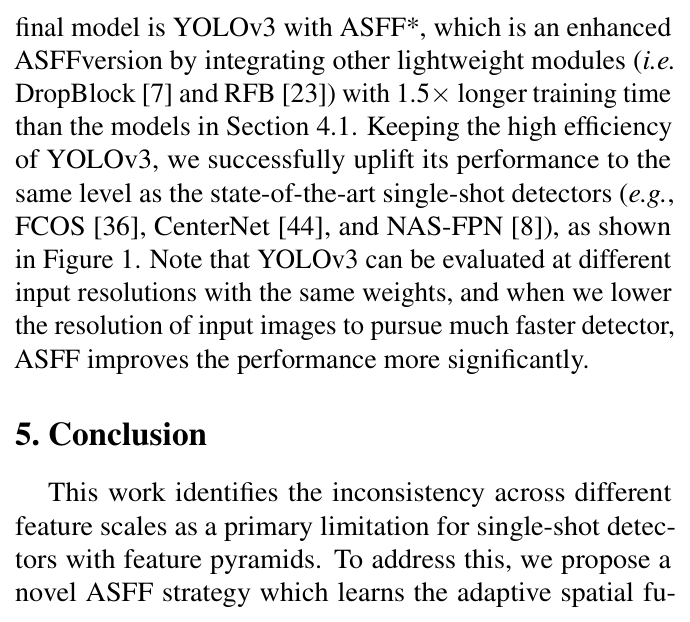
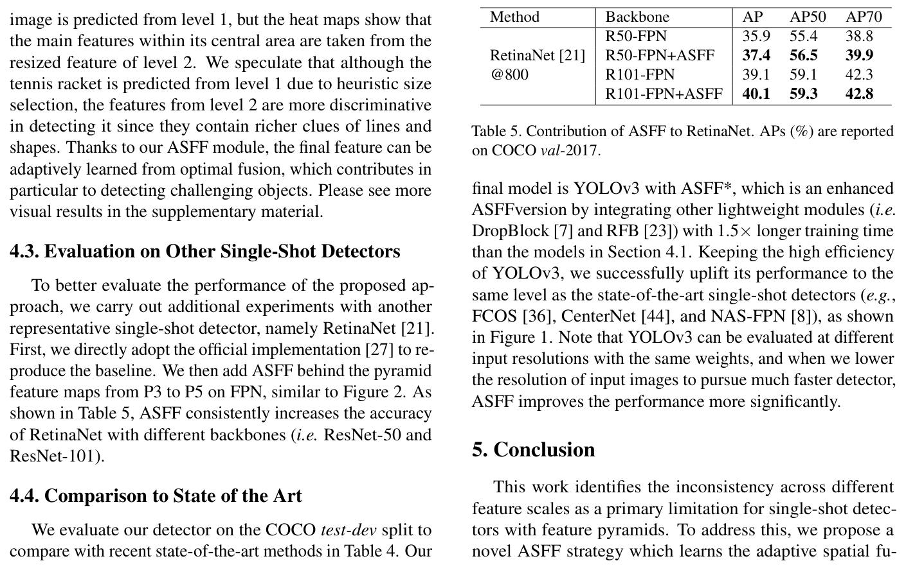
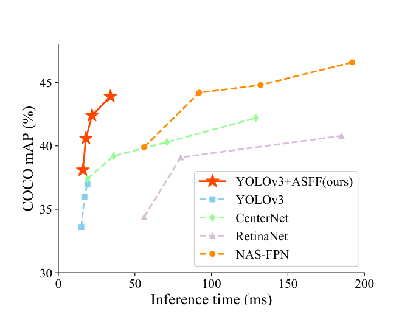
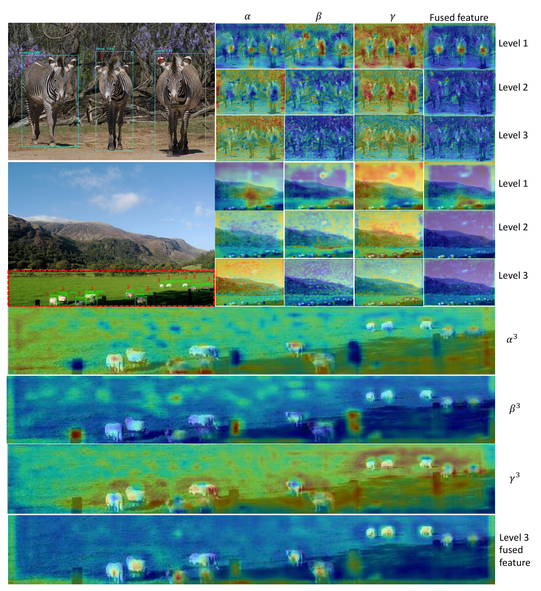
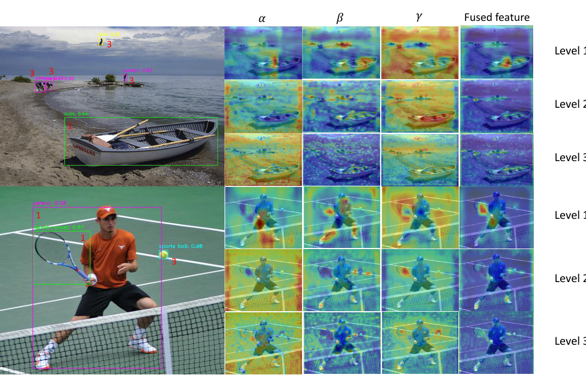

# Learning Spatial Fusion for Single-Shot Object Detection

Paper Reading 是从个人角度进行的一些总结分享，受到个人关注点的侧重和实力所限，可能有理解不到位的地方。具体的细节还需要以原文的内容为准，博客中的图表若未另外说明则均来自原文。

| 论文概况 | 详细 |
| --- | --- |
| 标题 | 《Learning Spatial Fusion for Single-Shot Object Detection》 |
| 作者 | Songtao Liu、Di Huang、Yunhong Wang |
| 发表会议 | 未获取（arXiv 预印本，编号 arXiv:1911.09516） |
| 会议等级 | 未获取 |
| 发表年份 | 2019 |
| 论文代码 | [https://github.com/ruinmessi/ASFF](https://github.com/ruinmessi/ASFF) |

作者单位：

1. 北京航空航天大学（Beihang University）

## 研究动机

多尺度目标检测是目标检测走向实际应用的核心难题，表现为同一幅图像中目标尺度跨度大，导致单一分辨率的特征图难以同时覆盖大小目标，构造特征金字塔因此成为检测器的通行做法。然而特征金字塔存在跨尺度不一致问题：检测时采用启发式的特征层级指派，大实例通常绑定高层特征图、小实例绑定低层特征图，某个目标在某一层被当作正样本时，它在其余各层对应区域却被视为背景；一旦图像中同时存在大小目标，这种特征冲突就会占据金字塔的大部分区域，干扰训练期的梯度计算，削弱特征金字塔的有效性。现有的缓解手段各有代价：基于图像金字塔的尺度归一化方法按比例选择性训练与推理，精度虽有提升但推理时间急剧增加；把相邻层对应区域设为 ignore 区域即零梯度的做法，又会在次优层引入更多误检；TridentNet 干脆放弃特征金字塔、为不同感受野建立尺度特定分支，却又错失高分辨率特征图的复用，限制小实例的精度。至此问题收窄为：暂未有工作能在保留特征金字塔结构的前提下，于特征融合阶段自适应地过滤跨尺度的冲突信息。

## 文章贡献

针对单阶段检测器特征金字塔的跨尺度不一致问题，本文提出了自适应空间特征融合（adaptively spatial feature fusion, ASFF）。其核心是以数据驱动的方式学习空间融合权重，在逐位置过滤冲突信息后再组合多层特征。首先把其余各层特征统一到与当前层相同的分辨率与通道数；接着对每个空间位置用 softmax 归一化的可学习权重图对各层特征加权求和，使携带矛盾信息的位置被过滤、判别性强的位置占主导；最终从梯度角度分析该融合的一致性性质，说明权重系数能在保留背景监督的同时调和正负梯度冲突。实验表明，ASFF 把加强版 YOLOv3 基线在 COCO val-2017 上的 box AP 从 38.8% 提升到 40.6%，仅增加约 2 ms 推理时间；在 test-dev 上以 45 FPS 取得 42.4% AP、以 29 FPS 取得 43.9% AP，是当时 COCO 上所有检测器中最好的速度-精度权衡之一。

## 本文方法

本文方法以 YOLOv3 为载体展开，按「融合流程 → 加权公式 → 梯度一致性论证 → 训练实现」的顺序组织，各 H3 对应流水线上的一环。

### 自适应空间特征融合的总体流程

ASFF 的总体流程目标是在预测之前为每一层特征注入经过空间筛选的多尺度信息，其结构如下图所示。

与逐元素相加或拼接不同，ASFF 对每一层都执行两步操作：identically rescaling 与 adaptively fusing。以 YOLOv3 的三层特征（stride 32/16/8）为例，对 level l，其余各层特征先被 resize 到与 $x^l$ 相同的形状：上采样先用 1×1 卷积把通道数压缩到 level l 的通道数再插值放大；1/2 下采样直接用 stride 2 的 3×3 卷积同时改通道与分辨率；1/4 下采样则在 stride 2 卷积前再加一层 stride 2 的 max pooling。图中 ASFF-3 的展开部分显示，resize 后的三份特征分别与权重图 $\alpha^3$、$\beta^3$、$\gamma^3$ 逐位置相乘后求和，输出再送入各自的预测头。该流程不改动骨干网络，只作用于金字塔特征与检测头之间，是后文加权公式的结构载体。

### 空间加权的自适应融合

自适应融合环节的目标是为每个空间位置学习各层特征的重要度权重。设 $x^{n \to l}_{ij}$ 表示从 level n resize 到 level l 后位置 $(i, j)$ 处的特征向量，融合公式如下：

$$y^l_{ij} = \alpha^l_{ij} \cdot x^{1 \to l}_{ij} + \beta^l_{ij} \cdot x^{2 \to l}_{ij} + \gamma^l_{ij} \cdot x^{3 \to l}_{ij}$$

其中 $y^l_{ij}$ 是输出特征图 $y^l$ 在 $(i, j)$ 处跨通道的特征向量，$\alpha^l_{ij}$、$\beta^l_{ij}$、$\gamma^l_{ij}$ 是三个层到 level l 的空间重要度权重，为跨通道共享的标量。为保证权重落在 $[0, 1]$ 且和为 1，本文借鉴 ACNet 的做法用 softmax 定义权重，以 $\alpha$ 为例：

$$\alpha^l_{ij} = \frac{e^{\lambda^l_{\alpha ij}}}{e^{\lambda^l_{\alpha ij}} + e^{\lambda^l_{\beta ij}} + e^{\lambda^l_{\gamma ij}}}$$

其中 $\lambda^l_{\alpha}$、$\lambda^l_{\beta}$、$\lambda^l_{\gamma}$ 是控制参数图，分别用 1×1 卷积从 $x^{1 \to l}$、$x^{2 \to l}$、$x^{3 \to l}$ 计算得到，因此可经标准反向传播学习。给出一个简单的例子，假设某位置三个控制参数取 $\lambda_\alpha = 2$、$\lambda_\beta = 0$、$\lambda_\gamma = 0$，则 $\alpha = e^2 / (e^2 + 1 + 1) \approx 0.79$，$\beta = \gamma \approx 0.11$，即该位置主要由 level 1 的特征主导。直观上，softmax 把「选哪层特征」变成了逐位置的连续加权，冲突信息在权重趋零的位置被空间过滤。三层输出 $\{y^1, y^2, y^3\}$ 随后按 YOLOv3 的原流程送入检测头预测。

### 梯度一致性：逐元素融合的冲突

梯度一致性分析的目标是解释跨尺度不一致为何会损害训练。不失一般性，考察 YOLOv3 中未 resize 的 level 1 特征 $x^1$ 在位置 $(i, j)$ 处的梯度，按链式法则展开并假设 resize 操作的局部导数约等于 1，可得到简化式；对逐元素相加与拼接这两种常见融合，各偏导均为 1，梯度进一步简化为：

$$\frac{\partial L}{\partial x^1_{ij}} = \frac{\partial L}{\partial y^1_{ij}} + \frac{\partial L}{\partial y^2_{ij}} + \frac{\partial L}{\partial y^3_{ij}}$$

其中三项分别是三个层输出在该位置上的损失梯度。若位置 $(i, j)$ 在 level 1 按尺度匹配机制被指定为某目标中心，则第一项来自正样本；而其余各层把对应位置视为背景，后两项来自负样本，正负梯度直接相加会扰乱 $x^1_{ij}$ 的更新方向，降低原始特征图的训练效率。把其余层对应位置设为 ignore 区域虽能消除冲突，却同时丢掉了这些位置上的背景监督，容易在次优层产生更多误检。这一分析为下文 ASFF 的梯度形式提供了对照基准。

### 梯度一致性：ASFF 的调和

ASFF 的梯度分析用于说明可学习权重如何在不丢弃监督的前提下调和冲突。由融合公式与链式法则可直接算得：

$$\frac{\partial L}{\partial x^1_{ij}} = \alpha^1_{ij} \cdot \frac{\partial L}{\partial y^1_{ij}} + \alpha^2_{ij} \cdot \frac{\partial L}{\partial y^2_{ij}} + \alpha^3_{ij} \cdot \frac{\partial L}{\partial y^3_{ij}}$$

其中 $\alpha^1_{ij}$、$\alpha^2_{ij}$、$\alpha^3_{ij} \in [0, 1]$ 是 level 1 特征在各层融合中所占的权重。当 $\alpha^2_{ij} \to 0$ 且 $\alpha^3_{ij} \to 0$ 时，来自负样本的梯度项被权重压制，梯度不一致即被调和；而融合参数由标准反向传播学习，充分训练后即可产出这样的有效系数。与 ignore 区域做法不同，$\partial L / \partial y^2_{ij}$ 与 $\partial L / \partial y^3_{ij}$ 中的背景监督信息仍然保留，只是不再原样灌入 $x^1_{ij}$，从而避免引入更多误检。该结论与实验节的权重图可视化相互印证。

### 联合训练与推理实现

联合训练环节的目标是让融合参数与网络参数端到端地共同优化。记 $\Theta$ 为网络参数集合、$\Phi = \{\lambda^l_\alpha, \lambda^l_\beta, \lambda^l_\gamma \mid l = 1, 2, 3\}$ 为各尺度的融合参数集合，训练目标为：

$$\min_{\Theta, \Phi} L(\Theta, \Phi)$$

其中 $L$ 是 YOLOv3 原始目标函数加上 IoU 回归损失，后者同时作用于 anchor 形状预测与边界框回归。训练遵循 random shapes 策略，一个 mini-batch 的 N 张图像被 resize 到 $N \times 3 \times H \times W$，$H = W$ 从 320 到 608 的若干档位中随机选取；新增卷积层采用 MSRA 初始化。推理时各层检测头先预测 anchor 形状再分类与回归，随后对每个类别单独做阈值 0.6 的 NMS，不使用 Soft-NMS 与测试期增强。融合参数由此与检测损失直接挂钩，保证了权重图学到的是「对检测有利」的过滤模式。

### 与已有门控与融合结构的关系

与已有门控结构的对比用于界定 ASFF 的作用范围，三类代表工作的差异归纳如下表：

| 方法 | 门控作用对象 | 是否解决检测金字塔的空间冲突 |
| --- | --- | --- |
| 门控反馈细化网络 | 相邻两层逐元素乘，自上而下的密集标注 | 否，密集标注各层预测同一标签图 |
| sigmoid 门控跳连 | 同一层卷积与反卷积之间的信息流 | 否，只优化单层内部信息流 |
| ACNet | 全局与局部推理的连接状态切换 | 部分，提供 softmax 权重的灵感 |
| ASFF | 金字塔各层特征的逐位置重要度 | 是 |

密集标注任务不需要启发式的特征层级指派，逐元素乘的门控因此不会触及检测中的空间矛盾；单层门控同样只处理层内信息流。ASFF 则在每个空间位置自适应学习各层特征的引入程度，直接面向金字塔不一致问题，其权重图可视化见实验节。

## 实验结果

### 实验设置

全部实验在 MS COCO 2017 边界框检测轨道上进行：train-2017（115k 张）用于训练，val-2017（5k 张）用于消融与敏感性研究，test-dev（20k 张）用于主结果上报；指标为 COCO 的 AP、AP50、AP75 与按目标面积分层的 AP_S、AP_M、AP_L，速度以 FPS 计。训练用 SGD 在 4 块 NVIDIA Tesla V100 上完成，每 GPU 16 张图，共 300 epochs、前 4 epochs warmup，余弦学习率从 0.001 降到 0.00001，weight decay 0.0005、momentum 0.9，最后 30 epochs 关闭 mixup。

### 消融实验

基线组件的贡献如下图所示，BoF 为训练技巧集合、GA 为 guided anchoring 策略、IoU 为附加的 IoU 损失。

各组件几乎不增加推理成本却逐级抬升精度，最终基线达到 38.8% AP 与 50 FPS，远强于原始 YOLOv3-608 的 33.0% AP。相邻 ignore 区域策略的敏感性如下图所示：

ignore 区域过大（$\epsilon_{ignore} = 0.5$）时 AP 反而跌到 37.5，说明零梯度放松会带来更多误检，印证了动机节的分析。融合操作的对照如下图所示：

相加与拼接虽然也抬升 AP_S 与 AP_M，但都明显拉低 AP_L；ASFF 则把 AP 从 38.8% 提升到 40.6%，AP_S 与 AP_M 各增 2.9 个点且 AP_L 基本持平，仅付出 2 ms 额外推理时间、保持 46 FPS，表明跨层不一致确实限制了金字塔表征潜力的发挥。

### 对比实验

把 ASFF 接到另一单阶段检测器 RetinaNet 的 P3 到 P5 金字塔特征之后，结果如下图所示：

ResNet-50 与 ResNet-101 骨干上 AP 分别提升 1.5 与 1.0 个点，说明该策略与骨干无关。在 COCO test-dev 上与同期方法的对比如下图所示：

YOLOv3 @608 + ASFF* 取得 42.4% AP 与 45.5 FPS，@800 档取得 43.9% AP，@320 档取得 38.1% AP 与 60 FPS，把 YOLOv3 抬到与 FCOS、CenterNet、NAS-FPN 同级的水平；输入分辨率越低、基线越弱，ASFF 的增益越显著。速度-精度权衡曲线如下图所示：

YOLOv3+ASFF 的曲线整体位于 YOLOv3、CenterNet、RetinaNet 与 NAS-FPN 上方，表明该融合策略在实时检测区间的精度-速度权衡处于领先位置。

### 可视化分析

权重图与融合特征激活的可视化如下图所示，左列为检测结果、右列为各层学习到的权重标量图与融合特征激活图。

第一行三只斑马都由 level 1 的融合特征检出，其中心区域在 level 2 与 level 3 的融合中被过滤，保证这些位置在高层只作为背景、不接受正梯度；第二行羊群由 level 3 检出，红框放大图显示目标区域内保留了来自 level 1 的强语义特征、目标周围则保留对定位更敏感的 level 3 特征。含多个不同尺度目标的样例如下图所示：

第二行的网球拍虽因启发式尺度选择由 level 1 预测，但其中心区域的主要特征来自 level 2 的 resize 特征，因为后者携带更丰富的线条与形状线索。可见 ASFF 的逐位置加权确实按「哪层信息更有判别力」重新分配了特征来源，对难检目标尤其有利。

## 优点和创新点

个人认为，本文有如下一些优点和创新点可供参考学习：

1. 抓住特征金字塔跨尺度不一致这一单阶段检测的核心限制，用逐位置可学习的 softmax 权重图空间过滤冲突信息，使 AP_S 与 AP_M 各提升 2.9 个点而 AP_L 基本不受损。
2. 把融合操作设计为可微形式并与检测损失端到端联合训练，且与骨干网络无关，在 YOLOv3 与 RetinaNet 上均稳定涨点，仅引入约 2 ms 的推理开销。
3. 给出梯度层面的一致性推导与权重图、融合激活的可视化互证，机制解释与实验证据闭环完整，实验丰富、说服力强。
