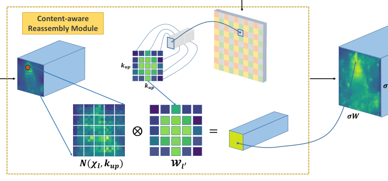
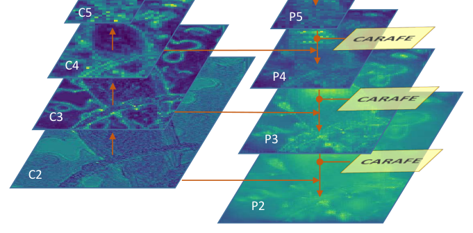
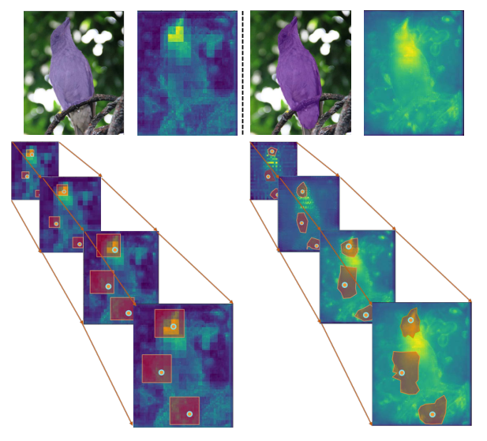
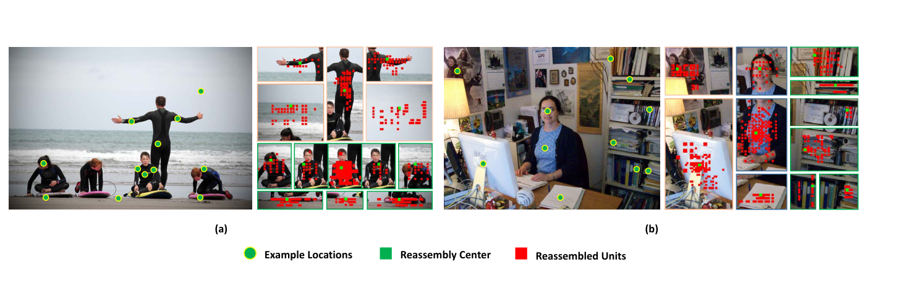
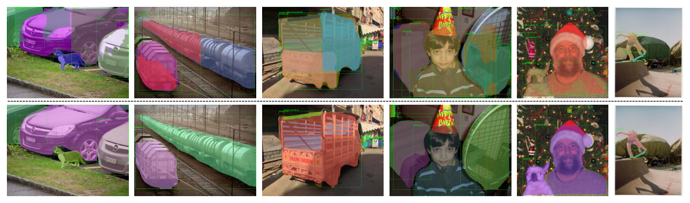
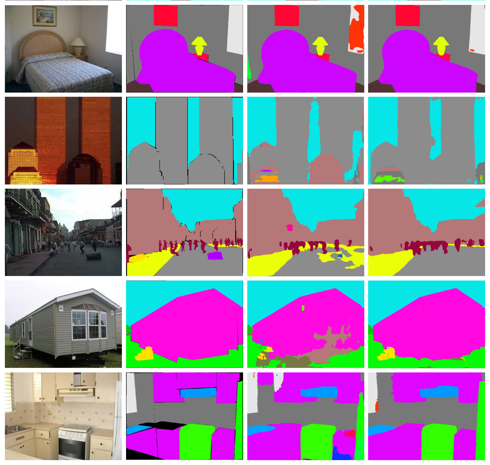
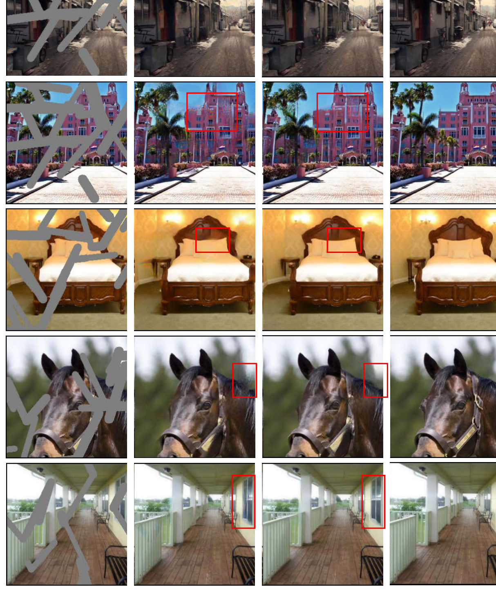

# CARAFE: Content-Aware ReAssembly of FEatures

Paper Reading 是从个人角度进行的一些总结分享，受到个人关注点的侧重和实力所限，可能有理解不到位的地方。具体的细节还需要以原文的内容为准，博客中的图表若未另外说明则均来自原文。

| 论文概况 | 详细 |
| --- | --- |
| 标题 | 《CARAFE: Content-Aware ReAssembly of FEatures》 |
| 作者 | Jiaqi Wang、Kai Chen、Rui Xu、Ziwei Liu、Chen Change Loy、Dahua Lin |
| 发表会议 | ICCV |
| 会议等级 | CCF-A |
| 发表年份 | 2019 |
| 论文代码 | [https://github.com/open-mmlab/mmdetection](https://github.com/open-mmlab/mmdetection) |

作者单位：

1. 香港中文大学 - 商汤联合实验室（CUHK - SenseTime Joint Lab, The Chinese University of Hong Kong）
2. 南洋理工大学（Nanyang Technological University）

## 研究动机

特征上采样是现代卷积网络架构中最基础的操作之一，表现为把高层低分辨率特征图放大到目标分辨率、或与低层高分辨率特征图融合，导致其设计质量直接决定目标检测、实例/语义分割等密集预测任务的上限。FPN 的自顶向下路径、U-Net 的跳跃连接、Stacked Hourglass 的逐级恢复，都依赖这一操作。然而最常用的最近邻与双线性插值只按像素间的空间距离取值，仅利用亚像素邻域内的信息，无法捕获密集预测所需的丰富语义。另一条可学习上采样路线是反卷积：它作为卷积的逆操作学习一组上采样核，但同一组核对整幅图所有样本共享、与内容无关，难以响应局部变化；且核尺寸增大时参数量与计算量急剧上升，使反卷积很难覆盖小邻域之外的更大区域，表达力受限。Pixel Shuffle 走通道重排路线、GUM 用可学习偏移做引导插值，同样要么局限于小邻域上下文、要么需要昂贵计算才能完成自适应插值。至此缺口收窄为：暂未有上采样算子能同时满足大感受野聚合上下文、按实例内容在线自适应、以及足够轻量可即插即用这三个要求。

## 文章贡献

针对插值算子语义盲区与反卷积核实例无关、开销过大的问题，本文提出了内容感知的特征重组算子 CARAFE，把上采样拆解为「逐位置预测重组核」与「按核重组局部特征」两步。其核心是核预测模块：先用 1×1 卷积做通道压缩，再用内容编码器依据局部内容生成每个目标位置专属的重组核，最后用核归一化器对核做空间 softmax；重组模块则以预测核为权重，对以源位置为中心的邻域做加权求和，并按空间块重排完成上采样。这些空间自适应权重不是网络参数，而是由轻量全卷积模块在线预测。首先本文给出算子的形式化定义与三个子模块设计，接着讨论其与动态滤波、空间注意力、STN、可变形卷积的关系，最终在 FPN、mask head、UperNet 与修复 U-Net 中无缝替换原有上采样器。实验表明，CARAFE 在 MS COCO test-dev 上为 Faster R-CNN 带来 1.2% AP、为 Mask R-CNN 带来 1.3% AP，在 ADE20k val 上为 UperNet 带来 1.8% mIoU，在 Places val 上为 Global&Local 带来 1.1 dB PSNR，而计算开销可忽略不计。

## 本文方法

### 问题形式化与整体框架

CARAFE 作为一个带内容感知核的重组算子工作：第一步根据每个目标位置的内容预测重组核，第二步用预测核重组局部特征。给定大小为 $C \times H \times W$ 的特征图 $X$ 与整数上采样倍率 $\sigma$，CARAFE 产出大小为 $C \times \sigma H \times \sigma W$ 的新特征图 $X'$；对输出的任意目标位置 $l' = (i', j')$，其对应的输入源位置为 $l = (i, j)$，其中 $i = \lfloor i'/\sigma \rfloor$、$j = \lfloor j'/\sigma \rfloor$，并记 $N(X_l, k)$ 为 $X$ 中以 $l$ 为中心的 $k \times k$ 子区域。两步计算定义为：

$$W_{l'} = \psi(N(X_l, k_{encoder}))$$

$$X'_{l'} = \varphi(N(X_l, k_{up}), W_{l'})$$

其中 $\psi$ 是核预测模块，$k_{encoder}$ 是内容编码器的核尺寸；$\varphi$ 是内容感知重组模块，$k_{up}$ 是重组核尺寸，$W_{l'}$ 是位置 $l'$ 的重组核。整体框架如下图所示。

图中左半为核预测模块（通道压缩器、内容编码器、核归一化器），右半为内容感知重组模块，$\otimes$ 表示重组操作。每个源位置对应 $\sigma^2$ 个目标位置，每个目标位置需要一个 $k_{up} \times k_{up}$ 的重组核，因此核预测模块的输出尺寸为 $C_{up} \times H \times W$，其中 $C_{up} = \sigma^2 k_{up}^2$。下面按子模块展开。

### 通道压缩器

通道压缩器的目标是压低后续核预测的参数与计算量。它用一个 1×1 卷积把输入特征通道从 $C$ 压到 $C_m$：通道变少后，内容编码器在相同预算下还可以使用更大的核尺寸；实验显示在可接受范围内压缩通道不会损害性能。压缩后的特征送入内容编码器。

### 内容编码器

内容编码器负责依据输入特征的内容生成重组核。它使用核尺寸为 $k_{encoder}$ 的卷积层，参数量为 $k_{encoder} \times k_{encoder} \times C_m \times C_{up}$。直观上，增大 $k_{encoder}$ 能扩大编码器感受野、利用更大区域的上下文来预测重组核，但计算复杂度随核尺寸平方增长而收益并不成比例。原文通过消融总结出经验公式 $k_{encoder} = k_{up} - 2$，是性能与效率之间的良好折中。编码器输出的原始核交给核归一化器处理。

### 核归一化器

核归一化器在重组之前对每个 $k_{up} \times k_{up}$ 的重组核在空间维度上做 softmax 归一化。归一化强制核内权重之和为 1，相当于在局部区域内做一次软选择；正因如此，CARAFE 不会对特征图做任何缩放、也不改变其均值，这正是该算子被命名为「特征重组」的原因。归一化后的核送入重组模块。

### 内容感知重组模块

重组模块用预测核对局部区域做加权求和。对目标位置 $l'$ 与以 $l = (i, j)$ 为中心的方形区域 $N(X_l, k_{up})$，记 $r = \lfloor k_{up}/2 \rfloor$，重组计算为：

$$X'_{l'} = \sum_{n=-r}^{r} \sum_{m=-r}^{r} W_{l'}(n, m) \cdot X(i+n, j+m)$$

其中 $W_{l'}(n, m)$ 是重组核在偏移 $(n, m)$ 处的权重，$X(i+n, j+m)$ 是邻域内的源特征。有了重组核，邻域内每个像素对上采样像素 $l'$ 的贡献各不相同，依据的是特征内容而非位置距离；局部区域中相关点的信息被更多地关注，重组后特征图的语义可以比原始特征更强。重组结果按空间块重排后即得到上采样输出。

### 与已有算子的关系

CARAFE 与若干设计哲学相近的算子存在清晰的包含或对比关系。与动态滤波相比，二者都是内容感知算子，但动态滤波是「预测滤波层 + 滤波层」的两步卷积、计算沉重，且每个位置的预测核参数为 $C \times C \times K \times K$，而 CARAFE 只做局部区域的特征重组、不学习跨通道变换，核参数仅 $K \times K$，内存与速度都更优。与空间注意力相比，后者预测与输入同尺寸的注意力图逐点缩放特征，是逐点指导的缩放算子；CARAFE 是区域指导的重组算子，空间注意力可视为重组核尺寸为 1 时（忽略核归一化）的特例。与 STN 相比，后者预测全局参数化变换并 warp 特征，假设过强且难训练；CARAFE 用逐位置重组建模更灵活的局部几何。与可变形卷积相比，后者预测核偏移并与常规卷积结合，是重参数算子，计算量约为 CARAFE 的 24 倍，且对参数初始化敏感。

### 在主流架构中的集成

CARAFE 可以无缝替换任何需要上采样器的位置。检测与实例分割中，FPN 自顶向下路径先用最近邻插值把低分辨率特征上采样 2 倍再与高分辨率特征融合，本文把所有特征层的最近邻插值替换为 CARAFE，无需其它改动，结构如下图所示；Mask R-CNN 的 mask head 末端还用一层反卷积把 14×14 的预测上采样到 28×28，同样可替换为 CARAFE 且计算更少。

这一替换的效果如下图所示，虚线左侧为 Mask R-CNN 的 FPN 多层特征、右侧为替换为 CARAFE 后的结果。

每个上采样位置从一个以重组中心为核心的预定义区域内聚合信息，红色区域即被重组进对应中心的累积范围；经 CARAFE 上采样后的特征图能更准确地刻画目标形状，从而预测出更好的实例分割结果。

语义分割中，UperNet 在 PPM、FPN、FUSE 三处使用上采样：PPM 把 {1×1, 2×2, 3×3, 6×6} 的池化特征恢复原尺寸，因上采样倍率过大，采用两步策略——先双线性插值到原图一半尺寸、再用 CARAFE 上采样 2 倍；FPN 的替换方式与检测相同；FUSE 把 P3、P4、P5 上采样到 P2 尺寸后拼接，等价于逐级上采样-拼接的串行过程，本文用 CARAFE 替换其中的串行双线性上采样。图像修复中，Global&Local 与 Partial Conv 的 U-net 后半有两个上采样层，直接替换即可；对 Partial Conv，还可以用内容感知重组核同步更新掩码，方便地保留掩码传播机制。

### 计算复杂度

对输入通道为 $C_{in}$ 的特征图做 $\sigma$ 倍上采样，CARAFE 的每像素 FLOPs 计算为：

$$2(C_{in} + 1)C_m + 2(C_m k_{encoder}^2 + 1)\sigma^2 k_{up}^2 + 2\sigma^2 k_{up}^2 C_{in}$$

其中三项分别对应通道压缩、核预测与重组操作。以 256 通道、$H \times W$ 的特征图做 2 倍上采样为例，CARAFE 引入的额外计算量仅为 $H \times W \times 199k$ FLOPs，而反卷积为 $H \times W \times 1180k$ FLOPs，约为其六分之一。这一开销水平使 CARAFE 可以作为通用构建块直接嵌入现代网络。

## 实验结果

### 实验设置

实验覆盖四类密集预测任务：目标检测与实例分割在 MS COCO 2017 上训练、默认在 val 上评测（主结果为 test-dev 2018），指标为 IoU 从 0.5 到 0.95 的 mAP 系列；语义分割用 ADE20k，指标为 mIoU 与像素精度 P.A.；图像修复用 Places，指标为 L1 误差与 PSNR。检测与实例分割采用 ResNet-50 + FPN 的 Faster R-CNN 与 Mask R-CNN，遵循 Detectron 与 MMDetection 的 1x 训练计划：短边 800、长边不超过 1333，同步 SGD 初始学习率 0.02、momentum 0.9、weight decay 0.0001，8 卡 batch size 16，共 12 epochs 并在第 8 与 11 轮把学习率乘 0.1。语义分割用 UperNet 官方实现与 ResNet-50，训练时短边从 {300, 375, 450, 525, 600} 随机选取、长边不超过 1200，测试短边 450，poly 策略 power 取 0.9，训练 20 epochs 并使用同步 BN。CARAFE 默认超参为 $C_m = 64$、$k_{encoder} = 3$、$k_{up} = 5$。

### 对比实验

MS COCO test-dev 2018 上的主结果见原文 Table 1，截图如下。

CARAFE 把 Faster R-CNN 的 bbox AP 从 36.9 提升到 38.1，把 Mask R-CNN 的 bbox AP 从 37.8 提升到 38.8、mask AP 从 34.6 提升到 35.9，且 AP_S、AP_M、AP_L 的提升均超过 1 个点，表明收益对各种目标尺度都成立。把 FPN 中的上采样器换成不同算子做横向对比（原文 Table 2），Nearest、Bilinear、Nearest + Conv、Bilinear + Conv、Deconv、Pixel Shuffle、GUM、Spatial Attention 的 AP 分别为 36.5、36.7、36.6、36.6、36.4、36.5、36.9、36.9，而 CARAFE 达到 37.8，FLOPs 仅 199k、参数仅 74k；「插值 + 卷积」的结果说明额外参数本身带不来显著增益，其余可学习算子均不及 CARAFE，可见上采样算子的设计才是关键。mask head 中只替换反卷积层的对比（原文 Table 3）里，CARAFE 以 34.7 的 mask AP 居首（Bilinear 与 Deconv 为 34.2、Pixel Shuffle 为 34.4、GUM 为 34.3、Spatial Attention 为 34.1）。FPN 与 mask head 两处分别或同时接入 CARAFE 的结果见原文 Table 4，截图如下。

只改 FPN 得到 38.6 bbox AP 与 35.2 mask AP，只改 mask head 得到 37.3 与 34.7，两处同时替换进一步到 38.6 与 35.7，收益可以叠加。语义分割上，UperNet 的单尺度 mIoU 从 40.44% 提升到 42.23%（P.A. 从 79.80% 到 80.34%），超过 PSPNet 的 41.68% 与 PSANet 的 41.92%。图像修复结果见原文 Table 7，截图如下。

Global&Local 的 PSNR 从 19.58 dB 提升到 20.71 dB（+1.1 dB），Partial Conv 从 20.78 dB 提升到 20.98 dB（+0.2 dB），L1 误差同步下降，说明 CARAFE 在低层视觉任务上同样有效。

### 消融实验

通道压缩通道数 $C_m$ 的消融（原文 Table 8）显示，$C_m$ 取 16 至 256 时 AP 稳定在 37.6 至 37.8，压缩到 64 不降精度且更高效，完全去掉压缩器性能相同但更慢，故默认取 64。核尺寸组合的消融（原文 Table 9）显示，单独增大 $k_{encoder}$ 或 $k_{up}$ 收益有限，同时增大才有提升：(1, 3)、(1, 5)、(3, 3) 均为 37.3，(3, 5) 到 37.8，(5, 7) 到 38.1，(7, 7) 为 38.0，经验公式 $k_{encoder} = k_{up} - 2$ 在所有设置下都是好选择；出于效率默认取 (3, 5)。核归一化方式的消融（原文 Table 10）显示 Sigmoid 为 37.4，Sigmoid 归一化与 Softmax 均为 37.8，说明把重组核归一化为和 1 至关重要。UperNet 三个组件逐个替换的消融见原文 Table 6，截图如下。

单独替换 PPM、FPN、FUSE 分别得到 40.85、40.79、41.06 的 mIoU（基线 40.44），两两组合进一步提升，三者全换达到 42.23，表明三处上采样都能从内容感知重组中获益且收益互补。

### 可视化分析

CARAFE 的重组过程可视化如下图所示，绿圈为采样位置、红点为重组时的高权重来源。

在 FPN 自顶向下路径中，低分辨率特征被连续上采样多次，高分辨率特征图上的一个像素实际从更大的区域重组信息。人体上的位置倾向从同一人体的其它点重组，而非邻近的背景或其它目标；语义较弱的背景区域则重组更均匀、或偏向低层纹理相似的点，可见 CARAFE 确实是内容感知的。COCO 2017 val 上实例分割的定性对比如下图所示，上行为基线、下行为 CARAFE。

内容感知重组使特征图判别性更强，目标掩码更完整准确。ADE20k 语义分割与 Places 图像修复的定性对比分别如下图所示。

语义分割中 CARAFE 版本的物体边界与细小结构更完整。图像修复的定性对比如下图所示。

修复任务中 CARAFE 版本在缺失区域生成的纹理与结构更接近原图，与定量指标的提升互相印证。

## 优点和创新点

个人认为，本文有如下一些优点和创新点可供参考学习：

1. 把上采样算子归约为「逐位置核预测 + 局部加权重组」的极简形式，每位置核参数仅 K×K、256 通道 2 倍上采样只需 199k FLOPs 每像素级开销，远低于反卷积的 1180k，为轻量动态算子设计提供了通用模板。
2. 内容感知设计自洽且可验证：softmax 归一化使核和为 1 从而不改变特征均值，重组可视化显示语义相似的点被优先聚合，机制解释与检测、分割、修复四类任务的增益互相印证，说服力强。
3. 通用性与工程可用性突出：可无缝替换 FPN、mask head、UperNet 三组件与修复 U-Net 中的既有上采样器，无需改动其余结构，并已在 MMDetection 中开源，便于直接嵌入现有检测与分割流水线。
