# Context and Spatial Feature Calibration for Real-Time Semantic Segmentation

Paper Reading 是从个人角度进行的一些总结分享，受到个人关注点的侧重和实力所限，可能有理解不到位的地方。具体的细节还需要以原文的内容为准，博客中的图表若未另外说明则均来自原文。

| 论文概况 | 详细 |
| --- | --- |
| 标题 | 《Context and Spatial Feature Calibration for Real-Time Semantic Segmentation》 |
| 作者 | Kaige Li、Qichuan Geng、Maoxian Wan、Xiaochun Cao、Zhong Zhou |
| 发表期刊 | IEEE Transactions on Image Processing（TIP） |
| 期刊等级 | CCF-A |
| 发表年份 | 2023 |
| 论文代码 | [https://github.com/kaigelee/CSFCN](https://github.com/kaigelee/CSFCN) |

作者单位：

1. 北京航空航天大学虚拟现实技术与系统全国重点实验室（State Key Laboratory of Virtual Reality Technology and Systems, Beihang University）
2. 首都师范大学信息工程学院（Information Engineering College, Capital Normal University）
3. 中山大学网络空间安全学院（School of Cyber Science and Technology, Sun Yat-sen University）
4. 中关村实验室（Zhongguancun Laboratory）

## 研究动机

实时语义分割是自动驾驶、视频监控与遥感等落地场景的基础任务，表现为要在严格的帧率约束下给每个像素标注类别，导致精度与速度之间的权衡长期难以令人满意。以 FCN 为代表的精度导向方法用深层网络挖掘场景上下文与空间细节，但高计算量拖慢了推理速度；为了实时化，轻量网络与高效解码器被大量提出，然而轻量化的信息损失会造成输入与输出的错位。进一步看，错位问题有两处来源：其一是像素-上下文错配，现有解码器里的上下文建模方法（如 PPM 与 ASPP）在预定义的固定矩形区域内为所有像素聚合相同的上下文，激活区域可能过大或过小，要么引入无关信息、要么提供不了足够的语义线索，对每个像素的上下文需求缺乏自适应性；其二是空间特征错位，反复下采样使输出特征与输入图像在空间上对不齐，无参数的上采样会进一步加剧这一问题，在边界处引入更多预测错误。两类错位的具体形态如下图所示。

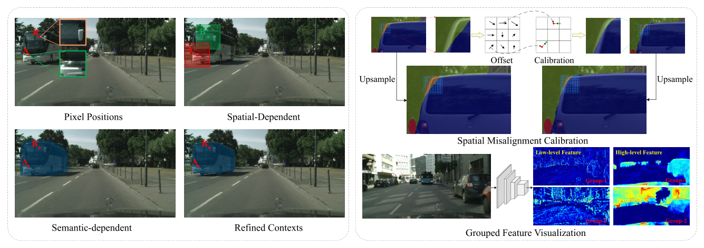

图 (a) 中 PPM 与 ASPP 等方法在固定矩形区域内为 A、B 两个像素建模空间相关的上下文，被激活的区域或大或小，与各自真实的上下文需求错配；图 (b) 中蓝、红网格分别标出预测正确与错误的区域，空间错位使边界附近出现成片误预测，且不同特征图承载的语义各异、呈现分组特性。自注意力能够为每个像素捕获有益特征并抑制无关信息，理应缓解上述两个问题，但其高昂的计算开销让实时方法无法承受。两类速度-精度权衡对比如下图所示。

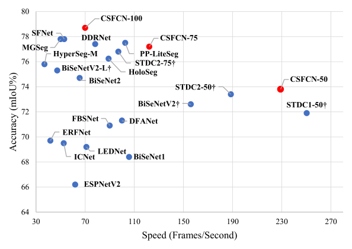

图中左上角的点代表兼顾高精度与实时候选方法，说明二者并非不可兼得，关键在于用什么代价换取自适应的上下文与空间校准能力。暂未有工作在实时约束下同时针对像素-上下文错配与空间特征错位这两个瓶颈给出轻量解法。

## 文章贡献

针对上下文建模不随输入自适应、跨层特征空间错位而自注意力又过于昂贵的问题，本文提出了轻量的上下文与空间特征校准网络 CSFCN，用池化与采样两种简化的空间注意力机制分别完成上下文特征校准与空间特征校准。首先，上下文特征校准模块 CFC 设计级联金字塔池化，通过复用前层池化结果高效捕获嵌套的多尺度上下文，再计算像素-上下文相似度，为每个像素聚合语义相关的私有上下文；接着用上下文重校准块 CRB 对语义上下文的响应值做条件化调整，锐化大目标并保留空间细节；最终，空间特征校准模块 SFC 沿通道维把特征分成多组子特征，用可学习的采样把最有利于当前位置预测的特征搬到当前位置，并以门控掩码自适应融合跨层特征。实验表明，CSFCN 在 Cityscapes 与 CamVid 测试集上分别取得 78.7% mIoU @ 70.0 FPS 与 77.8% mIoU @ 179.2 FPS，达到当时最优的速度-精度权衡。

## 本文方法

### CSFCN 整体架构

CSFCN 采用非对称的编码器-解码器结构，数据流为「骨干提特征 → CFC 校准上下文 → SFC 校准空间 → 输出层」。整体结构如下图所示，骨干采用 ImageNet 预训练的 ResNet-18（也可替换为其它 CNN），各阶段特征先经一个缩减比为 r（默认 r = 2）的 3×3 卷积降维以压低计算量，再送入两个校准模块，最后由包含卷积层与上采样层的输出层生成预测。

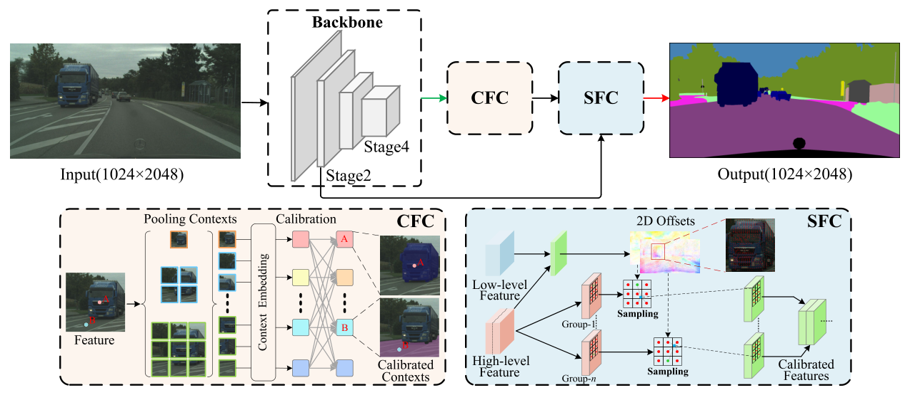

两个核心模块的分工是：CFC 面向像素-上下文错配，为每个像素构建私有上下文以增强判别性；SFC 面向空间特征错位，产出语义强且边界准的特征。下面按模块逐一展开。

### CFC：为每个像素定制上下文

CFC 的目标是把「所有像素共享同一上下文」改造成「上下文是输入的函数、且逐像素不同」。其整体计算定义为：

$$y_i = \alpha_i \cdot \sum_{j=1}^{M} f(x_i, z_j)\, z_j + x_i$$

其中各符号含义如下表所示。

| 符号 | 含义 |
| --- | --- |
| $x_i$、$y_i$ | 第 $i$ 个位置的输入特征与输出特征，均属 $\mathbb{R}^{C \times 1}$ |
| $\alpha_i$ | 重校准因子 |
| $z_j$ | 第 $j$ 个上下文，$j \in [1, M]$ |
| $f(\cdot)$ | 计算特征间亲和度的成对函数 |

直观上，这一形式与自注意力同源，但把像素-像素相似度换成了像素-上下文相似度，聚合的是语义更近而非空间更近的区域。由于大目标占据更多像素，池化得到的全局上下文天然偏向大目标，直接均摊给每个位置会淹没小目标的表达并造成过平滑，因此式中还引入 $\alpha_i$ 做二次调整。模块内部由级联金字塔池化、亲和度计算与 CRB 三步组成，实现流程如下图所示。

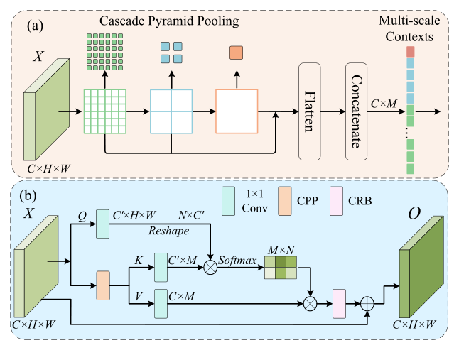

图 (a) 中级联金字塔池化逐级复用池化结果，把多尺度输出展平拼接成 $C \times M$ 的多尺度上下文；图 (b) 中 $Q$ 与 $K$ 做矩阵乘并经 softmax 得到 $M \times N$ 的亲和度图，$V$ 按亲和度聚合后经 CRB 重校准，再与输入残差相加输出 $O$。

### 级联金字塔池化

级联金字塔池化块 CPP 用于高效捕获多尺度上下文，其关键是复用前一层的池化结果、避免重复计算。给定特征 $X \in \mathbb{R}^{C \times H \times W}$，先用 1×1 卷积降维得到 $Q \in \mathbb{R}^{C' \times H \times W}$（默认 $C' = 32$、$C = 256$），再经多级自适应池化得到金字塔上下文 $Z \in \mathbb{R}^{C \times M}$。池化层输出尺寸取 $n \in [1, 2, 3, 6]$ 时，上下文总数 $M = \sum n^2 = 50$。由于池化在同质空间网格上进行，输入长宽比不为 1 时会造成池化特征的信息冗余，为此 CPP 让池化输出的长宽比与输入保持一致，例如方形裁剪训练时最小输出为 1×1，而 1024×2048 输入下则为 1×2。$Z$ 随后经两个带 BN 与 ReLU 的卷积层，产出两种上下文表示 $K \in \mathbb{R}^{C' \times M}$ 与 $V \in \mathbb{R}^{C \times M}$，分别供亲和度计算与上下文聚合使用。

### 像素-上下文亲和度

亲和度的作用是度量每个像素与各上下文的语义相关程度，充当聚合权重的空间注意力图。将 $Q$ 重排为 $\mathbb{R}^{N \times C'}$（$N = H \times W$）后与 $K$ 做矩阵乘并接 softmax，像素-上下文亲和度计算为：

$$\Omega_{i,j} = \frac{\exp(Q_i \cdot K_j)}{\sum_{j=1}^{M} \exp(Q_i \cdot K_j)}$$

其中 $\Omega_{i,j}$ 是第 $i$ 个像素 $Q_i$ 与第 $j$ 个上下文 $K_j$ 的亲和度，$\Omega \in \mathbb{R}^{N \times M}$。这等价于把 softmax 归一化的注意力从 $N \times N$ 的像素对压缩到 $N \times M$ 的像素-上下文对，$M$ 只有 50，计算量因此远小于自注意力。之后用 $V$ 与 $\Omega^T$ 做矩阵乘，得到校准后的语义上下文 $E \in \mathbb{R}^{C \times N}$，重排回 $\mathbb{R}^{C \times H \times W}$ 后送入 CRB。

### 上下文重校准块 CRB

CRB 的目标是条件化地学习局部上下文：池化上下文偏向大模式，均匀分发会压制小模式并带来过平滑，CRB 通过锐化大目标、保留空间细节来精调上下文。其计算为：

$$E' = \underbrace{\tanh(W_2(W_1(X + E)))}_{\alpha} \cdot E + E$$

其中 $E'$ 是精调后的上下文；$\alpha \in \mathbb{R}^{C \times H \times W}$ 是重校准因子；$W_1 \in \mathbb{R}^{\frac{C}{4} \times C \times 1 \times 1}$ 与 $W_2 \in \mathbb{R}^{C \times \frac{C}{4} \times 3 \times 3}$ 是卷积层。选择 tanh 是为了去除冗余信息、凸显上下文中有益的信息（如边界与小目标）。CFC 的最终输出采用残差式的逐元素求和：

$$Y = X + E'$$

其中 $Y \in \mathbb{R}^{C \times H \times W}$ 是校准后的特征。这里用求和而非拼接，是为了进一步压低计算成本；$Y$ 随后作为强语义特征交给 SFC 做空间层面的校准。

### SFC：可学习采样的空间校准

SFC 用于修复反复下采样带来的空间错位。以往方法先把低分辨率特征 $F_\ell$ 双线性上采样、再与高分辨率特征 $F_h$ 相加或拼接，但空间错位与巨大的表示鸿沟使直接融合效果有限；且不同特征图承载的语义不同，沿通道维做统一的对齐会损害性能。SFC 的做法是用可学习的采样重构特征：设特征图上各位置的空间坐标为 $\{(1,1), (1,2), \dots, (H,W)\}$，学习到的 2D 偏移图为 $\Delta \in \mathbb{R}^{2 \times H \times W}$，校准函数 $T(\cdot)$ 定义为：

$$U_{h,w} = \sum_{h'}^{H} \sum_{w'}^{W} F_{h',w'} \cdot \max(0,\, 1 - |h + \Delta^1_{h,w} - h'|)\, \cdot \max(0,\, 1 - |w + \Delta^2_{h,w} - w'|)$$

其中 $U_{h,w}$ 是位置 $(h,w)$ 的输出；$\Delta^1_{h,w}$、$\Delta^2_{h,w}$ 是该位置学得的纵横两方向偏移；求和遍历所有整数坐标 $(h', w')$。由于采样点 $p = (h + \Delta^1_{h,w},\ w + \Delta^2_{h,w})$ 是任意分数位置，上式枚举全部整数位置并用双线性插值核取值。直观上，就是把对当前位置预测最有利的特征采样过来替换当前位置的特征，一次采样即完成校准，无需像自注意力那样聚合所有位置的信息。

### 分组校准与门控融合

特征图各自刻画不同的语义（一个目标或一种 stuff），不存在对所有特征图都最优的单一校准方式，统一校准会削弱整体特征的判别性。因此 SFC 先沿通道维把特征分成 $G$ 组子特征、组内分别校准；又因为 $F'_h$ 富含空间细节而 $F'_\ell$ 语义更强，单纯校准后相加仍无法跨越表示鸿沟，SFC 再无缝集成门控机制自适应地融合两级特征：

$$O = \beta_\ell \otimes F'_\ell + \beta_h \otimes F'_h$$

其中 $\beta_\ell$、$\beta_h$ 是控制两级特征信息流的门控掩码，$\otimes$ 为逐元素相乘，$O$ 是融合输出。模块的完整流程是：先用两个卷积层把 $F_\ell$、$F_h$ 的通道统一到 $C$（默认 128），双线性上采样 $F_\ell$ 后与 $F_h$ 拼接，再经一个卷积块同时预测两组偏移图 $\Delta_\ell, \Delta_h \in \mathbb{R}^{(2 \times G) \times H \times W}$ 与两张门控掩码 $\beta_\ell, \beta_h \in \mathbb{R}^{1 \times H \times W}$，校准后的跨层特征逐元素求和输出。SFC 的形式化写法为：

$$O = \beta_\ell \otimes T(U(W_\ell F_\ell),\, \Delta_\ell) + \beta_h \otimes T(W_h F_h,\, \Delta_h)$$

其中 $U(\cdot)$ 是双线性上采样函数，$W_\ell \in \mathbb{R}^{C_\ell \times C' \times 3 \times 3}$、$W_h \in \mathbb{R}^{C_h \times C \times 3 \times 3}$ 是带 BN 与 ReLU 的卷积层。整个模块的内部结构如下图所示。

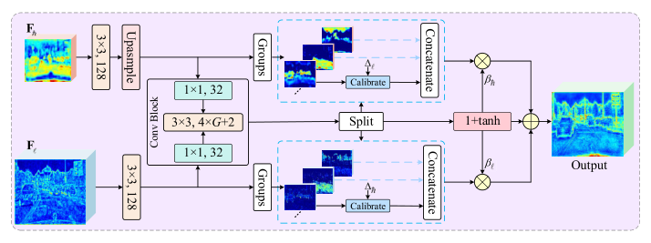

图中左侧为跨层特征的分组切分，右侧为每组子特征各自的偏移预测与校准，可以看到「先分组、再逐组校准、后门控融合」的完整数据流。

### 残差初始化：插入即无损

SFC 采用残差思想缓解训练初期大偏移与掩码预测误差的负面影响：把卷积块最后一层卷积的权重初始化为零，让偏移与掩码从零映射出发逐步学习。门控掩码采用 $1 + \tanh$ 激活，于是初始时 $T(F, 0)$ 退化为恒等映射、$\beta = 1 + \tanh(0) = 1$，SFC 的输出简化为：

$$O = U(W_\ell F_\ell) + W_h F_h$$

其中各符号与式 (7) 相同。这等价于 FCN 类方法中最简单的「上采样后相加」融合策略，意味着把 SFC 插入网络不会破坏其原有性能，校准能力随训练逐渐获得——这一设计让模块可以安全地嫁接到任意编码器-解码器结构中。

## 实验结果

### 实验设置

实验在 Cityscapes 与 CamVid 两个街景分割基准上进行，统计信息见原文 Table I，指标为 mIoU、FPS、FLOPs 与参数量。基线模型是带辅助监督分支的 FCN32 式 ResNet-18 网络。训练用 SGD（momentum 0.9、weight decay 5e-4），初始学习率 1e-2 并按 poly 策略衰减，学习率衰减因子为：

$$\left(1 - \frac{iter}{total\_iter}\right)^{0.9}$$

其中 $iter$ 是当前迭代数，$total\_iter$ 是总迭代数（Cityscapes 为 120K、CamVid 为 40K）。数据增强包括随机色彩抖动、随机水平翻转、随机裁剪与随机缩放，Cityscapes 缩放范围 [0.125, 2.0]、裁剪 1024×1024，CamVid 缩放范围 [0.5, 2.0]、裁剪 720×960。测试时 BN 层被合并进卷积以进一步提速。

### CFC 消融

上下文粒度由池化输出尺寸决定的 $M$ 控制。原文 Table II 显示，保持池化输入输出长宽比一致（KAR）能明显涨点（76.96% vs. 77.59%）；$M$ 增大时性能上升，输出尺寸超过 (1, 2, 3, 6) 后趋于平台，而过度细分（如 (1, 3, 6, 8)）反而掉点（77.27% vs. 77.59%），说明每格上下文信息过少就无法提供高质量语义线索，最终默认取 (1, 2, 3, 6)。Table III 把 CFC 与多种上下文建模方法在同一设置下对比：CFC 取得 78.09% mIoU，在 FLOPs 更低的情况下比 AlignCM 高 0.83 个点（78.09% vs. 77.26%）；与 PAM 相比精度更高（78.09% vs. 77.56%）而 FLOPs 少 81.4%，可见像素-上下文匹配以极小代价换来了超越自注意力的上下文建模能力。

### SFC 消融

原文 Table IV 考察分组数与门控激活的设置：采用 $1+\tanh$ 激活时，$G=2$ 比 $G=1$（不分组）高 0.97 个点（78.12% vs. 77.15%），而额外计算量几乎不变（6.80G vs. 6.73G）；$1+\tanh$ 也优于 sigmoid（78.12% vs. 77.37%），归因于其更好的初始行为。Table V 与相似方法对比：直接修正预测输出的 iGUM 难以取得高精度，FAM 与 AlignFA 忽略层级与子特征间的表示差异，性能偏低（76.21% 与 75.25% mIoU），采用注意力特征融合的 iAFF 相对较好（77.22%），而 SFC 同时做组内校准与门控加权融合，取得 78.12% mIoU 与 70.02 FPS，表明「分组校准 + 门控融合」的组合优于单一策略。

逐类结果（原文 Table VI）进一步给出两模块的作用位置：CFC（无 CRB）让基线在 truck 与 train 上分别提升 21.5% 与 22.0%，在不显眼、不完整目标上优于 PPM（rider +2.2%、motorcycle +3.3%）；加上 CRB 后 pole、traffic light、traffic sign 再涨 0.7%、0.8%、1.2%。SFC（$G=1$）使 pole、traffic light、traffic sign 提升 4.7%、4.6%、4.7%；相对 FAM 与 AlignFA，truck 提升 6.9% 与 1.6%、pole 提升 0.8% 与 7.8%。完整 CSFCN 达到 79.00% mIoU，19 类中 12 类最优。

### SOTA 对比与效率

Cityscapes 测试集上，CSFCN-100 以 70.0 FPS 取得 78.7% mIoU，分别超出 SFANet、MGSeg、HyperSeg 与 BiSeNetV2-L 0.6%、0.9%、2.9% 与 3.4%；CSFCN-50 在与 STDC1-Seg50 推理速度相近的情况下高出 1.9% mIoU；同骨干（ResNet-18）同量级 FLOPs（55.3G vs. 56.2G）下 CSFCN-75 大幅领先 BiSeNet2 2.5%。换用 MobileNetV3-L 骨干的 CSFCN (M) 也能以更少计算量（21.7G FLOPs）取得 75.1% mIoU。CamVid 测试集上，CSFCN 取得 77.8% mIoU @ 179.2 FPS；相比 ENet 与 BiSeNet2，大目标 car 提升 12.1% 与 10.8%、小目标 pole 提升 9.9% 与 13.4%；用 Cityscapes 预训练后更达到 81.0% mIoU，验证了跨数据集泛化能力。关键结果汇总如下表。

| 数据集与设置 | mIoU | 速度 |
| --- | --- | --- |
| Cityscapes test（CSFCN-100） | 78.7% | 70.0 FPS |
| Cityscapes test（CSFCN (M)，MobileNetV3-L） | 75.1% | 未获取 |
| Cityscapes val（完整 CSFCN） | 79.00% | 未获取 |
| CamVid test（720×960 输入） | 77.8% | 179.2 FPS |
| CamVid test（Cityscapes 预训练） | 81.0% | 179.2 FPS |

效率方面，原文用统一环境复测各方法，并引入内存访问量 MAC 评估轻量网络的真实速度，其定义为：

$$MAC = (h_{in} \cdot w_{in} \cdot c_{in} + h_{out} \cdot w_{out} \cdot c_{out}) + c_{in} \cdot c_{out} \cdot k \cdot k$$

其中前一项是输入/输出特征的内存访问，后一项是卷积核权重的内存访问，$k$ 为核尺寸。Table X 显示 CSFCN 比 MGSeg 精度更高且快约 17%，与 SFANet FLOPs 相近却快 24%，归因于 SFANet 结构更复杂、MAC 更高；CSFCN (M) 比 SFANet 提速 39.6%（63.4 FPS vs. 45.4 FPS）而 FLOPs 从 99.4G 降到 21.7G。与精度导向方法相比，CSFCN 整体精度也超过采用大膨胀率 ResNet-101 骨干的 DUC（78.7% vs. 77.6%）。原文还在 384×768 到 1024×2048 四档分辨率上对比了同骨干的 SwiftNet 与 BiSeNet，如下图所示。

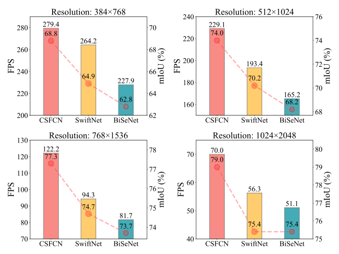

CSFCN 在各分辨率下都同时取得最优速度与精度：768×1536 输入下已达 77.3%，超过对比方法全分辨率下的最好成绩 75.4%；最小分辨率 384×768 下仍有 68.8%，高于 65.0% 的最低可接受 mIoU。原文把速度优势归因于更少的 FLOPs、更少的 MAC 与更高的并行度（分支更少）。

### 可视化分析

CFC 的定性效果如下图所示，与 PPM 等上下文建模模块对比。

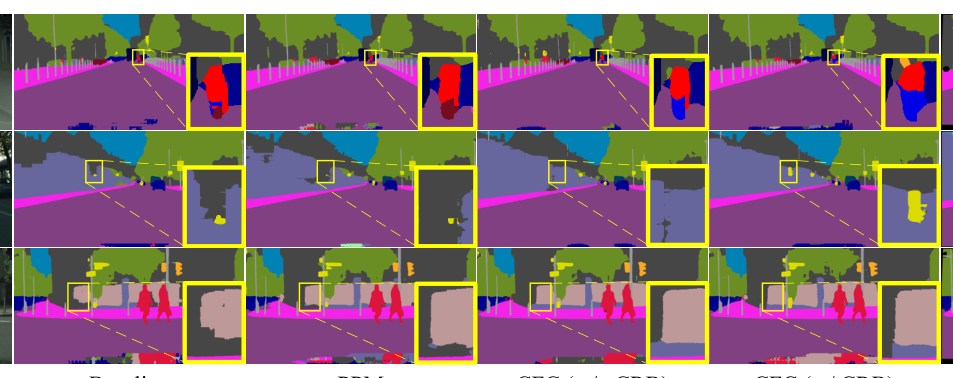

池化得到的上下文常被显著目标或 stuff 主导，PPM 对不显眼、不完整目标的预测被削弱甚至忽略（如第一行的 motorcycle、第二行的 traffic sign）；CFC 为每个像素定制上下文，避开了显著目标的干扰，分割更完整。原文还随机取一点计算其与整幅特征图的余弦相似度，如下图所示。

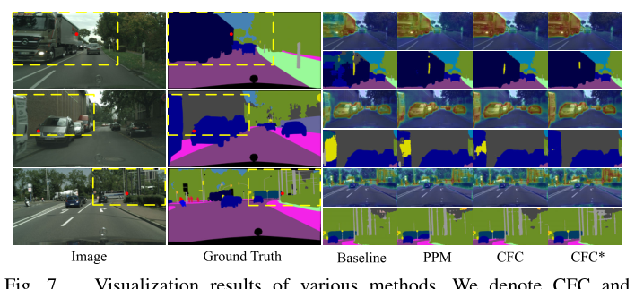

CFC 的特征更「纯」，truck 与 car 类的相似度图更完整清晰，说明其减少了大目标内部的误分类与不一致预测；PPM 则倾向把这些区域标错（如第三张图的 bus）。对比 CFC 与 CFC*（是否做上下文重校准）可见，CRB 进一步改善了第二张图的 car，并对 pole 这类小目标更友好。

SFC 的机制可视化如下图所示，其中偏移用颜色编码，预测误差区域以真值色标出。

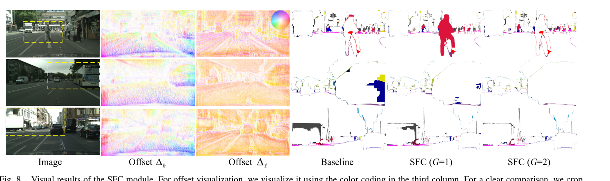

偏移普遍从边界指向目标内部靠近中心的位置——那里感受野大、语义强，可见边界像素的预测被内部像素修正，SFC 因此产出更精确的边界（如第一行的 truck）。统一校准（$G=1$）会引入意外错误，如第一行的 rider 被误分为 person、第三行 truck 上部纹理相似区域误分类；分组校准（$G=2$）结果更准，与 Table IV 的定量结论一致。输出特征图的对比如下图所示。

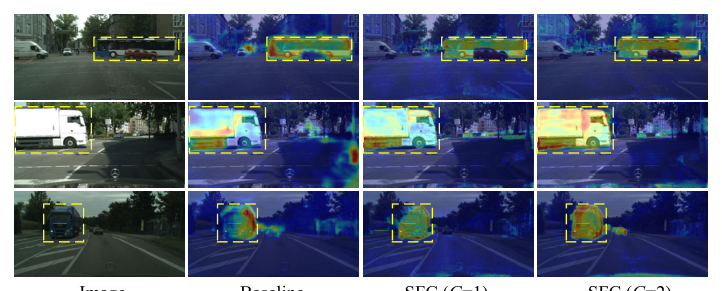

$G=1$ 虽有一定校准效果，但在 bus 后轮、truck 左上角等细节处表现不佳，说明对所有特征图统一校准会弱化不显眼目标的信息；$G=2$ 的特征图结构更完整。最后，CSFCN 与四个流行实时方法在 Cityscapes 验证集上的分割效果如下图所示。

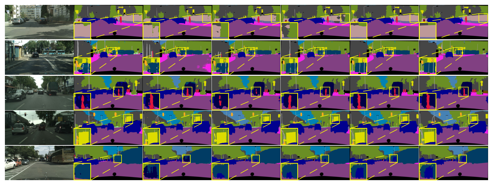

CSFCN 对内部变化大的目标（fence、bus）预测更一致，BiSeNetV2 与 STDC2-Seg75 受限于感受野难以处理；对 person、pole 等小目标，ENet 与 CGNet 因空间信息损失严重而表现吃力；对被遮挡的 car，CSFCN 同样处理良好。定性结果与定量结论互相印证，表明两个校准模块的收益落在了大目标一致性与小目标、边界精度上。

## 优点和创新点

个人认为，本文有如下一些优点和创新点可供参考学习：

1. 把自注意力简化为「像素-上下文匹配」与「单点可学习采样」两种轻量形式，分别靶向上下文错配与空间错位两个具体问题，CFC 以少 81.4% 的 FLOPs 超过 PAM，问题拆解与机制设计的对应关系清晰，说服力强。
2. 在效率细节上多处巧思可供参考：级联金字塔池化复用前层结果并保持长宽比一致，SFC 零映射初始化使其等价于普通融合、插入网络即无损，门控掩码用 1 + tanh 改善初始行为，工程可复用性高。
3. 实验丰富且证据链完整：两个数据集、逐模块与逐类消融、同类模块横向复现对比、MAC 效率分析与多分辨率测试，定性可视化与定量增益相互印证，结论可信度高。
