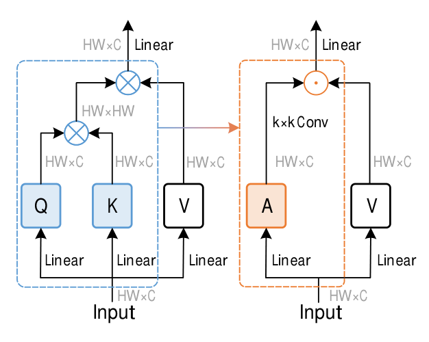
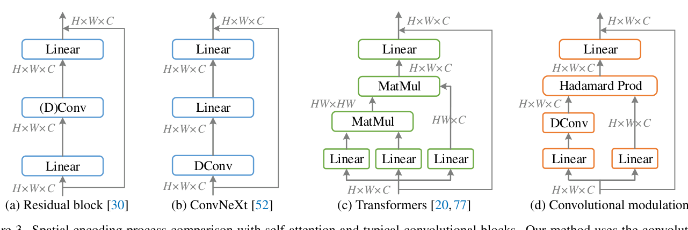
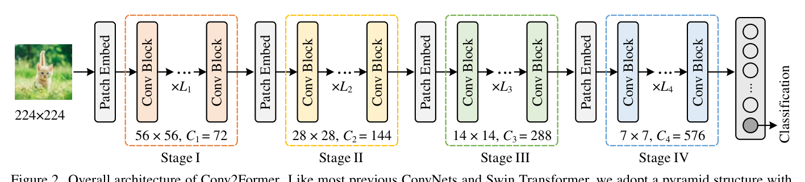
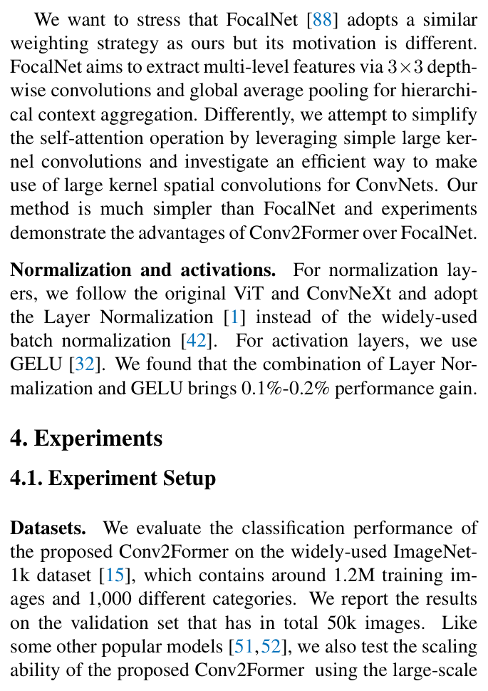
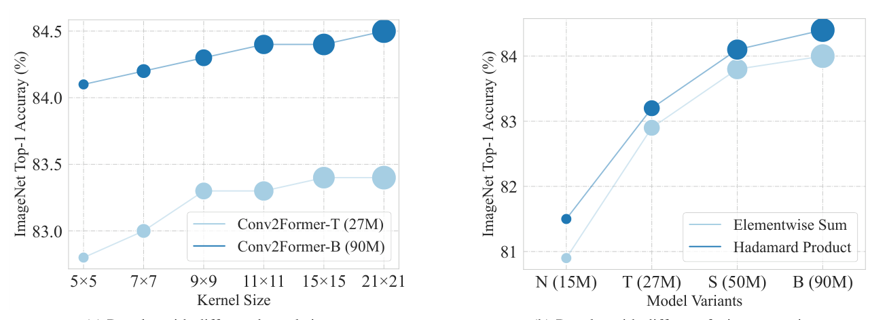

# Conv2Former: A Simple Transformer-Style ConvNet for Visual Recognition

Paper Reading 是从个人角度进行的一些总结分享，受到个人关注点的侧重和实力所限，可能有理解不到位的地方。具体的细节还需要以原文的内容为准，博客中的图表若未另外说明则均来自原文。

| 论文概况 | 详细 |
| --- | --- |
| 标题 | 《Conv2Former: A Simple Transformer-Style ConvNet for Visual Recognition》 |
| 作者 | Qibin Hou、Cheng-Ze Lu、Ming-Ming Cheng、Jiashi Feng |
| 发表会议 | 未获取（arXiv 预印本，编号 arXiv:2211.11943） |
| 会议等级 | 未获取 |
| 发表年份 | 2022 |
| 论文代码 | [https://github.com/HVision-NKU/Conv2Former](https://github.com/HVision-NKU/Conv2Former) |

作者单位：

1. 南开大学计算机学院 TMCC 实验室（TMCC, School of Computer Science, Nankai University）
2. 字节跳动新加坡（ByteDance, Singapore）

## 研究动机

空间信息的编码方式是视觉识别模型的核心设计选择，表现为特征图上各位置如何与其余位置交换信息，导致卷积与自注意力两条技术路线长期分立。传统 ConvNet 依靠堆叠卷积块与金字塔结构聚合大感受野响应，却忽视了对全局上下文信息的显式建模；SENet 一系工作把注意力机制引入 CNN 以捕获长程依赖，取得了好于传统设计的性能。2020 年之后，Vision Transformer 以自注意力建模全局成对依赖，在 ImageNet 分类与下游任务上超过当时的先进 ConvNet，但自注意力在处理高分辨率图像时的计算代价相当可观。另一条线索上，ConvNeXt 表明只要用 Transformer 式的设计与训练配方现代化标准 ResNet，ConvNet 反而能胜过部分流行 ViT；RepLKNet 则展示了大核卷积的潜力。然而 ConvNeXt 同时给出一个结论：不使用重参数化时，深度卷积核超过 7 × 7 几乎不带来性能增益、只带来计算负担，大核卷积的潜力并没有被真正释放。问题至此收窄为：暂未有工作把自注意力归约为一种纯卷积的调制操作，从而更高效地利用大核空间卷积来构造强 ConvNet。

## 文章贡献

针对自注意力二次复杂度与大核卷积利用率不足两个局限，本文提出了 Conv2Former，一个 Transformer 风格的纯卷积网络家族。其核心是卷积调制（convolutional modulation）操作：用大核深度卷积的输出作为权重，经 Hadamard 积调制 value 表征，从而简化自注意力。首先本文对比 ViT 与 ConvNet 编码空间信息的不同方式，把相似度矩阵的生成替换为 k × k 深度卷积，证明静态卷积权重同样能取得优异结果；接着以四阶段金字塔结构堆叠卷积调制块，构建 N、T、S、B、L 五个变体；最终围绕核尺寸、加权策略、归一化与激活给出微设计建议。实验表明，Conv2Former 在 ImageNet 分类、COCO 目标检测与 ADE20k 语义分割上全面超过 Swin Transformer 与 ConvNeXt 等流行 ConvNet 和视觉 Transformer，Conv2Former-L 在 ImageNet-22k 预训练后取得 87.7% 的 top-1 精度。

## 本文方法

### 从自注意力到卷积调制

本节的目标是厘清自注意力中哪一部分可以被卷积替换。对长度为 $N$ 的输入 token 序列 $X$，自注意力先用线性层生成 key、query、value，输出为基于相似度得分 $A$ 的 value 加权平均，计算为：

$$\mathrm{Attention}(X) = AV$$

$$A = \mathrm{Softmax}(QK^{\top})$$

其中 $X, K, Q, V \in \mathbb{R}^{N \times C}$，$N = H \times W$ 为序列长度，$C$ 为通道数，$H$ 与 $W$ 是输入的空间尺寸（为简洁原文省略了缩放因子）。相似度矩阵 $A$ 的形状为 $\mathbb{R}^{N \times N}$，使自注意力的计算复杂度随 $N$ 二次增长。两种机制的对比如下图所示：左侧自注意力通过 query 与 key 的矩阵乘法生成 $HW \times HW$ 的注意力矩阵，右侧卷积调制则直接用 k × k 深度卷积产出与特征图同尺寸的权重。

二者的差别在于卷积核是静态的、而自注意力的注意力矩阵随输入自适应；但实验显示用卷积生成权重矩阵同样能取得很好的结果。这一观察是卷积调制块的设计前提，把空间编码的复杂度从二次降为线性。

### 卷积调制块

卷积调制块用于替换 Transformer 块中的自注意力层，承担空间编码职责。给定输入 token $X \in \mathbb{R}^{H \times W \times C}$，本文用核尺寸 k × k 的深度卷积与 Hadamard 积计算输出 $Z$：

$$Z = A \odot V$$

$$A = \mathrm{DConv}_{k \times k}(W_1 X)$$

$$V = W_2 X$$

其中 $\odot$ 是 Hadamard 积，$W_1$ 与 $W_2$ 是两个线性层的权重矩阵，$\mathrm{DConv}_{k \times k}$ 表示核尺寸 k × k 的深度卷积。该操作使每个空间位置 $(h, w)$ 与以它为中心的 k × k 方形区域内所有像素相关联，通道间的信息交互则由其后的线性层完成，每个空间位置的输出即该方形区域内所有像素的加权和。直观上，这等价于把自注意力中「逐输入生成注意力矩阵」退化为「用卷积特征当注意力权重」，保留了内容自适应的调制能力而免去 $N \times N$ 矩阵。

给出一个简单的例子，假设 $H = W = 4$、$k = 3$、某通道上某位置的 value 为 2：

1. 自注意力需要为该位置计算 $16 \times 16 = 256$ 个相似度元素；
2. 卷积调制只需一次 3 × 3 深度卷积，该位置仅与窗口内 9 个像素相关联；
3. 设卷积在该位置输出的权重为 0.5，则 Hadamard 积后 $Z = 0.5 \times 2 = 1$。

可以看到，调制权重随输入内容变化，而计算量只与窗口大小有关。与经典残差块相比，本文方法因调制操作而能适应输入内容；与自注意力相比，它在处理高分辨率图像时更省内存。块内其余部分与 Transformer 相同：空间编码之后接 FFN 做通道混合，各组件的结构对比如下图所示。

### 金字塔整体架构与模型变体

整体架构用于把卷积调制块组织成多尺度骨干。如下图所示，Conv2Former 采用与 ConvNeXt、Swin Transformer 相同的四阶段金字塔结构，相邻阶段之间用 patch embedding 块（通常为 stride 2 的 2 × 2 卷积）降低分辨率，各阶段堆叠不同数量的卷积块。

图中以 Conv2Former-T 为例，四个阶段的特征分辨率依次为 56 × 56、28 × 28、14 × 14 与 7 × 7，块数 $\{L_1, L_2, L_3, L_4\} = \{3, 3, 12, 3\}$。本文共构建五个变体：Conv2Former-N 的通道配置为 {64, 128, 256, 512}、块数 {2, 2, 8, 2}，Conv2Former-T 与 -S 的通道配置为 {72, 144, 288, 576}、块数分别为 {3, 3, 12, 3} 与 {4, 4, 32, 4}，Conv2Former-B 为 {96, 192, 384, 768} 与 {4, 4, 34, 4}，Conv2Former-L 为 {128, 256, 512, 1024} 与 {4, 4, 48, 4}，参数量依次为 15M、27M、50M、90M 与 199M。由于全网络只含卷积，计算量随图像分辨率线性增长而非二次增长，对检测与高分辨率分割等下游任务更友好。

### 阶段配置

阶段配置用于在参数量固定时权衡网络的宽度与深度，即前图各阶段标注的 ×L1 至 ×L4 块数的分配。原始 ResNet-50 的各阶段块数为 (3, 4, 6, 3)，ConvNeXt-T 遵循 Swin-T 的原则改为 (3, 3, 9, 3) 并对更大模型使用 1 : 1 : 9 : 1 的阶段计算比例；本文在此基础上微调比例。原文对比了四个 tiny 尺寸模型：ResNet-50（26M、4.0G、3-4-6-3）为 78.5%，Swin-T（28M、4.5G、2-2-6-2）为 81.5%，ConvNeXt-T（29M、4.5G、3-3-9-3）为 82.1%，而 Conv2Former-N 以 15M、2.2G、2-2-8-2 取得 81.5%，Conv2Former-T 以 27M、4.4G、3-3-12-3 取得 83.2%。tiny 尺寸（少于 30M 参数）下更深的网络表现更好，这一观察直接决定了上节各变体的块数分配，也为小模型设计提供了可复用的经验。

### 微设计：大于 7 × 7 的核

本节回答「卷积调制能否释放更大核的潜力」。ConvNeXt 表明把核从 3 × 3 增大到 7 × 7 能提升分类性能，但继续增大核在不重参数化时几乎无增益；本文认为其原因在于使用空间卷积的方式，而非核本身。对 Conv2Former，核尺寸从 5 × 5 增大到 21 × 21 时性能持续上升：Conv2Former-T 从 82.8% 升到 83.4%，参数量 80M+ 的 Conv2Former-B 从 84.1% 升到 84.5%，增益直到 21 × 21 才趋于饱和。考虑模型效率，本文默认取 11 × 11。这与 ConvNeXt「大于 7 × 7 无增益」的结论相反，表明以式 (3) 的方式把卷积特征用作权重，比传统用法更高效地利用了大核。

### 微设计：加权策略与归一化激活

加权策略用于确定卷积特征与 value 分支的融合方式。如图 3(d) 所示，本文把深度卷积的输出直接作为权重去调制线性投影后的特征，Hadamard 积之前既不加激活也不加归一化层（如 Sigmoid 或 Lp 归一化），这是取得好性能的关键因素：按 SENet 的做法加入 Sigmoid 会使性能下降超过 0.5%。归一化与激活方面，本文沿用 ViT 与 ConvNeXt 的选择，用 Layer Normalization 替代 batch normalization、用 GELU 作激活，二者组合带来 0.1%-0.2% 的增益。这些微设计约束了卷积调制块的实现细节，其消融证据见实验节。

## 实验结果

### 实验设置

分类在 ImageNet-1k 上进行（约 120 万训练图、1000 类，验证集 5 万图），并用 ImageNet-22k（约 1400 万图、21841 类）预训练考察数据扩展能力。训练采用 AdamW 优化器与线性学习率缩放策略 $lr = LR_{base} \times \text{batch size} / 1024$，初始学习率 0.001、weight decay 5e-2，配合 MixUp、CutMix、Stochastic Depth、Random Erasing、Label Smoothing、RandAug 与初值 1e-6 的 Layer Scale，共训练 300 个 epoch；ImageNet-22k 预训练 90 个 epoch 后在 ImageNet-1k 微调 30 个 epoch。检测在 COCO 上用 Mask R-CNN 与 Cascade Mask R-CNN（3× schedule、多尺度训练、GIoU loss，mmdetection 实现），分割在 ADE20k（150 类）上用 UperNet 解码器，tiny/small/base 模型裁剪 512 × 512、large 模型裁剪 640 × 640。指标为 top-1 精度、AP 系列与 mIoU。

### 对比实验

ImageNet-1k 的主结果如下表所示。

tiny 尺寸下 Conv2Former 相对 ConvNeXt-T 与 SwinT-T 分别有 1.1% 与 1.7% 的增益，15M 参数、2.2G FLOPs 的 Conv2Former-N 与 28M 参数、4.5G FLOPs 的 SwinT-T 持平；base 尺寸下仍有 0.6% 与 0.9% 的提升，Conv2Former-B（90M、15.9G）以 84.4% 超过计算量两倍于它的 EfficientNet-B7（66M、37.0G、84.3%）。ImageNet-22k 预训练后增益保持一致：Conv2Former-B 在 224 与 384 分辨率下取得 86.2% 与 87.0%，超过 ConvNeXt-B 的 85.8% 与 86.8%；Conv2Former-L 取得 87.0% 与 87.7%，优于 EfficientNetV2-XL（87.3%）与 CoAtNet-3（87.6%）。下游任务上，Mask R-CNN 3× schedule 下 Conv2Former-T 的 box AP 达 48.0，超过 SwinT-T 与 ConvNeXt-T 约 2 个点，实例分割增益也超过 1%；Cascade Mask R-CNN 下增益超过 1%；ADE20k 上 Conv2Former-T 以 56M 参数取得 48.0 mIoU，比 ConvNeXt-T 高 1.3%，base 尺寸高 1.1%，Conv2Former-L 达 54.3 mIoU。三个任务上的一致领先表明卷积调制提取的特征对密集预测同样有效。

### 消融实验

消融围绕核尺寸、融合策略与加权策略展开。核尺寸取 {5 × 5, 7 × 7, 9 × 9, 11 × 11, 15 × 15, 21 × 21} 六档时，Conv2Former-T 与 -B 的精度随核增大持续上升直至 21 × 21 饱和，与 ConvNeXt 的结论相反；把 Hadamard 积换成逐元素相加后，N/T/S/B 四个变体的精度全部下降，且小模型从 Hadamard 积中受益更多，如下图所示。

加权策略的定量对比基于 Conv2Former-T：逐元素相加 82.7%、在 A 后加 Sigmoid 82.3%、加 L1 归一化 82.8%、把 A 线性归一化到 (0, 1] 82.2%，而 Hadamard 积 83.2% 最优；把 A 调整为正值反而掉点更多，与 SE、CA 等传统注意力在重标定前用 Sigmoid 的做法相反。大核横向对比中，不使用重参数化或稀疏权重的 Conv2Former-B 在 7 × 7 核下即达 84.2%，超过 RepLKNet-31B（31 × 31、83.5%）、ConvNeXt-B（7 × 7、83.8%）与 SLaK-B（51 × 51、84.0%），11 × 11 核下进一步到 84.4%。等向架构下（18 块、ViT 式 plain 结构），Conv2Former-IS 以 23M 参数取得 81.2%（3 卷积 patch embedding 版 82.0%），比 DeiT-S 与 ConvNeXt-IS 高约 1.5%；Conv2Former-IB 取得 82.7% 与 83.0%，超过 ConvNeXt-IB 0.7%、DeiT-B 0.9%。

### 可视化分析

原文未提供定性效果图组与注意力热力图，该类素材未获取；此处结合结构图做机制层面的定性分析。自注意力需要显式生成 HW × HW 的相似度矩阵，内存占用随分辨率二次增长，而卷积调制只产生与特征图同尺寸的 H × W × C 权重，计算与内存随分辨率线性增长。这一结构差异定性解释了 Conv2Former 在高分辨率密集预测任务上的优势：COCO 上约 2 个点的 box AP 增益与 ADE20k 上 1.3% 的 mIoU 增益，正是线性复杂度在高分辨率输入下红利兑现的表现；结合消融中 Hadamard 积相对逐元素相加的全面领先可以看出，调制式加权而非简单相加，是卷积调制块收益的关键来源。

## 优点和创新点

个人认为，本文有如下一些优点和创新点可供参考学习：

1. 把自注意力归约为深度卷积加 Hadamard 积的卷积调制，在保留内容自适应调制能力的同时把空间编码复杂度从二次降为线性，思路简洁、易于复现与移植。
2. 系统考察大核卷积的使用方式，给出 5 × 5 到 21 × 21 持续增益的反结论证据，推翻「核大于 7 × 7 无增益」的既有经验，为 ConvNet 设计提供可复用结论。
3. 实验覆盖分类、检测、分割三任务与 ImageNet-22k 预训练、等向架构、核尺寸、融合与加权策略等多个维度，证据链完整、说服力强。
