# Conv2Former: A Simple Transformer-Style ConvNet for Visual Recognition

Paper Reading 是从个人角度进行的一些总结分享，受到个人关注点的侧重和实力所限，可能有理解不到位的地方。具体的细节还需要以原文的内容为准，博客中的图表若未另外说明则均来自原文。

| 论文概况 | 详细 |
| --- | --- |
| 标题 | 《Conv2Former: A Simple Transformer-Style ConvNet for Visual Recognition》 |
| 作者 | Qibin Hou、Cheng-Ze Lu、Ming-Ming Cheng、Jiashi Feng |
| 发表会议 | 未获取（arXiv 预印本，编号 arXiv:2211.11943） |
| 会议等级 | 未获取 |
| 发表年份 | 2022 |
| 论文代码 | [https://github.com/HVision-NKU/Conv2Former](https://github.com/HVision-NKU/Conv2Former) |

作者单位：

1. 南开大学计算机学院 TMCC 实验室（TMCC, School of Computer Science, Nankai University）
2. 字节跳动新加坡（ByteDance, Singapore）

## 研究动机

视觉识别模型对空间信息的编码方式是骨干网络设计的核心问题，表现为特征图上各位置如何聚合其余位置的信息，直接决定模型对全局上下文的建模能力。早期 ConvNet 依靠堆叠卷积块与金字塔结构聚合大感受野响应，却忽视了对全局上下文信息的显式建模；SENet 一系工作把注意力机制引入 CNN 以捕获长程依赖，取得了好于传统设计的性能。然而，Vision Transformer 虽以自注意力建模全局成对依赖、在 ImageNet 分类与下游任务上超过了当时的先进 ConvNet，但自注意力在处理高分辨率图像时的计算代价相当可观。另一条线索上，ConvNeXt 表明只要用 Transformer 式的设计与训练配方现代化标准 ResNet，ConvNet 反而能胜过部分流行 ViT，RepLKNet 也展示了大核卷积的潜力；但 ConvNeXt 同时指出，在不使用重参数化时继续加大深度卷积核几乎不再带来性能增益、只增加计算负担，大核卷积的潜力并没有被真正释放。问题至此收窄为：暂未有工作把自注意力归约为一种纯卷积的调制操作，从而更高效地利用大核空间卷积来构造强 ConvNet。

## 文章贡献

针对自注意力二次复杂度与大核卷积利用率不足两个局限，本文提出了 Conv2Former，一个 Transformer 风格的纯卷积网络家族。其核心是卷积调制（convolutional modulation）操作：用大核深度卷积的输出作为权重，经 Hadamard 积调制 value 表征，从而简化自注意力。首先本文对比 ViT 与 ConvNet 编码空间信息的不同方式，把相似度矩阵的生成替换为 k × k 深度卷积，证明静态卷积权重同样能取得优异结果；接着以四阶段金字塔结构堆叠卷积调制块，构建 N、T、S、B、L 五个模型变体；最终围绕核尺寸、加权策略、归一化与激活给出微设计建议。实验表明，Conv2Former 在 ImageNet 分类、COCO 目标检测与 ADE20K 语义分割上全面超过 Swin Transformer 与 ConvNeXt 等流行的视觉 Transformer 和 ConvNet，Conv2Former-L 在 ImageNet-22k 预训练后取得 87.7% 的 top-1 精度。

## 本文方法

### 从自注意力到卷积调制

本节的目标是厘清自注意力中哪一部分可以被卷积替换。对长度为 $N$ 的输入 token 序列 $X$，自注意力先用线性层生成 key、query、value，输出为基于相似度得分 $A$ 的 value 加权平均，其输出计算为：

$$\mathrm{Attention}(X) = AV$$

其中 $A$ 度量任意一对输入 token 之间的关系，相似度得分矩阵的计算为：

$$A = \mathrm{Softmax}(QK^{\top})$$

该组公式涉及的符号及其含义如下表所示：

| 符号 | 含义 |
| --- | --- |
| $X, K, Q, V$ | 输入序列及由线性层生成的 key、query、value，形状均为 $\mathbb{R}^{N \times C}$ |
| $N$ | 序列长度，$N = H \times W$ |
| $C$ | 通道数，$H$、$W$ 为输入的空间尺寸 |
| $A$ | 相似度得分矩阵，形状为 $\mathbb{R}^{N \times N}$（为简洁原文省略了缩放因子） |

直观上，自注意力用一个 $N \times N$ 的相似度矩阵对全图位置两两加权，计算复杂度随序列长度二次增长，这正是卷积调制要替换掉的部分。两种机制的对比如下图所示：左侧自注意力通过 query 与 key 的矩阵乘法生成 $HW \times HW$ 的注意力矩阵，右侧卷积调制则直接用 k × k 深度卷积产出与特征图同尺寸的权重。

图中蓝色虚线框内是自注意力的权重生成路径，橙色虚线框内是卷积调制的对应路径，二者的差别在于卷积核是静态的、而自注意力矩阵随输入自适应。这一观察是卷积调制块的设计前提：既然卷积特征也能当权重，空间编码就可以从二次复杂度的矩阵乘法换成线性复杂度的卷积，具体模块如下。

### 卷积调制块

卷积调制块用于替换 Transformer 块中的自注意力层，承担空间编码职责。给定输入 $X \in \mathbb{R}^{H \times W \times C}$，本文用核尺寸 k × k 的深度卷积与 Hadamard 积计算输出 $Z$，输出 $Z$ 的计算为：

$$Z = A \odot V$$

其中 $A$ 是调制权重，由深度卷积生成，计算为：

$$A = \mathrm{DConv}_{k \times k}(W_1 X)$$

value 分支不做空间混合，计算为：

$$V = W_2 X$$

这组公式涉及的符号及其含义如下表所示：

| 符号 | 含义 |
| --- | --- |
| $\odot$ | Hadamard 积（逐元素相乘） |
| $\mathrm{DConv}_{k \times k}$ | 核尺寸 k × k 的深度卷积 |
| $W_1$、$W_2$ | 两个线性层的权重矩阵 |
| $V$、$Z$ | 线性投影后的 value 表征与调制输出 |

直观上，这等价于把自注意力中「逐输入生成注意力矩阵」退化为「用卷积特征当注意力权重」：每个空间位置 $(h, w)$ 的输出是以它为中心的 k × k 方形区域内所有像素的加权和，通道间的信息交互由其后的线性层完成，既保留了内容自适应的调制能力，又免去了 $N \times N$ 的相似度矩阵。

给出一个简单的例子，假设 $H = W = 4$、$k = 3$，某位置某通道的 value 为 2：

1. 自注意力需要为该位置计算 $16 \times 16 = 256$ 个相似度元素；
2. 卷积调制只需一次 3 × 3 深度卷积，该位置仅与窗口内 9 个像素相关联；
3. 设卷积在该位置输出的权重为 0.5，Hadamard 积后 $Z = 0.5 \times 2 = 1$。

可以看到，调制权重随输入内容变化，而计算量只与窗口大小有关。块内其余部分与 Transformer 相同：空间编码之后接 FFN 做通道混合，各组件的空间编码过程对比如下图所示。

图中从左到右依次是残差块、ConvNeXt 块、Transformer 块与卷积调制块，卷积调制块用深度卷积特征作权重、以 Hadamard 积调制 value 分支（图 (d) 右侧的线性层）。相比之下，Transformer 块的路径（图 (c)）需要显式构造 $HW \times HW$ 的相似度矩阵，而卷积调制的中间张量始终保持 $H \times W \times C$，对高分辨率输入更省内存。该对比说明卷积调制块可以直接替换注意力层，把它放进整体网络即得到完整的骨干。

### 金字塔整体架构

整体架构用于把卷积调制块组织成多尺度骨干。Conv2Former 的整体架构如下图所示，以图中的 Conv2Former-T 为例，四个阶段的特征分辨率依次为 56 × 56、28 × 28、14 × 14 与 7 × 7，块数 $\{L_1, L_2, L_3, L_4\} = \{3, 3, 12, 3\}$。

图中四个阶段各堆叠不同数量的卷积块，相邻阶段之间用 patch embedding 块（通常为 stride 2 的 2 × 2 卷积）降低分辨率，末端接分类头。该布局与 ConvNeXt、Swin Transformer 的金字塔结构一致，便于与同类骨干做受控对比。由于全网络只含卷积，计算量随图像分辨率线性增长而非二次增长，对检测与高分辨率分割等下游任务更友好；各变体的宽度与块数分配如下。

### 模型变体与阶段配置

模型变体与阶段配置用于在参数量固定时权衡网络的宽度与深度。本文五个变体的通道与块数配置如下表所示：

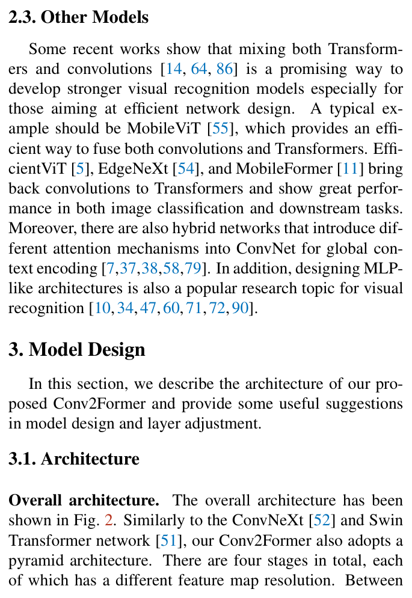

表中 $\{C_1, C_2, C_3, C_4\}$ 为各阶段通道数，$\{L_1, L_2, L_3, L_4\}$ 为各阶段块数，五个变体 N、T、S、B、L 的参数量依次为 15M、27M、50M、90M 与 199M。在阶段比例上，原始 ResNet-50 的各阶段块数为 (3, 4, 6, 3)，ConvNeXt-T 遵循 Swin-T 的原则改为 (3, 3, 9, 3) 并对更大模型使用 1 : 1 : 9 : 1 的阶段计算比例，本文在此基础上进一步加深第三阶段。原文总结的经验是小尺寸模型取更深的配置表现更好，相应的受控对比见实验节。这五个变体贯穿本文全部实验，块内的微设计细节如下。

### 微设计：大核卷积的使用方式

本节回答「卷积调制能否释放更大核的潜力」。调制权重的生成方式即前文的深度卷积，计算为：

$$A = \mathrm{DConv}_{k \times k}(W_1 X)$$

其中核尺寸 k × k 是该式唯一的结构超参。ConvNeXt 表明把核从 3 × 3 增大到 7 × 7 能提升分类性能，但继续增大核在不重参数化时几乎无增益；本文认为原因在于使用空间卷积的方式而非核本身——把卷积特征直接当作加权权重后，增大 k 等价于扩大每个输出位置的加权感受野，而不改变模块结构。考虑模型效率，本文默认取 11 × 11。大核带来的实际增益与饱和点在实验节用消融曲线验证，与之配套的还有加权策略与归一化激活的选择。

### 微设计：加权策略与归一化激活

加权策略用于确定卷积特征与 value 分支的融合方式。两个分支的融合即 Hadamard 积，融合的计算为：

$$Z = A \odot V$$

其中融合之前对 $A$ 不做任何变换。本文把深度卷积的输出直接作为权重调制线性投影后的特征，Hadamard 积之前既不加激活也不加归一化层（如 Sigmoid 或 Lp 归一化），这与 SENet 一系在重标定前用 Sigmoid 的做法相反。归一化与激活方面，本文沿用 ViT 与 ConvNeXt 的选择，用 Layer Normalization 替代 batch normalization、用 GELU 作激活。这些微设计约束了卷积调制块的实现细节，其消融证据见实验节；块内数据流至此完整：深度卷积与线性层分别生成权重与 value，Hadamard 积融合后送入 FFN 做通道混合。

## 实验结果

### 实验设置

分类在 ImageNet-1k 上进行（约 120 万训练图、1000 类，验证集 5 万图），并用 ImageNet-22k（约 1400 万图、21841 类）预训练考察数据扩展能力。训练采用 AdamW 优化器与线性学习率缩放策略，初始学习率 0.001、weight decay 5e-2，配合 MixUp、CutMix、Stochastic Depth、Random Erasing、Label Smoothing、RandAug 与初值 1e-6 的 Layer Scale，共训练 300 个 epoch；ImageNet-22k 预训练 90 个 epoch 后在 ImageNet-1k 微调 30 个 epoch。检测在 COCO（80 类）上用 Mask R-CNN 与 Cascade Mask R-CNN（3× schedule、多尺度训练、GIoU loss，MMDetection 实现），分割在 ADE20K（150 类）上用 UperNet 解码器，tiny/small/base 模型裁剪 512 × 512、large 模型裁剪 640 × 640；指标为 top-1 精度、AP 系列与 mIoU。

各变体在 ImageNet-1k 与 ImageNet-22k（预）训练所用的随机深度率如下表所示，可见模型越大率越高、最大取到 0.7。

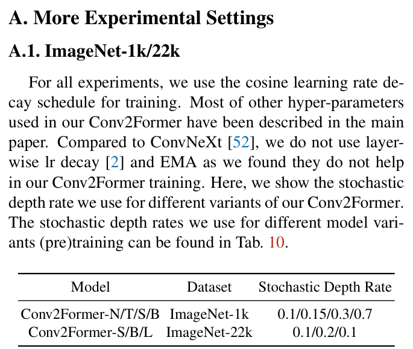

ImageNet-22k 预训练后在 ImageNet-1k 微调所用的随机深度率如下表所示，可见 224 与 384 两档分辨率分别成组给出。

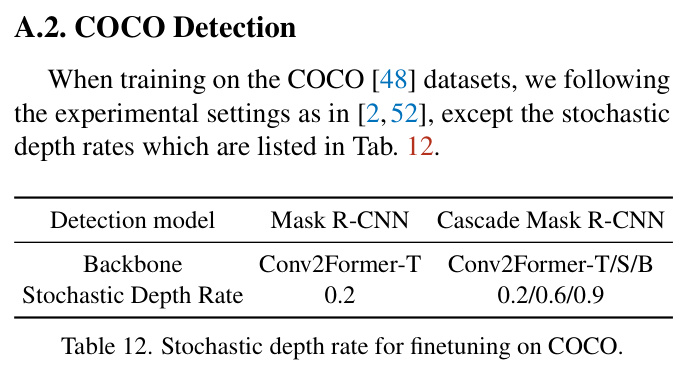

COCO 微调所用的随机深度率如下表所示，可见 Cascade Mask R-CNN 下 T、S、B 三个骨干依次取 0.2/0.6/0.9。

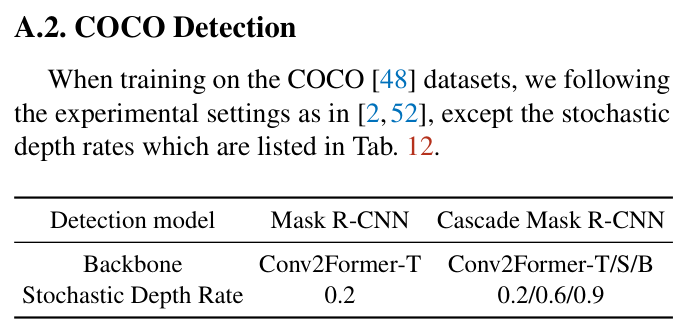

ADE20K 微调所用的随机深度率如下表所示，可见其按预训练数据集分成两行列出。

上述四张表覆盖了本文分类、检测、分割全部微调实验的随机深度率口径，训练配置至此交代完毕，下面进入各任务的结果对比。

### ImageNet 分类结果

ImageNet-1k 的主结果如下表所示。

表中各尺寸下 Conv2Former 均高于同规模的 Swin Transformer 与 ConvNeXt，tiny 尺寸下相对 ConvNeXt-T 与 SwinT-T 分别有 1.1% 与 1.7% 的增益。15M 参数、2.2G FLOPs 的 Conv2Former-N 与 28M 参数的 SwinT-T 精度持平，Conv2Former-B 以 84.4% 超过计算量两倍于它的 EfficientNet-B7，可见卷积调制的收益并不依赖大模型。

ImageNet-22k 预训练后的结果如下表所示。

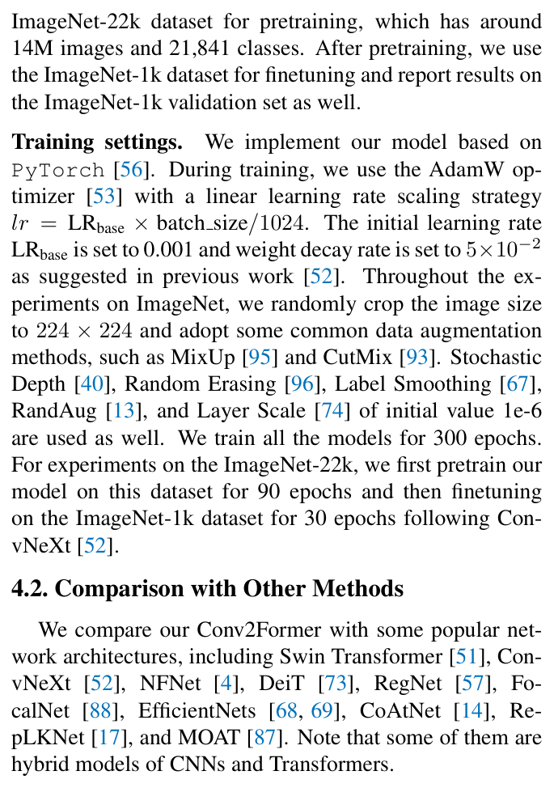

表中各变体相对 ConvNeXt 的增益在数据扩展后保持一致，Conv2Former-B 在 224 与 384 分辨率下取得 86.2% 与 87.0%，均高于 ConvNeXt-B。Conv2Former-L 取得 87.0% 与 87.7%、超过 EfficientNetV2-XL 与 CoAtNet-3，表明扩大预训练数据没有抹平架构之间的差异。

### COCO 目标检测与实例分割

下游任务先看检测，COCO 上 Mask R-CNN 与 Cascade Mask R-CNN 两个框架的结果如下表所示，骨干均为 ImageNet-1k 预训练模型。

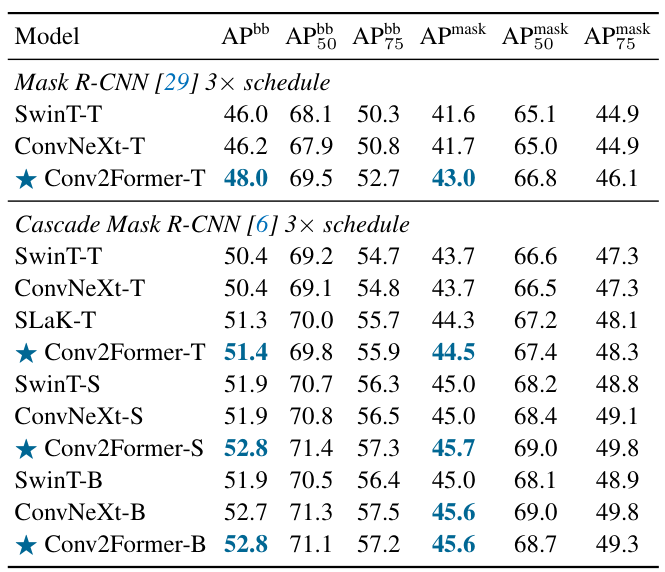

表中 Conv2Former-T 在 Mask R-CNN 3× schedule 下 box AP 达 48.0，超过 SwinT-T 与 ConvNeXt-T 约 2 个点，实例分割的增益也超过 1%；Cascade 框架下 T、S、B 三个尺寸全部保持领先，说明卷积调制提取的特征对检测与实例分割同样有效。

### ADE20K 语义分割

分割在 ADE20K 上用 UperNet 解码器评测，各尺寸与 Swin Transformer、ConvNeXt 的对比如下表所示。

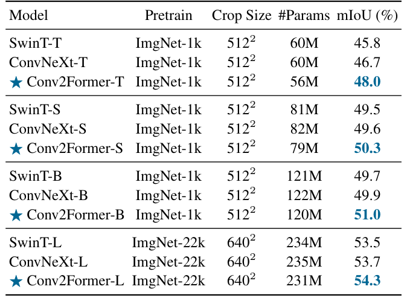

表中 Conv2Former-T 以 56M 参数取得 48.0 mIoU，比 ConvNeXt-T 高 1.3%，base 尺寸高 1.1%，Conv2Former-L 达 54.3 mIoU，可以看出分类上的领先幅度一致延续到了语义分割。

### 消融实验

消融先看核尺寸与融合策略两个维度，六档核尺寸与两种融合方式的曲线如下图所示，左图横轴为核尺寸、右图横轴为模型变体，纵轴均为 ImageNet top-1 精度。

图中 Conv2Former-T 与 -B 的精度随核增大持续上升、到 21 × 21 才趋于饱和（T 从 82.8% 升到 83.4%，B 从 84.1% 升到 84.5%）；把 Hadamard 积换成逐元素相加后四个变体全部掉点，且小模型从 Hadamard 积中受益更多，可见调制式加权而非简单相加是收益的关键来源。

加权策略的定量对比基于 Conv2Former-T，各融合变体的结果如下表所示。

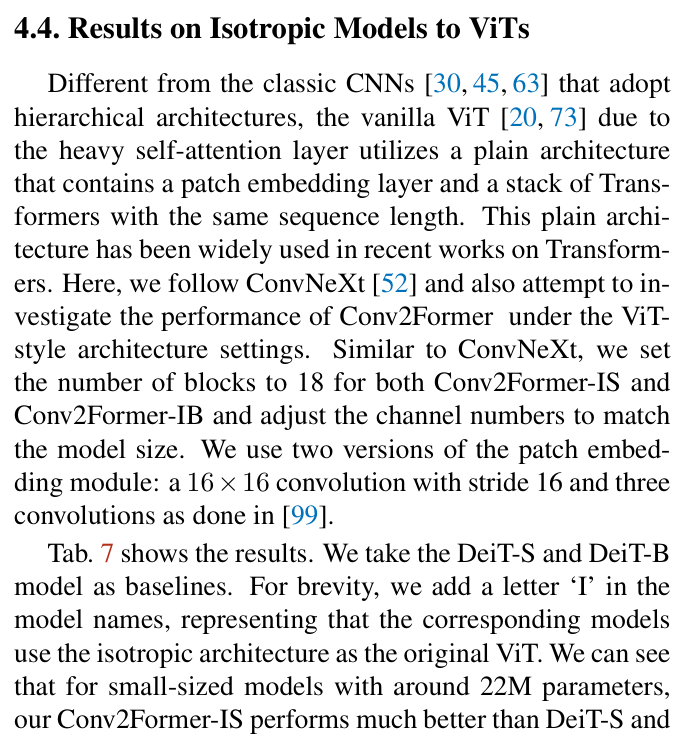

表中逐元素相加得 82.7%、在 A 后加 Sigmoid 得 82.3%、加 L1 归一化得 82.8%、把 A 线性归一化到 (0, 1] 得 82.2%，而 Hadamard 积以 83.2% 最优。把 A 调整为正值反而掉点更多，与 SE、CA 等传统注意力在重标定前用 Sigmoid 的做法相反，表明加权前的归一化选择仍与注意力机制的习惯不同。

阶段配置的受控对比基于四个 tiny 尺寸模型，结果如下表所示。

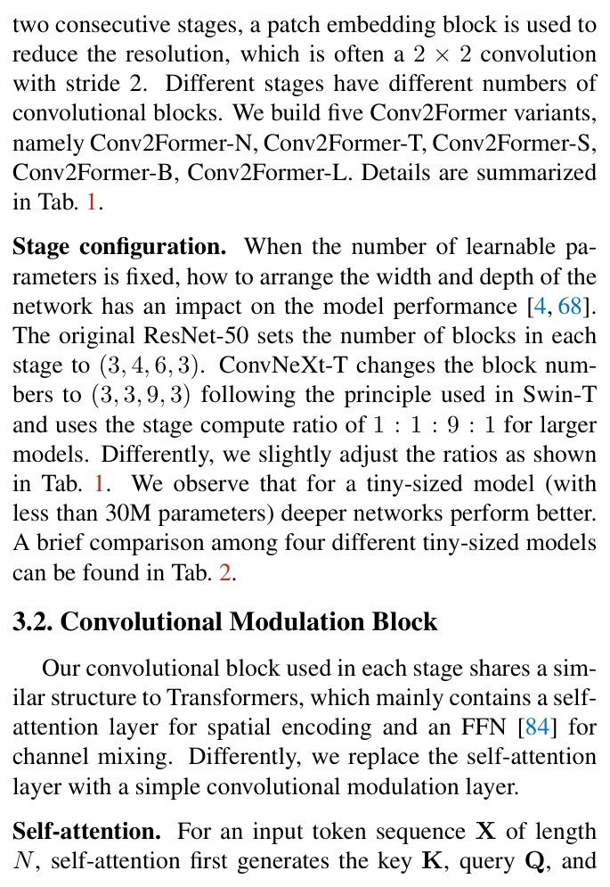

表中 ResNet-50、Swin-T、ConvNeXt-T 与两个 Conv2Former 变体的阶段配置各不相同，Conv2Former-T 以 3-3-12-3 的加深配置取得 83.2%、高于 3-3-9-3 的 ConvNeXt-T，验证了小模型下更深的阶段分配更好。

### 大核卷积对比与等向架构

与大核 ConvNet 的横向对比如下表所示，各方法的核尺寸、参数量与精度一并列出。

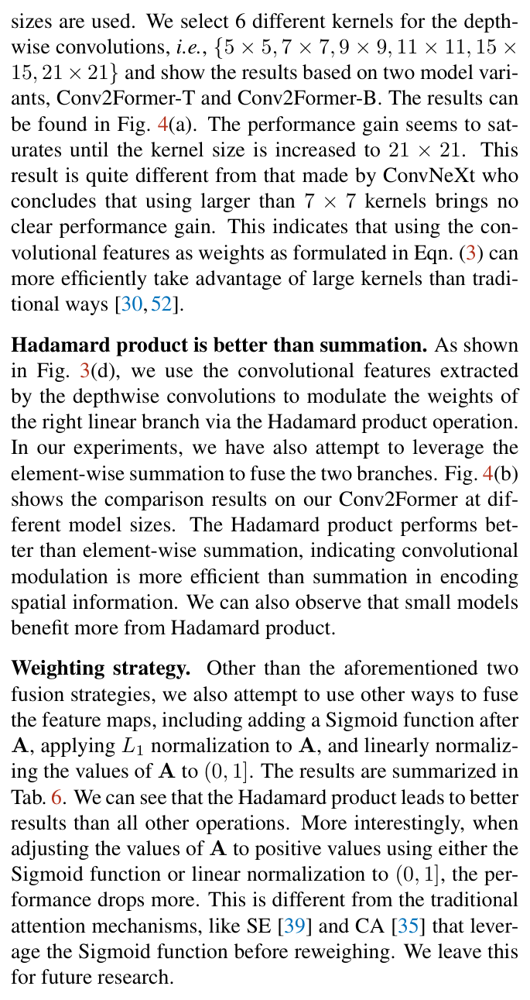

表中不使用重参数化或稀疏权重的 Conv2Former-B 在 7 × 7 核下即达 84.2%，超过 RepLKNet-31B（31 × 31）、ConvNeXt-B（7 × 7）与 SLaK-B（51 × 51），11 × 11 核下进一步到 84.4%，证明了卷积调制对大核的利用效率高于传统用法。

等向架构（18 块、ViT 式 plain 结构）下与 DeiT、ConvNeXt 的对比结果如下表所示。

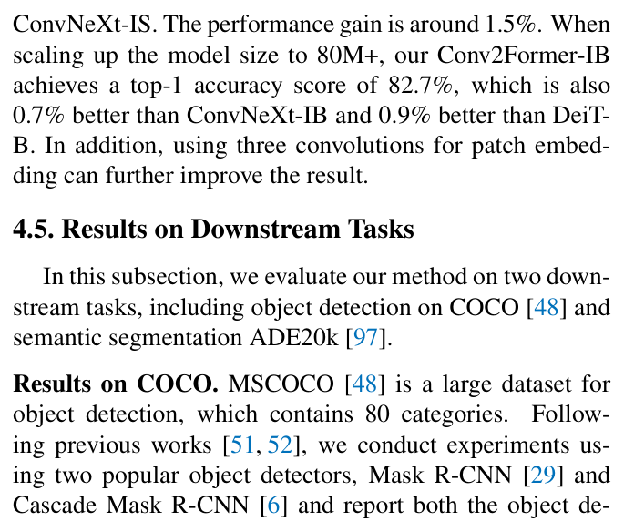

表中 Conv2Former-IS 以 23M 参数取得 81.2%（3 卷积 patch embedding 版 82.0%），比 DeiT-S 与 ConvNeXt-IS 高约 1.5%，Conv2Former-IB 取得 82.7% 与 83.0%、超过 ConvNeXt-IB 0.7% 与 DeiT-B 0.9%，说明卷积调制的收益不依赖金字塔结构。

### 可视化分析

原文未提供检测与分割的定性效果图组、注意力热力图等可视化素材，该类素材未获取，此处结合结构图做机制层面的定性分析。自注意力需要显式生成 $HW \times HW$ 的相似度矩阵，内存占用随分辨率二次增长，而卷积调制只产生与特征图同尺寸的权重，计算与内存随分辨率线性增长；这一结构差异定性解释了高分辨率密集预测上的收益：COCO 上约 2 个点的 box AP 增益与 ADE20K 上 1.3% 的 mIoU 增益，验证了线性复杂度的收益在高分辨率输入下得以兑现。结合消融中 Hadamard 积相对逐元素相加的全面领先可以看出，输出位置对 k × k 邻域做内容自适应的加权聚合，是特征变强的直接原因。

## 优点和创新点

个人认为，本文有如下一些优点和创新点可供参考学习：

1. 把自注意力归约为深度卷积加 Hadamard 积的卷积调制，从空间编码的视角统一了注意力加权与卷积加权，在保留内容自适应调制能力的同时把复杂度从二次降为线性，实现简洁、易于移植，可供参考；
2. 系统考察大核卷积的使用方式，用 5 × 5 到 21 × 21 持续增益的实验证据修正了「大于 7 × 7 无增益」的既有经验，为 ConvNet 的核尺寸选择提供了可复用的结论；
3. 实验数据丰富有力，覆盖 ImageNet 分类、COCO 检测、ADE20K 分割三类任务与 22k 预训练、等向架构、核尺寸与加权策略消融等多个维度，从不同方面验证了本文设计，证据链完整、说服力强。
