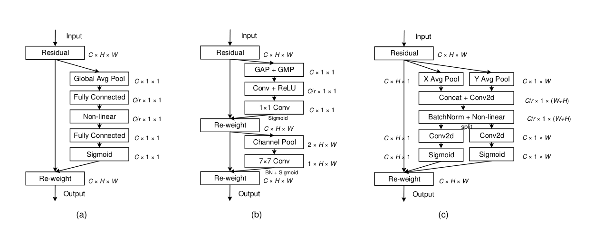
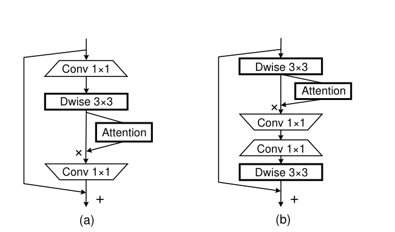
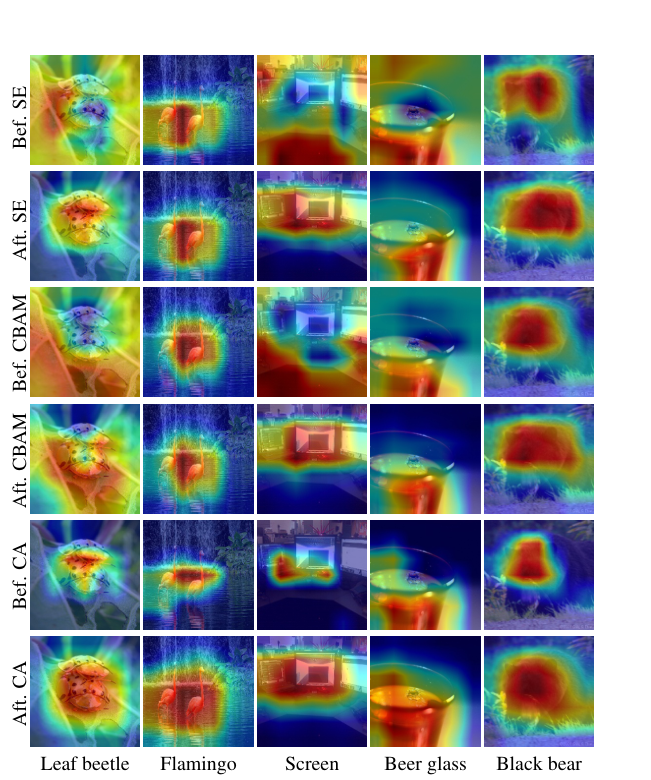
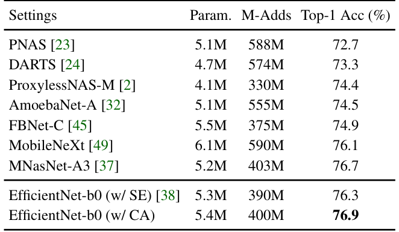
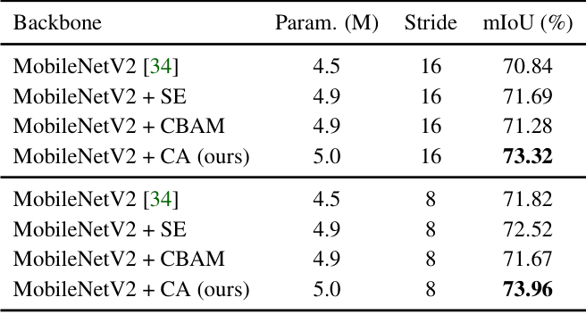
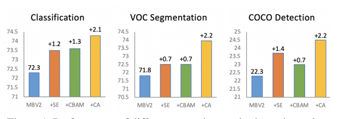

# Coordinate Attention for Efficient Mobile Network Design

Paper Reading 是从个人角度进行的一些总结分享，受到个人关注点的侧重和实力所限，可能有理解不到位的地方。具体的细节还需要以原文的内容为准，博客中的图表若未另外说明则均来自原文。

| 论文概况 | 详细 |
| --- | --- |
| 标题 | 《Coordinate Attention for Efficient Mobile Network Design》 |
| 作者 | Qibin Hou、Daquan Zhou、Jiashi Feng |
| 发表会议 | CVPR |
| 会议等级 | CCF-A |
| 发表年份 | 2021 |
| 论文代码 | [https://github.com/Andrew-Qibin/CoordAttention](https://github.com/Andrew-Qibin/CoordAttention) |

作者单位：

1. National University of Singapore

## 研究动机

通道注意力是移动网络特征增强的事实标准，表现为 Squeeze-and-Excitation（SE）注意力以 2D 全局池化把每张特征图压成通道描述子、以极低的计算代价重标定通道关系，导致 SE 块被广泛嵌入 MobileNetV2、EfficientNet 等轻量网络。然而 SE 注意力只编码通道间信息：2D 全局池化把空间信息整体压进一个向量，位置信息随之丢失，而位置信息对捕捉视觉任务中的对象结构至关重要。后续工作如 BAM 与 CBAM 试图先压缩通道维、再用卷积计算空间注意力来弥补，但卷积只能捕捉局部关系，无法建模视觉任务必需的长程依赖；另一侧的非局部与自注意力机制虽能建模全局关系，其计算开销却是移动网络负担不起的。问题至此收窄为：暂未有工作能在移动网络可承受的代价内，同时编码精确的位置信息与长程依赖。

## 文章贡献

针对通道注意力丢失位置信息、卷积式空间注意力无法建模长程依赖的问题，本文提出了坐标注意力（coordinate attention）。其核心是把通道注意力的 2D 全局池化分解为两个并行的 1D 特征编码过程，分别沿水平与垂直方向聚合特征。首先用 (H, 1) 与 (1, W) 两种池化核尺寸的 1D 全局池化嵌入坐标信息，得到一对方向感知的特征图；接着将二者拼接后经共享 1×1 卷积、split 拆分与两个方向各自的 1×1 卷积，生成一对方向感知、位置敏感的注意力图；最终把两张注意力图乘回输入特征图完成特征增强。实验表明坐标注意力在参数量与计算量相当的前提下把 MobileNetV2 的 ImageNet Top-1 精度提升 2.0 个百分点，并在目标检测、语义分割等下游任务上带来比分类更大的收益。

## 本文方法

### 重访 SE 注意力

本节的目标是复述 SE 块的两步结构，作为坐标注意力的对照基线。给定输入 $X$，squeeze 步骤对第 $c$ 个通道的形式化如下：

$$z_c = \frac{1}{H \times W} \sum_{i=1}^{H} \sum_{j=1}^{W} x_c(i, j)$$

| 符号 | 含义 |
| --- | --- |
| $z_c$ | 第 $c$ 个通道 squeeze 后的输出 |
| $x_c$ | 输入特征图 $X$ 的第 $c$ 个通道，来自固定核尺寸的卷积层，可视为局部描述子的集合 |
| $H, W$ | 特征图的空间高与宽 |

squeeze 使全局信息的收集成为可能。第二步 excitation 旨在完整捕捉通道间依赖，计算为：

$$\hat{X} = X \cdot \sigma(\hat{z})$$

$$\hat{z} = T_2(\mathrm{ReLU}(T_1(z)))$$

| 符号 | 含义 |
| --- | --- |
| $\cdot$ | 逐通道乘法 |
| $\sigma$ | sigmoid 函数 |
| $T_1, T_2$ | 两个可学习的线性变换，用于捕捉每个通道的重要性 |

这等价于「全局池化得通道描述子、MLP 生成通道权重、再乘回特征」的三段式重标定，是移动网络通道注意力的事实标准；但它只对通道重要性重新加权，位置信息在 squeeze 一步就被丢弃，这正是下一节结构对比要突出的缺口。

### 三种注意力块的结构对比

本节从结构上对比 SE、CBAM 与本文坐标注意力三种注意力块，差异如下图所示。

(a) 的 SE 用 2D 全局平均池化把 $C \times H \times W$ 压成 $C \times 1 \times 1$；(b) 的 CBAM 先用通道池化把通道维压到 1，再用 7×7 卷积计算空间注意力，只能捕捉局部关系；(c) 的坐标注意力则用 X Avg Pool 与 Y Avg Pool 两个 1D 池化分别得到 $C \times 1 \times W$ 与 $C \times H \times 1$，拼接后经 Conv2d、BatchNorm 与非线性激活、split 拆分、两个 Conv2d 加 Sigmoid 生成两张方向感知的权重图。这张对比图把坐标注意力的设计动机固定为「保留方向、保留位置」，直接引出下文的坐标信息嵌入与注意力生成两步。论文在实验节还从两个角度解释了坐标注意力相对 CBAM 的优势：CBAM 的空间注意力把通道维压到 1 造成信息损失，而坐标注意力在瓶颈中用合适的缩减比例；CBAM 用 7×7 卷积编码局部空间信息，而坐标注意力用两个互补的 1D 全局池化编码全局信息。

### 坐标信息嵌入

本节的目标是把 2D 全局池化分解为一对 1D 特征编码操作，在聚合长程依赖的同时保留精确位置。给定输入 $X$，使用 (H, 1) 与 (1, W) 两种池化核范围分别沿水平坐标与垂直坐标编码每个通道，第 $c$ 个通道在高度 $h$ 处的输出为：

$$z_c^h(h) = \frac{1}{W} \sum_{0 \le i < W} x_c(h, i)$$

同理，第 $c$ 个通道在宽度 $w$ 处的输出为：

$$z_c^w(w) = \frac{1}{H} \sum_{0 \le j < H} x_c(j, w)$$

| 符号 | 含义 |
| --- | --- |
| $z_c^h(h)$ | 第 $c$ 个通道沿水平方向聚合后、第 $h$ 行的特征 |
| $z_c^w(w)$ | 第 $c$ 个通道沿垂直方向聚合后、第 $w$ 列的特征 |

上述两个变换分别沿两个空间方向聚合特征，产出一对方向感知的特征图，与通道注意力中只产出单个特征向量的 squeeze 操作完全不同；它们让注意力块沿一个方向捕捉长程依赖、同时在另一个方向保留精确位置信息。这对特征图随后被送入下一节的注意力生成变换。

### 坐标注意力生成

本节的目标是以尽可能便宜的变换把方向感知特征图转化为注意力权重，设计遵循三条准则：移动环境下足够简单便宜、充分利用位置信息以高亮感兴趣区域、有效捕捉通道间关系。给定式 (4)(5) 的聚合结果，先拼接再送入共享的 1×1 卷积变换 $F_1$，得到：

$$f = \delta(F_1([z^h, z^w]))$$

| 符号 | 含义 |
| --- | --- |
| $[\cdot, \cdot]$ | 沿空间维的拼接操作 |
| $\delta$ | 非线性激活函数 |
| $f \in \mathbb{R}^{C/r \times (H+W)}$ | 同时编码水平与垂直方向空间信息的中间特征图 |
| $r$ | 控制块大小的缩减比例，与 SE 块相同，常取 32 |

直观上，这一步把两个方向的统计量压缩进一个低维中间表示，为分开生成两张注意力图做准备。接着把 $f$ 沿空间维 split 成 $f^h \in \mathbb{R}^{C/r \times H}$ 与 $f^w \in \mathbb{R}^{C/r \times W}$，再用两个 1×1 卷积变换 $F_h$、$F_w$ 分别恢复到与输入 $X$ 相同的通道数，水平方向的注意力权重计算为：

$$g^h = \sigma(F_h(f^h))$$

同理，垂直方向的注意力权重计算为：

$$g^w = \sigma(F_w(f^w))$$

其中 $\sigma$ 仍为 sigmoid 函数，$g^h$ 与 $g^w$ 即水平与垂直两个方向的注意力权重。两张权重图展开后进入下一节的逐元素重加权。

### 方向感知的特征重加权

本节给出坐标注意力块的最终输出形式。输出 $Y$ 中每个位置的计算为：

$$y_c(i, j) = x_c(i, j) \times g_c^h(i) \times g_c^w(j)$$

| 符号 | 含义 |
| --- | --- |
| $y_c(i, j)$ | 第 $c$ 个通道在位置 $(i, j)$ 的输出特征 |
| $g_c^h(i)$ | 第 $c$ 个通道在第 $i$ 行的水平注意力权重 |
| $g_c^w(j)$ | 第 $c$ 个通道在第 $j$ 列的垂直注意力权重 |

这等价于把行注意力与列注意力同时乘到输入上，两张 1D 权重图的乘积近似出一张 2D 位置选择图：每个元素反映对象是否出现在对应的行与列，使模型能更准确地定位感兴趣对象的精确位置。与只重标定通道重要性的通道注意力相比，这一步同时完成了通道、方向与位置三个维度的选择性增强。原文的讨论还指出，坐标注意力的两张注意力图是同时作用于输入张量的，任一行或任一列上对象的存在性都会被单独编码，这是它与逐通道重加权的本质区别。

### 插入移动网络块的方式

本节的目标是把坐标注意力块以几乎为零的额外开销嵌入经典轻量残差结构，插入位置如下图所示。

(a) 为 MobileNetV2 的反转残差块：注意力接在中间的 Dwise 3×3 卷积之后、最后一个 Conv 1×1 之前，以乘法作用于特征；(b) 为 MobileNeXt 的 sandglass 块：注意力接在第一个 Dwise 3×3 卷积之后。两种插法都只增加注意力块自身的少量参数与乘加，不改变原块的通道与分辨率配置。至此坐标注意力的完整实现闭环，进入实验验证环节。

## 实验结果

### 实验设置

所有实验基于 PyTorch 实现，训练用 SGD 优化器（momentum 0.9）、权重衰减 4e-5、初始学习率 0.05 的余弦调度，4 张 NVIDIA GPU、batch size 256；默认以 MobileNetV2 为基线训练 200 个 epoch，数据增强与 MobileNetV2 相同。分类在 ImageNet 上报告；检测用 SSDLite320 在 COCO 与 Pascal VOC 2007 上评测，COCO 上 batch size 256、同步 batch normalization、初始学习率 0.01、共训练 1,600,000 次迭代；语义分割用 DeepLabV3 在 Pascal VOC 2012 与 Cityscapes 上评测；延迟在 Google Pixel 4 设备上测试。

### 可视化分析

下图用 Grad-CAM 可视化了加入不同注意力方法的模型在最后一个 building block 产出的特征图，每列一个样本，每行给出注意力块前后的响应。

加入坐标注意力后，高响应区域更贴合对象轮廓：甲虫背部、火烈鸟躯干、啤酒杯口都被紧凑覆盖，而 SE 与 CBAM 的响应更弥散、容易扩散到背景区域。以黑熊一列为例，CA 之后的响应几乎只覆盖熊的躯体，SE 与 CBAM 之后的响应仍连成大片并越过对象边界。可见带位置信息的注意力图确实帮助网络锁定了感兴趣对象，为下文密集预测任务上的定量增益提供了定性解释。

### 分类对比实验

以 MobileNetV2 为基线、三种宽度乘数下各注意力方法的对比如下表所示。

宽度 1.0 时坐标注意力把 Top-1 从 72.3% 提到 74.3%（+2.0），超过 SE 的 +1.2 与 CBAM 的 +1.3；宽度 0.75 与 0.5 下增益进一步扩大到 +2.2 与 +1.6。MobileNeXt 基线上也观察到同样结论：三档宽度乘数下坐标注意力的增益为 +1.2、+1.2 与 +1.7，均高于同档的 SE。更强基线上，把 EfficientNet-b0 内的 SE 直接替换为坐标注意力后精度从 76.3% 升到 76.9%，超过 PNAS、DARTS、FBNet-C 等参数量相当的搜索方法，如下表所示。

可见坐标注意力的增益不依赖特定基线与宽度乘数，位置与通道信息的联合编码是增益来源。

### 消融实验

先消融方向分支：只保留水平或只保留垂直注意力的设置如下表所示。

只加 X 方向或只加 Y 方向注意力都只到 73.5%，与 SE 持平；两个方向同时加入才达到 74.3%，而 Pixel 4 延迟仅从 16-18 ms 增到 17-19 ms，说明两个方向的信息互补才是增益关键。缩减比例 r 的影响如下表所示。

把 r 减半到 16 后坐标注意力达到 74.7%（+2.4），仍高于 r=12 的 SE 与 CBAM（74.1%），表明坐标注意力对缩减比例的取值稳健。

### 下游任务迁移

COCO 上 SSDLite320 的检测结果如下表所示。

MobileNetV2 + CA 取得 24.5 AP，超过基线 22.3、+SE 的 23.7 与 +CBAM 的 23.0，参数开销仅 0.5M、计算量几乎不变；Pascal VOC 2007 上 mAP 从 71.7 升到 73.1，而 SE 与 CBAM 没有带来提升。语义分割在两个基准上的结果如下两张表所示。

VOC 2012 上坐标注意力把 mIoU 从 70.84 提到 73.32（stride 16）、从 71.82 提到 73.96（stride 8）。

Cityscapes 上 mIoU 从 71.4 提到 74.0，增幅同样显著大于 SE 与 CBAM。分割上的增益明显大于分类与检测，作者归因于带精确位置信息的长程依赖对语义分割这类密集预测任务更有益。三类任务上的总体对比如下图所示。

坐标注意力在 ImageNet 分类、语义分割与 COCO 检测三个指标上均取得最好结果，且在下游任务上的领先幅度比分类更大，验证了其作为预训练模块的可迁移能力。

## 优点和创新点

个人认为，本文有如下一些优点和创新点可供参考学习：

1. 把 2D 全局池化分解为两个互补的 1D 特征编码过程，在保留轻量性质的同时把位置信息嵌入通道注意力，使移动网络能以近乎零开销关注大区域，思路新颖。
2. 注意力块结构简单、插入灵活，可直接嵌入 MobileNetV2 反转残差与 MobileNeXt sandglass 等经典块，在 EfficientNet-b0 上仅替换 SE 即获增益，工程可用性可供参考。
3. 在分类、检测、分割三类任务上系统验证，配合方向分支与缩减比例消融及 Grad-CAM 可视化，密集预测任务上增益尤为突出，实验丰富、说服力强。
