# UAV remote sensing detection of tea leaf blight based on DDMA-YOLO

Paper Reading 是从个人角度进行的一些总结分享，受到个人关注点的侧重和实力所限，可能有理解不到位的地方。具体的细节还需要以原文的内容为准，博客中的图表若未另外说明则均来自原文。

| 论文概况 | 详细 |
| --- | --- |
| 标题 | 《UAV remote sensing detection of tea leaf blight based on DDMA-YOLO》 |
| 作者 | Wenxia Bao、Ziqiang Zhu、Gensheng Hu、Xingen Zhou、Dongyan Zhang、Xianjun Yang |
| 发表期刊 | Computers and Electronics in Agriculture |
| 期刊等级 | 未获取 |
| 发表年份 | 2023 |
| 论文代码 | 未获取 |

作者单位：

1. 安徽大学 农业生态大数据分析与应用国家工程研究中心，合肥 230601
2. 德州农工大学 AgriLife 研究中心植物病理实验室，博蒙特 77713，美国
3. 中国科学院合肥物质科学研究院，合肥 230031

## 研究动机

茶树叶部病害（tea leaf blight, TLB）是影响茶叶产量与品质的重要问题，表现为病斑导致叶片早落、新梢枯萎甚至整株幼茶死亡，导致茶农遭受严重的经济损失。TLB 的检测长期依赖专业人员现场目视辨病，然而茶园多位于交通不便的山区，现场识别困难且成本高昂；搭载可见光相机的无人机遥感虽已广泛用于作物长势与病害监测，但低空茶园光学图像存在三类相互叠加的退化：无人机单幅图像覆盖空间范围大，分配给单个空间场景的分辨率不足，图像整体模糊；病叶尺寸小，检测网络普遍难以检出小目标；茶叶分布密集、数量大、位置近、形状相似，网络易产生漏检与误检。传统机器学习方法依赖人工设计的颜色、纹理特征，在自然背景下病斑与背景相似时容易错检；深度学习方法虽精度更高，但直接套用通用检测网络时上述退化仍会拉低检测表现。少有研究将遥感图像与深度学习方法结合用于茶园 TLB 监测，并系统处理模糊、小目标与密集分布三个问题。

## 文章贡献

针对无人机茶园图像模糊、病叶小且密集导致的漏检误检问题，本文提出一种基于 DDMA-YOLO 的 TLB 无人机遥感监测方法。其核心是以 YOLOv5 为基线，在骨干加入多尺度 RFB 模块强化病叶细节特征提取，在颈部 Concat 之后并联坐标注意力与通道、空间注意力的双维混合注意力 DDMA 模块，融合局部与非局部注意力信息。首先使用超分辨率算法 RCAN 直接学习低分辨率茶图像到高分辨率茶图像的映射，重建更清晰的图像以补偿飞行高度带来的分辨率不足；接着选择 Retinex 算法增强图像对比度、削弱光照不均的影响，并以离线加在线两种方式扩充训练样本；最终由 DDMA-YOLO 完成病叶检测并将小块识别结果拼回大图实现遥感监测。实验表明，RCAN 重建使基线的 AP@0.5 提高 7.8%，完整模型相对基线 YOLOv5 的 AP@0.5 提高 3.8%、召回率提高 6.5%，AP@0.5 达到 76.8%，优于 Faster R-CNN、SSD、RetinaNet、YOLOv3、YOLOv4 与 YOLOv5。

## 本文方法

### 监测流程与数据组织

本文方法是一条「切块—超分—增强—增广—训练—检测—拼图」的流水线：四个试验小区的 132 幅无人机茶图像被切为 640×640 图像块，小区①②③ 中含 TLB 的 300 个图像块作为训练图像，小区④ 中含 TLB 的 55 幅图像作为测试图像，切块样例如下图所示。

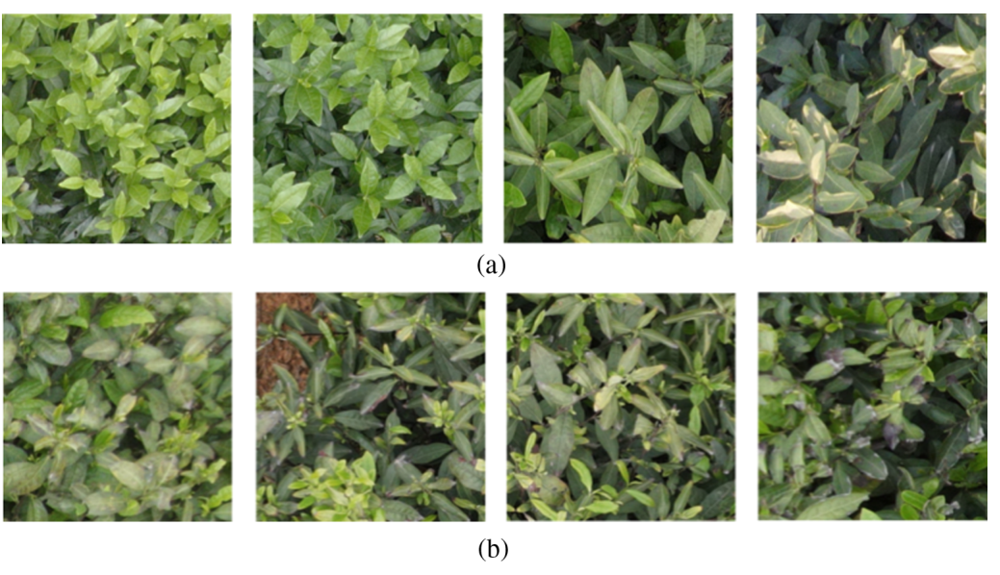

图中 (a) 为健康茶图像块、(b) 为 TLB 图像块，全部图像由农艺专家使用 LabelImg 完成标注。训练图像先经 RCAN 超分辨率重建与 Retinex 对比度增强，再做离线与在线数据增广后输入 DDMA-YOLO 训练；测试图像经同样的超分与增强后输入训练好的网络画框，最后把小块识别结果拼合为大图，完成无人机遥感监测。数据组织是后续所有模块的输入前提。

### RCAN 超分辨率重建

RCAN 超分辨率用于直接学习低分辨率茶图像与高分辨率茶图像之间的映射关系，重建更清晰的茶图像，网络结构如下图所示。

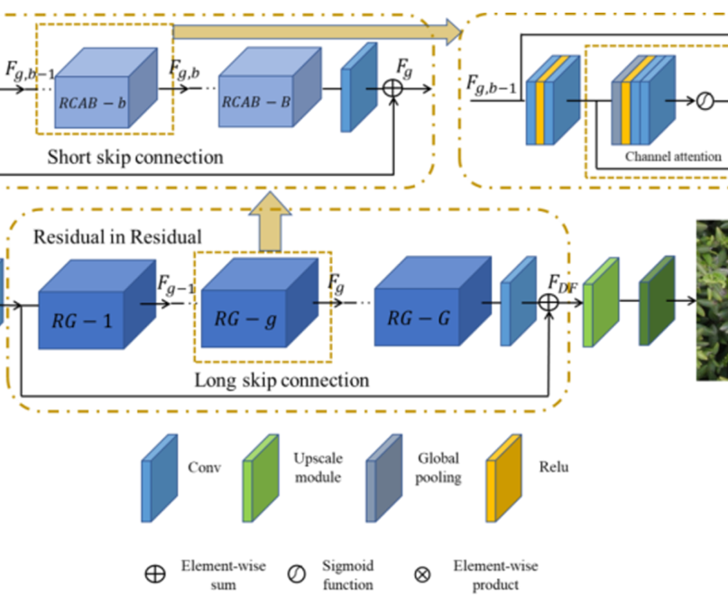

RCAN 由浅层特征提取、残差嵌套（RIR）深层特征提取、上采样与重建四部分组成，借助残差中的残差结构构建极深的可训练网络，并用通道注意力增强特征表达。四个阶段的计算为：

$$F_0 = H_{SF}(I_{LR}), \quad F_{DF} = H_{RIR}(F_0), \quad F_{UP} = H_{UP}(F_{DF}), \quad I_{HR} = H_{REC}(F_{UP}) = H_{RCAN}(I_{LR})$$

| 符号 | 含义 |
| --- | --- |
| $I_{LR}$、$I_{HR}$ | 低分辨率输入与高分辨率输出图像 |
| $H_{SF}$ | 提取浅层特征的卷积操作 |
| $H_{RIR}$ | 含 G 个残差组的极深 RIR 结构 |
| $H_{UP}$、$H_{REC}$ | 上采样模块与重建卷积层 |

这等价于把「模糊—清晰」的映射整体交给一个深度残差网络去拟合，局部与全局残差耦合保证信息流在极深网络中顺畅传递。RCAN 的训练集为无人机在 1 至 2 m 高度拍摄的清晰茶图像；网络收敛后对测试小区的 55 幅图像做重建，部分结果如下图所示。

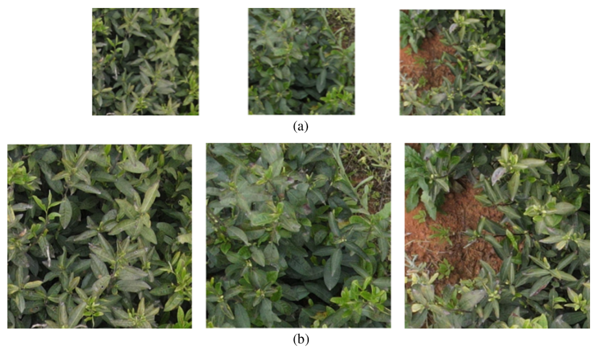

重建得到的 1280×1280 图像再裁为 640×640，共得 110 幅图像用于检测网络测试；重建结果同时送入 Retinex 增强环节。

### Retinex 对比度增强

Retinex 增强用于削弱自然场景光照不均与高飞行高度造成的对比度不足，其原理如下图所示。

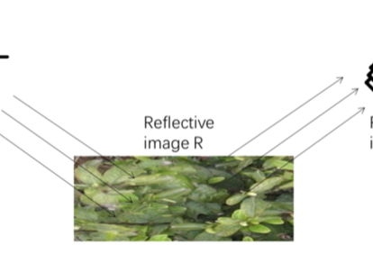

图像被视为入射光图像 L 与反射图像 R 的乘积，即入射光照射反射物后经反射进入人眼形成观测图像 S：

$$S(x, y) = L(x, y) \times R(x, y)$$

其中 $S(x, y)$ 是相机接收的图像信号；$L(x, y)$ 是光照分量；$R(x, y)$ 是物体的反射属性分量。Retinex 的基本思想是去除或削弱光照分量的影响、尽量保留物体反射属性，对等式两边取对数并用高斯核 $F(x, y)$ 与 $S(x, y)$ 的卷积近似照射分量，得到：

$$\log R(x, y) = \log S(x, y) - \log F(x, y) * S(x, y)$$

其中 $F(x, y) * S(x, y)$ 是对照射分量的高斯核卷积近似。直观上，取对数把乘性光照变为加性项再减去，剩下的就是与光照无关的物体反射属性。处理前后的图像对比如下图所示，增强后的图像对比度更明显，作为检测网络的输入。

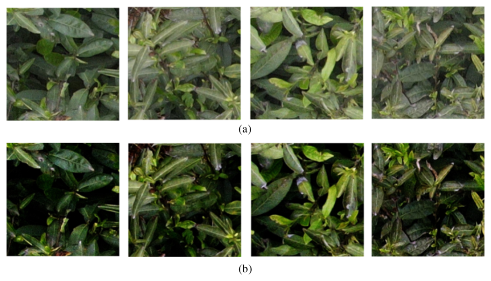

### 离线与在线数据增广

数据增广用于提升训练样本的丰富度与多样性，增强模型泛化能力并加快收敛，两种增广方式如下图所示。

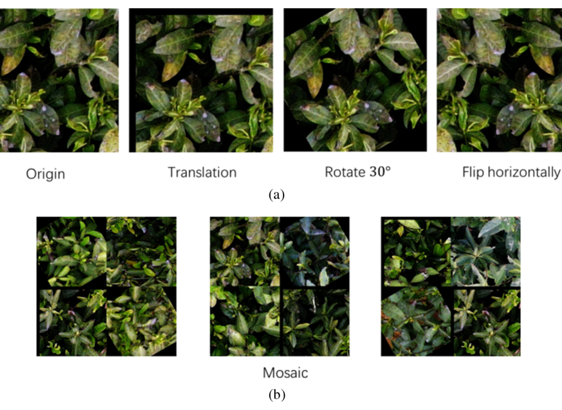

离线增广在训练前对原始训练图像做平移、30° 旋转与水平翻转，使网络获得丰富的角度信息，增广后得到 1200 幅训练图像；在线增广则在每次迭代前以 mosaic 方式对数据做增强。病叶尺寸分布如下图所示，多数病叶介于 30×30 至 130×130 像素之间，小目标占比高，这正是增广与后续 RFB 模块要共同应对的对象。

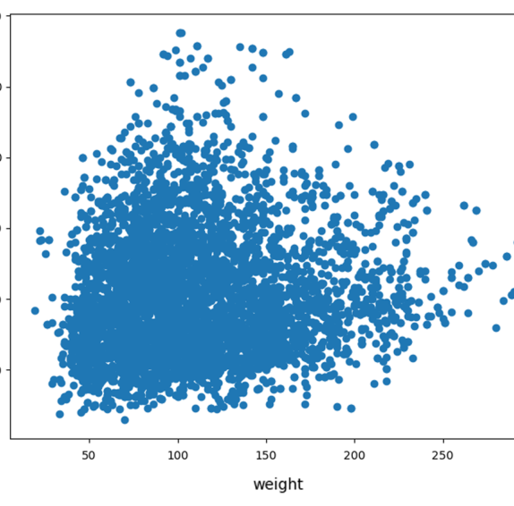

增广后的训练集送入 DDMA-YOLO 训练，测试集不参与增广。

### DDMA-YOLO 总体结构

DDMA-YOLO 以 YOLOv5 为基线，仍分为 Backbone、Neck、Head 三部分，总体结构如下图所示。

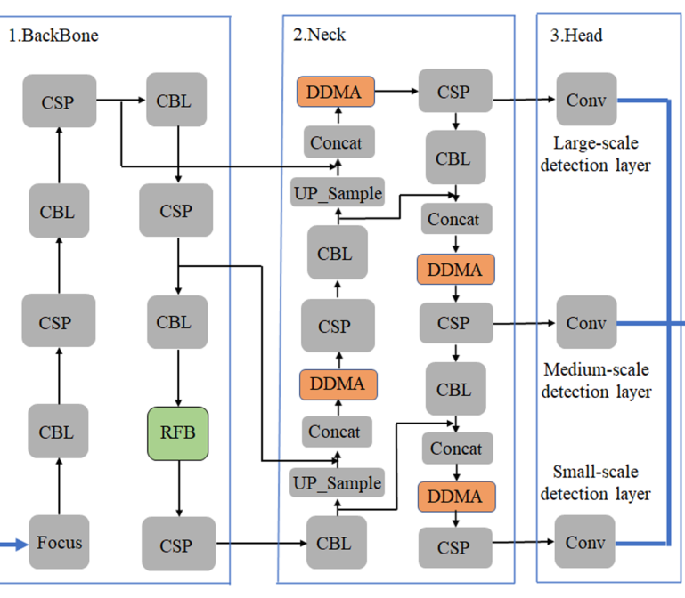

Backbone 依 Focus 与 CSP 结构从输入图像提取特征并传给 Neck；本文按人眼视觉感受野的特点在 Backbone 中加入多尺度 RFB 模块，提升病叶细节特征的提取能力、缓解小叶片漏检。Neck 基于 PANet 生成功能金字塔，双向融合低层空间特征与高层语义特征；本文在保持原有融合方式不变的前提下，在每个 Concat 之后加入 DDMA 模块，缓解密集叶片带来的漏检与误检。Head 在三个尺度的特征图上套用锚框，输出检测类别、坐标与置信度。两处改进分别作用于骨干与颈部，互不干扰又可叠加。

### 多尺度 RFB 模块

RFB 模块用于模仿人眼多尺度观察物体的感知结构，扩大感受野并提取多尺度细节特征，其结构如下图所示。

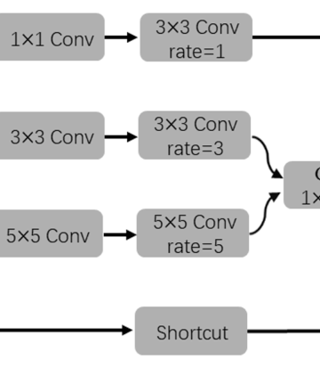

RFB 以 Backbone 提取的特征为输入：各分支先经 1×1 卷积降维；中间两个分支再经过 1×1、3×3 与 5×5 卷积层；随后用空洞率为 1、3、5 的空洞卷积生成不同感受野大小的特征图，并以 1×1 卷积做特征融合；最后借 ResNet 的 shortcut 得到输出。多尺度卷积核应对小目标病叶与健康叶、背景之间的颜色与纹理差异，空洞卷积则在不增加参数的情况下扩大病叶的感受野。RFB 的输出继续送入 Neck 做特征融合。

### DDMA 模块

DDMA 模块用于在颈部抑制冗余背景、聚焦密集分布的病叶，其结构如下图所示。

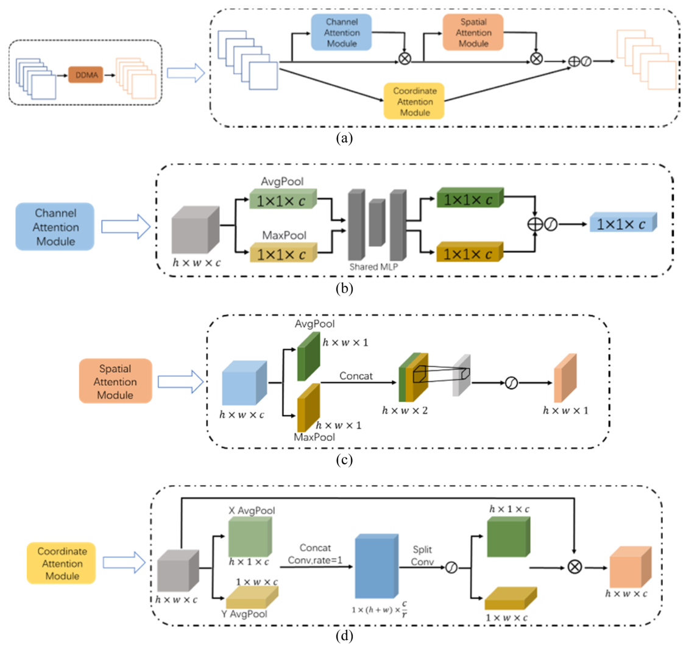

模块分为两条并联分支：上支由通道注意力与空间注意力串联构成，捕获特征的局部相关性；下支为坐标注意力，捕获非局部相关性并保留精确位置信息。上支的通道注意力对输入特征图 F 做 2D 全局池化后送入权重共享的多层感知机，表示为：

$$W_c(F) = \mathrm{sigmoid}\{\mathrm{MLP}[\mathrm{AvgPool}(F)] + \mathrm{MLP}[\mathrm{MaxPool}(F)]\}$$

其中 $\mathrm{AvgPool}$ 与 $\mathrm{MaxPool}$ 分别为平均池化与最大池化；$\mathrm{sigmoid}$ 为激活函数。随后在通道维做 2D 池化得到 h×w×2 的特征，用 7×7 卷积核降维至 1 并加偏置，生成空间注意力图：

$$W_s(F) = \mathrm{sigmoid}\{k_{7\times7}[\mathrm{AvgPool}(W_c(F)); \mathrm{MaxPool}(W_c(F))]\}$$

其中 $k_{7\times7}$ 是 7×7 卷积；方括号内是两种池化结果的拼接。下支先沿水平与垂直两个方向做 1D 全局池化生成方向感知向量，再聚合为方向感知注意力图：

$$z^X = X\mathrm{AvgPool}(F), \quad z^Y = Y\mathrm{AvgPool}(F), \quad F_p = R[\mathrm{Concat}(z^X, z^Y)]$$

其中 $X\mathrm{AvgPool}$ 与 $Y\mathrm{AvgPool}$ 分别为沿水平轴与垂直轴的平均池化；$R[\cdot]$ 表示 1×1 卷积、BN 与 sigmoid 操作。$F_p$ 再分离为两个方向向量，经卷积与非线性处理后与原特征图相乘，得到下支输出 $W_D(F)$；上支输出记为 $W_U(F)$。两支结果融合偏移后得到 DDMA 的处理结果：

$$W(F) = \mathrm{sigmoid}[W_U(F) + W_D(F)]$$

直观上，上支回答「哪些通道与位置重要」，下支回答「目标沿哪个方向排布」，二者相加使输出特征图同时具备局部与非局部特性，符合人眼视觉观察的习惯。DDMA 的输出送回 Neck 的后续融合路径，是检测头之前的最后一道特征筛选。

### 损失函数

DDMA-YOLO 的损失由定位损失、分类损失与置信度损失三部分构成，定义如下：

$$L_{conf} = L_{cls} = -\sum y_i \log x_i, \quad L_{total} = L_{loc} + L_{conf} + L_{cls}$$

其中 $y_i$ 与 $x_i$ 分别为真实标签与预测概率；$L_{loc}$ 选用 CIoU 损失，用于度量预测框与标定框之间的误差并加速收敛；分类与置信度损失均采用交叉熵形式。总损失由随机梯度下降（SGD）优化，驱动骨干、颈部与检测头端到端联合训练。

## 实验结果

### 实验设置

实验在 Windows 10 专业版 64 位系统上基于 PyTorch 1.5 框架完成，GPU 为 NVIDIA GeForce RTX 2060，CUDA 10.1 与 cuDNN 7.6.5 加速；输入尺寸 640×640×3，优化器 SGD，批量 16，训练 200 个 epoch，学习率 0.01，动量 0.937，权重衰减 0.0005。评价指标定义如下：

$$P = \frac{TP}{TP+FP}, \quad R = \frac{TP}{TP+FN}, \quad F_1 = \frac{2 \times P \times R}{P+R}, \quad AP = \int_0^1 P(R)\, dR$$

其中 TP、FP、FN 分别为真正例、假正例与假负例数量；P 与 R 为精确率与召回率；AP 为单类别的平均精度，AP@0.5:0.95 取 AP@0.5 至 AP@0.95 十个值的平均。模型训练曲线如下图所示，训练 200 轮后损失曲线趋于稳定，模型基本收敛。

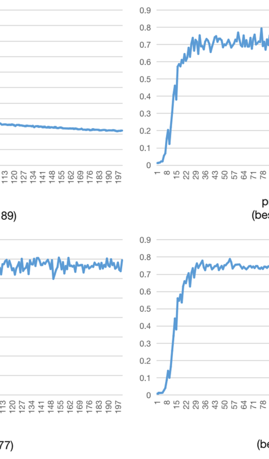

### 超分辨率增益验证

以 YOLOv5 为基线，比较超分辨率前后检测指标的变化，结果如下表所示。

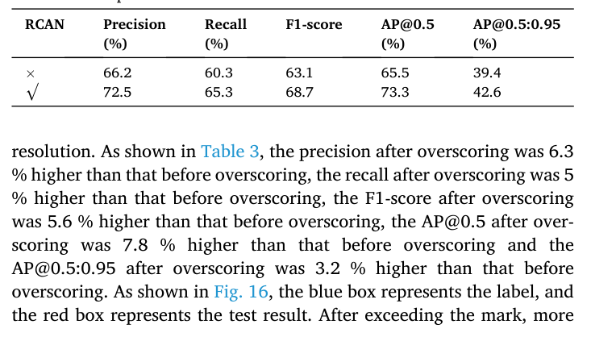

加入 RCAN 后精确率提高 6.3%、召回率提高 5%、F1-score 提高 5.6%、AP@0.5 提高 7.8%、AP@0.5:0.95 提高 3.2%。超分前后检测效果的视觉对比如下图所示，蓝框为标签、红框为检测结果。

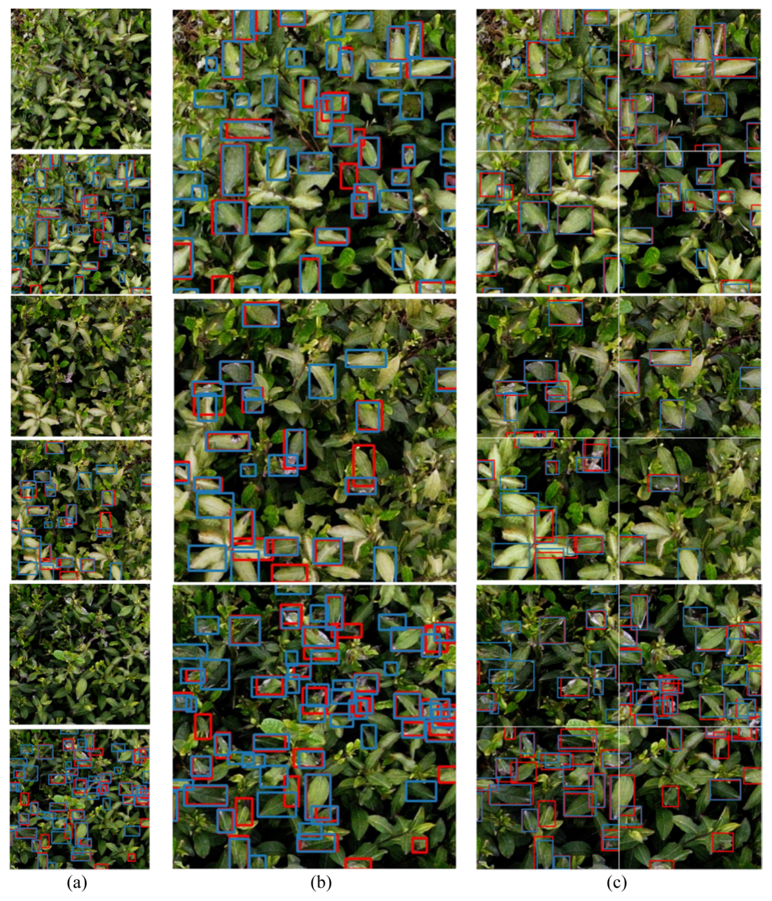

超分前的漏检与误检在超分后明显减少，可见原本模糊的无人机茶图像经重建后含有更多纹理、边缘等结构信息，而纹理结构的强梯度变化恰好利于梯度优化下的检测网络学习。

### 消融实验

RFB 与 DDMA 两个模块的消融结果如下表所示。

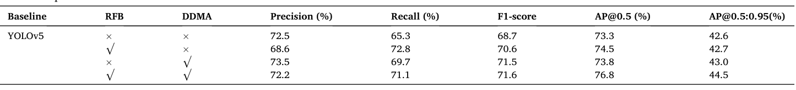

只加 RFB 时召回率提高 7.5%、F1-score 提高 1.9%、AP@0.5 提高 1.2%，但精确率由 72.5% 降至 68.6%，本文将其归因于 RFB 同时增强了目标与冗余背景的感受野；只加 DDMA 时精确率提高 1%、召回率提高 4.4%、F1-score 提高 2.8%；两者同时嵌入时 F1-score 提高 2.9%、AP@0.5 提高 3.5%、AP@0.5:0.95 提高 1.9%、召回率提高 5.8%，达到 76.8% 的 AP@0.5，说明 RFB 弥补了 DDMA 感受野的不足。各组合的检测效果对比如下图所示。

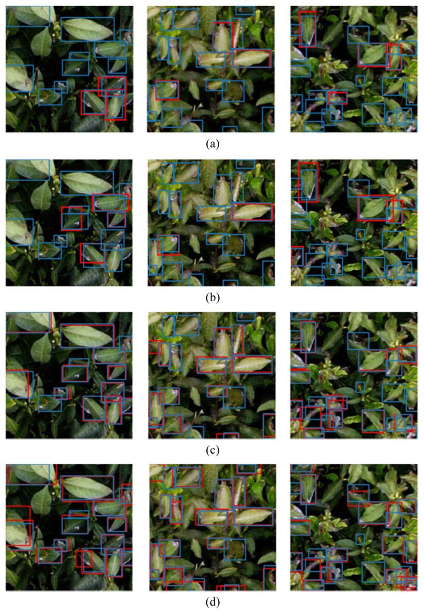

YOLOv5 基线存在较多漏检与误检，逐模块累加后密集病叶的检出逐步完整。不同注意力模块的横向对比如下表所示。

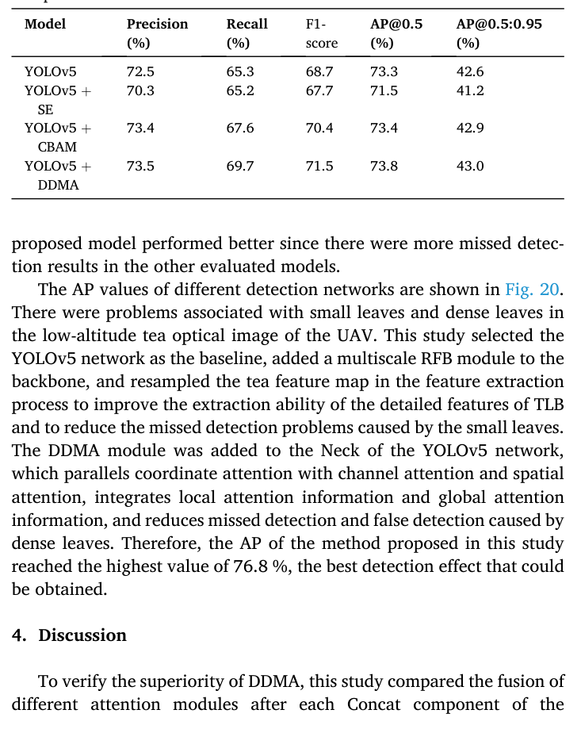

SE 只加权通道维，精确率反而下降 2.2%；CBAM 串联通道与空间两维，F1-score 提高 1.7%；DDMA 比 CBAM 的 F1-score 再高 1.1%、AP@0.5 高 0.4%、AP@0.5:0.95 高 0.1%，表明在密集病叶场景下并联局部与非局部注意力优于单纯串联。

### 对比实验

与主流检测模型的定性对比如下图所示，先给出与两阶段及单阶段经典方法的对比。

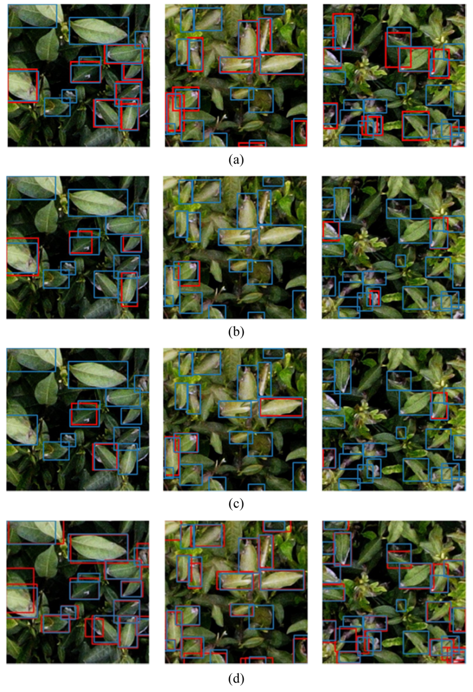

Faster R-CNN、RetinaNet 与 SSD 的检测结果中存在更多漏检框。与 YOLO 系列各版本的对比如下图所示。

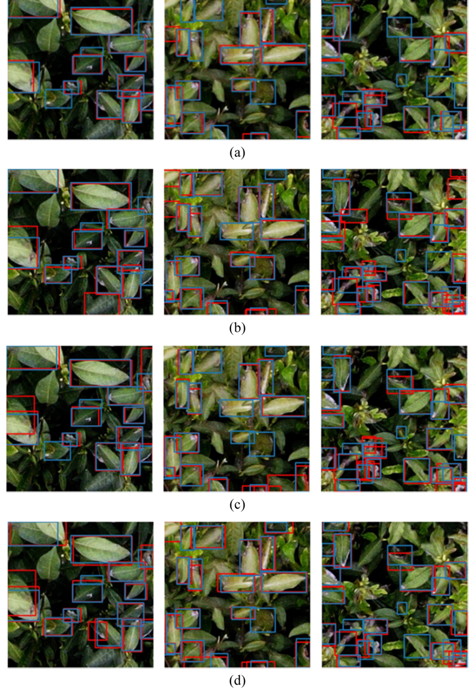

YOLOv3、YOLOv4、YOLOv5 的检测结果同样存在更多漏检框，而本文模型在密集小病叶上的检出最完整。各模型的 AP 值对比如下图所示。

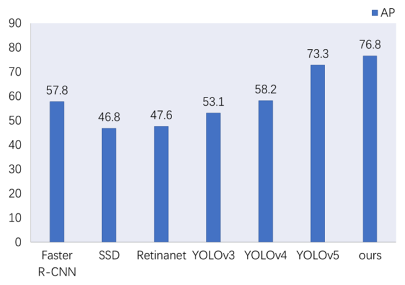

本文方法的 AP 达到最高值 76.8%，结合摘要中相对基线 AP@0.5 提高 3.8%、召回率提高 6.5% 的报告，可以看出多尺度 RFB 与 DDMA 的组合在低空茶园光学图像上取得了最好的检测效果。

### 可视化分析

不同注意力模块输出特征的热力图如下图所示。

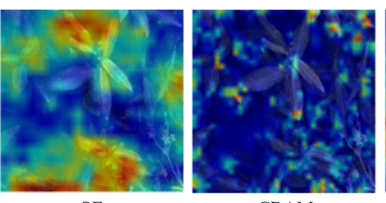

DDMA 对目标区域的响应比 SE 与 CBAM 更集中，背景响应被进一步压制，与表 5 中 DDMA 的指标优势相互印证。超分辨率重建质量的可视化结果如下图所示。

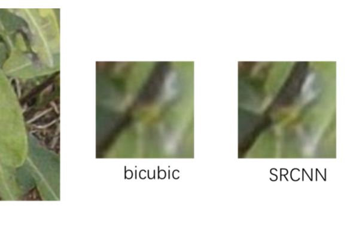

三种重建方法的定量指标如下表所示。

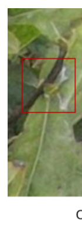

与 bicubic（PSNR 37.74、SSIM 0.9572）和 SRCNN（PSNR 41.36、SSIM 0.9773）相比，RCAN 的 PSNR 与 SSIM 最高（41.90 与 0.9779），重建图像含有更丰富的纹理结构信息，说明选择 RCAN 作为前置超分模块是合理的。

### 进一步讨论

本文指出，训练后的 DDMA 模型既可部署于无人机平台做现场检测，也可部署于服务器端接收无人机回传图像做后端检测；前者可接入基于无人机的精准喷药系统，按 TLB 严重程度施用对应农药与浓度。本文方法尚缺少对 TLB 病害严重程度的估计，面向实时喷药系统时模型还需进一步轻量化，原文将这两点列为后续研究方向。

## 优点和创新点

个人认为，本文有如下一些优点和创新点可供参考学习：

1. 把超分辨率重建、Retinex 增强与检测网络串成完整流水线，用 RCAN 补偿无人机飞行高度带来的分辨率损失，超分前后 AP@0.5 相差 7.8%，前置环节的增益被单独量化。
2. 针对密集小病叶设计并联式双维混合注意力 DDMA，上支捕获局部相关性、下支保留位置信息，与 SE、CBAM 的对比实验和热力图共同支撑了设计动机。
3. 实验覆盖超分验证、模块消融、注意力对比、多模型对比与可视化五组证据，并给出 8 步可复现的监测流程，工程落地路径清晰，说服力强。
