# 基于 DFR-SN-YOLO 的棉花顶芽识别方法

Paper Reading 是从个人角度进行的一些总结分享，受到个人关注点的侧重和实力所限，可能有理解不到位的地方。具体的细节还需要以原文的内容为准，博客中的图表若未另外说明则均来自原文。

| 论文概况 | 详细 |
| --- | --- |
| 标题 | 《基于 DFR-SN-YOLO 的棉花顶芽识别方法》 |
| 作者 | 方会敏、徐全旺、陈学庚、张庆怡、鲁佳录 |
| 发表期刊 | 农业工程学报 |
| 期刊等级 | 未获取 |
| 发表年份 | 2025 |
| 论文代码 | 未获取 |

作者单位：

1. 江苏大学农业工程学院
2. 现代农业装备与技术教育部重点实验室（江苏大学）
3. 石河子大学机械电气工程学院

## 研究动机

棉花打顶是棉花种植过程中的重要环节，表现为通过抑制顶端生长优势控制主茎生长、减少无效果枝对水肥的徒耗，导致打顶是否及时准确直接决定增产增收效果；人工打顶强度大、成本高，化控打顶易引发药害，机械打顶以物理方式摘除顶芽、更适合规模化种植，而密植下精准识别顶芽是精准机械打顶的前提。然而现有识别研究通常将单一特征作为识别目标：顶芯尺寸较小、容易被遮挡，直接识别的效果较差；顶叶的形态、颜色和尺寸受棉株个体生长差异影响，识别效果不稳定，易被植株其余展开叶干扰。与此对应，通用检测模型在密植棉田中面对小而易遮挡的顶芯时漏检率高、精度低，且参数量与计算成本难以匹配边缘设备的算力。暂未有工作在同一检测框架内同时利用顶叶与顶芯位置相对的结构关联性来压低顶芯漏检，并兼顾模型轻量化与边缘端实时推理。

## 文章贡献

针对密植环境下棉花顶芽漏检率高、精度低的问题，本文提出了基于 YOLOv5s 的棉花顶芽检测模型 DFR-SN-YOLO，其核心是利用顶叶和顶芯位置相对的结构关联性，将两者同时作为识别目标。首先使用 DWConv 和改进后的 C3_Faster 重设轻量高效的主干提取顶芽特征，并在主干引入具有位置信息的 CA 注意力获取更多顶芯信息；接着在颈部融入感受野注意力的 C3_RFCBAMConv 模块，提高模型从全局特征识别到顶芯的能力；最终提出 SN-IoU（Shape-NWD-IoU）损失函数，考虑顶芽自身形状同时注重小目标的提取。实验表明，DFR-SN-YOLO 相较原模型 mAP@50 提高到 97.5%，顶芯准确率提高到 92.4%，召回率达到 95.0%，参数量下降 44% 至 3.9 M，边缘部署推理速度为 37 帧/s。

## 本文方法

### 顶芽数据集与双目标定义

传统人工打顶摘除顶部"一叶一芯"，因此本文将顶芯和顶叶同时定义为检测对象：顶叶是主茎顶端的嫩叶，顶芯是处于顶叶梗结相对位置的嫩芽。数据集于 2024 年 7 月在新疆石河子市和沙湾市采集，模拟打顶设备作业场景，在距离顶芽 20～40 cm 和 50～80 cm 处分别使用相机和无人机，覆盖单株与多株、遮挡、弱光与强光等状态，裁剪后共 1 023 张，经调整饱和度、添加噪声、角度反转等增强扩充到 5 115 张，按 7:2:1 划分为三个子集，标注为顶芯和顶叶 2 类。部分样本如下图所示。

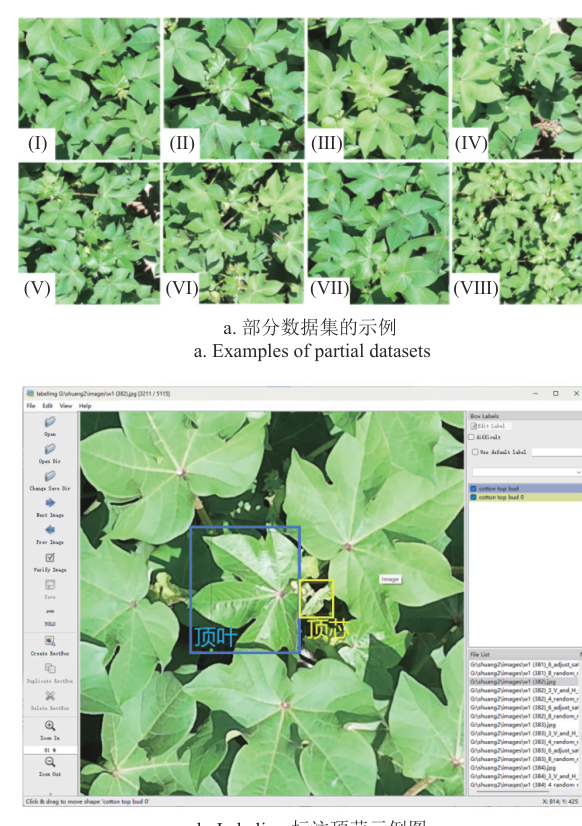

图中给出单株与多株、遮挡与强光照等 8 类样本，顶叶用深色框标记、顶芯用浅色框标记；双目标定义使顶芯被完全遮挡时可通过顶叶间接确定打顶位置。

### 整体架构与模块命名

DFR-SN-YOLO 以 YOLOv5s 为基准，网络由输入、主干、颈部和检测头 4 个部分构成。模型名称与其改进模块对应：DFR 指主干 DWConv、C3_Faster 重构与颈部 RFCBAMConv（消融中 D-DF 即 DWConv 结合 C3_Faster），SN 指 Shape-NWD-IoU 损失。整体结构如下图所示。

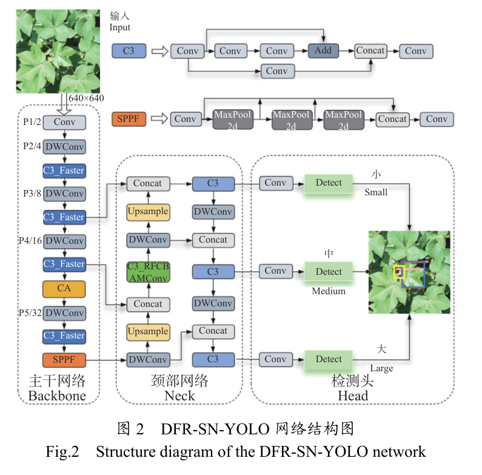

图中主干以 DWConv 和 C3_Faster 替换 Conv 与 C3，并在 P5 特征层提取前加入 CA；颈部以 C3_RFCBAMConv 替换 C3；检测头保持 3 种尺度。各组件分工如下表所示。

| 组件 | 模块 | 功能 |
| --- | --- | --- |
| Backbone | DWConv + C3_Faster + CA（第 7 层） | 轻量化特征提取并注入位置信息 |
| Neck | C3_RFCBAMConv（第 13 层） | 感受野注意力增强的特征融合 |
| Head | 小、中、大 3 尺度检测头 | 输出顶芯与顶叶检测框 |
| Loss | SN-IoU | 兼顾形状尺度与小目标的回归损失 |

主干输出的多尺度特征经颈部融合后送入 3 个检测头，CA 与 C3_RFCBAMConv 的增强在特征流内部完成，对检测头透明。

### 轻量化主干：DWConv 与 C3_Faster

DWConv 的目标是在保持性能的同时减少参数量与计算需求：深度可分离卷积由深度卷积和逐点卷积组成，每个通道仅需与一个滤波器卷积。设卷积核大小为 $D_K \times D_K$、输入与输出通道为 $M$、$N$，深度可分离卷积与标准卷积的参数量之比为：

$$\frac{D_K \cdot D_K \cdot M + M \cdot N}{D_K \cdot D_K \cdot M \cdot N} = \frac{1}{N} + \frac{1}{D_K^2}$$

其中 $D_K$ 为卷积核大小，$M$、$N$ 为输入与输出通道数，计算量之比形式相同。一般地 $N$ 较大可忽略不计，使用 3×3 卷积核时参数量和计算量可下降到原来的 1/9 左右，这等价于把稠密卷积拆成两步稀疏操作。

但是单独使用 DWConv 不一定带来速度的提高：PWConv 遵循 Conv 会使通道数从 $C$ 增加到 $C'$，导致更多内存访问。Conv 和 DWConv 的内存访问量为：

$$H \cdot W \cdot 2C' + n^2 \cdot C' \approx H \cdot W \cdot 2C'$$

其中 $H$、$W$ 为特征图的高度和宽度，$n$ 为卷积核的大小，$C'$ 为扩展后的通道数。为此本文引入 FasterNet 的部分卷积 PConv，利用特征冗余缓解内存访问和计算冗余，其内存访问量为：

$$H \cdot W \cdot 2C_P + n^2 \cdot C_P^2 \approx H \cdot W \cdot 2C_P$$

其中 $C_P$ 表示受部分卷积影响的通道数。与传统卷积相比 PConv 只需要 1/16 的计算操作，内存访问减少到 1/4，且采用 T 型感受野卷积更强调中心位置。三类主干创新模块的结构如下图所示。

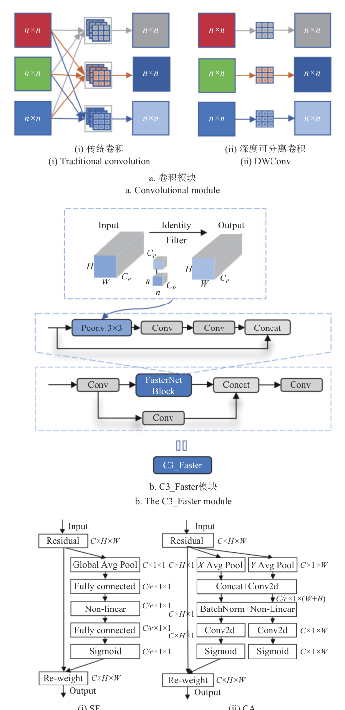

图 a 对比两种卷积，图 b 给出 PConv 只作用于输入通道子集、保留其余通道并集成到 C3 中形成 C3_Faster，图 c 对比 SE 与 CA。二者产物沿主干逐级传递，在 P5 特征层提取前交给 CA，再进入颈部网络。

### CA 位置注意力

CA 的目标是为轻量化主干补充位置敏感的注意力。轻量化网络中应用最多的 SE 通过 2D 全局池化计算通道注意力，但忽视了位置信息；对于棉株顶芽，顶叶位于植株中心、顶芯处于顶叶相对位置，位置信息十分重要。CA 通过 1D 池化将输入特征图分别在水平和垂直方向池化，生成 $C \times 1 \times W$ 和 $C \times H \times 1$ 的特征图以保留位置信息，连接后经卷积生成 2 个方向上的注意力权重并作用回输入特征图。这等价于把通道注意力沿两个空间方向分解，在低成本下同时编码通道与位置。本文在主干 P5 特征层提取前（第 7 层）加入 CA，输出送入后续主干层与颈部网络。

### 颈部网络融入感受野注意力的 C3_RFCBAMConv

C3_RFCBAMConv 的目标是把空间注意力从输入特征图转移到感受野的空间特征上。现有空间注意力无法关注感受野的空间特征，对不同尺寸的感受野仅作相同处理，也难以共享大尺度卷积核的参数；RFA 感受野注意力强调感受野中各个特征的重要性，并能基于感受野空间特征灵活调整卷积核参数。由于 RFAConv 的注意力图会增加较多参数量，本文采用引入 CBAM 的 RFCBAMConv 作为基本卷积模块并融入 C3，同时将通道注意力 CAM 改为 SE，并让两种注意力并行运算。模块结构如下图所示。

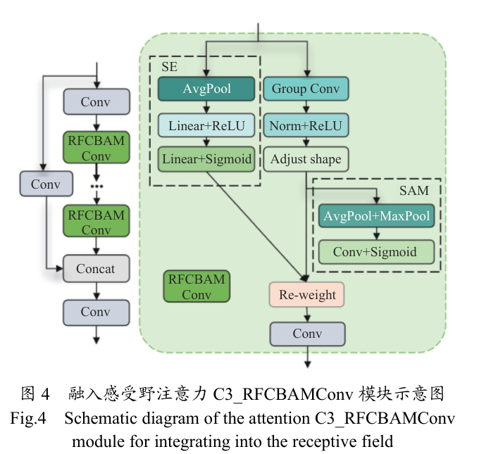

图中左侧为 C3 内串接的 RFCBAMConv 卷积链，右侧虚线框内为并行的 SE 与 SAM 支路。SE 的压缩与激励计算为：

$$z_C = F_{sq}(u_C) = \frac{1}{W \cdot H}\sum_{i=1}^{W}\sum_{j=1}^{H} u_C(i, j), \quad F_{ex}(z, W) = \sigma(g(z, Y)) = \sigma(Y_2 \delta(Y_1 z))$$

其中 $F_{sq}$ 表示使用全局平均池化的压缩操作，$u_C$ 和 $z_C$ 表示变换前后每个通道的特征图，$F_{ex}$ 表示通过两次全连接层学习通道权重矩阵的过程，$\sigma$ 和 $\delta$ 表示不同的非线性激活函数，$Y$ 表示全连接层计算中压缩的通道。SAM 的空间注意力权重计算为：

$$M_s(F) = \sigma(f^{7\times7}([\mathrm{AvgPool}(F); \mathrm{MaxPool}(F)]))$$

其中 $M_s$ 表示经池化、卷积和激活运算后得到的空间注意力权重，$f^{7\times7}$ 表示 7×7 的卷积操作。流程上先经分组卷积并调整形状生成感受野空间特征图，再由 SAM 与 SE 两支路加权后经卷积获得输出。在网络中 C3_RFCBAMConv 替换颈部第 13 层的 C3，输出特征送入检测头。

### SN-IoU 损失函数

SN-IoU 的目标是让边界框损失同时考虑顶芽自身形状尺度与小目标特性。Shape-IoU 关注边界框本身形状和尺度，先计算两框交互比：

$$\mathrm{IoU} = \frac{|b_p \cap b_{gt}|}{|b_p \cup b_{gt}|}$$

其中 $b_p$ 为预测框，$b_{gt}$ 为真实框。再由真实框宽度 $w_{gt}$、高度 $h_{gt}$ 计算水平与竖直方向的权重系数：

$$w_w = \frac{2(w_{gt})^{scale}}{(w_{gt})^{scale} + (h_{gt})^{scale}}, \quad h_h = \frac{2(h_{gt})^{scale}}{(w_{gt})^{scale} + (h_{gt})^{scale}}$$

其中 $scale$ 为与数据集中顶芽尺度有关的尺度因子，$w_w$、$h_h$ 为权重系数，取值与框的形状有关。在此基础上距离修正项与形状损失计算为：

$$distance_{shape} = h_h \cdot \frac{(x_c - x_c^{gt})^2}{c^2} + w_w \cdot \frac{(y_c - y_c^{gt})^2}{c^2}, \quad L_{Shape} = 1 - \mathrm{IoU} + distance_{shape} + 0.5\,\Omega_{shape}$$

其中 $(x_c, y_c)$、$(x_c^{gt}, y_c^{gt})$ 为预测框与真实框的矩心坐标，$c$ 为两框最小外接框对角线长度，$\Omega_{shape}$ 为由两框宽高差加权求和得到的形状修正系数（指数 $\theta = 4$）。直观上，框越扁或越窄，对应方向的中心距离惩罚就越重。

NWD-IoU 则针对小目标设计：矩形框 B 平移 3 个像素得到 C 时 IoU 从 0.53 减至 0.06，说明传统损失对小尺度更敏感。NWD 把框建模成高斯分布并用 Wasserstein 距离度量相似度来代替 IoU，对两个 2D 高斯分布 $\mu_1 = N(m_1, \Sigma_1)$ 和 $\mu_2 = N(m_2, \Sigma_2)$，其二阶 Wasserstein 距离定义为：

$$W_2^2(\mu_1, \mu_2) = \|m_1 - m_2\|_2^2 + \mathrm{Tr}(\Sigma_1 + \Sigma_2 - 2(\Sigma_2^{1/2} \Sigma_1 \Sigma_2^{1/2})^{1/2})$$

其中 $m_1$、$m_2$ 和 $\Sigma_1$、$\Sigma_2$ 分别为两分布的均值向量和协方差矩阵，Tr 表示矩阵迹运算。将边界框建模的高斯分布代入并指数归一化，得到归一化 Wasserstein 距离及其损失：

$$\mathrm{NWD}(N_a, N_b) = \exp\left(-\frac{\sqrt{W_2^2(N_a, N_b)}}{Q}\right), \quad L_{NWD} = 1 - \mathrm{NWD}(N_a, N_b)$$

其中 $Q$ 为与数据集有关的常数，$N_a$、$N_b$ 为由边界框 A、B 建模的高斯分布。综合考虑二者优势，本文将两者按权重比融合（iou_ratio 为 0.8）得到 SN-IoU，定义如下：

$$Loss = iou\_ratio \cdot (1.0 - L_{NWD})^{mean} + (1 - iou\_ratio) \cdot (1.0 - L_{Shape})^{mean}$$

其中 $iou\_ratio$ 为两种损失的融合权重比。这等价于用 NWD 稳住小目标召回、用 Shape 收紧边界框的形状尺度。损失函数示意如下图所示。

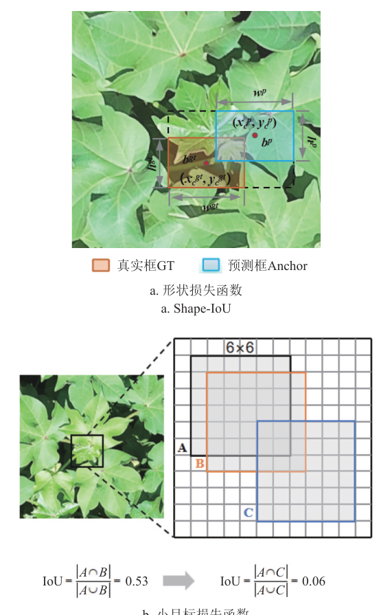

图 a 为形状损失中预测框与真实框的几何关系，图 b 给出矩形框平移后 IoU 骤降而 NWD 保持稳定的小目标情形。SN-IoU 作用于检测头回归分支，替代基线的 CIoU 损失。

## 实验结果

### 实验设置

训练在 Windows 11 上完成，框架为 Python 3.8 和 PyTorch 1.11.0（CUDA 11.3），硬件为 24 GB 显存的 NVIDIA RTX 4090；指标包括 P、R、mAP@50、mAP@[50-95]、参数量和 GFLOPs，顶芯、顶叶准确率与召回率记为 SP、SR 和 BP、BR。本文先评估常用 YOLO 模型以选择基准，结果如下表所示。

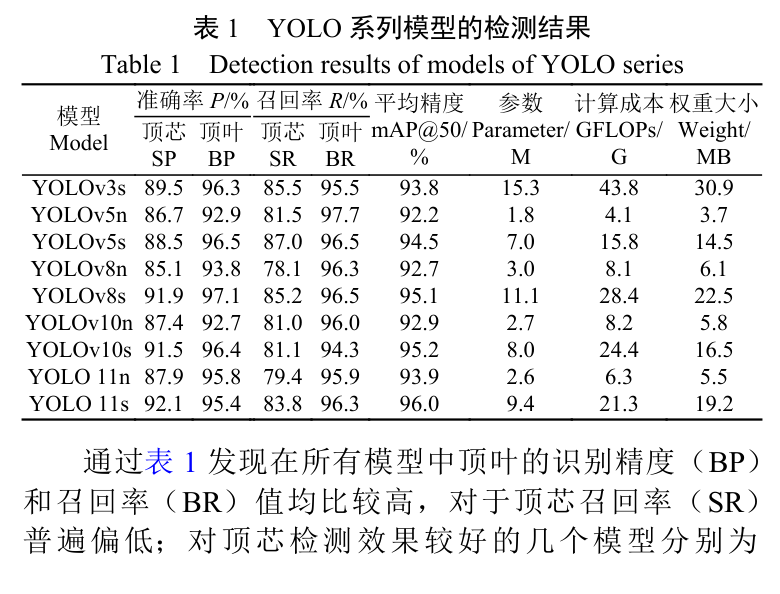

所有模型顶叶的精度和召回率均较高，而顶芯召回率普遍偏低；YOLOv3、YOLOv8 和 YOLO11 的顶芯准确率虽高于 v5，但召回率偏低且计算成本更高，而 YOLOv5 具有成熟的工具链与部署支持，可见 YOLOv5s 适合作为基准模型。超参数设置如下表所示。

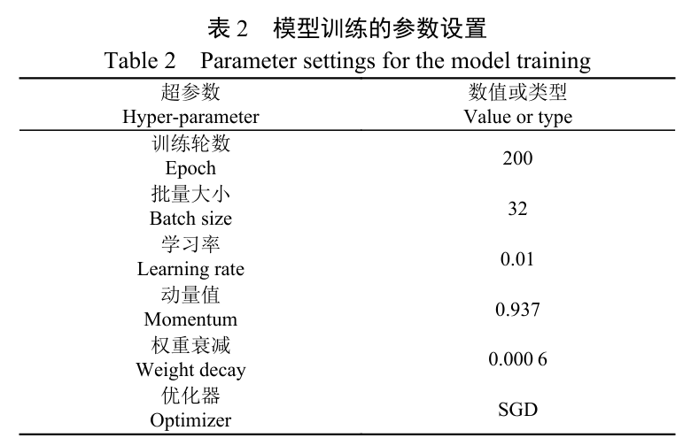

模型训练 200 轮，批量大小 32，初始学习率 0.01，动量值 0.937，权重衰减 0.0006，优化器为 SGD。

### CA 注意力位置与机制对比

针对顶芯检测精度低的问题，本文在主干第 7 层引入 CA 增加位置信息，并与原模型、其他层引入 CA 的模型及 GAM、EMA、ECA、NAM、SE、CBAM 等注意力机制对比，试验结果如下表所示。

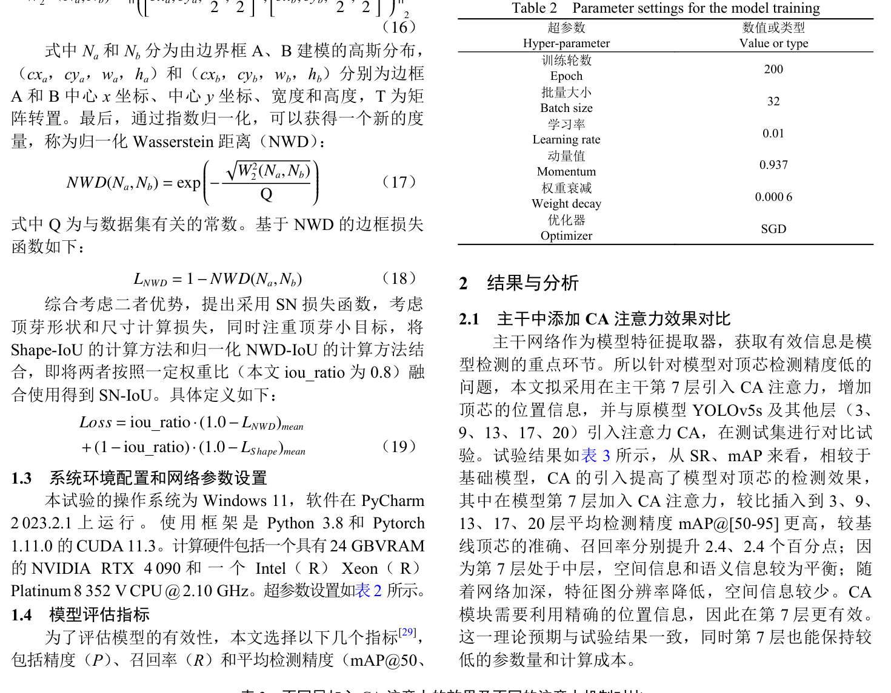

从 SR 和 mAP 来看 CA 的引入提高了顶芯检测效果，第 7 层加入 CA 的 mAP@[50-95] 高于其他层，较基线顶芯准确率、召回率分别提升 2.4、2.4 个百分点；不同注意力中 CA、CBAM、SE、ECA 分别提升 mAP@50 达 1.4、0.9、0.6、0.3 个百分点，CA 对顶芯提升最高。这表明第 7 层空间与语义信息较为平衡，CA 的位置信息与顶芯顶叶的相对位置关系相匹配。

### 颈部感受野模块的有效性

为验证 C3 中融入 RFCBAMConv 的有效性，本文将其与 C3 融入 RFAConv、RFCAConv 及原始 C3 的模型对比，并对比不同层的替换效果，结果如下表所示。

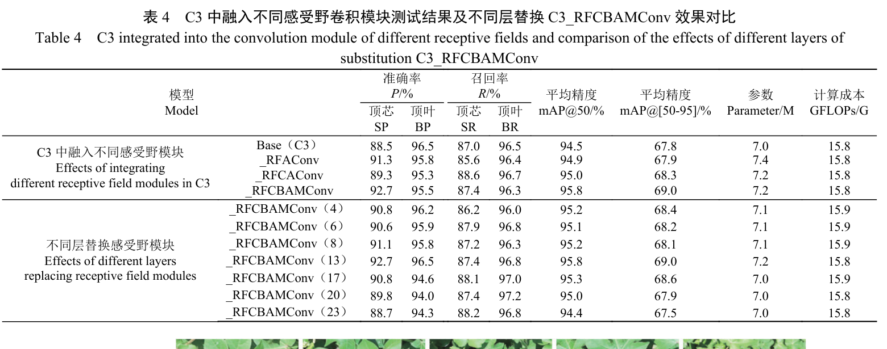

使用 C3_RFCBAMConv 得到顶芽的平均精度更高且参数较少，验证了 CBAM 中替换 SE 可在更少参数下提升 RFA 的性能；第 13 层替换的精度高于 4、6、8、17、20、23 层，且层数加深后提升效果越来越不明显，可见第 13 层替换效果较佳。

### 轻量化主干比较

本文采用 Ghost、ShuffleNetv2、MobileNetv3、DSConv、DWConv 及 C3_Faster 等常用轻量化模块重构主干，其余部分沿用前文验证过的高效模块，对比试验结果如下表所示。

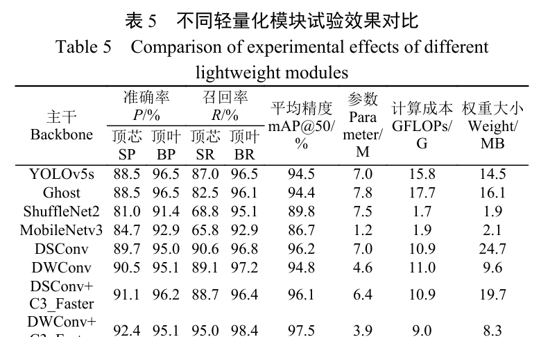

引入 ShuffleNetv2、MobileNetv3 轻量效果最显著，但顶芯召回率低至 70% 以下；DWConv 结合 C3_Faster 的新主干在结合 CA 等模块后计算成本、权重大小降到 9.0 G、8.3 M，同时顶芯召回率提升到 95.0%。可见高效卷积加部分卷积比整网轻量化更能兼顾压缩与小目标特征提取。

### 损失函数对比

为确定最优融合权重，本文先分析不同 iou_ratio 下的模型性能，再将 SN 与 CIoU、SIoU、EIoU、MPD、Shape、NWD 等损失函数比较，试验结果如下表所示。

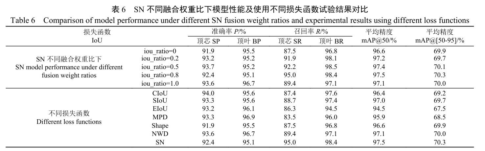

增加 iou_ratio 会带来顶芯召回率升高，但 iou_ratio 为 1 时又带来抑制效果，取 iou_ratio=0.8 时 SR、mAP@50 和 mAP@[50-95] 最高，分别为 95.0%、97.5% 和 70.3%；相比基线 CIoU，SIoU、Shape、NWD 和 SN 均提高了小目标检测能力，其中 SN 最高。各损失训练中平均精度的变化如下图所示。

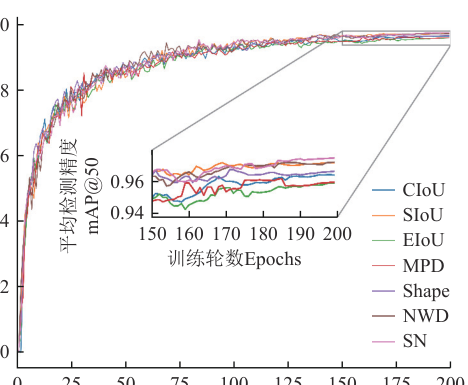

模型在 200 轮训练后收敛，Shape、SIoU 及 NWD 均提高了顶芽平均精度，而 SN 超过上述损失单独使用时的精度。这表明形状约束与尺度不敏感度量的融合比单一损失更适配顶芽的边界框回归。

### 消融实验

为评估各改进是否达到预期效果，本文对 A-CA、B-C3_RFCBAMConv、C-SN、D-DF 四个模块做单独与组合验证，消融结果如下表所示。

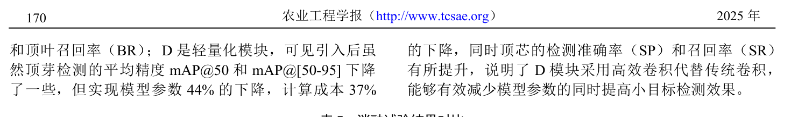

单独使用时 A 使顶芯准确率、召回率分别提高 2.4 个百分点，B 提高顶芯准确率 4.2 个百分点，D 使参数下降 44%、计算成本下降 37% 的同时顶芯准确率和召回率有所提升；四模块组合后顶芯召回率升至 95.0%，mAP@50 和 mAP@[50-95] 达 97.5% 和 70.3%。可见四模块相互补偿：D 过滤背景噪声后 A 能更精准定位顶芯位置，B 能更有效捕获关键感受野内的顶芯结构，C 依赖的边界框预测也更准确。

### 不同检测网络对比

为证实改进的有效性，本文与 YOLO 系列、二阶段网络 Faster_RCNN、Mask_RCNN、Cascade_RCNN、DETR-R50 及现有顶芽识别模型 YOLOv5-cpp、Bud-YOLO 比较，结果如下表所示。

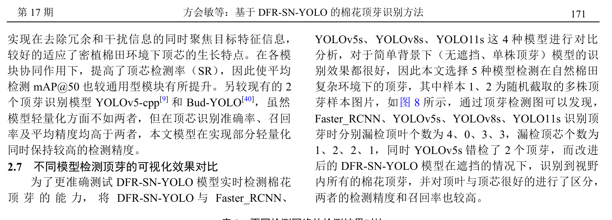

二阶网络参数量是 YOLO 系列的 4～7 倍，顶芯召回率只有 50% 左右且检测速率较低；本文模型 mAP@50 比 YOLOv3、YOLOv5s、YOLOv8s、YOLOv10s、YOLO11s 分别提高 3.7、3.0、2.4、2.3、1.5 个百分点，顶芯召回率分别提高 9.5、8.0、9.8、13.9、11.2 个百分点，权重文件分别减少 22.6、6.2、14.2、8.2、10.2 MB。这说明顶芽识别中参数量与精度并未呈现正相关性，通用模型的部分计算消耗在与顶芯检测无关的信息上。

### 定性检测效果对比

为测试复杂环境下的实时检测能力，本文选择多株顶芽样本与 Faster_RCNN、YOLOv5s、YOLOv8s、YOLO11s 对比，结果如下图所示。

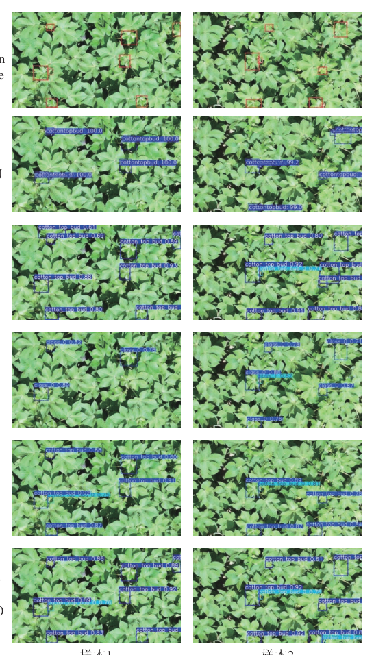

四种对比模型分别漏检顶叶 4、0、3、3 个、漏检顶芯 1、2、2、1 个，YOLOv5s 还错检 2 个顶芽，而 DFR-SN-YOLO 在遮挡情况下识别到视野内所有顶芽并很好区分顶叶与顶芯。可见改进模型在遮挡场景下同时保持了较高的精度和召回率。

### 可视化分析

为验证 C3_RFCBAMConv 是否使模型将视线转移到感受野空间特征上，本文对未使用（Base）和使用该模块的模型生成顶芽特征热力图，结果如下图所示。

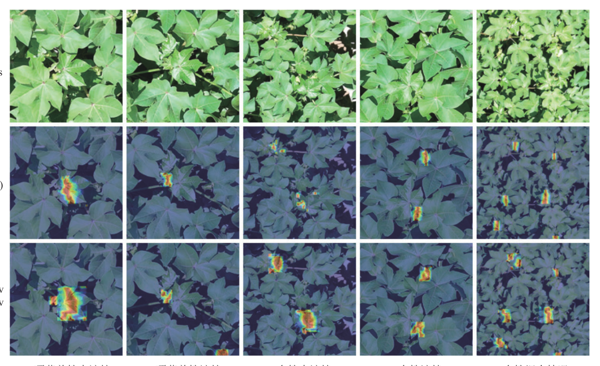

以单株未遮挡样本为例，基础模型没有识别到顶芯，加入感受野模块后明显识别到顶芯特征（热力图越红说明对该特征越敏感），其余图片结论一致。这表明感受野模块使模型对顶芽区域的特征响应更为集中。

### 边缘设备部署

为验证边缘端性能，本文将模型部署到 NVIDIA Jetson Orin Nano 4 GB 并利用 TensorRT 加速：导出静态 ONNX 模型，经 onnxsim 优化后用 trtexec 构建推理引擎。与 YOLOv5n、YOLOv5s 对同一区域被遮挡顶芽的检测对比如下图所示。

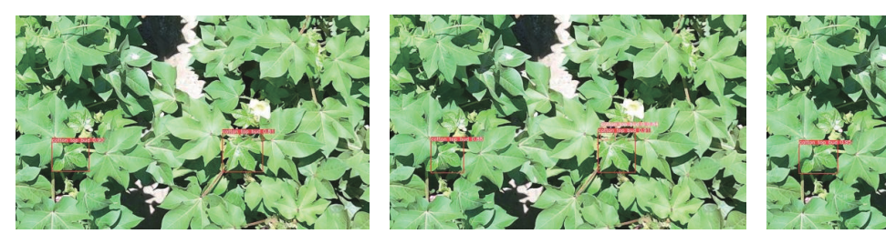

三幅画面分别为三种模型在同一遮挡区域的检测界面，改进模型的检测框明显更完整。检测个数与帧率的统计结果如下表所示。

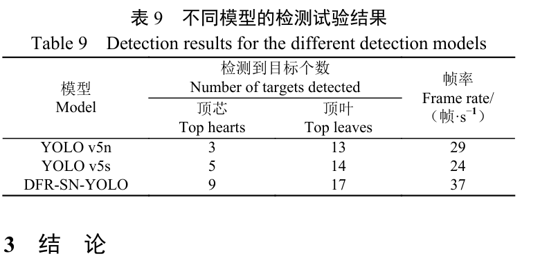

三种模型检测到顶芯和顶叶总个数分别是 16、19、26，YOLOv5n、YOLOv5s 分别漏检顶芯 6、4 个；部署帧率分别是 29、24、37 帧/s，改进模型相对两者分别提高 27%、54%，高于一般视频帧率。可见 DFR-SN-YOLO 在边缘设备上检测效果与推理速度均有优势，能满足实时检测要求。

## 优点和创新点

个人认为，本文有如下一些优点和创新点可供参考学习：

1. 利用顶叶与顶芯位置相对的结构关联性，将两者同时建模为检测目标并配合 CA 位置注意力，使顶芯召回率提升到 95.0%，有效缓解密植棉田的顶芯漏检问题。
2. 将 Shape-IoU 的形状尺度约束与 NWD-IoU 的尺度不敏感度量按权重比融合为 SN-IoU 损失，是小目标边界框回归中可供参考的损失设计范式。
3. 实验链条完整，覆盖注意力插入位置、轻量化主干选型、损失权重比消融与 Jetson Orin Nano 边缘部署，37 帧/s 的推理速度说服力强。
