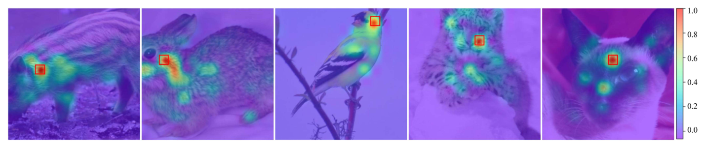
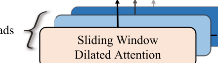
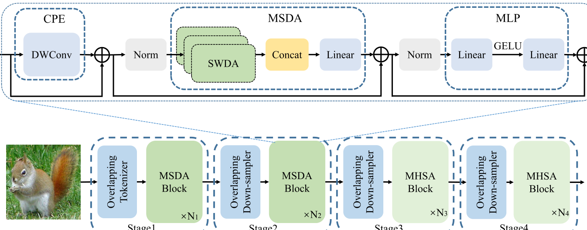
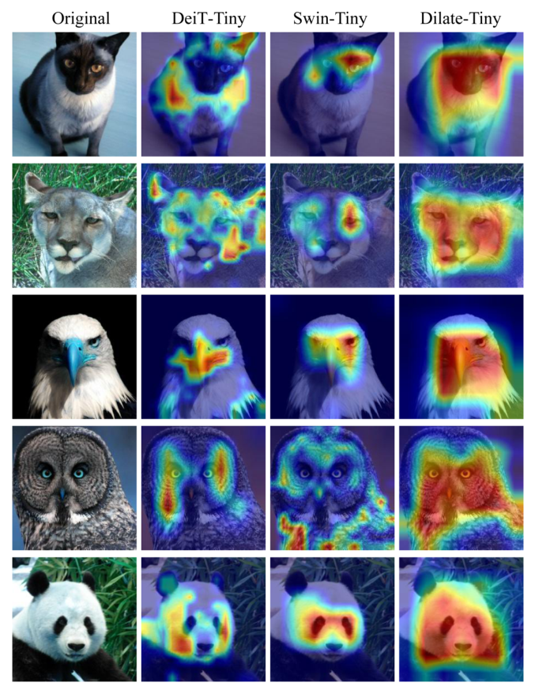
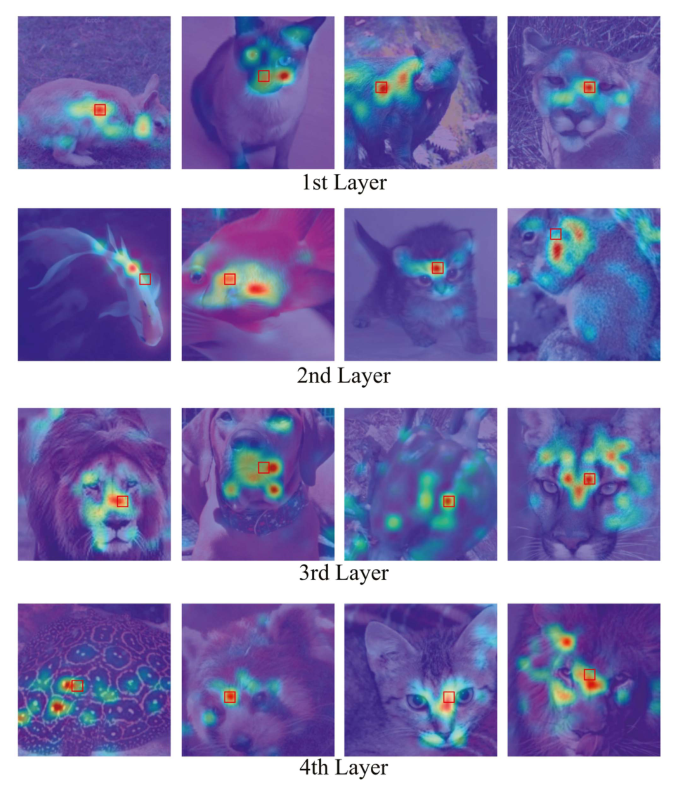
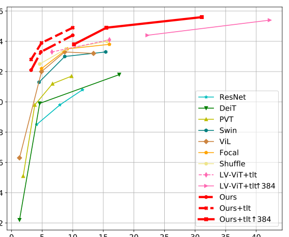
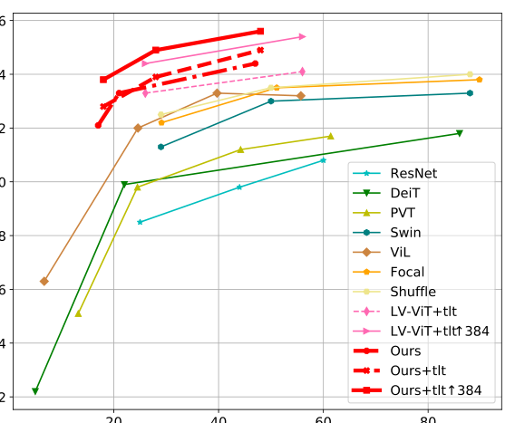

# DilateFormer: Multi-Scale Dilated Transformer for Visual Recognition

Paper Reading 是从个人角度进行的一些总结分享，受到个人关注点的侧重和实力所限，可能有理解不到位的地方。具体的细节还需要以原文的内容为准，博客中的图表若未另外说明则均来自原文。

| 论文概况 | 详细 |
| --- | --- |
| 标题 | 《DilateFormer: Multi-Scale Dilated Transformer for Visual Recognition》 |
| 作者 | Jiayu Jiao、Yu-Ming Tang、Kun-Yu Lin、Yipeng Gao、Andy J. Ma、Yaowei Wang、Wei-Shi Zheng |
| 发表期刊 | IEEE Transactions on Multimedia |
| 期刊等级 | CCF-B |
| 发表年份 | 2023 |
| 论文代码 | [https://isee-ai.cn/~jiaojiayu/DilteFormer.html](https://isee-ai.cn/~jiaojiayu/DilteFormer.html) |

作者单位：

1. 中山大学计算机学院（School of Computer Science and Engineering, Sun Yat-sen University）
2. 鹏城实验室（Peng Cheng Laboratory）
3. 机器学习与智能计算教育部重点实验室（中山大学）（Key Laboratory of Machine Intelligence and Advanced Computing, Sun Yat-sen University, Ministry of Education）

## 研究动机

长程依赖建模是视觉表征学习的核心问题，表现为图像中任意两个 patch 之间都需要交换语义信息，导致自注意力机制的全局感受野成为 Vision Transformer 的默认选择。然而全局注意力的计算代价随 patch 数量二次增长，难以直接用于高分辨率图像编码。为降低开销，一类工作引入 CNN 的归纳偏置，把自注意力限制在固定窗口或滑动邻域内，如 Swin 的窗口注意力与 ViL、NAT 的滑动窗口注意力，但感受野随之缩小，长程建模能力被牺牲；另一类工作保留全局感受野而插入子采样操作，设计复杂且引入额外参数与计算。进一步看，现有局部注意力方法只考虑了注意力的局部性而忽略稀疏性，而 Shuffle Transformer 等稀疏采样方法又以逼近全局感受野为目标，并未利用注意力矩阵自身的结构。观察 ViT 浅层的注意力矩阵可以发现，高分数 patch 稀疏地散布在查询 patch 的邻域内，说明浅层的全局依赖建模存在大量冗余。至此问题收窄为：暂未有工作把局部性与稀疏性两个先验同时注入一个统一的注意力操作，并在其中保留多尺度建模能力。

## 文章贡献

针对全局注意力二次复杂度与局部注意力小感受野之间的矛盾，本文提出了多尺度空洞 Transformer，即 DilateFormer。其核心是借助空洞率把浅层注意力中观察到的局部性与稀疏性先验注入滑动窗口自注意力。首先本文提出滑动窗口空洞注意力（SWDA）操作，在以查询 patch 为中心的滑动窗口内稀疏挑选 key 与 value 进行自注意力；接着把 SWDA 扩展为多尺度空洞注意力（MSDA）块，为不同注意力头设置不同空洞率，在块内同时聚合多个尺度的语义依赖；最终在金字塔架构的低层阶段堆叠 MSDA、高层阶段使用全局多头自注意力，构成完整骨干网络。实验表明，DilateFormer 在 ImageNet-1K 分类上取得 85.6% 的 top-1 精度，在 COCO 目标检测与实例分割上取得 53.5% box mAP 与 46.1% mask mAP，在 ADE20K 语义分割上取得 51.1% MS mIoU，并以最多节省 70% FLOPs 的代价达到与现有先进模型相当的精度。

## 本文方法

### 浅层全局注意力的局部性与稀疏性

本节的目标是确认全局注意力中究竟哪一部分冗余可以被安全去除。本文可视化了 ViT-Small 第三个多头自注意力块的注意力图，如下图所示，红框内为查询 patch，颜色深浅代表注意力分数高低。

图中高注意力分数的 patch 稀疏地散布在查询 patch 的邻域内，其余 patch 的分数普遍很低，本文据此归纳出浅层注意力的两个性质：局部性（相关 patch 集中在邻域）与稀疏性（邻域内也只有部分 patch 被激活）。这两个性质意味着浅层中远距离 patch 对语义建模大多无关，昂贵的全局注意力存在可压缩的冗余。该观察是 SWDA 的设计前提，直接决定了后文「滑动窗口」与「稀疏挑选」两个约束的来源。

### 滑动窗口空洞注意力（SWDA）

SWDA 用于在以查询 patch 为中心的滑动窗口内，对稀疏挑选出的 key 与 value 执行自注意力，使操作显式满足局部性与稀疏性。对特征图上位置 $(i, j)$ 的查询，SWDA 输出分量的计算公式如下：

$$x_{ij} = \mathrm{Attention}(q_{ij}, K_r, V_r) = \mathrm{Softmax}\left(\frac{q_{ij} K_r^{\mathrm{T}}}{\sqrt{d_k}}\right) V_r$$

其中 $q_{ij}$ 是位置 $(i, j)$ 的查询向量，$K_r$ 与 $V_r$ 是从特征图 $K$、$V$ 中稀疏挑选出的 key 与 value，$d_k$ 是 key 的维度，$H$ 与 $W$ 为特征图的高与宽（$1 \le i \le W$，$1 \le j \le H$）。被挑选的 key 与 value 的坐标集合定义为：

$$\{(i', j') \mid i' = i + p \times r,\ j' = j + q \times r,\ -\frac{w}{2} \le p, q \le \frac{w}{2}\}$$

其中 $w$ 是滑动窗口尺寸，$r \in \mathbb{N}^+$ 是控制稀疏程度的空洞率，$p$ 与 $q$ 是窗口内的相对偏移。直观上，空洞率越大，同样数量的 key 与 value 就分布在越大的范围上，感受野随之扩大而计算量不变。

给出一个简单的例子，假设窗口尺寸 $w = 3$、空洞率 $r = 2$、查询位于 $(4, 4)$：

1. 相对偏移 $p, q$ 取 $\{-1, 0, 1\}$，共 9 个组合；
2. 代入坐标公式得被选位置为 $(4 + 2p, 4 + 2q)$，即行、列均取自 $\{2, 4, 6\}$ 的 9 个坐标；
3. 这 9 个坐标覆盖的外接范围是 $5 \times 5 = 25$ 个位置，但实际参与注意力的只有 9 个；若 $r = 1$，同样的 9 个 key 只覆盖 $3 \times 3$ 范围。

可以看到，SWDA 用固定数量的 key 与 value 换取了随空洞率线性扩大的感受野，同时保持稀疏采样。对特征图边缘的查询，本文采用卷积中常见的零填充策略维持特征图尺寸。SWDA 对全部查询 patch 以滑动窗口方式执行，其输出送入下文的 MSDA 做多头拼接。

### 多尺度空洞注意力（MSDA）

MSDA 的目标是在块级同时捕获不同尺度的上下文语义依赖，充分利用感受野内的信息。给定特征图 $X$，先经线性投影得到 query、key、value，再沿通道切分为 $n$ 个头，每个头以各自的空洞率执行 SWDA，形式化为：

$$h_i = \mathrm{SWDA}(Q_i, K_i, V_i, r_i), \quad 1 \le i \le n$$

$$X = \mathrm{Linear}(\mathrm{Concat}[h_1, \ldots, h_n])$$

其中 $r_i$ 是第 $i$ 个头的空洞率，$Q_i$、$K_i$、$V_i$ 是送入第 $i$ 个头的特征切片，各头输出拼接后经一个线性层聚合。MSDA 的结构如下图所示。

默认设置下窗口为 $3 \times 3$，三个头的空洞率取 $r = 1, 2, 3$，对应的感受野分别为 $3 \times 3$、$5 \times 5$ 与 $7 \times 7$。这等价于把空洞卷积的多尺度思想并行搬进注意力内部：不同头看到不同尺度的邻域，拼接后即完成多尺度特征融合，且不需要额外参数与计算。MSDA 块整体接收上一阶段的特征，输出送入下一阶段或下游任务头。

### 条件位置编码与块内数据流

条件位置编码（CPE）用于使位置信息自适应不同分辨率的输入。本文采用 CPVT 的做法，把 CPE 实现为零填充的 $3 \times 3$ 深度卷积，块内的完整数据流定义如下：

$$X = \mathrm{CPE}(\hat{X}) + \hat{X} = \mathrm{DwConv}(\hat{X}) + \hat{X}$$

$$Y = \begin{cases} \mathrm{MSDA}(\mathrm{Norm}(X)) + X, & \text{低层阶段} \\ \mathrm{MHSA}(\mathrm{Norm}(X)) + X, & \text{高层阶段} \end{cases}$$

$$Z = \mathrm{MLP}(\mathrm{Norm}(Y)) + Y$$

其中 $\hat{X}$ 是当前块的输入（图像 patch 或上一块的输出），$\mathrm{DwConv}$ 是 $3 \times 3$ 深度卷积，$\mathrm{MLP}$ 由两个通道扩展比为 4 的线性层与一个 GELU 激活组成。直观上，位置信息以卷积残差的形式注入，卷积本身对分辨率无关，因此同一套权重可以处理任意尺寸的输入。该公式串定义了 MSDA 块与 MHSA 块的统一外壳：注意力或 MLP 的输出都带残差连接，块输出继续送往同阶段的下一个块或下采样器。

### 金字塔整体架构

整体架构用于按阶段组织 MSDA 与 MHSA，构成可输出多尺度特征的骨干网络，如下图所示。

依据浅层注意力的局部性与稀疏性，本文在前两个阶段堆叠 MSDA 块捕获低层信息，后两个阶段使用普通多头自注意力建模高层交互。切分 patch 时采用重叠 tokenizer，由多个重叠的 $3 \times 3$ 卷积模块加零填充构成，通过交替取 stride 为 1 或 2 调节输出分辨率；阶段之间采用重叠 downsampler，即 kernel 为 3、stride 为 2 的卷积模块合并上一阶段的 patch。图中上半部分还展示了 MSDA 块内部「CPE → SWDA 多头 → Concat → Linear → MLP」的串联顺序。四阶段输出的特征图逐级降分辨率、升通道数，直接供检测与分割等密集预测任务使用。

### 模型变体

变体设计用于覆盖不同容量档位，便于在分类与下游任务上系统评测。本文给出 Tiny、Small、Base 三个变体：Dilate-T 的计算量为 3.2 GFLOPs，Dilate-S 为 4.8 GFLOPs，配合 Token Labeling 训练时记为 Dilate-S⋆（4.9 GFLOPs）与 Dilate-B⋆（10.0 GFLOPs）。各变体每阶段的块数与通道数配置详见原文 Table II，本文未逐行转录。三个变体共享完全相同的块结构与阶段划分，仅宽度与深度不同，其评测结果见实验节。

## 实验结果

### 实验设置

本文在三个数据集上评测：ImageNet-1K 分类（128 万训练图、5 万验证图、1000 类）、COCO2017 检测与实例分割（118K 训练、5K 验证、20K 测试）、ADE20K 语义分割（150 类，20000 训练、2000 验证、3000 测试）。检测框架为 mmdetection 的 Mask R-CNN 与 Cascade Mask R-CNN，分割框架为 mmsegmentation 的 UperNet 与 Semantic FPN，均以 ImageNet-1K 预训练变体为骨干；分类训练沿用 DeiT 与 PVT 的策略，采用 AdamW 优化器训练 300 个 epoch。指标为 top-1 精度、box mAP、mask mAP、mIoU 与 MS mIoU，效率指标为 FLOPs、参数量、FPS 与峰值显存。

### 可视化分析

定性效果先行。本文对 DeiT-Tiny、Swin-Tiny 与 Dilate-Tiny 的最后一层做 Grad-CAM 可视化，如下图所示。

Dilate-Tiny 的热力图更准确地落在目标物体上，且关注的语义区域更连续、更完整，表明本文模型具有更强的识别与定位能力。作为机制佐证，原文还给出了 ViT-Small 浅层更多注意力图的可视化，如下图所示。

被激活的 key patch 稀疏分布在查询 patch 邻域、其余 patch 分数很低的现象在更多样本上重复出现，验证了局部性与稀疏性两个先验的普遍性，也解释了 MSDA 为何能以小感受野取代浅层全局注意力。

### 对比实验

定量结果佐证定性观察。ImageNet-1K 上，Dilate-S 以 4.8 GFLOPs 取得 83.3% top-1，超过 Swin-T 与 ViL-S 分别 2.0% 与 1.3%；Dilate-T 以 3.2 GFLOPs 取得 82.1%，与 ViL-S（4.9 G，82.0%）、Focal-T（4.9 G，82.2%）、PVT-L（9.8 G，81.7%）相当；Dilate-S 与 ViL-B（13.4 G，83.2%）、Swin-B（15.4 G，83.4%）、DeiT-B（17.5 G，81.8%）精度相当而最多节省 70% FLOPs；借助 Token Labeling 的 Dilate-S⋆ 与 Dilate-B⋆ 取得 83.9% 与 84.9%，超过 LV-ViT-S（6.6 G）与 LV-ViT-M（16 G）；Dilate-B 在 384 × 384 分辨率微调后取得 85.6%，超过需要 1.37 倍 FLOPs 的 LV-ViT-M（85.4%）。精度与 FLOPs 的权衡关系如下图所示。

下游任务上，Mask R-CNN 1× schedule 下 DilateFormer 超过 Swin 2.8-3.6% box mAP 与 2.5-2.6% mask mAP；3× + MS schedule 下 Dilate-B 取得 49.9% box mAP 与 43.7% mask mAP（Mask R-CNN）、53.3% box mAP 与 46.1% mask mAP（Cascade Mask R-CNN）；Dilate-S 在 1× schedule 下以少 13.2% FLOPs 超过 PVT-M 2.2% box mAP 与 2.7% mask mAP。ADE20K 上，UperNet 框架下 DilateFormer-S/B 取得 47.1/50.4 mIoU 与 47.6/50.5 MS mIoU，超过 Swin 至少 2.6% mIoU 与 1.0% MS mIoU；Semantic FPN 框架下取得 47.1/48.8 mIoU，超过 Swin 3.6-5.6%。三个任务上一致的增益表明 MSDA 提取的多尺度局部稀疏特征对密集预测同样有效。

### 消融实验

消融围绕五个维度展开，结论汇总如下：

- 稀疏局部模式替换：前两阶段分别换用空洞卷积（DC）、动态空洞卷积（DDC）、带空间洗牌的窗口注意力（WASS）与滑动窗口注意力（SWA）时，SWDA 均最优，取得 82.1% top-1、44.9% box mAP / 40.9% mask mAP 与 45.84% mIoU，相对 DC、DDC、WASS、SWA 在 top-1 上分别领先 0.4%、0.3%、0.3%、0.3%，说明 token 级的数据特异性建模强于特征图级；
- 空洞尺度数：多头设置 [1, 2, 3] 的 82.1% 优于单尺度 [1]、[2]、[3]，故默认取 3 个尺度；
- 块类型：D-D-G-G 配置的 MSDA（82.1%）在最大感受野同为 7 × 7 时超过移位窗口局部注意力 L-L-G-G（81.7%）且 FLOPs 更少，相对全局注意力 G-G-G-G 以一半 FLOPs 提升 0.3%，相对带空间缩减的全局注意力提升 0.5%；
- 阶段配置：随 MSDA 所占阶段比例增加，top-1 从 82.2% 降至 80.5%，仅 stage1 使用 MSDA 的 82.2% 略高于 stage1+2 的 82.1% 但多 0.35 G FLOPs，故默认前两个阶段使用 MSDA；
- 重叠 tokenizer / downsampler：替换为非重叠版本后精度下降 0.4%，说明主要增益来自注意力机制本身。

### 效率分析

参数维度的对比如下图所示，DilateFormer 各变体在更少参数量下达到相当或更好的精度。

推理效率方面，原文在单张 A100 上以 batch size 256 测量前向 FPS 与峰值显存：在参数量与 FLOPs 相当的条件下，DilateFormer 的 FPS 与现有先进模型相当而精度更好，具体数值见原文 Table XII。结合分类精度最多节省 70% FLOPs 的结果可以看出，局部稀疏注意力在效率与精度之间取得了更优的权衡点。

## 优点和创新点

个人认为，本文有如下一些优点和创新点可供参考学习：

1. 从注意力矩阵的实证观察出发提炼局部性与稀疏性两个先验，并用空洞率一个超参将其注入滑动窗口自注意力，动机与手段高度自洽，论证链条完整。
2. 把空洞卷积的多尺度思想并行移植进注意力头，MSDA 在零额外参数与计算的代价下同时获得 3 × 3、5 × 5、7 × 7 三档感受野，设计简洁且易于迁移到其它骨干。
3. 实验覆盖分类、检测、实例分割与语义分割四类任务，并给出稀疏模式、尺度数、块类型、阶段配置等五组消融与 Grad-CAM 可视化，证据链丰富、说服力强。
