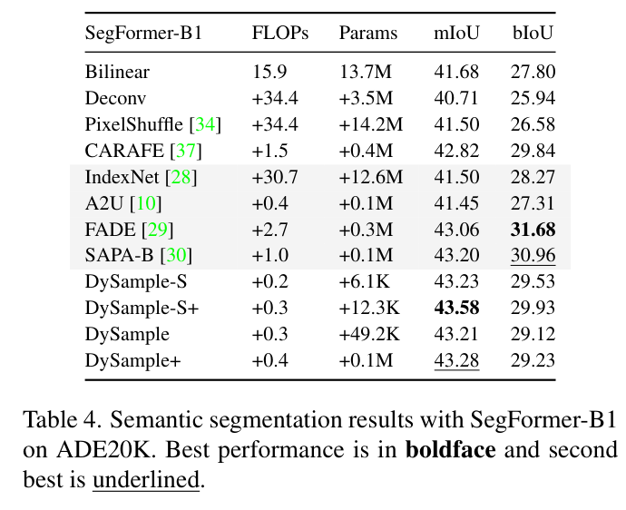
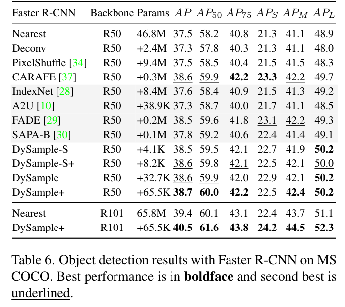
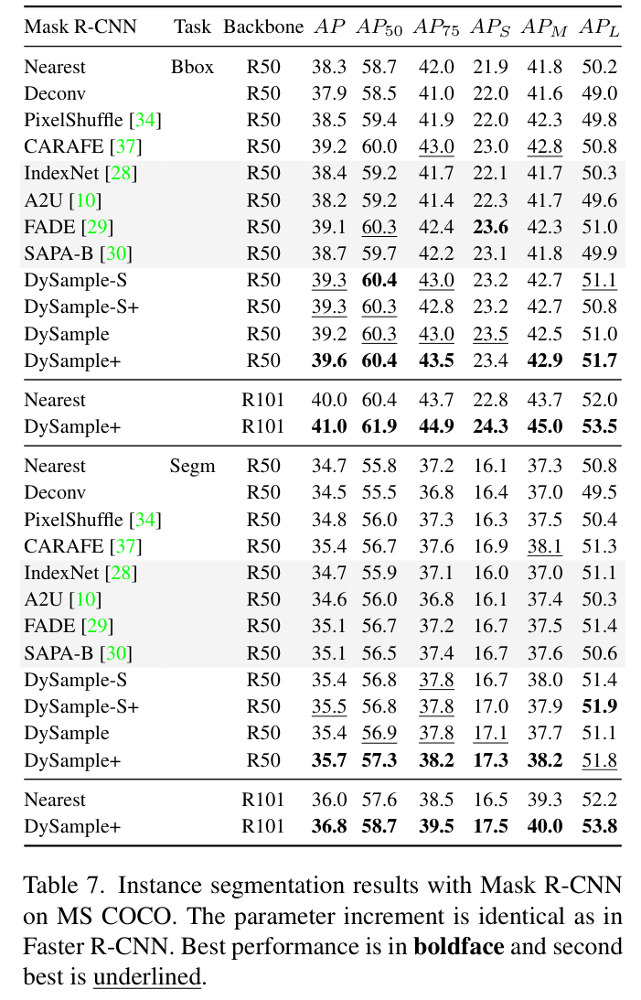
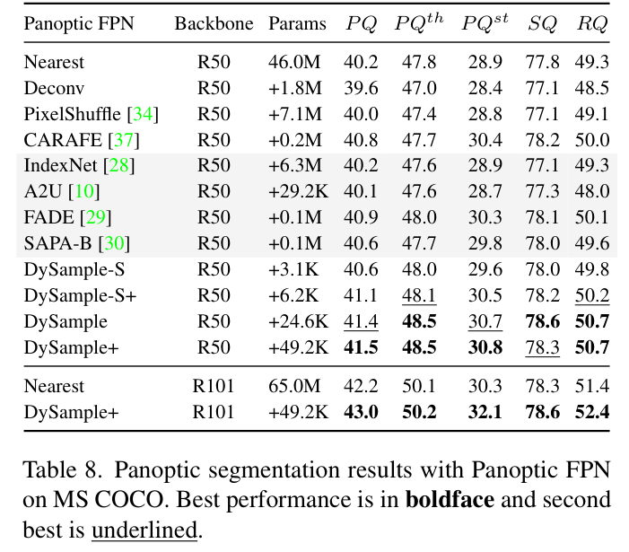
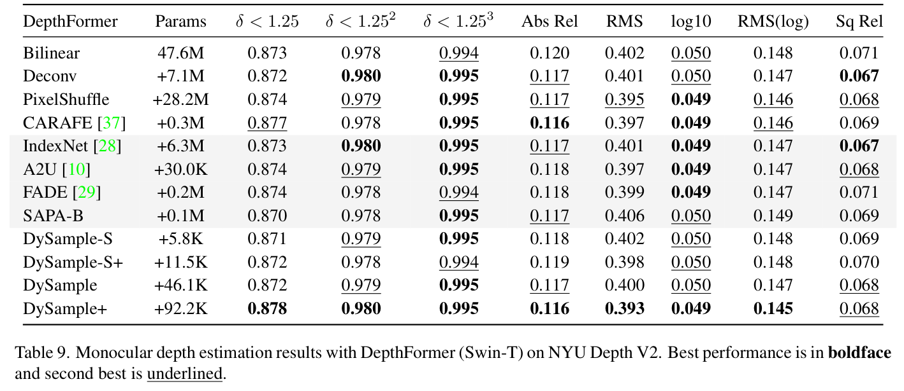
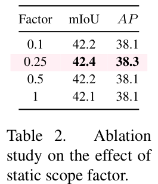
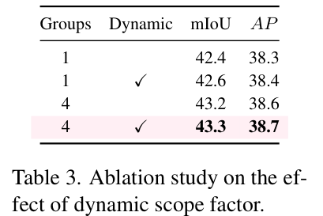

# DySample：Learning to Upsample by Learning to Sample

Paper Reading 是从个人角度进行的一些总结分享，受到个人关注点的侧重和实力所限，可能有理解不到位的地方。具体的细节还需要以原文的内容为准，博客中的图表若未另外说明则均来自原文。

| 论文概况 | 详细 |
| --- | --- |
| 标题 | 《Learning to Upsample by Learning to Sample》 |
| 作者 | Wenze Liu、Hao Lu、Hongtao Fu、Zhiguo Cao |
| 发表会议 | ICCV |
| 会议等级 | CCF-A |
| 发表年份 | 2023 |
| 论文代码 | [https://github.com/tiny-smart/dysample](https://github.com/tiny-smart/dysample) |

作者单位：

1. 华中科技大学人工智能与自动化学院（School of Artificial Intelligence and Automation, Huazhong University of Science and Technology）

## 研究动机

特征上采样（Feature Upsampling）是密集预测模型中逐步恢复特征分辨率的关键环节，其质量直接决定逐像素预测的精度，编码器与解码器结构普遍要面对「低分辨率特征如何高质量放大」的问题。最常用的最近邻插值与双线性插值按固定规则取值，完全忽略特征图中的语义信息；反卷积与 Pixel Shuffle 等可学习上采样器增加了灵活性，但反卷积存在棋盘伪影，Pixel Shuffle 对高层任务并不友好。动态上采样器进一步引入内容感知机制：CARAFE 用子网络生成内容感知的动态卷积核来重组特征，FADE 与 SAPA 再把高分辨率引导特征一并送入核生成过程，让上采样被高分辨率结构引导。然而这些核范式方法结构复杂，依赖耗时的动态卷积与定制的 CUDA 实现，推理开销远高于双线性插值；FADE 与 SAPA 对高分辨率引导特征的依赖还带来了额外计算量，也缩小了适用场景。另一方面，现代架构普遍采用多尺度特征设计，以 FPN 为例，高分辨率特征本来就会在上采样之后与低分辨率特征相加融合，上采样器单独摄入高分辨率特征的必要性存疑。至此问题收窄为：暂未有工作在仅需低分辨率单输入的前提下，同时做到接近插值算子的开销与动态上采样器的精度。

## 文章贡献

针对核范式动态上采样器开销大、依赖高分辨率引导特征的问题，本文提出了 DySample，一个超轻量且有效的动态上采样器。其核心是绕开动态卷积，从点采样的视角重新形式化上采样：把输入特征视为经双线性插值后的连续特征图，为每个上采样点生成内容感知的采样偏移，再用 PyTorch 内置的 `grid_sample` 函数按位置取值。首先本文给出朴素实现，用线性层逐点生成偏移并完成采样；接着通过控制初始采样位置、约束偏移移动范围、按通道分组三个逐步的改进强化其上采样行为；最终依据范围因子的形式（静态或动态）与偏移生成风格（LP 或 PL）组合出四个变体。实验表明，DySample 在语义分割、目标检测、实例分割、全景分割与单目深度估计五个密集预测任务上均优于已有上采样器，所需参数量、FLOPs、GPU 显存与推理延迟大幅低于 CARAFE、FADE、SAPA 等先前方法。

## 本文方法

### 从点采样视角看上采样

本模块的目标是把上采样回归为几何意义上的点采样，并给出一个可直接落地的朴素实现。具体地，把输入特征视为经双线性插值得到的连续特征图，用 PyTorch 内置的 `grid_sample` 函数按给定位置取值即可完成放大。涉及的符号约定如下表所示。

| 符号 | 含义 |
| --- | --- |
| $X$ | 大小为 $C \times H_1 \times W_1$ 的低分辨率输入特征 |
| $X'$ | 大小为 $C \times H_2 \times W_2$ 的上采样输出特征 |
| $S$ | 大小为 $2 \times H_2 \times W_2$ 的采样集，第一维的 2 表示 $x$ 与 $y$ 坐标 |
| $G$ | 标准的规则采样网格 |
| $O$ | 逐点生成的采样偏移 |
| $s$ | 上采样倍率 |
| $g$ | 通道分组数 |

grid sample 的采样过程定义如下：

$$X' = \mathrm{grid\_sample}(X, S)$$

其中 $\mathrm{grid\_sample}$ 用 $S$ 中的位置对假想的双线性插值连续特征图取值。直观上，只要采样位置取得足够「懂内容」，无需动态卷积也能完成内容感知的上采样。

朴素实现的偏移生成与采样集合成计算为：

$$O = \mathrm{linear}(X)$$

$$S = G + O$$

其中 $\mathrm{linear}$ 表示输入输出通道数为 $C$ 和 $2s^2$ 的线性层，其输出经 Pixel Shuffle 重排为 $2 \times sH \times sW$。整个数据流如下图所示：采样点生成器先逐点生成偏移、再与原始网格相加得到采样集，`grid_sample` 据此直接输出上采样特征。

上图的 (a) 是采样式动态上采样的整体流程，(b) 是采样点生成器的两种形式：上半部分为静态范围因子版本，下半部分为动态范围因子版本，二者都以「偏移与原始网格相加」的采样集作为输出。这一朴素设计的上采样质量尚不足以匹敌动态上采样器，后续四步改进都围绕它展开，其产出的采样集是整个模块与 `grid_sample` 之间的唯一接口。

### 初始采样位置

初始采样位置的目标是修正 $s^2$ 个上采样点共享同一初始位置的问题。朴素版本中 $s^2$ 个偏移都从 $X$ 中同一个标准网格点出发，彼此的位置关系被忽略，初始位置分布不均；若生成的偏移全为零，上采样结果等价于最近邻插值，这种初始化因此称为「nearest 初始化」。改进后的「bilinear 初始化」让 $s^2$ 个采样点按双线性插值的方式均匀分布，此时零偏移恰好还原双线性插值的结果，两种初始化与偏移范围的对比如下图所示。

上图中圆点表示初始采样位置、色块表示偏移走动范围：(a) 四个偏移共享同一初始位置，(b) 改为均匀分布后色块显著重叠，(c) 再对走动范围做局部约束以减少重叠。这一步只改动初始化方式、不引入任何参数，其产出的偏移接下来还要经过范围约束环节。

### 偏移范围与静态范围因子

偏移范围约束的目标是抑制相邻采样点走动范围的重叠。由于归一化层的存在，输出特征的取值通常落在以 0 为中心的 $[-1, 1]$，局部 $s^2$ 个采样点的走动范围会显著重叠，重叠使边界附近的点值变得混乱，误差逐级传播后在输出中形成语义伪影，如下图所示。

上图展示了误差的演化过程：(a) 采样点相互重叠，(b) 边界附近取值混乱，(c) 误差逐层传播后形成输出中的语义伪影。缓解办法是给偏移乘上一个 0.25 的系数，该值恰好满足重叠与不重叠之间的理论边界条件，称为静态范围因子（static scope factor），偏移公式被修改为：

$$O = 0.25\,\mathrm{linear}(X)$$

其中 0.25 把采样点的走动范围局部约束在相邻网格单元内。直观上，乘系数只是一种软约束，无法彻底消除重叠；原文也尝试用 tanh 把偏移硬约束在 $[-0.25, 0.25]$，效果反而更差，显式约束限制了表达能力。约束后的偏移与原始网格相加得到采样集，再交给 `grid_sample` 完成放大。

### 特征分组

特征分组的目标是让不同通道子空间各自拥有独立的采样集：沿通道维把特征图分成 $g$ 组，每组单独生成一份偏移。分组数的消融结果如下图所示。

上图分别给出 LP 与 PL 两种生成风格下 mIoU 与 AP 随分组数变化的曲线，可以看到两种风格下增大全分组数都能带来收益，mIoU 在中间分组数附近达到峰值后略有回落。原文据此按经验把 LP 版本的分组数取为 4、PL 版本取为 8。分组之后，每个通道组内的偏移生成还要面对「先线性投影还是先重排」的选择，这引出下文的生成风格设计。

### 动态范围因子

动态范围因子的目标是让偏移的缩放幅度逐点随内容自适应，替代全局固定的常数。本文额外用一次线性投影逐点生成范围因子，经 sigmoid 与 0.5 的系数缩放后取值落在 $[0, 0.5]$、以 0.25 为中心，与静态版本一致，偏移公式进一步被修改为：

$$O = 0.5\,\mathrm{sigmoid}(\mathrm{linear}_1(X)) \cdot \mathrm{linear}_2(X)$$

其中 $\mathrm{linear}_1$ 生成逐点的动态范围因子，$\mathrm{linear}_2$ 生成原始偏移，二者逐元素相乘实现自适应缩放。直观上，静态因子是该形式把范围因子退化为常数 0.25 时的特例，动态形式让「哪些位置需要大胆移动」交由内容决定。该版本与静态版本共享「生成偏移、与网格相加得到采样集」的流程，只替换范围因子的生成方式，输出同样交给 `grid_sample`。

### 偏移生成风格与四个变体

偏移生成风格讨论「线性投影」与「Pixel Shuffle 重排」的先后顺序，两种风格的结构如下图所示。

上图 (a) 的 LP（linear + pixel shuffle）先用线性投影产出 $s^2$ 组偏移再重排，(b) 的 PL（pixel shuffle + linear）先把特征重排为 $C/s^2 \times sH \times sW$ 再线性投影，参数量可降至 LP 的 $1/s^4$。PL 的代价是需要额外存储重排后的特征，显存与延迟略高。综合范围因子的形式与生成风格，本文考察四个变体：

| 变体 | 范围因子 | 生成风格 |
| --- | --- | --- |
| DySample | 静态 | LP |
| DySample+ | 动态 | LP |
| DySample-S | 静态 | PL |
| DySample-S+ | 动态 | PL |

四个变体的输出接口完全一致，都直接替换模型中的插值上采样阶段；PL 版本在 SegFormer 与 MaskFormer 上表现更好，在其余测试模型上略差，使用时按目标模型做一次选择即可。

### 工作机制解析

工作机制解析用于说明「把一个点动态划分成 $s^2$ 个点」为什么足以完成上采样，DySample 的采样过程可视化如下图所示。

上图把红框标出的边界区域放大展示：一个低分辨率点经预测偏移被划分为四个上采样点，其中左上角的点被划给「天空」，其余三个被划给「房子」，从而让边缘更清晰；右半部分展示了其中一个上采样点如何由四个邻居点做双线性插值合成。与已有动态上采样器相比，DySample 生成的是上采样位置而非卷积核：在核范式视角下它等价于使用 $2 \times 2$ 的双线性核，而 CARAFE 的核至少要 $3 \times 3$，GFLOPs 至少是 DySample 的 2.25 倍；与 SAPA 相比，偏移生成同样可以看作「为每个点寻找语义相似的区域」，但不需要引导图；与可变形注意力相比，后者在每个位置采样多个点聚合成新点，而 DySample 每个上采样位置只采一个点。这一机理同时解释了后文实验中精度与开销的双重表现。

## 实验结果

### 实验设置

本文在五个密集预测任务上评测：ADE20K 语义分割（SegFormer-B1 与 MaskFormer，mIoU 与 bIoU）、MS COCO 目标检测与实例分割（Faster R-CNN 与 Mask R-CNN，AP 系列）、MS COCO 全景分割（Panoptic FPN，PQ/SQ/RQ）以及 NYU Depth V2 单目深度估计（DepthFormer-SwinT）。对比的上采样器包括 bilinear、Deconv、Pixel Shuffle、CARAFE、IndexNet、A2U、FADE 与 SAPA-B，实验仅替换各模型的上采样阶段，其余训练设置保持不变。

### 语义分割结果

先看轻量骨干 SegFormer-B1 上的表现，其解码器共含 6 个上采样阶段，各上采样器的替换结果如下表所示。

DySample 系列以数千级的参数增量把 mIoU 推到 43 以上，DySample-S+ 取得全表最高的 43.58；但 DySample 系列的 bIoU 普遍低于 FADE 与 SAPA-B，说明其增益主要来自内部区域，引导类上采样器则主要改善边界质量。把骨干换成更强的 MaskFormer 后结论不变：DySample-S+ 在 Swin-B 与 Swin-L 上分别把 mIoU 从 52.70 提升至 53.91、从 54.10 提升至 54.90，均高于同表的 CARAFE，可见收益并不依赖特定的骨干容量。

### 目标检测与实例分割结果

目标检测在 MS COCO 上以 Faster R-CNN 评测，替换 FPN 中四个上采样阶段的结果如下表所示。

R50 骨干下 DySample+ 以 38.7 AP 取得该表最优，且在 R50 与 R101 上分别带来 1.2 与 1.1 的 box AP 提升，可以看出收益没有随骨干变强而消失。Mask R-CNN 上的实例分割结果如下表所示，其参数增量与检测表一致。

框级与掩膜级指标呈现相同趋势，DySample+ 在 R50 与 R101 上分别带来 1.0 与 0.8 的 mask AP 提升，表明上采样质量的改善同时作用于分类、定位与掩膜预测。

### 全景分割与深度估计结果

全景分割要求上采样器同时兼顾语义与实例边界，Panoptic FPN 的结果如下表所示。

DySample+ 把 PQ 从 40.2 提升至 41.5（R50）、从 42.2 提升至 43.0（R101），而参数增量仅数万级，验证了其在实例边界判别上的收益。单目深度估计在 NYU Depth V2 上评测，结果如下表所示。

DySample+ 取得该表最好的 $\delta < 1.25$（0.878）与 Abs Rel（0.116），相对 bilinear 分别改善 0.05 与 0.04，可以看出高质量上采样对恢复深度细节与保持平坦区域一致性都有帮助。

### 消融分析

从朴素实现到最终版本共有四步改动，各步的 mIoU 增益依次为 0.2、0.3、0.8、0.1，其中特征分组的收益最大。先看静态范围因子的取值消融，结果如下表所示。

因子取 0.25 时 mIoU 与 AP 同时最优，取更小或更大的值都会退化，可见 0.25 恰好落在重叠与不重叠的边界上。分组数与动态范围因子的消融如下表所示。

从单组到 4 组、从静态因子到动态因子，mIoU 与 AP 逐级上升至 43.3 与 38.7，证明了「独立采样集 + 逐点自适应范围」两项设计的有效性。

### 效率分析

在 $256 \times 120 \times 120$ 特征图上的复杂度对比如下图所示，各项均为相对 bilinear 插值的增量。

DySample 系列的推理延迟为 6.2 至 7.6 ms，逼近 bilinear 的 1.6 ms，并在延迟、训练显存、训练时长、GFLOPs 与参数量五个维度上都是强动态上采样器中最低的。以 MaskFormer-SwinB 为例，DySample 带来的性能提升比 CARAFE 高 46%，而参数量仅为 CARAFE 的 3%、FLOPs 为其 20%，说明精度优势并未以开销为代价。

### 可视化分析

五个任务的定性对比如下图所示，自上而下依次为语义分割、目标检测、实例分割、全景分割与深度估计。

语义分割中 DySample 的输出与 CARAFE 相近、边界附近更干净，引导类上采样器边界更锐利却在内部区域出现错误预测；深度估计中 DySample 给出准确且一致的椅子深度图。定性结果与定量结论互相印证，表明 DySample 在恢复细节与保持平坦区域一致性上均有优势。

## 优点和创新点

个人认为，本文有如下一些优点和创新点可供参考学习：

1. 从点采样的视角把上采样重新形式化，绕开动态卷积与定制 CUDA 包，仅用 PyTorch 内置的 `grid_sample` 就实现内容感知的动态上采样，部署友好度高，思路新颖。
2. 轻量特性极为突出，以数万级参数增量在五个密集预测任务上全面超越 CARAFE、FADE、SAPA 等核范式方法，延迟逼近双线性插值，可以安全替换现有模型中的插值上采样，说服力强。
3. 「朴素设计加逐步改进」的研究脉络清晰可复用，初始化、范围约束、分组、动态因子每一步都有机理解释与消融数据支撑，实验丰富，论证方式可供参考。
