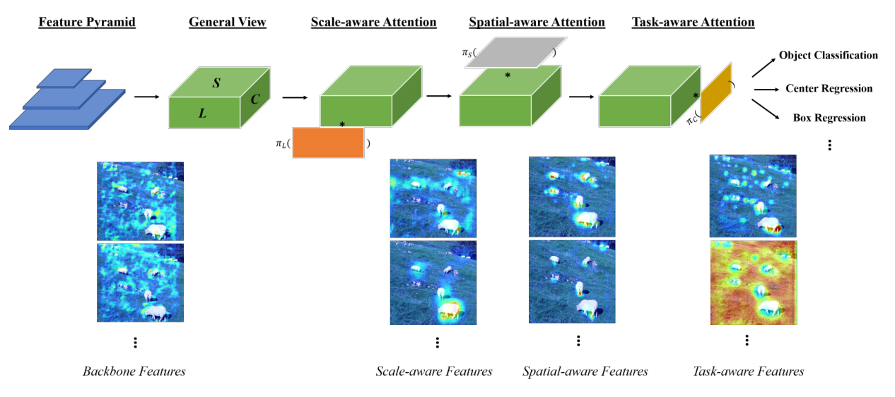
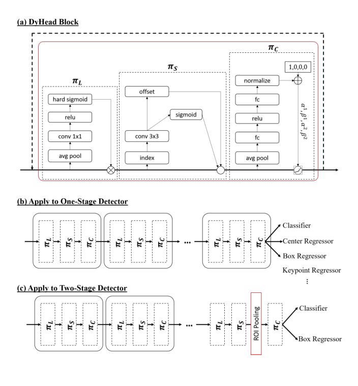
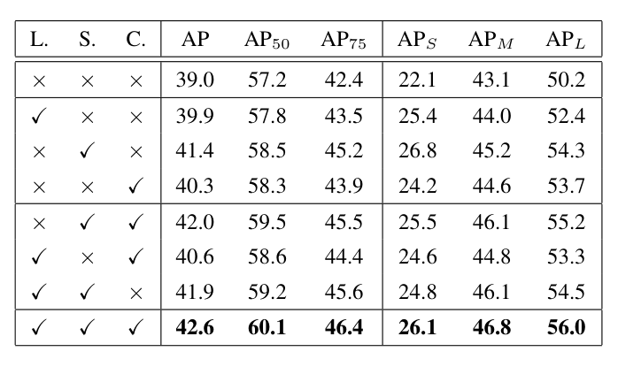
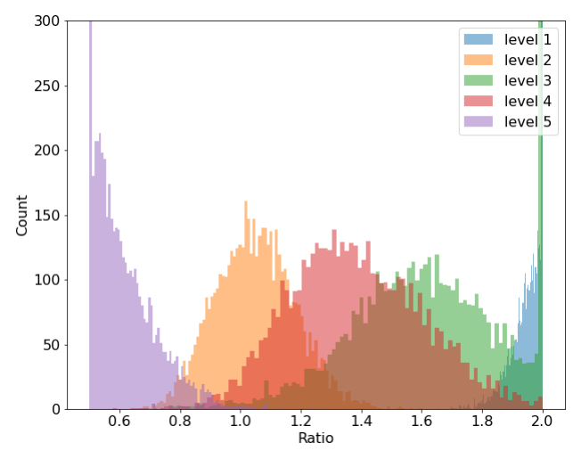
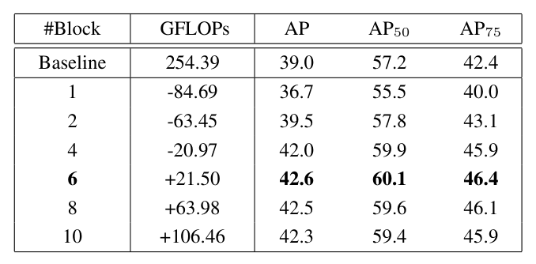
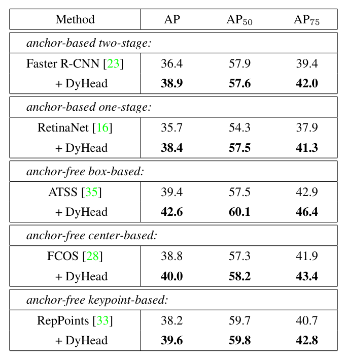
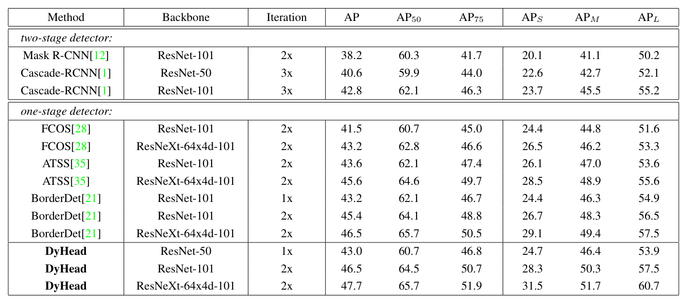
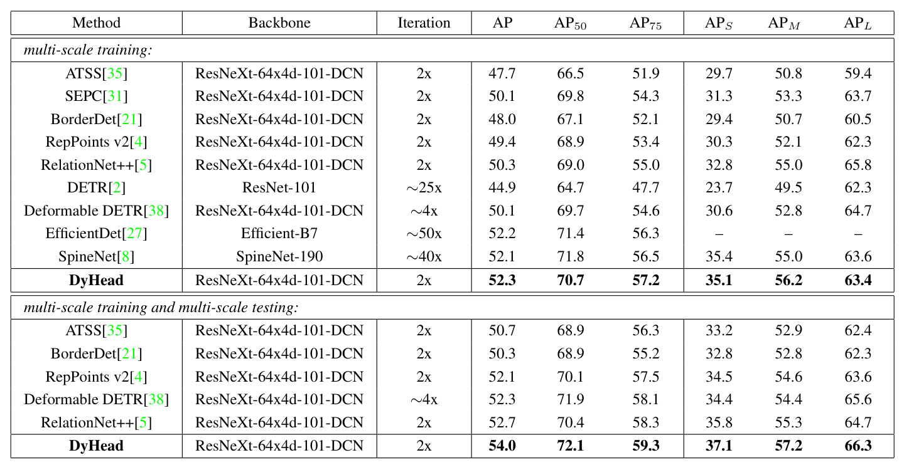
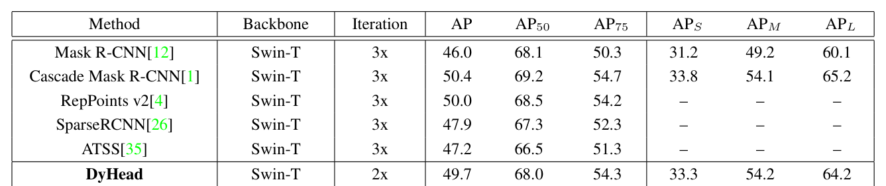
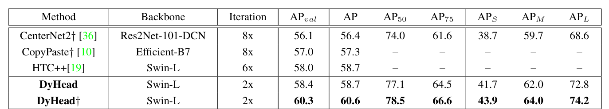

# Dynamic Head: Unifying Object Detection Heads with Attentions

Paper Reading 是从个人角度进行的一些总结分享，受到个人关注点的侧重和实力所限，可能有理解不到位的地方。具体的细节还需要以原文的内容为准，博客中的图表若未另外说明则均来自原文。

| 论文概况 | 详细 |
| --- | --- |
| 标题 | 《Dynamic Head: Unifying Object Detection Heads with Attentions》 |
| 作者 | Xiyang Dai, Yinpeng Chen, Bin Xiao, Dongdong Chen, Mengchen Liu, Lu Yuan, Lei Zhang |
| 发表会议 | IEEE/CVF Conference on Computer Vision and Pattern Recognition (CVPR) |
| 会议等级 | CCF-A |
| 发表年份 | 2021 |
| 论文代码 | [https://github.com/microsoft/DynamicHead](https://github.com/microsoft/DynamicHead) |

作者单位：

1. Microsoft, Redmond, USA

## 研究动机

目标检测是计算机视觉中回答「什么物体出现在哪里」的基础问题，深度学习时代的现代检测器几乎都遵循同一范式：骨干网络负责特征提取，检测头负责定位与分类，检测头的设计质量因而成为决定检测性能的关键。

然而，一个好的检测头需要同时应对三类固有困难。图像中不同尺度的物体常常并存，检测头应当具备尺度感知能力；物体在不同视角下呈现差异巨大的形状、姿态与位置，检测头应当具备空间感知能力；边界框、中心点、关键点等物体表示各有全然不同的训练目标与约束，检测头还应当具备任务感知能力。现有研究大多只针对其中一类困难给出方案：改进特征金字塔与路径增强的工作聚焦尺度问题，可变形卷积一系的工作聚焦空间变换学习，各式物体表示的工作则聚焦任务建模，彼此之间缺少一个统一的视角。暂未有工作把三种感知能力放进同一个检测头框架中同时优化，如何设计这样一个统一的检测头仍是开放问题，本文即围绕该问题展开。

## 文章贡献

针对上述三种感知能力彼此割裂的局限，本文提出了动态检测头 Dynamic Head（DyHead）。其核心是把检测头的输入——特征金字塔各层缩放对齐后拼接而成的特征——看作层级 × 空间 × 通道的三维张量，并把在此张量上学习统一注意力分解为沿三个维度依次作用的三个串联注意力。首先，尺度感知注意力作用在层级维度上，依据语义重要性动态融合不同层级的特征，使特征强度随物体尺度自适应；接着，空间感知注意力作用在空间维度上，借助可变形卷积稀疏采样聚焦判别性区域，并在相同空间位置跨层聚合特征；最终，任务感知注意力作用在通道维度上，动态开关特征通道，以适配分类、回归等不同下游任务。实验表明，DyHead 作为即插即用模块能一致提升各类主流检测器 1.2 ∼ 3.2 AP，配合 ResNeXt-101-DCN 骨干在 COCO test-dev 上取得 54.0 AP 的新纪录，结合 Transformer 骨干与自训练额外数据后进一步推至 60.6 AP。

## 本文方法

### 特征张量与统一注意力表示

DyHead 的出发点是把检测头的输入改写成一个三维张量，从而把各类头端改进统一为同一张量上的注意力学习问题。给定来自特征金字塔的 $L$ 个层级特征，先以上采样或下采样把各层缩放到中间层特征的尺度，得到 $F \in \mathbb{R}^{L \times H \times W \times C}$；记 $S = H \times W$，即可重排为三维张量 $F \in \mathbb{R}^{L \times S \times C}$。在该表示下，张量的三个维度与三类感知能力一一对应：层间特征差异关系物体尺度，空间位置差异关系几何变换，通道差异关系任务与物体表示。对张量施加自注意力的一般形式为：

$$
W(F) = \pi(F) \cdot F
$$

其中 $\pi(\cdot)$ 是注意力函数。朴素的解法是用全连接层直接在所有维度上学习注意力，但张量维度过高，优化困难且计算代价不可承受。本文转而把注意力拆解为三个各管一个维度的串联注意力：

$$
W(F) = \pi_C\left(\pi_S\left(\pi_L(F) \cdot F\right) \cdot F\right) \cdot F
$$

其中 $\pi_L(\cdot)$、$\pi_S(\cdot)$、$\pi_C(\cdot)$ 分别是作用在维度 $L$、$S$、$C$ 上的注意力函数。本文后续用到的核心符号汇总如下：

| 符号 | 含义 |
| --- | --- |
| $L$ | 特征金字塔的层级数 |
| $S = H \times W$ | 中间层特征的空间位置数 |
| $C$ | 中间层特征的通道数 |
| $\pi_L, \pi_S, \pi_C$ | 尺度感知、空间感知、任务感知注意力函数 |
| $f(\cdot)$ | 由 1×1 卷积层近似的线性函数 |
| $\sigma(\cdot)$ | hard sigmoid 函数 |
| $K$ | 稀疏采样位置的数目 |
| $\theta(\cdot)$ | 生成通道激活参数的超函数 |

这一表示是后续三个注意力模块的公共输入约定：三者依次串联，分别承接尺度、空间与任务感知。

### 尺度感知注意力

尺度感知注意力 $\pi_L$ 用于依据语义重要性动态融合不同层级的特征。它在 $L$ 维度上计算注意力，让特征在各层级的相对强度随输入自适应，其计算为：

$$
\pi_L(F) \cdot F = \sigma\left(f\left(\frac{1}{SC} \sum_{S,C} F\right)\right) \cdot F
$$

其中 $f(\cdot)$ 是由 1×1 卷积层近似的线性函数，$\sigma(x) = \max(0, \min(1, \frac{x+1}{2}))$ 是 hard sigmoid 函数。直观上，先在空间与通道维度上聚合得到层级统计量，再映射成各层级的重要性分数并逐层缩放特征，与物体尺度更匹配的层级被增强，不匹配的被抑制。该模块位于串联注意力的第一级，其输出交给空间感知注意力继续加工。

### 空间感知注意力

空间感知注意力 $\pi_S$ 用于聚焦在空间位置与特征层级间持续共存的判别性区域。考虑到 $S$ 维度过高，本文把该模块拆成两步：先用可变形卷积让注意力学习稀疏化，再在相同空间位置上跨层聚合特征：

$$
\pi_S(F) \cdot F = \frac{1}{L} \sum_{l=1}^{L} \sum_{k=1}^{K} w_{l,k} \cdot F\left(l ; p_k+\Delta p_k ; c\right) \cdot \Delta m_k
$$

其中 $K$ 是稀疏采样位置的数目；$p_k+\Delta p_k$ 是由自学习空间偏移 $\Delta p_k$ 得到的偏移后位置，用于聚焦判别性区域；$\Delta m_k$ 是位置 $p_k$ 处自学习的重要性标量，两者都从 $F$ 的中间层输入特征中学习；$w_{l,k}$ 是第 $l$ 层第 $k$ 个采样位置对应的权重。稀疏采样避免了全空间自注意力的巨大开销，偏移量让采样点自适应地落到前景的判别位置，对 $L$ 层取平均则完成了跨层聚合。该模块接收尺度融合后的特征，输出交给任务感知注意力。

### 任务感知注意力

任务感知注意力 $\pi_C$ 用于动态开关特征通道，使不同通道分别偏向不同任务。它部署在串联注意力的末端，其计算为：

$$
\pi_C(F) \cdot F = \max\left(\alpha^1(F) \cdot F_c+\beta^1(F), \alpha^2(F) \cdot F_c+\beta^2(F)\right)
$$

其中 $F_c$ 是第 $c$ 个通道上的特征切片，$[\alpha^1, \alpha^2, \beta^1, \beta^2]^T = \theta(\cdot)$ 是学习激活阈值的超函数；$\theta(\cdot)$ 的实现与 Dynamic ReLU 一脉相承，先在 $L \times S$ 维度上做全局平均池化降维，再接两个全连接层与一个归一化层，最后用平移 sigmoid 把输出归一到 $[-1, 1]$。给出一个简单的例子，假设某通道特征切片 $F_c = 1$，超函数输出 $\alpha^1 = 0.5, \beta^1 = 0.2, \alpha^2 = -0.3, \beta^2 = 0.4$。分步代入：第一条分支为 $0.5 \times 1 + 0.2 = 0.7$；第二条分支为 $-0.3 \times 1 + 0.4 = 0.1$；取 max 后该通道输出 $0.7$。可以看到，两条仿射分支中哪条占优由输入统计动态决定，通道因此被按需「打开」或「关闭」，呈现分段线性的任务自适应特性。该模块的输出直接供分类、回归等下游任务分支使用。

### DyHead 块的堆叠与整体范式

上述三个注意力按固定顺序串联，即可构成一个 DyHead 块；由于三者是依次应用的，把统一注意力的公式嵌套多次，就能有效堆叠多个 $\pi_L$、$\pi_S$、$\pi_C$ 块。整个检测范式的结构如下图所示：任意骨干网络先提取特征金字塔，缩放对齐成三维张量后送入 DyHead，若干注意力块串联的输出可用于分类、中心与框回归等不同任务和表示，图底部还展示了每类注意力前后特征图的变化。

DyHead 块的详细设计如下图所示：(a) 是各注意力模块的内部实现，(b) 与 (c) 分别是把 DyHead 块接入一阶段与两阶段检测器的方式。

从图底部的可视化可以看出，骨干输出的初始特征图因 ImageNet 预训练的域差异而噪声很大；经过尺度感知注意力后，特征图对前景物体的尺度差异更敏感；再经过空间感知注意力后，特征图变得更稀疏、聚焦到前景物体的判别性空间位置；最后经过任务感知注意力后，特征图按下游任务的需求重组出不同的激活。这组可视化与块内「先尺度、再空间、后任务」的固定顺序相互印证，也为实验部分的深度消融埋下伏笔。

### 泛化到现有检测器

本节说明 DyHead 如何以插件形式接入现有检测器。一阶段检测器（如 RetinaNet）通常在骨干后挂多个任务特定子网分别处理分类与回归；与之相反，本文只接一条统一分支即可同时处理多个任务，得益于多重注意力机制，架构更简、效率也更高。对 FCOS、ATSS、RepPoints 这类 anchor-free 变体，原本需要把 centerness 或关键点预测挂到分类或回归分支上、构造并不轻松，而 DyHead 只需在头端追加各种类型的预测即可，接入方式如上图 (b) 所示。两阶段检测器利用区域提议与 ROI Pooling 从特征金字塔抽取中间表示，为此本文先在 ROI Pooling 层之前对特征金字塔施加尺度感知与空间感知注意力，再用任务感知注意力替换原来的全连接层，如上图 (c) 所示。

### 与其他注意力机制的联系

本节用统一表示来说明既有注意力工作只是若干子维度上的特例。可变形卷积通过稀疏采样改进传统卷积的变换学习，可视为只建模了 $S$ 子维度，且骨干中的可变形模块与 DyHead 互补；Non-Local 用点积形式融合不同空间位置的特征，可视为只建模了 $L \times S$ 子维度；Transformer 用多头全连接层学习跨注意力对应，可视为只建模了 $S \times C$ 子维度。这三类注意力都只部分建模了特征张量的子维度，而 DyHead 把不同维度上的注意力合并成一个连贯且高效的实现，并显式对应检测任务的三类挑战，这正是实验部分显著收益的来源。

## 实验结果

### 实验设置

| 项目 | 设置 |
| --- | --- |
| 数据集 | MS COCO 2017（train2017 训练，val2017 消融，test-dev 服务器评测） |
| 指标 | COCO 风格 AP，含 AP、AP50、AP75、APS、APM、APL |
| 框架 | 基于 Mask R-CNN benchmark 实现，默认采用 ATSS 训练框架 |
| 训练 | 8 张 V100 32GB；消融用 ResNet-50 + 1x 配置，其余用 2x；仅随机水平翻转，部分模型多尺度训练 |
| 推理 | 与使用测试时增强的方法对比时采用多尺度测试；未用 EMA、mosaic、mix-up、label smoothing、soft-NMS 等 trick |

### 注意力模块消融

把三类注意力模块逐个加到基线上的结果如下表所示。

单独加入尺度感知、空间感知、任务感知注意力分别带来 0.9 AP、2.4 AP、1.3 AP 的提升，三者全部加入后基线从 39.0 AP 提升到 42.6 AP，可见不同组件作为连贯模块协同工作；空间感知增益最大，与其在三个维度中占据主导地位相符。

### 注意力学习可视化

尺度感知注意力学到的尺度比值（高分辨率层与低分辨率层学习权重之比）分布如下图所示，统计自 COCO val2017 全部图像。

可以看出 level 5 的高分辨率特征图权重被调向低分辨率、level 1 的低分辨率特征图权重被调向高分辨率，不同层级的尺度差异被平滑，证明了尺度感知注意力学习的有效性。空间感知注意力前后的特征图变化如下图所示，对应堆叠 2、4、6 个注意力块的情形。

可以观察到，骨干输出的初始特征图噪声很大、难以聚焦前景物体，随着经过的注意力块增多，特征图覆盖更多前景物体并更准确地聚焦其判别性空间位置。

### 头部深度与效率

控制 DyHead 块数量得到的精度与计算开销对比如下表所示。

可见 2 个块就已超过基线且计算成本更低，6 个块时达到 42.6 AP 的峰值、GFLOPs 仅增加 21.50，相对骨干的计算量可忽略；继续加深到 8、10 块后精度饱和（42.5、42.3 AP），证明了该方法的高效率。

### 对现有检测器的泛化

把 DyHead 插入 Faster R-CNN、RetinaNet、ATSS、FCOS、RepPoints 五种检测框架的结果如下表所示，它们覆盖了两阶段与一阶段、anchor-based 与 anchor-free、基于框与基于点的多种设定。

可见各类检测器一致获得 1.2 ∼ 3.2 AP 提升，证明了该方法的泛化能力。

### 与最先进方法的对比

配合不同骨干网络在 COCO test-dev 上的对比如下表所示。

DyHead 配 ResNet-50、ResNet-101、ResNeXt-64x4d-101 分别取得 43.0 AP、46.5 AP、47.7 AP，相同设置下比此前最好的 BorderDet 高出 1.1 AP 与 1.2 AP，在 COCO 上这是显著的改进。与最先进检测器的整体对比如下表所示。

在仅多尺度训练的一组中，DyHead 用 2x 训练日程取得 52.3 AP 的新纪录，且训练时间只有 EfficientDet 与 SpineNet 的 1/20；再加入多尺度测试后达到 54.0 AP，领先同期最好方法 1.3 AP。

### 与 Transformer 骨干和额外数据的对比

附录部分给出与 Transformer 骨干结合的结果，如下表所示。

DyHead 配 Swin-T 用 2x 日程取得 49.7 AP，比框架原本的 ATSS 基线高 2.5 AP，并以更短训练日程接近需要额外 mask 标注的 Cascade Mask R-CNN，说明其与 Transformer 骨干互补。进一步增大输入（最大边长从 1333 增至 2000）并引入自训练生成的额外数据后，结果如下表所示。

DyHead 配 Swin-L 取得 58.7 AP，训练时间不到同类工作的 1/3；使用 ImageNet 伪标签额外数据后进一步推至 60.6 AP 的 COCO 新纪录，体现了该方法在大规模数据下的有效性。

## 优点和创新点

个人认为，本文有如下一些优点和创新点可供参考学习：

1. 把尺度、空间与任务感知统一为三维张量上的注意力学习，将 Deformable、Non-Local 与 Transformer 收纳为子维度特例，框架解释力强；
2. 作为即插即用的插件块，可接入一阶段与两阶段等各类检测器并一致带来 1.2 ∼ 3.2 AP 提升；2 个块即超基线且计算更低，6 个块的额外开销相对骨干可忽略，效率高；
3. 用单一统一分支替代多个任务特定子网，同时完成分类与回归等任务，简化了一阶段检测器的头端设计，对 YOLO 系列的检测头轻量化改造具有直接的借鉴意义；
4. 实验丰富、说服力强，消融、可视化、泛化与 SOTA 对比环环相扣，在 COCO test-dev 上取得 54.0 AP 并推至 60.6 AP 新纪录。
