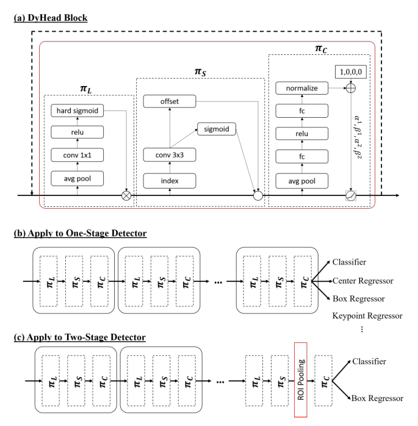
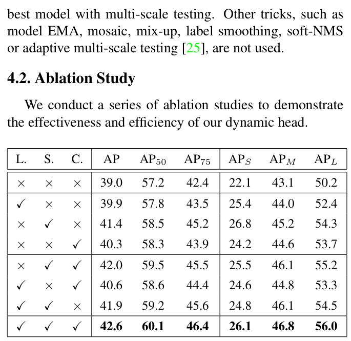
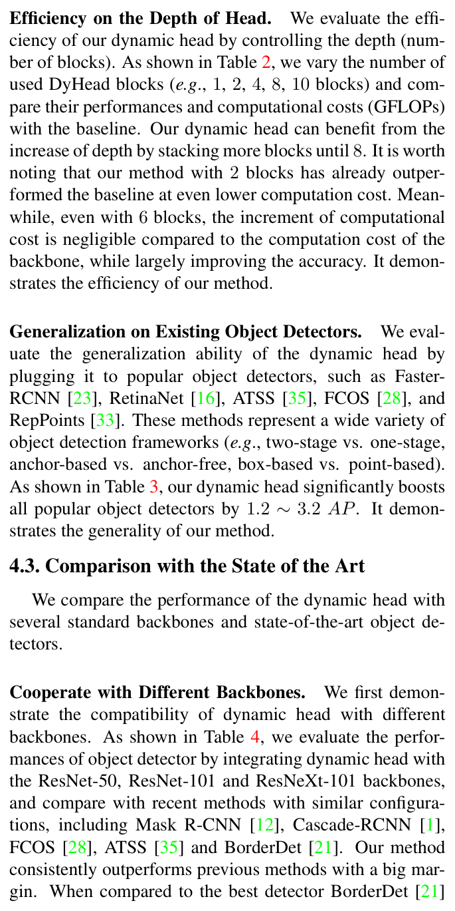
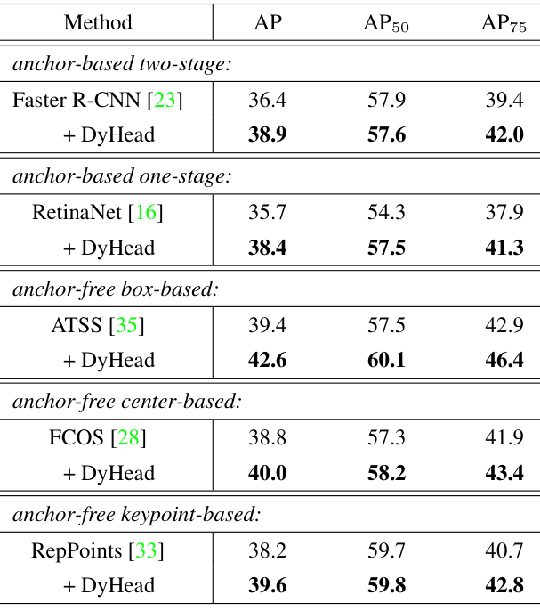
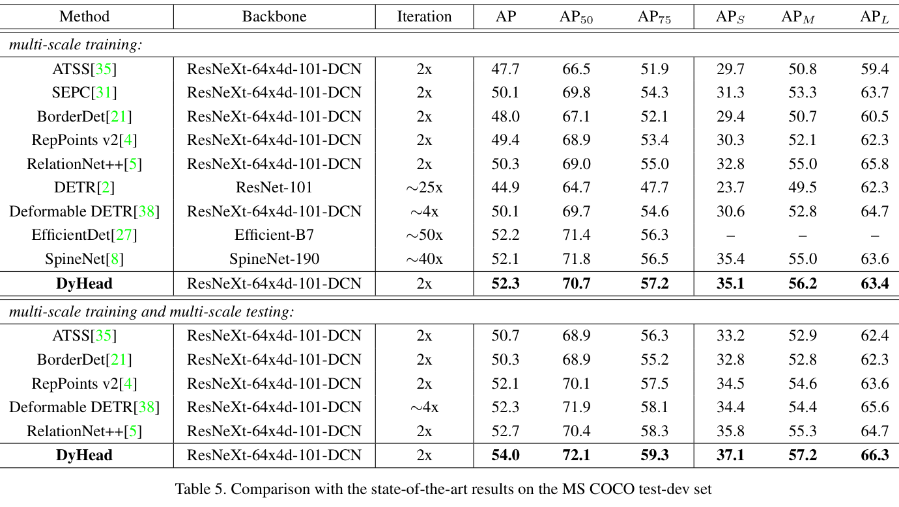
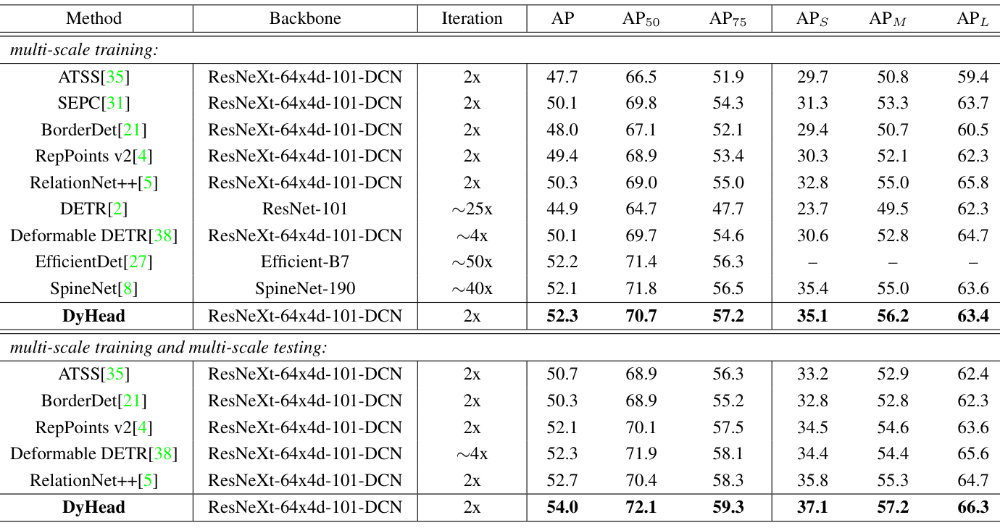
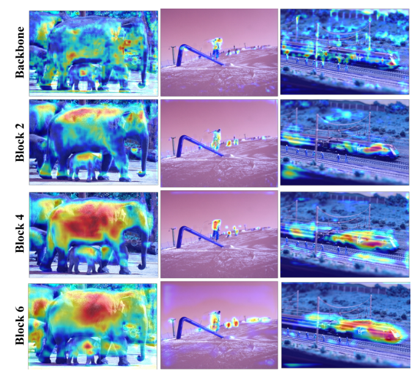

# Dynamic Head: Unifying Object Detection Heads with Attentions

Paper Reading 是从个人角度进行的一些总结分享，受到个人关注点的侧重和实力所限，可能有理解不到位的地方。具体的细节还需要以原文的内容为准，博客中的图表若未另外说明则均来自原文。

| 论文概况 | 详细 |
| --- | --- |
| 标题 | 《Dynamic Head: Unifying Object Detection Heads with Attentions》 |
| 作者 | Xiyang Dai、Yinpeng Chen、Bin Xiao、Dongdong Chen、Mengchen Liu、Lu Yuan、Lei Zhang |
| 发表会议 | CVPR |
| 会议等级 | CCF-A |
| 发表年份 | 2021 |
| 论文代码 | [https://github.com/microsoft/DynamicHead](https://github.com/microsoft/DynamicHead) |

作者单位：

1. 微软雷德蒙德研究院（Microsoft, Redmond, USA）

## 研究动机

目标检测头是检测器中承担定位与分类两大任务的组件，其表征能力直接决定检测精度上限，导致「如何设计一个更好的检测头」成为检测研究的核心问题。本文把这一挑战归纳为三类感知能力：头应当尺度感知，因为一幅图像中常常共存尺度差异巨大的多个目标；头应当空间感知，因为目标在不同视角下呈现迥异的形状、旋转与位置；头还应当任务感知，因为边界框、中心点、角点等不同目标表征对应完全不同的优化目标与约束。然而已有改进各自为战：尺度一侧依赖特征金字塔及其增强连接，空间一侧依赖空洞卷积、可变形卷积等新算子，任务一侧依赖中心点或关键点等表征重新设计，每条路线只解决三类问题中的一类，缺乏统一视角。若把骨干输出的特征张量整体做全自注意力，优化难度与计算开销又都不可承受。至此问题收窄为：暂未有工作能在一个统一的检测头框架内同时兼顾尺度、空间与任务三类感知。

## 文章贡献

针对已有检测头只解决单一感知、缺乏统一视角的问题，本文提出了 dynamic head 框架。其核心是把统一检测头归结为一个注意力学习问题：将特征金字塔重排为 level × space × channel 的三维张量，在三个维度上依次部署尺度感知、空间感知与任务感知注意力。首先尺度感知注意力按语义重要度动态融合各层特征；接着空间感知注意力借助可变形卷积在判别性空间位置做稀疏采样并跨层聚合；最终任务感知注意力以动态阈值控制通道开关，使特征分别服务于分类、框回归等不同任务。实验表明，dynamic head 作为插件可为 Faster R-CNN、RetinaNet、ATSS、FCOS、RepPoints 五类检测器带来 1.2 到 3.2 个 AP 的提升；以 ResNeXt-101-DCN 为骨干在 COCO 上取得 54.0 AP 的当时新纪录，配合 transformer 骨干与额外数据进一步把纪录推到 60.6 AP。

## 本文方法

本文方法按模块划分 H3：先建立特征张量表示，再给出统一注意力的分解形式与三个注意力模块，最后说明如何接入现有检测器以及与已有注意力机制的关系。

### 特征金字塔的三维张量表示

张量表示环节的目标是把不同检测头的改进纳入同一个数学对象。给定特征金字塔中 L 个层的特征 concatenation $F_{in} = \{F_i\}_{i=1}^{L}$，把各层特征上采样或下采样到中间层尺度后，重排为四维张量 $F \in \mathbb{R}^{L \times H \times W \times C}$，再记 $S = H \times W$ reshape 成三维张量 $F \in \mathbb{R}^{L \times S \times C}$。整体范式如下图所示。

三个维度分别对应三类感知：目标尺度差异体现在 level 维，几何变换体现在 space 维，表征与任务差异体现在 channel 维，改善任一维度上的表征学习即可增强对应感知。图中底部还可视化了每个注意力模块之后的特征图：骨干直出的特征因与 ImageNet 预训练存在域差异而噪声明显，经尺度感知注意力后对前景尺度差异更敏感，经空间感知注意力后更稀疏地聚焦判别性位置，经任务感知注意力后按下游任务需求重新组织激活。该张量是后文全部注意力公式的作用对象。

### 统一自注意力的顺序分解

顺序分解环节的目标是在可承受的计算量下近似全张量自注意力。在三维张量上施加自注意力的一般形式为：

$$W(F) = \pi(F) \cdot F$$

其中 $\pi(\cdot)$ 是注意力函数，朴素的实现方式是全连接层，但在张量的高维度上直接学习该函数计算代价过高、实践中不可承受。本文把它转化为三个顺序注意力，每个只关注一个维度：

$$W(F) = \pi_C\Big(\pi_S\big(\pi_L(F) \cdot F\big) \cdot F\Big) \cdot F$$

其中 $\pi_L(\cdot)$、$\pi_S(\cdot)$、$\pi_C(\cdot)$ 分别是作用在 L、S、C 三个维度上的注意力函数。三种注意力虽然分开施加，但性能上互相补充；由于顺序施加，该式还可以嵌套多次以堆叠多个注意力块。这一分解把「统一头」从不可解的全注意力问题化为三个低维子问题，分别由下文三个模块实例化。

### 尺度感知注意力

尺度感知注意力的目标是按语义重要度动态融合不同尺度的特征，其计算为：

$$\pi_L(F) \cdot F = \sigma\Big(f\big(\frac{1}{SC}\sum_{S,C} F\big)\Big) \cdot F$$

其中 $f(\cdot)$ 是用 1×1 卷积层近似的线性函数，$\sigma(x) = \max(0, \min(1, \frac{x+1}{2}))$ 是 hard-sigmoid 函数，求和沿 S 与 C 两个维度进行。给出一个简单的例子，假设某层特征经 $f$ 后的取值为 0.6，则 $\sigma = (0.6 + 1)/2 = 0.8$，该层被保留八成；若另一层取值为 -1.2，则 $\sigma = \max(0, \min(1, -0.1)) = 0$，该层在这一输入下被完全门控关闭。直观上，各层的重要性不再由人工指定的金字塔连接决定，而是随输入图像中目标的尺度分布动态变化，其输出交给空间感知注意力继续处理。

### 空间感知注意力

空间感知注意力的目标是在空间位置与特征层之间一致地聚焦判别性区域。考虑到 S 维度过高，本文把该模块拆为两步：先用可变形卷积使注意力学习稀疏化，再在相同空间位置上跨层聚合特征：

$$\pi_S(F) \cdot F = \frac{1}{L}\sum_{l=1}^{L}\sum_{k=1}^{K} w_{l,k} \cdot F(l;\ p_k + \Delta p_k;\ c) \cdot \Delta m_k$$

其中 $K$ 是稀疏采样位置数，$p_k + \Delta p_k$ 是被自学习空间偏移 $\Delta p_k$ 移动后的采样位置，$\Delta m_k$ 是该位置上自学习的重要度标量，二者都从 $F$ 的中间层特征中学习，$w_{l,k}$ 是跨层聚合权重。稀疏采样把全空间注意力降为少量关键位置的加权求和，使学习在计算上可行；跨层聚合则让同一空间位置同时吸收多层证据。该模块的输出再送入任务感知注意力做通道级调控。

### 任务感知注意力

任务感知注意力的目标是让不同通道动态地服务于不同任务，其机制是按学习到的阈值动态开关通道：

$$\pi_C(F) \cdot F = \max\big(\alpha_1(F) \cdot F_c + \beta_1(F),\ \alpha_2(F) \cdot F_c + \beta_2(F)\big)$$

其中 $F_c$ 是第 c 个通道的特征切片，$[\alpha_1, \alpha_2, \beta_1, \beta_2]^T = \theta(\cdot)$ 是学习控制激活阈值的超函数。$\theta(\cdot)$ 的实现与 Dynamic ReLU 类似：先在 L × S 维上做全局平均池化降维，再经两个全连接层与一个归一化层，最后用平移 sigmoid 把输出归一化到 $[-1, 1]$。这等价于为每个任务相关的通道组学习一套分段线性激活，分类、框回归、中心点或关键点预测可以在同一份特征上各取所需。作为三个注意力中的最后一环，它的输出即 dynamic head 块的输出，可堆叠多个块或送入检测头的预测层。

### 接入现有检测器

接入方式环节说明 dynamic head 如何以插件形式改造两类检测器，详细设计如下图所示。

对一阶段检测器，本文不像 RetinaNet 那样为分类与回归分别挂任务子网，而是只接一条统一分支同时处理多个任务；对 FCOS、ATSS、RepPoints 这类 anchor-free 变体所需的 centerness 或关键点预测，只需在头末端追加相应预测即可，如图中 (b) 所示。对两阶段检测器，先在 ROI-pooling 之前的特征金字塔上施加尺度感知与空间感知注意力，再用任务感知注意力替换原全连接层，如图中 (c) 所示。这种接入方式不改动骨干与训练框架，是实验节「五类检测器普遍涨点」的结构基础。

### 与已有注意力机制的关系

与已有注意力机制的对比用于定位本文的统一性，各方法建模的张量子维度归纳如下表：

| 方法 | 建模的子维度 | 覆盖范围 |
| --- | --- | --- |
| 可变形卷积 | 仅 S 维 | 稀疏空间采样 |
| Non-local 网络 | 仅 L × S 维 | 跨空间位置点乘融合 |
| Transformer 模块 | 仅 S × C 维 | 多头全连接跨注意力 |
| Dynamic head | L、S、C 三维顺序联合 | 统一三类感知 |

可变形卷积虽广泛用于骨干却很少用于检测头，Non-local 与 Transformer 类方法也只部分建模子维度；本文的统一设计把三个维度的注意力组合为一个连贯且高效的实现，并显式对应检测的三类挑战。骨干中的可变形模块与 dynamic head 还是互补关系，采用 ResNeXt-101-64x4d-DCN 骨干时本文取得了当时的新纪录。

## 实验结果

### 实验设置

实验在 MS COCO 上进行：train2017（118K 张）用于训练，val2017（5K 张）用于消融，test-dev 由测试服务器返回官方结果；指标为不同 IoU 阈值与目标尺度下的 AP 系列。dynamic head 以插件形式基于 Mask R-CNN benchmark 实现，默认挂在 ATSS 框架上，在 8 块 V100 上训练；消融用 ResNet-50 与 1x 配置，其余模型用 2x 配置，初始学习率 0.02、weight decay 1e-4、momentum 0.9，在总轮数的 67% 与 89% 处衰减十倍；不使用 EMA、mosaic、mix-up、label smoothing、soft-NMS 等额外技巧。

### 消融实验

三个注意力模块的受控消融如下图所示，「L.」「S.」「C.」分别代表尺度、空间与任务感知注意力。

单独加入三个模块分别带来 0.9、2.4 与 1.3 个 AP 的提升，其中空间感知注意力因维度占主导而增益最大；L 与 S 组合提升 2.9 个 AP，完整动态头相对基线提升 3.6 个 AP 至 42.6，说明三个组件作为连贯模块互相补充。堆叠块数与计算开销的关系如下图所示：

块数增加到 6 时精度达到 42.6 AP，相对基线的 GFLOPs 增量仅 +21.50，与骨干计算量相比可忽略；仅 2 块时就以更低计算成本（-63.45 GFLOPs）超过基线，8 块之后精度不再提升，表明该头在深度上的效率-精度权衡良好。

### 泛化与对比实验

把 dynamic head 插入五类代表性检测器的结果如下图所示：

两阶段的 Faster R-CNN、一阶段的 RetinaNet、anchor-free 的 ATSS、FCOS 与 RepPoints 分别提升 2.5、2.7、3.2、1.2 与 1.4 个 AP，覆盖 anchor-based 与 anchor-free、box-based 与 point-based 诸范式，验证了插件的通用性。不同骨干下与同期方法的对比如下图所示：

DyHead 在 ResNet-101 与 ResNeXt-64x4d-101 上分别以 46.5 与 47.7 AP 超过同设置下最强的 BorderDet 1.1 与 1.2 个 AP。与 SOTA 的对比如下图所示：

仅多尺度训练时本文以 2x 训练计划取得 52.3 AP，训练时间约为 EfficientDet 与 SpineNet 的二十分之一；加上多尺度测试后达到 54.0 AP，超过同期最好方法 1.3 个 AP，表明统一注意力在效率与效果上同时占优。

### 可视化分析

尺度感知注意力学习到的尺度比例分布如下图所示，比例由高分辨率权重除以低分辨率权重计算，统计自 COCO val2017 全部图像。

高层特征（level 5）的分布被调向低分辨率、低层特征（level 1）被调向高分辨率，即注意力在主动抹平不同特征层之间的尺度差异。空间感知注意力随块数增加的特征图演化如下图所示：

未经注意力处理的骨干特征噪声大、无法聚焦前景；从 block 2 到 block 6，特征图覆盖的前景目标越来越多、对判别性位置的聚焦越来越准。两组可视化与消融数值相互印证，说明三类注意力确按设计意图各自改善了特征的尺度、空间与任务表征。

## 优点和创新点

个人认为，本文有如下一些优点和创新点可供参考学习：

1. 从注意力视角统一了检测头的尺度、空间与任务三类感知挑战，把统一头归结为 level × space × channel 张量上的顺序注意力学习，为检测头设计提供了清晰的新观点。
2. 把动态头做成与骨干和检测器无关的插件块，在两阶段、一阶段、anchor-free 等五类框架上取得 1.2 到 3.2 个 AP 的一致增益，六块堆叠的计算增量相对骨干仍可忽略。
3. 用尺度比例直方图与逐块特征图可视化印证每个注意力模块的作用机理，机制解释与消融数值闭环完整，实验丰富、说服力强。
