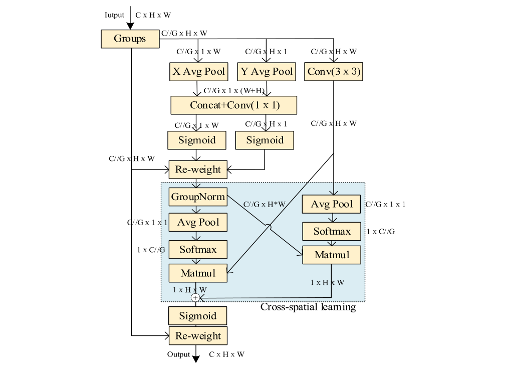
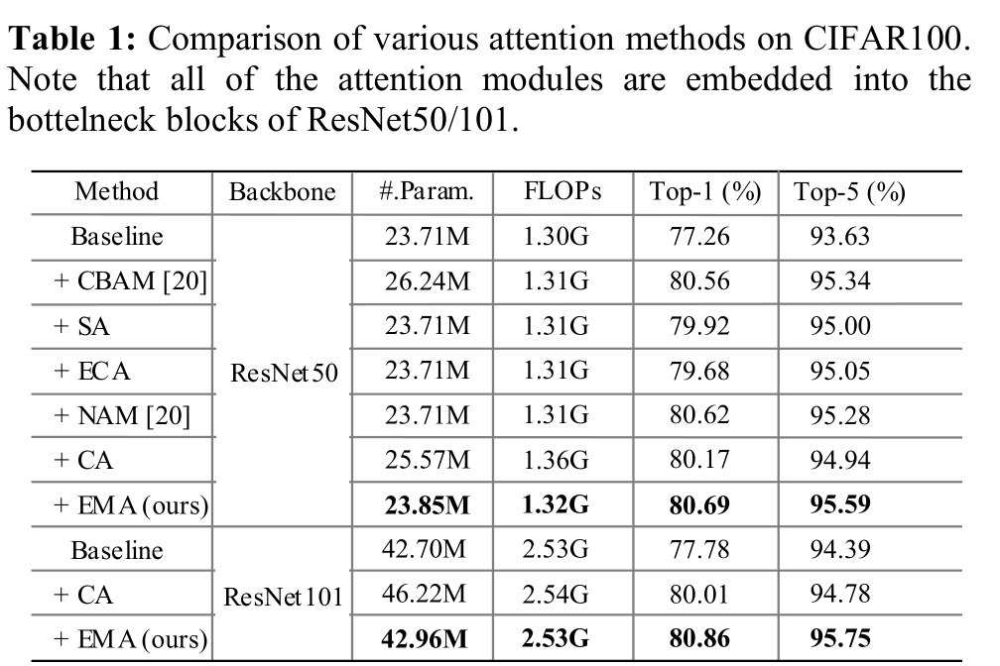
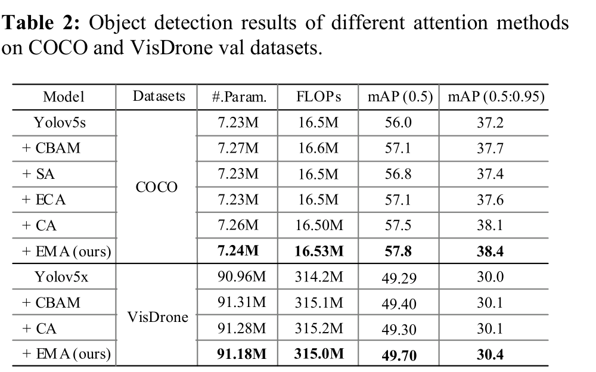
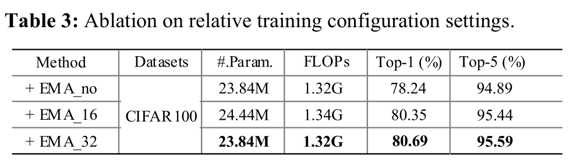

# Efficient Multi-Scale Attention Module with Cross-Spatial Learning

Paper Reading 是从个人角度进行的一些总结分享，受到个人关注点的侧重和实力所限，可能有理解不到位的地方。具体的细节还需要以原文的内容为准，博客中的图表若未另外说明则均来自原文。

| 论文概况 | 详细 |
| --- | --- |
| 标题 | 《Efficient Multi-Scale Attention Module with Cross-Spatial Learning》 |
| 作者 | Daliang Ouyang、Su He、Guozhong Zhang、Mingzhu Luo、Huaiyong Guo、Jian Zhan、Zhijie Huang |
| 发表会议 | ICASSP |
| 会议等级 | CCF-B |
| 发表年份 | 2023 |
| 论文代码 | 未获取 |

作者单位：

1. 中国航天科工集团深圳有限公司（Aerospace Science & Industry Shenzhen (Group) Co., Ltd.）

## 研究动机

通道注意力与空间注意力是 CNN 获得更具判别力特征表示的重要手段，表现为沿通道维与空间维对特征权重做自适应重标定，导致各类注意力模块被广泛嵌入骨干网络中。作为通道注意力的代表，SE 显式建模通道间依赖；CBAM 进一步联合空间与通道两个维度的语义依赖；SGE 把通道维划分为多个子特征以改善不同语义子特征的空间分布；CA 则把位置信息嵌入通道注意力，并挑选合适的通道降维比例来平衡性能与复杂度。然而通道维度缩减在提取深层视觉表示时可能带来副作用，ECA 正是从效率角度揭示了这一缩减的问题；与此同时，Shuffle Attention 一类的并行子网络结构在建模通道间关系时只考虑部分通道，Triplet Attention 一类的并行分支结构以三分支捕获跨维交互，但这些并行子网络的输出大多只用简单平均聚合成最终结果，像素级的成对关系与全局上下文没有被充分利用。问题至此收窄为：暂未有工作在不做任何通道维度缩减的前提下建模跨通道交互，并同时把并行分支的输出特征图做充分融合。

## 文章贡献

针对通道维度缩减的副作用与并行分支输出融合不充分两个局限，本文提出了高效多尺度注意力（EMA）模块。其核心是通道分组加跨空间学习：首先沿通道维把特征划分为多个子特征，并把部分通道维 reshape 到 batch 维，从而避开任何形式的通道维度缩减；接着在 1×1 分支内用两个 1D 全局平均池化分别沿两个空间方向编码全局信息并共享同一个 1×1 卷积，同时以 3×3 分支的单卷积扩大特征空间，构成能建立短程与长程依赖的多尺度并行子网络；最终两个并行分支的输出经矩阵点积运算转化为空间注意力权重并聚合，完成跨空间学习。实验表明，EMA 在 CIFAR100 分类上相对 ResNet50 基线取得 3.43% 的 Top-1 增益，在 MS COCO 与 VisDrone2019 上以 YOLOv5 为检测器时超过 CBAM、SA、ECA 与 CA 等注意力模块，而参数量与计算量的增加几乎可以忽略。

## 本文方法

### 通道分组与 batch 维 reshape

分组的目标是让空间语义特征在每个特征组内均匀分布，同时从机制上避开通道维度缩减。对任意输入特征图 $X \in \mathbb{R}^{C \times H \times W}$，EMA 沿通道维把 $X$ 划分为 $G$ 个子特征，分组形式化为：

$$X = [X_0, X_1, \ldots, X_{G-1}], \quad X_i \in \mathbb{R}^{(C//G) \times H \times W}$$

其中 $C$ 是输入通道数，$H$ 与 $W$ 是空间尺寸，$C//G$ 是每组的通道数，不失一般性令 $G \ll C$。这样做的依据是普通 2D 卷积核在 PyTorch 中的输入维度为 $(oup, inp, k, k)$，卷积核数量与前向输入的 batch 系数无关，因此可以把 $G$ 个组 reshape 并 permute 到 batch 维，将输入张量重新定义为 $(C//G) \times H \times W$。直观上，分组把「通道间建模」转化为「组间 batch 并行 + 组内跨空间建模」，为后续不做降维的卷积打下基础。分组后的张量同时送入 1×1 分支与 3×3 分支，并保留一份作为最终 re-weight 的载体。

### 1×1 分支：双向 1D 池化编码与共享卷积

1×1 分支用于沿两个空间方向分别编码通道注意力，在捕获长程依赖的同时保留精确的位置信息。沿水平方向对通道 $c$ 编码全局信息的 1D 全局平均池化记为：

$$z_c^{H}(h) = \frac{1}{W} \sum_{0 \le i \le W} x_c(h, i)$$

其中 $x_c$ 是第 $c$ 个通道的输入特征，$h$ 是垂直方向的坐标索引。该编码捕获水平方向的长程依赖并保留垂直方向的精确位置信息。对称地，沿垂直方向池化、保留水平方向位置信息的编码为：

$$z_c^{W}(w) = \frac{1}{H} \sum_{0 \le j \le H} x_c(j, w)$$

其中 $w$ 是水平方向的坐标索引。两个编码向量沿图像高度方向拼接后共享同一个 1×1 卷积，卷积输出再分解回两个 1D 向量，经两个 Sigmoid 非线性拟合线性卷积之上的二项分布，最后在每个组内以简单乘法聚合两张通道注意力图，自适应地重标定通道间关系。由于两个方向保留的位置信息互补，重标定后的原始特征使 EMA 能学到低层细节表示。该分支的输出送入下文的跨空间学习环节。

### 3×3 分支：多尺度特征扩展

3×3 分支用于扩大特征空间，为模块提供与 1×1 分支不同尺度的感受野。原始输入特征经过一个单独的 3×3 卷积核堆叠，捕获多尺度特征表示，其在整体结构中的位置如下图所示右侧路径。

图中 Groups 之后的三路并行清晰可见：X Avg Pool 与 Y Avg Pool 两条 1D 池化路径属于 1×1 分支，Conv(3 × 3) 一路属于 3×3 分支。与 1×1 分支只做方向分解不同，3×3 卷积在空间邻域内聚合信息，使两条分支天然构成尺度互补；两路输出随后在跨空间学习中交叉相乘，把多尺度信息注入同一处理阶段。

### 跨空间学习

跨空间学习用于融合两条并行分支的输出特征图，捕获像素级成对关系并为所有像素突出全局上下文。其中 2D 全局平均池化操作形式化为：

$$z_c = \frac{1}{H \times W} \sum_{i, j} x_c(i, j)$$

其中 $x_c(i, j)$ 是通道 $c$ 在空间位置 $(i, j)$ 的特征值，该池化为编码全局空间信息、建模长程依赖而设计。具体流程为：1×1 分支的输出经 GroupNorm 后 reshape 为 $(C//G) \times (H \cdot W)$，3×3 分支的输出经式 (3) 的 2D 池化与 Softmax 后得到 $1 \times (C//G)$ 的向量，二者矩阵点积得到第一张 $1 \times H \times W$ 的空间注意力图，它在同一处理阶段收集不同尺度的空间信息；对称地，对 3×3 分支做 2D 池化与 Softmax、对 1×1 分支做维度变换后相乘，得到保留全部精确空间位置信息的第二张空间注意力图；每个组内的输出特征图即为两张注意力权重聚合后经 Sigmoid 函数的结果。

给出一个简单的例子，假设 $C//G = 2$、$H = W = 2$：

1. 1×1 分支输出经 GroupNorm 后 reshape 为 $2 \times 4$ 的矩阵；
2. 3×3 分支输出按式 (3) 池化得 $2 \times 1 \times 1$ 向量，Softmax 归一化为 $1 \times 2$，设其为 $[0.3, 0.7]$；
3. 点积 $[0.3, 0.7] \times (2 \times 4)$ 得到 $1 \times 4$ 的第一空间注意力图，即 $1 \times H \times W$；
4. 对称路径同法得到第二张 $1 \times 4$ 注意力图，二者相加过 Sigmoid 后作为该组的权重。

可以看到，每个像素的最终权重同时携带了跨尺度信息与全局位置信息，这正是 cross-spatial 一词的含义。

### 整体数据流与输出

整体数据流用于把上述组件串成一个尺寸不变、可直接堆叠的模块。如前图所示，输入 $C \times H \times W$ 经 Groups 分为 $C//G \times H \times W$ 的组张量，一路沿左侧直连路径保留，一路进入三支并行处理；跨空间学习得到的两张 $1 \times H \times W$ 注意力图相加、经 Sigmoid 后与组张量 re-weight，最终输出恢复为 $C \times H \times W$，与输入 $X$ 同尺寸。各组件与功能的对应关系如下表所示。

| 组件 | 功能 |
| --- | --- |
| Groups | 沿通道维分组并 reshape 到 batch 维，避开通道降维 |
| X Avg Pool / Y Avg Pool | 水平 / 垂直方向 1D 全局池化，编码方向感知的位置信息 |
| Concat + Conv(1 × 1) | 两方向编码共享卷积，生成组内通道注意力 |
| Conv(3 × 3) | 单卷积扩大特征空间，提供多尺度表示 |
| GroupNorm + Avg Pool + Softmax + Matmul | 跨空间学习，生成两张 1 × H × W 空间注意力图 |
| Sigmoid + Re-weight | 聚合注意力权重并重标定分组特征，输出同尺寸特征 |

输出与输入同尺寸且高效，因此可以方便地堆叠进现代架构，其在各骨干中的插入位置见实验节。

### 与 CA 的关系及插入方式

EMA 与 CA 的关系用于界定本文改动的边界。本文只取 CA 中 1×1 卷积的共享组件并命名为 1×1 branch，把 CA 的串行处理方式改为并行子网络，再叠加跨空间学习，因此 EMA 可视为对 CA 的并行化与跨维融合改造。插入方式上，分类实验把 EMA 嵌入 ResNet50 与 ResNet101 的 bottleneck 块，检测实验把 EMA 集成进 YOLOv5x 的预测分支，均不改变网络深度。这一节承接上文模块定义，为实验节的对比设置提供口径。

## 实验结果

### 实验设置

分类任务在 CIFAR100 上进行，图像为 32 × 32 像素、共 100 类，采用 SGD 优化器（momentum 0.9、weight decay 4e-5）、batch size 128、训练 200 个 epoch，训练配置与 NAM 完全一致以保证公平比较，指标为 Top-1 与 Top-5 精度。检测任务在 MS COCO 与 VisDrone2019 上进行：YOLOv5s 在 COCO 上输入统一 resize 到 640 × 640，epoch 与 batch size 设为 300 与 48；VisDrone2019 上以 YOLOv5x 为骨干、在原模型基础上为微小目标增加一个检测头并把 EMA 集成进预测分支，输入 640 × 640、训练 300 个 epoch、batch size 5，并复用部分 YOLOv5x 预训练权重以节省训练时间。检测指标为 mAP (0.5) 与 mAP (0.5:0.95)，效率指标为参数量与 FLOPs。

### 对比实验

分类结果如下表所示，所有注意力模块均嵌入 ResNet50/101 的 bottleneck 块。

ResNet50 基线为 77.26% Top-1 与 93.63% Top-5，嵌入 EMA 后达到 80.69% 与 95.59%，即 3.43% 与 1.96% 的增益；在几乎相同的计算复杂度下，EMA 的 Top-1 比 CA 高 0.52%，且参数量（23.85M 对 25.57M）与 FLOPs（1.32G 对 1.36G）更低。换用 ResNet101 后，CA 的 Top-1 从 80.17% 降到 80.01%，而 EMA 以 42.96M 参数与 2.53G FLOPs 取得 80.86% 与 95.75%，优于 46.22M 参数、2.54G FLOPs 的 CA，表明不做通道降维的策略在更深网络上依然稳定受益。

检测结果如下表所示，左半为 COCO 上的 YOLOv5s，右半为 VisDrone 上的 YOLOv5x。

COCO 上 EMA 以 7.24M 参数与 16.53M FLOPs 取得 57.8% mAP (0.5) 与 38.4% mAP (0.5:0.95)，模型规模仅比基线、ECA、SA 大 0.01M、FLOPs 仅大 0.03M，并超过 CA 的 57.5% 与 38.1%。VisDrone 上 CBAM 带来 0.11% 的 mAP (0.5) 提升但参数与计算更多，CA 仅超基线 0.01% 且参数与计算高于 EMA（91.28M 对 91.18M、315.2M 对 315.0M），而 EMA 以多 0.22M 参数的代价取得 0.41% 与 0.4% 的提升。两个数据集上一致的领先表明 EMA 对密集小目标场景同样有效。

### 消融实验

消融以 ResNet50 为基线，考察跨空间学习与分组大小两个因素，结果如下表所示。

关闭跨空间学习的 EMA_no 取得 78.24% Top-1 与 94.89% Top-5，开启后 EMA_32 在几乎相同的参数量与 FLOPs 下达到 80.69% 与 95.59%，可见跨空间学习是增益的主要来源；分组大小为 16 的 EMA_16 取得 80.35% 与 95.44%，但参数量（24.44M）与 FLOPs（1.34G）高于 EMA_32，说明把通道维 reshape 到 batch 维带来的参数节省随组数增加而更充分。

### 可视化分析

原文未提供定性效果图组与注意力热力图，该部分素材未获取，此处从机制层面做定性分析。结合模块结构图可以看到，跨空间学习产生的两张 1 × H × W 注意力图分工明确：一张在同一处理阶段汇聚 3×3 分支的多尺度空间信息，另一张保留全部精确空间位置信息，二者相加过 Sigmoid 后逐组作用于特征。消融中关闭跨空间学习使 Top-1 从 80.69% 落到 78.24%，而分组与池化结构保持不变，表明像素级成对关系的建模而非单纯的分组池化，才是 EMA 区别于 CA 等模块的关键增益来源。

## 优点和创新点

个人认为，本文有如下一些优点和创新点可供参考学习：

1. 利用卷积核与 batch 维无关的性质，把部分通道维 reshape 到 batch 维以避开通道维度缩减，在保留每通道信息的同时控制参数量，视角新颖。
2. 用矩阵点积的跨空间学习融合两条并行分支输出，捕获像素级成对关系并突出全局上下文，超越了并行注意力常用的简单平均聚合方式。
3. 模块轻量且即插即用，在 ResNet 与 YOLOv5 上参数增量仅 0.01M 至 0.26M，却在分类与无人机航拍检测上稳定超过 CBAM、SA、ECA、CA，实验说服力强。
