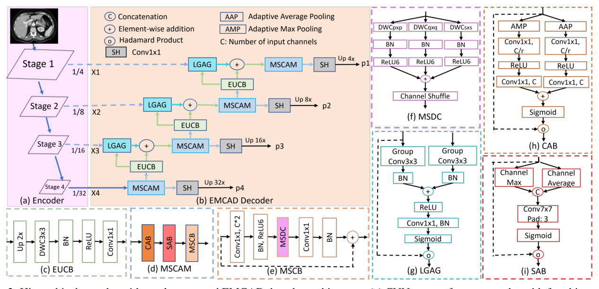
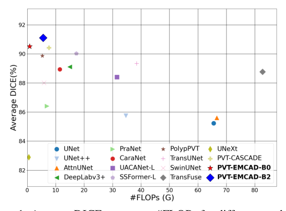
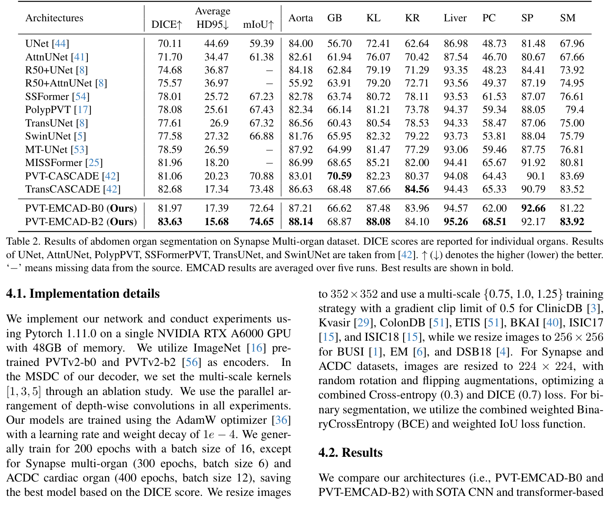
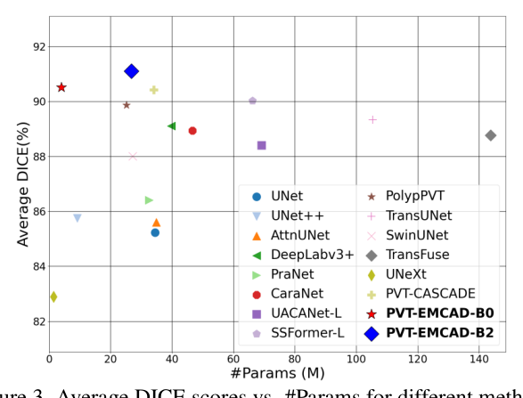
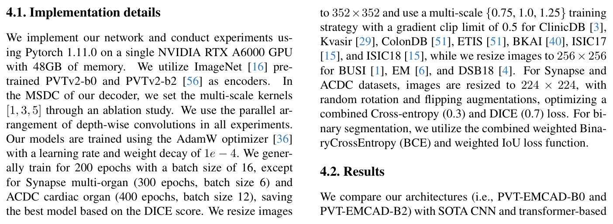
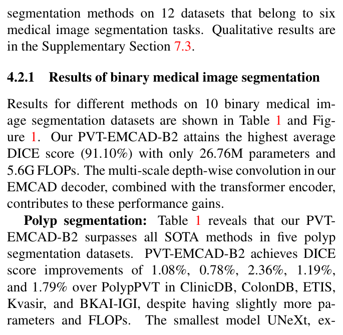
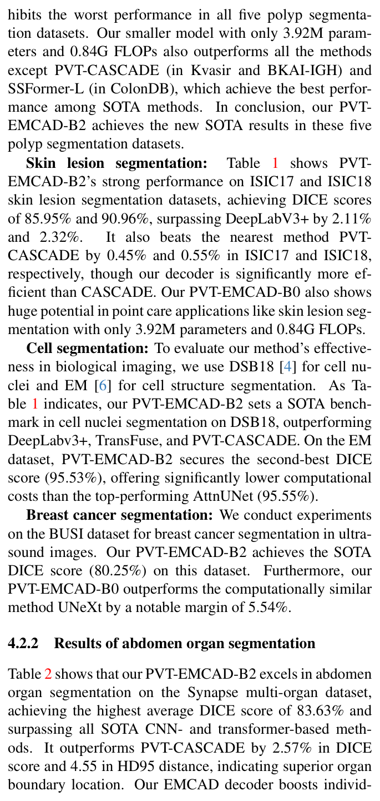
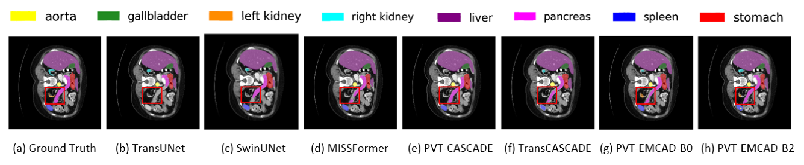
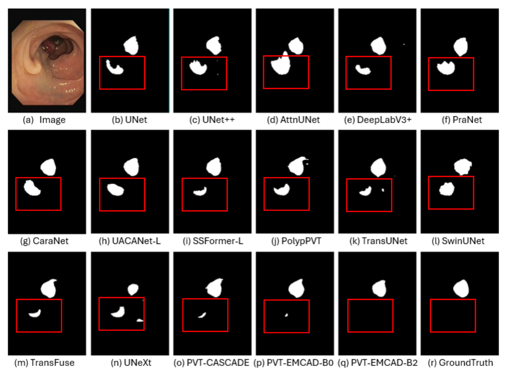

# EMCAD: Efficient Multi-scale Convolutional Attention Decoding for Medical Image Segmentation

Paper Reading 是从个人角度进行的一些总结分享，受到个人关注点的侧重和实力所限，可能有理解不到位的地方。具体的细节还需要以原文的内容为准，博客中的图表若未另外说明则均来自原文。

| 论文概况 | 详细 |
| --- | --- |
| 标题 | 《EMCAD: Efficient Multi-scale Convolutional Attention Decoding for Medical Image Segmentation》 |
| 作者 | Md Mostafijur Rahman、Mustafa Munir、Radu Marculescu |
| 发表会议 | CVPR |
| 会议等级 | CCF-A |
| 发表年份 | 2024 |
| 论文代码 | [https://github.com/SLDGroup/EMCAD](https://github.com/SLDGroup/EMCAD) |

作者单位：

1. 德克萨斯大学奥斯汀分校（The University of Texas at Austin）

## 研究动机

医学图像分割是诊断与治疗规划中的基础任务，表现为要对像素级分类以定位病灶、肿瘤或完整器官，导致分割网络的精度与计算开销直接决定其能否落地。U 形 CNN（UNet、UNet++、UNet3+、nnU-Net 等）凭借编码器-解码器与跳跃连接设计成为该领域的标准技术，注意力机制也被广泛集成进来以增强特征图、改善像素级分类，然而注意力通常与计算昂贵的卷积块捆绑使用，整体开销居高不下。视觉 Transformer 随后被引入，用自注意力捕获像素间的长程依赖，Swin、PVT、MaxViT、MERIT 等层级化结构进一步推高了精度；但自注意力擅长全局信息、不擅长局部空间上下文，于是一些方法在解码器中融入局部卷积注意力来补足空间细节。这条路依然昂贵：以级联解码器 CASCADE 为代表，其每个解码阶段都使用三个 3×3 标准卷积层，且解码时只用单尺度卷积，计算效率低，难以部署到算力受限的真实医疗场景（如床旁即时检测）。缺口至此清晰：暂未有解码器能在多尺度局部注意力建模与极低计算开销之间同时做好，既能配合任意层级化编码器即插即用，又能在多类医学分割任务上保持 SOTA 精度。

## 文章贡献

针对解码器中注意力机制计算昂贵、单尺度卷积表达受限的问题，本文提出了高效多尺度卷积注意力解码器 EMCAD，用多尺度深度可分离卷积与门控注意力重构解码路径。其核心是三件组件：多尺度卷积注意力模块 MSCAM 以「通道注意力 → 空间注意力 → 多尺度卷积块」的级联精炼编码器各阶段特征；大核分组注意力门 LGAG 用 3×3 分组卷积处理门控信号与输入特征，以更低计算量捕获更大局部上下文，并与跳跃连接特征做门控融合；高效上卷积块 EUCB 负责上采样与特征增强。首先把 MSCAD 精炼后的特征经分割头产出各阶段分割图，接着用 EUCB 逐级上采样并与 LGAG 输出相加，最终以末阶段预测图作为输出，并借鉴 MUTATION 思想聚合多头损失。实验表明，EMCAD 可搭配任意层级化编码器（如 PVTv2-B0/B2），在六大医学分割任务的 12 个数据集上取得 SOTA 精度，同时参数量与 FLOPs 分别降低 79.4% 与 80.3%；标准编码器下解码器仅需 1.91M 参数与 0.381G FLOPs。

## 本文方法

### 解码器整体架构

EMCAD 的目标是把层级化编码器的多阶段特征逐级精炼并聚合成高分辨率分割输出，其整体结构如下图所示。

图中 (a) 为四阶段 CNN 或 Transformer 编码器，(b) 为 EMCAD 解码器，(c) 至 (i) 依次是 EUCB、MSCAM、MSCB、MSDC、LGAG、CAB 与 SAB 的内部结构。数据流为：四个 MSCAM 分别精炼编码器四个阶段的金字塔特征 $X_1$ 至 $X_4$，每个 MSCAM 之后接一个分割头 SH 产出该阶段的分割图；精炼后的特征经 EUCB 上采样，与对应 LGAG 的输出相加后进入下一阶段；最终把 $X_4$ 走上采样路径、$X_3$、$X_2$、$X_1$ 走跳跃连接，四张分割图参与损失聚合。下面按模块逐一展开。

### 大核分组注意力门 LGAG

LGAG 用于逐级融合特征图与注意力系数：网络学习让相关特征更高激活、无关特征被抑制，门控信号来自更高层特征，以控制信息在不同阶段间的流动。与 Attention UNet 用 1×1 卷积处理门控信号 $g$（来自跳跃连接）与输入特征 $x$（上采样特征）不同，LGAG 在 $q_{att}(\cdot)$ 函数里对 $g$ 与 $x$ 分别做 3×3 分组卷积，其注意力系数计算为：

$$q_{att}(g, x) = R(BN(GC_g(g) + BN(GC_x(x))))$$

$$LGAG(g, x) = x \circledast \sigma(BN(C(q_{att}(g, x))))$$

其中 $GC_g(\cdot)$、$GC_x(\cdot)$ 是分组卷积；$BN(\cdot)$ 是批归一化；$R(\cdot)$ 是 ReLU 激活；$C(\cdot)$ 是 1×1 卷积，输出单通道特征图；$\sigma(\cdot)$ 是 Sigmoid；$\circledast$ 是逐元素相乘。直观上，3×3 分组卷积让门控信号在更大的局部上下文中决定「看哪里」，而分组与深度化的设计把这一代价压得比逐点卷积方案更低，LGAG 的输出随后与 EUCB 上采样特征相加，送入下一阶段的 MSCAM。

### MSCAM：多尺度卷积注意力模块

MSCAM 的目标是精炼特征图：在抑制无关区域的同时捕获多尺度显著特征。它由通道注意力块 CAB、空间注意力块 SAB 与多尺度卷积块 MSCB 级联而成，定义为：

$$MSCAM(x) = MSCB(SAB(CAB(x)))$$

其中 $x$ 是输入张量。三个子块的分工是：CAB 决定「关注哪些通道」，SAB 决定「关注哪些位置」，MSCB 用多尺度深度卷积在保持上下文关系的前提下增强特征。由于多尺度处均使用深度卷积，MSCAM 比 CASCADE 采用的卷积注意力模块 CAM 计算量显著更低。其输出的精炼特征一路交给分割头产出阶段预测，一路交给 EUCB 上采样。

### MSCB 与多尺度深度卷积 MSDC

MSCB 用于增强级联扩展路径产生的特征，设计上沿用 MobileNetV2 的倒残差块 IRB，但把单一深度卷积换成多尺度版本并加入通道混洗。其计算为：

$$MSCB(x) = BN(PWC_2(CS(MSDC(R_6(BN(PWC_1(x)))))))$$

其中 $PWC_1(\cdot)$ 是扩张倍数为 2 的逐点卷积，$R_6(\cdot)$ 是 ReLU6 激活，$CS(\cdot)$ 是通道混洗操作，$PWC_2(\cdot)$ 是变换回原通道数的逐点卷积。先用逐点卷积扩张通道、再用 $PWC_2$ 配合 BN 变换回来，这一过程同时编码了通道间依赖；通道混洗则弥补深度卷积忽略跨通道关系的缺陷。

多尺度上下文由 MSDC 提供，并行形式的计算为：

$$MSDC(x) = \sum_{ks \in KS} DWCB_{ks}(x)$$

其中 $KS$ 是核尺寸集合（消融后取 $[1, 3, 5]$）；$DWCB_{ks}(x) = R_6(BN(DWC_{ks}(x)))$，$DWC_{ks}(\cdot)$ 是核尺寸为 $ks$ 的深度卷积。串行形式则用递归更新的输入，把 $x$ 残差连接到前一个 $DWCB_{ks}(\cdot)$ 以获得更好的正则化，更新为：

$$x = x + DWCB_{ks}(x)$$

并行与串行两种排布在实验中差异很小（0.03% 至 0.15%），默认采用并行形式。

### 通道注意力块 CAB

CAB 的作用是给每个通道分配不同的重要性，强调相关特征、抑制无用特征，即识别「该关注哪些特征图」。沿用 CBAM 的通道分支设计，其计算为：

$$CAB(x) = \sigma(C_2(R(C_1(P_m(x)))) + C_2(R(C_1(P_a(x))))) \circledast x$$

其中 $P_m(\cdot)$、$P_a(\cdot)$ 分别是对空间维度做的自适应最大池化与平均池化，提取每通道最显著的全图特征；$C_1(\cdot)$ 把通道数压缩为 $r = 1/16$ 倍，$C_2(\cdot)$ 恢复原通道数；$\sigma(\cdot)$ 是 Sigmoid，$\circledast$ 是 Hadamard 积。两路池化特征相加后估计注意力权重，再乘回输入，完成通道维度的筛选与精炼。

### 空间注意力块 SAB

SAB 与 CAB 对偶，决定「该关注特征图的哪些位置」，模拟人脑对图像特定部分的注意过程。其计算为：

$$SAB(x) = \sigma(LKC([Ch_{max}(x), Ch_{avg}(x)])) \circledast x$$

其中 $Ch_{max}(\cdot)$、$Ch_{avg}(\cdot)$ 是沿通道维做的最大池化与平均池化，$[\cdot,\cdot]$ 是通道维拼接；$LKC(\cdot)$ 是大核卷积（沿用 PolypPVT 取 7×7），用于增强特征间的局部上下文关系；$\sigma(\cdot)$ 与 $\circledast$ 同前。大核卷积让空间注意力在更宽的邻域内计算权重，对目标位置与上下文敏感的分割任务尤为重要，SAB 的输出交给 MSCB 做多尺度增强。

### EUCB 与分割头

EUCB 用于把当前阶段的特征图逐级上采样，使其尺寸与分辨率对齐下一条跳跃连接。其计算为：

$$EUCB(x) = C_{1 \times 1}(ReLU(BN(DWC(Up(x)))))$$

其中 $Up(\cdot)$ 是尺度因子为 2 的上采样，$DWC(\cdot)$ 是 3×3 深度卷积，$C_{1 \times 1}(\cdot)$ 把通道数压到与下一阶段匹配。用深度卷积替代标准 3×3 卷积是 EUCB 高效的关键。分割头 SH 则把精炼后的特征映射为类别得分：

$$SH(x) = Conv_{1 \times 1}(x)$$

其中输入特征有 $ch_i$ 个通道（$ch_i$ 是第 $i$ 阶段特征图的通道数），输出通道数在多类分割时等于类别数、二值分割时为 1。

### 整体架构与多阶段损失

为验证通用性，本文把 EMCAD 分别接到 PVTv2 的 tiny（B0）与 standard（B2）编码器上，构成 PVT-EMCAD-B0 与 PVT-EMCAD-B2；PVTv2 用卷积式 patch embedding 保持空间信息一致性，解码器也可无缝兼容其它层级化骨干。四个分割头产出预测图 $p_1$ 至 $p_4$。多类分割借鉴 MERIT 的 MUTATION 策略：对 4 个头的所有预测组合（共 $2^4 - 1 = 15$ 种）分别计算损失并求和训练。二值分割则优化带聚合项的加性损失：

$$L_{total} = \alpha L_{p_1} + \beta L_{p_2} + \gamma L_{p_3} + \zeta L_{p_4} + \delta L_{p_1+p_2+p_3+p_4}$$

其中 $L_{p_1}$ 至 $L_{p_4}$ 是各预测图的损失，权重 $\alpha = \beta = \gamma = \zeta = \delta = 1.0$。推理时取末阶段预测图 $p_4$ 作为最终分割图，二值分割过 Sigmoid、多类分割过 Softmax 输出。

## 实验结果

### 实验设置

实验覆盖六大医学分割任务的 12 个数据集：息肉分割 5 个（Kvasir 1000 张、ClinicDB 612 张、ColonDB 379 张、ETIS 196 张、BKAI 1000 张），腹部器官分割用 Synapse 多器官 CT（30 例扫描共 3779 个轴位切片，18 例训练、12 例验证，分割 8 个器官），心脏器官分割用 ACDC MRI（100 例，70/10/20 划分，分割 RV、Myo、LV 三个子结构），皮肤病变分割用 ISIC17（官方划分）与 ISIC18（2594 张），乳腺癌超声分割用 BUSI（647 张），细胞核/细胞结构分割用 DSB18（670 张）与 EM（30 张）。除 ISIC17 外均采用 80:10:10 的训练-验证-测试划分。评价指标以 DICE 为主，Synapse 另报 HD95 与 mIoU，DICE 分数定义为：

$$DSC(Y, P) = \frac{2 \times |Y \cap P|}{|Y| + |P|} \times 100$$

其中 $Y$ 与 $P$ 分别是真值与预测分割图。实现上采用 PyTorch 1.11.0 与单张 RTX A6000，编码器用 ImageNet 预训练的 PVTv2-B0/B2，MSDC 核尺寸取 $[1, 3, 5]$ 并行排布；AdamW 优化器，学习率与 weight decay 均为 1e-4，一般训练 200 epochs、batch size 16（Synapse 为 300 epochs、batch 6，ACDC 为 400 epochs、batch 12）；息肉与皮肤病变等数据集输入 352×352 并采用 {0.75, 1.0, 1.25} 多尺度训练，BUSI、EM、DSB18 输入 256×256，Synapse 与 ACDC 输入 224×224；二值分割用加权 BCE 与加权 IoU 的组合损失，Synapse 与 ACDC 用 Cross-entropy（0.3）与 DICE（0.7）的组合损失。

### 对比实验

10 个二值分割数据集上的精度-计算量权衡如下图所示，横轴为 FLOPs、纵轴为平均 DICE。

PVT-EMCAD-B0 与 B2 位于左下角最优区域：FLOPs 最低而 DICE 最高。完整数值见原文 Table 1，截图如下。

PVT-EMCAD-B2 以 26.76M 参数与 5.6G FLOPs 取得 91.10% 的平均 DICE；在五个息肉数据集上全面领先，相对 PolypPVT 在 ClinicDB、ColonDB、ETIS、Kvasir 与 BKAI-IGI 上分别提升 1.08%、0.78%、2.36%、1.19% 与 1.79%；皮肤病变分割上 ISIC17 与 ISIC18 达到 85.95% 与 90.96%，超过 DeepLabv3+ 2.11% 与 2.32%，也高于最近的 PVT-CASCADE 0.45% 与 0.55%；细胞核分割 DSB18 取得 SOTA，EM 上以 95.53% 居第二（第一为 AttnUNet 的 95.55%，但计算成本高得多）；BUSI 上 B2 达到 80.25% 的 SOTA，B0 则以 3.92M 参数超过计算量相近的 UNeXt 5.54%。参数维度的权衡如下图所示，结论与 FLOPs 维度一致。

多类分割方面，Synapse 腹部八器官的完整结果见原文 Table 2，截图如下。

表中 PVT-EMCAD-B2 以 83.63% 的平均 DICE 与 15.68 的 HD95 同时占据两列最优。ACDC 心脏器官分割的完整结果见原文 Table 3，截图如下。

Synapse 上 B2 比 PVT-CASCADE 高 2.57% DICE、低 4.55 HD95，八个器官中六个领先，表明器官边界定位更准；ACDC 上 B2 达到 92.12% 的平均 DICE，比 Cascaded MERIT 高约 0.27% 且三个子结构全部更优，而计算成本低得多。

### 消融实验

组件消融在 Synapse 上进行，结果见原文 Table 4，截图如下。

从纯编码器出发的 80.10% 开始，级联结构带来 +0.98%，LGAG 与 MSCAM 单独接入分别到 81.92% 与 82.86%，两者合用达到 83.63%，总代价仅 0.381G FLOPs 与 1.91M 参数，可见 MSCAM 的贡献大于 LGAG，二者互补。MSDC 核尺寸组合的消融见原文 Table 5：单核从 1×1 到 3×3 递增，[1, 3] 优于任一单核，[3, 3] 反而下降，加入 5×5 后的 [1, 3, 5] 在 Synapse（83.63%）与 ClinicDB（95.21%）上均最优，继续加 7×7、9×9 大核则双双掉点，说明多尺度的收益来自尺度多样性而非核尺寸本身。与基线解码器 CASCADE 的直接对比见原文 Table 6：PVTv2-B2 下 EMCAD 以更少 80.3% 的 FLOPs 与 79.4% 的参数取得 +0.85% DICE；PVTv2-B0 下以少 74.9% FLOPs、78.1% 参数取得 +1.43%。补充消融还比较了 LGAG 与原 AG（原文 Table 8）：B2 下三个门的参数从 124.68K 降到 11.01K、DICE 从 83.51% 升到 83.63%；并行对串行 MSDC（原文 Table 7）差异 0.03% 至 0.15% 且并行更稳定；ImageNet 预训练（原文 Table 9）给 B0 带来 77.47% 到 81.97% 的大幅提升。

### 可视化分析

Synapse 多器官分割的定性对比如下图所示，红框标出 SOTA 方法分割错误的器官。

多数方法难以分准左肾（橙色）与部分胰腺（粉色），而 PVT-EMCAD-B0 与 B2 在这两个器官上分割更准确，且计算成本低得多。息肉分割的定性结果如下图所示，取自 ClinicDB 的代表性图像。

PVT-EMCAD-B0 与 B2 的预测与真值掩码高度重叠，而现有 SOTA 方法在红框区域出现息肉的错误分割。定性结果与 DICE、HD95 的定量优势一致，表明多尺度精炼与门控融合确实改善了难分器官与病变边界的预测。

## 优点和创新点

个人认为，本文有如下一些优点和创新点可供参考学习：

1. 把解码器的效率改造做到组件级：用多尺度深度卷积加通道混洗替代 CASCADE 的三重 3×3 标准卷积，以少 79.4% 参数与 80.3% FLOPs 反超基线 DICE，为特征融合解码器提供了可复用的轻量化范式。
2. 用 3×3 分组卷积重构注意力门 LGAG，在更大局部上下文中生成门控信号，三个门合计参数从 124.68K 降到 11.01K 精度反而更高，展示了「分组 + 大核」以低价换上下文的巧妙设计。
3. 实验覆盖面与可复现性俱佳：六大任务 12 个数据集、五次运行取均值、组件/核尺寸/排布/门控/预训练五组消融加定性可视化，结论互相印证，说服力强。
