# Efficient Deformable ConvNets: Rethinking Dynamic and Sparse Operator for Vision Applications

Paper Reading 是从个人角度进行的一些总结分享，受到个人关注点的侧重和实力所限，可能有理解不到位的地方。具体的细节还需要以原文的内容为准，博客中的图表若未另外说明则均来自原文。

| 论文概况 | 详细 |
| --- | --- |
| 标题 | 《Efficient Deformable ConvNets: Rethinking Dynamic and Sparse Operator for Vision Applications》 |
| 作者 | Yuwen Xiong、Zhiqi Li、Yuntao Chen、Feng Wang、Xizhou Zhu、Jiapeng Luo、Wenhai Wang、Tong Lu、Hongsheng Li、Yu Qiao、Lewei Lu、Jie Zhou、Jifeng Dai |
| 发表会议 | CVPR |
| 会议等级 | CCF-A |
| 发表年份 | 2024 |
| 论文代码 | [https://github.com/OpenGVLab/DCNv4](https://github.com/OpenGVLab/DCNv4) |

作者单位：

1. University of Toronto
2. OpenGVLab, Shanghai AI Laboratory
3. Nanjing University
4. CAIR, HKISI, CAS
5. Tsinghua University
6. SenseTime Research
7. The Chinese University of Hong Kong

## 研究动机

核心算子的选择是视觉骨干网络设计的基础问题，表现为卷积与注意力两条路线的长期对立，导致模型在性能与效率之间反复权衡。Transformer 类模型依靠注意力机制在大规模视觉模型上取得显著成果，但 InternImage 与 ConvNeXt 等 ConvNet 模型证明了卷积在各类下游任务上仍保有稳健的性能、效率、简洁性与合适的归纳偏置，在图像生成等领域卷积依旧是首选。可变形卷积 DCNv3 进一步把稀疏注意力与卷积结合：以小尺寸滑窗方式处理每个输出位置，同时以自适应范围动态采样点、用输入依赖的权重聚合空间特征，被期望同时获得更快的收敛速度与更低的推理延迟。然而 DCN 并没有成为视觉骨干网络的首选方案。一方面是运行速度：采样非邻近位置带来额外开销，使 DCN 不适应现代卷积算法，对比测量中 DCNv3 甚至比经过充分优化的稠密全局注意力更慢。另一方面是收敛行为：DCNv3 在骨干训练初期的收敛速度慢于全局注意力，与其自带卷积归纳偏置的直觉相悖。问题至此收窄为：暂未有工作在保留动态稀疏聚合能力的前提下，同时解决算子运行慢与训练初期收敛慢这两个瓶颈。

## 文章贡献

针对 DCNv3 算子运行速度慢、训练初期收敛慢的问题，本文提出了可变形卷积 v4（DCNv4）。其核心是从动态性质与内存访问两个维度重新设计可变形卷积算子。首先移除空间聚合中的 softmax 归一化，把被约束在 0 到 1 之间的调制标量变为无界动态权重，增强算子的动态性质与表达能力；接着通过指令级内核剖析定位到 DCNv3 的瓶颈在内存访问而非计算，用同组通道线程复用、向量化读写与半精度格式消除冗余内存读取与冗余内存指令；最终通过合并线性层、去掉 LN-GELU 等微设计进一步压缩模块级开销。实验表明 DCNv4 的前向速度达到 DCNv3 的 3 倍以上且收敛显著更快，用 DCNv4 替换 InternImage 中的 DCNv3 得到的 FlashInternImage 在吞吐提升 50%～80% 的同时性能进一步提高，并在分类、检测、分割、3D 检测与图像生成等任务上均取得有竞争力的结果。

## 本文方法

### 重访 DCNv3：动态稀疏聚合算子

本节的目标是明确 DCNv3 的计算形式，为后续两处改造提供基线。给定输入 $x \in \mathbb{R}^{H \times W \times C}$，带 $K$ 个采样点的 DCNv3 操作对每个输出位置 $p_0$ 的定义如下：

$$y_g = \sum_{k=1}^{K} m_{gk}\, x_g(p_0 + p_k + \Delta p_{gk})$$

$$y = \mathrm{concat}([y_1, y_2, \dots, y_G], \text{axis}=-1)$$

| 符号 | 含义 |
| --- | --- |
| $G$ | 空间聚合组数 |
| $x_g, y_g \in \mathbb{R}^{H \times W \times C'}$ | 第 $g$ 组的输入/输出特征图，$C' = C/G$ 为组维度 |
| $m_{gk}$ | 第 $g$ 组第 $k$ 个采样点的空间聚合权重（调制标量），以输入 $x$ 为条件并沿 $K$ 维做 softmax 归一化 |
| $p_k$ | 预定义网格采样 $\{(-1,-1), (-1,0), \dots, (+1,+1)\}$ 中第 $k$ 个位置 |
| $\Delta p_{gk}$ | 第 $g$ 组中与网格位置 $p_k$ 对应的偏移 |

直观上，DCNv3 是卷积与注意力的结合体：滑窗处理继承卷积的归纳偏置，而偏移 $\Delta p$ 与权重 $m$ 由输入特征动态预测，又使其接近注意力机制。依照可分离卷积的做法，算子前后可各加一个 1×1 逐点卷积增强表达能力。这一定义同时暴露了两个可改造点：权重的取值范围与内存访问模式，分别对应后两节的修改。

### 算子性质对比

本节从聚合窗口、权重动态性、权重取值范围三个维度给各核心算子定位，DCNv4 的设计目标如下图所示。

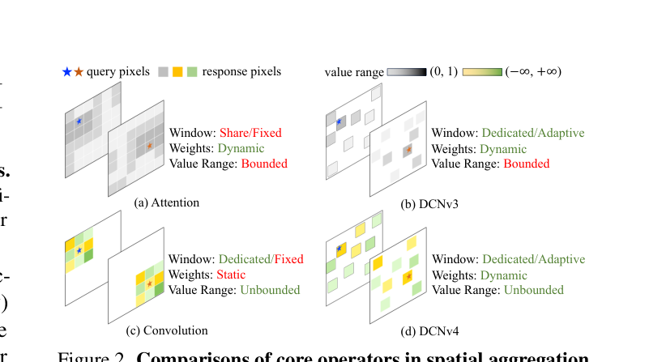

注意力与 DCNv3 都用取值 (0, 1) 的有界动态权重聚合空间特征，差别在于注意力的窗口共享且固定，而 DCNv3 每个位置有独立窗口；卷积拥有独立滑窗与无界权重取值，但窗口形状与权重都与输入无关；DCNv4 则同时具备自适应聚合窗口、动态聚合权重与无界取值范围。这张对比图把 DCNv4 的改造方向表述为「保留动态稀疏、放开权重取值」，直接引出下一节移除 softmax 的操作。

### 移除 softmax 归一化

本节论证 softmax 对 DCN 类算子并非必需。缩放点积自注意力的形式化如下：

$$\mathrm{softmax}\left(\frac{1}{\sqrt{d}} QK^\top\right) V$$

| 符号 | 含义 |
| --- | --- |
| $N$ | 同一注意力窗口内的点数（全局或局部窗口） |
| $d$ | 隐藏维度 |
| $Q, K, V$ | 由输入计算得到的查询、键、值矩阵 |

softmax 在注意力中是必需的：去掉它之后 $K^\top V \in \mathbb{R}^{d \times d}$ 可以先算，注意力对同一窗口内所有查询退化为一次线性投影，性能随之退化。但对深度可分离卷积、DCNv3 这类每个点拥有独立聚合窗口的算子，各窗口内的取值本就不同、也不存在「键」的概念，退化问题不复存在，归一化反而把权重限制在 0 到 1 之间，压制表达能力并拖慢学习。为验证这一判断，本文在 ConvNeXt 的深度卷积权重上做 7×7 窗内 softmax 后再前向，结果如下图所示。

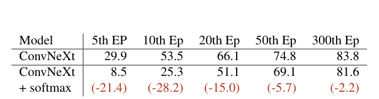

加 softmax 后第 5 个 epoch 的精度从 29.9 跌到 8.5，训练到第 300 个 epoch 仍落后 2.2 个点，可见有界权重确实同时损害收敛速度与最终性能。据此 DCNv4 移除 softmax，把调制标量变为无界动态权重，收敛曲线显示其训练全程快于 DCNv3、卷积与稠密注意力。改造后的算子进入下一节的效率优化环节。

### GPU 效率的理论分析

本节的目标是用 roofline 模型量化 DCNv3 的计算与内存访问开销，找出优化空间。对形状为 (H, W, C) 的输入与输出张量，DCNv3 需要 36HWC FLOPs，其中 3×3 是卷积核空间尺寸，系数 4 来自每个采样点的双线性插值；其内存访问成本的计算为：

$$\mathrm{MAC} = 2HWC + 27HWG$$

| 符号 | 含义 |
| --- | --- |
| $H, W, C$ | 输入/输出特征图的高、宽、通道数 |
| $G$ | 空间聚合组数，取组维度 16 即 $G \approx C/16$，此时 MAC 约为 3.7HWC |

第一项对应输入/输出特征图大小，第二项对应偏移与聚合权重；3.7HWC 是「无限缓存、每个值只读一次」的理想估计。在无缓存的另一极端，每个输出位置需要 36 次双线性插值读取、27 次偏移/权重读取与 1 次写入，MAC 达 64HWC，是理想值的 17 倍，计算与内存访问之比在 0.6 到 9.7 之间浮动。指令级剖析进一步显示 DCNv3 的计算开销占比不足 1%、内存访问占 99%。分析中唯一确定的事实是同组通道共享偏移与权重，这成为下一节内核优化的切入点。

### 消除冗余负载与冗余内存指令

本节的目标是在 CUDA 内核层面消除冗余内存访问。旧实现为输入 (H, W, C)、偏移 (H, W, G, K²×2)、权重 (H, W, G, K²) 创建 H×W×C 个线程，每个线程处理一个输出位置的一个通道；但同组 D = C/G 个通道在同一输出位置共享相同的采样偏移与聚合权重，多线程重复读取这些值对内存受限的算子是巨大浪费。优化方式如下图所示。

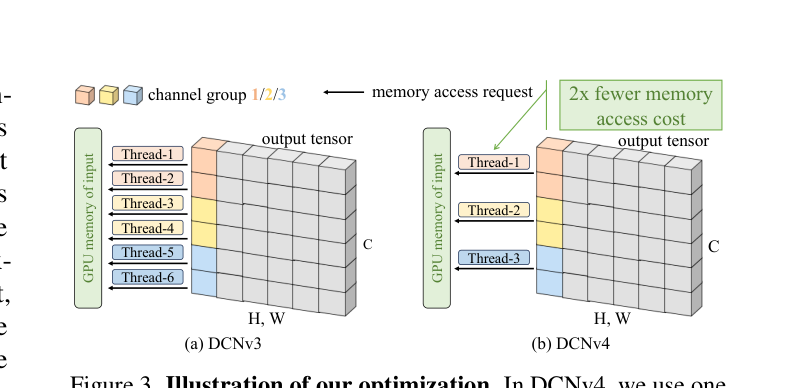

DCNv4 让一个线程处理同组多个通道：每线程处理 D' 个通道时，读取偏移与权重的内存访问成本、计算双线性插值系数的计算成本都降低 D' 倍。但仅复用线程并不提速，因为线程数减少使并行度下降、单线程负载增加 D' 倍；此时内核已计算轻量，主要负载是从不同通道读输入值的内存指令。当内存布局为 channel-last 且 D' 个通道值连续时，可用向量化加载以一条指令读入 128 位打包值，替代四次 32 位读取，写回同理；半精度格式（float16/bfloat16）再把需读写字节数减半。原 DCNv3 实现因访问开销过大在半精度下不见提速，新实现中提速显著。这些技巧同样适用于 DCNv1/v2 与 deformable attention，优化后的内核再与下一节的微设计组合成完整模块。

### 模块的微设计

本节的目标是清理内核优化后变得不可忽略的模块级开销。本文识别出两处可改点：其一，移除 softmax 后计算偏移与动态权重的两个线性层可以合并为一个，减少网络碎片化与内核启动、同步等额外开销；其二，原 DCNv3 用「深度 3×3 卷积 + LN + GELU + 线性层」的复杂子网络计算偏移与动态权重，本文沿用 Xception 的设计去掉额外的 LN-GELU，回归原始可分离卷积结构，进一步缩短运行时间。经验上若延迟优先级更高，深度卷积也可移除，只付出轻微的性能代价。这些微设计与上一节的内核优化共同构成 DCNv4 的完整实现，各环节的贡献在实验节的消融实验中逐项验证。

## 实验结果

### 实验设置

所有速度测试在 NVIDIA A100 80G SXM GPU 上完成，软件环境为 PyTorch 1.13、CUDA 11.7、cuDNN 8.5。算子级基准对比 PyTorch 实现的全注意力、FlashAttention-2、7×7 窗口注意力、7×7 深度卷积（cuDNN 与 ATen 两种实现）、DCNv3 与 DCNv4，只测量核心空间聚合操作；系统级实验用 DCNv4 替换 InternImage 中的 DCNv3 得到 FlashInternImage，其余架构与超参与 InternImage 保持一致，覆盖 ImageNet 分类、COCO 实例分割、ADE20K 语义分割、nuScenes 3D 检测与 ImageNet 256×256 类条件生成。

### 可视化分析

先看两组直观图组。下图给出以 DCNv3 为基线的算子相对运行时间，以及相同网络架构下各算子的 ImageNet Top-1 精度收敛曲线。

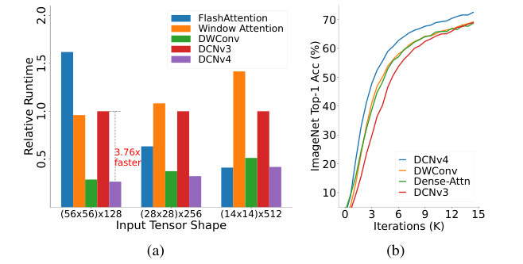

左图中 DCNv4 在各分辨率档的相对运行时间均低于 0.5，即比 DCNv3 快 3 倍以上，且低于 FlashAttention、窗口注意力与深度卷积；右图中 DCNv4 的精度曲线全程位于 DWConv、稠密注意力与 DCNv3 之上，而 DCNv3 在训练初期明显落后。可见移除 softmax 与内存访问优化既兑现了稀疏算子的速度潜力，也修复了初期收敛慢的问题。下图是潜扩散模型 U-Net 中以 DCNv4 替换卷积后的定性生成结果。

生成样本结构清晰、语义合理，说明 DCNv4 在生成任务中同样可用，为后文的 FID 定量对比提供了定性佐证。

### 算子级速度基准

标准分辨率（224×224 经 4/8/16/32 倍下采样）与高分辨率（800×1280、1024×1024）下的算子运行时间如下两张表所示，格式为 FP32/FP16。

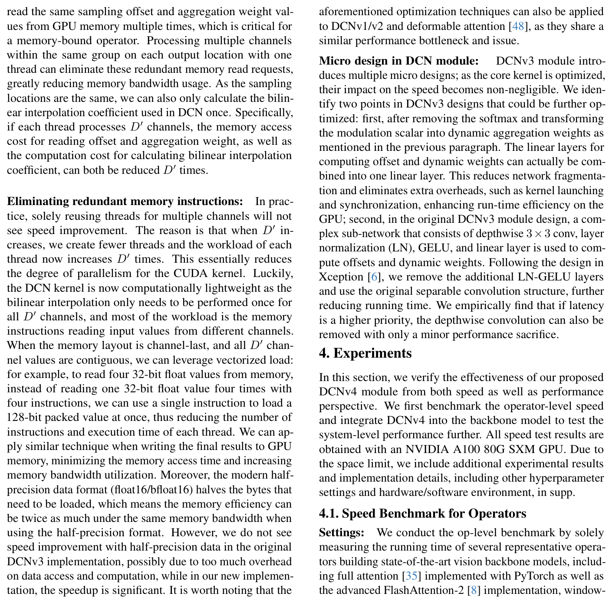

上表覆盖 224×224 输入经 4/8/16/32 倍下采样后的四种特征形状，以及 ViT 类等宽架构的 14×14×768 形状。

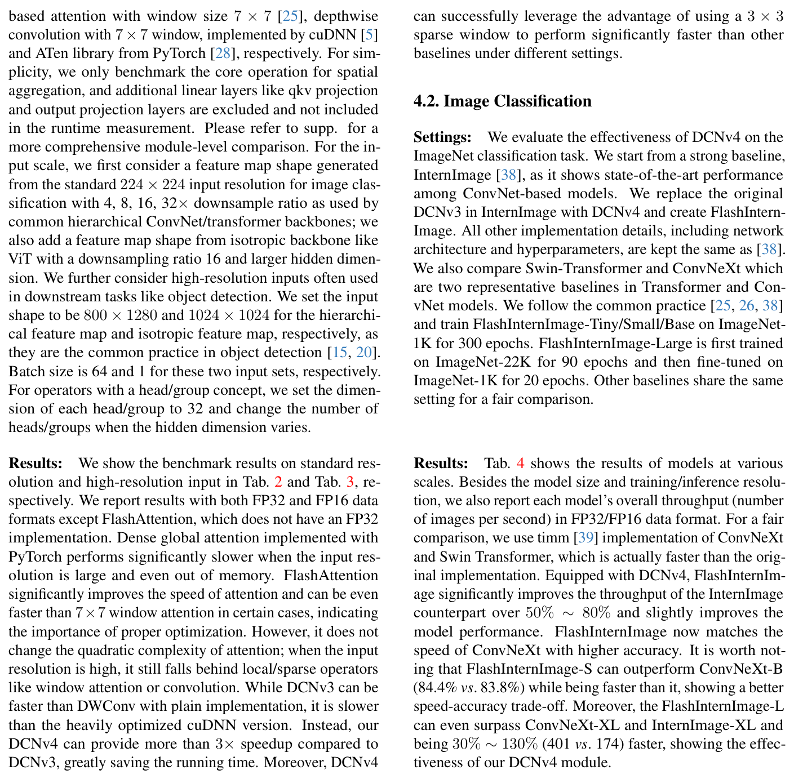

稠密全局注意力在高分辨率下显著变慢甚至显存溢出；FlashAttention-2 大幅提速但不改变二次复杂度，高分辨率下仍落后于局部/稀疏算子；DCNv3 快于朴素深度卷积却慢于 cuDNN 优化版。DCNv4 在各档输入上均比 DCNv3 快 3 倍以上，例如 56×56×128 的 FP16 耗时从 1.52 ms 降到 0.404 ms，全面超越所有基线，表明 3×3 稀疏窗口的速度优势只有在内存访问优化后才成为现实。

### 分类与下游任务对比

ImageNet-1K 分类结果如下表所示，吞吐以 FP32/FP16 两种格式报告。

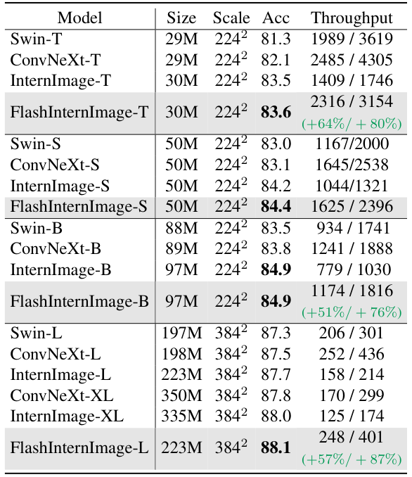

FlashInternImage 的吞吐比同规模 InternImage 高 50%～80%，精度还略有提升：FlashInternImage-S 以 84.4% 对 83.8% 超过 ConvNeXt-B 且速度更快，FlashInternImage-L 以 88.1% 超过 ConvNeXt-XL 与 InternImage-XL 且快 30%～130%。COCO 实例分割与 ADE20K 语义分割的结果如下两张表所示。

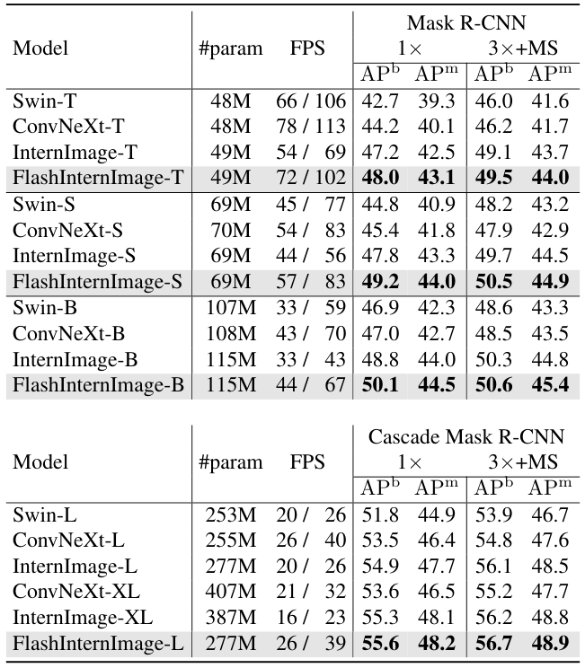

FlashInternImage-T/S 在实例分割上超过所有同规模模型、追平更大的 InternImage-S/B 且快 80%～90%。

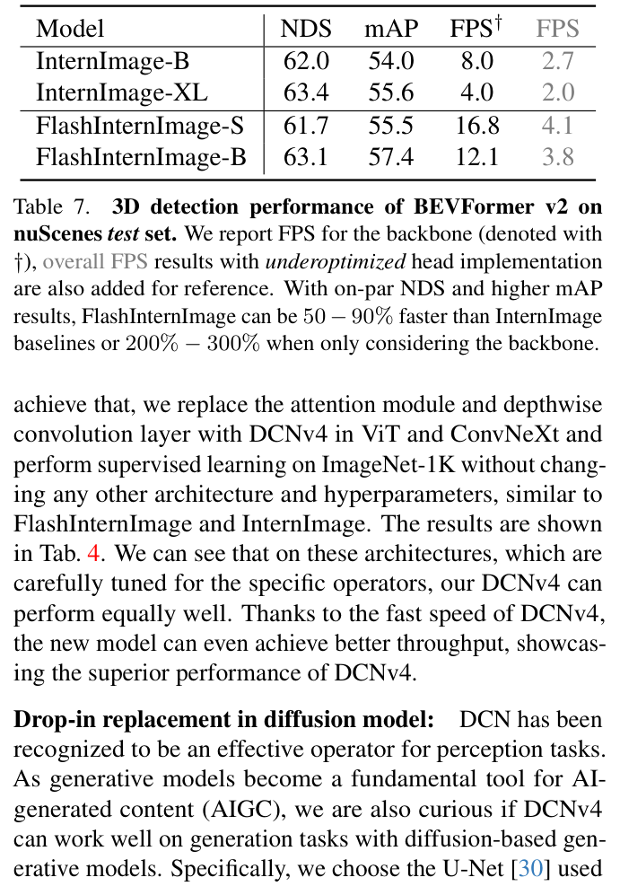

语义分割上 Large 规模达到 55.6/56.0 的 SS/MS mIoU，刷新了当时的最好结果。nuScenes 3D 检测的结果如下表所示。

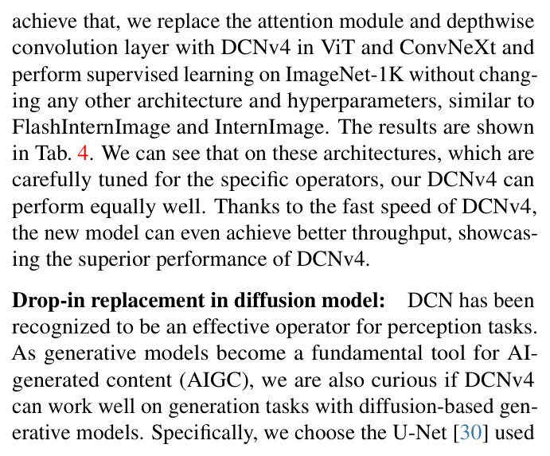

FlashInternImage-B 取得 63.1 NDS 与 57.4 mAP，仅看骨干时比 InternImage 快 2～3 倍，说明算子级提速在检测头欠优化的场景下仍能完整转化为系统级收益。

### 通用算子验证

本文把 ConvNeXt 的深度卷积与 ViT 的注意力分别替换为 DCNv4，不改任何其它架构与超参，ImageNet-1K 监督训练结果如下表所示。

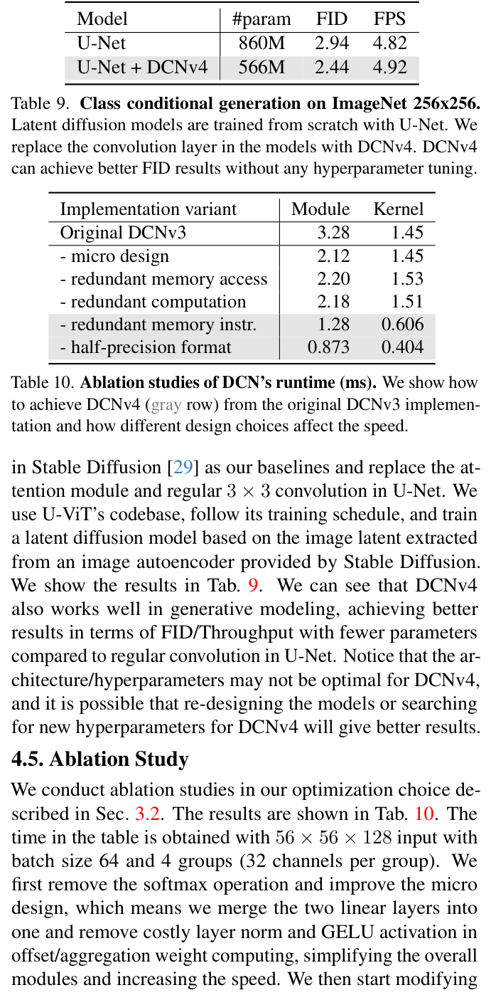

ConvNeXt-B + DCNv4 精度从 83.8 升到 84.0、吞吐提升 20%/33%，ViT-B + DCNv4 精度从 81.8 升到 81.9、吞吐提升 24%/17%，表明 DCNv4 在为特定算子精心调参的架构中仍能保持同等精度与更快速度。生成任务上，U-Net 中的卷积被替换为 DCNv4 后参数量从 860M 降到 566M，FID 从 2.94 改善到 2.44，如下表所示。

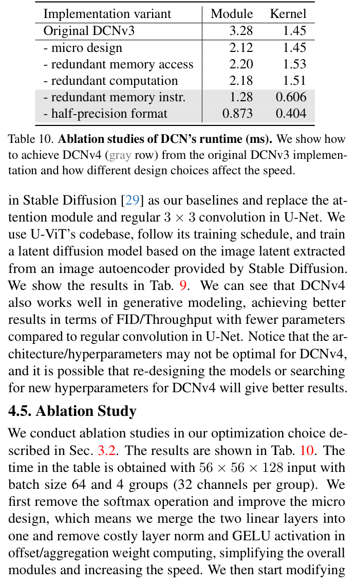

DCNv4 在未做任何超参调整的情况下取得更好的 FID 与吞吐，验证了其作为通用视觉算子的潜力；作者同时指出该架构与超参未必对 DCNv4 最优，重新设计模型或搜索超参还可能更好。

### 消融实验

各优化环节对运行时间的累积贡献如下表所示，测试输入为 56×56×128、batch size 64、4 组，灰色行为最终 DCNv4。

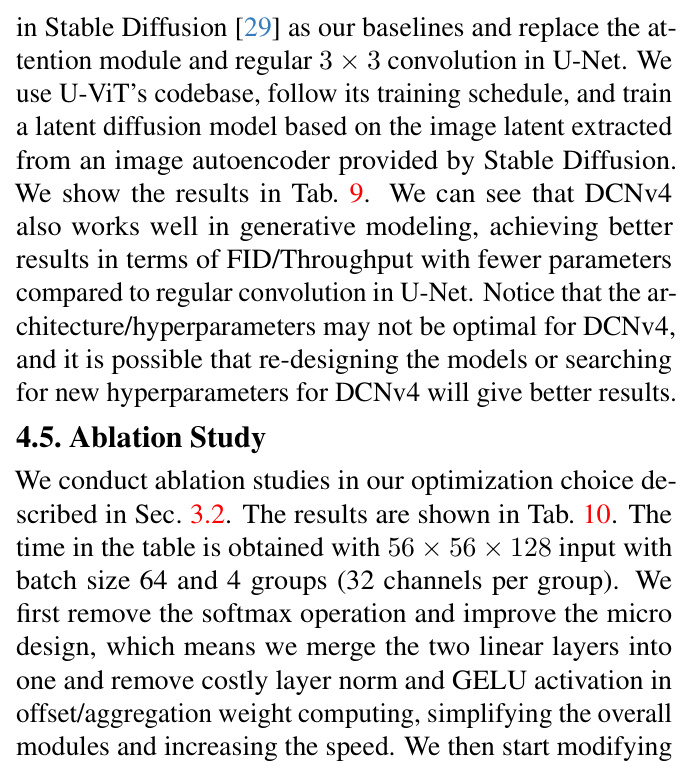

微设计把模块时间从 3.28 ms 降到 2.12 ms；单纯线程复用（去除冗余内存访问）因并行度下降反而升到 2.20 ms，复用双线性插值系数的收益也不显著；引入向量化读写消除冗余内存指令后内核时间才大幅降到 0.606 ms，半精度格式进一步压到 0.404 ms。可见 3 倍提速来自多项优化的叠加，其中消除冗余内存指令是最关键的一步。

## 优点和创新点

个人认为，本文有如下一些优点和创新点可供参考学习：

1. 从指令级内核剖析出发定位到 DCNv3 的瓶颈是占 99% 的内存访问而非计算，再用线程复用、向量化读写与半精度格式系统消除冗余，把稀疏算子的理论速度优势变为现实，分析路径可供参考。
2. 用「给 ConvNeXt 卷积权重加 softmax」的对照实验验证独立聚合窗口算子不需要有界权重的判断，据此移除 softmax 使动态权重获得与卷积相同的取值自由，同时收获收敛速度与精度，论证方式说服力强。
3. 在 InternImage 替换、ConvNeXt 与 ViT 即插即用替换、扩散模型 U-Net 替换三种设置下验证 DCNv4 的通用性，覆盖分类、检测、分割、3D 检测与生成五类任务，实验丰富、说服力强。
