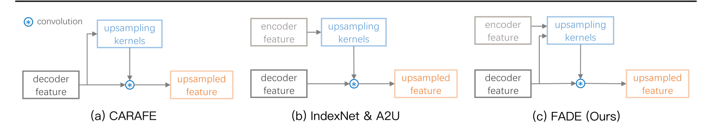
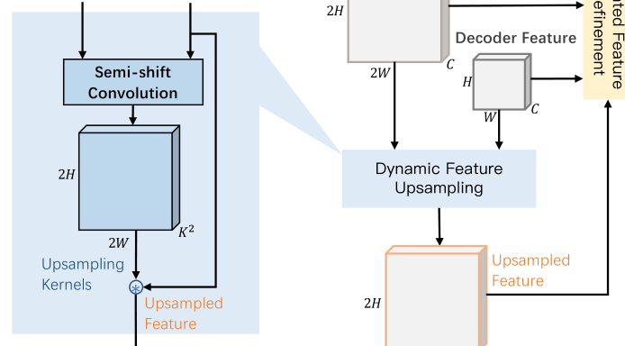
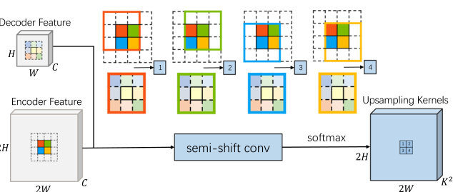
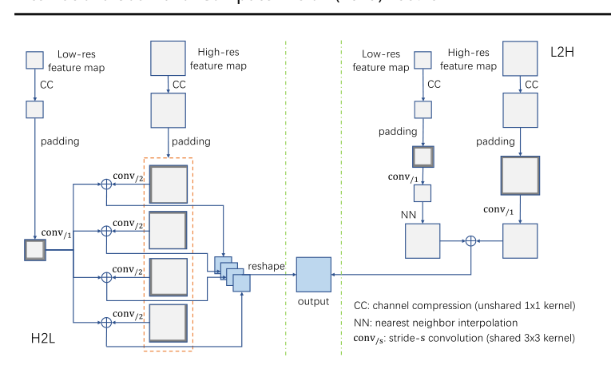
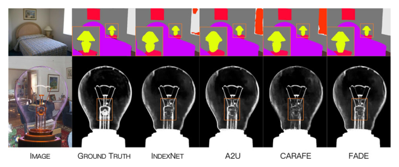
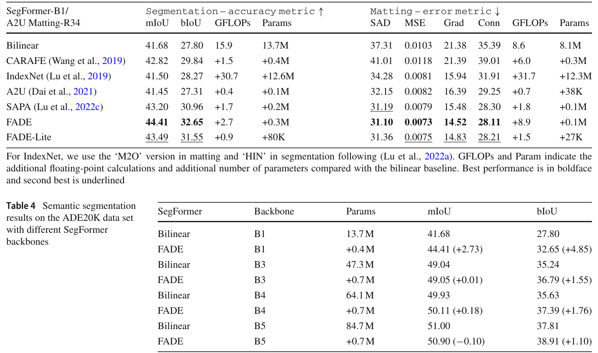
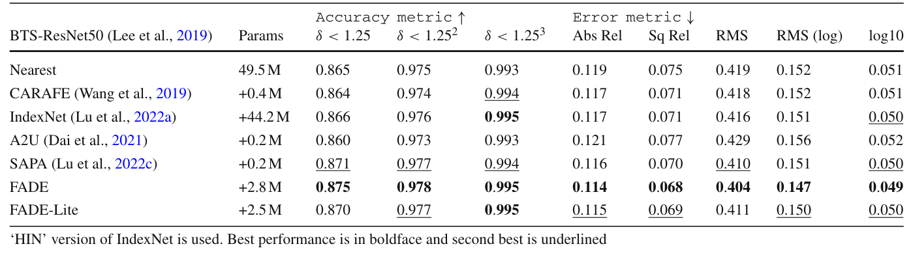
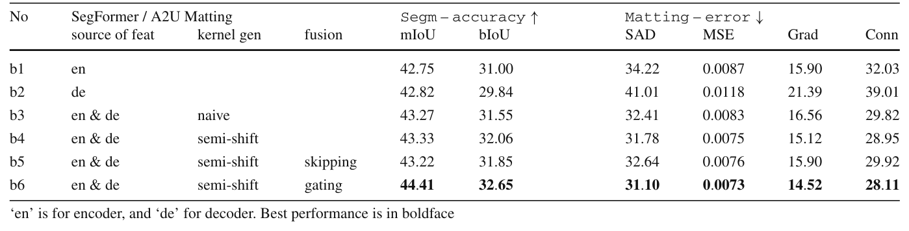
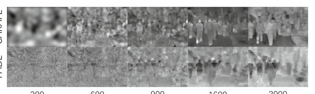
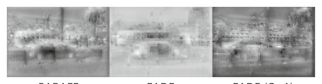

# FADE: A Task-Agnostic Upsampling Operator for Encoder–Decoder Architectures

Paper Reading 是从个人角度进行的一些总结分享，受到个人关注点的侧重和实力所限，可能有理解不到位的地方。具体的细节还需要以原文的内容为准，博客中的图表若未另外说明则均来自原文。

| 论文概况 | 详细 |
| --- | --- |
| 标题 | 《FADE: A Task-Agnostic Upsampling Operator for Encoder–Decoder Architectures》 |
| 作者 | Hao Lu、Wenze Liu、Hongtao Fu、Zhiguo Cao |
| 发表期刊 | International Journal of Computer Vision (IJCV) |
| 期刊等级 | CCF-A |
| 发表年份 | 2025 |
| 论文代码 | [https://github.com/poppinace/fade](https://github.com/poppinace/fade) |

作者单位：

1. 华中科技大学人工智能与自动化学院、图像信息处理与智能控制教育部重点实验室（The Key Laboratory of Image Processing and Intelligent Control, Ministry of Education, School of Artificial Intelligence and Automation, Huazhong University of Science and Technology）

## 研究动机

特征上采样是编码器-解码器式密集预测模型中的基础操作，表现为把低分辨率解码器特征恢复到目标分辨率以支撑高分辨率预测，导致其质量直接决定语义分割、实例分割、图像抠图等任务的表现上限。然而常用算子都带有任务偏好：双线性插值在语义分割中受青睐，pixel shuffle 在超分辨率中更常用，而分割、实例分割这类区域敏感任务与超分辨率、抠图这类细节敏感任务对特征的要求截然不同。经验证据也显示，双线性插值与 max unpooling 在分割和抠图上的表现正好相反。通用型动态上采样算子同样没有摆脱这一困境：CARAFE 以解码器特征为条件生成上采样核，在分割上占优；IndexNet 与 A2U 依赖编码器特征生成核，在抠图上占优；横向对比中二者都无法在两类任务上同时战胜对方。缺口由此收窄到核生成阶段对高分辨率编码器特征与低分辨率解码器特征的使用方式：只用其中一侧，必然在语义保持与细节刻画之间牺牲一端。暂未有上采样算子能在区域敏感与细节敏感任务上同时取得稳定提升，「什么才是任务无关的上采样」仍是一个开放问题。

## 文章贡献

针对现有动态上采样算子因单侧特征依赖而产生任务偏好的问题，本文提出了即插即用的轻量上采样算子 FADE，其核心是在三个层级融合编码器与解码器的特征资产：在上采样核生成时同时使用两类特征，用半移位卷积控制两类特征每个点对核的贡献，再用依赖解码器的门控机制选择性放行编码器特征以补偿细节。首先本文通过动态算子工作模式对比与玩具级实验给出三条设计观察，接着推导半移位卷积的原理及其参数高效、内存高效的两种实现并导出轻量变体 FADE-Lite，最终在覆盖六类密集预测任务的大规模实验中验证算子的任务无关性。实验表明，FADE 在 ADE20K 上使 SegFormer-B1 提升 +2.73 mIoU 与 +4.85 bIoU，在 Composition-1K 上超过抠图专用算子 A2U，在 COCO 检测与实例分割上接近 CARAFE，在 NYU Depth V2 深度估计上超过 IndexNet，是唯一在区域敏感与细节敏感任务上同时取胜的上采样算子。

## 本文方法

### 整体流水线与动态上采样回顾

FADE 沿用动态上采样「先生成数据依赖核、再重组解码器特征」的两段范式，把优化重点放在核生成过程。现有算子的差别在于核的生成来源：CARAFE 以解码器特征为条件，IndexNet 与 A2U 只使用编码器特征，而 FADE 把两类特征同时送入核生成，如下图所示。

图中 (a) 为 CARAFE，(b) 为 IndexNet 与 A2U，(c) 为 FADE：只有 FADE 的上采样核同时接收编码器与解码器特征。这些动态核是内容感知但通道共享的，即每个空间位置拥有唯一的核、而在通道维度上共享同一组核。FADE 的整体流水线如下图所示，核生成由半移位卷积完成，上采样后的特征再经门控机制精修。

流水线中低分辨率解码器特征与高分辨率编码器特征分别进入动态特征上采样与门控特征精修两个模块，最终输出精修后的高分辨率特征，可无缝替换编码器-解码器架构中的任意上采样阶段，其输出直接交给下游预测头。

### 编码器与解码器联合核生成

该模块回答「核生成应当使用哪些特征」，结论是两类特征缺一不可。本文在 SUN RGBD 语义分割与 Fashion-MNIST 图像重建上构建三个基线：decoder-only（CARAFE 的标准实现）、encoder-only、encoder-decoder 拼接，仅改变核生成的特征来源。结果显示 decoder-only 在分割上取得 mIoU 37.00 与 bIoU 25.61，但重建 PSNR 仅 24.35；encoder-only 相反，重建 PSNR 达 32.25 而分割 mIoU 降到 36.71；encoder-decoder 在两个任务上同时取到最优，mIoU 37.59、bIoU 28.80、PSNR 33.83。原文 Fig 5 的可视化解释了原因：decoder-only 的掩码区域连贯但重建低保真，encoder-only 的边界清晰但区域块状，二者结合后同时继承两侧优点。可见高分辨率编码器特征负责细节预测、低分辨率解码器特征负责区域语义保持，这一结论直接支撑 FADE 的联合核生成设计，并为下一节半移位卷积模块提供了需要融合的两路输入。

### 半移位卷积：原理

半移位卷积用于解决引入两类特征后的分辨率失配问题，把特征插值、拼接、通道压缩、核生成四步统一为一个算子。朴素实现先把解码器特征插值到编码器分辨率再拼接卷积，但 ×2 最近邻插值配 3×3 卷积会使有效感受野降到 50% 以下：插值前窗口内有 9 个有效点，插值后只剩 4 个；且控制高分辨率 2×2 邻域核方差的窗口对低分辨率解码器特征而言是盲的。半移位卷积让编码器特征上的 4 个卷积窗口对应解码器特征上的同一个窗口，如下图所示。

图中每个解码器特征点对应 4 个编码器特征点，2×2 邻域方差的控制权被完整交给编码器一侧，同时解码器侧的感受野与编码器侧保持一致。忽略特征图内容时，单窗口处理可写成统一形式，未归一化上采样核的计算为：

$$w_m = \sum_{l=1}^{d}\sum_{i=1}^{h}\sum_{j=1}^{h} \beta_{ijlm}\left(\sum_{k=1}^{C}\alpha^{en}_{kl}x^{en}_{ijk} + \sum_{k=1}^{C}\alpha^{de}_{kl}x^{de}_{ijk} + a_l\right) + b_m$$

| 符号 | 含义 |
| --- | --- |
| $w_m$ | 上采样核第 $m$ 个权重，$m = 1, ..., K^2$ |
| $K$、$h$ | 上采样核尺寸、卷积窗口尺寸 |
| $C$、$d$ | 编码器/解码器特征输入通道数、压缩通道数 |
| $\alpha^{en}_{kl}$ | 编码器专属 1×1 卷积参数 |
| $\alpha^{de}_{kl}$、$a_l$ | 解码器专属 1×1 卷积参数与偏置 |
| $\beta_{ijlm}$、$b_m$ | 3×3 卷积参数与偏置 |

该式把对 2C 通道拼接特征的一次标准卷积拆成对编码器、解码器各自独立的 1×1 卷积加一次共享 3×3 卷积，这等价于把「核的整体由两类特征共同控制、核的高分辨率方差由编码器单独控制」写进了算子结构。遵循 CARAFE 的设置，本文取 $h = 3$、$K = 5$、$d = 64$。这一线性分解正是下一节两种高效实现的出发点。

### 半移位卷积：高效实现与 FADE-Lite

基于卷积的线性性，本文给出两种避免显式分辨率对齐的实现。高到低（H2L）实现把卷积拆为左上、右上、左下、右下四个子过程，编码器特征上步长为 2、解码器特征上步长为 1，第 $i$ 个子过程的核计算为：

$$W_i = conv_{/2}(CC(X_{en}, \theta_{en}), \theta) + conv_{/1}(CC(X_{de}, \theta_{de}), \theta)$$

| 符号 | 含义 |
| --- | --- |
| $conv_{/s}$ | 步长为 $s$ 的 3×3 卷积 |
| $CC$ | 1×1 卷积实现的通道压缩器 |
| $X_{en}$、$X_{de}$ | 编码器特征、解码器特征 |
| $\theta_{en}$、$\theta_{de}$ | 两路通道压缩器各自独立的参数 |
| $\theta$ | 两路共享的 3×3 卷积参数 |

四个子核 $W_i$ 经聚合与重排后拼成完整核 $W$，再送入特征重组阶段。低到高（L2H）实现则把解码器分支最近邻插值到编码器尺寸，直接算出完整核：

$$W = conv_{/1}(CC(X_{en}, \theta_{en}), \theta) + NN(conv_{/1}(CC(X_{de}, \theta_{de}), \theta))$$

其中 $NN$ 为 ×2 最近邻插值算子，其余符号同上一公式。两种实现的结构如下图所示。

左侧 H2L 靠不同的填充与步长组合完成四个窗口的对应，右侧 L2H 只需一次 NN 插值、无需子过程划分，内存占用更低：SegFormer-B1 训练时双线性基线占 22157 MB 显存，H2L 版额外增加 2722 MB，L2H 把增量压缩 24.2% 至 2064 MB。本文进一步用深度可分离卷积替换共享 3×3 卷积并取 $d = K^2$，得到参数量仅 $2CK^2 + 9K^2$ 的 SemiShift-Lite；在 $C = 256$、$d = 64$、$K = 5$ 时对应的 FADE-Lite 只含 FADE 27.6% 的参数，仍保持任务无关性。该模块产出的上采样核送入特征重组得到上采样特征，与编码器特征一起作为下一节门控模块的输入。

### 门控特征精修

门控机制用于在上采样之后从编码器特征中继续补偿细节。在 Weizmann Horse 二值分割数据集上，当各算子的区域预测都接近完美时细节差距被放大：以 SegNet 为基线，Unpooling 与 IndexNet 取得 mIoU 93.42 与 93.00，NN 与 CARAFE 只有 89.15 与 89.29，而给 NN 和 CARAFE 加上门控后分别升到 95.26 与 95.25。原文 Fig 8 中中间解码器层的梯度图显示，训练中期大部分响应集中在边界附近，说明解码器特征自身已编码了对细节的需求分布。据此本文用 1×1 卷积、NN 插值与 sigmoid 生成门控图，调制编码器特征与上采样特征，计算为：

$$F_{refined} = F_{encoder} \cdot G + F_{upsampled} \cdot (1 - G)$$

| 符号 | 含义 |
| --- | --- |
| $G$ | 依赖解码器特征生成的门控图 |
| $F_{encoder}$ | 高分辨率编码器特征 |
| $F_{upsampled}$ | 动态上采样得到的特征 |
| $F_{refined}$ | 最终输出的精修特征 |

给出一个简单的例子，假设某边界点门控值 $G = 0.7$、$F_{encoder} = 10$、$F_{upsampled} = 2$，则 $F_{refined} = 10 \times 0.7 + 2 \times 0.3 = 7.6$，输出以编码器细节为主；同一输入在门控值 $G = 0.1$ 的区域内部点得到 $F_{refined} = 2.8$，输出保留解码器语义。可以看到，门控以逐位置的方式在「补偿细节」与「保持语义」之间做内容感知切换。本文进一步给出门控的适用边界：分割与抠图具有逐像素监督，门控可以学得精细；检测与实例分割的真值框稀疏、特征学习粗糙，门控容易失效，此时取 $G = 1$（退化为跳跃连接）是更好的选择。门控模块接收上采样特征与编码器特征，其输出即 FADE 的最终结果。

### 计算复杂度分析

该模块从 FLOPs 与参数量角度度量 FADE 的开销，为实现方式的选择提供依据。以解码器特征图尺寸 $H \times W$ 为基准，原文 Table 11 给出各算子的总计算量，其中 FADE 的总 FLOPs 为：

$$5Cd + 4K^2C + 45K^2d + 9C$$

其中 $C$、$d$、$K$ 含义同前，$5Cd + 45K^2d$ 对应半移位卷积的核生成、$4K^2C$ 对应特征重组、$9C$ 对应门控融合，不使用门控时去掉末项。取 $C = 256$、$d = 64$、$K = 5$、$H = W = 112$，CARAFE 与 FADE 分别消耗 2.50 与 4.56 GFLOPs、参数量 74 K 与 47 K，FADE-Lite 只需 1.53 GFLOPs 与 13 K 参数；在 GTX 3090 上对 256×120×120 随机特征图上采样，Bilinear、CARAFE、IndexNet、A2U、FADE、FADE-Lite 耗时 1.5、11.1、26.4、24.2、20.2、17.6 ms。可见 FADE 的额外开销主要来自处理了 5 倍于 CARAFE 的特征数据，但参数量与推理时间仍与现有动态算子同量级，轻量版甚至低于 CARAFE。

## 实验结果

### 实验设置

实验覆盖 7 个数据集、6 类任务：语义分割用 ADE20K（150 类、20210 张训练图与 2000 张验证图），报告 mIoU 与 bIoU；图像抠图用 Adobe Composition-1K（训练集 431 个前景、测试集 50 个前景各合成 20 张图），报告 SAD、MSE、Grad、Conn；目标检测与实例分割用 MS COCO，报告 AP 系列指标；单目深度估计用 NYU Depth V2，报告 δ < 1.25、Abs Rel、RMS 等指标；另有 Weizmann Horse、SUN RGBD、Fashion-MNIST 用于动机验证。基线模型包括 SegFormer-B1 至 B5、UPerNet（ResNet-50 与 ResNet-101）、A2U Matting-R34、Faster R-CNN、Mask R-CNN 与 BTS；对比算子包括 Bilinear/Nearest、CARAFE、IndexNet、A2U、SAPA 以及特征对齐模块 FA2M、FAM、GD-FAM。

### 对比实验

跨任务的定性效果对比如下图所示，只有 FADE 同时在区域敏感的分割与细节敏感的抠图上给出高质量结果，灯泡下的水滴、绳上的手等细节明显优于对比算子。

定量结果佐证了上述观察。ADE20K 与 Composition-1K 上的主结果见原文 Table 3，截图如下。

FADE 配合 SegFormer-B1 取得 44.41 mIoU 与 32.65 bIoU，相对 Bilinear 的 41.68 与 27.80 提升 +2.73 与 +4.85；抠图 SAD 从 37.31 降到 31.10，相对改进 16–32%，且 FADE-Lite 以更少参数仍超过强基线 A2U，表明任务无关性不依赖参数量。换用更强骨干时 FADE 的 mIoU 增益逐渐饱和（B3 上仅 +0.01）但 bIoU 稳定提升 1 个点以上，说明强骨干的特征质量主要修复了区域误分类，边界误差仍要靠上采样弥补；UPerNet 上 FADE 在 ResNet-50 与 ResNet-101 上都比 Bilinear 提升约 1 个 mIoU 并超过 CARAFE。COCO 检测中带门控的 FADE 只有 37.8 AP，置 $G = 1$ 后升到 38.5、接近 CARAFE 的 38.6，ResNet-101 上达到 40.0 AP；实例分割中 FADE (G=1) 与 CARAFE 持平。NYU Depth V2 上的结果见原文 Table 9，截图如下。

FADE 以 δ < 1.25 达 0.875、Abs Rel 达 0.114 取得全部指标最优，而只擅长细节的 A2U 反而使性能退化，可见深度估计这类混合任务同时需要区域保持与细节刻画两种能力。

### 消融实验

原文 Table 10 在分割与抠图两个代表任务上消融特征来源、核生成方式与门控机制三个设计选择，截图如下。

b1（仅编码器，mIoU 42.75）与 b2（仅解码器，42.82）都不及 b3（两者并用，43.27），验证了联合核生成的必要性；b4 以半移位卷积替换朴素实现后 mIoU 与 bIoU 进一步升到 43.33 与 32.06，且不加门控就已超过全部对比算子，表明任务无关性主要来自双侧特征并用与半移位卷积；b6 引入门控后 mIoU 升到 44.41，而 b5 直接跳跃连接编码器特征不及门控，验证了选择性放行的价值。结合检测任务上 $G = 1$ 更优的现象，本文给出明确的使用建议：逐像素监督任务启用门控，实例级任务关闭门控。

### 可视化分析

训练过程中上采样特征图的演化如下图所示，FADE 先勾勒物体轮廓再填充内部区域，CARAFE 则从内部开始缓慢向外扩散，并在左下角人物腿部留下 pixel shuffle 引入的棋盘格伪影。

两种学习路径正好对应各自的特征依赖：FADE 的轮廓先行来自编码器细节与门控的快速收敛。Faster R-CNN 中替换上采样后的特征图如下图所示，FADE 的特征比 CARAFE 的模糊特征更锐利。

检测器偏好细节丰富的特征，这解释了检测任务中 $G = 1$ 更优的现象：门控压制了本可用于定位的编码器细节。原文 Fig 10 的跨任务定性对比进一步显示，所有对比算子中只有 FADE 在分割、抠图、检测、实例分割与深度估计上同时给出视觉满意的结果，与定量指标互相印证。

## 优点和创新点

个人认为，本文有如下一些优点和创新点可供参考学习：

1. 把任务无关上采样归约为核生成阶段的特征来源问题，用编码器-解码器特征联合这一极简改动统一区域敏感与细节敏感两类对立需求，问题切口小且六任务证据链完整。
2. 利用卷积线性性把插值、拼接、压缩、核生成四步统一为半移位卷积，逐点贡献控制清晰，并配套 H2L 与 L2H 两种高效实现和 FADE-Lite 轻量变体，工程可用性高。
3. 实验丰富且结论诚实，既报告六类任务的一致增益，也给出门控在不同监督形式下的适用边界与强骨干下 mIoU 饱和等差异化结论，对实践中选用上采样算子说服力强。
