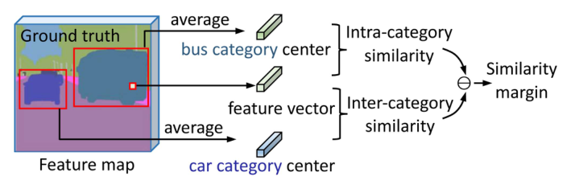
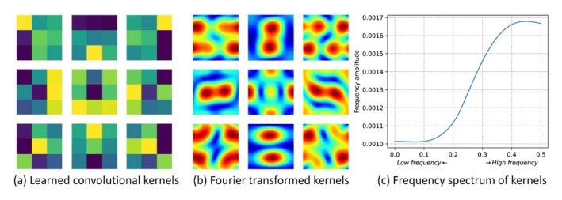
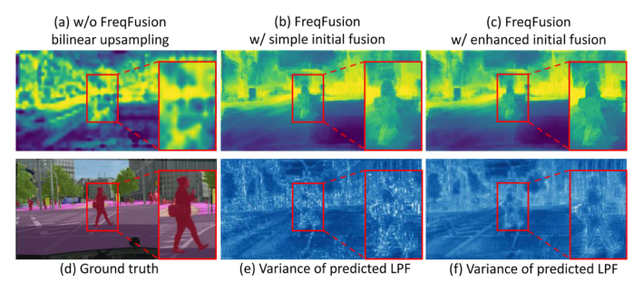
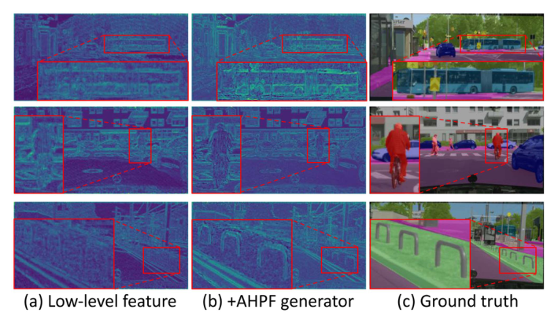
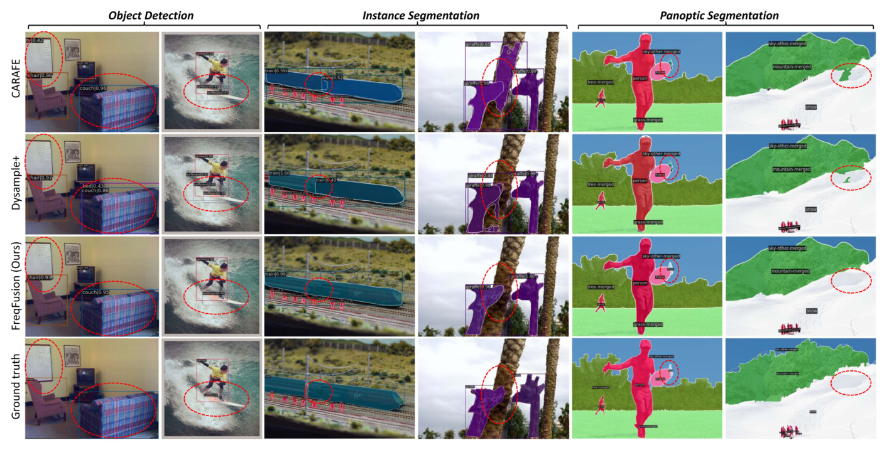
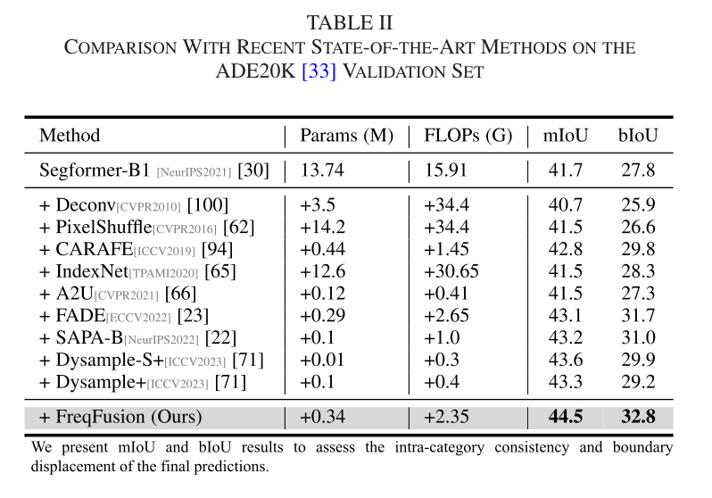
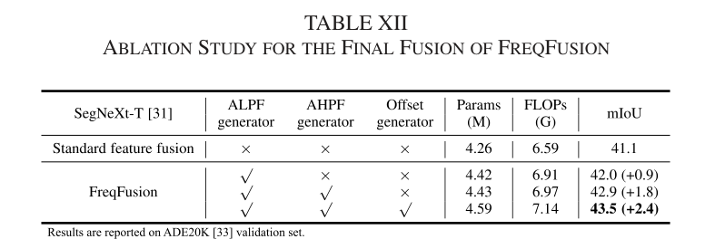
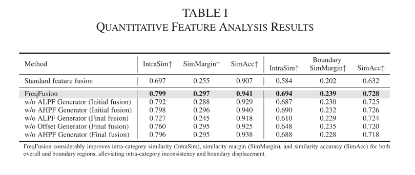
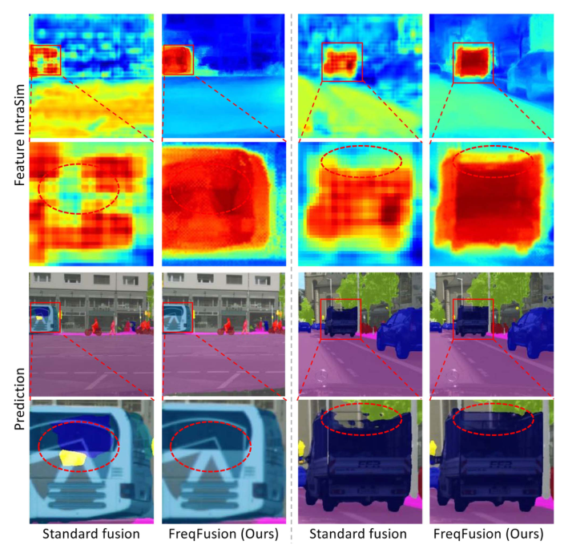

# Frequency-Aware Feature Fusion for Dense Image Prediction

Paper Reading 是从个人角度进行的一些总结分享，受到个人关注点的侧重和实力所限，可能有理解不到位的地方。具体的细节还需要以原文的内容为准，博客中的图表若未另外说明则均来自原文。

| 论文概况 | 详细 |
| --- | --- |
| 标题 | 《Frequency-Aware Feature Fusion for Dense Image Prediction》 |
| 作者 | Linwei Chen、Ying Fu、Lin Gu、Chenggang Yan、Tatsuya Harada、Gao Huang |
| 发表期刊 | IEEE Transactions on Pattern Analysis and Machine Intelligence |
| 期刊等级 | CCF-A |
| 发表年份 | 2024 |
| 论文代码 | [https://github.com/ying-fu/FreqFusion](https://github.com/ying-fu/FreqFusion) |

作者单位：

1. 北京理工大学复杂场智能感知工信部重点实验室、计算机学院（MIIT Key Laboratory of Complex-Field Intelligent Sensing, School of Computer Science and Technology, Beijing Institute of Technology）
2. 日本理化学研究所 AIP 与东京大学先端科学技术研究中心（RIKEN AIP; RCAST, University of Tokyo）
3. 杭州电子科技大学自动化学院（School of Automation, Hangzhou Dianzi University）
4. 清华大学自动化系（Department of Automation, Tsinghua University）

## 研究动机

密集图像预测是计算机视觉中的一类基础问题，表现为需要为图像中每个像素赋予预定义标签，涵盖语义分割、目标检测、实例分割与全景分割等任务，导致模型必须同时具备强类别信息与高分辨率的空间边界细节。现代层级式模型通过多级下采样逐步缩小特征尺寸，边界细节在这一过程中不可避免地被丢失，因此特征融合被广泛用于把上采样后的深层粗特征与浅层高分辨率特征相加或拼接。然而标准特征融合存在两个显著问题：一方面同一物体不同部位的纹理与外观差异巨大，双线性插值还会把单个不一致特征放大为多个不一致像素，加剧类内不一致；另一方面简单插值倾向于过度平滑特征，使边界模糊并产生边界位移，浅层特征中在下采样时丢失的高频边界细节也没有被充分利用。已有的核范式与采样范式改进融合方法多凭经验观察这些问题，缺乏清晰定义与定量测量。暂未有工作从频域视角把这两个问题统一建模，并在特征融合中同时获得类别一致性与边界锐度。

## 文章贡献

针对标准特征融合中的类内不一致与边界位移问题，本文提出了 FreqFusion，一个频率感知的特征融合方法。其核心是把这两个问题分别建模为物体内部受扰动的高频与边界处缺失的高频，并用三个生成器分别处理。首先自适应低通滤波器（ALPF）生成器预测空间变化的低通滤波器，在上采样的同时平滑高层特征、衰减物体内部高频；接着偏移生成器计算局部余弦相似度并朝高相似度方向预测重新采样偏移，用邻近的一致特征替换不一致特征；最终自适应高通滤波器（AHPF）生成器从低层特征中提取下采样永久丢失的高频细节并残差增强边界。本文还设计了类内相似度、相似度边际与相似度准确率三个指标定量测量上述两个问题。实验表明，FreqFusion 在 ADE20K 上提升 SegFormer-B1 达 2.8 mIoU，在 MS COCO 上提升 Faster R-CNN 达 1.8 AP，并在实例分割与全景分割上取得一致提升。

## 本文方法

### 特征相似度分析指标

特征相似度分析指标用于把类内不一致与边界位移转化为可定量测量的数值，为后续方法设计提供判据。类内相似度先对每个类别的特征取平均得到类别中心，再计算同类特征向量与类别中心的余弦相似度；类间相似度用相同方式计算，只是类别中心与特征向量来自不同类别，二者定义如下：

$$\mathrm{IntraSim}(Y^{cls=1}_{i,j}) = \mathrm{CosSim}\left(Y^{cls=1}_{i,j}, \frac{1}{|\Omega_{cls=1}|}\sum_{i,j \in \Omega_{cls=1}} Y_{i,j}\right), \quad \mathrm{InterSim}(Y^{cls=1}_{i,j}) = \mathrm{CosSim}\left(Y^{cls=1}_{i,j}, \frac{1}{|\Omega_{cls=0}|}\sum_{i,j \in \Omega_{cls=0}} Y_{i,j}\right)$$

| 符号 | 含义 |
| --- | --- |
| $Y_{i,j}$ | 位置 (i, j) 处的特征向量 |
| $\Omega_{cls=1}$ | 属于类别 1 的区域 |
| CosSim | 余弦相似度 |

相似度边际由类内相似度减去类间相似度得到，计算为：

$$\mathrm{SimMargin}(Y_{i,j}) = \mathrm{IntraSim}(Y_{i,j}) - \mathrm{InterSim}(Y_{i,j})$$

其中 SimMargin 为相似度边际，IntraSim 与 InterSim 分别为类内与类间相似度。此外把每个特征指派给与其最相似的类别中心并统计准确率，即相似度准确率。三个指标的含义如下图所示。

直观上，类内相似度越高、相似度边际越大，特征被误分类的风险越低；而边界位移正表现为边界区域类内相似度与相似度边际偏低。这套指标贯穿后文的方法设计与特征分析，是三个生成器的定量评价依据。

### FreqFusion 总体设计

FreqFusion 的总体设计是把标准融合的「上采样后相加」替换为初始融合与最终融合两阶段，并让三个生成器贯穿其中，整体结构如下图所示。

标准特征融合通常形式化为：

$$Y^l = F_{UP}(Y^{l+1}) + X^l$$

| 符号 | 含义 |
| --- | --- |
| $X^l$ | backbone 生成的第 l 层特征，尺寸为 C×2H×2W |
| $Y^{l+1}$ | 第 l 层的待融合高层特征，尺寸为 C×H×W |
| $F_{UP}$ | 上采样操作，如 2 倍最近邻或双线性插值 |

FreqFusion 则形式化为：

$$Y^l_{i,j} = \tilde{Y}^{l+1}_{i+u, j+v} + \tilde{X}^l_{i,j}, \quad \tilde{Y}^{l+1} = F_{UP}(F_{LP}(Y^{l+1})), \quad \tilde{X}^l = F_{HP}(X^l) + X^l$$

| 符号 | 含义 |
| --- | --- |
| $F_{LP}$ | ALPF 生成器预测的低通滤波器 |
| $(u, v)$ | 偏移生成器为坐标 (i, j) 预测的偏移值 |
| $F_{HP}$ | AHPF 生成器预测的高通滤波器 |

这等价于在相加之前先对高层特征做自适应平滑与重新采样、对低层特征做高频增强。为了高效地生成滤波器与偏移，需要先把 $X^l$ 与 $Y^{l+1}$ 压缩融合为生成器的输入，即初始融合，计算为：

$$Z^l = F_{UP}(\mathrm{Conv}_{1\times1}(Y^{l+1})) + \mathrm{Conv}_{1\times1}(X^l)$$

其中 $Z^l$ 是融合压缩特征，尺寸为 C/r×2H×2W；r 为通道压缩率，用于降低三个生成器的计算成本。$Z^l$ 是三个生成器的共同输入，生成器的输出分别作用于最终融合的上采样、重新采样与低层增强环节。

### 初始融合的增强

初始融合的增强用于给三个生成器提供更高质量的压缩融合特征 $Z^l$。简单的初始融合有两个次优点：用简单插值上采样压缩特征会带来模糊边界；而频率分析显示 ALPF 生成器高度依赖融合压缩特征中的高频信息，传统卷积层却只能捕获固定的高频模式。对应的两处改进如下图所示。

上采样环节改用 ALPF 生成器：以压缩后的低层特征为输入生成初始低通滤波器，用来上采样压缩后的高层特征，利用低层的高分辨率结构引导上采样，避免简单插值。高频增强环节改用 AHPF 生成器：作为动态组件从特征图中提取高频成分，克服固定卷积核只能捕获固定高频模式的限制。初始融合的可视化对比如下图所示。

对比 (a) 与 (b)，FreqFusion 恢复了更多细节特征；加入增强初始融合后 (c) 的边界更清晰，(e) 与 (f) 中预测低通滤波器的标准差也显示 (f) 对边界的保持更有效。增强后的初始融合让后续生成器更好地适应特征内容，其输出 $Z^l$ 送入最终融合阶段的三个生成器。

### 自适应低通滤波器生成器

ALPF 生成器用于预测动态低通滤波器，平滑高层特征以缓解特征不一致，并顺带完成上采样。它综合利用高层与低层特征的优势，以初始融合的 $Z^l$ 为输入预测空间变化的低通滤波器，由一个 3×3 卷积层加 softmax 层构成，计算为：

$$\bar{V}^l = \mathrm{Conv}_{3\times3}(Z^l), \quad \bar{W}^{l,p,q}_{i,j} = \mathrm{Softmax}(\bar{V}^l_{i,j}) = \frac{\exp(\bar{V}^{l,p,q}_{i,j})}{\sum_{p,q \in \Omega} \exp(\bar{V}^{l,p,q}_{i,j})}$$

| 符号 | 含义 |
| --- | --- |
| $\bar{V}^l$ | 空间变化的滤波器权重，尺寸为 K̄²×2H×2W |
| $\bar{K}$ | 低通滤波器的核尺寸 |
| $\Omega$ | K̄×K̄ 的邻域范围 |

逐核的 softmax 把滤波器约束为全正且和为一，从而保证结果是平滑的低通滤波器。上采样采用子像素方式：把 $\bar{W}^l$ 按 pixel unshuffle 方式重排，高宽减半、通道扩 4 倍并分成 4 组，每组对应一个子像素位置的空间变化低通滤波器，滤波后再重排为 2 倍上采样特征，计算为：

$$\tilde{Y}^{l+1,g}_{i,j} = \sum_{p,q \in \Omega} \bar{W}^{l,g,p,q}_{i,j} \cdot Y^{l+1}_{i+p,j+q}, \quad \tilde{Y}^{l+1} = \mathrm{PixelShuffle}(\tilde{Y}^{l+1,1}, \tilde{Y}^{l+1,2}, \tilde{Y}^{l+1,3}, \tilde{Y}^{l+1,4})$$

其中 g 为滤波器分组编号，取 1 至 4。加入 ALPF 生成器后，整体类内相似度由 0.727 提升至 0.799，相似度边际由 0.245 提升至 0.297，相似度准确率由 0.918 提升至 0.941。类内相似度的可视化对比如下图所示。

双线性上采样结果在车身内部与边界处都有严重的不一致与位移，加入 ALPF 生成器后内部一致性增强、边界变锐。ALPF 的输出送入偏移生成器做重新采样，并参与最终融合；它同时承担初始融合中的上采样职责。

### 偏移生成器

偏移生成器用于修正 ALPF 难以处理的大面积不一致特征与细薄边界区域：增大低通滤波器尺寸有利于大面积不一致区域却损害细薄边界，减小尺寸则相反，偏移生成器正是为化解这一矛盾而设。其动机是低类内相似度的特征往往拥有高类内相似度的邻居，因此先计算局部余弦相似度：

$$S^{l,p,q}_{i,j} = \frac{\sum_{c=1}^{C} Z^l_{c,i,j} \cdot Z^l_{c,i+p,j+q}}{\sqrt{\sum_{c=1}^{C} (Z^l_{c,i,j})^2} \sqrt{\sum_{c=1}^{C} (Z^l_{c,i+p,j+q})^2}}$$

其中 S 的尺寸为 8×H×W，记录每个像素与其 8 邻域像素的余弦相似度，引导偏移生成器朝高类内相似度方向采样。偏移生成器以 $Z^l$ 与 S 为输入，用两个 3×3 卷积层分别预测偏移方向与偏移尺度，计算为：

$$O^l = D^l \cdot A^l, \quad D^l = \mathrm{Conv}_{3\times3}(\mathrm{Concat}(Z^l, S^l)), \quad A^l = \mathrm{Sigmoid}(\mathrm{Conv}_{3\times3}(\mathrm{Concat}(Z^l, S^l)))$$

| 符号 | 含义 |
| --- | --- |
| $D^l$ | 偏移方向，尺寸为 2G×H×W |
| $A^l$ | 偏移幅度，尺寸为 2G×H×W |
| $O^l$ | 高层特征每个像素的最终预测偏移 |
| G | 偏移分组数，组间共享采样集 |

预测偏移的可视化如下图所示。

在公交车与汽车的內边界处，偏移指向特征更一致、更清晰的内部位置；外边界处偏移则指向相反方向，使边界更清楚。定量上，偏移生成器把类内相似度由 0.760 提升至 0.799，整体相似度准确率由 0.925 提升至 0.941，边界处由 0.720 提升至 0.728。偏移最终作用于 ALPF 平滑后的特征，通过重新采样输出到最终融合。

### 自适应高通滤波器生成器

AHPF 生成器用于恢复低层特征在下采样中永久丢失的高频边界细节。根据 Nyquist-Shannon 采样定理，高于 Nyquist 频率（采样率的一半）的频率在下采样中永久丢失：例如高层特征相对低层特征 2 倍下采样时（步长为 2 的 1×1 卷积，采样率为 1/2），高于 1/4 的频率会发生混叠。用离散傅里叶变换把特征图 X 变换到频域，定义如下：

$$X^F(u, v) = \frac{1}{HW}\sum_{h=0}^{H-1}\sum_{w=0}^{W-1} X(h, w) e^{-2\pi j (uh + vw)}$$

| 符号 | 含义 |
| --- | --- |
| $X^F$ | DFT 输出的复数数组 |
| H、W | 特征图的高与宽 |
| $\lvert u \rvert$、$\lvert v \rvert$ | 高与宽方向的归一化频率 |

高于 Nyquist 频率的高频集合在下采样后的高层特征中被混叠并永久丢失。AHPF 生成器以 $Z^l$ 为输入预测空间变化的高通滤波器，由 3×3 卷积、softmax 与滤波器取反三步构成，计算为：

$$\hat{V}^l = \mathrm{Conv}_{3\times3}(Z^l), \quad \hat{W}^{l,p,q}_{i,j} = E - \mathrm{Softmax}(\hat{V}^l_{i,j}) = E_{p,q} - \frac{\exp(\hat{V}^{l,p,q}_{i,j})}{\sum_{p,q \in \Omega} \exp(\hat{V}^{l,p,q}_{i,j})}$$

其中 E 是单位核，当 K̂ = 3 时其权重为 [[0, 0, 0], [0, 1, 0], [0, 0, 0]]；先用逐核 softmax 得到低通核，再用单位核减去它即反转为高通核。应用高通滤波器并残差相加后得到增强结果：

$$\tilde{X}^l_{i,j} = X^l_{i,j} + \sum_{p,q \in \Omega} \hat{W}^{l,p,q}_{i,j} \cdot X^l_{i,j}$$

低层特征的增强效果如下图所示。

原始特征对公交车轮廓与人头细节的刻画都不清晰，加入 AHPF 生成器后这些边界细节显著改善。定量频率分析如下图所示。

频谱曲线显示 AHPF 生成器增强了 Nyquist 频率以上的高频功率；Table I 中边界相似度边际由 0.228 提升至 0.239、边界相似度准确率由 0.718 提升至 0.728，说明其确实缓解了边界位移。AHPF 的输出残差加回低层特征后参与最终融合，同时也用于初始融合的高频增强。

## 实验结果

### 实验设置

语义分割在 Cityscapes（19 类，5000 张 2048×1024 精细标注图像，训练 / 验证 / 测试为 2975 / 500 / 1525 张）、ADE20K（150 类，训练 / 验证 / 测试为 20210 / 2000 / 3352 张）与 COCO-Stuff（172 类，共 164k 张）上进行，指标为 mIoU 与 bIoU；目标检测、实例分割与全景分割在 MS COCO（80 类）上进行，指标分别为 AP 系列、box AP 与 mask AP、PQ / SQ / RQ，并报告参数量、GFLOPs 与 FPS。分割训练使用 AdamW、初始学习率 0.00006 与 poly 衰减策略，ADE20K 与 Cityscapes 训练 160K 迭代、COCO-Stuff 训练 80K 迭代；检测系列任务基于 mmdetection 的 1×（12 个 epoch）配置，仅修改 FPN 中的特征融合阶段。对融合 4 倍、8 倍、16 倍、32 倍特征的 SegFormer 与 Mask2Former 使用 3 个 FreqFusion 模块，对融合 8 倍、16 倍、32 倍特征的 SegNeXt 使用 2 个。

### 定性效果对比

Cityscapes 验证集上 SegNeXt 与 FreqFusion 的分割对比如下图所示。

基线 SegNeXt 把交通标志杆误分割为背景、把卡车与围栏混淆，FreqFusion 的预测与真值更接近且区域内部更一致。COCO 验证集上的检测对比如下图所示。

相对表现最好的两个对比方法 CARAFE 与 Dysample，FreqFusion 在细小物体与遮挡区域的预测更准确、更一致，可见特征一致性与边界锐度的改善直接转化为预测质量的提升。

### 定量对比

ADE20K 验证集上与近期先进方法的对比如下表所示。

以 SegFormer-B1 为分割模型时，FreqFusion 取得 44.5 mIoU 与 32.8 bIoU，比基线高 2.8 mIoU，比第二名 Dysample-S+ 高 1.2 mIoU，而参数量仅增加 0.34 M、FLOPs 仅增加 2.35 G；与 Mask2Former 结合时在 Cityscapes 上提升 1.4 mIoU，用 ResNet-50 即超过使用 ResNet-101 的 Mask2Former 0.4 mIoU，在 Mask2Former Swin-B/L 上也有 +1.4 / +0.7 mIoU 的提升。在 MS COCO 上，FreqFusion 为 Faster R-CNN-R50 带来 1.9 AP 提升、领先第二名 Dysample+ 0.7 AP，为 Mask R-CNN-R50 带来 1.7 box AP 与 1.3 mask AP 提升，为 Panoptic FPN-R50 带来 2.5 PQ 提升、领先 Dysample+ 1.2 PQ，表明其在四类密集预测任务上都稳定优于核范式与采样范式的融合方法。效率方面，与 SegNeXt 结合时 FreqFusion 的 FPS 为 23.0，接近最快的 Dysample 的 25.9，但提升幅度为 +2.4 mIoU 对 +1.1 mIoU。

### 消融实验

ADE20K 上最终融合阶段的组件消融如下表所示。

以 SegNeXt-T 的 41.1 mIoU 为基线，单独加入 ALPF 生成器提升 0.9 mIoU，再加入 AHPF 生成器达到 42.9（+1.8），三个生成器齐备时达到 43.5（+2.4），说明三者分别应对类内不一致与边界位移且存在协同效应。滤波器核尺寸消融显示，K̄ 由 3 增至 5 再带来 1.0 mIoU 提升，而 K̂ 由 3 增至 5 使 mIoU 由 42.9 降至 42.4，故取 K̄ = 5、K̂ = 3；偏移分组数取 4 时 mIoU 最高（43.5），继续增加分组无明显收益；初始融合阶段单独使用 ALPF 生成器提升 0.3 mIoU，ALPF 与 AHPF 共同增强时达到 43.5。

### 特征相似度分析

融合特征的定量特征分析结果如下表所示。

标准特征融合的 IntraSim、SimMargin、SimAcc 为 0.697、0.255、0.907，边界区域为 0.584、0.202、0.632；FreqFusion 把整体提升至 0.799、0.297、0.941，边界区域提升至 0.694、0.239、0.728。去掉任一生成器后相应指标回落，例如去掉最终融合的 AHPF 生成器时边界相似度边际降至 0.228，可见三个生成器各自对应一致性或边界位移的改善。

### 可视化分析

标准融合与 FreqFusion 的融合特征可视化如下图所示。

FreqFusion 的融合特征内部更一致、边界更锐利，红框放大区域的差异尤其明显。类内相似度与预测结果的端到端可视化如下图所示。

标准融合在物体内部与边界处的 IntraSim 偏低，预测随之出现碎片与边界漂移；FreqFusion 的特征一致性显著提高、边界清晰，预测也更一致、更细，验证了频率感知融合对两个目标问题的同时改善。

## 优点和创新点

个人认为，本文有如下一些优点和创新点可供参考学习：

1. 用频域视角统一特征融合的两个经验性问题，把类内不一致与边界位移分别建模为受扰动的高频与缺失的高频，并设计特征相似度分析指标给出定量定义，使方法动机可测量、可复查。
2. 三个生成器分工协同，ALPF 以空间变化低通滤波器平滑、偏移生成器以局部相似度引导重新采样、AHPF 残差补充下采样丢失的高频，消融中逐步涨点且组合收益大于单件之和。
3. 作为即插即用的融合模块，在 SegNeXt、SegFormer、Mask2Former 等 CNN 与 Transformer 架构上一致涨点，参数与计算开销极小，工程可用性高。
