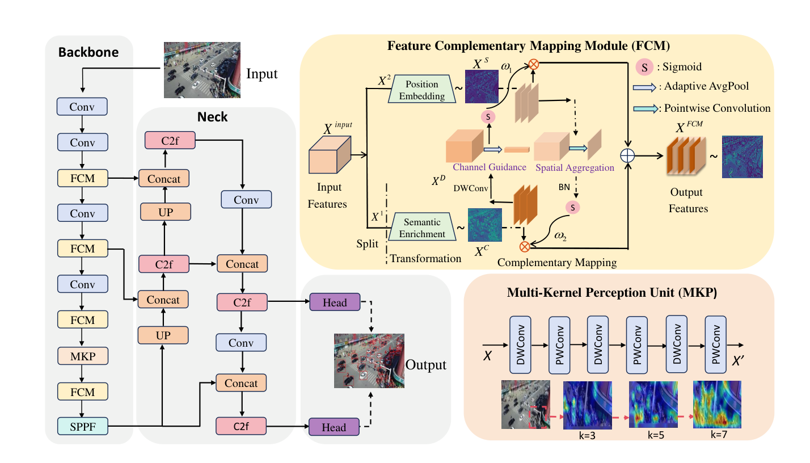
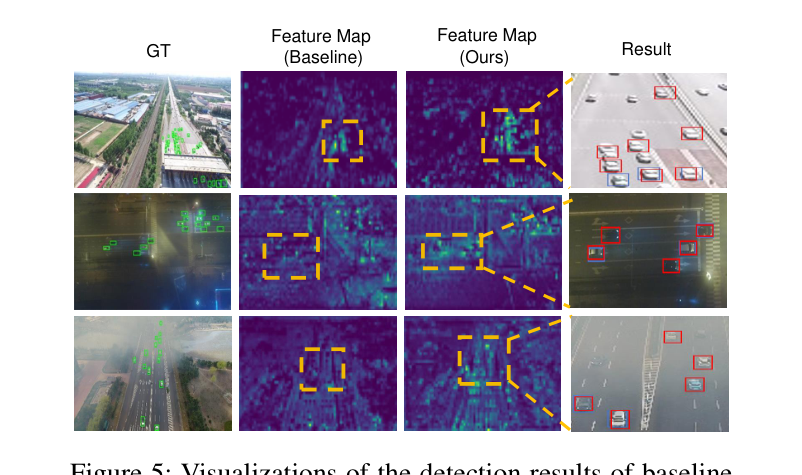
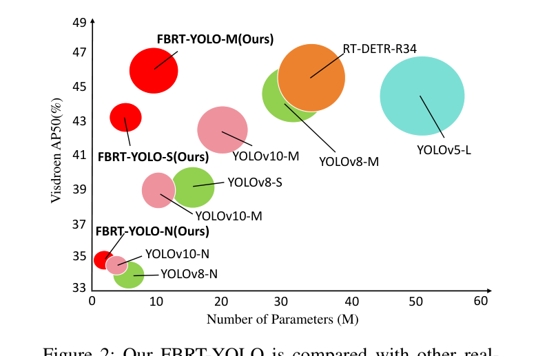
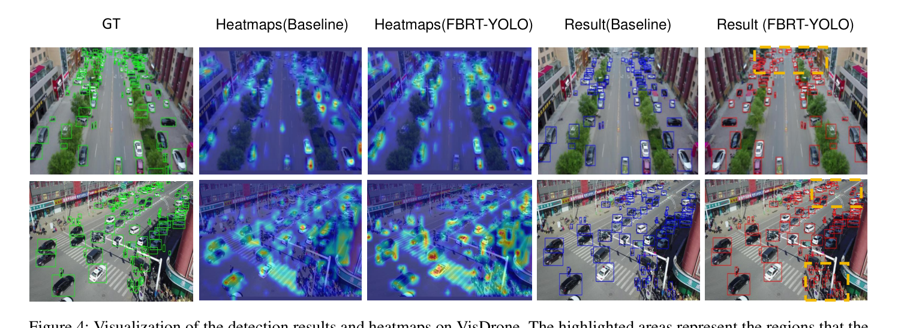

# FBRT-YOLO: Faster and Better for Real-Time Aerial Image Detection

Paper Reading 是从个人角度进行的一些总结分享，受到个人关注点的侧重和实力所限，可能有理解不到位的地方。具体的细节还需要以原文的内容为准，博客中的图表若未另外说明则均来自原文。

| 论文概况 | 详细 |
| --- | --- |
| 标题 | 《FBRT-YOLO: Faster and Better for Real-Time Aerial Image Detection》 |
| 作者 | Yao Xiao、Tingfa Xu、Yu Xin、Jianan Li |
| 发表会议 | AAAI |
| 会议等级 | CCF-A |
| 发表年份 | 2025 |
| 论文代码 | [https://github.com/galaxy-oss/FCM](https://github.com/galaxy-oss/FCM) |

作者单位：

1. 北京理工大学（Beijing Institute of Technology）

## 研究动机

航拍图像实时检测是无人机低空视觉领域的重要问题，表现为需要在资源受限的机载嵌入式设备上对高分辨率图像中的小目标快速给出检测框，导致定位失败或速度不足会直接拖垮航拍巡检、交通监控等下游任务。现有方法虽然部分缓解了**小目标漏检**的难题，但仍有两类局限。其一是**深层语义与浅层空间信息失配**：提高输入分辨率是最直接的做法，却带来额外计算负担、损害实时性；FPN 一类的特征金字塔在颈部融合深浅特征，PANet 再补一条自底向上的路径，但骨干网络本身仍难以整合并保留浅层信息，只占几个像素的小目标在下采样中容易消失，造成空间语义不一致；IPG-Net 把图像金字塔嵌入骨干，整个过程又消耗大量计算资源。其二是**精度与效率失衡**：ClusDet、DMNet 依靠聚类或密度图裁剪增强小目标，推理时间长、检测效率低；QueryDet 用级联稀疏查询加速高分辨率特征推理，CEASC 引入上下文增强稀疏卷积，但轻量解耦头只是部分加速网络，在高分辨率航拍图像上做到真正实时仍很困难。暂未有工作在同一网络设计里同时解决骨干内的空间语义失配与航拍实时检测的精度效率失衡这两个瓶颈。

## 文章贡献

针对航拍图像检测中精度与效率失衡、深层网络丢失小目标空间信息的问题，本文提出了 FBRT-YOLO，一族覆盖 N 到 X 多种模型尺度的实时航拍检测器。其核心是两个轻量模块加一条冗余削减设计：特征互补映射模块 FCM 与多核感知单元 MKP。首先 FCM 嵌入骨干网络的每个 stage，把浅层空间位置信息隐式编码进高维向量，与深层语义特征做互补映射，缓解下采样造成的信息失衡、改善小目标定位；接着 MKP 替换骨干最后一个下采样层，用不同尺寸卷积核串接逐点卷积增强多尺度目标感知，同时删去对应尺度的冗余检测头；最终把下采样解耦为「先分组卷积做空间下采样、再逐点卷积做通道扩张」，进一步压缩参数与计算量。实验表明，FBRT-YOLO 在 VisDrone、UAVDT 与 AI-TOD 三个航拍数据集上的性能与速度均超过多种主流实时检测器，实现了精度与效率的高度平衡。

## 本文方法

### 整体架构

FBRT-YOLO 以 YOLOv8 为基线，沿用 backbone-neck-head 三段式结构，全部改进集中在骨干网络。整体框架如下图所示。

骨干的每个 stage 之后嵌入一个 FCM，把空间位置信息逐步注入更深层的语义特征；第四个（最后一个）stage 用 MKP 替换原下采样层，并相应减少一个检测头；颈部仍是上采样、Concat 与 C2f 的标准组合，SPPF 位于骨干末端。各组件的分工如下表所示。

| 组件 | 模块 | 功能 |
| --- | --- | --- |
| Backbone | Conv/C2f + FCM × 4 + MKP | 特征提取，逐层注入空间信息，末层多尺度感知 |
| Neck | UP + Concat + C2f | 多尺度特征融合 |
| Head | 缩减后的检测头 | 输出检测结果（去掉 MKP 替换层对应的头） |
| 轻量化设计 | RR 冗余削减 | 解耦下采样与通道扩张，压缩参数与计算 |

骨干输出的多尺度特征经颈部融合后送入剩余检测头，FCM 与 MKP 的产物都在骨干内部完成，对颈部与头部透明。

### 通道分割与方向变换

FCM 的目标是把低层空间信息隐式编码进高维向量并传到网络深层，让检测器捕获更强的结构信息，其流程为分割、变换、互补映射与特征聚合四步。输入特征 $X_{input} \in \mathbb{R}^{C \times H \times W}$ 先按通道分割为两支，分割公式如下：

$$(X_1, X_2) = \mathrm{Split}(X_{input})$$

其中 $X_1 \in \mathbb{R}^{\alpha C \times H \times W}$、$X_2 \in \mathbb{R}^{(1-\alpha)C \times H \times W}$，$\alpha$ 为分割比例且 $0 \le \alpha \le 1$。$\alpha$ 的取值相当关键：随着网络加深，携带低层空间信息的分支应愈发突出，在合适的时机增强低层信息的获取才能提升性能，最优配置在实验节给出。分割后的两支进入方向变换，变换过程表示为：

$$(X_C, X_S) = \phi_1(X_1, X_2)$$

其中 $\phi_1$ 表示学习空间与语义信息之间映射关系的变换：$X_1$ 走标准 3×3 卷积分支，在每个通道上提取更丰富的特征，得到含丰富通道信息的 $X_C \in \mathbb{R}^{C \times H \times W}$；$X_2$ 走逐点卷积分支，由于逐点卷积提取的信息相对较弱，大量浅层空间位置信息被保留下来，得到 $X_S \in \mathbb{R}^{C \times H \times W}$。直观上，一路强化语义、一路保守存空间，为后续交叉映射准备了两股互补的特征流。

### 互补映射：通道交互与空间交互

此时得到的 $X_C$ 与 $X_S$ 虽各自有效却是离散的，容易造成目标特征匹配不准，互补映射用于让二者互相补偿各自缺失的特征。通道交互把通道信息更丰富的 $X_C$ 送入交互路：先用深度卷积逐通道卷积、切断通道间信息，计算为：

$$X_i^D = \phi_2(k_i, X_i^C)$$

其中 $\phi_2$ 表示对每个特征层通道的映射；$k_i$ 为第 $i$ 个卷积核；$X_i^C$、$X_i^D$ 分别为第 $i$ 个输入通道与对应的单个输出通道，深度卷积输出 $X^D \in \mathbb{R}^{C \times H \times W}$。接着做全局平均池化获取每个通道的全局信息，最后经 Sigmoid 得到关键信息权重，通道权重 $\omega_1 \in \mathbb{R}^{C \times 1 \times 1}$ 表示为：

$$\omega_1 = R\left(\frac{1}{H \times W}\sum_{i=0}^{H}\sum_{j=0}^{W} X^D(i, j)\right)$$

其中 $R$ 代表激活函数。空间交互采用对称的简单设计，由 1×1 空间卷积层、BN 与 Sigmoid 构成，生成的空间信息权重计算为：

$$\omega_2 = R(F(X_S))$$

其中 $F$ 表示带空间聚合的卷积映射，$\omega_2 \in \mathbb{R}^{1 \times H \times W}$ 即空间注意力图。直观上，通道交互给每个通道的重要信息分配独有权重后映射到保留低层空间信息的 $X_S$ 分支，空间交互给每个位置的重要信息分配独有权重后映射到通道信息丰富的 $X_C$ 分支，实现「强者引导弱者」的互补融合，两路输出共同进入特征聚合。

### 特征聚合

特征聚合用于把两组权重分别乘回对方分支并拼接，得到兼具空间与语义双重映射的特征，计算为：

$$X_{FCM} = (X_C \otimes \omega_2) \oplus (X_S \otimes \omega_1)$$

其中 $\otimes$ 为逐元素相乘，$\oplus$ 为两支特征的拼接。这等价于用语义显著性重加权空间分支、用空间显著性重加权语义分支后再合流。FCM 整体以较低的计算开销完成信息互补融合，其输出流向下一 stage 的卷积，使浅层空间位置信息在骨干下采样过程中被逐层传递而非丢失。

### 多核感知单元

MKP 用于在骨干末端充分挖掘有限的小目标特征：航拍小目标常被背景噪声淹没，单一感受野难以兼顾细节与上下文。MKP 把不同大小的卷积核依次串接，并在不同尺度核之间插入逐点卷积，整个过程数学表示为：

$$X' = T_{2k+1}(A(\cdots A(T_k(X))\cdots))$$

| 符号 | 含义 |
| --- | --- |
| $X$ | 输入的局部特征 |
| $X'$ | 跨多尺度全局映射后的特征 |
| $T_k$ | 卷积核大小为 $k$ 的深度卷积，实验中取 $k = 3$ 起步 |
| $A$ | 逐点卷积变换 |

直观上，感受野沿 3、5、7 的核逐级扩张，中间穿插的逐点卷积负责跨尺度整合空间信息。MKP 替换骨干最后一个下采样层的同时删去对应检测头，既实现多尺度目标感知，又进一步简化网络结构，其输出直接接 SPPF 与颈部。

### 面向冗余削减的网络设计

RR 设计用于削减基线中不适合高分辨率航拍检测的结构冗余。现有实时检测模型主要面向低分辨率图像，特征提取的空间下采样走「通道扩张在前、深度卷积采样在后」的路线，深度卷积之后通道间相互干扰，造成空间信息损失。本文把这一过程解耦：先用分组卷积完成空间下采样，再用逐点卷积做通道扩张。两种方案的参数量分别计算为：

$$P' = 3 \times 3 \times C_1 \times C_2$$

$$P = 3 \times 3 \times C_1 \times \frac{C_1}{g} + 1 \times 1 \times C_1 \times C_2$$

| 符号 | 含义 |
| --- | --- |
| $P'$ | 标准卷积方案的参数量 |
| $P$ | 本文方案的参数量 |
| $C_1$、$C_2$ | 输入与输出通道数，下采样时通常 $C_2 = 2C_1$ |
| $g$ | 分组卷积的组数 |

给出一个简单的例子，假设某下采样层输入通道 $C_1 = 128$、输出通道 $C_2 = 256$（满足翻倍惯例）、组数 $g = 4$。1. 标准卷积参数量 $P' = 3 \times 3 \times 128 \times 256 = 294912$；2. 本文方案先分组卷积下采样 $3 \times 3 \times 128 \times 32 = 36864$，再逐点卷积扩张 $1 \times 1 \times 128 \times 256 = 32768$，合计 $P = 69632$；3. 二者之比约为 23.6%。可以看到，仅调整下采样与通道扩张的先后顺序，就能把该层参数开销压到约四分之一，且空间下采样在组内完成、避免跨通道干扰。RR 作用于骨干各 stage 的下采样路径，与 FCM、MKP 共同构成完整模型。

## 实验结果

### 实验设置

本文在 VisDrone、UAVDT 与 AI-TOD 三个航拍目标检测基准上评测，数据集特点如下表所示。

| 数据集 | 特点 |
| --- | --- |
| VisDrone | 高分辨率航拍，目标小且密集 |
| UAVDT | 含低光照与相似背景的复杂场景 |
| AI-TOD | 小目标占比显著 |

评测指标为 AP、AP50、AP75、Params、FLOPs 与 FPS。除推理速度在单块 RTX 3080 上测试外，其余实验均在 NVIDIA GeForce RTX 4090 上完成；网络训练 300 个 epoch，优化器为 SGD，动量 0.937、权重衰减 0.0005、batch size 为 4、初始学习率 0.01。

### 定性效果对比

UAVDT 上低光照与相似背景条件下基线与本文方法的检测效果可视化如下图所示。

图中蓝框为基线模型的预测结果，红框为本文方法的预测结果。基线在弱光与背景雷同的区域出现漏检，本文方法把同一批目标补了回来，且特征图响应更集中于目标本身，表明把目标空间信息经网络层层传播的做法切实增强了复杂背景下的特征表示。

### 定量对比

VisDrone 上 FBRT-YOLO 与各主流实时检测器的对比如同一张精度-参数量散点图所示（圆半径代表 GFLOPs），完整数字见下表。

散点图中 FBRT-YOLO 的 N、S、M 三个尺度均落在同参数量级检测器的左上方，圆面积也更小，即以更少参数与 GFLOPs 取得更高的 VisDrone AP50。完整数字如下表所示。

小模型上 FBRT-YOLO-N/S 比 YOLOv8-N/S 参数量分别减少 72% 与 74%，AP 反而提高 0.6% 与 2.3%；中模型 FBRT-YOLO-M 比 YOLOv8-M 与 YOLOv9-M 的 GFLOPs 分别降低 26% 与 23%，AP 提高 1.3% 与 1.2%；大模型 FBRT-YOLO-X 比 YOLOv8-X 与 YOLOv10-X 参数少 66% 与 23%，AP 提高 1.2% 与 1.4%；FBRT-YOLO-M/L 相比 RT-DETR-R34/R50 参数更少、GFLOPs 更低、速度更快、精度更高，其中 FBRT-YOLO-N 以 0.9 M 参数跑出 192 FPS，说明各模型尺度上都拿到了更优的精度-效率折中。与 VisDrone 上小目标检测先进方法的对比如下表所示。

FBRT-YOLO 取得 30.1% 的 AP 与 31.7% 的 AP75，均高于 YOLC 的 28.9% 与 28.3%、CEASC 的 28.7% 与 28.4%，可见在严苛 IoU 阈值下本文的框回归质量更好。UAVDT 上与先进方法的对比如下表所示。

UAVDT 上本文以 18.4% 的 AP、31.1% 的 AP50 与 18.9% 的 AP75 全面超过 GLSAN 的 17.0% 与 CEASC 的 17.1%，说明复杂背景下的空间信息传播策略有效。AI-TOD 上与基线的对比如下表所示。

FBRT-YOLO-S 相比 YOLOv8-S 参数量减少 74%、GFLOPs 减少 20%，AP50 提高 2.2%、AP 提高 1.1%，FPS 从 131 升到 142，表明在小目标占比显著的数据集上轻量改进同样兑现为精度收益。

### 消融实验

以 YOLOv8-S 为基线，VisDrone 上 RR、FCM、MKP 三个组件的消融如下表所示。

单独启用 RR 后参数减少 18%、计算量下降 11%，精度仅有轻微回落；叠加 FCM 把 AP50 拉高 1.4% 并继续压低计算资源；再叠加 MKP 后 AP 提升 1.6%，最终 AP/AP50 达 25.9/42.4、参数只剩 2.9 M，说明冗余削减腾出的预算被两个感知模块转化成了精度。互补映射两种关系的最优配置验证如下表所示。

单用通道映射得 25.6/41.7，单用空间映射得 25.3/41.3，两者皆无时只有 25.0/40.4，双映射组合达到 25.9/42.4，比无映射配置 AP50 提升 2.0%，验证了「强者引导弱者」必须双向进行。分割比例 $\alpha$ 的影响如下表所示。

$\alpha$ 取 (0.75, 0.75, 0.25, 0.25) 时以 2.9 M 参数取得最优的 25.9/42.4，即随下采样推进、走逐点卷积的空间特征分支占比升高，与 FCM 在深层保留更多空间位置信息的设计初衷一致。MKP 卷积核大小的影响如下表所示。

核大小组合 (3, 5, 7) 优于 (3, 3, 3)、(5, 5, 5) 与 (7, 7, 7)，可见小核感受野受限、难以建立强上下文关联，大核引入显著背景噪声，递增核配逐点卷积才能兼顾多尺度关联与抗噪。

### 可视化分析

VisDrone 上基线与本文方法的检测结果与热力图可视化如下图所示，高亮区域代表网络关注的部分。

基线的热力图在密集小目标区域响应弥散，检测结果存在漏检；FBRT-YOLO 的热力图对小而密集的目标给出更集中的高亮响应，对应检测框也更完整，表明 FCM 与 MKP 增强了网络内部的空间与多尺度信息表达。

## 优点和创新点

个人认为，本文有如下一些优点和创新点可供参考学习：

1. 用信息互补映射的视角统一处理深层语义与浅层空间信息的失配问题，FCM 以通道分割加双向权重交互让强者引导弱者，把空间位置信息逐层送进骨干深层，消融显示 AP50 提升 2.0%。
2. 以 MKP 替换骨干最后一个下采样层，3、5、7 递增核串联逐点卷积增强多尺度感知，同时删去对应检测头简化结构，AP 再提升 1.6%，一举两得。
3. 实验覆盖 VisDrone、UAVDT、AI-TOD 三个航拍基准与 N 到 X 完整尺度族，FBRT-YOLO-N 以 0.9 M 参数达 192 FPS，工程可用性强、说服力强。
