# 基于 FMA-YOLOv12 的轨道交通密集行人检测算法

Paper Reading 是从个人角度进行的一些总结分享，受到个人关注点的侧重和实力所限，可能有理解不到位的地方。具体的细节还需要以原文的内容为准，博客中的图表若未另外说明则均来自原文。

| 论文概况 | 详细 |
| --- | --- |
| 标题 | 《基于 FMA-YOLOv12 的轨道交通密集行人检测算法》 |
| 作者 | 梁国华、史祥符、刘越、卢剑鸿、秦孝峰、贾拴航、张文韬 |
| 发表期刊 | 哈尔滨工业大学学报（网络首发） |
| 期刊等级 | EI 收录、北大核心 |
| 发表年份 | 2026 |
| 论文代码 | 未获取 |

作者单位：

1. 长安大学运输工程学院，西安 710064
2. 河北水利电力学院，河北沧州 061001
3. 西安市轨道交通集团有限公司，西安 710016

## 研究动机

行人检测是智能交通与安防监控领域的核心问题，在城市轨道交通站场中表现为对高密度人群的准确定位与实时分析，直接关系到乘客安全与运营效率。然而，站场场景普遍存在遮挡严重、目标尺度差异大、背景复杂与图像质量波动等现象，对检测算法提出持续挑战。从方法脉络看，以 Faster R-CNN、Cascade R-CNN 为代表的两阶段检测器定位稳定但计算复杂度高，难以满足站场监控的实时性需求；以 YOLO 系列为代表的单阶段检测器速度快，却在行人高度密集、相互遮挡时出现明显的漏检与误检。已有改进工作分别从不同侧面入手：有工作设计动态解耦检测头以增强多尺度行人的判别与定位，有工作用改进 RepVGG 模块替换卷积并增设检测头以缓解小目标漏检，还有工作引入 EMA 注意力与 Repulsion Loss 抑制密集人群的边界框重叠。但这些工作大多聚焦单一模块，多模块协同效率低下、复杂遮挡下细节特征丢失、多尺度特征融合机制不够灵活三个问题仍缺乏系统性的解决方案。在高密度站场中，严重遮挡与极端尺度变化相互叠加，现有模型在精度与效率的平衡上仍面临挑战，暂未有工作从边界框回归、浅层特征增强与多尺度特征融合三个层面进行联合改进。

## 文章贡献

针对上述局限，本文提出了 FMA-YOLOv12，其核心是在 YOLOv12 基线上沿损失函数、浅层特征提取与检测头三个层面做联合改进。首先以 Focal-EIOU 替换 CIOU 作为边界框回归损失，对重叠程度较低的候选框赋予更高优化权重，提升小尺度行人的定位精度；接着在浅层特征提取阶段引入 MambaVision 双分支结构，借助 SSM 路径与卷积分支增强模型对行人细节特征的感知能力与抗遮挡性能；最终将原检测头替换为自适应空间特征融合 ASFF 结构，实现多尺度特征的自适应加权融合并过滤背景干扰。本文还构建了一个包含 3,727 张标注图像的轨道交通专用数据集，覆盖多个站场区域与不同时段场景。实验表明，FMA-YOLOv12 在该数据集上的 mAP@0.5 达到 91.8%、F1 分数达到 85.0%，较 YOLOv12 分别提升 1.3 和 2.0 个百分点，而计算量基本保持不变。

## 本文方法

FMA-YOLOv12 沿「损失函数—骨干—检测头」的数据流展开改造，三个改进分别作用于训练损失、浅层特征提取与多尺度特征融合环节。

### YOLOv12 基线架构

YOLOv12 延续输入端、骨干网络、Neck 与输出端的经典四段式架构，是本文三处改进的替换载体。其骨干网络的分层递进结构如下图所示。

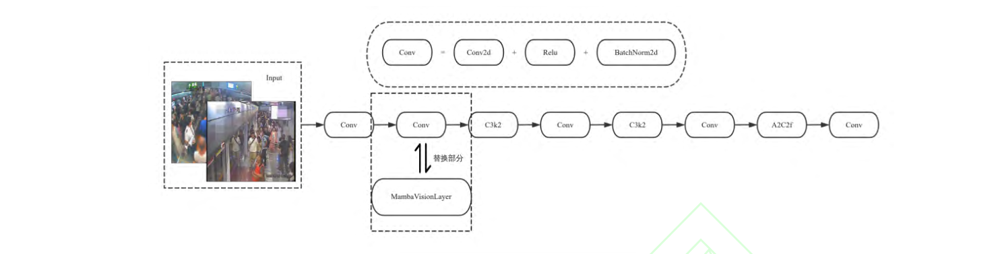

骨干中段引入 Area Attention 与 R-ELAN 平衡计算效率与特征表达，特征融合基于改进的 FPN+PAN 架构并整合 Flash Attention，通过去除位置编码、以卷积替代线性操作等精简设计提升效率，输出端经轻量化检测头生成预测。图中虚线框标出的 P2 阶段负责处理 1/4 分辨率特征图，承担小目标检测与细粒度边缘表征，传统 Conv 模块在该分辨率下难以建模长距离依赖，这为后文 MambaVision 的嵌入提供了位置；FPN/PAN 输出的多尺度特征则留给检测头一侧的 ASFF 改造。

### Focal-EIOU 边界框回归损失

Focal-EIOU 用于替换 CIOU，解决高密度遮挡场景下训练过程被大量简单样本主导的问题。Focal-EIOU 是 Focal Loss 与 EIOU Loss 结合的变体，其计算公式如下：

$$
\begin{aligned}
L_{\mathrm{Focal\text{-}EIOU}} &= \mathrm{IOU}^{\gamma} \cdot L_{\mathrm{EIOU}} \\
L_{\mathrm{EIOU}} &= 1 - \mathrm{IOU} + \frac{\rho^{2}(b, b^{gt})}{c^{2}} + \frac{\rho^{2}(w, w^{gt})}{C_{w}^{2}} + \frac{\rho^{2}(h, h^{gt})}{C_{h}^{2}}
\end{aligned}
$$

其中各符号的含义为：

| 符号 | 含义 |
| --- | --- |
| $\mathrm{IOU}$ | 预测框与真实框的交并比 |
| $\gamma$ | 调节因子，控制难易样本的权重分配 |
| $b$、$b^{gt}$ | 预测框、真实框的中心坐标 |
| $c$ | 预测框与真实框最小外接矩形的对角线长度 |
| $w$、$w^{gt}$ | 预测框、真实框的宽度 |
| $h$、$h^{gt}$ | 预测框、真实框的高度 |
| $C_w$、$C_h$ | 闭包矩形的宽度和高度 |
| $\rho$ | 欧氏距离函数 |

直观上，$\mathrm{IOU}^{\gamma}$ 作为焦点因子乘在 EIOU 损失之上：预测框与真实框重叠程度越低，该因子赋予困难样本的优化权重越高，背景与简单样本的贡献则被相应压低。该损失只替换 YOLOv12 损失体系中的边界框回归项，分类损失与置信度损失保持不变，其梯度直接作用于训练阶段的框回归分支。

### MambaVision 双分支浅层特征增强

MambaVision 被引入骨干网络的 P2 阶段，用于弥补传统卷积在高分辨率下对长距离依赖建模能力的不足。MambaVision 模型的体系结构如下图所示。

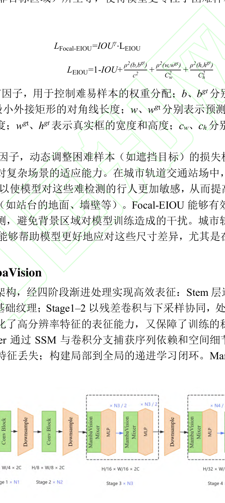

MambaVision 经四阶段渐进处理构建层级化表征：Stem 层通过连续卷积生成 1/2 分辨率特征；Stage 1–2 以残差卷积与下采样协同处理 1/4–1/8 分辨率特征；Stage 3–4 部署双分支交替结构，MambaVisionLayer 通过 SSM 与卷积分支分别捕获序列依赖和空间细节，MLP 增强非线性表征，双分支互补以规避信息冗余与特征丢失。本文在 P2 阶段将原生 Conv 模块替换为 MambaVisionLayer：SSM 路径以线性计算复杂度 O(n) 处理高分辨率特征图，高效捕获目标轮廓拓扑等序列依赖，避免自注意力机制的平方级开销；对称卷积分支通过深度卷积保留背景纹理等空间细节，缓解纯 SSM 路径易出现的局部特征流失。替换后的 P2 模块仍按原数据流向后级 C3k2 与 A2C2f 阶段输出，其细粒度特征随骨干特征进入 FPN/PAN 融合。

### ASFF 多尺度特征自适应融合

ASFF 模块通过网络动态生成空间权重图，对来自不同层级的特征做加权融合，取代简单的特征相加或拼接。自适应空间特征融合机制如下图所示。

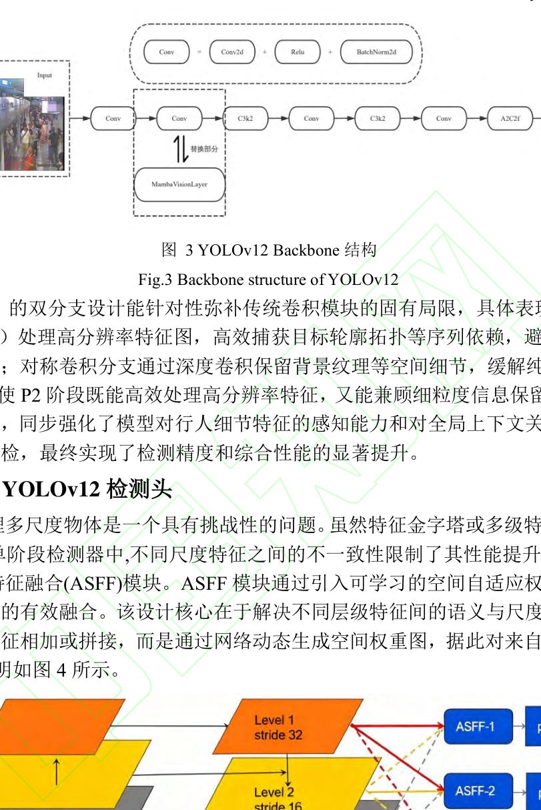

面向特征金字塔第 l 层级（l∈{1,2,3}），ASFF 按特征分辨率统一、空间权重学习、自适应加权融合三阶段生成优化后的特征图。阶段 1 先将非本层级的特征图调整至相同尺寸，上采样采用插值加 1×1 卷积对齐通道，下采样采用步长为 2 的 3×3 卷积，定义如下：

$$
x^{k \to l} = \begin{cases} U(x^{k}), & k < l \\ D(x^{k}), & k > l \\ x^{k}, & k = l \end{cases}
$$

其中 U 为上采样操作，D 为下采样操作，k 为来源特征层级。阶段 2 对每个对齐后的特征图学习空间自适应权重并做 Softmax 归一化，公式如下：

$$
\begin{aligned}
w^{k} &= F_{1\times1}(x^{k \to l}), \quad w^{k} \in \mathbb{R}^{H_l \times W_l \times 1} \\
\alpha_{ij}^{k} &= \frac{\exp(w_{ij}^{k})}{\sum_{m=1}^{3} \exp(w_{ij}^{m})}, \quad \sum_{k=1}^{3} \alpha_{ij}^{k} = 1
\end{aligned}
$$

其中 $F_{1\times1}$ 为 1×1 卷积后接 ReLU 激活函数；$\alpha_{ij}^{k}$ 为空间位置 (i, j) 处第 k 层特征的归一化权重，同一位置三个层级的权重之和恒为 1。阶段 3 按空间位置加权求和生成最终特征，定义如下：

$$
\begin{aligned}
\mathrm{ASFF}_{l} &= \sum_{k=1}^{3} \alpha_{k} \odot x^{k \to l} \\
\mathrm{ASFF}_{l}(i, j) &= \sum_{k=1}^{3} \alpha_{ij}^{k} \cdot x^{k \to l}(i, j)
\end{aligned}
$$

其中 ⊙ 表示逐元素乘法与广播机制。这等价于在每个空间位置学习一个自适应的特征筛选器：网络动态决定位置 (i, j) 对各层特征的依赖强度，从而抑制复杂背景等冲突性响应、提升特征的尺度不变性。由于权重生成仅依赖轻量级的 1×1 卷积，该模块在提升融合质量的同时保持了较低的推理成本，其输出直接供预测头使用。

### FMA-YOLOv12 整体架构

将上述三处改进叠加即得到完整的 FMA-YOLOv12 网络，改进后的模型架构如下图所示。

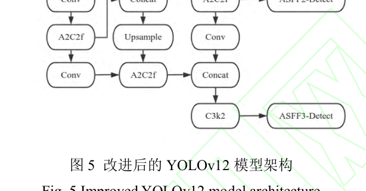

骨干中 Stem 层通过 2 个 3×3 卷积（步幅 2）配合 BN 与 SiLU 实现快速下采样与非线性增强；Stage1 依托 C3k2 模块堆叠 Bottleneck 提取局部特征，Stage2 引入 MambaVisionLayer，Stage3/4 以 C3k2 保障基础特征并结合 A2C2f 强化高层语义提取。检测环节中 ASFF 模块替代原始 Detect 头，对 FPN/PAN 输出的多尺度特征先经卷积对齐通道与分辨率，再学习空间权重并按权重融合，后续分设 ASFF1/2/3 检测头分别适配大、中、小目标。MambaVision 强化 P2 层细节建模，ASFF 动态平衡 P2 细粒度信息与 P3–P5 高级语义的融合占比，二者在计算效率上同样协同：前者为线性复杂度、后者仅用 1×1 卷积生成权重，共同保障模型在复杂场景下维持 25 FPS 的实时性。

### 组件对应与协同机制

下表给出各改进组件与网络位置的对应关系，便于与后文消融实验对照阅读。

| 组件 | 替换或作用位置 | 功能 |
| --- | --- | --- |
| Focal-EIOU | 边界框回归损失 | 聚焦难样本，提升低重叠候选框的回归精度 |
| MambaVisionLayer | 骨干 P2 阶段 | 双分支建模序列依赖与空间细节 |
| ASFF | 检测头（替代 Detect） | 多尺度特征的空间自适应加权融合 |

三个组件作用于训练与推理的不同环节：Focal-EIOU 只影响训练阶段的梯度分布，MambaVision 与 ASFF 则位于推理路径上但都控制了额外开销。三者分别对应后文消融实验中逐行勾选的三个开关，其单独与组合增益将在实验节给出。

## 实验结果

### 实验设置

自建数据集采集自某市 A、B 两个客流密集地铁站约 20 小时监控视频，按 20 s/帧的固定间隔采样，共提取有效图像 3,727 张，覆盖每帧少于 10 人的低密度到每帧超过 50 人的极高密度客流，并按 7:3 划分为训练集 2,964 张与验证集 763 张。A 站分帧后的行人图像如下图所示。

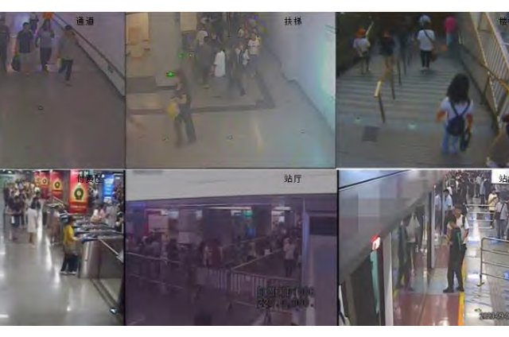

站厅、站台与付费区人流密度显著较高，通道、楼梯与扶梯区域则易形成复杂光影变化，为验证模型在光照干扰下的鲁棒性提供了典型场景。训练在 Pytorch 2.1.2、GPU 为 RTX3080Ti、CUDA 11.8 的环境下进行，初始学习率 0.01、动量 0.937、训练 100 轮、输入尺寸 640×640×3，关键超参数配置如下图所示。

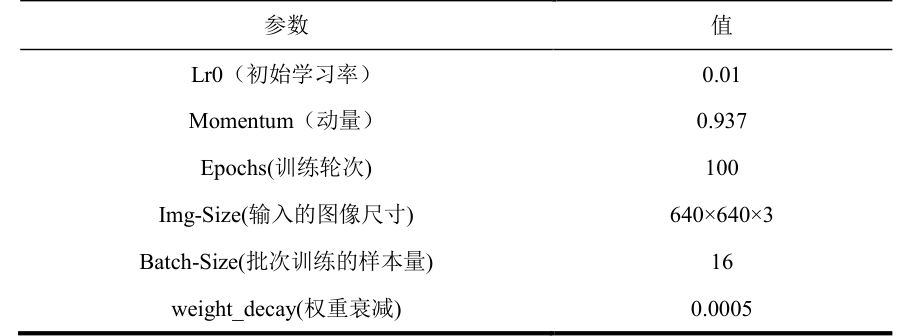

除表中所列参数外，其余网络设置均沿用官方仓库默认值。评价指标为 mAP@0.5、F1 分数、参数量与 FLOPs，其中精确率与召回率计算为 $Precision = \frac{TP}{TP+FP}$ 与 $Recall = \frac{TP}{TP+FN}$，F1 分数为二者的调和平均 $F1 = \frac{2(Precision \times Recall)}{Precision+Recall}$，mAP@0.5 为 IoU 阈值固定为 0.5 时各类别精度-召回曲线下面积对 M 个类别的算术平均 $mAP@0.5 = \frac{\sum_{m=1}^{M} \int_{0}^{1} P_m(R) dR}{M}$。

### 可视化分析

先定性后定量，下图展示了同一视频帧在改进前后的检测结果对比。

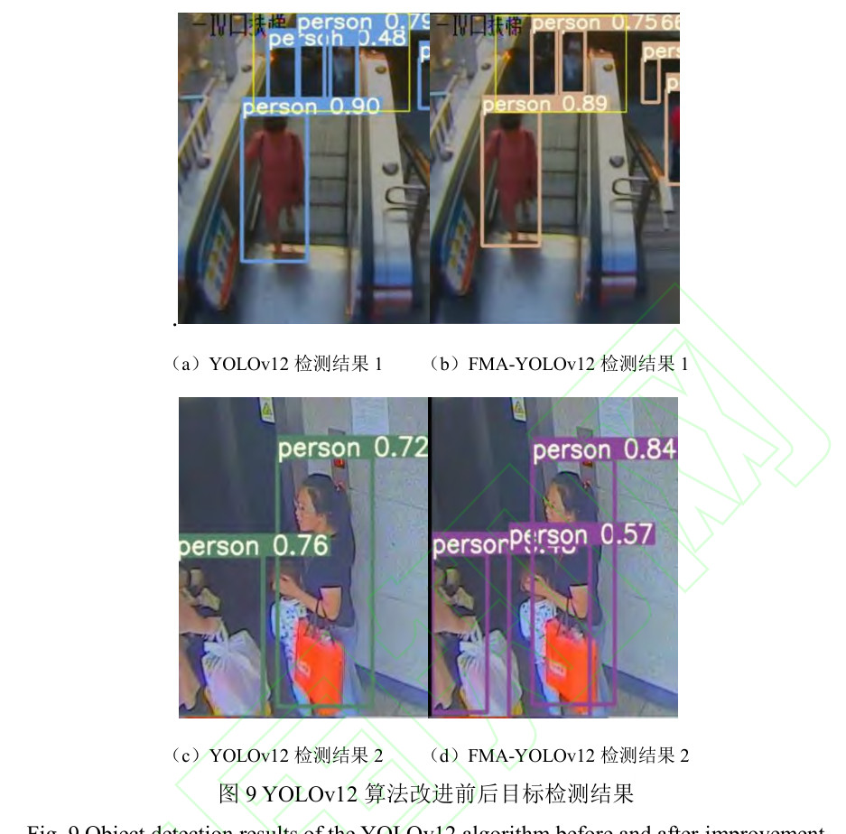

原始 YOLOv12 在该帧上存在 1 例误检与 1 例漏检：黄色框标注区域实际含 2 名行人，原算法将其误检为 3 名；图 (c) 中的儿童目标也未被有效检测。FMA-YOLOv12 不仅消除了上述误检，还准确识别出此前漏检的儿童目标。下图进一步给出检测结果及对应的 Heatmap 热力图。

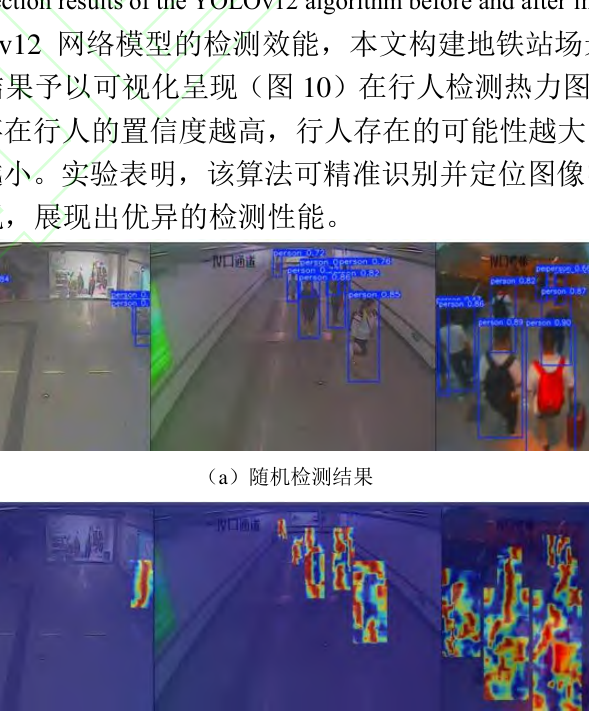

热力图中颜色越偏向红、橙、黄等暖色系，代表模型对该区域存在行人的置信度越高。可以看出改进后模型的响应集中在行人身体区域，地铁站场景下漏检、误检极少出现，与定量指标的提升方向一致。

### 对比实验

各目标检测方法在地铁站场数据集上的定量对比如下图所示。

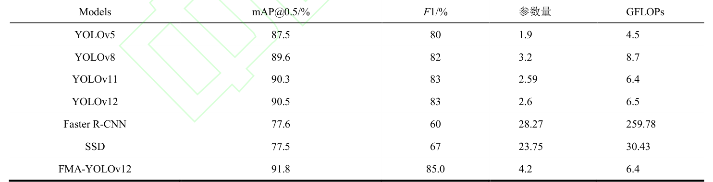

FMA-YOLOv12 的 mAP@0.5 达到 91.8%、F1 分数达到 85.0%，较基线 YOLOv12 分别高出 1.3 和 2.0 个百分点，也全面优于 YOLOv5、YOLOv8、YOLOv11、SSD 与 Faster R-CNN；参数量由 2.6 增至 4.2 的同时 GFLOPs 由 6.5 降至 6.4，说明三处改进以基本不变的计算量换来了精度增益。各方法的 mAP@0.5 曲线对比如下图所示。

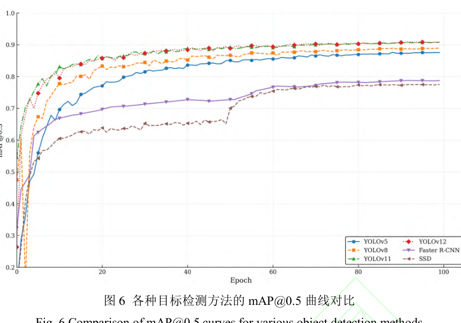

FMA-YOLOv12 的曲线在训练全程位于其余方法之上，与定量表的结论互相印证。

### 消融实验

三个组件的消融结果如下图所示。

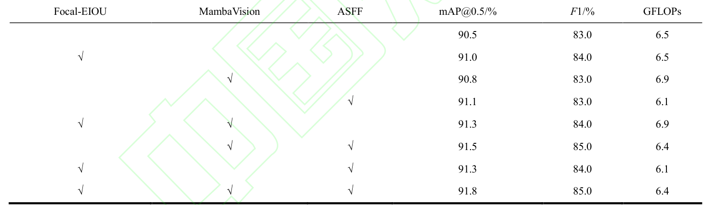

单独引入 Focal-EIOU、MambaVision、ASFF 时 mAP@0.5 分别提升至 91.0%、90.8%、91.1%，两两组合进一步提升至 91.3%–91.5%，三者齐备时达到 91.8% 且 F1 分数为 85.0%、GFLOPs 为 6.4，可见三个模块的贡献是协同叠加而非简单罗列。改进前后的 mAP@0.5 曲线如下图所示。

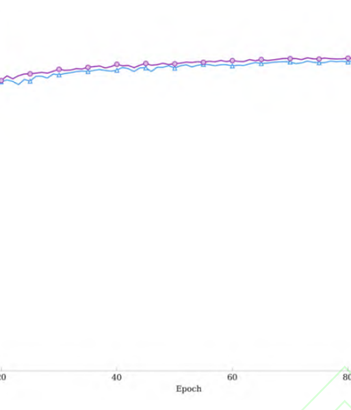

训练前几轮改进前后的 mAP@0.5 较为接近，随轮数增加改进模型在更早的轮数达到较高精度。模型改进前后的边界框损失对比如下图所示。

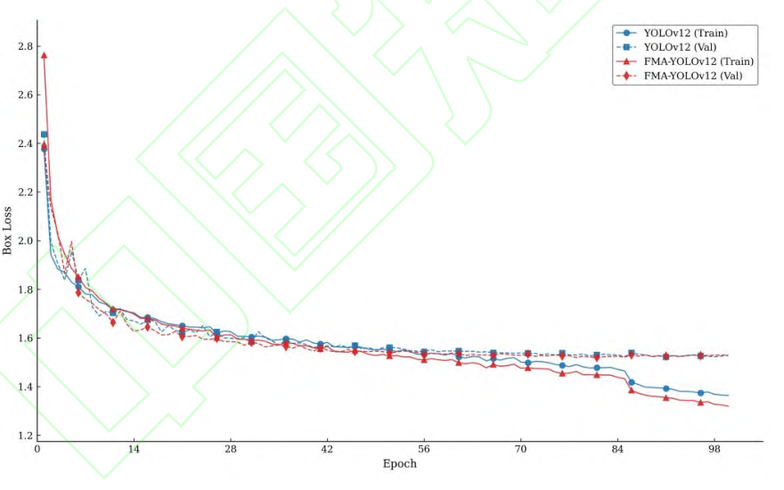

训练损失在 20 个 epoch 后基本收敛，验证集损失同步下降并稳定、未见明显背离，且 FMA-YOLOv12 收敛速度最快、最终损失值最低，表明模型未发生过拟合，也验证了 100 轮训练设置的合理性。

### 跨数据集泛化与讨论

为验证改进并非只对自建数据集有效，本文在公开数据集 CityPersons 上以相同配置开展对比实验，结果如下图所示。

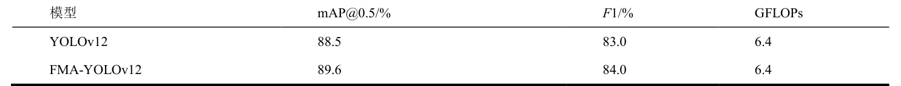

FMA-YOLOv12 的 mAP@0.5 与 F1 分数达到 89.6% 与 84.0%，较 YOLOv12 分别提高 1.1 和 1.0 个百分点，表明改进策略具备一定的泛化性。本文也指出，数据集基于特定站点构建，场景丰富度与数据多样性仍有提升空间，效果验证目前主要聚焦自身优化前后的对比，后续可结合更多开源基准数据集的指标体系丰富验证维度。

## 优点和创新点

个人认为，本文有如下一些优点和创新点可供参考学习：

1. 面向密集遮挡场景难样本主导的痛点引入 Focal-EIOU 损失，对低重叠候选框动态赋予更高权重，在抑制背景干扰的同时提升了小尺度行人的边界框回归精度。
2. 在浅层 P2 阶段以 MambaVision 双分支模块替换原生卷积，用 SSM 的线性复杂度序列建模互补卷积的局部细节保留，兼顾了高分辨率特征建模能力与推理成本。
3. 以 ASFF 重构检测头实现多尺度特征在空间位置级的自适应加权融合，并配套主对比、消融、CityPersons 跨数据集实验与热力图可视化，证据链完整、说服力强。
