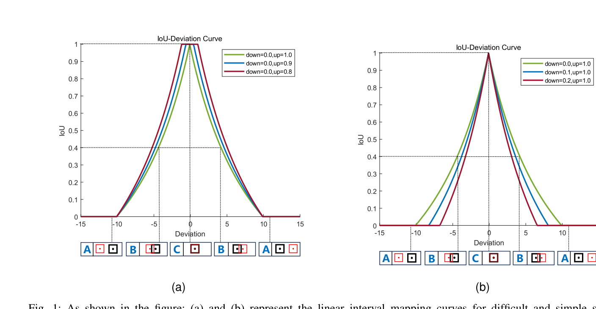
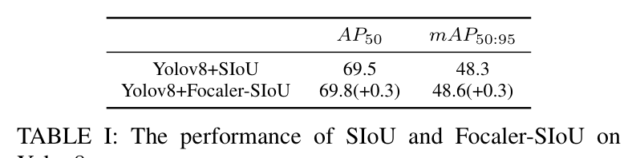
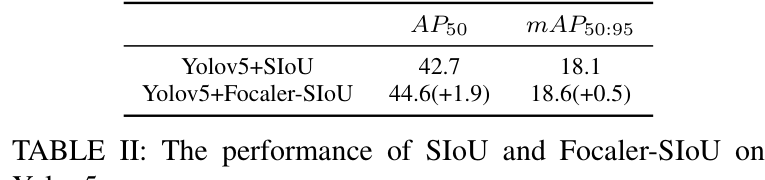

# Focaler-IoU: More Focused Intersection over Union Loss

Paper Reading 是从个人角度进行的一些总结分享，受到个人关注点的侧重和实力所限，可能有理解不到位的地方。具体的细节还需要以原文的内容为准，博客中的图表若未另外说明则均来自原文。

| 论文概况 | 详细 |
| --- | --- |
| 标题 | 《Focaler-IoU: More Focused Intersection over Union Loss》 |
| 作者 | Hao Zhang、Shuaijie Zhang |
| 发表期刊 | arXiv 预印本（arXiv:2401.10525，未正式见刊） |
| 期刊等级 | 未获取 |
| 发表年份 | 2024 |
| 论文代码 | https://github.com/malagoutou/Focaler-IoU |

作者单位：

1. 未获取

## 研究动机

边界框回归是目标检测定位分支中不可替代的组成部分，无论 anchor-based 的 Faster R-CNN、YOLO 系列、SSD、RetinaNet，还是 anchor-free 的 CornerNet、CenterNet、FCOS，检测器的定位精度都在很大程度上取决于边界框回归损失函数的设计。现有研究主要通过挖掘边界框之间的几何关系来改善回归性能：IoU 以比例形式度量重叠程度，GIoU 用最小外接框解决两框不重叠时的梯度消失，DIoU 与 CIoU 分别引入中心点归一化距离与长宽比约束加快收敛，EIoU 与 SIoU 进一步重定义形状损失并加入角度代价，使基于 IoU 的损失函数一族逐步完善。

但是，这一族损失函数普遍忽略了一个因素：难易样本的分布对边界框回归的影响。样本不平衡问题在回归过程中持续存在，已有的应对思路大多把聚焦对象固定下来：Focal Loss 通过调节正负样本权重让分类器聚焦难分类的正样本；Libra R-CNN 在目标层用 Balanced L1 损失把样本划分为离群点与内点，并裁剪离群点产生的大梯度；Focal-EIoU 则在 L1 损失基础上提出 FocalL1 损失，增大高质量样本的梯度贡献。这些方法的聚焦方向是预先定死的，而不同检测任务的难易样本构成并不相同：以普通目标为主的任务与以极小目标为主的任务，需要聚焦的回归样本恰恰相反。暂未有工作让同一个回归损失能够按任务的样本构成切换聚焦对象，这正是本文要解决的问题。

## 文章贡献

针对现有边界框回归损失忽略难易样本分布影响的问题，本文提出了 Focaler-IoU。其核心是用线性区间映射重构 IoU 损失：先把难易样本分布对回归结果的影响分析清楚，再以下界 d 与上界 u 两个区间端点把原始 IoU 映射为 Focaler-IoU，使损失能够按检测任务的需要聚焦困难样本或简单样本，并以附加项的形式 plug-in 到 GIoU、DIoU、CIoU、EIoU、SIoU 五种现有损失上。最终，本文在 PASCAL VOC 与 AI-TOD 两个数据集上，用 YOLOv8、YOLOv5 等先进单阶段检测器与 SIoU 进行对比实验。实验表明，Focaler-SIoU 在两个任务上均取得更高的检测性能，在微小目标占主导的 AI-TOD 上 AP50 提升达 1.9，验证了按任务聚焦不同回归样本的有效性。

## 本文方法

### 从 ln-norm 损失到 IoU 度量

早期的边界框回归问题使用 ln-norm 损失作为评价指标，但 ln-norm 损失对离群点非常敏感：离群点对损失值的影响更大，存在离群点时模型的性能并不稳定。为此研究者提出了更合适的度量 IoU，在基于 IoU 的评价准则下，大多数目标检测任务的检测精度得到进一步提升。IoU 的定义为：

$$IoU=\frac{|B\cap B^{gt}|}{|B\cup B^{gt}|}$$

其中 $B$ 与 $B^{gt}$ 分别表示预测框与真实框。该度量以比例形式刻画两框重叠程度，屏蔽了边界框尺寸的干扰；但当两框不重叠时梯度消失，无法准确刻画两框的位置关系。IoU 是 IoU 系损失的统一基底，也是全文重构的对象，其后继改进由下两小节回顾。

### IoU 系度量回顾：从 GIoU 到 CIoU

为解决真实框与锚框不重叠时 IoU 损失的梯度消失问题，GIoU 引入最小外接框 $C$：

$$GIoU=IoU-\frac{|C-B\cap B^{gt}|}{|C|}$$

其中 $C$ 表示真实框与锚框之间的最小外接框。为补偿 GIoU 收敛速度慢的缺点，DIoU 在 IoU 基础上加入中心点归一化距离损失项：

$$DIoU=IoU-\frac{\rho^2(b,b^{gt})}{c^2}$$

其中 $b$、$b^{gt}$ 分别是锚框与真实框的中心点，$\rho(\cdot)$ 指欧氏距离，$c$ 是两中心点之间最小外接框的对角线距离。CIoU 在 DIoU 之上再加入形状损失项以缩小长宽比差异：

$$CIoU=IoU-\frac{\rho^2(b,b^{gt})}{c^2}-\alpha v$$

其中权衡系数 $\alpha=\frac{v}{(1-IoU)+v}$，长宽比一致性 $v=\frac{4}{\pi^2}\left(\arctan\frac{w^{gt}}{h^{gt}}-\arctan\frac{w}{h}\right)^2$，$w^{gt}$、$h^{gt}$ 与 $w$、$h$ 分别是真实框与锚框的宽高。这一族度量的共同点是只使用几何量，为下一小节的另外两个成员与本文的重构提供了基底。

### IoU 系度量回顾：EIoU 与 SIoU

EIoU 基于 CIoU 重定义形状损失，直接缩小真实框与锚框的宽高差：

$$EIoU=IoU-\frac{\rho^2(b,b^{gt})}{c^2}-\frac{\rho^2(w,w^{gt})}{(w_c)^2}-\frac{\rho^2(h,h^{gt})}{(h_c)^2}$$

其中 $w_c$、$h_c$ 是覆盖真实框与锚框的最小外接框的宽与高。SIoU 进一步考虑两框连线角度的影响，通过把锚框向水平或竖直方向拉近来加速收敛，其定义为：

$$SIoU=IoU-\frac{\Delta+\Omega}{2}$$

其中角度代价 $\Lambda=\sin\big(2\sin^{-1}\frac{\min(|x_c^{gt}-x_c|,|y_c^{gt}-y_c|)}{\sqrt{(x_c^{gt}-x_c)^2+(y_c^{gt}-y_c)^2+\epsilon}}\big)$ 刻画中心点连线与坐标轴的最小夹角；距离代价 $\Delta=\sum_{t=w,h}(1-e^{-\gamma\rho_t})$（其中 $\gamma=2-\Lambda$）使距离惩罚随角度代价变化；形状代价 $\Omega=\sum_{t=w,h}(1-e^{\omega_t})^{\theta}$（其中 $\theta=4$，$\omega_w=\frac{|w-w^{gt}|}{\max(w,w^{gt})}$、$\omega_h=\frac{|h-h^{gt}|}{\max(h,h^{gt})}$）刻画尺寸差异。在原文的评述中，SIoU 是当前基于 IoU 的损失函数中检测效果最好的一个，因此也被实验节选为统一的对比方法。至此，IoU 系损失的几何刻画已相当充分，但它们的损失值都直接由几何量决定，没有任何一项考虑样本难易，这为线性区间映射留下了改造空间。

### 回归样本的难易分析

样本不平衡问题存在于各类目标检测任务中，本文按检测难度把样本划分为困难样本与简单样本，并分析聚焦对象应如何随任务变化。从目标尺度的视角看，一般检测目标可视为简单样本，而极小目标因难以精确定位可视为困难样本。两类任务的聚焦策略对应如下表所示。

| 任务类型 | 样本构成 | 回归阶段的聚焦策略 |
| --- | --- | --- |
| 一般目标检测 | 简单样本主导 | 聚焦简单样本以提升检测性能 |
| 微小目标检测 | 困难样本占比高 | 聚焦困难样本的边界框回归 |

该分析把「聚焦谁」从损失函数的固定属性变成了随任务可调的选择：对简单样本主导的检测任务，在回归过程中聚焦简单样本有助于提升性能；对困难样本占比高的检测任务则相反。这一结论是下一小节区间端点 d 与 u 取值依据的来源。

### 线性区间映射的 Focaler-IoU

Focaler-IoU 的目标是让同一个损失能在不同检测任务中聚焦不同的回归样本，手段是用线性区间映射重构 IoU 损失。映射公式为：

$$IoU_{focaler}=\begin{cases}0, & IoU<d\\\frac{IoU-d}{u-d}, & d<IoU<u\\1, & IoU>u\end{cases}$$

其中 $IoU_{focaler}$ 是重构后的 Focaler-IoU，$IoU$ 是原始 IoU 值，区间 $[d,u]\in[0,1]$。调节 d 与 u 的取值即可让 $IoU_{focaler}$ 聚焦不同的回归样本，对应的损失定义为：

$$L_{Focaler-IoU}=1-IoU_{focaler}$$

这等价于把梯度集中分配给 IoU 落在 $(d,u)$ 区间内的样本：区间内的映射斜率为 $1/(u-d)$，区间外的样本映射值恒为 0 或 1、损失为常数，不再提供梯度。给出一个简单的例子，假设 $d=0.2$、$u=0.8$：当某锚框 $IoU=0.1$ 时 $IoU_{focaler}=0$、损失恒为 1；当 $IoU=0.5$ 时 $IoU_{focaler}=(0.5-0.2)/(0.8-0.2)=0.5$、损失为 0.5；当 $IoU=0.9$ 时 $IoU_{focaler}=1$、损失为 0。可以看到，区间两端的过难与过易样本都被屏蔽了梯度，区间内样本的梯度则被放大到 1.25 倍，聚焦对象完全由区间位置决定。

### 映射曲线的两类聚焦形态

区间端点的两种调节方向对应两类聚焦形态，其映射曲线如下图所示。

图中横轴为预测框相对真实框的偏差（Deviation），纵轴为映射后的 IoU，轴下方的 A、B、C 小图给出了不同偏差下锚框（红）与真实框（黑）的相对位置。图 (a) 固定 down = 0.0、把 up 从 1.0 调到 0.8：up 越小，高 IoU 的易回归样本越早被映射为 1 而失去梯度，梯度向偏差大、IoU 低的困难样本集中；图 (b) 固定 up = 1.0、把 down 从 0.0 调到 0.2：down 越大，低 IoU 的困难样本越早被映射为 0 而失去梯度，梯度向偏差小的简单样本集中。曲线形态还显示，区间收得越窄曲线越陡，与区间内梯度放大倍率 $1/(u-d)$ 随区间变窄而增大的性质一致。两条曲线把上一小节的区间策略可视化，也直接对应下一小节 plug-in 到各损失后的聚焦行为。

### 与现有损失的 plug-in 组合

Focaler-IoU 以附加项的形式作用于现有基于 IoU 的边界框回归损失，五种组合损失的形式为：

$$\begin{aligned}L_{Focaler-GIoU}&=L_{GIoU}+IoU-IoU_{Focaler}\\L_{Focaler-DIoU}&=L_{DIoU}+IoU-IoU_{Focaler}\\L_{Focaler-CIoU}&=L_{CIoU}+IoU-IoU_{Focaler}\\L_{Focaler-EIoU}&=L_{EIoU}+IoU-IoU_{Focaler}\\L_{Focaler-SIoU}&=L_{SIoU}+IoU-IoU_{Focaler}\end{aligned}$$

其中附加项 $IoU-IoU_{Focaler}$ 把原损失中的 IoU 项替换为映射后的聚焦形式，而不改动距离、形状等几何惩罚结构。以 GIoU 为例展开：$L_{GIoU}$ 等于 1 减 GIoU，可拆成 IoU 项与最小外接框惩罚项之和，加上附加项后 IoU 项恰好被 $1-IoU_{Focaler}$ 替换、外接框惩罚项原样保留，其余四种损失的代数结构完全相同。因此该写法可以即插即用地继承 GIoU 到 SIoU 的全部几何改进。组合后的损失是否真的带来增益，由实验节在两类难度构成相反的任务上验证。

## 实验结果

### 实验设置

对比实验在两个难度构成相反的数据集上进行。PASCAL VOC 是目标检测领域最流行的数据集之一，本文使用 VOC2007 与 VOC2012 的 train 和 val 共 16551 张图像作训练集、VOC2007 的 test 共 4952 张图像作测试集，代表简单样本主导的一般检测任务；AI-TOD 是遥感图像数据集，含有大量微小目标、目标平均尺寸仅 12.8 像素，代表困难样本占比高的任务。检测器选用先进的一阶段模型 YOLOv8s 与 YOLOv7-tiny 在 VOC 上做对比，AI-TOD 上选用 YOLOv5s；对比方法统一为 SIoU。评价指标为 AP50 与 mAP50:95，前者度量 IoU 阈值为 0.5 时的检测精度，后者为 IoU 阈值从 0.5 到 0.95 多个档位上的平均 AP，对定位精度的要求更严格。

### 对比实验

VOC 数据集上 YOLOv8 搭配 SIoU 与 Focaler-SIoU 的结果如下表所示。

Focaler-SIoU 取得 69.8 的 AP50 与 48.6 的 mAP50:95，相对 SIoU 均提升 0.3，表明在简单样本主导的一般检测任务上聚焦简单样本确实带来增益。AI-TOD 数据集上 YOLOv5 的结果如下表所示。

Focaler-SIoU 的 AP50 从 42.7 提升到 44.6（+1.9），mAP50:95 从 18.1 提升到 18.6（+0.5）。AI-TOD 上的 AP50 增益明显大于 VOC 上的 0.3，可见聚焦机制在困难样本占比高的微小目标任务上收益更显著，与方法节按样本构成切换聚焦对象的分析一致。横向比较两张表还可以看到，两个数据集上 AP50 的增益都大于 mAP50:95 的增益，说明 Focaler-SIoU 对定位的改善在低 IoU 阈值档位更明显，高阈值档位的定位精度提升相对有限。原文还提到在 VOC 上使用 YOLOv7-tiny 进行对比实验，但正文未给出对应的结果表（未获取）。

### 可视化分析

原文的实验部分只提供了上述两张定量结果表，未给出检测效果图组、热力图等可视化结果（未获取），因此本节从任务构成与映射曲线两个角度做定性分析。AI-TOD 的目标平均尺寸仅 12.8 像素，定位偏差稍大就会使 IoU 跌入低值区间，样本整体偏向映射曲线的困难一侧；VOC 的一般目标则集中在曲线的高 IoU 一侧。对照方法节的映射曲线可以看出，前者需要下调 up 把梯度留给困难样本、后者需要上调 down 屏蔽过难样本，两类任务的曲线形态差异与两张结果表中增益大小的差异方向一致。原文也未给出不同 (d, u) 区间取值的消融实验（未获取），两类任务实际采用的区间端点只能依据映射曲线与任务样本构成推断。检测级的定性效果图组有待原作者后续补充。

## 优点和创新点

个人认为，本文有如下一些优点和创新点可供参考学习：

1. 从任务层面分析难易样本分布对边界框回归的影响，指出聚焦对象应随任务样本构成切换，问题视角新颖。
2. 用线性区间映射重构 IoU 损失，仅凭区间端点 d 与 u 两个参数完成难/易样本聚焦，形式简洁且可 plug-in 组合五种 IoU 系损失。
3. 在 VOC 与 AI-TOD 两类难度构成相反的数据集上用 YOLOv8、YOLOv5 等检测器验证，增益方向与分析一致，说服力强。
