# FreqFusion：Frequency-Aware Feature Fusion for Dense Image Prediction

Paper Reading 是从个人角度进行的一些总结分享，受到个人关注点的侧重和实力所限，可能有理解不到位的地方。具体的细节还需要以原文的内容为准，博客中的图表若未另外说明则均来自原文。

| 论文概况 | 详细 |
| --- | --- |
| 标题 | 《Frequency-Aware Feature Fusion for Dense Image Prediction》 |
| 作者 | Linwei Chen、Ying Fu、Lin Gu、Chenggang Yan、Tatsuya Harada、Gao Huang |
| 发表期刊 | TPAMI |
| 期刊等级 | CCF-A |
| 发表年份 | 2024 |
| 论文代码 | [https://github.com/ying-fu/FreqFusion](https://github.com/ying-fu/FreqFusion) |

作者单位：

1. 北京理工大学复杂域智能感知工信部重点实验室、北京理工大学计算机学院（MIIT Key Laboratory of Complex-Field Intelligent Sensing, School of Computer Science and Technology, Beijing Institute of Technology）
2. 日本理化学研究所先进智能研究中心（RIKEN AIP）、东京大学先端科学技术研究中心（RCAST, The University of Tokyo）
3. 杭州电子科技大学自动化学院（School of Automation, Hangzhou Dianzi University）
4. 清华大学自动化系（Department of Automation, Tsinghua University）

## 研究动机

密集图像预测（dense image prediction）是场景理解领域的重要问题，要求模型为每个像素同时给出可靠的类别标签与精确的空间定位，涵盖目标检测、语义分割、实例分割与全景分割等任务，其精度高度依赖特征的质量，直接关系到自动驾驶、医学影像与机器人等应用的上限。现代分层（hierarchical）架构依赖多次下采样逐步压缩特征分辨率，边界细节在这一过程中不断丢失；为了弥补这一损失，特征融合（feature fusion）把深层上采样后的粗糙特征（富含类别信息）与浅层高分辨率特征（富含边界细节）相加或拼接，成为各类检测与分割模型中不可或缺的组件。然而，标准特征融合只是把深层特征用最近邻或双线性插值放大后直接叠加，存在两个长期未被清晰定义的缺陷：其一是类内不一致（intra-category inconsistency），同一物体的不同部件（如汽车的车轮与车窗）特征本就差异明显，双线性插值还会把单个不一致特征复制到多个像素，受扰动的高频成分进一步压低类内相似度，导致物体内部被错分；其二是边界位移（boundary displacement），简单插值倾向于过度平滑，边界处缺乏准确的高频成分，预测边界随之偏移。此前的工作大多只是经验性地观察到这类现象，缺少可量化度量的支撑。至此问题收窄为：如何同时缓解特征融合中的类内不一致与边界位移，让融合特征兼得一致的类别信息与清晰的边界。

## 文章贡献

针对标准特征融合中类内不一致与边界位移难以兼治的问题，本文提出了频率感知特征融合 FreqFusion（Frequency-Aware Feature Fusion）。其核心是从频率视角统一审视这两个缺陷：类内不一致源于特征中受扰动的无效高频，边界位移源于边界处缺失的有效高频，因而对前者做减法、对后者做加法。首先，本文提出特征相似性分析，用类内相似度、相似度裕度与相似度精度把两个缺陷转化为可量化的指标；接着，ALPF 生成器在上采样时为每个位置预测空间可变（spatially-variant）的低通核，平滑物体内部的高频扰动，偏移生成器沿局部相似度引导的方向重采样，用一致特征替换不一致特征；最终，AHPF 生成器从浅层特征中提取下采样时永久丢失的高频边界细节并残差注入融合结果。实验表明，FreqFusion 在语义分割、目标检测、实例分割与全景分割四大任务上全面超越 CARAFE、FADE、SAPA 与 DySample 等先前最优方法。

## 本文方法

### 特征相似性分析

为了定量刻画前述两类缺陷，本文引入特征相似性分析作为贯穿全文的度量工具，类内相似度、类间相似度与相似度裕度的定义如下图所示。

类内相似度通过计算特征向量与其类别中心的余弦相似度得到，定义为：

$$\mathrm{IntraSim}(Y^{\mathrm{cls}=1}_{i,j}) = \mathrm{CosSim}\left(Y^{\mathrm{cls}=1}_{i,j}, \frac{1}{|\Omega_{\mathrm{cls}=1}|}\sum_{i,j\in\Omega_{\mathrm{cls}=1}} Y_{i,j}\right)$$

其中 $Y_{i,j}$ 是位置 $(i,j)$ 处的特征向量，$\Omega_{\mathrm{cls}=1}$ 是属于类别 1 的像素区域，$\mathrm{CosSim}$ 为余弦相似度。类似地，把类别中心换成另一类的中心即得到类间相似度，二者之差构成相似度裕度：

$$\mathrm{SimMargin}(Y_{i,j}) = \mathrm{IntraSim}(Y_{i,j}) - \mathrm{InterSim}(Y_{i,j})$$

直观上，类内相似度低意味着物体内部特征涣散，相似度裕度小则意味着特征靠近类别边界、容易错分；在此之外，本文还把每个特征按最近类别中心归类统计出相似度精度（similarity accuracy），三个指标共同构成衡量特征判别力的标尺，后文的设计验证都围绕它们展开。

### 总体结构

标准特征融合把上采样后的深层特征与浅层特征直接相加，形式化为：

$$Y_l = \mathcal{F}_{\mathrm{UP}}(Y_{l+1}) + X_l$$

其中 $X_l \in \mathbb{R}^{C\times 2H\times 2W}$ 是骨干网络第 $l$ 层的高分辨率特征，$Y_{l+1} \in \mathbb{R}^{C\times H\times W}$ 是第 $l+1$ 级的融合特征，$\mathcal{F}_{\mathrm{UP}}$ 表示 2× 最近邻或双线性插值上采样。FreqFusion 把这一过程改写为：

$$Y^l_{i,j} = \tilde{Y}^{l+1}_{i+u,j+v} + \tilde{X}^l_{i,j}$$

$$\tilde{Y}^{l+1} = \mathcal{F}_{\mathrm{UP}}\left(\mathcal{F}_{\mathrm{LP}}\left(Y^{l+1}\right)\right), \quad \tilde{X}^l = \mathcal{F}_{\mathrm{HP}}\left(X^l\right) + X^l$$

其中 $\mathcal{F}_{\mathrm{LP}}$ 是 ALPF 生成器预测的低通滤波，$(u,v)$ 是偏移生成器为坐标 $(i,j)$ 预测的偏移，$\mathcal{F}_{\mathrm{HP}}$ 是 AHPF 生成器预测的高通滤波。整体结构如下图所示，三个生成器都需要以压缩融合后的特征 $Z_l$ 作为输入：

$$Z_l = \mathcal{F}_{\mathrm{UP}}\left(\mathrm{Conv}_{1\times 1}\left(Y_{l+1}\right)\right) + \mathrm{Conv}_{1\times 1}\left(X_l\right)$$

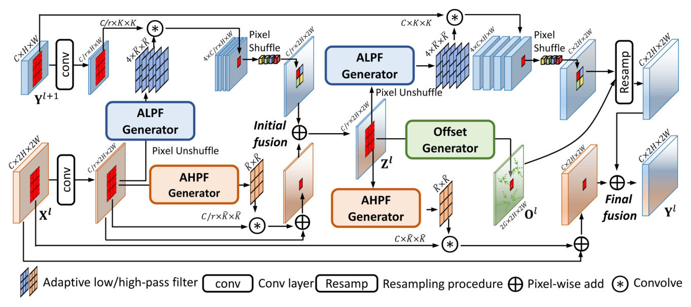

其中 $Z_l \in \mathbb{R}^{C/r\times 2H\times 2W}$ 是压缩融合特征，$r$ 为通道压缩率，用于控制三个生成器的计算开销。这一步称为初始融合，$Z_l$ 随后分别送入三个生成器，各生成器的内部结构如下图所示。

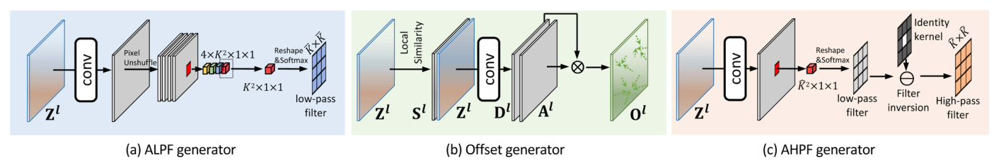

### 初始融合的增强

朴素初始融合有两处次优：一是它仍用简单插值上采样压缩特征，会继承边界模糊问题；二是频率分析显示 ALPF 生成器强烈依赖 $Z_l$ 中的高频信息，而传统卷积层只能捕获固定模式的高频。为此，本文把最终融合中的 ALPF 与 AHPF 生成器复用到初始融合（两处共享参数）：初始低通核利用浅层特征的高分辨率结构引导上采样，初始高通核以动态滤波的方式补充压缩特征的高频，弥补固定卷积的不足。对 ALPF 学到的卷积核做傅里叶分析，其频谱在高频段功率更高，印证了这种依赖关系，如下图所示。

增强前后的初始融合对比如下图所示，增强后的中间特征边界更清晰，预测出的低通滤波器在边界处的方差也更小，说明滤波器能更有效地「守住」边界。

增强后的 $Z_l$ 为三个生成器提供了更可靠的输入，后续模块都建立在这一基础之上。

### ALPF 生成器

ALPF 生成器的目标是预测动态低通滤波，在平滑深层特征以缓解类内不一致的同时完成上采样。它由一个 3×3 卷积接一个按核（kernel-wise）的 softmax 组成：

$$\bar{V}_l = \mathrm{Conv}_{3\times 3}\left(Z_l\right), \quad \bar{W}^{l,p,q}_{i,j} = \mathrm{Softmax}\left(\bar{V}^l_{i,j}\right) = \frac{\exp\left(\bar{V}^{l,p,q}_{i,j}\right)}{\sum_{p,q\in\Omega}\exp\left(\bar{V}^{l,p,q}_{i,j}\right)}$$

其中 $\bar{V}_l \in \mathbb{R}^{\bar{K}^2\times 2H\times 2W}$ 是原始滤波权重，$\bar{K}$ 是低通核大小，$\Omega$ 是大小为 $\bar{K}\times\bar{K}$ 的邻域。softmax 约束每个位置的滤波器权重全正且和为一，这样的滤波器天然是平滑的低通滤波器。随后把 $\bar{W}_l$ 按 pixel unshuffle 方式分成 4 组，各自与深层特征卷积后再经 Pixel Shuffle 重排成 2× 上采样结果：

$$\tilde{Y}^{l+1,g}_{i,j} = \sum_{p,q\in\Omega} \bar{W}^{l,g,p,q}_{i,j} \cdot Y^{l+1}_{i+p,j+q}, \quad \tilde{Y}^{l+1} = \mathrm{PixelShuffle}\left(\tilde{Y}^{l+1,1}, \tilde{Y}^{l+1,2}, \tilde{Y}^{l+1,3}, \tilde{Y}^{l+1,4}\right)$$

其中 $g \in \{1,2,3,4\}$ 表示通道组序号。类内相似度的可视化如下图所示，双线性插值的结果在物体内部严重涣散、边界明显位移，引入 ALPF 生成器后内部一致性与边界锐度同步改善。

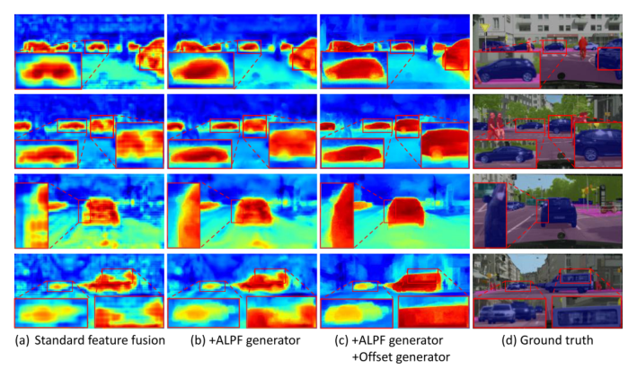

定量来看，ALPF 生成器把整体类内相似度从 0.727 提升到 0.799、相似度精度从 0.918 提升到 0.941，可见空间可变低通滤波确实换来了更一致的深层特征，但它处理大面积不一致区域与细边界的能力仍然有限。

### Offset 生成器

ALPF 生成器面临一个两难：扩大低通核有利于纠正大面积不一致区域，却会伤及细窄的边界；缩小核则相反。本文的观察是，类内相似度低的特征，其邻居中往往存在类内相似度高的特征，于是可以用重采样「就地取材」。偏移生成器先计算每个像素与 8 邻域像素的局部余弦相似度：

$$S^{l,p,q}_{i,j} = \frac{\sum_{c=1}^{C} Z^l_{c,i,j} \cdot Z^l_{c,i+p,j+q}}{\sqrt{\sum_{c=1}^{C}\left(Z^l_{c,i,j}\right)^2}\sqrt{\sum_{c=1}^{C}\left(Z^l_{c,i+p,j+q}\right)^2}}$$

其中 $S_l \in \mathbb{R}^{8\times H\times W}$，$c$ 遍历全部 $C$ 个通道。局部相似度随后与 $Z_l$ 拼接，经两个 3×3 卷积预测偏移的方向与幅度：

$$O_l = D_l \cdot A_l, \quad D_l = \mathrm{Conv}_{3\times 3}\left(\mathrm{Concat}\left(Z_l, S_l\right)\right), \quad A_l = \mathrm{Sigmoid}\left(\mathrm{Conv}_{3\times 3}\left(\mathrm{Concat}\left(Z_l, S_l\right)\right)\right)$$

其中 $D_l \in \mathbb{R}^{2G\times H\times W}$ 是偏移方向，$A_l \in \mathbb{R}^{2G\times H\times W}$ 是经 sigmoid 约束的偏移幅度，$O_l$ 是最终偏移，$G$ 是偏移分组数。局部相似度如何引导偏移指向如下图所示，采样方向始终偏向类内相似度更高的一侧。

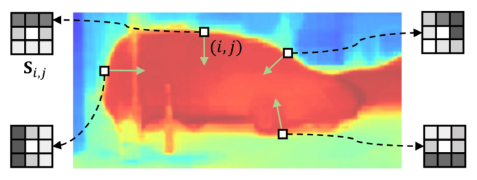

预测出的偏移场可视化如下图所示，物体内边界的偏移指向特征更一致的内部，外边界的偏移则指向相反方向，一推一拒使边界更清晰。

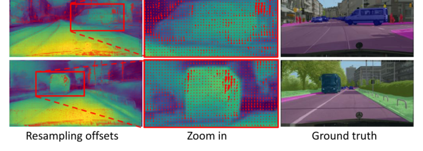

叠加偏移生成器后，类内相似度从 0.760 提升到 0.799，边界相似度精度从 0.720 提升到 0.728，表明重采样同时改善了大面积不一致区域与边界。至此深层特征已经足够一致与对齐，但它自身丢失的高频边界无法凭空恢复，这由最后一个模块补上。

### AHPF 生成器

根据 Nyquist-Shannon 采样定理，下采样时高于奈奎斯特频率（采样率的一半）的频率分量会被混叠并永久丢失，例如步长为 2 的 1×1 卷积把采样率降到 1/2，高于 1/4 的频率随之损失。把特征图变换到频域的离散傅里叶变换定义为：

$$X_F(u,v) = \frac{1}{HW}\sum_{h=0}^{H-1}\sum_{w=0}^{W-1} X(h,w)\, e^{-2\pi j(uh+vw)}$$

其中 $X_F$ 是变换后的复数频谱，$H$、$W$ 是特征图的高与宽，$h$、$w$ 是空间坐标，$|u|$、$|v|$ 是归一化频率。这些丢失的频率无法从深层特征找回，AHPF 生成器转而用空间可变的高通滤波增强浅层特征中幸存的边界细节：

$$\hat{V}_l = \mathrm{Conv}_{3\times 3}\left(Z_l\right), \quad \hat{W}^{l,p,q}_{i,j} = E - \mathrm{Softmax}\left(\hat{V}^l_{i,j}\right) = E_{p,q} - \frac{\exp\left(\hat{V}^{l,p,q}_{i,j}\right)}{\sum_{p,q\in\Omega}\exp\left(\hat{V}^{l,p,q}_{i,j}\right)}$$

其中 $\hat{V}_l \in \mathbb{R}^{\hat{K}^2\times H\times W}$ 是原始核权重，$\hat{K}$ 是高通核大小，$E$ 是中心为 1、其余为 0 的恒等核。先用 softmax 造出一个低通核，再用恒等核减去它，即可保证结果必为高通核。给出一个简单的例子，假设 $\hat{K}=3$ 且某位置的 softmax 输出为 $\begin{bmatrix}0.1 & 0.2 & 0.1\\ 0.2 & 0.2 & 0.2\\ 0.1 & 0.2 & 0.1\end{bmatrix}$（9 个权重全正且和为 1），用 $E$ 减去它得到 $\begin{bmatrix}-0.1 & -0.2 & -0.1\\ -0.2 & 0.8 & -0.2\\ -0.1 & -0.2 & -0.1\end{bmatrix}$，9 个权重之和为 0。可以看到，直流分量被完全抵消，滤波输出只保留邻域内的差分信号，正是高通特性。增强结果以残差方式并回浅层特征：

$$\tilde{X}^l_{i,j} = X^l_{i,j} + \sum_{p,q\in\Omega} \hat{W}^{l,p,q}_{i,j} \cdot X^l_{i,j}$$

浅层特征增强前后的对比如下图所示，巴士轮廓与人物头部等边界细节明显更清楚。

定量频域分析进一步显示，增强后特征在奈奎斯特频率之上的高频功率得到提升，边界相似度裕度从 0.228 提升到 0.239、边界相似度精度从 0.718 提升到 0.728，可见边界位移问题得到实质性缓解。

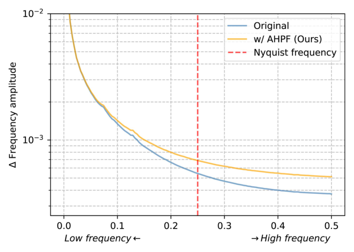

## 实验结果

### 语义分割

实验在 Cityscapes、ADE20K 与 COCO-Stuff 三个数据集上进行，以 mIoU 与边界 mIoU（bIoU）为指标，把 SegFormer 等模型中的上采样与融合环节替换为各对比方法。在 ADE20K 上以 SegFormer-B1 为分割模型时，FreqFusion 取得 44.5 mIoU 与 32.8 bIoU，较基线提升 2.8 mIoU，领先第二名 Dysample-S+ 达 1.2 mIoU，如下表所示。

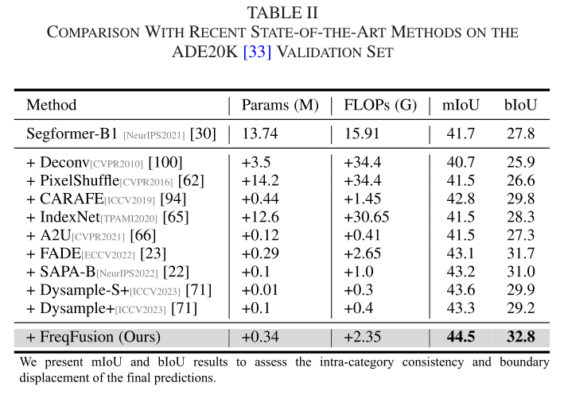

FreqFusion 对结构不挑剔：在 Cityscapes 上插入 UPerNet、SegFormer 与 SegNeXt 三种解码器均带来 1.0 以上 mIoU 提升，而参数与 FLOPs 增加极少，如下表所示。

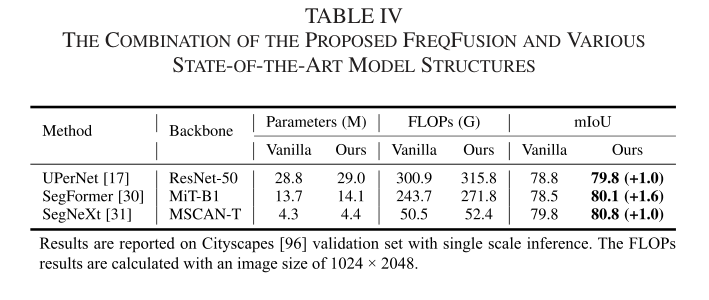

换用 SegNeXt-T 在三个数据集上跨库验证，分别提升 1.0、2.4 与 2.0 mIoU，仅增加 0.18M 参数与 0.44G FLOPs；推理速度 23.0 FPS，与最快的 Dysample（25.9 FPS）接近，但涨点（+2.4 对 +1.1 mIoU）高出一倍多，说明精度收益远大于速度代价。

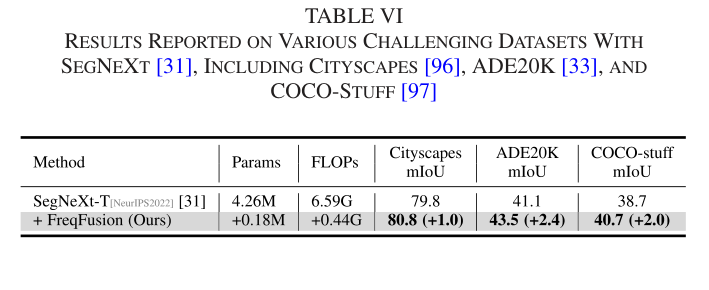

### 目标检测与实例分割

检测实验以 Faster R-CNN 为基线、MS COCO 为数据集，仅修改 FPN 中的特征融合环节。FreqFusion 将 ResNet-50 基线提升 1.9 AP 至 39.4，领先第二名 Dysample+ 0.7 AP，R50 版本甚至与更重的 R101 最近邻基线（39.4 AP）持平；换用 R101 骨干仍提升 1.6 AP，如下表所示。

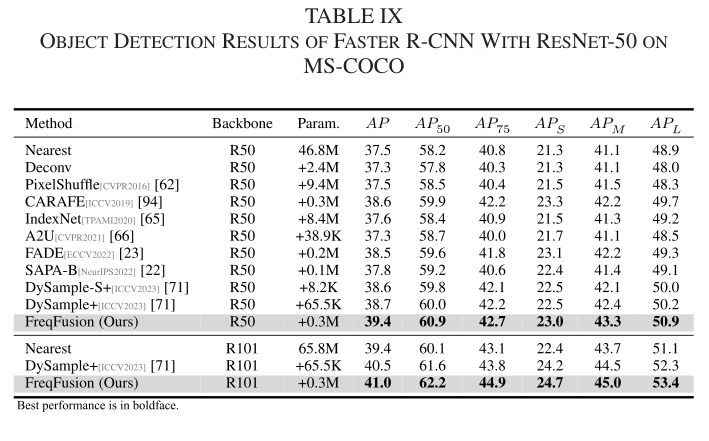

实例分割以 Mask R-CNN 为基线，FreqFusion 在 ResNet-50 上取得 40.0 box AP 与 36.0 mask AP，分别提升 1.7 与 1.3；R101 上提升 1.6 box AP 与 1.4 mask AP，对 DySample+ 保持 0.6/0.6 的领先，验证了方法在检测与分割双目标下的稳健性。

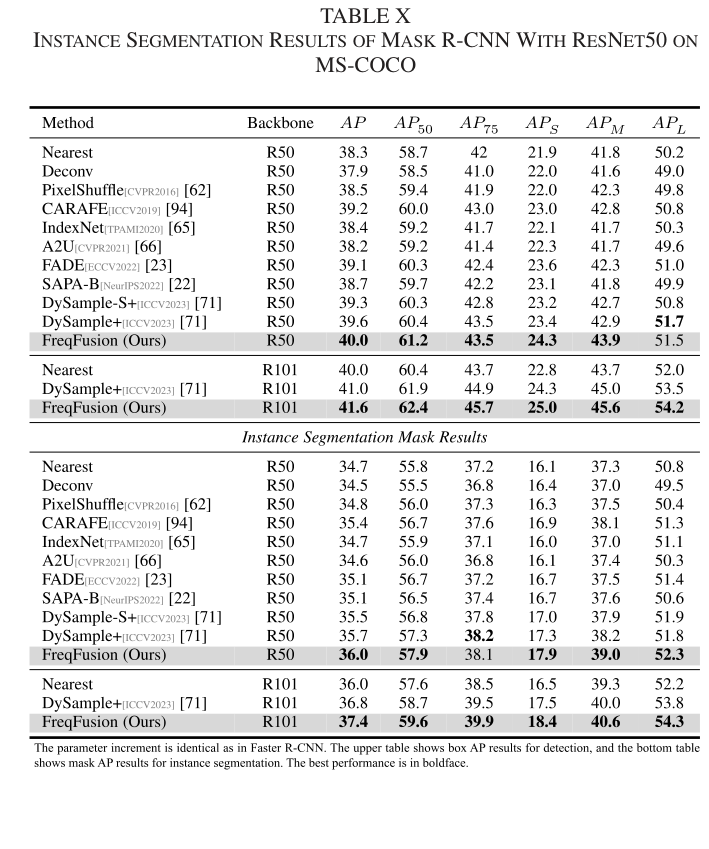

### 全景分割

全景分割以 Panoptic FPN 为基线、PQ 为指标。FreqFusion 将 ResNet-50 基线提升 2.5 PQ 至 42.7，领先第二名 Dysample+ 1.2 PQ，R101 版本达到 44.0 PQ，如下表所示。

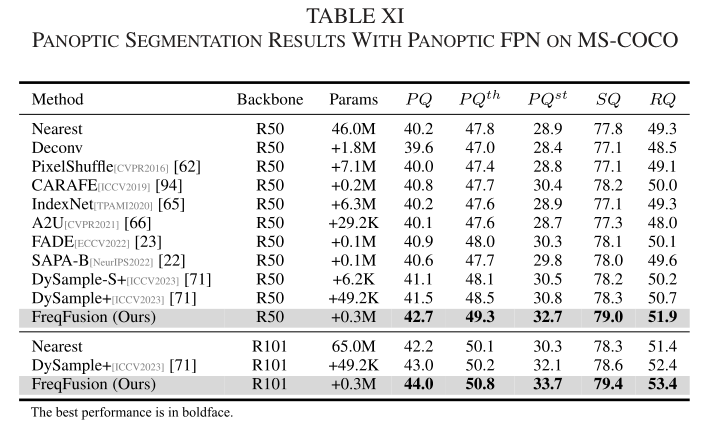

### 消融实验

消融以 SegNeXt-T 为基线在 ADE20K 上展开。三个生成器逐个叠加，ALPF 单独引入提升 0.9 mIoU，再加 AHPF 达到 42.9（+1.8），三者齐上达到最高的 43.5（+2.4），验证了低通、高通与重采样三条路径的互补性，如下表所示。

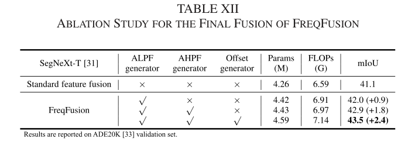

核大小消融显示，低通核 $\bar{K}$ 从 3 增到 5 再涨 1.0 mIoU，而高通核 $\hat{K}$ 从 3 增到 5 反而使性能从 42.9 降到 42.4，最终配置定为 $\bar{K}=5$、$\hat{K}=3$，可见平滑需要大感受野、锐化只需小邻域。

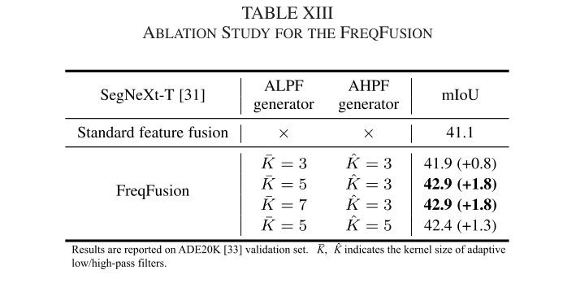

偏移分组数的作用则是把重采样做得更细：4 组时取得最优的 43.5 mIoU，继续增大不再受益甚至略有回落。

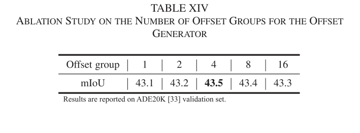

初始融合的增强同样关键：仅叠加初始 ALPF 提升 0.3 mIoU，再叠加初始 AHPF 达到 43.5，说明此前被广泛沿用简单插值的中间融合环节本身就是一块可观的红利。

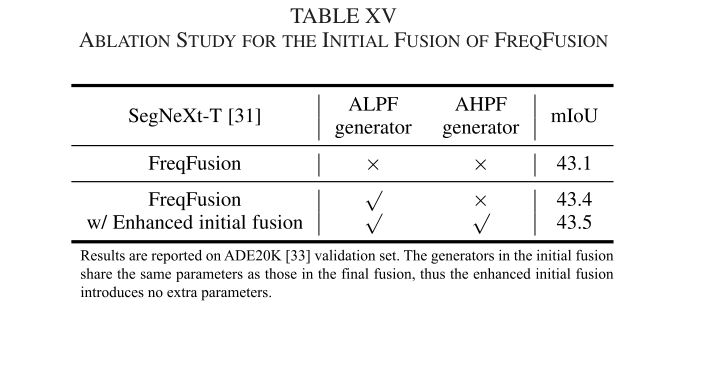

四组消融合在一起看，每个模块都各司其职、缺一不可，最终组合在 SegNeXt-T 上把基线推高 2.4 mIoU。

### 可视化分析

与标准特征融合相比，FreqFusion 融合后的特征内部更一致、边界更锐利，如下图所示。

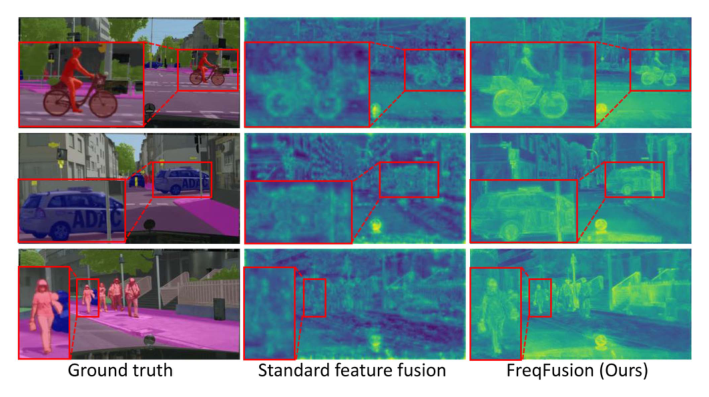

在 Cityscapes 验证集上，SegNeXt 基线的错分与破碎区域在换用 FreqFusion 后明显减少，预测一致性显著提高。

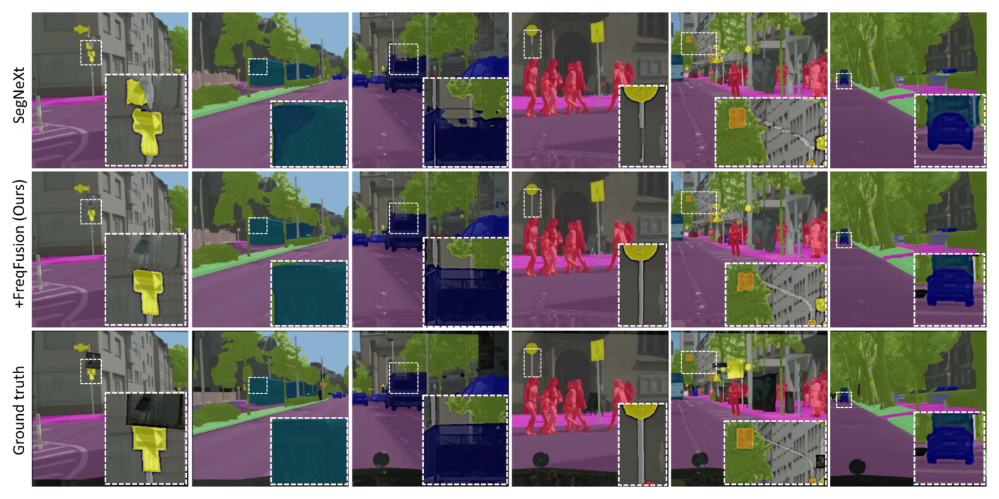

在 COCO 验证集上与表现最好的 CARAFE、DySample 逐一对照，FreqFusion 的检测框与掩码同样更贴近真实边界，定性结果与定量增益相互印证。

综合四类任务的定量与定性结果，FreqFusion 在几乎不增加开销的前提下稳定优于全部对比方法，可见特征相似性分析指导下的两条频率路线确实击中了要害。

## 优点和创新点

个人认为，本文有如下一些优点和创新点可供参考学习：

1. 把「类内不一致」与「边界位移」从经验观察升级为可量化的问题：提出的特征相似性分析（IntraSim、SimMargin、SimAcc）既能在设计前定位问题，又能在设计后验证收益，形成完整的闭环，说服力强。
2. 用频率视角统一了特征融合中看似矛盾的两个需求：类内不一致是无效高频过剩、边界位移是有效高频缺失，于是用 ALPF 做减法、AHPF 做加法、偏移重采样居中协调，一低一高的互补设计十分巧妙。
3. 即插即用且跨结构泛化能力出色：不改动主干结构，仅增加 0.18M 参数即可在 CNN 与 Transformer 两类解码器、四大密集预测任务上取得一致涨点，实验丰富且覆盖面广，可供后续研究直接复用。
