# Generalized Focal Loss: Learning Qualified and Distributed Bounding Boxes for Dense Object Detection

Paper Reading 是从个人角度进行的一些总结分享，受到个人关注点的侧重和实力所限，可能有理解不到位的地方。具体的细节还需要以原文的内容为准，博客中的图表若未另外说明则均来自原文。

| 论文概况 | 详细 |
| --- | --- |
| 标题 | 《Generalized Focal Loss: Learning Qualified and Distributed Bounding Boxes for Dense Object Detection》 |
| 作者 | Xiang Li, Wenhai Wang, Lijun Wu, Shuo Chen, Xiaolin Hu, Jun Li, Jinhui Tang, Jian Yang |
| 发表会议 | Conference on Neural Information Processing Systems (NeurIPS) |
| 会议等级 | CCF-A |
| 发表年份 | 2020 |
| 论文代码 | 原文实验全部基于 MMDetection 复现：[https://github.com/open-mmlab/mmdetection](https://github.com/open-mmlab/mmdetection) |

作者单位：

1. Nanjing University of Science and Technology
2. Momenta
3. Nanjing University
4. Microsoft Research
5. RIKEN Center for Advanced Intelligence Project
6. Tsinghua University

## 研究动机

一阶段密集检测器通常把目标检测形式化为密集分类与定位（边界框回归）两个子任务：分类分支用 Focal Loss 优化，回归分支在 Dirac delta 分布假设下学习框坐标；近年流行的做法是再引入一个独立的质量估计分支（预测 IoU 或 centerness 分数），推理时把质量分数与分类分数相乘作为 NMS 的排序依据。然而，这类现有实践存在两个层层递进的问题。

其一，质量估计与分类分数在训练和推理阶段的用法不一致：两个分支各自独立训练，质量分支的监督还只分配给正样本，负样本的质量预测完全不受约束，可能出现随机的高分；推理时二者却被相乘复合使用，导致高质量分数的负例可能在 NMS 排序中压过质量预测偏低的正例，直接损害检测性能。其二，边界框的表示过于僵硬：广泛使用的 Dirac delta 分布把框坐标当作一个确定值，无法刻画遮挡、阴影、模糊造成的边界歧义与不确定性；即便有工作改用高斯分布建模，对称的单峰假设仍过于简单，难以反映真实数据中任意而灵活的坐标分布。

暂未有工作同时消除「训练-推理打分不一致」与「定位分布表示僵硬」这两个瓶颈，本文即围绕这两个基本表示问题展开。

## 文章贡献

针对上述局限，本文提出了 Generalized Focal Loss（GFL），其核心是把 Focal Loss 从离散 $\{1, 0\}$ 标签推广到连续标签，从而支撑两种新表示的端到端优化。首先，本文把定位质量估计并入分类预测向量，形成「分类-IoU 联合表示」，并设计 Quality Focal Loss（QFL）以连续 IoU 值软化 one-hot 标签进行监督；接着，本文放弃 Dirac delta 与高斯先验，用离散化的 General distribution 直接学习边界框坐标的任意分布，并设计 Distribution Focal Loss（DFL）迫使网络聚焦于目标坐标附近取值的概率；最终，QFL 与 DFL 被统一进同一个广义损失框架，FL、QFL、DFL 都是它的特例。实验表明，GFL 在不引入额外推理开销的前提下持续提升一阶段检测器性能，在 COCO test-dev 上以 ResNet-101 骨干取得 45.0% AP，超越同期的 SAPD（43.5%）与 ATSS（43.6%），最佳模型达 48.2% AP。

## 本文方法

### Focal Loss 回顾

Focal Loss（FL）用于解决一阶段检测中前景-背景极端类别不平衡的问题，其典型形式定义为：

$$
\text{FL}(p) = -(1 - p_t)^\gamma \log(p_t), \quad
p_t = \begin{cases} p, & \text{when } y = 1 \\ 1 - p, & \text{when } y = 0 \end{cases}
$$

其中 $y \in \{1, 0\}$ 是类别真值，$p \in [0, 1]$ 是标签为 1 的类别的预测概率，$\gamma$ 是可调聚焦参数（原文为简洁省略了 $\alpha_t$）。它由标准交叉熵 $-\log(p_t)$ 与动态缩放因子 $(1-p_t)^\gamma$ 两部分组成，后者自动下调易分样本的损失贡献，使模型快速聚焦于难分样本。FL 只支持离散标签，这正是本文要推广的出发点：后续的联合表示会引入 0∼1 的连续标签。

### 分类-IoU 联合表示

联合表示的目标是把分类分数与定位质量合并为单一变量：分类向量在真值类别位置上的取值不再是 1，而是预测框与真值框的 IoU（即软化的 one-hot 标签 $y \in [0, 1]$），负样本所有位置取 0。与现有做法的对比如下图所示：

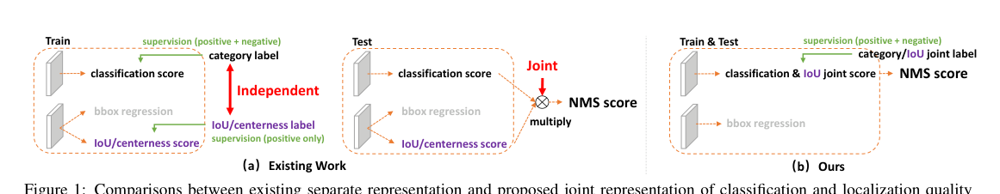

图中 (a) 是现有工作的分离表示：质量分支（IoU/centerness）只用正样本监督、独立训练，推理时与分类分数相乘后送入 NMS；(b) 是本文的联合表示：训练与推理都使用同一个「分类 & IoU 联合分数」，负样本同样接受 0 质量分数的监督。这样一来，训练与推理的打分方式完全一致，预测分类分数恰好等于预测质量分数，二者相关性达到最强，负例「随机高质量分」的风险被直接消除。该表示向上承接标签分配，向下需要一个能吃连续标签的损失来优化，即下文的 QFL。

### Quality Focal Loss

QFL 用于优化上述联合表示。沿用多类别 sigmoid 二元分类实现，记 sigmoid 输出为 $\sigma$，QFL 计算为：

$$
\text{QFL}(\sigma) = -\left| y - \sigma \right|^\beta \left( (1 - y) \log(1 - \sigma) + y \log(\sigma) \right)
$$

其中 $y$ 是连续质量标签（正样本取预测框与真值框的 IoU，负样本取 0），$\sigma$ 是预测的联合分数，$\beta \geq 0$ 控制降权速率。它由 FL 的两部分推广而来：交叉熵部分扩展为完整形式 $-[(1-y)\log(1-\sigma) + y\log(\sigma)]$，缩放因子部分推广为预测与连续标签的绝对距离 $|y-\sigma|^\beta$。$\sigma = y$ 是 QFL 的全局最小值解；当质量估计偏离标签时调制因子较大、样本被重点学习，当 $\sigma \to y$ 时因子趋零、估计准确的样本被平滑降权，直观上就是把 FL 的「聚焦难例」从离散标签搬到了连续标签。该损失的输出直接作为推理时的 NMS 分数。

### 边界框的 General distribution 表示

回归分支沿用 FCOS/ATSS 的做法，以采样点到框四边的相对偏移作为回归目标。传统方法把回归标签 $y$ 建模为 Dirac delta 分布 $\delta(x-y)$，恢复 $y$ 的积分形式如下：

$$
y = \int_{-\infty}^{+\infty} \delta(x - y) x \, dx
$$

其中 $\delta(x-y)$ 满足全空间积分为 1。本文放弃这一僵硬假设，直接学习潜在的 General distribution $P(x)$：给定标签范围 $y_0 \leq y \leq y_n$，模型的估计值 $\hat{y}$ 计算为：

$$
\hat{y} = \int_{-\infty}^{+\infty} P(x) x \, dx = \int_{y_0}^{y_n} P(x) x \, dx
$$

为了适配卷积网络，把连续区间 $[y_0, y_n]$ 按等间隔 $\Delta = y_{i+1} - y_i$ 离散化为 $\{y_0, y_1, \ldots, y_n\}$（实验中 $\Delta = 1$），则由离散分布性质 $\sum_{i=0}^{n} P(y_i) = 1$，估计值可写为：

$$
\hat{y} = \sum_{i=0}^{n} P(y_i) y_i
$$

其中 $P(y_i)$ 由一个 $n+1$ 单元的 softmax 层输出，简记为 $S_i$。直观上，回归分支的每个坐标从预测 1 个数变成预测一个概率分布，其期望即坐标估计；$\hat{y}$ 仍可用 SmoothL1、IoU Loss 或 GIoU Loss 端到端训练。但能让积分等于 $y$ 的 $P(x)$ 组合有无穷多种，学习效率与置信度都会受影响，这就需要下面的 DFL 约束分布形状。

### Distribution Focal Loss

DFL 的目标是显式鼓励目标坐标附近的取值获得高概率。设 $y_i \leq y \leq y_{i+1}$ 是离 $y$ 最近的两个离散点，DFL 定义为：

$$
\text{DFL}(S_i, S_{i+1}) = -\left( (y_{i+1} - y) \log(S_i) + (y - y_i) \log(S_{i+1}) \right)
$$

其中 $S_i, S_{i+1}$ 分别是 $y_i, y_{i+1}$ 处的预测概率。这相当于把连续标签 $y$ 按距离拆给左右两个邻点做加权交叉熵；由于边界框学习只涉及正样本、没有类别不平衡风险，DFL 直接取 QFL 中的完整交叉熵部分而不再需要调制因子。其全局最小值解 $S_i = \frac{y_{i+1}-y}{y_{i+1}-y_i},\ S_{i+1} = \frac{y-y_i}{y_{i+1}-y_i}$ 可保证 $\hat{y} = S_i y_i + S_{i+1} y_{i+1} = y$，即估计值无限逼近标签。下图直观展示了这一设计动机：

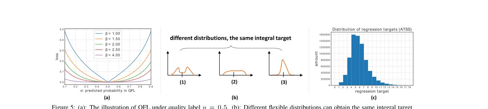

图中 (a) 是 QFL 在质量标签 $y=0.5$ 下取不同 $\beta$ 的损失曲线；(b) 表明不同的分布形状可以得到相同的积分目标，其中紧凑的分布 (3) 对边界框估计更自信、更精确，这正是 DFL 要优化的形状；(c) 是 ATSS 在 COCO trainval35k 上全部训练样本的回归目标直方图，为离散化点数 $n$ 的选取提供了依据。DFL 与 QFL 分别作用于回归分支和分类分支，二者相互正交。

### GFL 统一形式

QFL 与 DFL 可统一为一个广义形式，即 Generalized Focal Loss。假设模型对两个变量 $y_l, y_r$（$y_l < y_r$）估计概率 $p_{y_l}, p_{y_r}$（非负且和为 1），最终预测为其线性组合 $\hat{y} = y_l p_{y_l} + y_r p_{y_r}$，对应的连续标签 $y$ 满足 $y_l \leq y \leq y_r$，则以绝对距离 $|y-\hat{y}|^\beta$ 为调制因子，GFL 计算为：

$$
\text{GFL}(p_{y_l}, p_{y_r}) = -\left| y - (y_l p_{y_l} + y_r p_{y_r}) \right|^\beta \left( (y_r - y) \log(p_{y_l}) + (y - y_l) \log(p_{y_r}) \right)
$$

其全局最小值在 $p^*_{y_l} = \frac{y_r-y}{y_r-y_l},\ p^*_{y_r} = \frac{y-y_l}{y_r-y_l}$ 处取得，此时 $\hat{y}$ 与连续标签 $y$ 完全吻合。三个已有损失都是 GFL 的特例：取 $\beta=\gamma, y_l=0, y_r=1, p_{y_r}=p$ 且 $y \in \{1, 0\}$ 时退化为 FL；取 $y_l=0, y_r=1, p_{y_r}=\sigma$ 时退化为 QFL；取 $\beta=0, y_l=y_i, y_r=y_{i+1}, p_{y_l}=S_i, p_{y_r}=S_{i+1}$ 时退化为 DFL。这一统一视角把「离散标签分类」与「连续值分布回归」纳入同一个优化目标，也是标题中「Generalized」的含义所在。改造前后检测头两个分支的监督方式对比如下图所示：

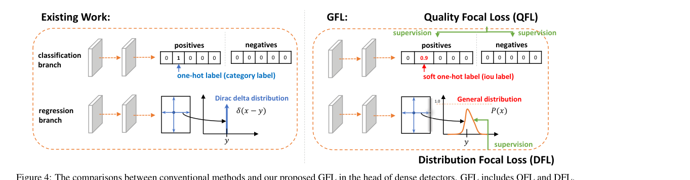

图中左侧是现有工作：分类分支接受 one-hot 类别标签监督、回归分支接受 Dirac delta 分布监督；右侧是 GFL：分类分支接受软化的 one-hot（IoU）标签并由 QFL 优化，回归分支接受 General distribution 并由 DFL 优化。可见 GFL 并未改变检测头的网络结构，只替换了两个分支的标签形态与损失形式。

### 训练损失与推理

引入 GFL 后，密集检测器的总训练损失定义为：

$$
L = \frac{1}{N_{pos}} \sum_z L_Q + \frac{1}{N_{pos}} \sum_z \mathbb{1}_{\{c^*_z > 0\}} \left( \lambda_0 L_B + \lambda_1 L_D \right)
$$

其中 $L_Q$ 为 QFL，$L_D$ 为 DFL，$L_B$ 沿用 GIoU Loss；$N_{pos}$ 是正样本数；$\lambda_0$ 默认取 2，$\lambda_1$ 实践中取 $\frac{1}{4}$（四个方向取平均）；求和遍历特征金字塔上的全部位置 $z$，$\mathbb{1}_{\{c^*_z>0\}}$ 是正样本指示函数；遵循官方代码惯例，$L_B$ 与 $L_D$ 在训练中同样用质量分数加权。改造后的检测器与原版的差异只有两点：推理时分类分数（联合表示）直接作为 NMS 分数，不再与任何独立质量预测相乘；回归分支最后一层对每个坐标输出 $n+1$ 个值而非 1 个，计算开销可忽略。整套损失即插即用，可施加于任意一阶段检测器。

## 实验结果

### 实验设置

| 项目 | 设置 |
| --- | --- |
| 数据集 | COCO：trainval35k（115K 图）训练，minival（5K 图）消融验证，test-dev（20K 图）主对比 |
| 指标 | COCO 风格 AP、AP50、AP75、APS、APM、APL 及 FPS |
| 框架 | MMDetection，默认超参数 |
| 消融设置 | ResNet-50 骨干，1x 学习率（12 epochs），无多尺度训练 |
| 对比设置 | 2x 学习率（24 epochs）+ 多尺度训练，单模型单尺度测试 |
| FPS 测速 | 单张 GeForce RTX 2080Ti，batch size 1 |

### 可视化分析

先看两组定性结果。下图 (a) 给出背景图块上预测分类分与预测 IoU 分的实例，(b) 是随机采样实例的两种分数散点图：

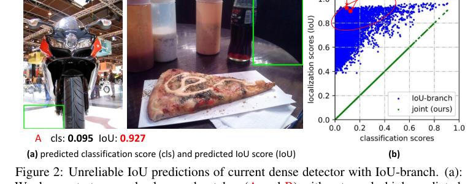

可以观察到：分离表示下（蓝点）预测分类分与预测 IoU 分相关性很弱，红圈区域存在大量质量预测偏高的潜在负例，可能在 NMS 中排到真正例之前；而联合表示（绿点）强制两个分数相等，从定义上规避了这一风险。这说明 QFL 带来的收益源于更可靠的质量估计。

下图进一步展示了 General distribution 表示学到的边界框分布：

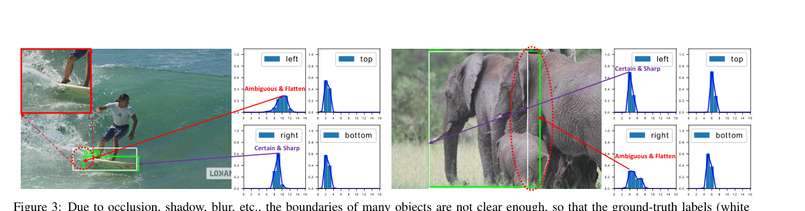

受遮挡、阴影、模糊等影响，许多目标的白色真值框本身并不可信，Dirac delta 分布无法表达这种歧义；而学出的分布能用形状反映底层信息——红圈处平坦的分布对应模糊歧义的边界，尖锐的分布对应清晰确定的目标，绿色预测框则给出更合理的定位。可见分布式表示确实捕获了坐标的不确定性。

### QFL 消融

QFL 的研究围绕联合表示与其他质量表示形式的对比展开，变体示意如下图：

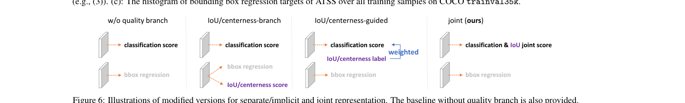

图中自上而下分别是无质量分支、centerness/IoU 分支（相乘加权）、centerness/IoU 引导（隐式加权）与本文的联合表示，消融结果如下表所示。

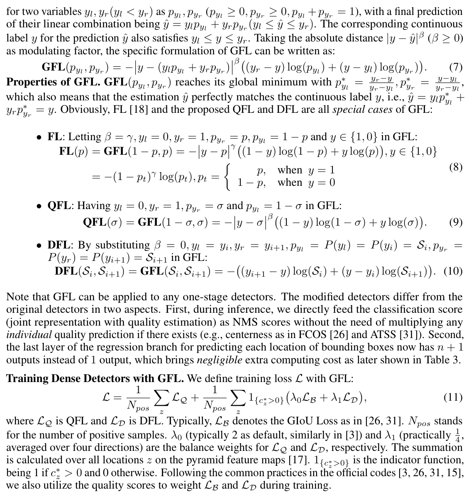

表 (a) 中 QFL 优化的联合表示在 FCOS 上达 39.0 AP、在 ATSS 上达 39.9 AP，一致优于全部分离/隐式变体，且 IoU 作为质量度量始终好于 centerness；表 (b) 中把联合表示移植到 FoveaBox、RetinaNet、SSD512 上获得约 0.6-0.8 AP 提升且不增加推理开销，表明 QFL 对检测器结构不敏感；表 (c) 中 $\beta = 2$ 时取得 39.9 AP 的最优结果，验证了调制因子的降权作用。

### DFL 消融

DFL 的研究对比了不同先验分布并扫描离散化超参，结果如下表所示。

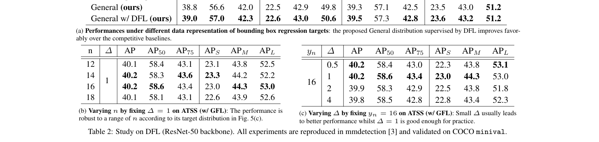

表 (a) 中 General 分布（39.3 AP）优于或持平 Dirac delta（39.2 AP）与 Gaussian（39.3 AP）假设，叠加 DFL 后进一步提升到 39.5 AP，说明无先验的分布式表示加上形状约束才完整；表 (b) 中固定 $\Delta = 1$ 扫描 $n$，12 到 18 之间 AP 稳定在 40.1-40.2，可见 $n$ 的选取对目标分布并不敏感（推荐 14 或 16）；表 (c) 中固定 $y_n = 16$ 扫描 $\Delta$，较小的 $\Delta$ 通常更好，$\Delta = 1$ 已足够实用。

### QFL 与 DFL 的正交性消融

在 ATSS 上逐项加入两个损失的结果如下表所示。

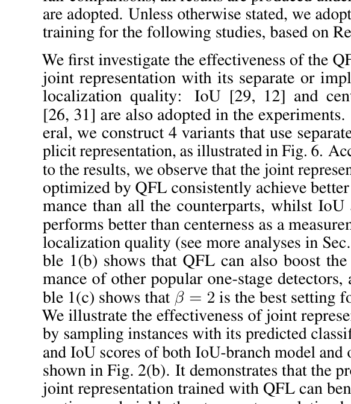

基线 39.2 AP，单加 QFL 提升到 39.9 AP，单加 DFL 提升到 39.5 AP，二者合用（即 GFL）达 40.2 AP，绝对提升 1 AP，而 FPS 始终维持 19.4。这表明 QFL 与 DFL 的增益相互正交，且 GFL 几乎没有引入额外开销。

### 与主流检测器的对比及速度-精度权衡

基于 ATSS 的 GFL 在 COCO test-dev 上与主流方法的单模型单尺度对比如下表所示。

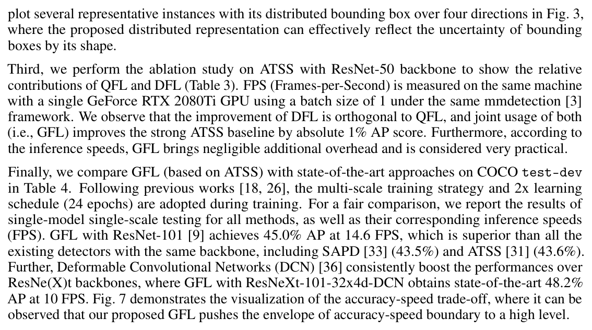

GFL 以 ResNet-101 骨干在 14.6 FPS 下取得 45.0% AP，超过同骨干的 SAPD（43.5%）与 ATSS（43.6%）；配合 ResNeXt-101-32x4d-DCN 时达到同期最优的 48.2% AP、10 FPS。精度-速度权衡的整体格局如下图：

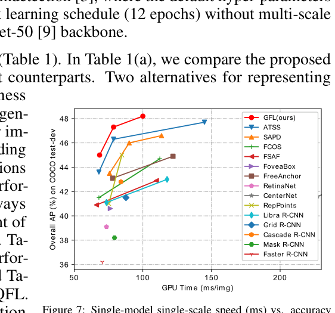

散点图中 GFL 位于多数竞争方法的左上方，表明它把密集检测器的精度-速度边界推到了更高水平，兼顾实时性与精度。

### 进一步讨论：为什么 IoU 好于 centerness

消融中「IoU 一致优于 centerness」的现象可以追溯到标签本身的分布。下图对比了两种度量下真值框、预测框与正样本点的关系：

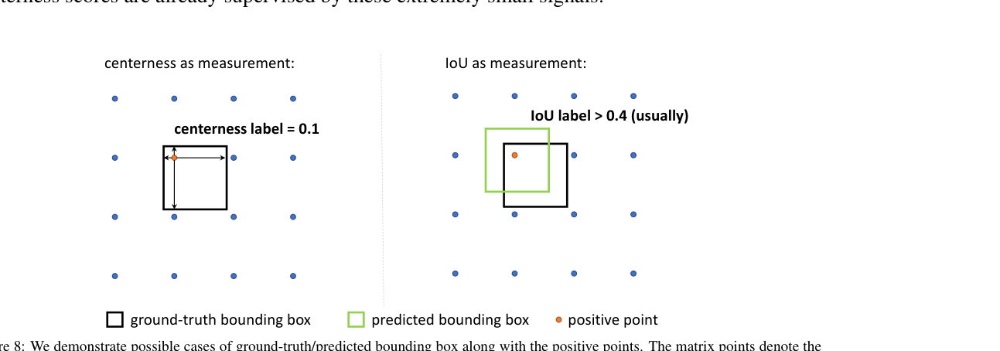

centerness 按其定义容易得到极小的标签（如 0.1），这类小信号监督出的预测分数会拉低 NMS 最终得分，使一批真值框难以被召回；IoU 标签则总被框监督推向 1.0 附近，更可靠。基于预训练 GFL（ResNet-50）统计 COCO 全部正样本的标签分布如下图：

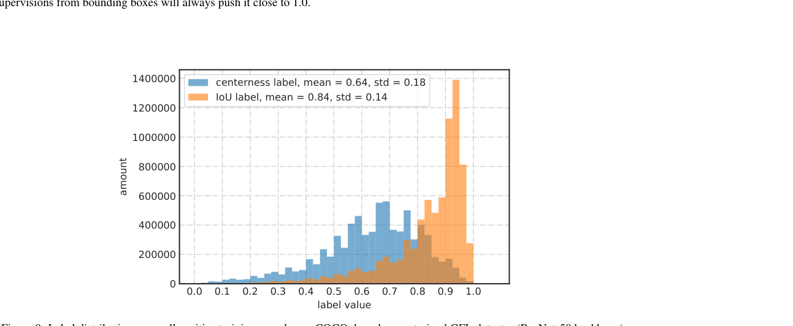

centerness 标签均值为 0.64、标准差 0.18，而 IoU 标签均值达 0.84、标准差仅 0.14，大部分 IoU 标签大于 0.4。可见 IoU 标签整体更大更集中，这也解释了联合表示中选择 IoU 作为质量度量的合理性。

## 优点和创新点

个人认为，本文有如下一些优点和创新点可供参考学习：

1. 把定位质量估计并入分类向量形成联合表示，以 QFL 端到端优化连续标签，使训练与推理打分完全一致，消除了乘积式两段打分的错位风险；
2. 放弃 Dirac delta 与高斯先验，直接学习边界框坐标的离散化 General distribution，配合 DFL 聚焦目标邻域概率，分布形状还能反映边界不确定性；
3. 将 FL、QFL、DFL 统一为同一个广义损失 GFL，取特例参数即可退化，理论表述简洁，且可零开销即插即用于任意一阶段检测器；
4. 实验丰富、说服力强：正交消融在强基线 ATSS 上绝对提升 1 AP 而 FPS 不变，COCO test-dev 上 45.0% AP 超越同期 SOTA，并给出 IoU 优于 centerness 的标签分布证据。
