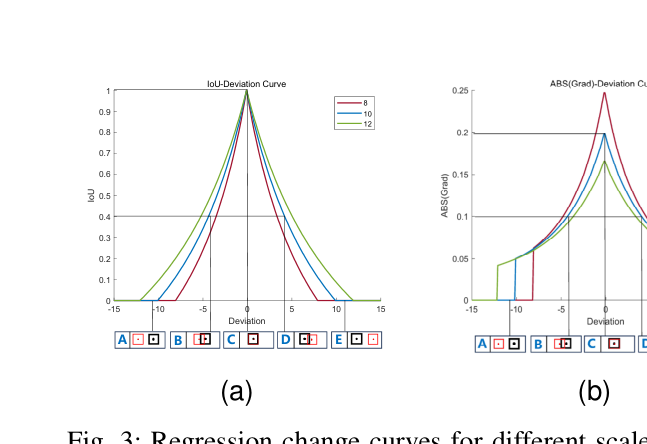
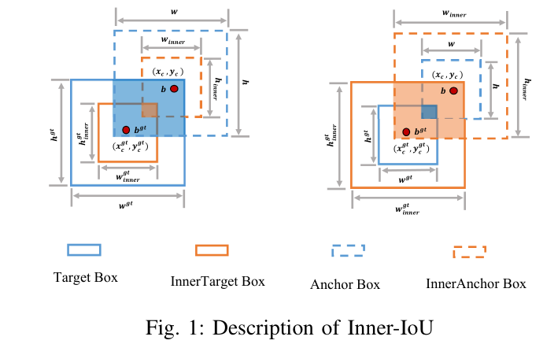
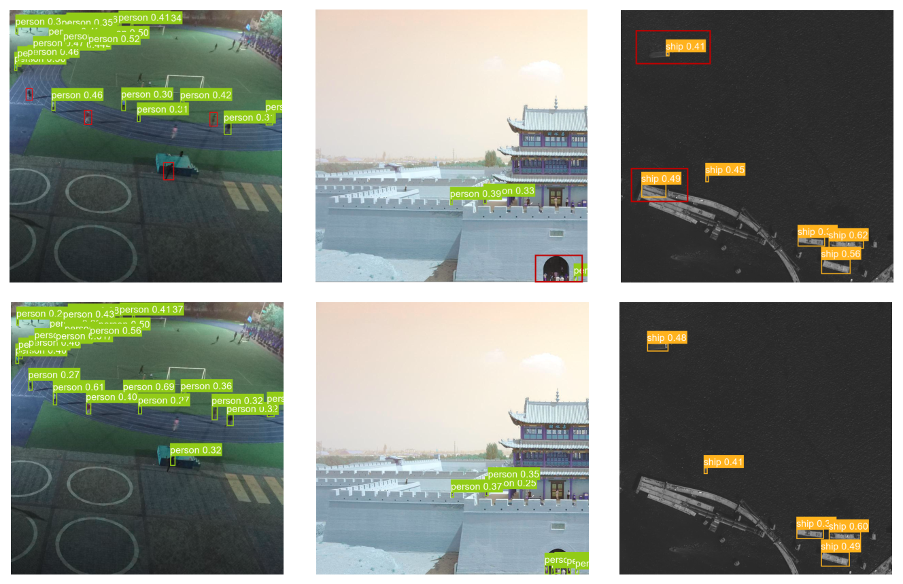
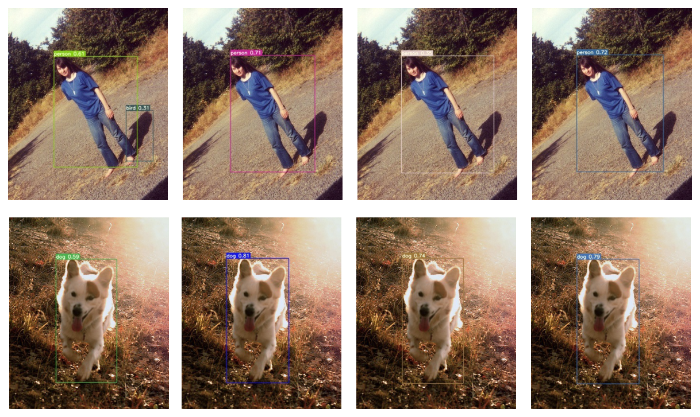
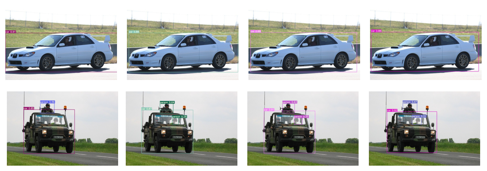
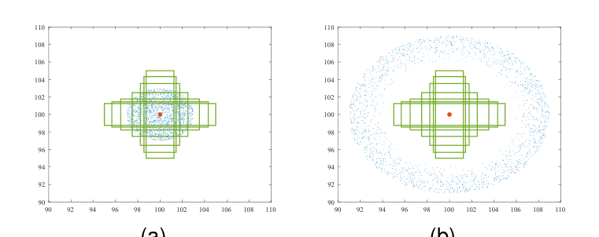
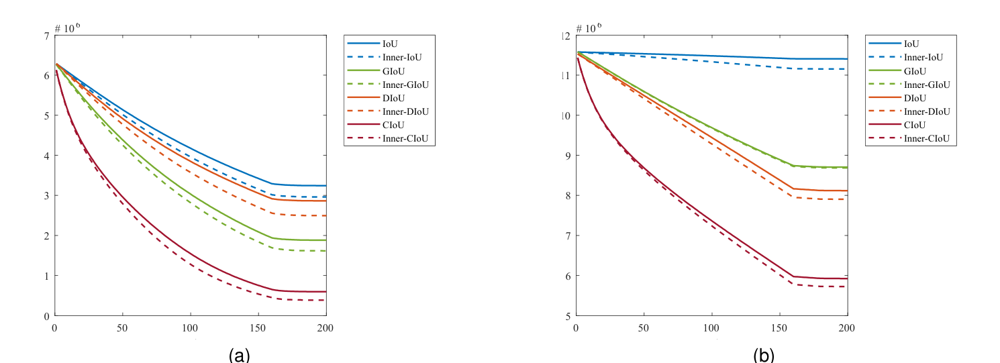
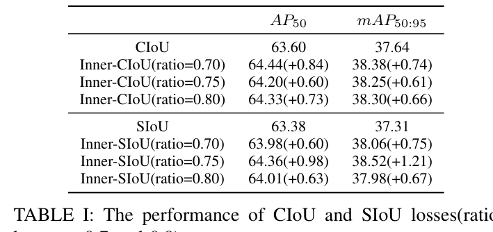
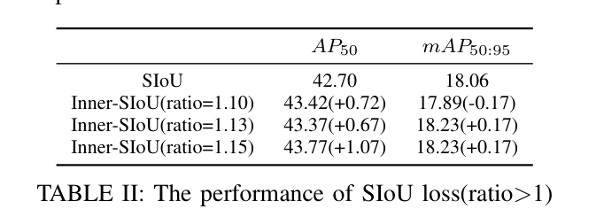
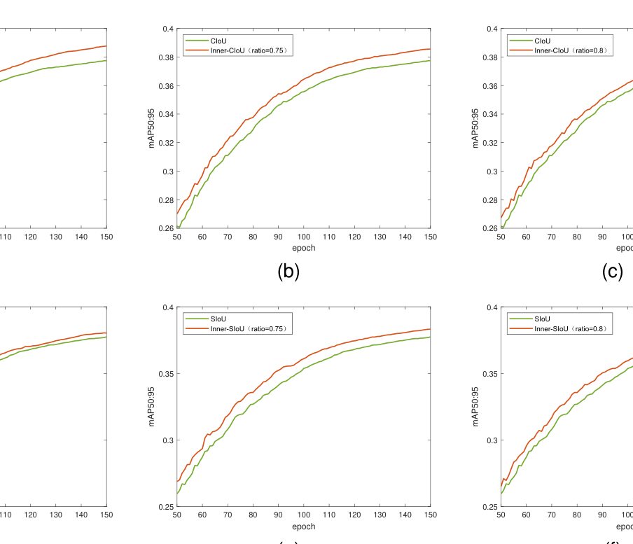

# Inner-IoU: More Effective Intersection over Union Loss with Auxiliary Bounding Box

Paper Reading 是从个人角度进行的一些总结分享，受到个人关注点的侧重和实力所限，可能有理解不到位的地方。具体的细节还需要以原文的内容为准，博客中的图表若未另外说明则均来自原文。

| 论文概况 | 详细 |
| --- | --- |
| 标题 | 《Inner-IoU: More Effective Intersection over Union Loss with Auxiliary Bounding Box》 |
| 作者 | Hao Zhang, Cong Xu, Shuaijie Zhang |
| 发表期刊 | arXiv preprint（arXiv:2311.02877） |
| 期刊等级 | 未获取 |
| 发表年份 | 2023 |
| 论文代码 | [https://github.com/malagoutou/Inner-IoU](https://github.com/malagoutou/Inner-IoU) |

作者单位：

1. 未获取

## 研究动机

边界框回归损失是检测器定位分支的重要组成部分，检测器的定位精度在很大程度上取决于边界框回归的质量。自 IoU 损失提出以来，主流改进路线都是在 IoU 项之上叠加新的几何损失项：GIoU 引入最小覆盖框解决无重叠时的梯度消失，DIoU 加入中心点归一化距离，CIoU 进一步考虑长宽比一致性，EIoU 直接最小化宽高差，SIoU 则引入角度代价，这些新项确实加快了收敛、提升了精度。然而，这条路线共同忽略了一个更底层的问题：IoU 损失项本身是固定的，它无法根据不同的检测器与检测任务调节自身，因而不具备强泛化能力——同一个损失在不同数据分布、不同目标尺度下的回归行为并不合适，新增的几何项并不能弥补这一点。局限由此逐层收窄：不是缺约束项，而是 IoU 项的计算方式本身缺乏可调性。暂未有工作从「用什么尺度的框来计算 IoU」这一角度改造损失项本身，本文即由此切入。

## 文章贡献

针对上述局限，本文提出了 Inner-IoU 损失，其核心是不新增任何损失项，而是用与真实框同中心、不同尺度的辅助边界框来计算 IoU，从而加速边界框回归。首先，本文分析边界框回归过程，得出高 IoU 样本适合用更小的辅助框计算损失、低 IoU 样本适合用更大的辅助框计算损失的结论；接着，本文引入缩放因子 ratio 控制辅助框的尺度大小，针对不同的数据集与检测器选取不同 ratio 以克服泛化性弱的限制；最终，本文把 Inner-IoU 嵌入 GIoU、DIoU、CIoU、EIoU、SIoU 等现有 IoU-based 损失中进行仿真与对比实验。实验表明，该方法在 PASCAL VOC 与 AI-TOD 两个数据集、YOLOv7-tiny 与 YOLOv5s 两种检测器上均取得进一步提升，AP50 与 mAP50:95 的提升超过 0.5 个百分点，验证了 Inner-IoU 的有效性与泛化能力。

## 本文方法

### IoU-based 回归损失回顾

IoU 度量的目标是刻画预测框与真值框的匹配程度，其定义为：

$$
\text{IoU} = \frac{|B \cap B^{gt}|}{|B \cup B^{gt}|}
$$

其中 $B$ 与 $B^{gt}$ 分别表示预测框与真值框。对应的回归损失定义为：

$$
L_{\text{IoU}} = 1 - \text{IoU}
$$

其后的一系列改进都在该式上叠加新项：GIoU 加入最小覆盖框 C 的惩罚项 $\frac{|C - B \cap B^{gt}|}{|C|}$；DIoU 加入中心点归一化距离 $\frac{\rho^2(b, b^{gt})}{c^2}$，其中 $\rho(\cdot)$ 是欧氏距离、$c$ 是最小包围框对角线；CIoU 在 DIoU 之上再加形状项 $\alpha v$，$v = \frac{4}{\pi^2}(\arctan \frac{w^{gt}}{h^{gt}} - \arctan \frac{w}{h})^2$ 度量长宽比一致性；EIoU 直接最小化宽高与中心的归一化差；SIoU 则引入角度、距离与形状三类代价。这些损失的 IoU 项都保持原样，正是本文要改造的对象。

### 边界框回归模式分析

本节的目标是揭示回归过程中 IoU 梯度与框尺度之间的关系，为辅助框设计提供依据。原文设实际框尺寸为 10，并以尺寸 8 与 12 的框作为辅助框，绘制 IoU-Deviation 曲线与梯度绝对值曲线，如下图所示：

图中 A 到 E 对应 anchor 与真值框的五种位置关系（红色框为宽高 10 的 anchor，黑色框为真值框），(a) 的纵轴是 IoU 值、(b) 的纵轴是 IoU 梯度绝对值，A 与 E 对应低 IoU 样本的回归状态、B 与 D 对应高 IoU 样本的回归状态。曲线形态上，尺寸 8 的辅助框在 B、D 状态附近提供更陡的梯度，尺寸 12 的辅助框则在 A、E 状态提供更大的梯度，与下述结论一致。原文由此得到三条结论：辅助框与实际框只有尺度差异，其 IoU 变化趋势与实际框一致，能反映真实回归质量；对高 IoU 样本，较小尺度辅助框的 IoU 梯度绝对值大于实际框；对低 IoU 样本，较大尺度辅助框的 IoU 梯度绝对值大于实际框。直观上，这意味着用更小的辅助框计算损失可以加速高 IoU 样本回归，用更大的辅助框则加速低 IoU 样本回归，该结论直接决定下文辅助框的生成方式。

### 辅助边界框的生成

辅助框生成的目标是按可控尺度缩放预测框与真值框而不改变其中心。记真值框与 anchor 为 $B^{gt}$ 与 $B$，中心分别为 $(x_c^{gt}, y_c^{gt})$ 与 $(x_c, y_c)$，宽高分别为 $w^{gt}, h^{gt}$ 与 $w, h$，缩放因子为 ratio（取值范围通常为 [0.5, 1.5]），辅助框的四边坐标计算为：

$$
\begin{aligned}
b_l^{gt} = x_c^{gt} - \frac{w^{gt} \cdot ratio}{2}, \quad & b_r^{gt} = x_c^{gt} + \frac{w^{gt} \cdot ratio}{2} \\
b_t^{gt} = y_c^{gt} - \frac{h^{gt} \cdot ratio}{2}, \quad & b_b^{gt} = y_c^{gt} + \frac{h^{gt} \cdot ratio}{2} \\
b_l = x_c - \frac{w \cdot ratio}{2}, \quad & b_r = x_c + \frac{w \cdot ratio}{2} \\
b_t = y_c - \frac{h \cdot ratio}{2}, \quad & b_b = y_c + \frac{h \cdot ratio}{2}
\end{aligned}
$$

其中带 $gt$ 上标的四边属于内真值框，不带上标的四边属于内 anchor 框。几何关系如下图所示：

图中 InnerAnchor Box 与 InnerTarget Box 分别由 anchor 与 target box 按 ratio 同中心缩放得到，二者与原框共享中心点。该生成过程只引入一个标量超参，输出的四边坐标送入下文的交集、并集与 Inner-IoU 计算。

### Inner-IoU 的定义

Inner-IoU 的目标是用辅助框的交并比替代原始交并比。基于上述四边坐标，交集与并集计算为：

$$
\begin{aligned}
inter &= (\min(b_r^{gt}, b_r) - \max(b_l^{gt}, b_l)) \cdot (\min(b_b^{gt}, b_b) - \max(b_t^{gt}, b_t)) \\
union &= (w^{gt} \cdot h^{gt}) \cdot ratio^2 + (w \cdot h) \cdot ratio^2 - inter \\
\text{IoU}^{inner} &= \frac{inter}{union}
\end{aligned}
$$

其中 $inter$ 是两个辅助框的重叠面积，$union$ 由两个辅助框各自的面积（原面积乘 $ratio^2$）之和减去重叠得到。给出一个简单的例子，假设真值框与预测框均为 10×10、预测框向右偏移 2 像素：原始 IoU 的交集为 8×10 = 80、并集为 120，IoU ≈ 0.667，损失为 0.333；取 ratio = 0.8 后辅助框均为 8×8，交集为 6×8 = 48，并集为 64 + 64 − 48 = 80，$\text{IoU}^{inner}$ = 0.6，损失为 0.4。可以看到，同样的偏差在缩小辅助框后损失更大、梯度信号更强，这正是高 IoU 样本收敛加速的来源。Inner-IoU 与 IoU 一样取值于 [0, 1]；由于辅助框与实际框之间只有尺度差异，损失的计算方式不变，Inner-IoU Deviation 曲线也与 IoU Deviation 曲线形状相似。该定义是纯替换式的：把任意 IoU-based 损失中的 IoU 换成 $\text{IoU}^{inner}$ 即得到新损失。

### ratio 缩放因子与回归性质

ratio 的目标是为不同数据集与检测器提供可调的辅助框尺度。当 ratio 小于 1 时，辅助框小于实际框，回归的有效范围比 IoU 损失更小，但梯度绝对值更大，因而加速高 IoU 样本的收敛；当 ratio 大于 1 时，较大的辅助框扩展了回归的有效范围，对低 IoU 样本的回归起增强作用。这与模式分析一节的两条梯度结论一一对应，也使 Inner-IoU 具备原损失所没有的任务自适应能力：同一检测器在不同数据上可以通过调节 ratio 获得合适的回归动力学。实验中的档位选择也体现了这一点：VOC 上 Inner 版本取 0.7、0.75、0.8 三档（小于 1，偏向高 IoU 样本），AI-TOD 上取 1.10、1.13、1.15 三档（大于 1，偏向低 IoU 样本），两个数据集的档位方向不同，说明 ratio 需要与数据分布相匹配。ratio 的取值效果在实验节的训练曲线与对比表中给出。

### 与现有 IoU-based 损失的集成

集成的目标是让 Inner-IoU 即插即用地替换现有损失中的 IoU 项。六种集成形式定义为：

$$
\begin{aligned}
L_{\text{Inner-IoU}} &= 1 - \text{IoU}^{inner} \\
L_{\text{Inner-GIoU}} &= L_{\text{GIoU}} + \text{IoU} - \text{IoU}^{inner} \\
L_{\text{Inner-DIoU}} &= L_{\text{DIoU}} + \text{IoU} - \text{IoU}^{inner} \\
L_{\text{Inner-CIoU}} &= L_{\text{CIoU}} + \text{IoU} - \text{IoU}^{inner} \\
L_{\text{Inner-EIoU}} &= L_{\text{EIoU}} + \text{IoU} - \text{IoU}^{inner} \\
L_{\text{Inner-SIoU}} &= L_{\text{SIoU}} + \text{IoU} - \text{IoU}^{inner}
\end{aligned}
$$

其中「加 IoU 减 $\text{IoU}^{inner}$」的写法等价于把原损失中的 IoU 项直接替换为 Inner-IoU，而保留其余几何项不变。这一形式不引入任何新损失项，只改变 IoU 项的计算尺度，因此对现有检测器的代码改动极小，也是本文泛化性主张的结构基础。

## 实验结果

### 实验设置

| 项目 | 设置 |
| --- | --- |
| 数据集一 | PASCAL VOC：VOC2007 trainval + VOC2012 trainval 共 16551 幅训练，VOC2007 test 4952 幅、20 类测试 |
| 数据集二 | AI-TOD：28036 幅航拍图、8 类、700621 个实例，训练与测试各 14018 幅，平均尺寸 12.8 像素 |
| 检测器 | YOLOv7-tiny（VOC）、YOLOv5s（AI-TOD） |
| 训练 | VOC 上训练 150 epochs |
| 指标 | AP50、mAP50:95 |
| 对比损失 | CIoU、SIoU 及其 Inner 版本（ratio 取不同档） |

### 可视化分析

先看定性检测效果。下图是 AI-TOD 测试集上 YOLOv5s 使用 SIoU（第一行）与 Inner-SIoU（第二行）的检测结果对比：

可以观察到第二行的定位框贴合目标更紧、密集微小目标区域的漏检与错位明显少于第一行。VOC 测试集上的两组对比如下图所示：

前一组是 CIoU 与其 Inner 版本（ratio 取 0.7、0.75、0.8）的对比，Inner 版本的框更贴合目标边缘：

后一组是 SIoU 与其 Inner 版本（ratio 取 0.7、0.75、0.8）的对比，同样可见误检与漏检更少，且不同 ratio 之间效果稳定。可见 Inner-IoU 的收益在常尺度与微小尺度目标上都直观可见，与后文的定量结果相互印证。

### 仿真实验

仿真实验的目标是在可控设定下验证不同 ratio 对高低 IoU 样本收敛速度的影响。原文设置七个绿色目标框，中心为 (100, 100)，长宽比取 1:4、1:3、1:2、1:1、2:1、3:1、4:1；anchor 的位置与尺度采样如下图所示：

图 (a) 为高 IoU 回归样本场景，2000 个位置点以 (100, 100) 为中心、半径 3 分布；图 (b) 为低 IoU 场景，半径为 6 到 9；两种场景下 anchor 面积均取 0.5、0.67、0.75、1、1.33、1.5、2 七档并配七种长宽比，每个目标框需拟合 2000×7×7 个 anchor，总计 686000 个压缩案例。回归误差随迭代次数的变化如下图所示：

图 (a) 在高 IoU 场景下取 ratio 0.8、图 (b) 在低 IoU 场景下取 ratio 1.2，横轴为迭代次数、纵轴为回归误差，虚线为 Inner-IoU 系列方法。可以看到虚线的回归误差下降始终快于 IoU、GIoU、DIoU、CIoU 的实线，表明按样本状态选择辅助框尺度确实能加速收敛，与模式分析的梯度结论一致。

### 定量对比

VOC 测试集上 CIoU 与 SIoU 及其 Inner 版本的定量结果如下表所示。

Inner-CIoU 在 ratio 0.70 时取得 64.44 的 AP50（+0.84），Inner-SIoU 在 ratio 0.75 时取得 64.36 的 AP50（+0.98）与 38.52 的 mAP50:95（+1.21），各档 ratio 相对基线均为正提升；原文也总结道，应用本文方法后 AP50 与 mAP50:95 的提升超过 0.5 个百分点，与表中各档增量相符。AI-TOD 测试集上 ratio 大于 1 的结果如下表所示。

Inner-SIoU 在 ratio 1.15 时取得 43.77 的 AP50（+1.07）与 18.23 的 mAP50:95（+0.17）；ratio 1.10 档的 mAP50:95 出现 -0.17 的小幅回落，说明 ratio 的取值需要与数据匹配。两个数据集上的结果共同表明 Inner-IoU 对常尺度与微小尺度目标都有效。

### 训练曲线与 ratio 敏感性

VOC 上 150 epochs 训练过程中 50 到 150 epoch 区间的 mAP50:95 曲线如下图所示，橙色为 Inner 方法、绿色为原方法，(a)(b)(c) 对应 CIoU 在 ratio 0.7、0.75、0.8 下的对比，(d)(e)(f) 对应 SIoU 的三档 ratio：

六幅子图中橙色曲线在整个区间内基本都位于绿色曲线上方，且不同 ratio 档之间差距不大。可见 Inner-IoU 的优势贯穿训练全过程而非仅在末期体现，同时对 ratio 的小幅变动保持稳健，工程上只需在 [0.5, 1.5] 范围内粗调即可。结合定量表还可以看到，VOC 上 AP50 与 mAP50:95 两项指标的提升幅度较为均衡，而 AI-TOD 上提升更多体现在 AP50，说明在微小目标数据集上 Inner-IoU 首先改善的是粗定位与召回。

## 优点和创新点

个人认为，本文有如下一些优点和创新点可供参考学习：

1. 从 IoU 项本身而非新增约束项入手，用同中心不同尺度的辅助边界框计算 IoU 以加速回归，不增加任何新损失项，原理简单、对现有检测器的改动成本极低；
2. 引入缩放因子 ratio 控制辅助框尺度，ratio 小于 1 利于高 IoU 样本、大于 1 利于低 IoU 样本，使同一个损失能按数据集与检测器自适应调节，泛化性较好；
3. 实验丰富、说服力强：686000 个仿真压缩案例验证收敛优势，VOC 与 AI-TOD 两个数据集、YOLOv7-tiny 与 YOLOv5s 两种检测器上 AP50 与 mAP50:95 一致提升，并给出训练曲线佐证。
