# Multi-Branch Auxiliary Fusion YOLO with Re-parameterization Heterogeneous Convolutional for accurate object detection

Paper Reading 是从个人角度进行的一些总结分享，受到个人关注点的侧重和实力所限，可能有理解不到位的地方。具体的细节还需要以原文的内容为准，博客中的图表若未另外说明则均来自原文。

| 论文概况 | 详细 |
| --- | --- |
| 标题 | 《Multi-Branch Auxiliary Fusion YOLO with Re-parameterization Heterogeneous Convolutional for accurate object detection》 |
| 作者 | Zhiqiang Yang、Qiu Guan、Keer Zhao、Jianmin Yang、Xinli Xu、Haixia Long、Ying Tang |
| 发表会议 | 未获取（arXiv 预印本，编号 arXiv:2407.04381） |
| 会议等级 | 未获取 |
| 发表年份 | 2024 |
| 论文代码 | [https://github.com/yang-0201/MAF-YOLO](https://github.com/yang-0201/MAF-YOLO) |

作者单位：

1. 浙江工业大学（Zhejiang University of Technology）
2. 浙江体育职业技术学院（Zhejiang College of Sports）

## 研究动机

多尺度特征融合是决定 YOLO 系实时检测器精度的核心环节，表现为颈部把骨干不同分辨率的输出汇聚为各预测层特征，导致融合是否充分直接决定小目标漏检率与尺度均衡性。PAFPN 以自顶向下与自底向上双路径增强特征整合，在控制计算成本的同时提升精度，已被广泛集成进 YOLO 系列。然而 PAFPN 仍存在两处局限：一是各融合块倾向合并同质尺度的特征图，缺乏跨分辨率层信息的整合，例如第一个块的输入只有上采样的 P5 与同层 P4，忽略了 P3 层的浅层低级别空间信息，第二个块也没有直接融合承载小目标关键信息的 P2 层，后两个块同样存在这一缺失；二是小目标检测层的特征只由单一的自底向上路径与两个融合块供给，显著削弱了模型对微小物体特征的学习与表达能力。BIC、RepGFPN、Gold-YOLO 的 gather-and-distribute 机制等工作缓解了浅层信息利用不足的问题，但浅层信息的保留比例与梯度信息的传递路径仍未被同时处理好。暂未有颈部结构能在保留适量浅层空间信息的同时，向输出层传递足够多样的多尺度梯度信息。

## 文章贡献

针对 PAFPN 跨分辨率融合不足与梯度路径单一的问题，本文提出了 MAF-YOLO 检测框架，其核心是多功能颈部 Multi-Branch Auxiliary FPN（MAFPN）：浅层辅助融合模块 SAF 以双向连接把骨干浅层信息作为辅助分支并入颈部，保留适量浅层空间信息以利于后续学习；深层辅助融合模块 AAF 深嵌于颈部内部，以多向连接把更丰富的梯度信息传递给输出层。首先本文设计轻量化的重参数化异构高效层聚合网络 RepHELAN，在架构与卷积两个层级同时引入异构大卷积核，接着提出全局异构核选择机制 GHSK，按分辨率层自适应调整核尺寸以扩大有效感受野，最终在 MS COCO 上以 nano、small、medium 三个尺度验证框架的有效性。实验表明，MAF-YOLOn 以 3.76M 可学习参数与 10.51G FLOPs 取得 42.4% AP，超过 YOLOv8n 约 5.1%，MAF-YOLOs 与 MAF-YOLOm 也分别以 47.4% 与 51.2% AP 领先 YOLOv9s、YOLOMS 等同尺度实时检测器。

## 本文方法

### 宏观架构

MAF-YOLO 沿用单阶段检测器 backbone、neck、head 的三段式组织，把改进集中在颈部与特征提取块。整体结构如下图所示。

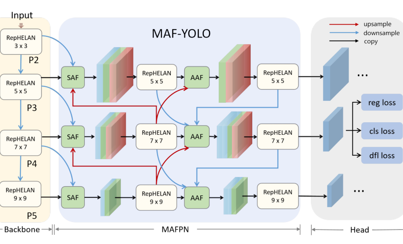

输入图像先经过四个阶段的骨干，输出 P2、P3、P4、P5 四层特征；MAFPN 的第一条路径中 SAF 模块从骨干抽取多尺度特征并在颈部浅层做初步辅助融合，第二条路径中 AAF 通过更密集的连接收集各层梯度信息，最终引导检测头获得三个分辨率上的多样化输出；两条路径的特征提取均采用 RepHELAN 模块，以动态尺寸的卷积核实现自适应感受野。骨干的四阶段特征分别作为主输入与辅助分支送入 MAFPN，MAFPN 的三分辨率输出再送入检测头预测边界框与类别并计算损失。

### 全局异构核选择机制

GHSK 用于在架构层面自适应地扩大整网有效感受野。Transformer 的有效性部分来自在全局或更大窗口上做 query-key-value 操作的自注意力，大卷积核同样能同时捕获局部与全局特征；Trident Network 的研究表明更大的感受野利于检测大物体，而小尺度目标则受益于较小的感受野；YOLO-MS 据此提出异构核选择协议，在骨干中以 3、5、7、9 递增的卷积核平衡性能与速度。本文把这一思想扩展为全局机制：骨干 RepHELAN 的卷积核尺寸按阶段递增取 $\{3, 5, 7, 9\}$，MAFPN 中再按不同分辨率引入 $\{5, 7, 9\}$ 的大卷积核，逐级获得多尺度感受野信息。GHSK 不以独立模块存在，而是作为核尺寸配置策略落实在 RepHELAN 与 MAFPN 的每一个卷积块中，为后文的融合模块与特征提取块提供感受野基础。

### 浅层辅助融合 SAF

SAF 模块用于把骨干的浅层空间信息以辅助分支形式并入颈部浅层，保留丰富的定位细节。精确分类依赖深层网络的粗粒度信息，而精确定位依赖浅层网络的边缘细节，但骨干提供的浅层信息相对初级、易受干扰，因此本文将其作为辅助分支加入深层网络以保证后续层学习的稳定。SAF 的结构如下图所示，其主目标是把深层信息与同层级特征、骨干中高分辨率浅层特征整合在一起。

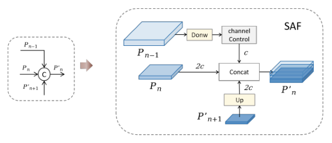

SAF 同时用 1×1 卷积控制浅层信息的通道数，使其在 concat 中占较小比例而不影响后续学习。记 $P_{n-1}$、$P_n$、$P_{n+1}$ 为不同分辨率的特征图，应用 SAF 后的输出结果为：

$$P'_n = concat(\delta(C(Down(P_{n-1}))), P_n, U(P'_{n+1}))$$

其中 $P'_n$ 是应用 SAF 后的输出特征，$P_n$ 为骨干送来的同层特征，$Down(P_{n-1})$ 是对浅层特征 $P_{n-1}$ 的下采样支路，$U(P'_{n+1})$ 为对深层特征 $P'_{n+1}$ 的上采样支路。各符号的完整含义如下表所示：

| 符号 | 含义 |
| --- | --- |
| $P_n$、$P_{n-1}$ | 骨干同层与浅层特征图，$P_{n-1}, P_n, P_{n+1} \in R^{H \times W \times C}$ |
| $P'_n$、$P''_n$ | MAFPN 第一条与第二条路径上的特征层 |
| $U(\cdot)$ | 上采样操作 |
| $Down$ | 带批归一化层的 3×3 下采样卷积 |
| $\delta$ | silu 激活函数 |
| $C$ | 控制通道数的 1×1 卷积 |

该式把下采样后的浅层辅助分支、同层骨干特征与上采样来的深层特征拼接，使浅层定位细节在第一路径中即被保留。直观上，三条支路的通道配比决定了浅层细节的保留程度，1×1 卷积就是这个配比的旋钮。SAF 的输出 $P'_n$ 一方面送入本路径下一层，另一方面作为 AAF 的输入之一。

### 深层辅助融合 AAF

AAF 模块部署在 MAFPN 较深层，用于以多向连接做更大范围的多尺度信息聚合。其结构如下图所示，$P''_n$ 上的 AAF 连接同时聚合四类信息。

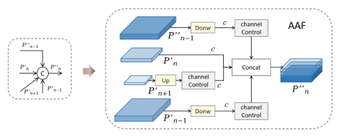

应用 AAF 后的输出结果为：

$$P''_n = concat(\delta(C(Down(P'_{n-1}))), \delta(C(Down(P''_{n-1}))), P'_n, C(U(P'_{n+1})))$$

其中 $P''_n$ 是应用 AAF 后第二条路径上的输出特征，$P'_{n-1}$ 与 $P''_{n-1}$ 分别是第一、第二条路径的前一层输出，$P'_n$ 为同层浅层特征，$P'_{n+1}$ 是第一条路径的相邻层特征。各符号的完整含义如下表所示：

| 符号 | 含义 |
| --- | --- |
| $P'_{n+1}$、$P'_{n-1}$ | 第一路径的浅层高分辨率与浅层低分辨率特征 |
| $P'_n$ | 同层浅层特征 |
| $P''_{n-1}$ | 第二路径的前一层输出 |
| 其余符号 | 与 SAF 公式相同 |

四个分支分别对应浅层高分辨率、浅层低分辨率、同层浅层与前一层输出，使最终输出层 P4 能同时合并四个不同层的信息，显著增强中等尺寸目标的性能。直观上，该式把来自不同层级与不同路径的四路特征一并汇入当前层，等价于把 PAFPN 的单一融合点扩展为多向汇聚点。AAF 同样用 1×1 卷积控制各层影响；实验发现若沿用 SAF 中浅层通道数取深层一半的策略会带来轻微性能退化，考虑到初始引导信息已蕴含在 MAFPN 浅层中，本文将各层通道数取齐以保证模型获得多样化输出。AAF 的三个分辨率输出即 MAFPN 的最终结果，直接送入检测头。

### RepHELAN 结构

RepHELAN 是贯穿骨干与颈部的特征提取块，用于高效学习表达力强的多尺度特征表示。其结构如下图所示。

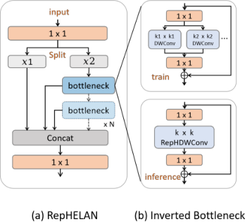

输入信息先经 1×1 卷积与 Split 操作分成两股：一股保留原始信息直接进入 Concat，另一股经过 N 个倒置瓶颈单元；依照 ELAN 机制，分支本身与每个倒置瓶颈的输出都被保留并最终拼接在一起。倒置瓶颈内部先以 1×1 卷积扩张通道数，接着做 k×k 的 RepHDWConv，最后以 1×1 逐点卷积收缩通道并补偿 DWConv 可能造成的信息损失。RepHELAN 作为统一计算块替换骨干与 MAFPN 中的特征提取位置，其内部 RepHDWConv 的核尺寸即 GHSK 策略的落点，输出交给后续融合模块或检测头。

### RepHDWConv 与重参数化合并

RepHDWConv 用于在训练期并行运行大小卷积核、在推理期合并为单一卷积，使感受野扩张不带来推理代价。大卷积核能通过编码更大区域提升性能，但可能遮蔽与小目标相关的细节；本文因此把异构思想从全局架构下放到单个卷积，并引入重参数化技术：训练时并行 n 个不同尺寸的深度卷积，推理时合并为一个，速度不下降。以 7×7 RepHDWConv 为例，重参数化过程如下图所示。

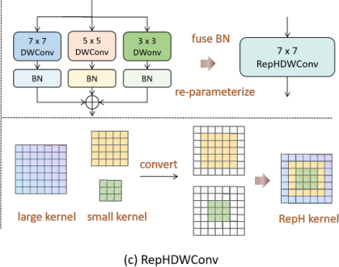

第一步将 k1×k1 大 DWConv 与若干 k2×k2 小 DWConv 并行，每个 DWConv 后接批归一化层，卷积核参数先与对应 bn 层参数合并；第二步通过类似填充的过程把小 DWConv 吸收进大 DWConv；最后把这些异构 DWConv 的参数与偏置累加，形成新的 RepHDWConv。记 $I$ 为输入特征图，合并后输出特征图 $O$ 的计算为：

$$O = I \otimes \left(K_{2n-1} + \sum_{i=1}^{m} K_{2n-(2i+1)}\right) + \left(B_{2n-1} + \sum_{i=1}^{m} B_{2n-(2i+1)}\right)$$

其中 $K_{n}$ 与 $B_{n}$ 分别是 n×n 核卷积的权重与偏置，$n \geq 3$，$m$ 是满足 $2n - (2m + 1) \geq 3$ 的最大整数。给出一个简单的例子，取 7×7 RepHDWConv，即 $2n - 1 = 7$、$n = 4$，此时 $m = 2$，被合并的分支为 7×7、5×5、3×3 三个深度卷积；设某位置上三支核权重为 0.5、1、2（小核已零填充），偏置为 0.1、0.2、0.3，则合并后 7×7 核在该位置的权重为 3.5、偏置为 0.6。可以看到，重参数化把训练期的异构并行分支转化为推理期一次深度卷积内的核参数累加，多尺度感知以零推理开销实现。这等价于把多尺度感知的全部开销留在训练期，推理计算图里只剩一个深度卷积。RepHDWConv 嵌在 RepHELAN 的倒置瓶颈中，本文还用它替换了 YOLOv6 输出头中的两个 3×3 卷积。

## 实验结果

### 实验设置

全部实验在 MS COCO 2017 上进行：115k 训练图用于训练，5000 张验证图用于消融研究，报告标准 AP 及不同 IoU 阈值与目标尺度下的 AP50、APs、APm、APl。实现基于 YOLOv6-2.0 框架，在 8 块 NVIDIA GeForce RTX 2080Ti 上从零训练 300 epochs，不依赖 ImageNet 等预训练权重；数据增强采用更强的动态 cache-based mixup 与 mosaic 机制，并将 YOLOv6 输出头中的两个 3×3 卷积替换为轻量 RepHDWConv。

### 对比实验

COCO 验证集上的定性检测结果如下图所示，与 YOLOv6n、YOLOv7t、YOLOv8n 相比，MAF-YOLOn 在密集小目标场景下给出更完整的检测框、漏检更少。

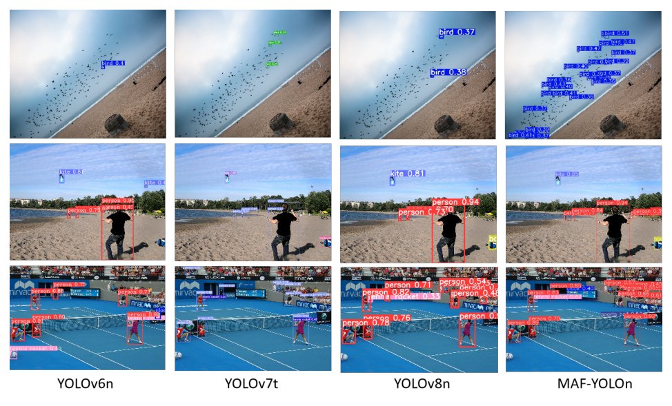

与主流实时检测器的定量对比见原文 Table 6，截图如下。

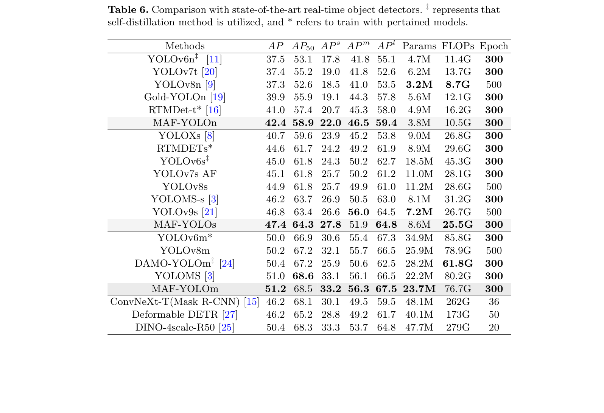

nano 尺度上 MAF-YOLOn 以 3.8M 参数与 10.5G FLOPs 取得 42.4% AP，比 YOLOv8n 高 5.1%，相比 Gold-YOLOn 减少约 36% 参数与 13% 计算量仍提升 2.5% AP；small 尺度上 MAF-YOLOs 以 47.4% AP 领先，比 YOLOv7s AF 参数少 22% 且 AP 高 2.3%，与 YOLOv9s 参数量和计算量相当时仍高 0.6 AP；medium 尺度上 MAF-YOLOm 的 51.2% AP 超过 YOLOMS 与 YOLOv8m，参数量也远低于 DINO-4scale-R50 等 transformer 检测器。可见 MAFPN 与 RepHELAN 带来的增益在 nano、small、medium 三档尺度上保持一致。

### 消融实验

消融按计算块、颈部模块、整体组件三层展开。不同计算块的对比如下表所示。

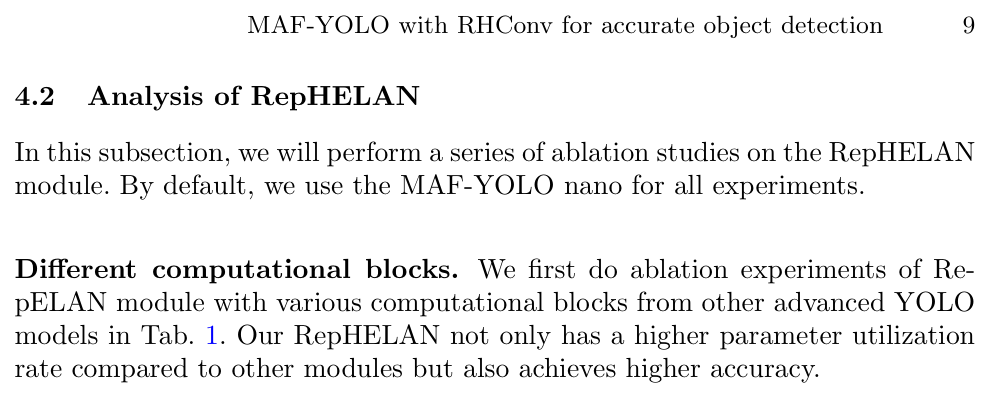

计算块对比（原文 Table 1）中 RepHELAN 以 3.9M 参数、11.1G FLOPs 取得 42.4 AP，比 C3 的 41.0 AP 与 C2f 的 41.3 AP 分别高 1.4 与 1.1，参数利用率与精度均高于 C3、C2f 与 CSPNextBlock，可见 ELAN 式多分支聚合在同等开销下换来更高精度。

RepHELAN 内部的结构消融如下表所示。

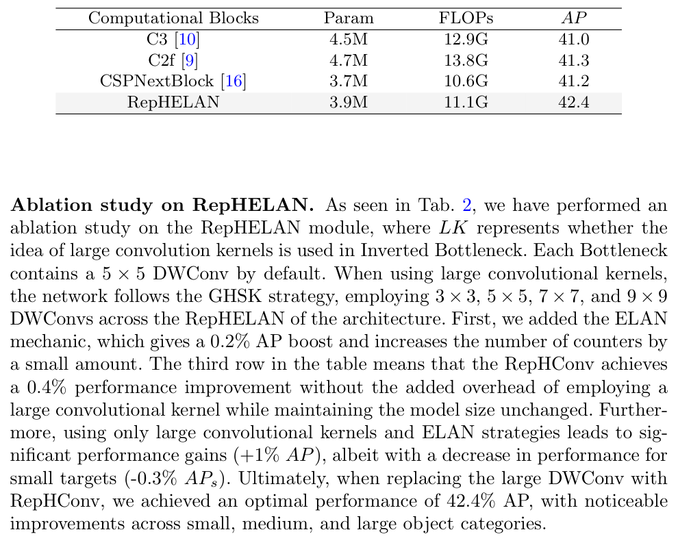

RepHELAN 内部消融（原文 Table 2）显示，单独加入 ELAN 机制提升 0.2 AP，不引入大核时 RepHConv 再提升 0.4 AP 且模型尺寸不变；只使用大核与 ELAN 时 AP 提升 1 个点但 APs 下降 0.3，而把大 DWConv 替换为 RepHConv 后 APs 回升到 22.0、总 AP 达 42.4，表明异构并行核正好补上了大核遮蔽小目标细节的损失。

颈部模块的消融如下表所示。

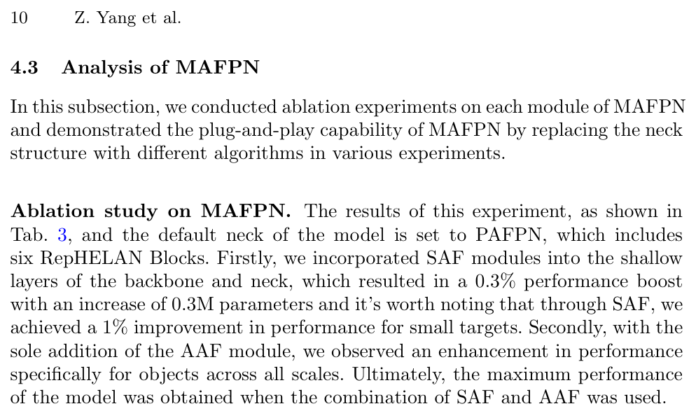

MAFPN 消融（原文 Table 3）显示，单独加入 SAF 提升 0.3 AP 且小目标 APs 从 21.0 提到 22.0，单独加入 AAF 后 AP、APm、APl 分别达到 42.0、46.4 与 59.2，各尺度均有增强，两者组合达到 42.4 AP。

MAFPN 的即插即用验证如下表所示。

把 YOLOv8n 的 PAFPN 换成 MAFPN 后，训练轮数少 200 epochs、参数更少，AP 仍提升 2 个点；在两阶段 Cascade Mask R-CNN 的实例分割任务中替换 FPN 后 bbox AP 与 segm AP 分别升到 42.8 与 36.3，验证了 MAFPN 的即插即用性。

整体组件的消融如下表所示。

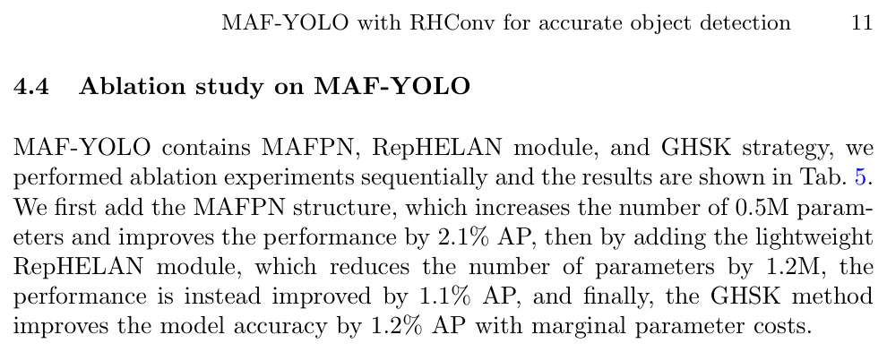

整体组件消融（原文 Table 5）中 MAFPN 贡献 +2.1 AP，RepHELAN 在减少 1.2M 参数的同时再提升 1.1 AP，GHSK 最终以边际参数代价把精度推到 42.4 AP。

### 可视化分析

颈部输出的 Grad-CAM++ 可视化如下图所示，(a) 为传统 PAFPN 结构，(b)、(c) 分别为 YOLOv8n 与 MAF-YOLOn 在小、中、大三类物体输出层上的激活结果。

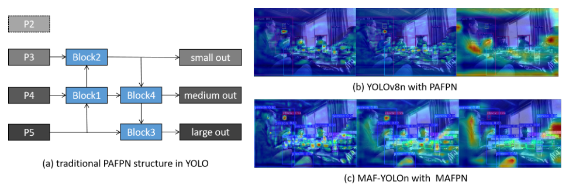

PAFPN 的同质尺度融合限制了跨分辨率层的信息流动，激活区域相对分散；MAF-YOLOn 在物体边缘与小目标区域的响应更完整、更集中。可见精度增益来自更丰富的多尺度特征激活，与前文的定量指标互相印证。

## 优点和创新点

个人认为，本文有如下一些优点和创新点可供参考学习：

1. 针对 PAFPN 只融合同质尺度特征的问题设计 SAF 与 AAF 两级辅助融合，以双向与多向连接同时保留浅层定位信息并丰富输出层梯度路径，颈部改进思路清晰且消融完整。
2. 把异构大卷积核从架构级配置下放到单个卷积设计，训练期并行多尺度深度卷积、推理期重参数化合并为一个，以零推理开销扩大有效感受野并兼顾小目标细节。
3. MAFPN 具备即插即用属性，在 YOLOv8n 与两阶段 Cascade Mask R-CNN 上替换颈部均获一致增益，配合 COCO 三档尺度的对比实验，对融合结构的通用性说服力强。
