# 基于 MNBS-YOLOV12 的肾脏肿瘤病变区域检测

Paper Reading 是从个人角度进行的一些总结分享，受到个人关注点的侧重和实力所限，可能有理解不到位的地方。具体的细节还需要以原文的内容为准，博客中的图表若未另外说明则均来自原文。

| 论文概况 | 详细 |
| --- | --- |
| 标题 | 《基于 MNBS-YOLOV12 的肾脏肿瘤病变区域检测》 |
| 作者 | 杨丹丹、王霄、吴钦木、何志琴、罗霞 |
| 发表期刊 | 计算机工程与应用（网络首发） |
| 期刊等级 | 北大核心 |
| 发表年份 | 2026 |
| 论文代码 | 未获取 |

作者单位：

1. 贵州大学电气工程学院，贵阳 550025
2. 贵州省高等学校新型电力系统及其数字化技术工程研究中心，贵阳 550025

## 研究动机

肾脏肿瘤的精准检测是医学影像计算与计算机辅助干预的重要问题，在 CT 图像中表现为对病变区域的准确识别与定位，直接影响早期诊断、治疗方案制定与预后评估。然而，肾脏病灶尺寸跨度大（从微小钙化至弥漫性病变）、形态多数不规则，且肿瘤组织与正常肾实质在影像学上常呈现相似的纹理特征，导致现有方法难以捕捉跨尺度的差异化表征，在模糊边界与复杂背景干扰下易产生误检与漏检。已有工作分别从不同侧面推进：有工作将 YOLOv8 与动态卷积、CBAM 结合并以 InnerGIoU 替换 CIoU 计算边界框损失；有工作以增强 UNet 分割肿瘤、量子熵界定边界的双分支策略兼顾精度与边界；有工作将 2D-CNN 扩展为多模态 3D-CNN 以提取模态间差异信息；还有工作结合 SqueezeNet、深度残差网络与分数微积分检测肾脏肿瘤。但这些方法多面向分割、分类等特定任务，通用目标检测范式在处理肾脏肿瘤这一特定医学任务时，对形态不规则、边界模糊与多尺度融合三类挑战缺乏具体而统一的应对方案。暂未有工作在一个实时检测框架内同时建模复杂形态表征、多尺度特征融合与模糊边界识别三个环节。

## 文章贡献

针对上述局限，本文提出了 MNBS-YOLOv12，其核心是在 YOLOv12 框架上沿特征表征、特征融合与回归损失三条线索做四处改进。首先在 A2C2f 模块中嵌入十字形窗口自注意力 CSWin-SA，通过水平与垂直方向的条纹自注意力学习增强对不规则形状病变区域的表征能力；接着引入高效多尺度注意力 EMA 并与 C3k2 结构结合，采用通道分组与维度重塑策略减少计算开销，捕获从微小钙化至弥漫性病变的差异化特征；然后设计双聚合注意力融合模块 DAFM 替代传统特征拼接，以自注意力保持肿瘤结构完整性、以交叉注意力深度融合多尺度互补信息；最终采用扩展的 B_CIoU 损失函数，在 CIoU 基础上增加三项约束以提升定位精度与收敛速度。实验表明，MNBS-YOLOv12 在 KiTS 数据集上的精确率、召回率、mAP50 与 mAP50-95 分别达到 95.75%、97.77%、98.35% 与 93.65%，较 YOLOv12 基线分别提升 2.72、2.06、2.54 和 1.83 个百分点。

## 本文方法

MNBS-YOLOv12 的四处改进分别落在骨干的特征提取、Neck 的特征融合与检测头的回归损失上，形成特征筛选、语义引导、空间约束到几何优化的递进流程。

### MNBS-YOLOv12 整体架构

MNBS-YOLOv12 在 YOLOv12 的 Backbone-Neck-Head 流水线上完成四处替换与增强，网络结构如下图所示。

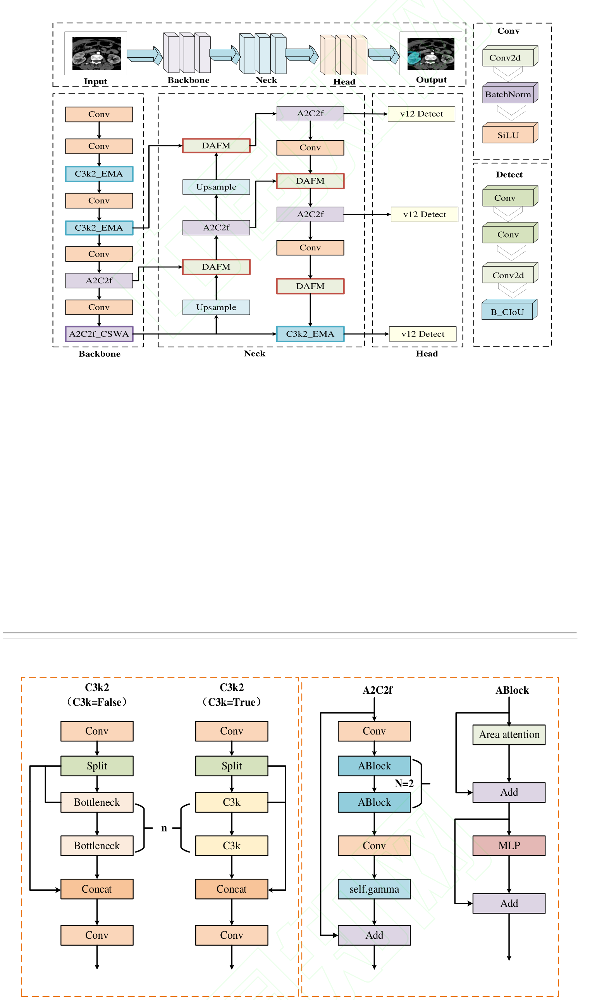

骨干网络中以 C3k2_EMA 替换部分 C3k2 模块、以嵌入 CSWin-SA 的 A2C2f_CSWA 强化深层特征；Neck 中以 DAFM 替换原始的 Concat 拼接，承担多尺度特征的融合；检测头沿用 v12 Detect，但将边界框回归损失替换为 B_CIoU。四处改进各自对应一类核心挑战：形态不规则与空间上下文缺失交给 CSWin-SA，边界模糊与背景干扰交给 EMA-C3k2，多尺度融合中小病变丢失交给 DAFM，定位精度不足交给 B_CIoU，其输出沿原数据流逐级传递至检测头。

### CSWin-SA 十字形窗口自注意力

CSWin-SA 用于以可控的计算开销建模肾脏解剖轴线方向的长程空间依赖，其核心结构如下图所示。

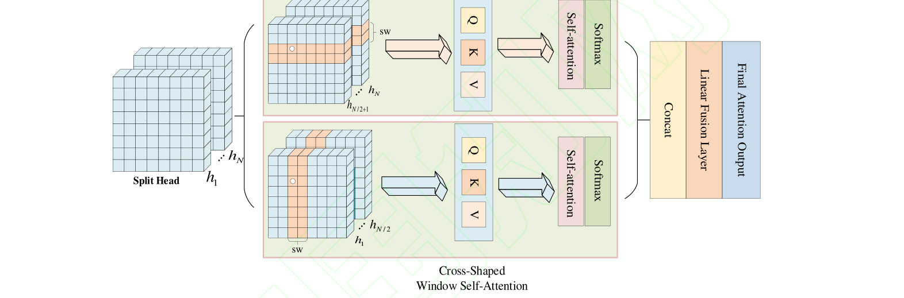

肾脏内部结构呈现显著的空间各向异性：肾动脉呈放射状分支对应水平方向，肾锥体与集合系统纵向走行对应垂直方向。CSWin-SA 将 N 个注意力头均分为两组，分别在水平与垂直条纹上并行执行自注意力计算，条纹宽度由可调参数 sw 控制。对于水平组的第 n 个注意力头，条纹特征经线性变换映射为查询、键、值后在条纹内部执行标准自注意力，具体实现公式如下：

$$
\begin{aligned}
Y_n^i &= \mathrm{Softmax}\!\left(\frac{Q_n^i (K_n^i)^{T}}{\sqrt{d}}\right) V_n^i \\
H\_\mathrm{Attention}(X) &= [Y_n^1, Y_n^2, \dots, Y_n^M]
\end{aligned}
$$

其中各符号的含义为：

| 符号 | 含义 |
| --- | --- |
| $Q_n^i$、$K_n^i$、$V_n^i$ | 第 n 个注意力头第 i 个条纹特征的查询、键、值向量 |
| $d$ | 缩放因子所用的键向量维度 |
| $M$ | 水平条纹总数，由特征图高度 H 与条纹宽度 sw 决定 |

垂直条纹划分同理，在宽度方向切割形成 S 个垂直条纹。完成所有条纹的并行计算后，两组注意力头的输出按空间维度拼接并经线性融合层生成综合特征表示，定义如下：

$$
\begin{aligned}
h_n &= \begin{cases} H\_\mathrm{Attention}(X), & n = 1, 2, \dots, N/2 \\ V\_\mathrm{Attention}(X), & n = N/2+1, \dots, N \end{cases} \\
\mathrm{CSWin\_Attention}(X) &= W^{o}\,\mathrm{concat}(h_1, h_2, \dots, h_N)
\end{aligned}
$$

其中 $H\_\mathrm{Attention}$ 与 $V\_\mathrm{Attention}$ 分别为水平与垂直条纹注意力，$W^{o}$ 为线性融合层。直观上，十字形窗口把不规则的肿瘤凸起视作两个正交方向的矢量和：只要凸起在血管方向或集合系统方向上具有连续性分量，狭长条纹感受野就能在单一窗口内完整覆盖其基底部与尖端，从而在特征编码层面保持不规则边界的拓扑连续性。该模块嵌入骨干的 A2C2f 中，其输出特征按原路径送入 Neck 参与融合。

### C3k2_EMA 多尺度纹理辨析

EMA 与 C3k2 结合用于区分肿瘤与正常肾实质之间微妙的纹理差异，其具体结构如下图所示。

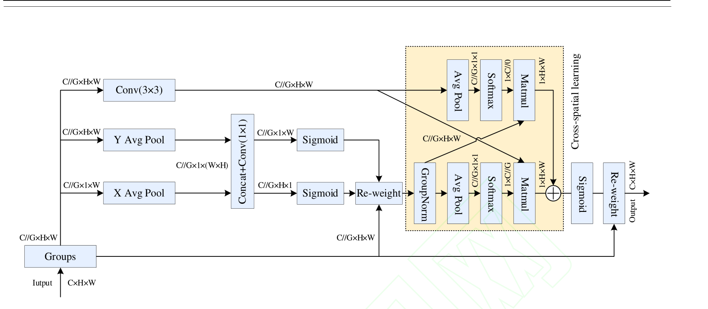

SE 仅聚焦通道维度而忽略空间位置，CA 的全局建模会将肿瘤纹理与正常肾实质结构混合编码，且其 1×1 卷积降维会造成通道信息的不可逆损失。EMA 将输入特征沿通道维度划分为 G 个子特征并将部分通道维度重塑到批次维度，在不减少通道数、不增加参数的前提下并行处理；其 1×1 分支借鉴 CA 的 1D 全局平均池化沿水平与垂直方向编码空间位置信息，聚焦肿瘤浸润前沿的毛刺状边界等短程依赖，3×3 分支扩大感受野捕捉肿瘤整体空间结构等长程依赖。沿两个方向的 1D 全局平均池化定义为：

$$
\begin{aligned}
z_c^{H}(h) &= \frac{1}{W}\sum_{0 \le i \le W} x_c(h, i) \\
z_c^{W}(w) &= \frac{1}{H}\sum_{0 \le j \le H} x_c(j, w)
\end{aligned}
$$

其中各符号的含义为：

| 符号 | 含义 |
| --- | --- |
| $x_c$ | 第 c 个通道的输入特征 |
| $H$、$W$ | 特征图高度与宽度方向的维度大小 |

跨空间学习阶段再对两个分支的输出分别进行 2D 全局平均池化，计算为：

$$
z_c = \frac{1}{H \times W}\sum_{i}\sum_{j} x_c(i, j)
$$

其中 $z_c$ 为将整个空间维度压缩为单个数值后的通道描述子。池化结果经 Softmax 激活后通过矩阵点积生成两个空间注意力图，聚合后经 Sigmoid 输出最终注意力权重并与原始特征逐元素相乘。这等价于让不同通道组独立学习肿瘤异质灰度、规则肾实质结构等差异化语义模式，避免将轮廓、纹理、背景等异质信息压缩到单一注意力权重中造成语义混淆。C3k2_EMA 替换骨干中相应的 C3k2 模块，向后续层级输出纹理辨析后的特征。

### DAFM 双聚合注意力融合

DAFM 用于替换 Neck 中的 Concat 拼接，通过双路注意力实现多尺度信息的主动筛选与语义对齐，结构如下图所示。

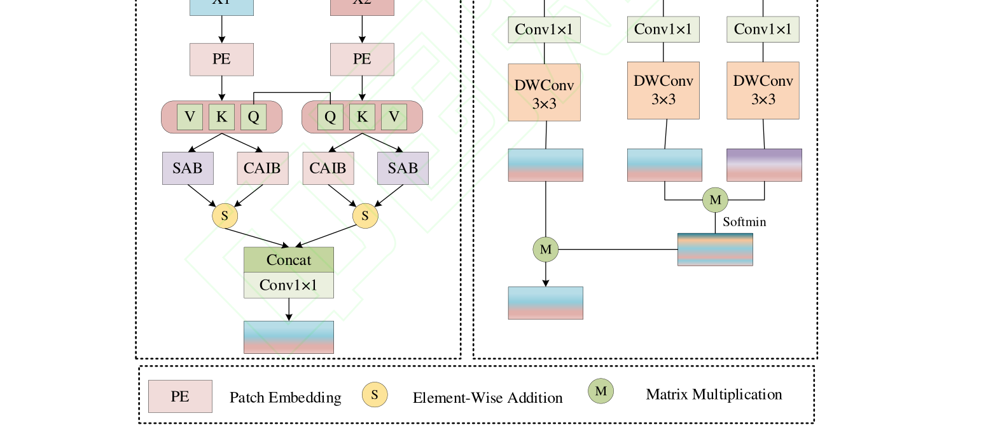

DAFM 先通过 1×1 卷积层生成两组 QKV 并用依赖性卷积投影到细化特征空间；自注意力路径 SAB 在融合前增强浅层特征、抑制无关背景噪声，交叉注意力交互块 CAIB 则以 softmin 替换常规 softmax，聚焦浅层细节与深层语义之间的差异点而非共性，促使深层特征主动提取浅层细节、唤醒微弱的病变信号。两类注意力的计算形式如下：

$$
\begin{aligned}
CAIB^{x_1 \to x_2} &= \mathrm{Softmax}\!\left(-\,Q_{x_1} K_{x_2}^{T}/\max\right) V_{x_2} \\
SAB^{x_1} &= \mathrm{Softmax}\!\left(Q_{x_1} K_{x_1}^{T}/\max\right) V_{x_1}
\end{aligned}
$$

其中各符号的含义为：

| 符号 | 含义 |
| --- | --- |
| $x_1$、$x_2$ | 两种模态（两个尺度）的输入特征 |
| $Q$、$K$、$V$ | 对应特征投影得到的查询、键、值 |
| $\max$ | 归一化所用的最大值项 |

CAIB 中的负号使注意力转为差异聚焦：浅层与深层特征差异越大的区域权重越高。随后 DAFM 引入取值范围限定在 [0, 1] 的可学习参数 α 与 β 对两类注意力输出进行动态加权融合，再经 1×1 卷积做通道级精炼，最终沿通道维度拼接并以 3×3 卷积降维压缩，生成紧凑且语义丰富的联合表示。这等价于「先增强、再挖掘、后优先」的递进式保护策略，从根本上缓解传统拼接中小目标信息易丢失、模糊边界结构易破坏的问题，其输出送入后续卷积阶段与检测头。

### B_CIoU 边界框回归损失

B_CIoU 用于替换 CIoU，解决宽高比惩罚项失效与梯度不稳定问题，CIoU 与 B_CIoU 的几何量对比如下图所示。

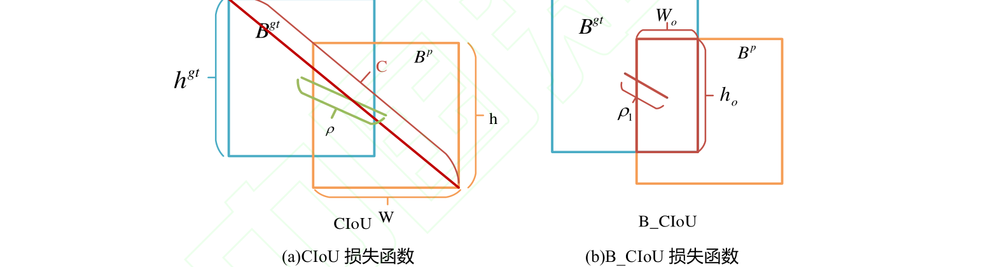

CIoU 的宽高比惩罚项在预测框与真实框宽高比相同时失效、退化为 DIoU，且其求导过程包含宽高归一化项、易引发梯度爆炸。B_CIoU 在 CIoU 基础上进一步引入三个附加惩罚项：重叠区域的大小、预测框与目标框之间的宽高关系、以及中心点之间的归一化距离，其公式如下：

$$
\begin{aligned}
L_{B\_CIoU} &= 1 - IoU + \frac{\rho^{2}(B^{gt}, B^{P})}{c^{2}} + \alpha v^{v} + \frac{\rho_1^{2}(B^{gt}, B^{P})}{c_1^{2}} + \beta v_1^{v} \\
v^{v} &= \frac{8}{\pi^{2}}\left[ (w_{gt}^{2} + w^{2})\left(\arctan\!\left(\frac{w}{w_{gt}}\right) - \frac{\pi}{4}\right)^{2} + (h_{gt}^{2} + h^{2})\left(\arctan\!\left(\frac{h}{h_{gt}}\right) - \frac{\pi}{4}\right)^{2} \right]
\end{aligned}
$$

其中各符号的含义为：

| 符号 | 含义 |
| --- | --- |
| $B^{gt}$、$B^{P}$ | 目标框与预测框 |
| $\rho$ | 预测框与目标框中心点之间的距离 |
| $\rho_1$ | 重叠区域与目标框中心点的距离 |
| $c$ | 包围预测框与目标框的最小矩形框的对角线距离 |
| $c_1$ | 目标框的对角线长度 |
| $\alpha$、$\beta$ | 权衡参数 |
| $v_1^{v}$ | 衡量重叠区域与目标框的宽高一致性 |
| $w_{gt}$、$h_{gt}$ | 目标框的宽度和高度 |
| $w$、$h$ | 预测框的宽度和高度 |

直观上，新增的重叠区域中心距离项与宽高一致性项在宽高比相同时仍能提供有效梯度，使回归分支对弱边界、小尺度病灶的约束更加稳定。该损失只替换 v12 Detect 头回归分支中的 CIoU，仅作用于训练阶段。

### 改进机制对应与协同

下表给出四类核心挑战与改进模块的对应关系，便于与后文消融实验对照阅读。

| 核心挑战 | 对应改进 | 针对性设计 |
| --- | --- | --- |
| 形态不规则与空间上下文缺失 | CSWin-SA | 十字形窗口自注意力，沿水平和垂直方向建模 |
| 边界模糊与背景干扰 | EMA-C3k2 | 通道分组与跨空间学习，精细化区分纹理差异 |
| 多尺度特征融合与小病变丢失 | DAFM | 双聚合注意力融合替代传统特征拼接 |
| 定位精度不足 | B_CIoU 损失函数 | 在 CIoU 基础上增加三项约束，优化边界框回归 |

四个模块层层递进、互为支撑：EMA 在底层做纹理区分，DAFM 在融合阶段做特征筛选，CSWin-SA 施加全局解剖约束，B_CIoU 在几何层面收尾，共同提升复杂背景下的检测鲁棒性与定位精度。消融实验中逐行勾选的开关即对应表中各行改进。

## 实验结果

### 实验设置

实验采用公开的 KiTS 肾脏 CT 影像数据集，包含 300 例接受肾脏部分切除或根治性切除手术患者的术前增强 CT 影像，经筛选清洗后含「严重有病变」与「正常无病变」两类样本，划分为训练集 2,745 张、验证集 783 张、测试集 393 张。预处理包括调整窗宽窗位、统一尺寸 640×640、以 0.5 概率随机水平翻转、0.5 概率随机裁剪并放大、0.2 概率旋转 90 度等增强操作与归一化，肾脏 CT 影像处理样例如下图所示。

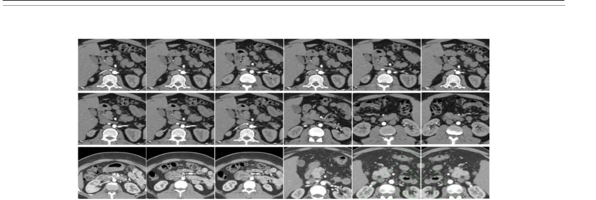

图中可见增强后的切片在肾脏与病变区域的对比度上更利于网络学习。训练在 Windows 11、i5-13400F、32GB 内存、RTX5060Ti 16GB 显存环境下进行，基于 Python 3.12 与 PyTorch 框架，Epoch 设为 150、Batch size 为 4、学习率 0.001、优化器 Adamw。评价指标为精确率、召回率、mAP50、mAP50-95 与 F1 分数，并以模型权重与 FLOPs 衡量复杂度，其中精确率与召回率计算为 $P = \frac{TP}{TP+FP}$ 与 $R = \frac{TP}{TP+FN}$，mAP50 为各类别平均精度的算术平均 $mAP50 = \frac{1}{N}\sum_{i=1}^{N} AP_i$，F1 分数为二者调和平均 $F1 = \frac{2 \times precision \times recall}{precision+recall}$。

### 可视化分析

先定性后定量，下图对比了原始 CT 图像、标注真值与五个模型在典型病例上的检测结果。

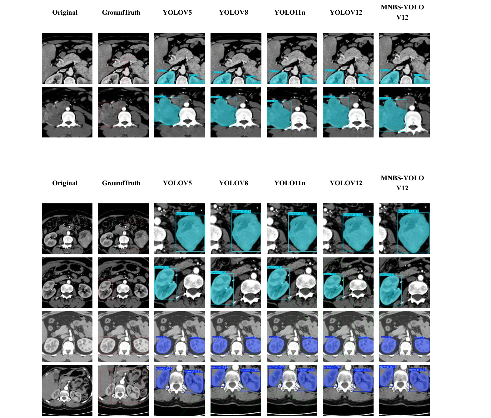

绿色框代表肿瘤病变区、蓝色框代表正常肾脏。YOLOv5、YOLOv8、YOLO11n、YOLOv12 能完整框出肿瘤区域但置信度较低，MNBS-YOLOv12 的预测框与真实肿瘤边界贴合程度更高且置信度分数提升，在正常肾脏与肿瘤病变的二分类任务上两类目标均表现稳定。下图进一步给出 Grad-CAM 热力图的逐级对比。

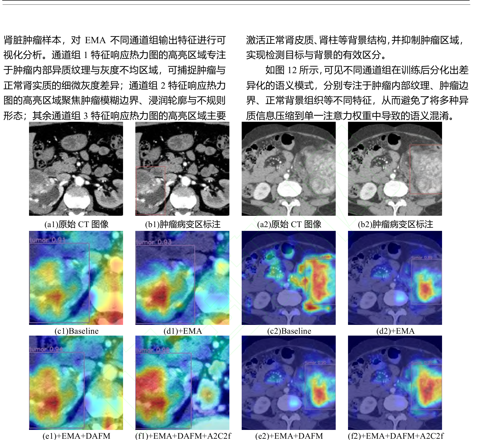

Baseline 热力图在肾实质背景区域存在大量高激活值，表明误将背景识别为病变；+EMA 后背景激活值显著降低、置信度提高；+EMA+DAFM 后模型更精准地聚焦肿瘤区域；+EMA+DAFM+CSWin-SA 在边界模糊处仍保持完整激活，表明 A2C2f 的边界补全机制有效。下图展示 EMA 不同通道组的特征解耦可视化。

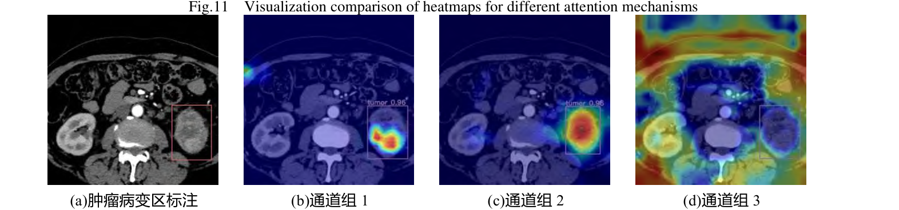

通道组 1 的高亮区域专注于肿瘤内部异质纹理与灰度不均区域，通道组 2 聚焦肿瘤模糊边界与浸润轮廓，通道组 3 则主要激活正常肾皮质、肾柱等背景结构并抑制肿瘤区域，可见通道分组在训练后确实分化出差异化的语义模式。

### 对比实验

与主流模型的定量对比如下图所示。

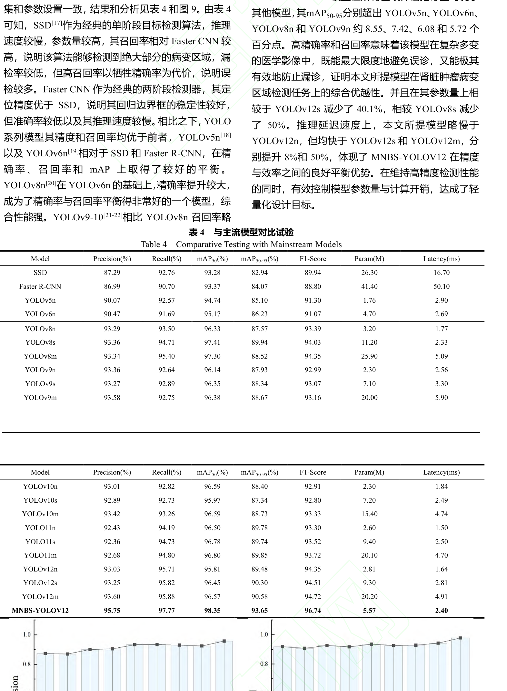

MNBS-YOLOv12 在精确率、召回率、mAP50、mAP50-95 四项指标上均优于对比模型，mAP50-95 分别超出 YOLOv5n、YOLOv6n、YOLOv8n、YOLOv9n 约 8.55、7.42、6.08 和 5.72 个百分点；其参数量为 5.57M，相较 YOLOv12s 减少 40.1%、相较 YOLOv8s 减少 50%，推理延迟 2.40 ms 略慢于 YOLOv12n 但快于 YOLOv12s 与 YOLOv12m 分别 8% 和 50%，说明模型在精度与效率之间取得了良好平衡。各模型四项指标的分组对比如下图所示。

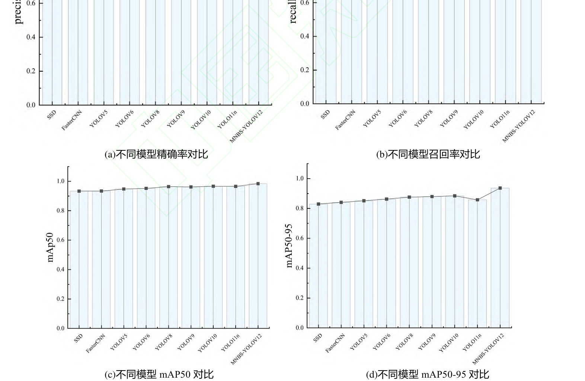

本文模型在精确率、召回率、mAP50、mAP50-95 四组柱状对比中均处于领先位置，与定量表的结论一致。

### 消融实验

九个组合的模块消融结果如下图所示。

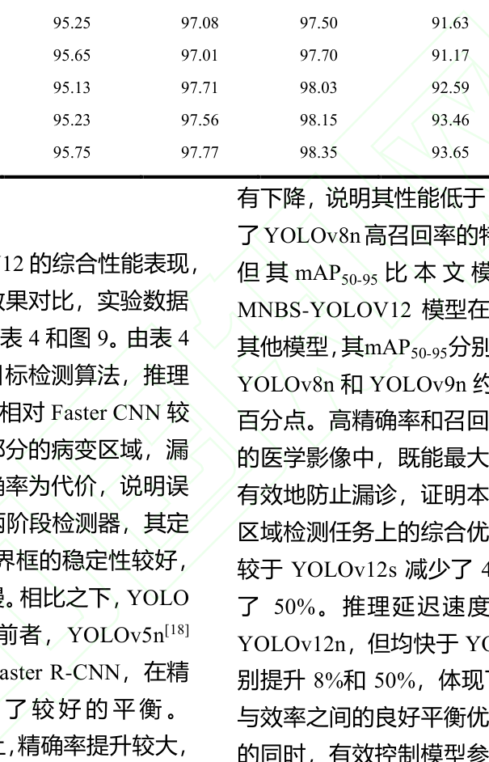

单独引入 CSWin-SA 使精确率提升 1.99 个百分点，单独引入 EMA 使精确率提升 1.55、召回率提升 1.35、mAP50 提升 1.75 个百分点，单独引入 DAFM 使精确率提升 1.83、召回率提升 1.31、mAP50 提升 2 个百分点，单独引入 B_CIoU 使精确率提升 1.73、召回率提升 0.73、mAP50 提升 2.22 个百分点；四者齐备时精确率 95.75%、召回率 97.77%、mAP50 98.35%、mAP50-95 93.65%，而权重仅 10.9MB，可见多模块协同设计在保持轻量化的同时达到了最优性能。训练过程曲线如下图所示。

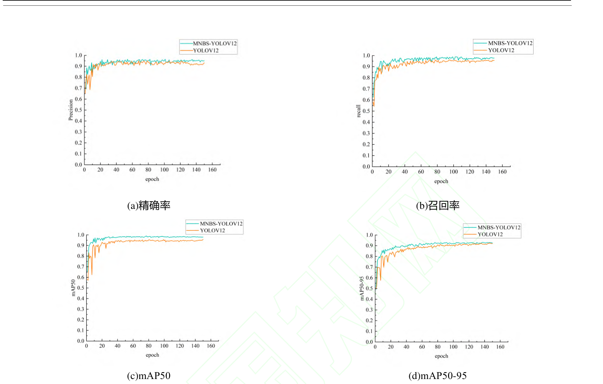

训练集与验证集的边界损失和分类损失在迭代 20 轮以后逐步稳定且较 YOLOv12 更快收敛，经 150 轮训练后四项指标全面优于基线，表明改进在提升精度的同时也改善了收敛过程。

### 损失函数与融合方法对比

不同损失函数的对比结果如下图所示。

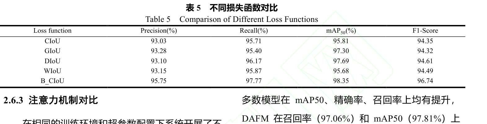

GIoU 在精确率上略有优势、DIoU 在召回率上表现突出，而 B_CIoU 在精确率、召回率与 mAP50 上实现最佳平衡（95.75%、97.77%、98.35%），说明多角度边界框回归约束更适配边界模糊的肾脏病灶。在融合方法一侧，DAFM 的 mAP50 达到 97.81%，优于替换 Neck 的 FPN、MFM、DFF 三种方法，且参数量 2.96M 仅较基线增加 0.15M、计算量 6.7G 与基线 6.5G 基本持平；按病变像素面积将验证集分为小（<322）、中（322–962）、大（≥962）三类后，DAFM 使 mAP50 分别提升 4.1、2.1、1.75 个百分点，小尺寸病变增益最大，表明融合过程中小尺寸病变的细节信息被有效保留。

## 优点和创新点

个人认为，本文有如下一些优点和创新点可供参考学习：

1. 将 CSWin-SA 的十字形条纹注意力与肾脏两条解剖轴线对齐，以接近线性的开销建模不规则病变的长程依赖，为解剖先验注入通用注意力提供了可参考的思路。
2. 针对多尺度融合中小病变信息丢失的痛点设计 softmin 差异聚焦的交叉注意力 DAFM，使深层特征主动唤醒浅层细节，小尺寸病变分层实验增益最大、证据充分。
3. 把注意力、融合与损失四类改进统一到 YOLOv12 框架内，并配套九组消融、损失与注意力横向对比、尺寸分层以及 Grad-CAM 与通道解耦可视化，实验证据链完整、说服力强。
