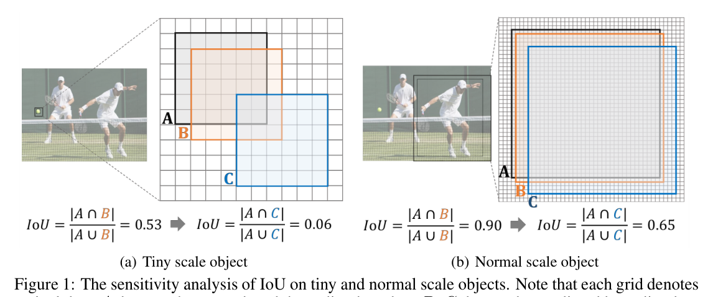
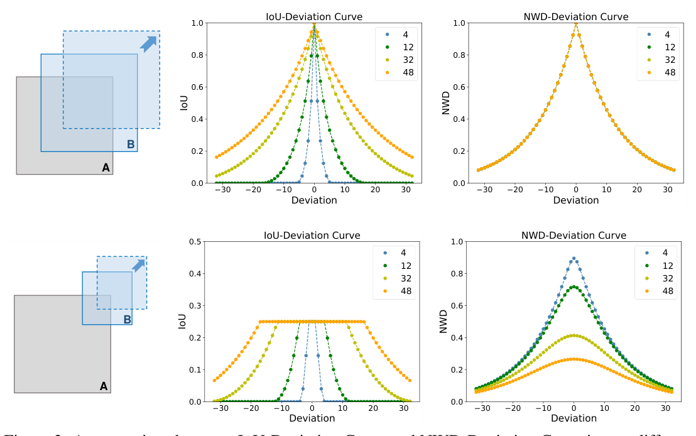
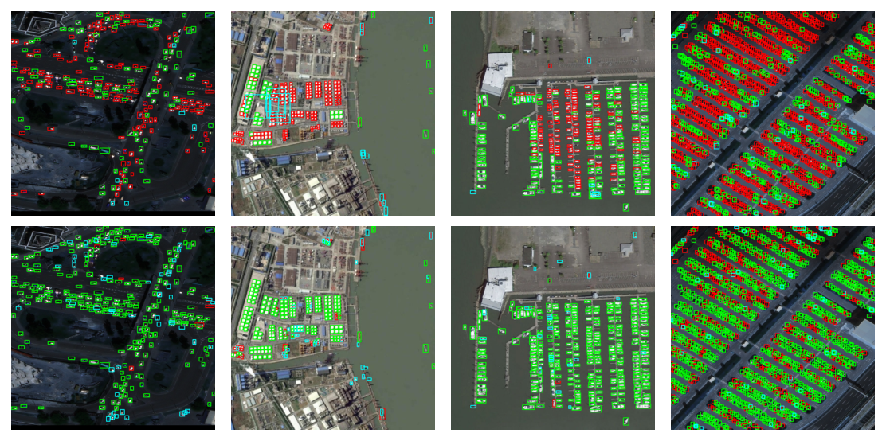
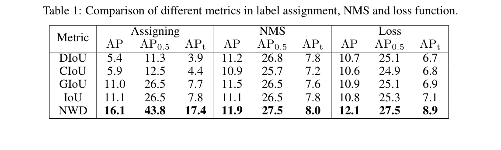

# A Normalized Gaussian Wasserstein Distance for Tiny Object Detection

Paper Reading 是从个人角度进行的一些总结分享，受到个人关注点的侧重和实力所限，可能有理解不到位的地方。具体的细节还需要以原文的内容为准，博客中的图表若未另外说明则均来自原文。

| 论文概况 | 详细 |
| --- | --- |
| 标题 | 《A Normalized Gaussian Wasserstein Distance for Tiny Object Detection》 |
| 作者 | Jinwang Wang, Chang Xu, Wen Yang, Lei Yu |
| 发表期刊 | arXiv preprint（arXiv:2110.13389，原文标注 Preprint. Under review.） |
| 期刊等级 | 未获取 |
| 发表年份 | 2021 |
| 论文代码 | [https://github.com/jwwangchn/NWD](https://github.com/jwwangchn/NWD) |

作者单位：

1. Electronic Information School, Wuhan University

## 研究动机

微小目标检测是航拍图像分析、驾驶辅助与海上救援等应用中的重要问题，表现为目标只占十几个像素甚至更少、外观信息极其有限，导致主流检测器在微小尺度上产生大量漏检与误检。现有改进大多围绕特征判别力展开，例如多尺度特征金字塔、尺度归一化训练策略与 GAN 超分辨率增强，精度提升往往以额外计算代价换取。然而，对 anchor-based 检测器而言还有一个更底层却被忽视的环节：正负标签分配、非极大抑制与回归损失都依赖 IoU 度量框间相似度，而 IoU 对微小目标的位置偏差极度敏感——微小目标仅一个像素的对角偏差就会让 IoU 断崖式下跌，同等偏差作用在正常尺度目标上时 IoU 只轻微变化。这种敏感性带来两个递进的后果：轻微位置偏差即可翻转 anchor 的正负标签，使正负样本特征趋同、网络难以收敛；更严重的是，部分真值框与任何 anchor 的 IoU 都低于正样本阈值，平均每个真值框分到的正样本不足一个，监督信息严重匮乏。即便 ATSS 这类按 IoU 统计特性自适应取阈值的动态分配策略，也难以在如此敏感的度量上找到合适阈值。暂未有工作从度量本身出发，为微小目标设计一个对尺度不敏感、对位置偏差平滑的框相似度度量，本文即由此切入。

## 文章贡献

针对上述局限，本文提出了归一化高斯 Wasserstein 距离（Normalized Wasserstein Distance，NWD），其核心是把边界框建模为二维高斯分布，用分布之间的 Wasserstein 距离替代 IoU 度量框间相似度。首先，本文以边界框的内切椭圆确定高斯分布的均值与协方差，把框相似度问题转化为分布距离问题；接着，本文对二阶 Wasserstein 距离做指数形式归一化得到 NWD，使其具备尺度不变、对位置偏差平滑、可度量无重叠或相互包含框三项性质；最终，本文把 NWD 嵌入 anchor-based 检测器的标签分配、非极大抑制与回归损失三处以全面替换 IoU，构成完整的微小目标检测方案。实验表明，在专为微小目标设计的 AI-TOD 数据集上，配备 NWD 的方法比标准微调基线高 6.7 个 AP、比同期最强竞争者高 6.0 个 AP，其中 NWD 版 DetectoRS 以 20.8% AP 取得当时最优结果。

## 本文方法

### IoU 的敏感性分析与度量替换动机

本节的目标是用可控的偏差实验揭示 IoU 在微小尺度上的失效方式。原文构造了逐像素网格上的对比样例，如下图所示：

图中每个网格代表一个像素，框 A 是真值框，框 B 与框 C 分别是沿对角偏差 1 个像素与 4 个像素的预测框。可以观察到：对微小尺度目标，1 像素偏差已使 IoU 从较高值骤降到接近 0；而对正常尺度目标，相同偏差下 IoU 只小幅下降。配合原文给出的四条不同目标尺寸下的 IoU-Deviation 曲线，目标越小曲线衰减越快，且这种敏感性源于边界框位置只能离散变化的特性。该分析说明问题出在度量本身而非阈值设置，直接引出下文的分布建模与新度量设计。

### 边界框的高斯分布建模

高斯建模的目标是用连续分布刻画框内像素的重要性差异：真实目标并非严格矩形，前景像素集中于框中心、背景像素分布于框边界，因此中心像素权重最高、向边界递减。对水平边界框 $R = (c_x, c_y, w, h)$，其内切椭圆方程表示为：

$$
\frac{(x - \mu_x)^2}{\sigma_x^2} + \frac{(y - \mu_y)^2}{\sigma_y^2} = 1
$$

其中 $(\mu_x, \mu_y)$ 是椭圆中心坐标，$\sigma_x, \sigma_y$ 是沿 $x, y$ 轴的半轴长度；对应地有 $\mu_x = c_x,\ \mu_y = c_y,\ \sigma_x = \frac{w}{2},\ \sigma_y = \frac{h}{2}$。当 $(x-\mu)^\top \Sigma^{-1} (x-\mu) = 1$ 时，该椭圆恰好是二维高斯分布的一条密度等高线，因此边界框可建模为高斯分布 $N(\mu, \Sigma)$，其参数为：

$$
\mu = \begin{bmatrix} c_x \\ c_y \end{bmatrix}, \quad
\Sigma = \begin{bmatrix} \frac{w^2}{4} & 0 \\ 0 & \frac{h^2}{4} \end{bmatrix}
$$

其中 $\mu$ 由框中心坐标构成，$\Sigma$ 由框宽高的平方决定。直观上，这一步把离散的像素重叠比较替换为连续分布比较，框 A 与框 B 的相似度被转化为两个高斯分布之间的距离，为下文引入 Wasserstein 距离提供了输入。

### 归一化 Wasserstein 距离的定义与性质

对两个二维高斯分布 $\mu_1 = N(m_1, \Sigma_1)$ 与 $\mu_2 = N(m_2, \Sigma_2)$，其二阶 Wasserstein 距离定义为：

$$
W_2^2(\mu_1, \mu_2) = \| m_1 - m_2 \|_2^2 + \mathrm{Tr}\left( \Sigma_1 + \Sigma_2 - 2 \left( \Sigma_2^{1/2} \Sigma_1 \Sigma_2^{1/2} \right)^{1/2} \right)
$$

代入边界框对应的高斯参数后，该距离可进一步简化为四维向量差的平方：

$$
W_2^2(N_a, N_b) = \left\| \left( c_{xa}, c_{ya}, \tfrac{w_a}{2}, \tfrac{h_a}{2} \right)^\top - \left( c_{xb}, c_{yb}, \tfrac{w_b}{2}, \tfrac{h_b}{2} \right)^\top \right\|_2^2
$$

其中 $A = (c_{xa}, c_{ya}, w_a, h_a)$、$B = (c_{xb}, c_{yb}, w_b, h_b)$ 是两个边界框。但 $W_2^2$ 是距离而非相似度，不能像 IoU 那样取 0 到 1 之间的值，因此本文用指数形式归一化，得到 NWD 度量：

$$
\mathrm{NWD}(N_a, N_b) = \exp\left( -\frac{\sqrt{W_2^2(N_a, N_b)}}{C} \right)
$$

其中 $C$ 是与数据集密切相关的常数，实验中经验地取为 AI-TOD 的平均绝对尺寸，且在一定范围内鲁棒。给出一个简单的例子，假设 $C = 12.8$，取正常尺度框 $A = (10, 10, 8, 8)$ 与沿对角平移 1 像素的 $B = (11, 11, 8, 8)$：第一步按简化式得 $W_2^2 = 1^2 + 1^2 + 0 + 0 = 2$；第二步开方得 $\sqrt{2} \approx 1.414$；第三步代入归一化式得 $\mathrm{NWD} = \exp(-1.414 / 12.8) \approx 0.895$。若把两框同时缩小为 $A = (10, 10, 4, 4)$、$B = (11, 11, 4, 4)$，重复上述三步得到的 NWD 仍是 0.895，而同样两组框的 IoU 分别约为 0.62 与 0.39。可以看到，相同的位置偏差在不同尺度下得到完全一致的 NWD，尺度不变性由此直观体现。相比 IoU，NWD 具备尺度不变、对位置偏差平滑、可度量无重叠或相互包含框三项优势，度量值随偏差的变化曲线如下图所示：

图中第一行保持框 A 与框 B 同尺度、沿对角线移开 B，四种尺寸（4、12、32、48 像素）下的 NWD 曲线完全重合，而 IoU 曲线随尺寸变小衰减明显加快；第二行把 B 的边长设为 A 的一半，NWD 曲线依然平滑，且在两框无重叠或相互包含时仍能一致地反映相似度。横轴为 A、B 中心点偏差的像素数，因框位置只能离散变化，曲线以散点形式呈现。这一性质对比正是 NWD 能替换 IoU 的依据，其输出送入下文三处检测器模块。

### NWD-based 标签分配

标签分配模块的目标是为 RPN 与 R-CNN 提供高质量正负样本。本文设计的 NWD-based 分配策略沿用原检测器的阈值设定，仅把度量换成 NWD：正标签赋予两类 anchor，一是与某个真值框 NWD 最高且该值大于负阈值 $\theta_n$ 的 anchor，二是与任意真值框 NWD 高于正阈值 $\theta_p$ 的 anchor；与所有真值框 NWD 都低于 $\theta_n$ 的 anchor 赋负标签；其余 anchor 不参与训练。由于 NWD 对微小目标的位置偏差不再敏感，原本因 IoU 骤降而被错标或漏标的 anchor 得以保留为高质量正样本。该模块的输出是 RPN 与 R-CNN 两个阶段的训练样本集合。

### NWD-based 非极大抑制

NMS 模块的目标是抑制冗余预测框：先按分数排序，选出最高分预测框 M，再抑制与 M 重叠超过预定义阈值 $N_t$ 的其余预测框，递归执行。IoU 的敏感性会使大量本应被抑制的预测框因 IoU 低于 $N_t$ 而幸存，在微小目标场景下直接转化为误检；NWD 克服了尺度敏感问题，是更合适的抑制准则，且只需少量代码即可集成进任意微小目标检测器。该模块作用于 RPN 的 proposal 筛选环节，其结果影响训练样本与最终输出。

### NWD-based 回归损失

回归损失模块的目标是在训练与测试之间消除度量缺口。IoU-Loss 在两种情况下无法提供梯度：预测框 P 与真值框 G 无重叠（$|P \cap G| = 0$），或一方完全包含另一方（$|P \cap G| = P$ 或 $G$）；而这两种情况对微小目标极为常见——几个像素的偏差即造成无重叠，错误预测又容易造成相互包含。CIoU 与 DIoU 虽能覆盖这两种情况，但本质上仍基于 IoU，对微小目标的位置偏差依旧敏感。本文据此把 NWD 直接定义为损失函数：

$$
L_{NWD} = 1 - \mathrm{NWD}(N_p, N_g)
$$

其中 $N_p$ 与 $N_g$ 分别是预测框 P 与真值框 G 的高斯分布模型。由 NWD 的性质可知，即使在无重叠或相互包含时该损失仍能提供有效梯度。该损失替换 RPN 与 R-CNN 中原有的回归损失，与前述分配、NMS 模块共同构成 NWD-based 检测器。同期工作 GWD 同样用高斯 Wasserstein 距离度量框相似度，但其动机是解决旋转框检测的边界不连续与方似问题；本文的动机则是缓解 IoU 对微小目标位置偏差的敏感性，且 NWD 可替换 anchor-based 检测器全部三处 IoU 用法，二者问题设定并不相同。

## 实验结果

### 实验设置

| 项目 | 设置 |
| --- | --- |
| 数据集 | AI-TOD：8 类、700,621 个实例、28,036 幅 800×800 航拍图，平均绝对尺寸 12.8 像素；VisDrone2019：10,209 幅图、10 类 |
| 指标 | AP、AP0.5、AP0.75 及按尺度分层的 APvt（2-8 像素）、APt（8-16 像素）、APs（16-32 像素）、APm（32-64 像素） |
| 骨干 | ImageNet 预训练 ResNet-50 + FPN |
| 训练 | MMDetection，SGD 12 epochs，batch size 8，初始学习率 0.01，第 8 与 11 epoch 衰减 0.1 倍，4 张 NVIDIA Titan X |
| 采样 | RPN 与 Fast R-CNN 的 batch 分别为 256 与 512，正负采样比 1/3，RPN 生成 3000 个 proposal |
| 推理 | 分数阈值 0.05 过滤背景框，NMS 阈值 0.5 |

### 可视化分析

先看定性检测效果。下图第一行是 IoU-based 检测器、第二行是 NWD-based 检测器在 AI-TOD 上的输出，绿、蓝、红框分别表示真阳、误检与漏检：

可以观察到，第一行的红色漏检框在密集微小目标区域成片出现，而第二行中同样区域的红色框明显减少、绿色真阳框显著增多。可见 NWD 的收益主要来自缓解正样本不足导致的漏检，与标签分配环节的改进相互印证。

### 与 IoU 系度量的对比

原文在 Faster R-CNN 上把 IoU、GIoU、CIoU、DIoU 与 NWD 分别用于标签分配、NMS 与损失函数三处，结果如下表所示。

NWD 在三处分别取得 16.1、11.9、12.1 的 AP，均为最优；在标签分配上 APt 相比 IoU 提升 9.6，说明 NWD 能为微小目标提供更高质量的训练样本。原文进一步统计了同一默认阈值下每个真值框平均匹配的正 anchor 数：IoU、GIoU、DIoU、CIoU、NWD 分别为 0.72、0.71、0.19、0.19 与 1.05，只有 NWD 能保证充足的正样本数量。这表明增益的本质是度量替换解决了 IoU 的敏感性问题，而非单纯调低阈值所能达到。

### 消融实验

Faster R-CNN 的 RPN 与 R-CNN 各有分配、NMS、损失三处可替换，共六个模块。单模块替换的消融如下表所示。

相对基线 11.1 AP，RPN 分配与 R-CNN 分配分别取得 17.3 与 14.3 的最高与次高提升，六个模块中五个为正贡献；R-CNN 的 NMS 出现下降，原文归因于默认 NMS 阈值次优、需要微调。多模块组合的消融如下表所示。

12 epochs 下把 NWD 用于 RPN 全部三个模块取得最优的 17.8 AP，而用于全部六个模块反而比仅用 RPN 低 2.6；把训练延长到 24 epochs 后该差距从 2.6 缩小到 0.9，说明在 R-CNN 中使用 NWD 需要更长收敛时间。基于此，后续实验只在 RPN 中使用 NWD，以较少时间换取可观提升。

### 主结果与跨数据集泛化

在 AI-TOD test set 上对五种 anchor-based 检测器的对比如下表所示，带星号者为配备 NWD 的版本。

NWD 使 RetinaNet、ATSS、Faster R-CNN、Cascade R-CNN、DetectoRS 的 AP 分别提升 4.5、0.7、6.7、4.9 与 6.0，且目标越微小提升越明显；现有检测器的 APvt 普遍接近 0，而 NWD 版 DetectoRS 以 20.8% AP 取得当时最优。在含大量多场景微小目标的 VisDrone2019 val set 上的结果如下表所示。

Faster R-CNN 的 APvt 从 0.1 提升到 3.8、APt 从 6.2 提升到 10.2，Cascade R-CNN 的 AP0.5 从 38.5 提升到 40.3、APt 从 6.8 提升到 11.1，表明 NWD 的增益可以跨数据集泛化，并非 AI-TOD 上的偶然现象。两个数据集上增益都集中在 APvt 与 APt 档位，与 NWD 对尺度不敏感的设计目标相一致。

## 优点和创新点

个人认为，本文有如下一些优点和创新点可供参考学习：

1. 从度量层面切入微小目标检测，指出 IoU 对位置偏差过度敏感这一本质问题，把边界框建模为二维高斯分布并以 Wasserstein 距离度量相似度，使度量在无重叠或相互包含时依然平滑有效；
2. NWD 具备尺度不变与偏差平滑等性质，可直接替换标签分配、NMS 与回归损失三处的 IoU，仅需少量代码改动即适用于任意 anchor-based 检测器，工程可用性较好；
3. 实验丰富、说服力强：AI-TOD 上五种检测器一致提升、Faster R-CNN 的 AP 由 11.1 提升到 17.8，配合正 anchor 数统计与跨数据集 VisDrone2019 验证，增益来源清晰可信。
