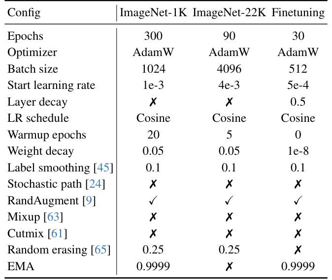
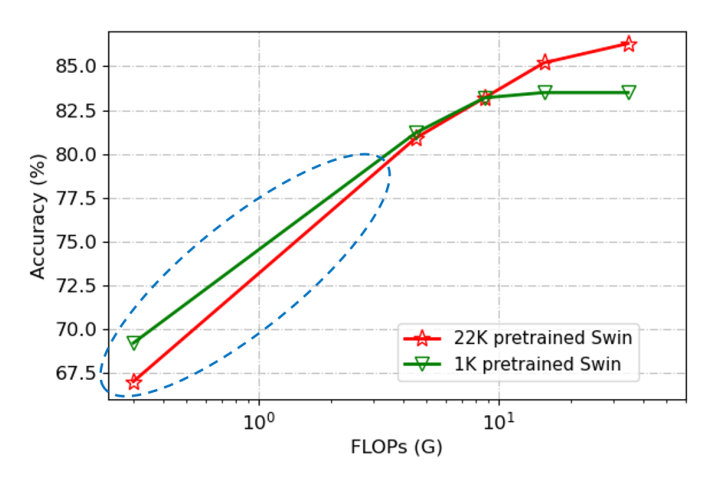
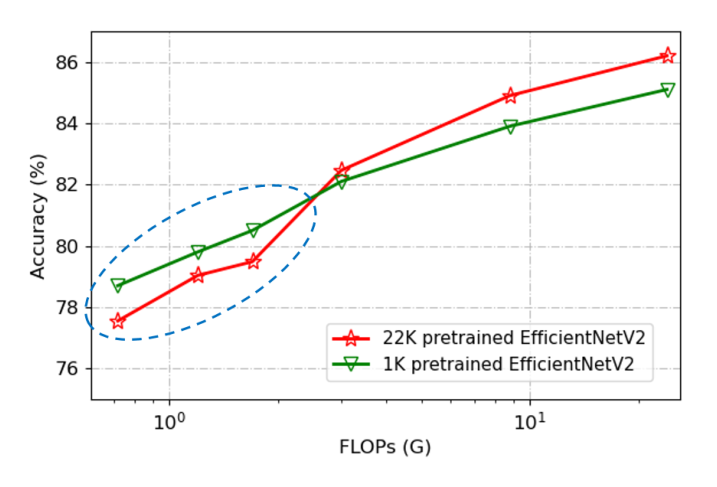
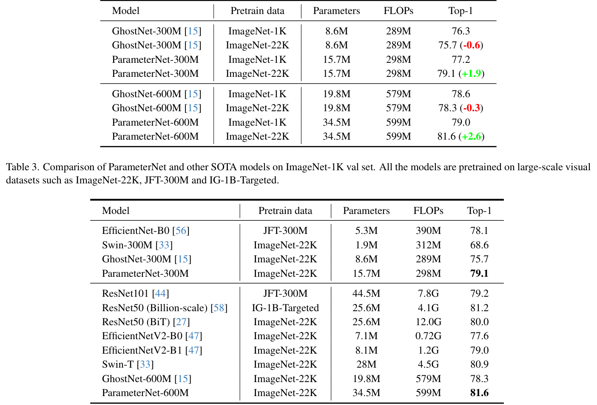
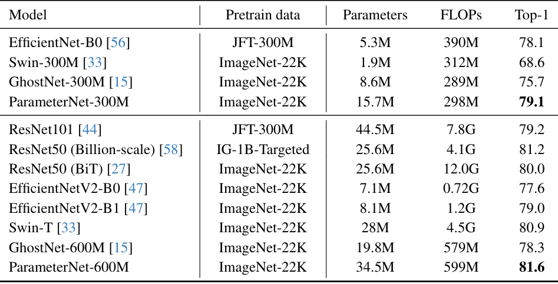
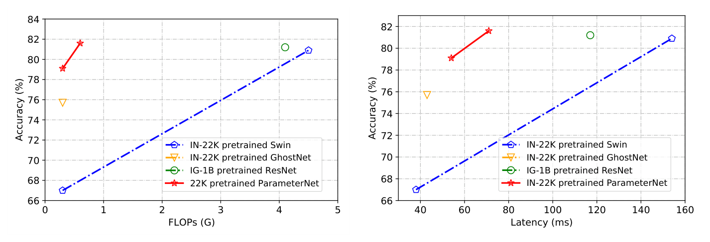
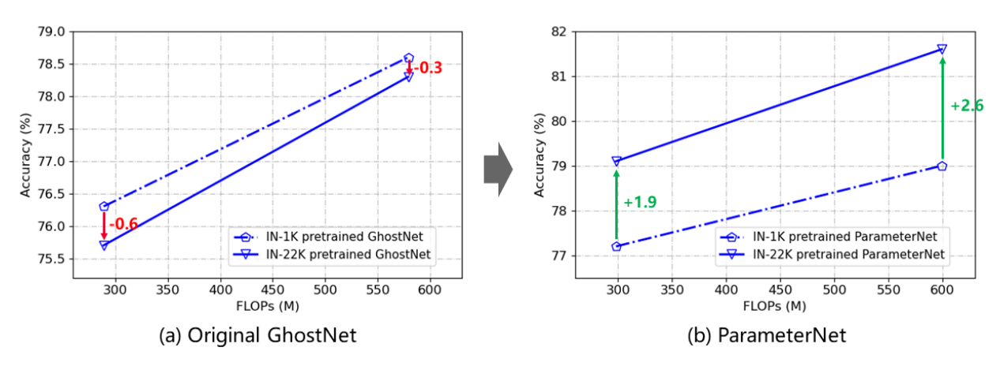

# ParameterNet: Parameters Are All You Need for Large-Scale Visual Pretraining of Mobile Networks

Paper Reading 是从个人角度进行的一些总结分享，受到个人关注点的侧重和实力所限，可能有理解不到位的地方。具体的细节还需要以原文的内容为准，博客中的图表若未另外说明则均来自原文。

| 论文概况 | 详细 |
| --- | --- |
| 标题 | 《ParameterNet: Parameters Are All You Need for Large-Scale Visual Pretraining of Mobile Networks》 |
| 作者 | Kai Han、Yunhe Wang、Jianyuan Guo、Enhua Wu |
| 发表会议 | CVPR |
| 会议等级 | CCF-A |
| 发表年份 | 2024 |
| 论文代码 | [https://parameternet.github.io/](https://parameternet.github.io/) |

作者单位：

1. 华为诺亚方舟实验室（Huawei Noah's Ark Lab）
2. 悉尼大学（The University of Sydney）
3. 中国科学院软件研究所与中科院大学计算机科学学院国家重点实验室（State Key Lab of Computer Science, ISCAS & UCAS）
4. 澳门大学科技学院（Faculty of Science and Technology, University of Macau）

## 研究动机

大规模视觉预训练是计算机视觉的基础组件，预训练视觉模型作为高效的表征学习器服务于图像识别、目标检测、语义分割等下游任务，其性能基本遵循数据、参数量与计算量的 scaling law。为了拟合大规模数据集，主流预训练模型的参数量与 FLOPs 越来越大，而移动设备上的视觉应用要求快速推理，难以直接部署这类高计算量模型。一个自然的想法是改用低 FLOPs 的轻量模型做大规模预训练，然而实证观察表明这条路并不成立：当模型 FLOPs 较低时，用更多数据预训练并不能带来提升。以 Swin Transformer 与 EfficientNetV2 为例，在高 FLOPs 区间 ImageNet-22K 预训练明显优于 ImageNet-1K，但在低 FLOPs 区间情况反转，更大的预训练数据反而造成性能下降，本文把这一现象命名为 low FLOPs pitfall。其成因在于参数量与 FLOPs 在神经网络中高度相关，压缩 FLOPs 的同时也压缩了参数量，模型容量不足以吸收大规模数据中的信息。至此问题收窄为：暂未有工作能让低 FLOPs 模型在保持低计算量的前提下从大规模视觉预训练中受益。

## 文章贡献

针对低 FLOPs 模型无法从大规模预训练中受益的问题，本文提出了 ParameterNet 设计原则。其核心是在几乎不增加 FLOPs 的前提下大幅增加低 FLOPs 模型的参数量。首先本文在 Transformer 与 CNN 两类架构上实证验证了 low FLOPs pitfall 的普遍性；接着引入参数增广函数并用高效动态卷积加以实现，使参数量提升约 M 倍而 FLOPs 增量可忽略；最终把同一思想推广到语言域，用稀疏激活 MoE 在 LLaMA-1B 上验证该假设。实验表明，ImageNet-22K 预训练的 ParameterNet 相比 ImageNet-1K 训练可带来超过 2% 的提升，其中 ParameterNet-600M 在 ImageNet-1K 验证集上取得 81.6% 的 top-1 精度，超过广泛使用的 Swin Transformer，而 FLOPs 仅为后者的约七分之一。

## 本文方法

本文方法沿「架构选择 → 参数增广 → 复杂度验证 → 跨域推广」的流程展开，各 H3 依次对应这条流水线上的一个环节。

### 架构选择：CNN 基座

架构选择环节的目标是回答哪类网络适合作大规模视觉预训练的低 FLOPs 基座。本文不提出新架构，而是依据附录实验比较 Transformer 与 CNN 在不同计算量档位下的表现，结论归纳如下表：

| FLOPs 档位 | 占优架构 |
| --- | --- |
| 高于 5G | Transformer |
| 600M 以内 | 带局部性与平移等变等归纳偏置的 CNN |

当 FLOPs 高于 5G 时，Transformer 类模型稳定优于计算量相近的 CNN；但对于更小的模型，尤其是 600M FLOPs 以内的移动级模型，带局部性与平移等变等归纳偏置的 CNN 仍占主导。因此本文选择 CNN 作为基座模型，并取代表性移动模型 GhostNet 为基线，其廉价操作为后续参数增广提供了天然的低 FLOPs 起点。这一选择决定了后文所有参数增广操作都施加在卷积层上。

### 标准卷积与参数增广函数

参数增广函数是 ParameterNet 原则的通用入口，用于在不显著增加计算量的前提下向网络引入更多参数。标准卷积层的计算公式如下：

$$Y = X * W$$

其中 $X \in \mathbb{R}^{C_{in} \times H \times W}$ 是输入特征，$W \in \mathbb{R}^{C_{out} \times C_{in} \times K \times K}$ 是权重张量，$Y$ 是输出，$*$ 为卷积操作，偏置项为简洁起见被省略；全连接层可视为核尺寸为 1×1 的卷积层。在此基础上，本文把参数增广函数形式化为：

$$W' = f(W)$$

其中 $f$ 需满足两条基本规则：一是不需要太多计算成本，二是能大幅增加模型容量或可训练参数。直观上，大规模数据需要更多参数去拟合，把参数量与 FLOPs 解耦正是跳出 low FLOPs pitfall 的关键。候选的实现途径包括动态卷积与重参数化卷积，但后者只在训练期增加参数、推理期参数与 FLOPs 均不变，即模型容量并未增加，因此本文选定动态卷积，增广后的权重 $W'$ 交由下文的动态卷积模块具体实例化。

### 动态卷积实现

动态卷积是参数增广函数在本文中的具体实现，机制是用输入相关的系数融合多组专家卷积核。带 M 个动态专家的动态卷积可写为：

$$Y = X * W', \quad W' = \sum_{i=1}^{M} \alpha_i W_i$$

其中 $W_i$ 是第 i 个卷积权重张量，$\alpha_i$ 是对应的动态系数。系数随不同输入样本动态生成，典型做法是先对输入 $X$ 做全局平均池化把信息融合为向量，再用两层 MLP 产出系数，生成公式如下：

$$\alpha = \mathrm{sigmoid}(\mathrm{MLP}(\mathrm{Pool}(X)))$$

其中 $\alpha \in \mathbb{R}^{M}$ 是系数向量，$\mathrm{Pool}$ 为全局平均池化，sigmoid 也可替换为 softmax 等其他激活。该系数生成模块相对原卷积层只带来可忽略的 FLOPs，因此 ParameterNet 能在最小化 FLOPs 增量的同时引入大量参数。实现上本文把 GhostNet 中的标准卷积层替换为动态卷积，专家数默认取 4，替换后的网络即送入下文的复杂度分析核算参数与 FLOPs 的比例关系。

### 复杂度分析

复杂度分析环节的目标是定量说明动态卷积为何能以几乎不变的 FLOPs 换来成倍参数。动态卷积相对标准卷积的参数比为：

$$R_{param} = \frac{C_{in}^2 + C_{in}M + M C_{out} C_{in} K^2}{C_{out} C_{in} K^2} \approx \frac{1}{K^2} + M$$

FLOPs 比为：

$$R_{flops} = \frac{C_{in}^2 + C_{in}M + M C_{out} C_{in} K^2 + H' W' C_{out} C_{in} K^2}{H' W' C_{out} C_{in} K^2} \approx 1$$

其中 $M$ 是专家数，$K$ 是卷积核尺寸，$H' \times W'$ 是输出特征尺寸，近似在 $M \ll C_{out}K^2$、$1 < M \ll H'W'$ 且 $C_{in} \approx C_{out}$ 的条件下成立。这等价于：相对标准卷积，动态卷积拥有约 M 倍的参数，而额外 FLOPs 可忽略。给出一个简单的例子，假设 $C_{in} = C_{out} = 32$、$K = 3$、$M = 4$、输出特征 $H' = W' = 56$：标准卷积参数量为 $32 \times 32 \times 9 = 9216$，代入参数比公式得 $R_{param} \approx 1/9 + 4 \approx 4.11$，即参数量放大到约 37900；FLOPs 一侧标准卷积为 $56 \times 56 \times 9216 \approx 28.9$M，动态卷积额外引入的系数生成与权重融合合计约 38K FLOPs，比值约 1.001。可以看到，参数量翻了四倍多而计算量几乎不变，这正是低 FLOPs 模型吸收大规模数据所需的容量空间。

### 与重参数化卷积的对比

与重参数化卷积的对比用于说明实现途径必须保证推理期参数同步增加。两种 ParameterNet 构造途径与模型容量的对应关系如下表：

| 构造途径 | 训练期参数 | 推理期参数 | 模型容量是否增加 |
| --- | --- | --- | --- |
| 重参数化卷积 | 增加 | 不变 | 否 |
| 动态卷积 | 增加 | 同步增加 | 是 |

重参数化卷积在推理期可把多分支融合为单一卷积，参数与 FLOPs 不变，即容量没有增加；动态卷积在推理期保留多组专家与动态系数，容量随参数同步增长。这一差别直接决定大规模预训练能否被利用，后文消融实验给出了定量佐证：ImageNet-22K 预训练的重参数化卷积版本几乎无提升，而动态卷积版本提升明显。本环节的结论回扣参数增广函数的实现选型，并为实验节的消融设置提供对照。

### 推广到语言域：稀疏激活 MoE

推广到语言域环节的目标是验证「加参数不加 FLOPs」的原则在视觉之外同样成立。本文按比例缩小 LLaMA 构造 LLaMA-1B，并引入稀疏激活 MoE：token 表征 $x$ 被路由到 N 个专家中的 top-k 个，路由模块生成的 logits 为：

$$h(x) = \mathrm{softmax}(\mathrm{router}(x))$$

其中 $h(x)$ 是该层 N 个专家上的归一化分布，router 用线性层实现，输入通道为隐藏层维度、输出通道为专家数。实验中 k 恒取 1 以保持与原模型相近的 FLOPs，专家容量上的训练损失遵循 Switch Transformer 的设置。这让语言模型同样获得「每 token 计算量不变、参数量增加」的性质，与视觉侧的动态卷积形成跨域呼应，其效果在实验节的语言域结果中验证。

## 实验结果

### 实验设置

视觉实验采用 ImageNet-22K（14,197,122 张图像、21841 个类别）做大规模预训练，ImageNet-1K（1,281,167 张训练图像、50,000 张验证图像）做常规训练与微调评测，指标为 top-1 精度；推理速度在 Intel Xeon Platinum 8378C CPU 上以 ONNX 工具包单线程模式测试。ImageNet-1K 训练、ImageNet-22K 预训练与微调三个阶段的超参数如下图所示：

表中三个阶段共用 AdamW 优化器与余弦学习率调度，差异主要在 batch size、初始学习率与正则化配置，例如微调阶段启用 0.5 的 layer decay 并关闭 random erasing。语言实验混合 C4、Wikipedia、ArXiv 等公开数据约 90B tokens，每个 token 在训练中只使用一次。

### low FLOPs pitfall 的观察

观察实验复现官方代码，把不同规模的 Swin Transformer 与 EfficientNetV2 分别在 ImageNet-22K 与 ImageNet-1K 上预训练，再微调于 ImageNet-1K 评测，Swin Transformer 的结果如下图所示：

红色与蓝色曲线分别对应 ImageNet-22K 与 ImageNet-1K 预训练，低 FLOPs 区域（图中虚线圈出部分）红线位于蓝线下方。EfficientNetV2 上的结果如下图所示：

两族模型的精度都随 FLOPs 单调上升，且两条预训练曲线在某一 FLOPs 阈值处交叉：高 FLOPs 侧 ImageNet-22K 曲线在上，低 FLOPs 侧反而在下，其中 FLOPs 低于 2G 的 EfficientNetV2 模型趋势相同。可见 low FLOPs pitfall 在 Transformer 与 CNN 两类架构上普遍成立，这构成本文全部方法设计的实证起点。

### 主对比

主对比通过调节宽度与深度构建约 300M 与约 600M 两档 FLOPs 的 GhostNet 基线，并把标准卷积替换为动态卷积得到 ParameterNet，两种预训练数据下的结果如下图所示：

GhostNet 在两档上经 ImageNet-22K 预训练后性能反而下降 0.6 与 0.3 个点，ParameterNet 在同样预训练下分别提升 1.9 与 2.6 个点，表明参数增广设计确实让低 FLOPs 模型吸收了大规模数据。进一步与 ImageNet-22K、JFT-300M、IG-1B-Targeted 等大数据集预训练的代表模型对比：

ParameterNet-600M 取得 81.6% 的 top-1 精度，FLOPs 比 ResNet50 或 Swin-T 低约 7 倍；ParameterNet-300M 也在 300M FLOPs 档超过 JFT-300M 预训练的 EfficientNet-B0，说明该方案在同预训练量级的模型中精度-计算权衡处于领先位置。

### 消融实验

消融实验考察专家数、构造途径与基座架构三个因素。专家数的影响如下图所示：

专家数从 1 增至 8 时，参数量由 8.6M 升至 25.2M 而 FLOPs 仅增加约 19M，ImageNet-22K 预训练相对 ImageNet-1K 训练的增益从 -0.6 扩大到 +1.7 个点，本文出于效率权衡默认取 4 个专家。构造途径的对照如下图所示：

重参数化卷积途径的预训练增益几乎为零，动态卷积途径增益达 1.9 个点，验证了方法节关于推理期容量的论断。把该方案施加于 Swin-300M 与 EfficientNetV2-B0 时，原架构在 22K 预训练下分别下降 2.2 与 1.1 个点，改造后反而获得 +2.2 与 +1.7 个点，说明该原则不绑定 GhostNet 基座。

### 可视化分析

精度与计算量、精度与延迟两组权衡曲线如下图所示：

在 FLOPs 维子图中 ParameterNet 曲线在低计算量区间整体位于 Swin、GhostNet 与 ResNet 上方；在延迟维子图中 ParameterNet 以相近延迟取得更高精度，表明动态卷积没有破坏移动模型的推理效率。结合下图的整体对照可以看得更清楚：

原始 GhostNet 的两条预训练曲线在低 FLOPs 档交叉为负增益，ParameterNet 的两条曲线则始终保持正间距且随 FLOPs 扩大。可见参数增广把预训练增益由负转正，增益幅度还随模型规模同步增大，直观支撑了 low FLOPs pitfall 及其解法的结论。

### 语言域扩展结果

语言实验在 LLaMA-1B 的 FFN 中 gate、up proj、down proj 三个线性投影上分别加入 MoE，评测训练损失与常识推理任务的零样本结果，如下图所示：

专家数增加时训练损失持续下降、下游任务平均分上升，其中 up projection 上加 8 个专家带来平均 2.37% 的精度增益，且三个线性投影位置的效果接近。这表明参数增广原则在语言域同样成立，并对加参数的位置不敏感。

## 优点和创新点

个人认为，本文有如下一些优点和创新点可供参考学习：

1. 发现并命名了大规模视觉预训练中的 low FLOPs pitfall 现象，在 Swin Transformer 与 EfficientNetV2 两类架构上实证验证其普遍性，为移动端模型预训练研究提供了明确的问题靶点。
2. 提出在保持低 FLOPs 的同时增加参数量的 ParameterNet 设计原则，用动态卷积实现参数增广，以可忽略的 FLOPs 增量换取约 M 倍参数，机制简洁且对基座架构通用。
3. 在视觉与语言两个域上验证同一原则，ImageNet-22K 预训练的 ParameterNet-600M 以约 7 倍更低的 FLOPs 超过 Swin Transformer 的精度，实验丰富、说服力强。
