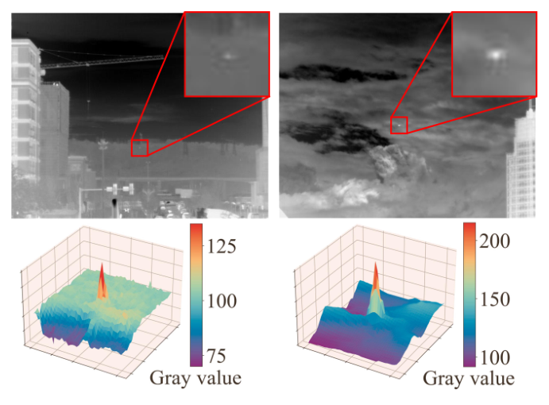
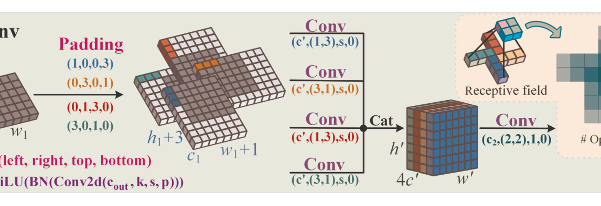
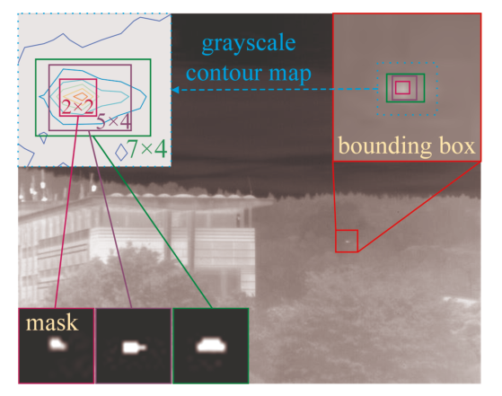
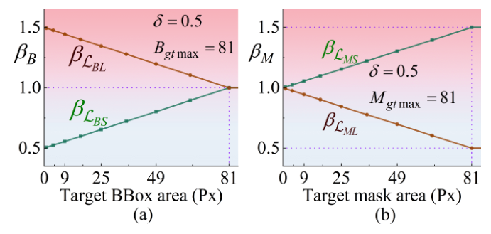
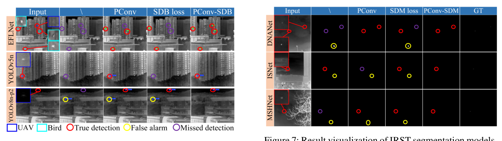
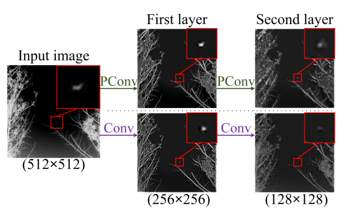
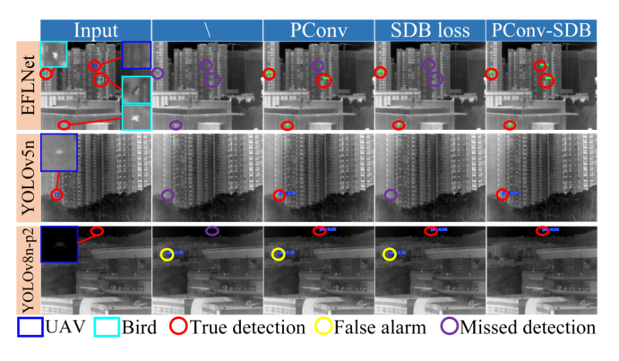
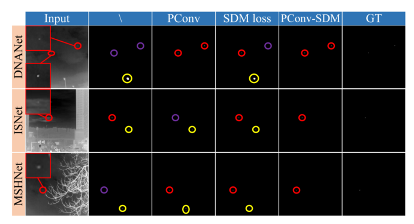

# Pinwheel-shaped Convolution and Scale-based Dynamic Loss for Infrared Small Target Detection

Paper Reading 是从个人角度进行的一些总结分享，受到个人关注点的侧重和实力所限，可能有理解不到位的地方。具体的细节还需要以原文的内容为准，博客中的图表若未另外说明则均来自原文。

| 论文概况 | 详细 |
| --- | --- |
| 标题 | 《Pinwheel-shaped Convolution and Scale-based Dynamic Loss for Infrared Small Target Detection》 |
| 作者 | Jiangnan Yang、Shuangli Liu、Jingjun Wu、Xinyu Su、Nan Hai、Xueli Huang |
| 发表会议 | The Thirty-Ninth AAAI Conference on Artificial Intelligence（AAAI-25） |
| 会议等级 | CCF A |
| 发表年份 | 2025 |
| 论文代码 | https://github.com/JN-Yang/PConv-SDloss-Data |

作者单位：

1. 西南科技大学信息工程学院
2. 南京理工大学电子与光学工程学院

## 研究动机

红外小目标检测与分割（Infrared Small Target Detection and Segmentation, IRSTDS）是军事与民用领域的重要问题，广泛用于机鸟预警、导弹制导与海上救援等任务；由于观测距离远，目标成像小、信噪比与信杂比低、缺乏纹理信息，复杂背景还会进一步遮蔽目标，导致漏检与误检频发。基于卷积神经网络的数据驱动方法依靠梯度下降自主更新参数，已成为该任务的主流，并取得了出色的性能。

但是，这条技术路线存在两处被忽视的短板。其一，现有方法普遍使用标准卷积，没有考虑红外小目标像素分布的空间特性：ISNet 引入可变形卷积虽有提升，却带来训练时间与网络参数的增加。其二，损失函数一侧，受目标暗小与人工标注主观性的影响，边界框标签与掩膜标签都存在显著的 IoU 波动误差；DIoU、CIoU 与面向掩膜的 SLS 损失都在 IoU 基础上强调位置信息，却忽略了 IoU 波动、以及尺度与位置损失在不同目标尺寸下敏感度的差异；NWD 与 SAFit 试图缓解这一问题，但对指数运算的依赖又引入复杂性与不稳定性。卷积模块与损失函数两处短板共同限制了暗小目标的检测性能，正是本文要同时解决的两个瓶颈。

## 文章贡献

针对标准卷积不匹配红外小目标空间分布、现有损失忽略尺度敏感差异的问题，本文提出了风车形卷积（Pinwheel-shaped Convolution, PConv）与基于尺度的动态损失（Scale-based Dynamic Loss, SD Loss）。PConv 以非对称填充构造水平与垂直两组卷积核、按风车形向外扩散，契合红外小目标类高斯的空间分布，在骨干网络低层替换标准卷积以增强特征提取并扩大感受野；SD Loss 则按目标尺寸动态调节尺度损失与位置损失的影响系数，分别给出面向边界框标签的 SDB 损失与面向掩膜标签的 SDM 损失。本文还构建了迄今最大的实拍单帧红外小目标检测基准 SIRST-UAVB。最终，将 PConv 与 SD Loss 集成到多种最新小目标检测与分割算法中，在 IRSTD-1K 与 SIRST-UAVB 上取得显著且一致的性能提升，验证了方法的有效性与泛化性。

## 本文方法

### 红外小目标的类高斯分布

PConv 的设计出发点是对红外小目标成像形态的观察，其灰度三维视图如下图所示。

本文对红外小目标的三维灰度分布分析显示，其像素分布呈现类高斯特性：中心亮、向四周衰减。另一方面，卷积网络的有效感受野向外递减，同样近似类高斯分布；且目标越小其特征越集中，中心特征的重要性越突出。这两点观察共同决定了卷积模块应当让采样与感受野围绕中心向外扩散式分布，即下一小节 PConv 的结构原型。

### 风车形卷积的结构

PConv 模块的结构如下图所示，用于在骨干网络低层替换标准卷积。

与标准卷积不同，PConv 用非对称填充为图像的不同区域构造水平与垂直卷积核，核沿风车形向外扩散。设输入张量为 $X^{(h_1,w_1,c_1)}$，$h_1$、$w_1$、$c_1$ 分别为其高、宽与通道数，第一层的四路并行卷积计算为：

$$\begin{aligned}X_1^{(h',w',c')}&=\mathrm{SiLU}(\mathrm{BN}(X^{(h_1,w_1,c_1)}\,^{P(1,0,0,3)}\!\otimes W_1^{(1,3,c')}))\\X_2^{(h',w',c')}&=\mathrm{SiLU}(\mathrm{BN}(X^{(h_1,w_1,c_1)}\,^{P(0,3,0,1)}\!\otimes W_2^{(3,1,c')}))\\X_3^{(h',w',c')}&=\mathrm{SiLU}(\mathrm{BN}(X^{(h_1,w_1,c_1)}\,^{P(0,1,3,0)}\!\otimes W_3^{(1,3,c')}))\\X_4^{(h',w',c')}&=\mathrm{SiLU}(\mathrm{BN}(X^{(h_1,w_1,c_1)}\,^{P(3,0,1,0)}\!\otimes W_4^{(3,1,c')}))\end{aligned}$$

其中 $\otimes$ 是卷积算子，$W_1^{(1,3,c')}$ 是输出通道为 $c'$ 的 $1\times 3$ 卷积核，填充参数 $P(1,0,0,3)$ 依次表示左、右、上、下四个方向的填充像素数；每路卷积后接批归一化（BN）与 SiLU 激活以增强训练稳定性与速度。第一层交错卷积输出的高、宽、通道数与输入的关系为：

$$h'=\frac{h_1}{s}+1,\quad w'=\frac{w_1}{s}+1,\quad c'=\frac{c_2}{4}$$

其中 $c_2$ 是 PConv 模块最终输出特征图的通道数，$s$ 为卷积步长。四路结果拼接为：

$$X'^{(h',w',4c')}=\mathrm{Cat}(X_1^{(h',w',c')},\ldots,X_4^{(h',w',c')})$$

拼接后的张量再由无填充的 $W^{(2,2,c_2)}$ 卷积核归一，输出尺寸调整为预设的 $h_2$、$w_2$（即 $h_2=h'-1=h_1/s$、$w_2=w'-1=w_1/s$），最终输出计算为：

$$Y^{(h_2,w_2,c_2)}=\mathrm{SiLU}(\mathrm{BN}(X'^{(h',w',4c')}\otimes W^{(2,2,c_2)}))$$

由于输出尺寸与标准卷积一致，PConv 可与 Conv 层互换、即插即用；末尾的 $2\times 2$ 卷积同时充当通道注意力机制，分析不同卷积方向的贡献。该结构带来的感受野与参数变化由下一小节量化。

### 感受野与参数量分析

PConv 的感受野与参数量优势可以解析地给出。图 3 右上角显示 PConv（k = 3）的感受野为 25，且卷积次数自中心向外递减、近似类高斯分布。参数量方面，标准卷积的计算公式为：

$$\mathrm{Conv}_{params}=c_2\times c_1\times k,\quad(bias=\mathrm{False})$$

其中 $k$ 是卷积核尺寸。当输出通道数 $c_2$ 等于输入通道数 $c_1$ 时，标准卷积参数量为 $9c_1^2$，而 PConv 的参数量计算为：

$$\mathrm{PConv}_{params}=4\times((c_2/4)\times c_1\times 3\times 1)+4c_2c_1=7c_2c_1=7c_1^2$$

相比 $3\times 3$ 标准卷积的 $9c_1^2$ 减少 22.2%，同时感受野增加 177%。由于 PConv 用于提取红外小目标的底层特征，实际替换的是 YOLO 系列等网络的前两层 Conv，此时 $c_2=4c_1$：标准卷积需要 $36c_1^2$ 参数，PConv 需要 $72c_1^2$ 参数，即 PConv（k = 3）以 111% 的参数增加换取 178% 的感受野提升；PConv（k = 4）则以 122% 的参数增加换取 444% 的感受野提升。可见 PConv 借助分组卷积以极小的参数代价实现了感受野的高效扩张，其输出效果在实验节的可视化中进一步验证。

### 标签 IoU 波动与动态加权动机

SD Loss 的动机来自对标签误差的实测观察，边界框与掩膜标签的误差可视化如下图所示。

由于红外小目标暗小且标注带有主观性，边界框与掩膜标签都存在显著的 IoU 波动误差：基于 IoU 的尺度损失（Sloss）在边界框标签下波动最高达 86%，目标越小越不稳定；掩膜标签因目标边界模糊，Sloss 波动也达 62%。与之相对，无论边界框大小，质心坐标与目标重心的偏差都不超过 1 像素，位置信息明显更可靠。尺度与位置两类损失的影响系数随目标面积的变化如下图所示。

图 (a) 中目标越小，Sloss 的注意力权重 $\beta_{L_{BS}}$ 越低、Lloss 的权重 $\beta_{L_{BL}}$ 越高，即在边界框标签下让小目标少受尺度损失波动的干扰；图 (b) 中掩膜标签则相反：掩膜的位置损失考虑图内所有目标的平均位置，漏掉一个目标就难以收敛、易生虚警，因此随目标减小反而增强 Sloss 的影响。这两组权重曲线由下一小节的公式按目标尺寸动态生成。

### 面向边界框标签的 SDB 损失

SDB 损失在 CIoU 的尺度项与位置项上引入动态影响系数。尺度损失与位置损失定义为：

$$L_{BS}=1-IoU+\alpha v,\quad L_{BL}=\frac{\rho^2(b_p,b^{gt})}{c^2}$$

其中 $IoU$ 是预测与真实边界框的交并比，$\alpha v$ 度量边界框的长宽比一致性，$\rho(\cdot)$ 是欧氏距离，$b_p$、$b^{gt}$ 分别是预测框 $B_p$ 与目标框 $B^{gt}$ 的质心，$c$ 是两框的最小外接框对角线长度。为感知目标在当前特征图上的真实尺寸，先计算原图与当前特征图的尺寸比 ROC，并据此给出边界框的影响系数：

$$\begin{aligned}ROC&=\frac{w_o\times h_o}{w_c\times h_c}\\\beta_B&=\min\left(\frac{B^{gt}}{B^{gt}_{max}}\times ROC\times\delta,\ \delta\right)\end{aligned}$$

其中 $w_o$、$h_o$ 是原图宽高，$w_c$、$h_c$ 是当前特征图宽高；$\beta_B$ 是基于当前目标框面积的影响系数，$B^{gt}_{max}=81$ 是国际光学工程学会定义的红外小目标最大尺寸，可调超参数 $\delta$ 限制其取值范围。最终的影响因子与 SDB 损失为：

$$\beta_{L_{BS}}=1-\delta+\beta_B,\quad \beta_{L_{BL}}=1+\delta-\beta_B$$

$$L_{SDB}=\beta_{L_{BS}}\times L_{BS}+\beta_{L_{BL}}\times L_{BL}$$

给出一个简单的例子，假设 $\delta=0.5$、$ROC=1$：当目标框面积 $B^{gt}=9$ 像素时 $\beta_B=\min(9/81\times 0.5,0.5)\approx 0.056$，于是 $\beta_{L_{BS}}\approx 0.556$、$\beta_{L_{BL}}\approx 1.444$，尺度损失被压到约一半权重、位置损失被放大；当 $B^{gt}=100>81$ 时 $\beta_B=\min(100/81\times 0.5,0.5)=0.5$，两个影响因子都回到 1。可以看到，目标越大损失越接近原始 CIoU——原文也指出当目标框面积大于 81 时 $L_{SDB}$ 退化为 CIoU 损失，动态机制只在小目标上起作用。

### 面向掩膜标签的 SDM 损失

SDM 损失把同样的动态机制移植到掩膜标注的分割任务。参照 SLS 损失，掩膜尺度损失与掩膜位置损失定义为：

$$\begin{aligned}L_{MS}&=1-\omega\frac{|M^p\cap M^{gt}|}{|M^p\cup M^{gt}|}\\L_{ML}&=1-\frac{\min(d_p,d^{gt})}{\max(d_p,d^{gt})}+\frac{4}{\pi^2}(\theta_p-\theta^{gt})^2\end{aligned}$$

其中 $M^p$、$M^{gt}$ 分别是目标预测像素与真实像素集合，$d_p$、$d^{gt}$ 是预测与目标平均像素在极坐标下到原点的距离，$\theta_p$、$\theta^{gt}$ 是相应的平均角度，$\omega$ 描述 $M^p$ 与 $M^{gt}$ 的差异。掩膜的影响系数与 SDB 同构：

$$\begin{aligned}\beta_M&=\min\left(\frac{M^{gt}}{M^{gt}_{max}}\times ROC\times\delta,\ \delta\right)\\\beta_{L_{MS}}&=1+\beta_M,\quad \beta_{L_{ML}}=1-\beta_M\\L_{SDM}&=\beta_{L_{MS}}\times L_{MS}+\beta_{L_{ML}}\times L_{ML}\end{aligned}$$

其中 $M^{gt}_{max}=81$，$\beta_{L_{MS}}$、$\beta_{L_{ML}}$ 分别是 $L_{MS}$ 与 $L_{ML}$ 的影响因子。与 SDB 相反，SDM 随目标减小而加大尺度损失权重、压低位置损失权重，以回避掩膜位置损失在多目标漏检时的收敛困难。至此，PConv 与 SD Loss 两个即插即用组件设计完毕，其收益由实验节在检测与分割两类框架上验证。

## 实验结果

### 实验设置

实验使用两个数据集：IRSTD-1K 含 1,000 张真实红外图像、分辨率 512 × 512 像素、目标平均尺度较大；SIRST-UAVB 是本文新建的基准，含 3,000 张以无人机与鸟类为目标的红外图像，跨季节、天气与复杂背景采集一年，包含 1,742 个鸟类与 2,955 个无人机边界框标签（鸟类目标过暗，未纳入掩膜标注），小目标占比高、是迄今最大的实拍单帧 IRSTDS 数据集；两数据集均按 4:1 划分训练与测试集。边界框标签用精确率 P、召回率 R 与 mAP50 评价（TP 的 IoU 阈值取 0.45），掩膜标签用 IoU、虚警率 Fa 与检测概率 Pd 评价。实现基于 PyTorch 框架与 RTX3090 GPU：检测模型输入尺寸 640、batch size 64、训练 700 epochs、patience 70、学习率 0.01；分割模型输入尺寸 256、batch size 4、训练 400 epochs、学习率 0.05。

### 卷积模块对比

在 YOLOv8n-p2 检测与 MSHNet 分割框架中替换前两层标准卷积，各卷积模块的对比如下表所示。

GConv 与 DSConv 侧重减少参数，DRConv、LSKConv、DConv、MixConv、AKConv 侧重扩大感受野，但多数模块在 YOLOv8n-p2 上并未稳定提升性能；MixConv 虽有竞争力却需要更多参数，仍不及 PConv。IRSTD-1K 上 PConv(4,4) 的平均指标最佳，而 PConv(4,3) 拿下最多的单项最优、提升最均衡；SIRST-UAVB 上 PConv(4,3) 的提升最佳且最均衡，可见目标较大的 IRSTD-1K 适合更长的 PConv 核，小目标为主的 SIRST-UAVB 上继续加长核不再带来收益。MSHNet 分割模型中 PConv 显著优于其他卷积模块，说明第一层核长 4 提供的感受野对捕捉小目标特征更关键，下采样后核长 3 已足够。

### 损失函数对比与 δ 消融

YOLOv8n-p2 上各边界框损失与 SDB(δ) 的对比如下表所示。

SAFit 在 SIRST-UAVB 上表现良好，但在 IRSTD-1K 上明显下滑；SDB 则在两个数据集上给出一致且均衡的提升，且不含 NWD、SAFit 所需的指数运算，更简单高效。MSHNet 上各掩膜损失与 SDM(δ) 的对比如下表所示。

SDM(0.5) 取得最佳的整体性能并在两个数据集间保持平衡。δ 的消融显示：检测模型中较小的 δ 在 IRSTD-1K 上更好、较大的 δ 在 SIRST-UAVB 上更好，因为边界框的 IoU 波动大于掩膜、对 δ 更敏感，更大的 δ 拓宽了动态影响系数 β 的波动范围、更有利于小目标；分割模型中 δ = 0.5 始终给出最佳平衡，即 δ 应按目标尺寸选取。

### 多模型消融

将 PConv 与 SD 损失组合注入多个检测与分割网络（基线损失为 CIoU 与 SLS），消融结果如下表所示。

PConv 与 SDB 损失的组合在全部检测模型上取得最高 mAP50，EFLNet 上精确率与召回率的增益尤为显著；分割模型中 PConv 与 SDM 的组合同样带来一致提升，DNANet 增益最大。MSHNet 上组合方案优于基线但未超过单用 PConv 加 SDM 的配置，表明最优配置需按具体架构调整。整体看，两个组件在不同模型上都保持稳定增益，泛化性得到验证。

### 可视化分析

PConv 与标准卷积的输出对比、以及检测与分割模型的定性结果分别如下图所示。

PConv 的输出增强了红外小目标与背景的对比度，同时抑制了类杂波信号，与其风车形感受野契合类高斯分布的设计预期一致。检测模型的定性结果如下图所示。

检测一栏中，使用 PConv 的模型减少了对暗小目标的漏检，叠加 SD 损失后对弱信号的检出进一步增强。分割模型的定性结果如下图所示。

PConv 减少了漏检，SD 损失增强了对弱信号的检测，二者共同降低虚警、提升鲁棒性，与定量表中 Fa 下降、Pd 上升的趋势相互印证。

## 优点和创新点

个人认为，本文有如下一些优点和创新点可供参考学习：

1. 从红外小目标类高斯灰度分布出发设计风车形卷积，用非对称填充的水平/垂直核扩散采样，以极小参数代价大幅扩张感受野，设计巧妙。
2. 依据目标尺寸动态调节尺度与位置损失的影响系数，并针对边界框与掩膜两类标签给出方向相反的加权策略，退化分析清晰，形式简单有效。
3. 构建最大实拍单帧红外小目标基准 SIRST-UAVB，并在六个检测与分割模型上验证组件的即插即用性与一致增益，实验丰富、说服力强。
