# RSO-YOLO: A Real-Time Detector for Small and Occluded Objects in Autonomous Driving Scenarios

Paper Reading 是从个人角度进行的一些总结分享，受到个人关注点的侧重和实力所限，可能有理解不到位的地方。具体的细节还需要以原文的内容为准，博客中的图表若未另外说明则均来自原文。

| 论文概况 | 详细 |
| --- | --- |
| 标题 | 《RSO-YOLO: A Real-Time Detector for Small and Occluded Objects in Autonomous Driving Scenarios》 |
| 作者 | Quanxiang Wang、Zhaofa Zhou、Zhili Zhang |
| 发表期刊 | Sensors |
| 期刊等级 | 未获取 |
| 发表年份 | 2025 |
| 论文代码 | 未获取（代码需向通讯作者索取） |

作者单位：

1. 火箭军工程大学导弹工程学院（School of Missile Engineering, Rocket Force University of Engineering, Xi'an 710025, China）

## 研究动机

自动驾驶场景下的小目标与遮挡目标检测是视觉感知的重要问题，表现为远距离的行人与车辆往往只占几十个像素、复杂车流中目标频繁被部分或完全遮挡，导致漏检与误检直接抬升行车风险。以 YOLOv12 为代表的单阶段检测器借助区域注意力机制兼顾了精度与实时性，但在真实交通场景中仍面临三个并列的瓶颈：

1. **小目标检测性能欠佳**：城市道路中远处目标的特征表示不足，难以被准确检测与识别；
2. **遮挡削弱检测可靠性**：频繁的部分或完全遮挡造成视觉信息大量丢失，误检与漏检风险同时抬升；
3. **精度与效率难以兼得**：车载系统必须在高帧率下可靠运行，对计算效率约束严格，现有算法常顾此失彼。

围绕上述瓶颈的已有工作大多只覆盖其中一两项：Attention-YOLOv4 用通道注意力加残差块增强局部特征，却参数复杂、推理缓慢；YOLOv8-ghost-EMA 与 MEL-YOLO 走轻量化路线，小目标精度提升有限；RFCS-YOLO 改造 YOLOv7 颈部提升交通目标检测，计算复杂度又拖慢了速度；YOLO-BOS 用双层路由空间注意力与 Shape-IoU 损失增强遮挡检测，计算成本却限制了其部署。暂未有算法在同一框架内同时兼顾小目标检测、遮挡处理与轻量化设计三个目标，而真实自动驾驶场景中三者往往并发出现。

## 文章贡献

针对现有检测器难以同时应对小目标、遮挡与轻量化三重挑战的问题，本文提出了基于 YOLOv12 的增强模型 RSO-YOLO，其核心是「颈部换装 + 特征补偿 + 轻量检测头」三处协同改造。首先用带权双向特征金字塔 BiFPN 与空间到深度卷积 SPD-Conv 替换原颈部，在高效融合多尺度特征的同时于下采样中保留细粒度信息，并增开浅层 P2 检测头强化小目标感知；接着提出特征增强补偿模块 FECM，以五分支并行结构强化未遮挡区域的判别特征，再把高置信线索迁移到遮挡位置补偿缺失语义，并用指数放大增强弱目标响应；最终以全局跨维坐标模块 GCCM 为基础构建轻量检测头 GCCHead，通过分组与协同增强在降低计算复杂度的同时提升精度。本文在 SODA10M、BDD100K 与 FLIR ADAS 三个自动驾驶数据集上进行了实验，RSO-YOLO 较 YOLOv12 的 mAP@0.5 分别提升 8.0%、10.7% 与 7.2%，参数量减少 15.4%、模型复杂度下降 20%。

## 本文方法

### 整体架构

RSO-YOLO 沿用 backbone-neck-head 三段式结构并重点改造后两段，整体结构如下图所示。

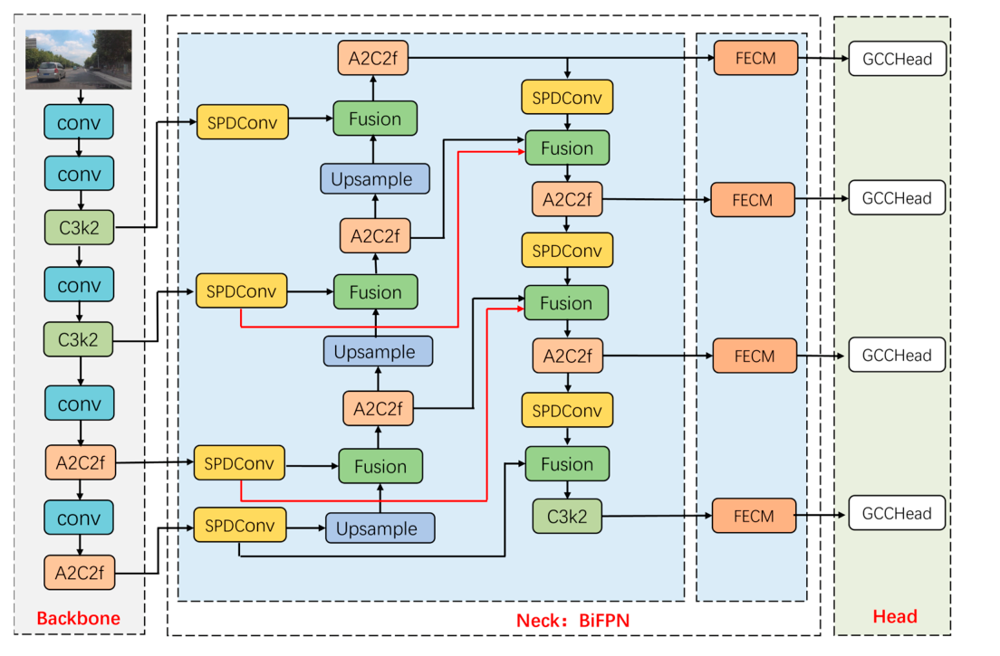

该结构保留骨干的 C3k2 与 A2C2f 特征提取通路，颈部由 BiFPN 承担带权双向跨尺度融合、由 SPD-Conv 承担无损下采样，特征通路中嵌入 FECM 做遮挡补偿，检测头则扩展出 P2 浅层分支并整体替换为 GCCHead。作为改造基线，YOLOv12 的网络结构如下图所示。

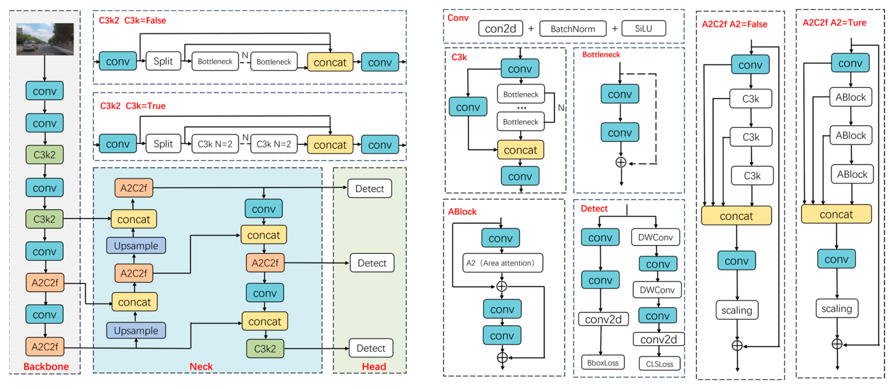

其骨干以 C3k2 与 A2C2f 逐级提取特征，颈部用 FPN 与 PAN 完成自顶向下与自底向上的多尺度交互，检测头由三个解耦子头构成、各自包含独立的分类与回归分支；本文的全部改造都落在颈部与检测头两处。各组件的分工如下表所示。

| 组件 | 模块 | 功能 |
| --- | --- | --- |
| Backbone | C3k2 + A2C2f | 高效多尺度特征提取 |
| Neck | BiFPN + SPD-Conv | 带权双向跨尺度融合，下采样保留细粒度信息 |
| 特征补偿 | FECM | 增强可见区域特征，补偿遮挡区域语义 |
| Head | P2 分支 + GCCHead（内置 GCCM） | 浅层高分辨率监督小目标，轻量头兼顾精度与效率 |

骨干输出的多尺度特征先进入 BiFPN 融合，P2 至 P5 特征经 FECM 增强补偿后由 GCCHead 输出分类与回归结果，构成整网数据流。

### 双向特征金字塔 BiFPN

BiFPN 的目标是以带权特征重分配的方式把不同尺度的特征表示高效整合，其结构如下图所示。

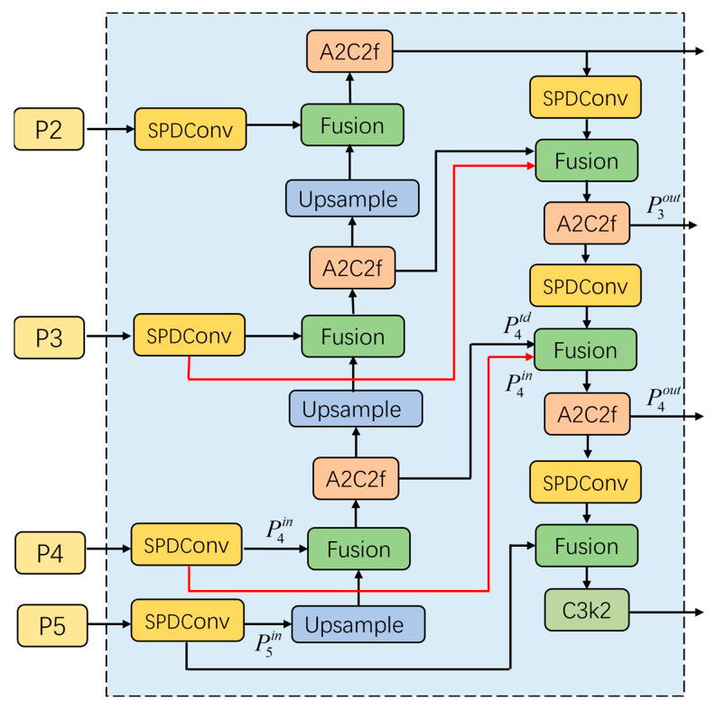

它以多尺度特征列表 $\vec{P}_{in} = (P_{l_1}^{in}, P_{l_2}^{in}, \ldots)$ 为输入，经双向融合输出新列表 $\vec{P}_{out} = f(\vec{P}_{in})$。不同分辨率特征图的贡献并不均等，BiFPN 给每个输入分支赋一个可训练权重系数；本文采用快速归一化融合方案，并在分母加入小常数 $\epsilon = 0.0001$ 防止数值不稳定，融合输出的计算公式如下：

$$O = \sum_i \frac{w_i}{\epsilon + \sum_j w_j} \cdot I_i$$

其中 $w_i$ 是第 $i$ 个输入特征的权重系数，$I_i$ 为对应的输入特征图。归一化后的权重被约束在 0 到 1 之间且无需 Softmax，这等价于用一次除法换取自适应的特征贡献再平衡。以第四层的融合为例，自顶向下路径中 P4 的中间过渡特征构造为：

$$P_4^{td} = \mathrm{Block}\left(\frac{w_1 \cdot P_4^{in} + w_2 \cdot \mathrm{Resize}(P_5^{in})}{w_1 + w_2 + \epsilon}\right)$$

双向融合后 P4 的最终输出特征则构造为：

$$P_4^{out} = \mathrm{Block}\left(\frac{w_3 \cdot P_4^{in} + w_4 \cdot P_4^{td} + w_5 \cdot \mathrm{Resize}(P_3^{out})}{w_3 + w_4 + w_5 + \epsilon}\right)$$

两式涉及的符号含义如下表所示：

| 符号 | 含义 |
| --- | --- |
| $P_4^{td}$ | 自顶向下路径中 P4 尺度的中间过渡特征 |
| $P_4^{out}$ | 双向融合后 P4 的最终输出特征 |
| $\mathrm{Block}$ | 卷积处理单元，本文用 A2C2f 模块替换标准卷积 |
| $\mathrm{Resize}$ | 上采样或下采样操作 |

直观上，每个尺度既接收来自更深层的语义、也接收来自更浅层的细节，可训练权重让网络自己决定各输入的贡献比例。BiFPN 的下采样路径由 SPD-Conv 接管，融合结果送往 FECM 与 P2 至 P5 检测分支。

### 空间到深度卷积 SPD-Conv

SPD-Conv 的目标是解决传统跨步下采样固有的细粒度信息丢失问题，作为下采样单元替换 BiFPN 中的标准卷积，其结构如下图所示。

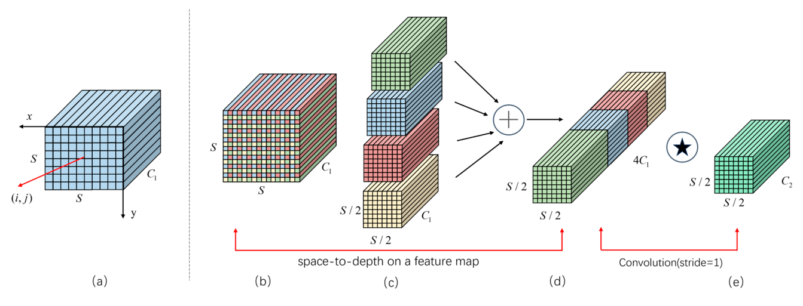

SPD 模块按预设下采样率把输入特征图切成小块，将二维平面上的空间信息重映射到通道维，随后用 1×1 卷积压缩扩张后的通道，得到紧凑而高效的特征表示。当尺度因子取 2 时，通道数变为 4 倍、空间分辨率减半，可实现对原始内容的近无损重构。直观上，下采样不再「扔掉」像素，而是把像素搬进通道里留待卷积筛选，小目标的细粒度细节因此被保留下来。SPD-Conv 的输出沿 BiFPN 通路继续参与跨尺度融合，并为 P2 浅层分支提供高分辨率细节。

### 特征增强补偿模块 FECM

FECM 的目标是一手强化未遮挡区域的判别特征、一手补偿遮挡区域缺失的语义信息，其结构如下图所示。

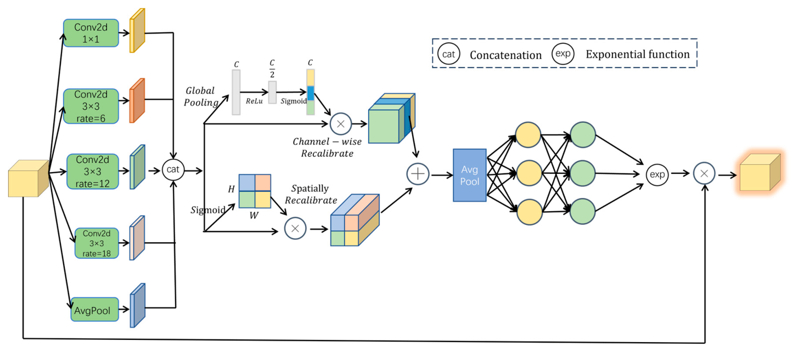

FECM 采用五分支并行架构：一条 1×1 卷积分支保持原空间分辨率，三条膨胀率分别为 6、12、18 的 3×3 膨胀卷积分支逐级扩大感受野，一条全局平均池化分支提取全局语义、在局部纹理缺失时提供上下文补充。各分支特征沿通道拼接后，经通道与空间注意力的联合校准把两路注意力输出相加融合，再用 1×1 卷积降维整合，未遮挡区域的显著特征由此被放大；随后模块引入两层全连接网络，把未遮挡区域的高置信线索迁移到遮挡位置，强化遮挡与未遮挡目标之间的关联。最后对增强特征做指数变换，把权重范围从 [0, 1] 扩展到 [1, e] 再与原特征相乘。直观上，指数放大保持了相对排序、又降低了对小值扰动的敏感度，弱目标响应因此被抬升。FECM 嵌在颈部与检测头之间，其输出送入 GCCHead 参与最终预测。

### 全局跨维坐标模块 GCCM

GCCM 的目标是用分组处理与多维注意力机制，在压低计算复杂度的同时捕获全局上下文信息，其结构如下图所示。

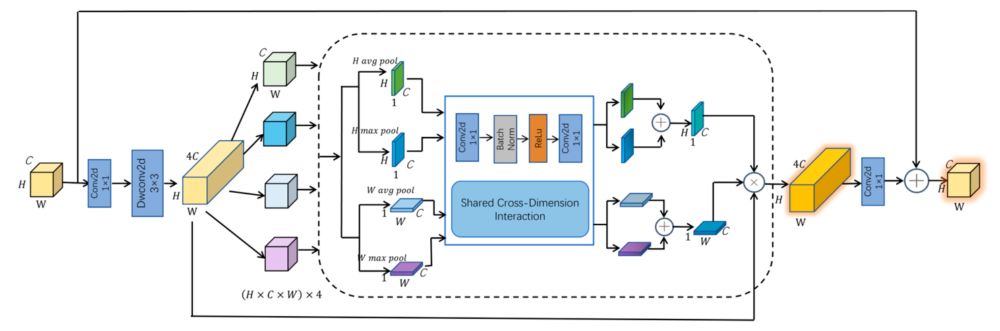

GCCM 先用 1×1 卷积做通道扩张丰富特征表示，再以深度可分离 3×3 卷积逐通道提取空间信息，在保持有效感受野的同时压低计算量与参数量；经共享跨维交互单元完成通道压缩与恢复后，分组特征被聚合求和并过 Sigmoid，生成水平与垂直两个方向的注意力图，对扩张特征做逐元素调制；最后 1×1 卷积降回通道数、经残差路径与输入相加。直观上，分组处理控制开销，跨维坐标注意力突出关键区域、抑制无关响应。GCCM 级联后接入 GCCHead 的分类与回归两支，为其提供增强后的特征。

### 全局跨维坐标检测头 GCCHead

GCCHead 的目标是在不牺牲全局上下文感知的前提下把检测头做轻，其结构如下图所示。

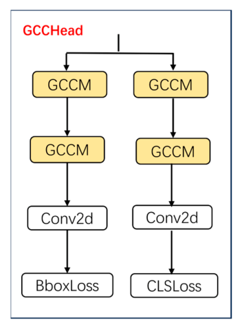

与只依赖标准卷积的传统 YOLO 检测头不同，GCCHead 在分类与回归分支之前串接多个 GCCM，以降低模型复杂度并强化全局上下文捕获能力，两支分别以 BboxLoss 与 CLSLoss 监督训练。P2 浅层头随 GCCHead 一同接入，用高分辨率特征为小目标提供额外监督，整网由此形成四头结构。GCCHead 接收 FECM 增强后的 P2 至 P5 特征，输出四个尺度的分类与回归结果，完成整网数据流。

## 实验结果

### 实验设置

本文在 SODA10M、BDD100K 与 FLIR ADAS 三个自动驾驶数据集上评测，数据集构成如下表所示。

| 数据集 | 图像数 | 类别 | 划分（训练/验证/测试） |
| --- | --- | --- | --- |
| SODA10M | 10000（采样标注） | 6 类（三轮车、有轨电车、轿车、骑行者、卡车、行人） | 60% / 20% / 20% |
| BDD100K | 10000（选取） | 4 类（轿车、人、交通灯、交通标志） | 60% / 20% / 20% |
| FLIR ADAS | 5000（可见光） | 3 类（行人、自行车、轿车） | 60% / 20% / 20% |

SODA10M 测试集另按启发式规则切出遮挡子集：目标框与其他目标框重叠超过自身面积 20% 即记为遮挡；并按 COCO 协议以 32² 与 96² 像素面积切出小、中、大三个尺度子集。指标方面，设 $TP$、$FP$、$FN$ 分别为正确检出、误检与漏检的样本数，精确率的计算公式如下：

$$P = \frac{TP}{TP + FP}$$

召回率的计算公式如下：

$$R = \frac{TP}{TP + FN}$$

其中 $P$ 为预测为正的样本中判对的比例，$R$ 为真实正样本中被找回的比例。这等价于从查准与查全两个角度刻画检测质量。单类别的 AP 与多类别的 mAP 定义为：

$$AP = \int_0^1 P \, dR$$

mAP 对各类别的 AP 取宏平均，计算为：

$$mAP = \frac{1}{N}\sum_{i=1}^{N} AP_i$$

其中 $N$ 为类别数，AP 即精确率-召回率曲线下的面积。直观上，AP 把整条曲线压缩成一个面积值，mAP 再对类别求平均。复杂度以 Params 与 GFLOPs 衡量，速度以推理 FPS 衡量。训练在 VirtAI Cloud 的 B1.medium 实例（16 GB 内存、12 GB 显存）上完成，环境为 Ubuntu 22.04、Python 3.10、PyTorch 2.0.1 与 CUDA 11.8；输入统一缩放到 640×640，采用 SGD（初始学习率 0.01、动量 0.937、权重衰减 0.0005）与余弦退火调度，训练 300 个 epoch、batch size 为 16。损失沿用 YOLOv12 配置：回归侧用 CIoU 定位损失度量预测框与真实框的几何差异，分类侧用 Dynamic Focal Loss 与 Meta-Contrastive Loss，三者权重分别为 0.8、0.3 与 0.2。

### 定性效果对比

本文选取 SODA10M 三类代表场景，对六个模型的检测效果做并排可视化，检测框按类别着色：蓝为轿车、红为有轨电车、黄为卡车、绿为骑行者、紫为行人。目标少、遮挡轻微的常规场景如下图所示。

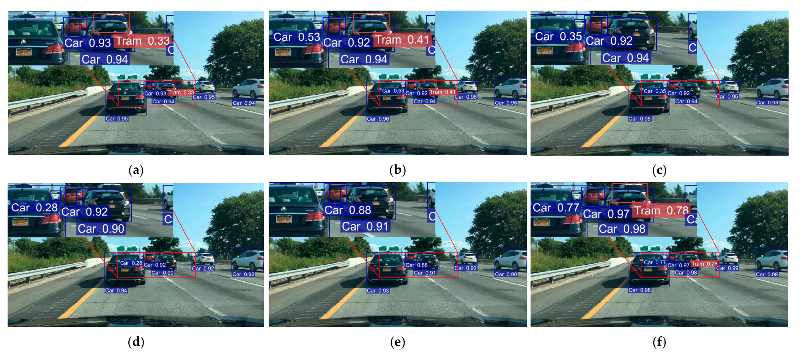

各模型都能检出主要目标，但出现轻微遮挡时 YOLOv10n、YOLOv11n 与 YOLOv12n 产生漏检，YOLOv8n 与 YOLOv9t 虽检出部分遮挡目标、定位准确度却明显低于 RSO-YOLO，可见本文方法有效抑制了背景干扰。远距离小目标场景的对比如下图所示。

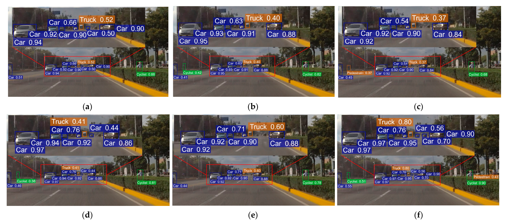

除 RSO-YOLO 外所有模型都漏检了行人，YOLOv8n、YOLOv10n 与 YOLOv12n 还漏检了骑行者，YOLOv10n 更因路边护栏遮挡把骑行者误判为行人，可以看出 P2 浅层头带来的召回增益。密集遮挡场景的对比如下图所示。

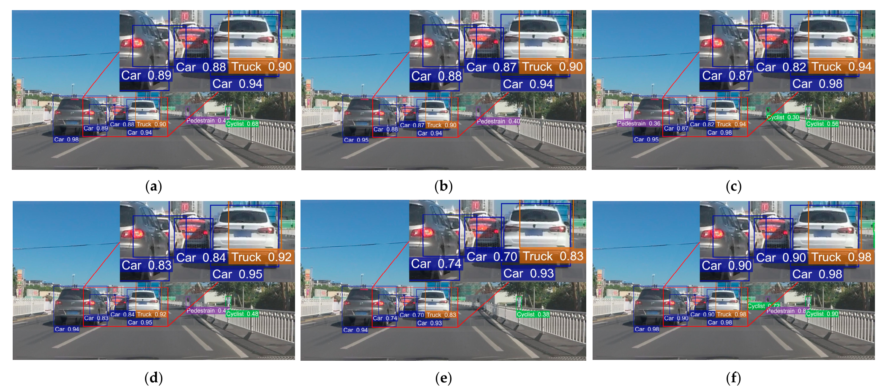

YOLOv10n 把路边盆栽误判为行人，其余对比模型也出现不同程度的误检与漏检，而 RSO-YOLO 保持稳定检测，表明 FECM 的语义补偿压低了遮挡引发的误检与漏检。

### 对比实验

SODA10M 上与主流轻量检测器的主对比如下表所示。

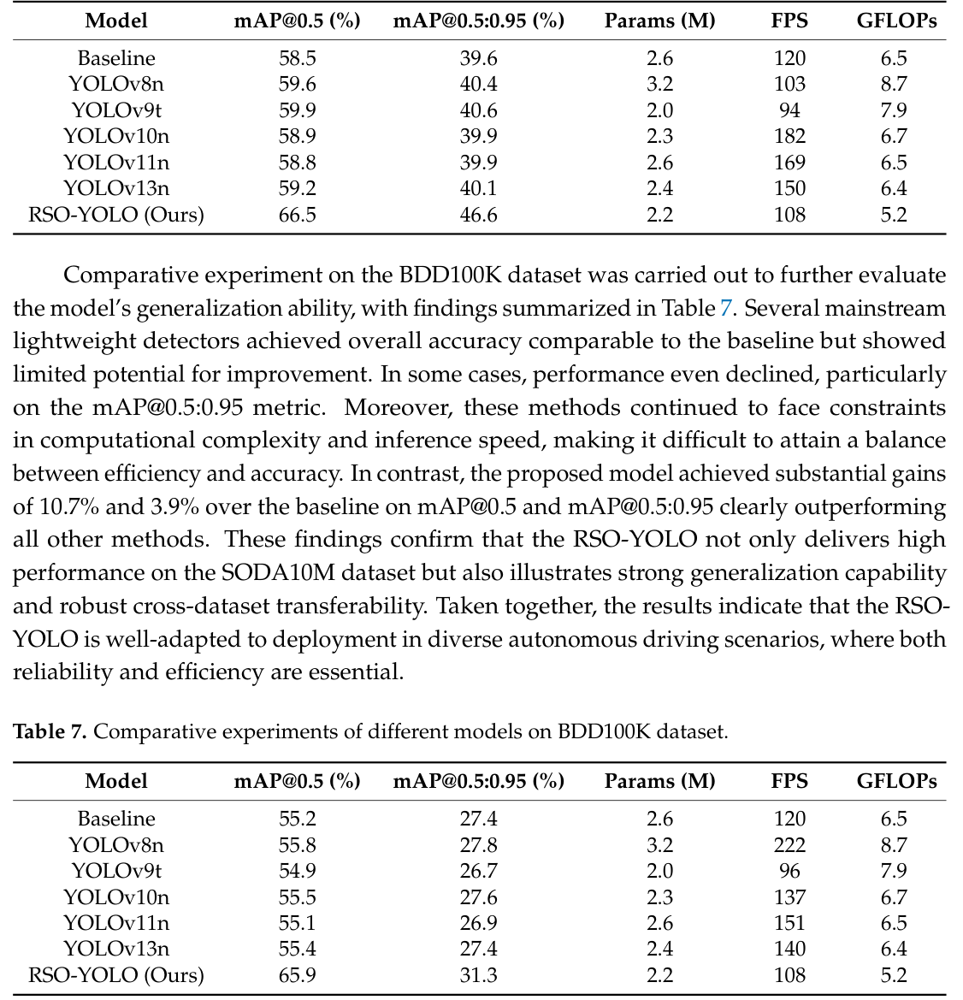

YOLOv8n 至 YOLOv13n 相比基线只有小幅提升且各有算力短板，如 YOLOv9t 要付出 7.9 GFLOPs 的复杂度才换来 59.9% 的 mAP@0.5；RSO-YOLO 以 66.5% 的 mAP@0.5 与 46.6% 的 mAP@0.5:0.95 全面领先，参数仅 2.2 M、计算量仅 5.2 GFLOPs，可见精度收益并未以算力为代价。与近两年先进改进模型的对比如下表所示。

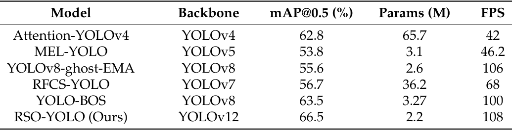

Attention-YOLOv4 与 RFCS-YOLO 的骨干分别携带 65.7 M 与 36.2 M 参数、难以实时部署，YOLO-BOS 精度较强但参数达 3.27 M；RSO-YOLO 以 2.2 M 参数、108 FPS 拿下 66.5% 的 mAP@0.5，可见轻量化与高精度在此并不互斥。SODA10M 上的训练曲线如下图所示。

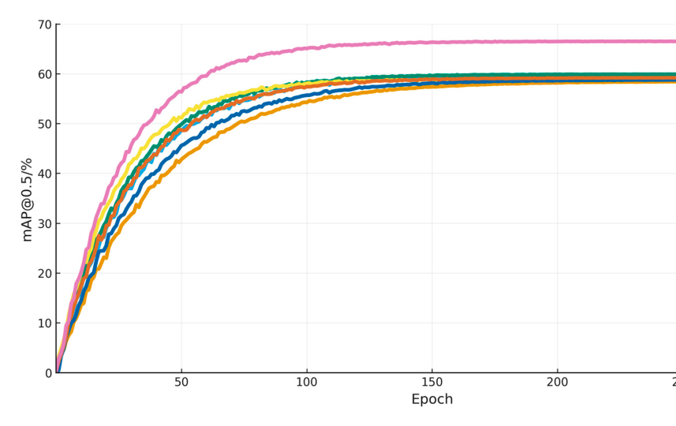

本文曲线全程位于对比模型之上并平稳收敛，验证了同等训练协议下该配置的收敛稳定性。

### 跨数据集泛化

BDD100K 上的跨数据集对比如下表所示。

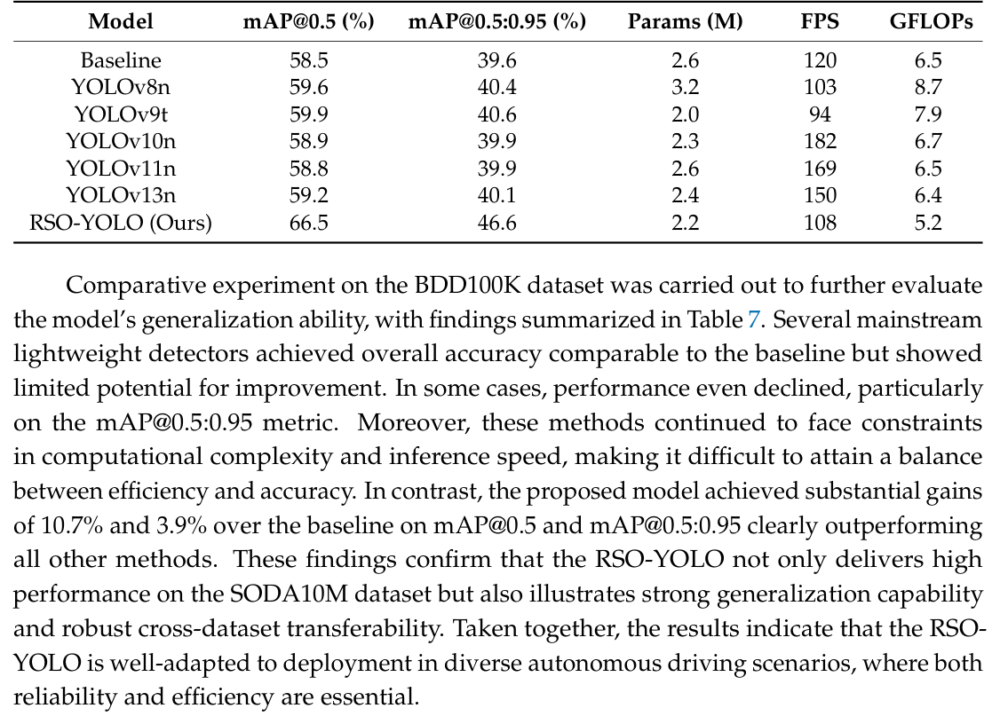

本文较基线提升 mAP@0.5 达 10.7%、mAP@0.5:0.95 达 3.9%，部分对比模型甚至出现精度回落，表明模型具备跨数据集的泛化能力。FLIR ADAS 上的对比如下表所示。

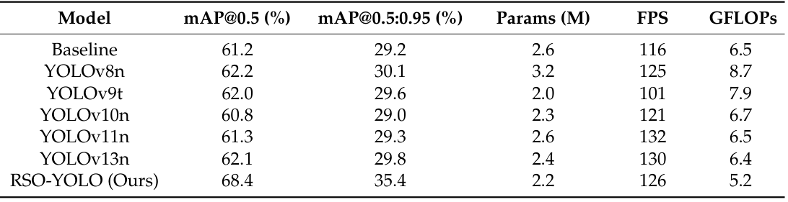

mAP@0.5 与 mAP@0.5:0.95 分别达 68.4% 与 35.4%，较基线提升 7.2%，FPS 保持 126，验证了架构优化在可见光车载数据上的迁移效果。BDD100K 上的训练曲线如下图所示。

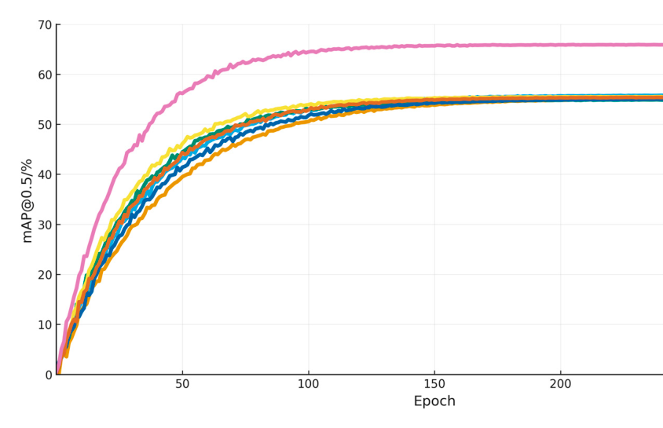

本文曲线在整个训练过程中持续领先，说明模型对新域具有较强的适应性。FLIR ADAS 上的训练曲线如下图所示。

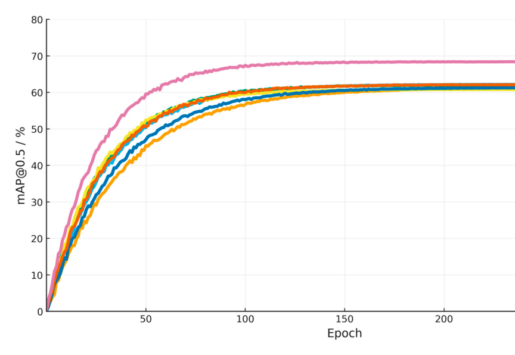

本文收敛更快也更平稳，表明优化过程稳定、泛化能力良好。

### 消融实验

SODA10M 上对 BiFPN（A）、P2 检测头（B）、GCCHead（C）、FECM（D）四个策略做单模块与组合消融，结果如下表所示。

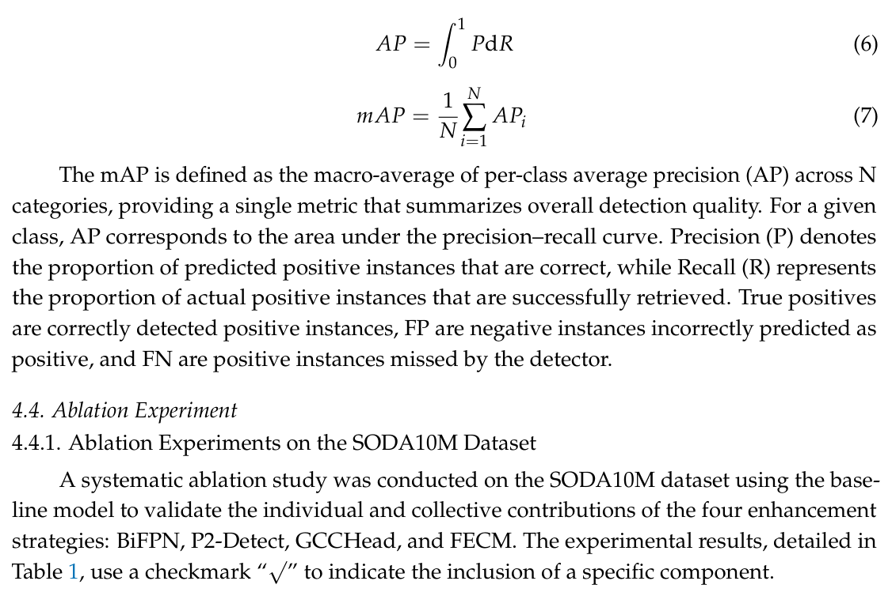

单模块上，A 把计算复杂度压低 35.4%、参数减少 15.4%，两项 mAP 仍提升 0.7% 与 0.6%；B 贡献最大的单项精度增益（4.5% 与 5.0%）但 GFLOPs 上涨；C 在减参 15.4% 的同时提升精度；D 让两项 mAP 各升 0.8% 且参数几乎不增。组合后互补性显现，ABCD 最终把精确率拉到 77.1%、两项 mAP 提升 8.0% 与 7.0%，说明四个模块各管一段、叠加无内耗。各消融配置的归一化综合对比如下图所示。

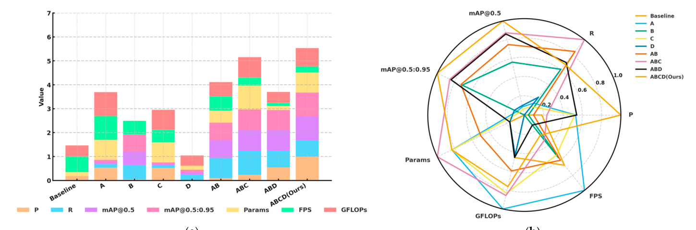

柱状图与雷达图显示 ABCD 配置在 mAP、FPS 与复杂度各项上最均衡，可以看出组合配置取得了最好的综合表现。BDD100K 上的消融结果如下表所示。

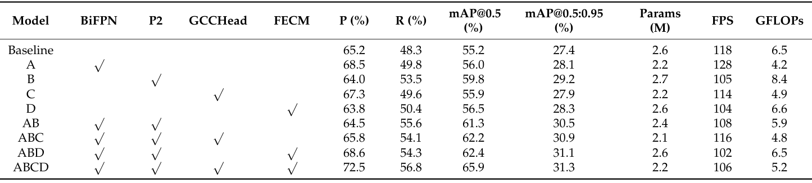

各模块同样逐项正增益，最终配置取得 72.5% 精确率、65.9% mAP@0.5 与 31.3% mAP@0.5:0.95，验证了模块设计的鲁棒性；其归一化综合对比如下图所示。

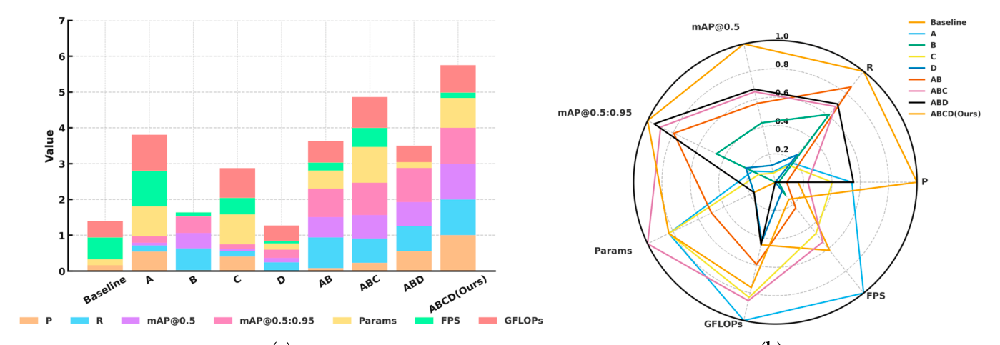

组合策略的累积收益清晰可见，表明多模块集成产生了协同效应。三处替换各自还有专项验证：颈部网络的对比如下表所示。

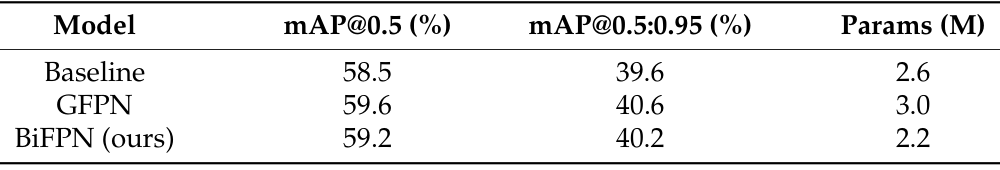

GFPN 精度略高但要多花 0.4 M 参数，本文 BiFPN 以 59.2% 的 mAP@0.5 少用 0.8 M 参数，可见精度与复杂度的折中更优。遮挡子集上 FECM 的专项对比如下表所示。

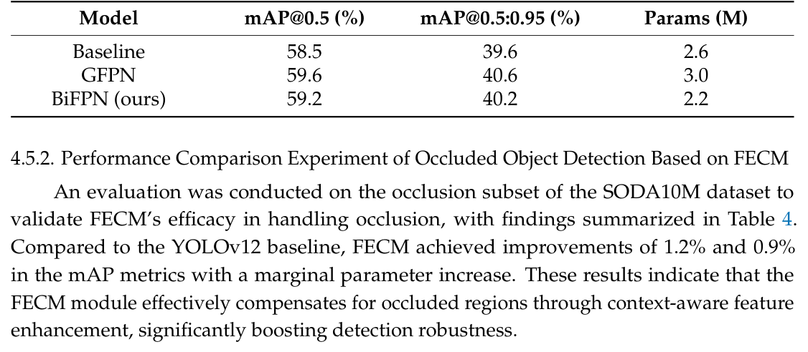

加装 FECM 后遮挡子集两项 mAP 提升 1.2% 与 0.9% 而参数几乎不变，表明上下文感知的特征增强确实补偿了遮挡区域。检测头的专项对比如下表所示。

GCCHead 较基线两项 mAP 提升 0.5% 与 0.4%、参数减少 0.4 M，且在精度与复杂度上同时优于 v10Detect，说明三处替换各自站得住。

### 小目标与遮挡条件分析

按 COCO 尺度协议分组的定量结果如下表所示。

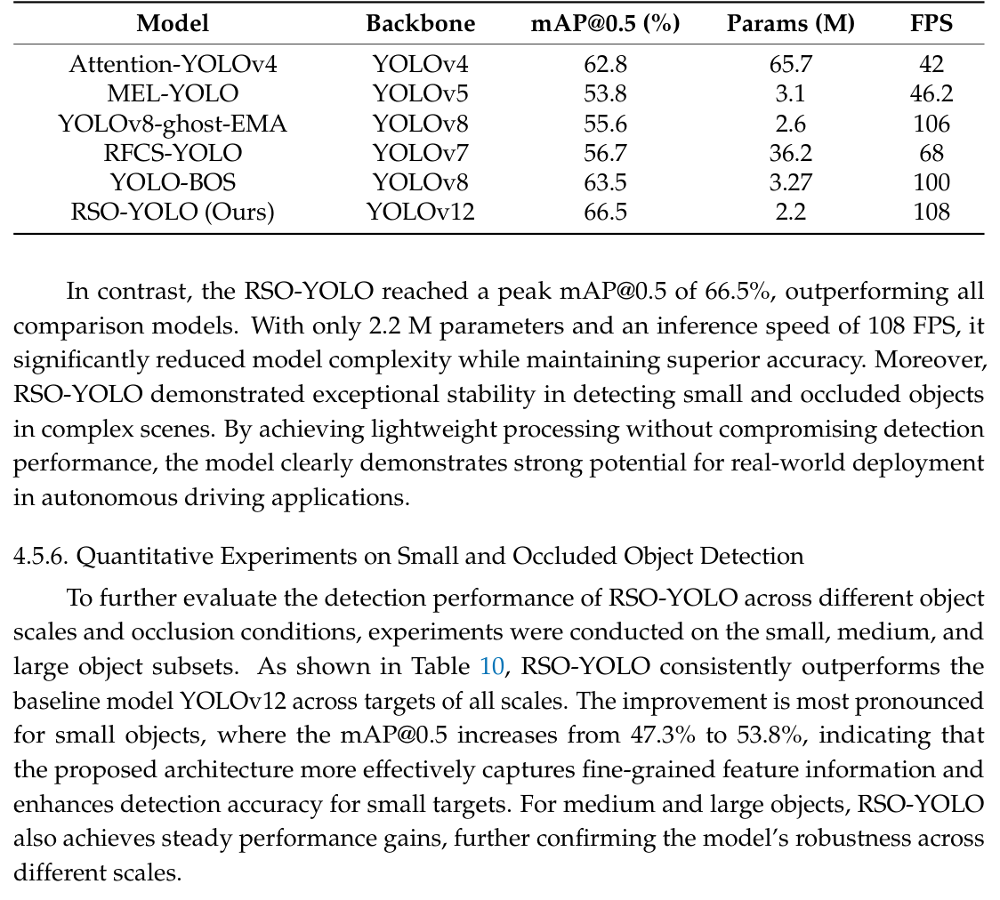

小目标子集的 mAP@0.5 从 47.3% 升到 53.8%、mAP@0.5:0.95 从 26.8% 升到 32.5%，中、大目标子集也稳步提升，说明改进对小目标的收益最大且未损害其他尺度。按遮挡条件分组的结果如下表所示。

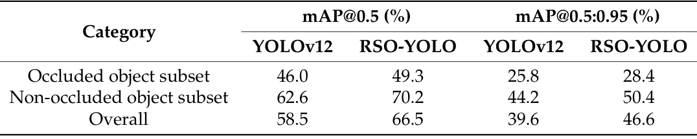

遮挡子集两项指标提升 3.3% 与 2.6%，非遮挡子集提升更多，表明 FECM 在补偿遮挡语义的同时也强化了可见区域特征。

### 可视化分析

为验证 FECM 的工作机制，本文对 YOLOv12 与加装 FECM 的模型做热力图对比如下图所示，其中 (a)(d) 为原图、(b)(e) 为 YOLOv12 的检测结果、(c)(f) 为加装 FECM 后的检测结果，红黄色代表关注度高、绿色代表关注度低。

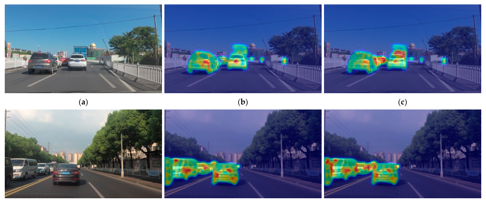

与 (b)(e) 相比，(c)(f) 在遮挡区域的注意力明显更集中，说明 FECM 引导模型把关注从可见区域延伸到被遮挡区域、补偿了语义信息丢失，与遮挡子集上的定量增益互相印证。

## 优点和创新点

个人认为，本文有如下一些优点和创新点可供参考学习：

1. 把 BiFPN 的带权双向融合与 SPD-Conv 的无损下采样组合进 YOLOv12 颈部，并增开 P2 浅层检测头，多尺度融合效率与小目标感知同步提升，参数量还省下 15.4%。
2. 提出 FECM 遮挡补偿机制，五分支并行提取多尺度上下文后，用两层全连接把未遮挡区域的高置信线索迁移到遮挡位置，再以指数变换放大弱响应，遮挡子集 mAP@0.5 提升 3.3%。
3. 实验在三个数据集上覆盖消融、专项对比、尺度与遮挡分组定量及热力图可视化，RSO-YOLO 以 2.2 M 参数取得 66.5% 的 mAP@0.5、全面领先对比模型，说服力强。
