# 基于无人机 RGB 图像与改进 YOLO+v5s 的宿根蔗缺苗定位方法

Paper Reading 是从个人角度进行的一些总结分享，受到个人关注点的侧重和实力所限，可能有理解不到位的地方。具体的细节还需要以原文的内容为准，博客中的图表若未另外说明则均来自原文。

| 论文概况 | 详细 |
| --- | --- |
| 标题 | 《基于无人机 RGB 图像与改进 YOLO v5s 的宿根蔗缺苗定位方法》 |
| 作者 | 李尚平、郑创锐、文春明、李凯华 |
| 发表期刊 | 农业机械学报 |
| 期刊等级 | 未获取 |
| 发表年份 | 2024 |
| 论文代码 | 未获取 |

作者单位：

1. 广西民族大学电子信息学院（南宁 530006）
2. 广西高校智慧无人系统与智能装备重点实验室（南宁 530006）

## 研究动机

宿根蔗缺苗定位是甘蔗种植管理中的重要问题，表现为宿根蔗头出苗不齐、田间出现成段缺苗，导致有效茎数不足，影响宿根年限与甘蔗产量。蔗农目前多在苗期人工补种，效率却很低。然而，现有的补种手段存在明显局限：课题组自主研发的预切种式双芽蔗段横向补种机虽补种效率较高，但缺乏宏观补种规划，补种位置判定依赖驾驶员经验，质量难以监管。

作物检测与行识别是缺苗定位的两个关键环节，但自然田间环境困难重重：宿根蔗经培土后位置会偏离直线，田间伴生植物丛生，判断缺苗位置难度较大；航拍图像分辨率极高、幼苗像素占比小，直接输入检测网络容易丢失特征。基于以上背景，该论文旨在同时解决大图上的幼苗检测与作物行级缺苗定位两个瓶颈。

## 文章贡献

针对上述局限，本文提出了一种基于无人机 RGB 图像的宿根蔗缺苗定位方法，其核心是把改进的 YOLO v5s 检测模型与作物行识别算法串联成「检测—聚类—拟合—定位」的完整流程。本文首先采集田间幼苗高分辨率图像，将航拍大图切分成子图并增强以构建数据集；接着引入图像加权策略解决样本数量不平衡问题，新增 P2 小目标特征层并以带注意力机制的 DyHead 替换原始检测头，提高对被遮挡幼苗的检测准确性；然后结合切片辅助推理框架在大图上实现幼苗检测；最后构建以改进的 DBSCAN 聚类和 PCA 拟合算法为核心的作物行识别算法，在作物行线上定位缺苗位置。实验表明，改进模型在子图上的平均检测精度为 96.8%，结合 SAHI 后大图识别精确率和召回率为 94.5% 和 91.8%，作物行聚类准确率达到 100%，缺苗位置识别的精确率和召回率为 91.9% 和 97.1%，平均定位误差为 9.73 像素。

## 本文方法

### 总体流程

本文方法接收一幅航拍田间大图并输出其上的缺苗位置坐标，由检测系统与缺苗定位算法级联而成，具体流程如下图所示。

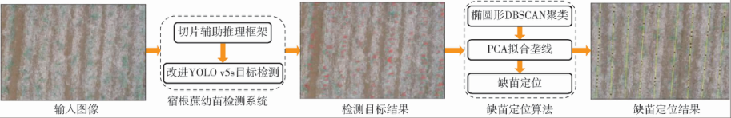

流程图自左向右依次为输入图像、宿根蔗幼苗检测系统（切片辅助推理框架加改进 YOLO v5s 目标检测）、检测目标结果、缺苗定位算法（椭圆形 DBSCAN 聚类、PCA 拟合差线、缺苗定位）和缺苗定位结果五个阶段，检测系统输出的幼苗中心坐标再经行列关系完成聚类、拟合与缺苗判定。

### 数据获取与数据集构建

数据获取与数据集构建把原始航拍大图转化为可训练的标注子图。本文使用 DJI Phantom 4 Pro V2 型无人机沿垄线垂直飞行采集图像，飞行高度 10 m、航向与旁向重叠率均为 80%，共采集 5 472 像素×3 648 像素的图像 1 090 幅；随后按宽度重叠率 33%、高度重叠率 21% 把随机抽取的 510 幅原始图切分为 2 048 像素×2 048 像素的子图共 4 080 幅，再经随机抽选与人工剔除留下 1 920 幅。标注时以叶片中间的聚集性蔗心为中心作标注框，RSS 为未遮挡幼苗、RSS_O 为被遮挡幼苗。训练集与验证集再做 2 倍数据增强（亮度变换、对比度变换、翻转变换、高斯噪声的顺序组合），增强效果如下图所示。

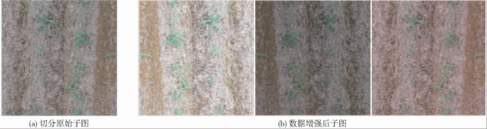

图中 (a) 为切分后的原始子图，(b) 为增强后的子图，可见多种扰动带来外观多样性。最终得到训练集 4 608 幅、验证集 576 幅、测试集 192 幅，另有 100 幅单独标注的原始大图构成 Large_RSS_Val，数据集的类别不平衡与小目标特点决定了下一节的改进方向。

### 图像加权策略

图像加权策略用于处理样本数量不平衡问题，让数量较少的类别获得较大的采样概率。本文先统计每个类别样本所占比例，类别频率与类别权重的计算公式如下：

$$F_c = \frac{N_c}{N}$$

$$W_c = \frac{1 / F_c}{\displaystyle\sum_{c=1}^{t} \frac{1}{F_c}}$$

随后，根据图像中包含的各个类别的数量以及对应的类别权重，图像的权重计算为：

$$M_i = \sum_{c=1}^{t} W_c n_c$$

该公式组涉及的符号及其含义如下表所示：

| 符号 | 含义 |
| --- | --- |
| $N_c$ | 第 $c$ 个类别数量 |
| $N$ | 所有类别数量 |
| $t$ | 类别数量 |
| $F_c$ | 第 $c$ 个类别频率 |
| $W_c$ | 第 $c$ 个类别权重 |
| $n_c$ | 图像上第 $c$ 个类别数量 |
| $M_i$ | 第 $i$ 幅图像权重 |

直观上，$W_c$ 对频率取倒数再归一化，使 RSS_O 类获得更大权重，$M_i$ 把权重聚合到图像粒度，包含被遮挡幼苗的图像在训练中更重要，为检测网络提供类别均衡的监督信号。

### 改进 YOLO v5s 检测网络

改进 YOLO v5s 检测网络在保留轻量骨干的同时增强对幼苗小目标的捕获与定位能力。本文保留 CSPDarknet 骨干与 FPN+PAN 颈部，新增 P2 小目标检测层，并把头部替换为带注意力机制的 DyHead，改进后的网络结构如下图所示。

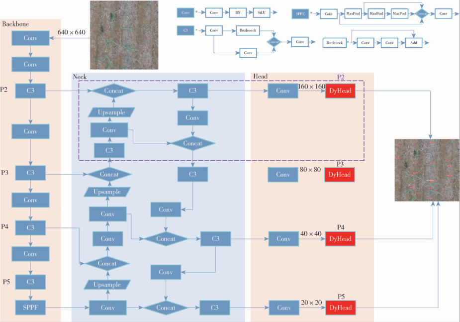

结构图中紫色虚线框为新增的 P2 小目标检测层，红色模块为新检测头 DyHead，输入 640×640 子图后得到 160×160 至 20×20 四个尺度的检测输入。网络前接数据集训练，后接 SAHI 逐块推理，两项结构改进见后两节。

### 新增 P2 小目标检测层

新增 P2 小目标检测层用于捕获并保留幼苗小目标的特征信息。由于小目标特征在网络传播中易被稀释，本文在第 2 次上采样之后新增一层检测层并命名为 P2，其结构如下图所示。

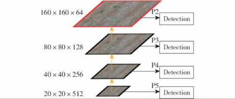

图中红色框表示新增的小目标检测层，黄色线表示上采样操作，P2 至 P5 的特征图尺寸依次为 160×160×64、80×80×128、40×40×256、20×20×512。P2 层位于第 2 次上采样之后，兼具高分辨率与丰富的语义信息，从颈部上采样分支接收特征并进入 DyHead 预测。

### DyHead 动态检测头

DyHead 模块旨在同时改善检测的定位和分类性能，使检测头更专注于宿根蔗幼苗的检测。本文把 YOLO v5 头部的所有检测头替换为包含注意力机制的 DyHead，注意力模块在尺度、空间、任务三个感知维度上执行并按顺序应用于检测头部，其结构如下图所示。

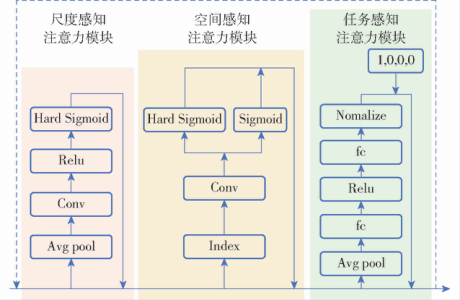

图中三个虚线框依次为尺度感知、空间感知和任务感知注意力模块，分别经池化卷积、索引卷积与全连接归一化子网络提取尺度、空间与任务权重。该模块可多次叠加以增强表示能力，本文默认堆叠 2 次，接收 P2 至 P5 各层特征并输出预测。

### 结合 SAHI 的大图检测

结合 SAHI 的大图检测环节在航拍大图上完成整图检测，切片辅助推理框架 SAHI 可与各类检测方法集成应用，其检测流程如下图所示。

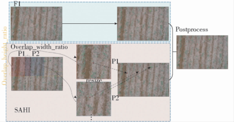

流程图中，大图先被切分成多个重叠的小图像块 Patch，每块保持纵横比调整尺寸后独立预测；SAHI 还提供可选的全推理 FI 路径，保留大图中的大目标检测功能。最后使用非极大值抑制 NMS 合并重叠区域的预测结果。该环节加载改进模型权重，输出大图上全部幼苗的中心坐标，供作物行聚类使用。

### 椭圆形 DBSCAN 作物行聚类

椭圆形 DBSCAN 聚类把检测得到的幼苗坐标分配到对应的作物行上。原始 DBSCAN 在圆形邻域内以相同的像素距离度量寻找核心点，而行内幼苗间距远小于行间距、缺失植株还会破坏同行坐标间的相似性，圆形邻域无法完成作物行聚类。为此，本文将圆形邻域修改为以 a 为长半轴、b 为短半轴的椭圆形区域，使聚类方向趋向作物行线方向，并设置核心点最小密度数 N_Minpts，算法步骤如下图所示（原文以文字描述和流程图给出该规则，未给出解析公式）。

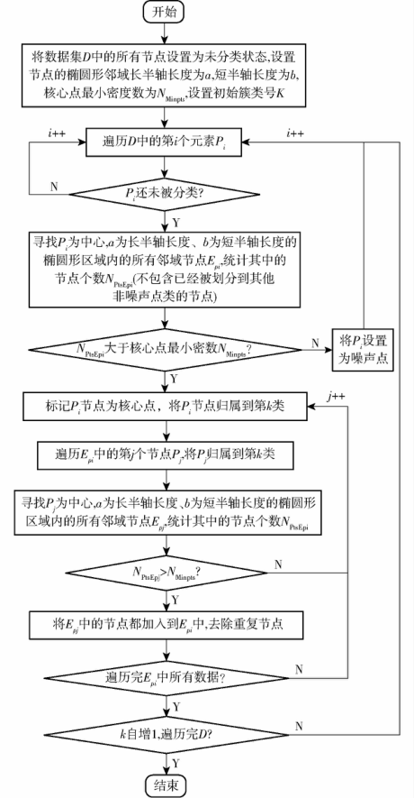

流程图中，算法先设置椭圆邻域参数 a、b 与 N_Minpts，再遍历每个元素 P_i，统计以其为中心的椭圆形区域内邻域节点个数，个数超过 N_Minpts 则标记 P_i 为核心点并归入第 k 类，随后循环扩展至簇类边缘。椭圆形邻域用横纵不相同的距离度量编码了作物按行排列、行斜率变化小的结构信息，在行间距不均匀和植株缺失时仍能正确聚类。

### PCA 拟合作物行中心线

PCA 拟合从每个作物行的幼苗坐标中求出作物行中心线方程。由于实际生长中存在较多偏离行线的幼苗，常规线性回归并不适用，本文利用 PCA 找到坐标变化最显著的方向作为中心线方向。先对任一作物行内的坐标集合 $R=\{c_1,c_2,\cdots,c_n\}$（$c_i=(x_i,y_i)$）计算均值并进行数据中心化，计算公式为：

$$\bar{x} = \frac{1}{n}\sum_{i=1}^{n}x_i,\quad \bar{y} = \frac{1}{n}\sum_{i=1}^{n}y_i$$

$$x'_i = x_i - \bar{x},\quad y'_i = y_i - \bar{y}$$

其中 $x'_i$、$y'_i$ 为中心化后的 $x$、$y$ 坐标。随后计算协方差矩阵并获得特征值和特征向量，特征值表示幼苗坐标在特定方向的方差值，对应的特征向量方向即中心线方向，计算公式为：

$$AV = \lambda V$$

$$A = \begin{bmatrix} cov(x,x) & cov(x,y) \\ cov(y,x) & cov(y,y) \end{bmatrix}$$

$$cov(x,y) = \frac{\displaystyle\sum_{i=1}^{n}(x_i - \bar{x})(y_i - \bar{y})}{n - 1} = \frac{\displaystyle\sum_{i=1}^{n}x'_i y'_i}{n - 1}$$

该公式组涉及的符号及其含义如下表所示：

| 符号 | 含义 |
| --- | --- |
| $A$ | 协方差矩阵 |
| $V$ | 特征向量 |
| $\lambda$ | 特征值 |
| $cov(x,y)$、$cov(y,x)$ | 协方差 |
| $cov(x,x)$、$cov(y,y)$ | 方差 |

通过选择最大特征值 $\lambda_1$ 所对应的特征向量 $V_1=[v_1,v_2]^{\mathrm{T}}$，作物行中心线斜率和截距的计算公式为：

$$\begin{cases} w = \dfrac{v_2}{v_1} \\ b = \bar{y}' - w\bar{x}' \end{cases}$$

其中 $w$ 为作物行中心线斜率，$b$ 为作物行中心线截距。于是作物行中心线方程为 $y = wx + b$，直观上这等价于沿坐标方差最大的方向做直线拟合，对偏离行线的离群幼苗坐标不敏感，所得方程将作为缺苗判定的投影基准线。

### 缺苗位置判定

缺苗位置判定沿作物行中心线找出缺苗位置坐标。本文先把作物行 R 中的宿根蔗坐标投影到中心线上，投影坐标的计算公式为：

$$\begin{cases} x_{pi} = \dfrac{x_i + w(y_i - b)}{1 + w^2} \\ y_{pi} = w x_{pi} + b \end{cases}$$

其中 $x_{pi}$、$y_{pi}$ 为投影点横纵坐标。将投影点按 $y$ 坐标排序后，相邻两个投影点距离 $d$ 与缺苗数量 $N_{no}$ 的计算公式为：

$$d = \sqrt{(x_{p_{i+1}} - x_{pi})^2 + (y_{p_{i+1}} - y_{pi})^2}$$

$$N_{no} = \left\lfloor \frac{d}{d_{sd}} \right\rfloor$$

其中 $d_{sd}$ 为标准苗间距。若距离超过补种像素阈值，则缺苗位置坐标 $(x_{si},y_{si})$ 的计算公式为：

$$\begin{cases} x_{si} = \dfrac{i(x_{p_{i+1}} - x_{pi})}{N_{no}} + x_{pi} \\ y_{si} = \dfrac{i(y_{p_{i+1}} - y_{pi})}{N_{no}} + y_{pi} \end{cases}$$

其中 $i$ 为缺苗位置序号，缺苗位置记为 $s=(x_{si},y_{si})$，行上补种坐标集合记为 $R_s=\{s_1,s_2,\cdots,s_n\}$。直观上，这等价于把相邻投影点按标准苗间距等分，多余空间判定为缺苗区，与甘蔗簇生间距 30~40 cm、相邻幼苗间距超过 60 cm 即缺苗的农艺经验一致。

## 实验结果

### 实验设置

本文在自建数据集上开展实验，训练集、验证集、测试集经 2 倍增强后分别为 4 608、576、192 幅，另有 Large_RSS_Val 验证集，边界框统计特性如下图所示。

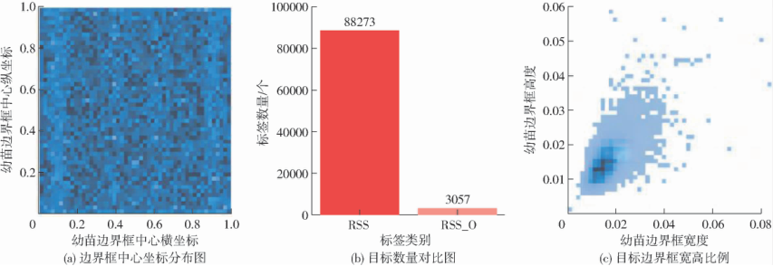

图 (a) 中边界框中心坐标覆盖整个图像区域，(b) 中 RSS 类标签 88 273 个、RSS_O 类仅 3 057 个，数量严重不平衡，(c) 中边界框宽高比例多小于 0.03，属小目标。检测模型基于 YOLO v5-6.2 源码训练，采用 SGD 优化器，初始学习率 0.01、最终学习率 $10^{-5}$、权重衰减 0.005，前 3 个热身阶段动量 0.8 后改为 0.937，共训练 300 个周期，批大小为 16；评价指标为精确率、召回率、平均精度均值 1（mAP@0.5）与平均精度均值 2（mAP@0.5:0.95）。

### 对比实验

本文将所提方法与 DETR、CenterNet、TPH-YOLO v5s、YOLO v8s 对比，结果如下表所示。

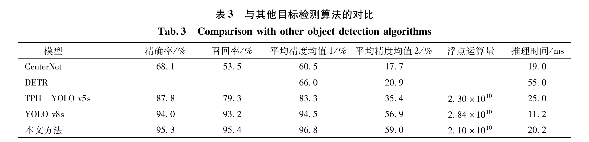

表中本文方法的精确率、召回率、平均精度均值 1 与 2 分别为 95.3%、95.4%、96.8% 和 59.0%，均高于其余四种模型，浮点运算量小于 YOLO v8s、推理时间仅 20.2 ms，可见本文方法检测精度最高且模型复杂度最小，可为缺苗定位提供精准的位置坐标信息。

### 消融实验

为验证各项改进策略的贡献，本文以 YOLO v5s 为基准逐项引入图像加权策略 iw、P2 特征层与 DyHead，所有模型均未使用预训练权重，消融结果如下表所示。

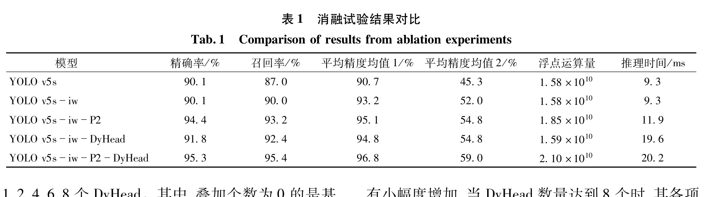

表中单独使用图像加权策略后召回率提高 3 个百分点、平均精度均值 1 与 2 分别提升 2.5 和 6.7 个百分点，说明更多被遮挡幼苗被成功检测；新增 P2 层使两个平均精度均值分别提升 4.4 和 9.5 个百分点，计算量仅增加 17%、推理时间仅增加 2.6 ms；两项改进结合后平均精度均值 1 与 2 达到 96.8% 和 59.0%，比原始模型提升 6.1 和 13.7 个百分点。

由于 DyHead 堆叠数量同时影响性能与计算成本，本文以 YOLO v5s-iw-P2 为基线分别叠加 1、2、4、6、8 个试验，结果如下表所示。

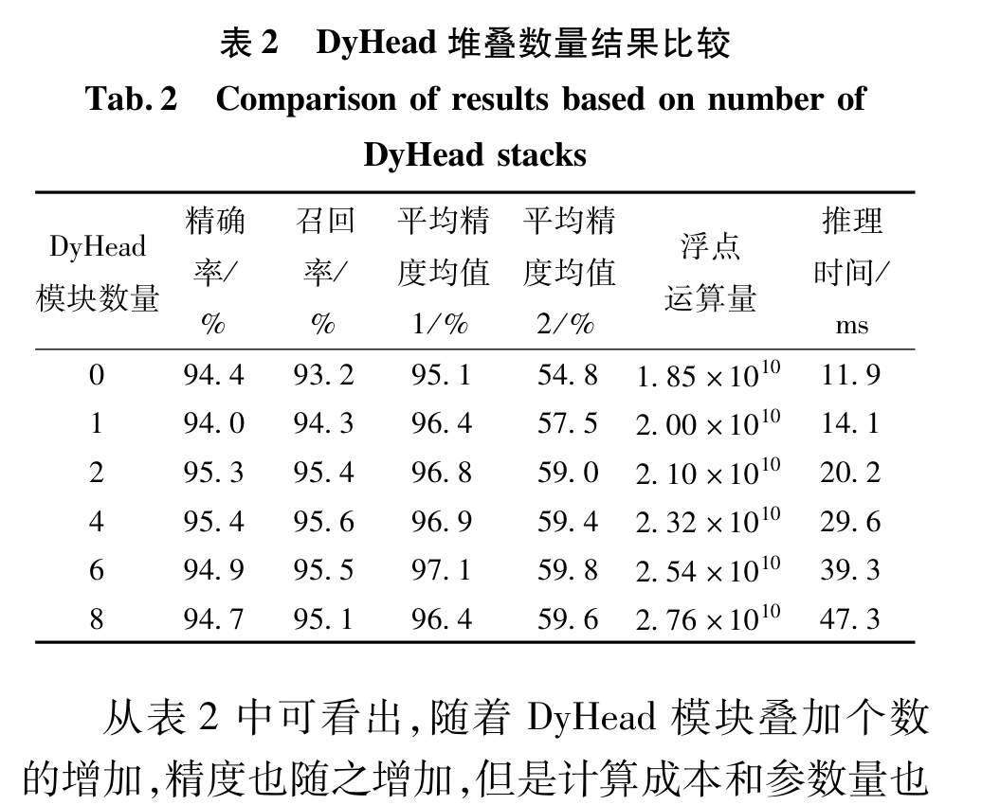

表中精度随堆叠个数增加而提高，但计算成本同步上涨，堆叠 8 个时指标开始下降，表明过深的堆叠会让模型学到冗余特征，因此本文选择 2 个 DyHead 堆叠。

### 可视化分析

本文对比了各改进组合在稀疏无遮挡与密集遮挡场景下的检测效果，实例如下图所示。

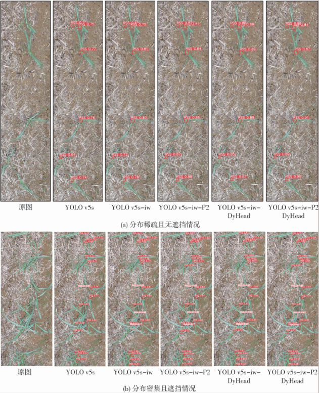

图 (a) 为稀疏无遮挡情况，五个模型均表现良好，完整模型置信度最高；图 (b) 为密集遮挡情况，黄色圆圈标出漏检位置，原始 YOLO v5s 漏检 5 株，引入图像加权后遮挡幼苗基本被识别，加入 P2 层后全部检出，完整模型置信度约 0.9，可见精度提升主要来自遮挡幼苗召回能力的改善。

由于杂草在蔗田环境较为常见，本文还测试了杂草丛生场景下的检测效果，实例如下图所示。

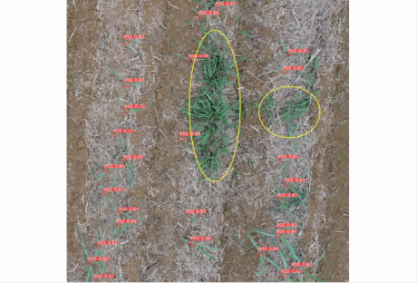

图中黄色圈内为杂草，周围幼苗均被检出，表明本文方法可以有效抑制杂草对幼苗检测的影响。大图检测中绿色框为正确检测、红色框为漏检、蓝色框为误检，结果如下图所示。

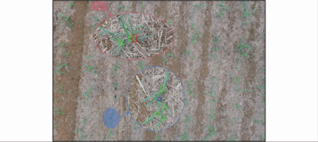

从大图结果可以看出，漏检和误检主要出现在幼苗严重遮挡或特征模糊的情况下；对 Large_RSS_Val 中 100 幅大图共 18 521 株幼苗的统计显示，正确检测 17 002 株，识别精确率 94.5%、召回率 91.8%，平均每幅检测时间 0.32 s，表明检测系统在大图上同样可靠。

### 缺苗定位结果分析

在作物行聚类环节，本文对比了原始 DBSCAN、K-means、BSAS 与椭圆形 DBSCAN 的聚类效果，超参数按原文设置（原始 DBSCAN 邻域距离 170 像素，K-means 质心数 9，BSAS 最大簇数 9、距离阈值 170 像素，本文算法长半轴 2 100 像素、短半轴 170 像素、最小样本数 2），对比如下图所示。

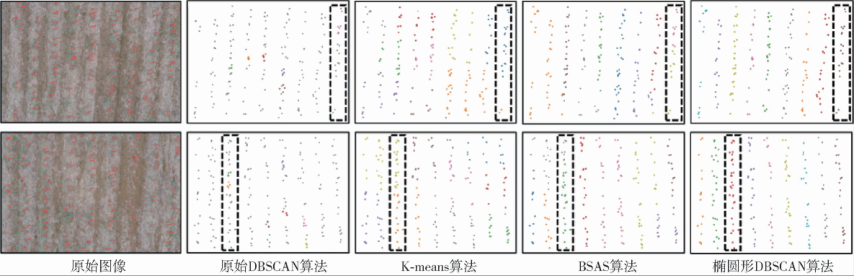

图中虚线框内的点位于同一作物行上，正确的聚类结果应呈现同一种颜色，原始 DBSCAN、K-means、BSAS 皆在同一行内出现多种颜色，而椭圆形 DBSCAN 各行颜色一致、行聚类准确率达到 100%，表明横纵异尺度的距离度量与作物行分布规律相匹配。参数试验显示，长半轴增至 2 100 像素时聚类准确率达 100%，短半轴在 240 像素以内可保持 100%。

在中心线拟合环节，本文与最小二乘法 LSM、随机采样一致性回归 RANSAC 对比，拟合效果如下图所示。

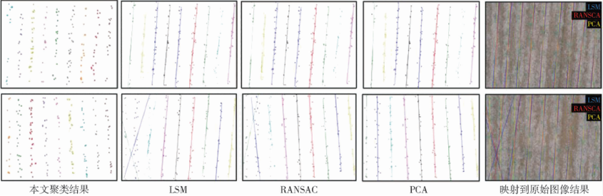

图中自左向右依次为本文聚类结果、LSM、RANSAC、PCA 拟合的行线及映射回原始图像的结果，LSM 拟合的行线出现明显偏离、RANSAC 稳定性较差，而 PCA 拟合的行线与真实作物行位置基本一致；在 Large_RSS_Val 上 PCA 拟合角度与实际垄线角度的拟合方程为 $y=0.983\,91x+1.398\,6$，决定系数 $R^2$ 为 0.974 64，角度平均绝对偏差为 0.245 5°，证明了拟合角度与实际高度一致。

本文以 222 像素（约 60 cm）为缺苗阈值、111 像素（约 30 cm）为标准苗间距统计定位准确性，误差分布如下图所示。

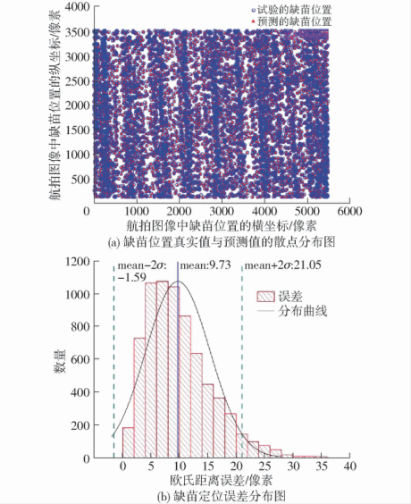

图 (a) 中蓝色圆圈为真实缺苗位置、红色三角形为预测缺苗位置，大部分圆圈中包含三角形，可见真实值与预测值吻合度较高；图 (b) 中缺苗定位平均误差为 9.73 像素，均值加减 2 个标准差覆盖约 95.6% 的数据。共判定缺苗位置 7 709 个，其中正确 7 085 个，精确率和召回率分别为 91.9% 和 97.1%，验证了定位的准确性。将方法应用于 PixDmapper 拼接的 14 205 像素×20 067 像素整图（面积约 2 066.7 m²）时，共检出蔗苗 3 008 株、拟合作物行线 26 条、确定缺苗位置 1 383 个，验证了方法在大图上的可行性。
## 优点和创新点

个人认为，本文有如下一些优点和创新点可供参考学习：

1. 从样本不平衡与小目标两个数据特性出发组织改进，图像加权、P2 特征层与 DyHead 各有消融数据支撑，实验数据丰富有力，说服力强；

2. 把「作物按行排列、行斜率变化小」的结构先验编码进 DBSCAN 的距离度量，将圆形邻域改造为椭圆形邻域，行聚类准确率达到 100%，设计巧妙；

3. 构建了从幼苗检测、聚类、拟合到缺苗定位的完整流程，并用拼接整图实例验证，平均定位误差仅 9.73 像素，具备服务于补种作业的工程可用性。
