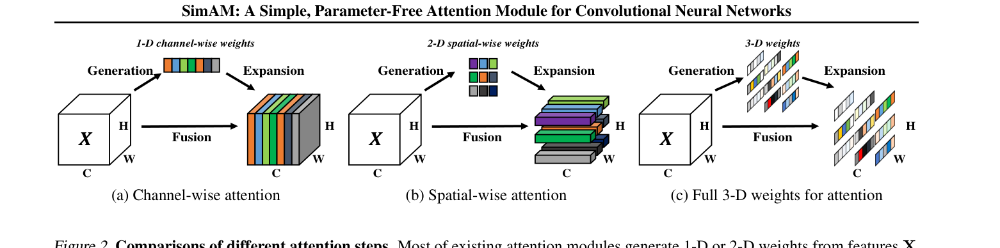
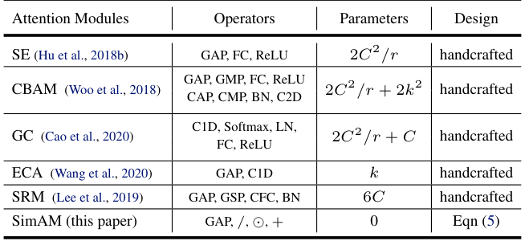
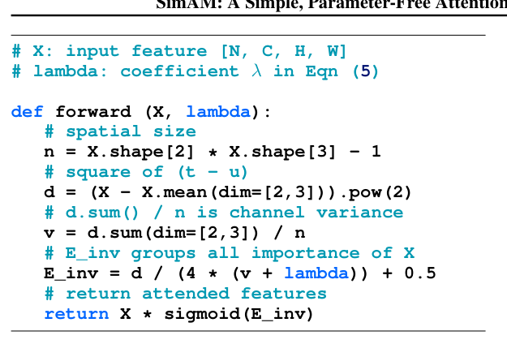
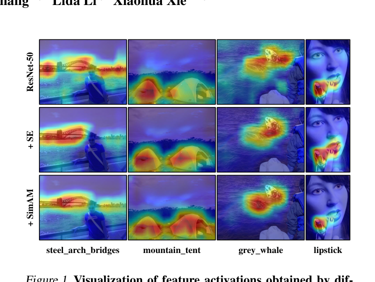
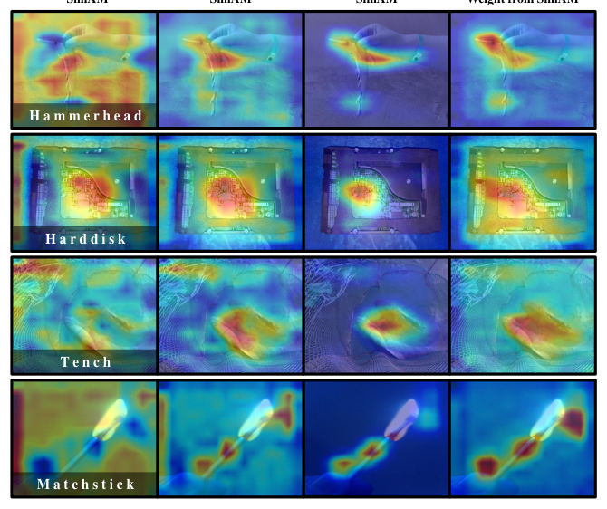
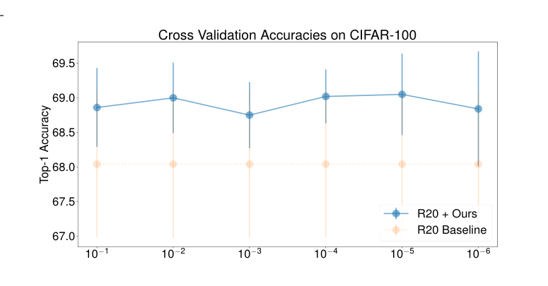
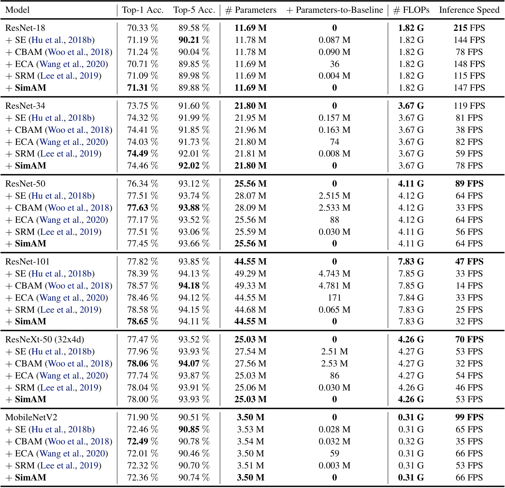

# SimAM: A Simple, Parameter-Free Attention Module for Convolutional Neural Networks

Paper Reading 是从个人角度进行的一些总结分享，受到个人关注点的侧重和实力所限，可能有理解不到位的地方。具体的细节还需要以原文的内容为准，博客中的图表若未另外说明则均来自原文。

| 论文概况 | 详细 |
| --- | --- |
| 标题 | 《SimAM: A Simple, Parameter-Free Attention Module for Convolutional Neural Networks》 |
| 作者 | Lingxiao Yang、Ru-Yuan Zhang、Lida Li、Xiaohua Xie |
| 发表会议 | ICML |
| 会议等级 | CCF-A |
| 发表年份 | 2021 |
| 论文代码 | [https://github.com/ZjjConan/SimAM](https://github.com/ZjjConan/SimAM) |

作者单位：

1. School of Computer Science and Engineering, Sun Yat-sen University
2. Guangdong Province Key Laboratory of Information Security Technology, Sun Yat-sen University
3. Key Laboratory of Machine Intelligence and Advanced Computing, Ministry of Education, Sun Yat-sen University
4. Institute of Psychology and Behavioral Science, Shanghai Jiao Tong University
5. Shanghai Key Laboratory of Psychotic Disorders, Shanghai Mental Health Center, Shanghai Jiao Tong University
6. The Hong Kong Polytechnic University

## 研究动机

即插即用的注意力模块是增强 ConvNet 表示能力的低成本路线，表现为 SE、CBAM 等模块被插入残差块内部精炼卷积输出，导致它们被广泛部署于 VGG、ResNet、ResNeXt 等网络、甚至被纳入 AutoML 的搜索空间。然而现有注意力模块存在两个问题。

1. 只能沿通道或空间单一维度精炼特征：SE 生成 1D 通道权重、CBAM 生成 2D 空间权重，把同一通道内或同一空间位置上的所有神经元同等对待，限制了学习同时在通道与空间上变化的注意力权重的灵活性。
2. 模块结构由池化类型、全连接层、卷积等一系列手工因素堆叠而成，设计缺乏统一原则指导，需要大量工程精力做结构调参。

另一侧基于编码器-解码器子网络的 3D 权重方法则逐层引入额外子网络，难以模块化地推广到其它网络。问题至此收窄为：暂未有工作能以无参数、轻量化的方式直接生成真 3D 注意力权重。

## 文章贡献

针对现有注意力模块只能生成 1D 或 2D 权重、结构设计依赖手工堆叠的问题，本文提出了无参数注意力模块 SimAM。其核心是借鉴哺乳动物大脑的空间抑制理论，把神经元重要性形式化为一个能量函数并推导闭式解。首先以能量函数度量目标神经元与同通道其它神经元之间的线性可分性；接着对变换权重与偏置推导闭式解，并在通道内同分布假设下得到最小能量的解析式；最终以最小能量的倒数作为神经元重要性，经 sigmoid 约束后以缩放方式逐元素精炼特征。实验表明 SimAM 在 CIFAR 与 ImageNet 分类、COCO 目标检测与实例分割上不引入任何参数即稳定提升精度，速度与参数量优于 SE、CBAM 等流行模块。

## 本文方法

### 现有注意力模块概览

本节的目标是从权重维度与权重生成方式两个维度为 SimAM 定位。现有模块的精炼步骤要么沿通道维（生成 1D 权重）、要么沿空间维（生成 2D 权重），而本文直接估计 3D 权重，三种注意力步骤的对比如下图所示。

(a) 的通道注意力从特征 $X$ 生成 1D 权重再沿空间扩展，(b) 的空间注意力生成 2D 权重再沿通道扩展，二者都把同一通道或同一空间位置上的神经元同等对待；(c) 的 SimAM 则为特征图上每个点估计一个独立标量，即真 3D 权重。各模块所用的算子与参数量对比如下表所示。

SE、CBAM、GC、ECA、SRM 的参数量分别为 2C²/r、2C²/r + 2k²、2C²/r + C、k、6C，且设计方式均为 handcrafted；SimAM 只用到 GAP、除、逐元素乘、加四类算子，参数量为 0，设计直接来自后文的最小能量公式。这张对照表把本文的改造方向固定为「用统一原则替代手工堆叠」，引出下文的能量函数推导。

### 空间抑制与线性可分性

本节的目标是把神经科学结论转化为可计算的目标函数。在视觉神经科学中，信息量最大的神经元通常是放电模式与周围神经元显著不同的那些，且活跃神经元会抑制周围神经元的活动，即空间抑制；显示清晰空间抑制效应的神经元应在视觉处理中被赋予更高优先级，其最简单的实现是度量一个目标神经元与其它神经元之间的线性可分性。据此本文为每个神经元定义如下能量函数：

$$e_t(w_t, b_t, y, x_i) = (y_t - \hat{t})^2 + \frac{1}{M-1} \sum_{i=1}^{M-1} (y_o - \hat{x}_i)^2$$

| 符号 | 含义 |
| --- | --- |
| $t, x_i$ | 输入特征 $X \in \mathbb{R}^{C \times H \times W}$ 单个通道内的目标神经元与其它神经元 |
| $\hat{t} = w_t t + b_t,\ \hat{x}_i = w_t x_i + b_t$ | 对 $t$ 与 $x_i$ 的线性变换 |
| $M = H \times W$ | 该通道上的神经元数量 |
| $y_t, y_o$ | 两个不同的目标取值 |

式中最小值在 $\hat{t}$ 等于 $y_t$、其余 $\hat{x}_i$ 等于 $y_o$ 时取得。直观上，最小化该能量等价于寻找目标神经元 $t$ 与同通道所有其它神经元之间的线性可分性，能量越低说明该神经元越「与众不同」。

### 二值标签与正则化能量函数

本节的目标是给出能量函数的最终可用形式。为简化，本文对 $y_t$ 与 $y_o$ 采用二值标签（1 与 -1），并在原式中加入正则项，最终的能量函数为：

$$e_t(w_t, b_t, y, x_i) = \frac{1}{M-1} \sum_{i=1}^{M-1} (-1 - (w_t x_i + b_t))^2 + (1 - (w_t t + b_t))^2 + \lambda w_t^2$$

其中 $\lambda$ 是正则项系数，$M - 1$ 是同通道内除目标神经元外的其它神经元数量。至此权重生成完全由这一个能量函数决定，不再需要手工挑选池化或堆叠卷积；但理论上每个通道有 $M$ 个能量函数，用 SGD 一类迭代求解器逐一求解计算负担过重，这引出下一节的闭式解。

### 闭式解与最小能量

本节的目标是避开迭代求解，直接给出能量函数关于 $w_t$ 与 $b_t$ 的解析解：

$$w_t = -\frac{2(t - \mu_t)}{(t - \mu_t)^2 + 2\sigma_t^2 + 2\lambda}$$

偏置 $b_t$ 的闭式解相应为：

$$b_t = -\frac{1}{2}(t + \mu_t) w_t$$

其中 $\mu_t = \frac{1}{M-1} \sum_{i=1}^{M-1} x_i$ 与 $\sigma_t^2 = \frac{1}{M-1} \sum_{i=1}^{M-1} (x_i - \mu_t)^2$ 是该通道内除 $t$ 以外所有神经元的均值与方差。由于解是在单通道上得到的，假设同一通道内所有像素服从同一分布是合理的，因此均值与方差可以在全部神经元上计算并对该通道所有神经元复用，避免逐位置迭代计算，最小能量随之可由下式计算：

$$e_t^* = \frac{4(\hat{\sigma}^2 + \lambda)}{(t - \hat{\mu})^2 + 2\hat{\sigma}^2 + 2\lambda}$$

其中 $\hat{\mu} = \frac{1}{M} \sum_{i=1}^{M} x_i$ 与 $\hat{\sigma}^2 = \frac{1}{M} \sum_{i=1}^{M} (x_i - \hat{\mu})^2$ 是通道内全部神经元的均值与方差。该式表明能量 $e_t^*$ 越低，神经元 $t$ 与周围神经元的差异越大、对视觉处理越重要，因此每个神经元的重要性可由 $1/e_t^*$ 获得；整个推导只涉及均值、方差与逐元素运算，这正是模块无需任何可学习参数的原因。

### 以缩放方式精炼特征

本节的目标是按神经增益的方式把注意力权重作用到特征上。依据 Hillyard 等人的结论，哺乳动物大脑中的注意力调制通常表现为对神经元响应的增益（缩放）效应，本文因此选用缩放算子而非加法做特征精炼，整个精炼阶段为：

$$\tilde{X} = \mathrm{sigmoid}(1/E) \odot X$$

其中 $E$ 把全部 $e_t^*$ 沿通道维与空间维归组，$\odot$ 为逐元素相乘，sigmoid 用于约束 $E$ 中过大的取值，且因其是单调函数而不改变各神经元的相对重要性。这等价于用一张与特征图同形状的重要性图对特征做逐点门控，完成真 3D 注意力；除通道均值与方差的计算外，模块内其余运算全部是逐元素操作。

### 模块实现与插入位置

本节的目标是把上述推导以极少的代码行落地并嵌入现有网络。借助 PyTorch 一类机器学习库，式 (6) 的实现不足十行，如下图所示。

概括起来就是：

1. 计算每个神经元与通道均值之差的平方 d，并以 d.sum()/n 得到通道方差 v；
2. 按最小能量公式组装重要性 E_inv = d / (4 * (v + λ)) + 0.5；
3. 返回 X * sigmoid(E_inv) 作为精炼后的特征。

实现被加在每个块内第二个卷积层之后。至此模块从理论到实现闭环，进入实验验证环节。

## 实验结果

### 实验设置

分类实验在 CIFAR-10/100 与 ImageNet-1K 上进行：CIFAR 用 SGD（momentum 0.9、batch size 128、weight decay 0.0005），学习率 0.1 并在第 32,000 与 48,000 次迭代除 10，λ 用 ResNet-20 在 45k/5k 划分上搜得 1e-4；ImageNet 上 ResNet 系用 batch size 256 在 4 张 Quadro RTX 8000 上训练 100 个 epoch，学习率 0.1 在第 30、60、90 个 epoch 除 10，MobileNetV2 用余弦调度、初始学习率 0.5、weight decay 4e-5、训练 150 个 epoch，λ 以 ResNet-18 在半分辨率图像上训练 50 个 epoch 搜得 0.1。检测与实例分割基于 Faster R-CNN 与 Mask R-CNN 加 FPN，用 mmdetection 在 4 张 GPU 上以 batch size 8、初始学习率 0.01 微调，骨干先在 ImageNet-1K 预训练再迁移到 COCO。所有对比方法均用 PyTorch 在一致设置下重新实现。

### 可视化分析

先看定性效果图组。下图用 Grad-CAM 展示了一致设置下训练的 ResNet-50、+SE、+SimAM 三个网络在 ImageNet 验证集上的特征激活。

SimAM 帮助网络聚焦于与图像标签接近的主要区域：mountain_tent 一列中帐篷主体被完整高亮，grey_whale 一列中 SE 丢失了鲸鱼的部分主体组件，而 SimAM 仍覆盖完整。再看注意力权重本身与特征响应的对应关系，如下图所示。

每组图从左到右依次是 SimAM 前后的 Grad-CAM、SimAM 注意力权重（沿通道维平均）、以及注意力权重上的 Grad-CAM；精炼后的高响应区域与注意力掩膜高度一致，说明 3D 权重确实按预期选中了主要对象区域，为下文定量结果提供了定性佐证。

### CIFAR 分类与 λ 分析

CIFAR-10/100 上八种网络配置加入五种注意力模块的 Top-1 精度如下表所示，结果为 5 次重复的均值±标准差。

SimAM 在全部基线网络上都稳定提升精度：ResNet-20 上 C10 从 92.33 升到 92.73、C100 从 68.88 升到 69.57，在小网络上取得所有模块中的最好结果；MobileNetV2 上达到 92.36 与 72.08，超过 SE 与 CBAM；约 36M 参数的 WideResNet-20x10 上 C100 也从 81.31 升到 81.51，说明无参数模块的有效性不限于特定网络。λ 在 1e-1 到 1e-6 池内、以 5 折重复实验在训练集划分上搜索的结果如下图所示。

λ 在 1e-1 到 1e-6 的宽范围内都能显著提升性能，其中 λ = 1e-4 在 Top-1 精度与标准差之间取得较好平衡，因此 CIFAR 上所有网络统一取该值，表明模块对 λ 的取值稳健。

### ImageNet 分类对比

ImageNet-1K 上各网络的 Top-1/Top-5 精度、参数量、FLOPs 与推理速度如下表所示，速度在 GTX 1080 Ti 上以单图像素前向 500 张取平均 FPS。

SimAM 在 ResNet-18 上以 71.31% 取得全部模块中的最好 Top-1，在 ResNet-101 上以 78.65% 领先，在 ResNet-34、ResNet-50、ResNeXt-50 与 MobileNetV2 上也与 SE、CBAM 等互有胜负；与此同时 SimAM 的附加参数量恒为 0，而 SE 在 ResNet-50 上要加 2.515M 参数，推理 FPS 与 SE、ECA 同档（ResNet-50 上 64 对 64，CBAM 仅 33）。ResNet-50 的训练与验证曲线如下图所示。

加入 SimAM 后训练与验证的 Top-1、Top-5 精度全程高于基线，说明增益来自表示能力的改善而非过拟合训练集。

### 目标检测与实例分割

COCO 上以 Faster R-CNN 与 Mask R-CNN 为检测器的迁移结果如下表所示，AP 分别对应框 IoU 与掩膜 IoU。

Faster R-CNN 下 ResNet-50 的 AP 从 37.8 升到 39.2（SE 为 39.4 但需加 2.5M 参数），ResNet-101 从 39.6 升到 41.2、超过 SE 的 41.1；Mask R-CNN 的实例分割上 ResNet-101 从 36.3 升到 37.6、高于 SE 的 37.2。两种注意力模块在检测上性能接近，而 SimAM 全程不引入任何附加参数，可见无参数设计在密集预测的迁移任务上同样保持了轻量与有效的平衡。

## 优点和创新点

个人认为，本文有如下一些优点和创新点可供参考学习：

1. 从神经科学的空间抑制理论出发，把神经元重要性形式化为能量函数的线性可分性，使注意力模块的设计有可解释的统一原则、避免手工结构堆叠，思路新颖、耳目一新。
2. 为能量函数推导闭式解，以零附加参数推断真 3D 注意力权重，实现不到十行代码、推理速度与 SE 和 ECA 同档，计算效率可供参考。
3. 在 CIFAR 与 ImageNet 分类、COCO 检测与实例分割上跨多种网络系统验证，配合 Grad-CAM 可视化与 λ 敏感性分析，小网络上增益尤为突出，实验丰富、说服力强。
