# 基于 TPH-YOLO 的无人机图像麦穗计数方法

Paper Reading 是从个人角度进行的一些总结分享，受到个人关注点的侧重和实力所限，可能有理解不到位的地方。具体的细节还需要以原文的内容为准，博客中的图表若未另外说明则均来自原文。

| 论文概况 | 详细 |
| --- | --- |
| 标题 | 《基于 TPH-YOLO 的无人机图像麦穗计数方法》 |
| 作者 | 鲍文霞、谢文杰、胡根生、杨先军、苏彪彪 |
| 发表期刊 | 农业工程学报 |
| 期刊等级 | 未获取 |
| 发表年份 | 2023 |
| 论文代码 | 未获取 |

作者单位：

1. 安徽大学 农业生态大数据分析与应用技术国家地方联合工程研究中心，合肥 230601
2. 中国科学院合肥物质科学研究院，合肥 230031

## 研究动机

麦穗计数是小麦产量预测与田间管理的重要问题，表现为单位面积麦穗数直接决定估产精度，导致计数环节必须尽可能准确且低成本。传统人工计数繁琐、耗费人力物力且容易出错；以最大熵分割、形态学重建、改进 K-means 聚类为代表的传统机器学习方法虽然简单有效，但对纹理、颜色等人工特征依赖较强，受土壤、光照与麦叶影响较大，计数效果并不理想。基于密度图估计与目标检测的深度学习方法把田间麦穗计数精度推到了新高度，然而这些方法大多面向田间近景图像设计；无人机图像具有麦穗分布稠密、重叠现象严重、尺寸小、背景信息复杂等特点，直接套用容易出现错检与漏检，使检测精度下降、无法准确计数。暂少有工作针对无人机小麦图像的稠密重叠特点，从注意力机制、预测头结构与训练策略三个层面同时改造检测网络。

## 文章贡献

针对无人机图像麦穗稠密、重叠严重、背景复杂导致的错检漏检问题，本文提出一种基于 TPH-YOLO 的麦穗检测与计数方法。其核心是以 YOLOv5 为基线，在骨干网络 CSPDarkNet-53 的 CSP 模块与卷积模块之间加入坐标注意力机制 CA 细化特征、抑制麦秆麦叶等背景干扰，并用具有多头自注意力机制的 Transformer 编码器替换 Neck 中的部分 CSP 模块、把原始预测头转换为 Transformer 预测头 TPH，以在高密度场景中准确定位麦穗。首先采用 Retinex 算法对无人机图像做增强处理，削弱光照不均匀的影响；接着按上述方式改造骨干、颈部与预测头得到 TPH-YOLO；最终采用迁移学习策略，先在田间采集的小麦图像数据集上预训练骨干，再冻结骨干、用无人机数据集更新 Neck 与 Head 参数。实验表明，本文方法在无人机测试集上的精确率、召回率与平均精确率分别为 87.2%、84.1% 与 88.8%，较基础 YOLOv5 提高 4.1 个百分点，在公开数据集 GWHD 上的平均精确率达 91.6%，测试集麦穗计数错误率仅 0.022。

## 本文方法

### 数据采集与数据集构建

数据采集环节为整个方法提供无人机与田间两类图像来源，样例如下图所示。

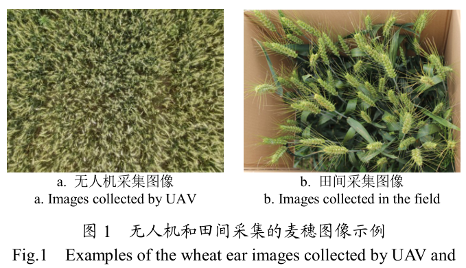

无人机一侧在安徽省巢湖市坝镇的研究区域使用大疆 Mavic Air 2 无人机采集，其搭载 4800 万像素可见光摄像机，飞行高度 3 m、摄像机与地面垂直 90°，共获取 3 幅 8000 像素×6000 像素的小麦图像（图 1a）；田间一侧用佳能 EOS80D 数码相机配合 40 cm×50 cm 纸盒、以多种倾斜角度拍摄，选取 342 幅图像构建田间麦穗图像数据集（图 1b），用于后续迁移学习的预训练。无人机原始图像按 800 像素×600 像素裁剪为 300 幅子图像，并按 7∶2∶1 划分为训练集、验证集与测试集。裁剪后的子图像先送入 Retinex 增强环节。

### Retinex 图像增强

Retinex 增强用于削弱大田光照强度变化造成的图像质量下降，使图像颜色更接近物体本身。Retinex 算法认为物体对光线的反射能力决定物体的颜色，人眼获得的图像由入射图像与反射图像组成：

$$S(x, y) = R(x, y) \times L(x, y)$$

| 符号 | 含义 |
| --- | --- |
| $S(x, y)$ | 人眼捕获的视觉图像 |
| $R(x, y)$ | 物体的反射图像 |
| $L(x, y)$ | 入射图像 |
| $(x, y)$ | 图像中像素点的坐标 |

这等价于把观测图像分解为光照与反射两个因子的乘积，增强只针对光照项下手。由于入射光线强度在被照表面变化相对较慢，$L(x, y)$ 可用图像低频分量表示，即以像素点与周围区域的加权平均 $F(x, y)$ 估计照度并去除，对式子取对数后得到：

$$\ln R(x, y) = \ln S(x, y) - \ln[F(x, y) \cdot S(x, y)]$$

其中 $F(x, y)$ 为中心环绕函数。直观上，把乘性的光照分量在对数域中减掉，剩下的就是与光照无关的物体反射属性；将 $\ln R(x, y)$ 变换回实数域即得到增强图像。增强前后的效果如下图所示，增强后麦穗与背景的对比更清晰，作为检测网络的输入。

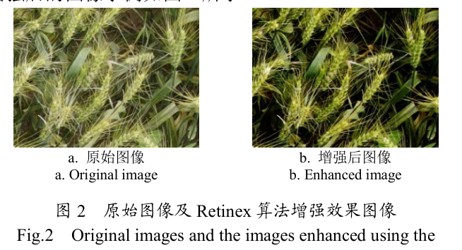

### TPH-YOLO 总体结构

TPH-YOLO 沿用 YOLOv5 的输入端、骨干、颈部与预测头四段式结构，并在三处做改造，模型结构如下图所示。

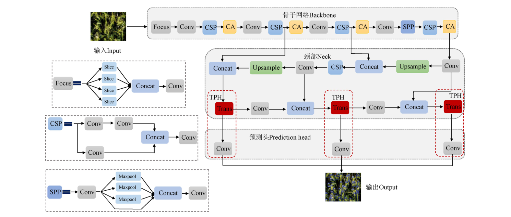

输入图像先经 Focus 切片操作做特殊下采样，再进入不同深度的 CSP 模块提取特征；骨干中在 CSP 模块与卷积模块之间插入 CA 模块细化特征；颈部用 Transformer 编码器（图中 Trans）替换部分 CSP 模块；三个尺度的预测头被替换为 Transformer 预测头 TPH。各组件的分工如下表所示。

| 组件 | 模块 | 功能 |
| --- | --- | --- |
| Backbone | CSPDarkNet-53 + CA | 多尺度特征提取，细化特征并抑制背景干扰 |
| Neck | PANet 结构 + Transformer 编码器 | 跨尺度特征融合，捕获全局与上下文信息 |
| Head | Transformer 预测头 TPH | 高密度场景下准确定位麦穗 |
| 训练策略 | 迁移学习 | 田间数据预训练骨干，无人机数据微调后端 |

骨干输出的多尺度特征送入颈部融合，融合结果经 TPH 输出检测框，检测框数量即每幅图像的麦穗计数值。

### 骨干网络与坐标注意力 CA

坐标注意力 CA 用于让骨干网络更加关注麦穗信息、抑制麦秆麦叶等背景因素的干扰，其在骨干中的插入位置如下图所示。

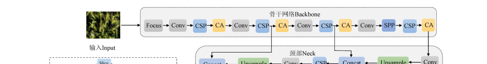

CA 被加在 CSPDarkNet-53 中 CSP 模块与卷积模块之间，是一种简单灵活的坐标注意力机制：它在通道注意力中嵌入位置信息，使模型在细化特征的同时提高特征提取能力。骨干接收 Focus 切片后的特征，经多级 CSP 与 CA 交替处理，把高分辨率特征图逐层抽象为含麦穗语义的多尺度特征。骨干的输出分别送入颈部的上采样路径与 TPH 分支。

### Transformer 编码器与 TPH 预测头

Transformer 编码器与 TPH 预测头用于捕获全局信息和丰富的上下文信息，实现高密度场景下麦穗的准确定位，其在颈部与预测头中的位置如下图所示。

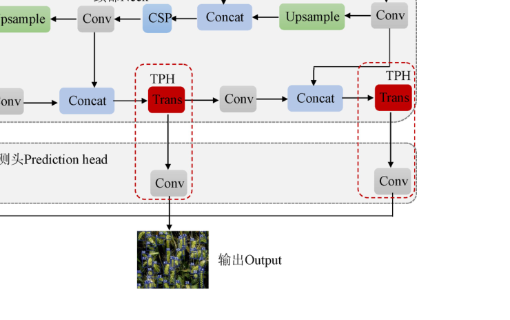

与卷积神经网络相比，基于 Transformer 的视觉模型具有多头自注意力的建模潜力；本文用 Transformer 编码器模块替换 Neck 中的一些 CSP 模块，并将原始预测头转换成 Transformer 预测头 TPH，使预测阶段具备多头注意力机制的预测潜力。图中每个尺度的 Concat 融合特征先经 Trans 模块建模，再经卷积送入预测头输出。这一改造直接作用于稠密重叠麦穗的定位环节，与骨干的 CA 形成「特征细化—全局定位」的互补。

### 迁移学习训练策略

迁移学习策略用于在无人机样本有限的情况下提高模型泛化能力与检测精度，流程如下图所示。

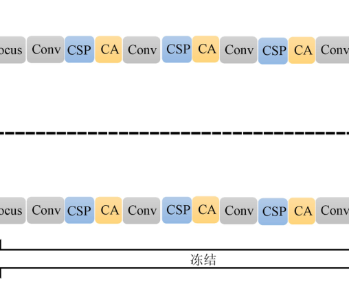

训练分两步：第一步在田间采集的小麦图像数据集上训练 TPH-YOLO 的骨干网络 CSPDarkNet-53，得到预训练模型；第二步把预训练模型加载到 TPH-YOLO 中并冻结骨干参数，只在无人机数据集上重新训练和更新 Neck 与 Head。田间图像与无人机图像的颜色、轮廓、纹理等基础结构相近，而靠近输入端的骨干保留了大量底层信息，因此骨干特征可以通用；田间图像分辨率更高，预训练得到的参数效果更好。冻结骨干还能减少参与训练的网络层数、降低过拟合风险并加快训练效率。训练完成的模型即可用于测试集的麦穗检测与计数。

## 实验结果

### 实验设置

实验基于 Ubuntu 16.04 LTS 64 位操作系统、NVIDIA GTX 2080Ti 显卡与 32 G 内存完成，使用 Python 与 PyTorch 框架；初始学习率 0.01，SGD 优化，迭代次数 300，批处理尺寸 8，权重衰减 0.0005。评价指标为精确率 P、召回率 R 与平均精确率 AP。无人机数据集的 300 幅子图像按 7∶2∶1 划分，测试集为 30 幅图像；田间 342 幅图像仅用于预训练。

### 数据增强实验

为验证 Retinex 增强的必要性，分别用增强与未增强图像训练 TPH-YOLO，结果如下表所示。

未增强数据集上模型的精确率、召回率与 AP 为 84.6%、83.7% 与 87.1%，增强后提升至 87.2%、84.1% 与 88.8%，可见光照不均匀确实是无人机麦穗图像检测的主要干扰源之一，增强环节带来了稳定的增益。

### 消融实验

CA、TPH 与迁移学习三个组件的消融结果如下表所示。

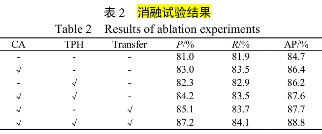

三者均不使用时 AP 为 84.7%；单独加入 CA 后 AP 升至 86.4%，单独替换 TPH 后 AP 为 86.2%；CA 与 TPH 同时使用为 87.6%；再加入迁移学习后达到 87.2%、84.1% 与 88.8%，比基准模型高 4.1 个百分点，说明注意力细化、全局定位预测头与迁移学习三者的增益可以叠加。

### 对比实验

与主流检测模型在无人机测试集上的对比结果如下表所示。

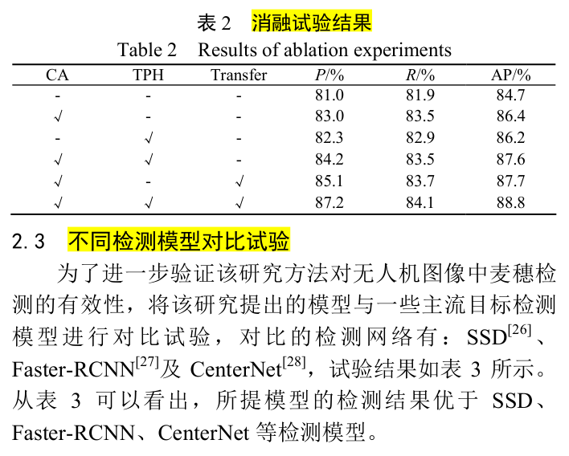

SSD 的 AP 为 73.7%、Faster-RCNN 为 77.3%、CenterNet 为 82.8%、YOLOv5 为 84.7%，本文方法以 88.8% 的 AP 取得最优，且精确率与召回率均不低于其余模型，表明针对稠密重叠麦穗的结构改造优于直接套用通用检测网络。

### 可视化分析

YOLOv5 与本文模型在测试集上的检测效果对比如下图所示。

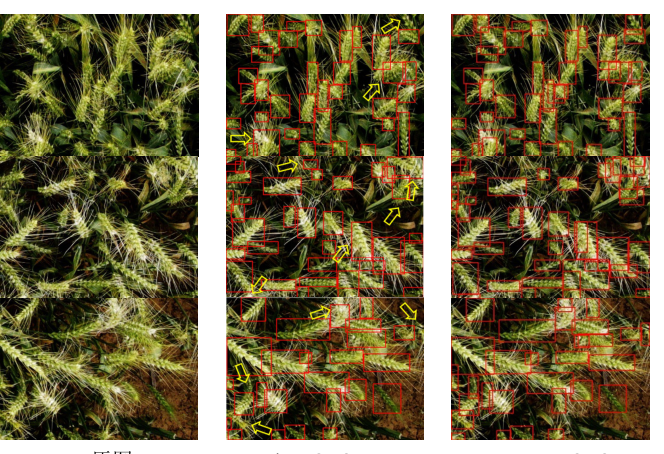

麦穗重叠问题上的局部放大对比如下图所示，箭头标出漏检或误检位置。

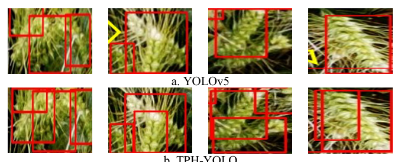

YOLOv5 在稠密重叠区域存在明显的漏检与误检框，本文模型能够更加注意到麦穗信息、在高密度场景准确定位麦穗，重叠现象带来的漏检误检被有效缓解。计数结果的可视化如下图所示。

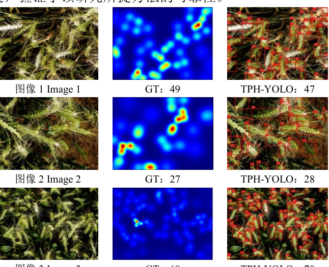

三幅示例图像的麦穗真实值分别为 49、27、68，本文模型计数值为 47、28、70，与真值接近；测试集 30 幅图像的麦穗真实值合计 1415，模型计数 1384，错误个数 31、错误率 0.022，说明检测框层面的改进最终落实到了计数精度上。

### 计数相关性分析

将麦穗估计值与真实值做线性回归拟合，结果如下图所示。

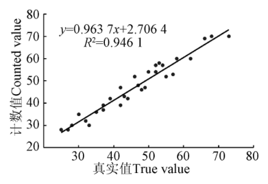

拟合的决定系数 R2 值在 0.95 左右，说明模型对麦穗数的估计值与真实值之间存在明显的线性关联，计数结果可以直接支撑单位面积估产。

### 跨数据集泛化与讨论

为验证模型有效性，本文在公开数据集 GWHD 上做了对比试验：该数据集包含 3376 张 RGB 图像、共 145665 个小麦麦穗，图像像素大小为 1024 像素×1024 像素，样本覆盖不同品种、种植条件与采集方法。SSD、Faster-RCNN、CenterNet、YOLOv5 的平均精确率分别为 80.5%、86.2%、84.7% 与 88.3%，本文模型为 91.6%，分别提升 11.1、5.4、6.9 与 3.3 个百分点，表明模型具有较好的泛化能力。本文同时指出，无人机飞行高度为 3 m，若希望单幅图像覆盖更大田间面积就需要提高飞行高度，麦穗分辨率随之下降，计数前需先做超分辨率重建，这是原文列出的后续工作。

## 优点和创新点

个人认为，本文有如下一些优点和创新点可供参考学习：

1. 针对稠密重叠麦穗同时改造骨干、颈部与预测头三处结构，CA 细化特征、TPH 提供多头注意力定位潜力，消融实验给出逐组件增益，改造点与问题一一对应。
2. 用田间高分辨率图像预训练骨干、冻结后以无人机图像微调的迁移学习策略，缓解了无人机样本少的困难，AP 在消融基础上再提升至 88.8%。
3. 实验除检测指标外还给出计数错误率 0.022 与 R2 约 0.95 的拟合分析，并在 GWHD 公开数据集上验证泛化能力，从检测到计数的证据链完整，说服力强。
