# Wise-IoU: Bounding Box Regression Loss with Dynamic Focusing Mechanism

Paper Reading 是从个人角度进行的一些总结分享，受到个人关注点的侧重和实力所限，可能有理解不到位的地方。具体的细节还需要以原文的内容为准，博客中的图表若未另外说明则均来自原文。

| 论文概况 | 详细 |
| --- | --- |
| 标题 | 《Wise-IoU: Bounding Box Regression Loss with Dynamic Focusing Mechanism》 |
| 作者 | Zanjia Tong、Yuhang Chen、Zewei Xu、Rong Yu |
| 发表期刊 | arXiv 预印本（arXiv:2301.10051，未正式见刊） |
| 期刊等级 | 未获取 |
| 发表年份 | 2023 |
| 论文代码 | https://github.com/Instinct323/wiou |

作者单位：

1. 未获取

## 研究动机

边界框回归（Bounding Box Regression, BBR）是目标检测中定位任务的核心问题，检测器依靠 BBR 损失优化预测框与真实框的偏差，损失定义的好坏直接决定模型的定位性能。现有 BBR 损失研究大多默认训练数据中的样本是高质量的，并把精力放在增强损失的拟合能力上：从 YOLOv1、YOLOv2 的范数类损失，到以比例形式屏蔽框尺寸干扰的 IoU 损失，再到 GIoU、DIoU、CIoU、EIoU、SIoU 等一系列引入距离、长宽比等几何因子构造惩罚项的工作，逐步解决了两框不重叠时梯度消失的问题。

然而，真实训练数据的标注质量参差不齐，标注不准、标注错误、标注不完整的低质量样例客观存在。若在低质量样例上盲目加强 BBR 损失，反而会危害定位性能：高质量的锚框在低质量样例上会产生很大的损失，一旦损失给这类锚框分配大的梯度增益，模型的学习就会被带偏。Focal-EIoU v1 试图用非单调聚焦机制缓解这一问题，但它的聚焦机制是静态的，预先指定了锚框的质量划分标准，没有注意到锚框的质量评价本质上体现在相互比较之中，非单调聚焦机制的潜力未被充分发掘。如何随训练状态动态地评价锚框质量并合理分配梯度增益，是暂未有工作解决的空白。

## 文章贡献

针对静态聚焦机制无法抑制低质量样例有害梯度的问题，本文提出了 Wise-IoU（WIoU）损失函数。其核心是用离群度代替 IoU 来评价锚框质量的动态非单调聚焦机制。首先构造具有双层注意力机制的 WIoU v1，在仿真实验中取得比 SIoU 更低的回归误差；接着在其上叠加单调聚焦系数得到 WIoU v2，并进一步以离群度构造的非单调聚焦系数替换单调系数得到 WIoU v3，使高质量与低质量锚框同时获得小的梯度增益，让 BBR 聚焦于普通质量锚框；最终将 WIoU 集成到实时检测器 YOLOv7 中，并对低质量样例的影响做了一系列详细研究。实验表明，WIoU v3 将 YOLOv7 在 MS-COCO 数据集上的 AP75 从 53.03% 提升到 54.50%，动态非单调聚焦机制为模型带来了更好的泛化性能。

## 本文方法

### 仿真实验评估协议

仿真实验的目标是在受控环境中初步比较各 BBR 损失的收敛速度与回归误差，作为全文方法设计与对比的统一评估协议。本文沿用 Zheng 等的仿真设置：在 (0.5, 0.5) 处生成 7 种长宽比（1:4、1:3、1:2、1:1、2:1、3:1、4:1）、面积均为 1/32 的目标框，在以 (0.5, 0.5) 为圆心、半径 r 的圆形区域内均匀生成 $20000r^2$ 个锚点，每个锚点处放置 7 种尺度、7 种长宽比共 49 个锚框，每个锚框需拟合每个目标框，共 $6860000r^2$ 个回归案例。两种档位下锚点与目标框的分布如下图所示。

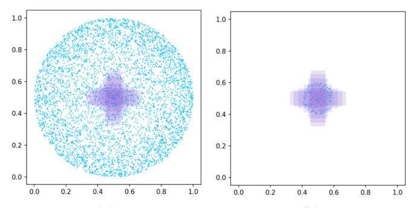

r = 0.5 时锚框分布在目标框覆盖区域的内外，对应 BBR 中的全部案例；r = 0.1 时锚框只生成在目标框覆盖范围内，对应 BBR 中的主要案例。实验将全部回归案例上的损失值 $L_i$ 用学习率 0.01 的梯度下降算法优化，输出各损失的收敛曲线与回归结果。该协议是后文三个版本 WIoU 与各家损失对比的统一评判依据。

### 梯度消失与加法式惩罚范式

IoU 损失是加法式范式的起点，其定义为：

$$L_{IoU}=1-IoU=1-\frac{W_iH_i}{S_u}$$

其中 $W_i$、$H_i$ 是锚框与目标框重叠区域的宽与高，$S_u$ 是并集面积（即图 1 中的 $S_u=wh+w^{gt}h^{gt}-W_iH_i$）。这等价于以比例形式回归两框的重叠程度，屏蔽了边界框尺寸的干扰；但当两框不重叠时 $W_i=0$ 或 $H_i=0$，$L_{IoU}$ 回传的梯度 $\partial L_{IoU}/\partial W_i$ 为 0，重叠区域的宽度在训练中无法更新。相关几何量的示意如下图所示。

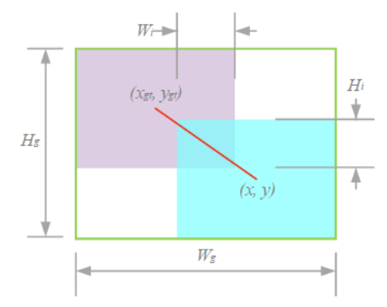

图中绿色框为两框的最小外接框，红色线段为两框中心点的连线，后文的惩罚项都围绕这两类几何量构造。为解决梯度消失，现有工作遵循统一的加法式范式：

$$L_i=L_{IoU}+R_i$$

其中 $R_i$ 是由与边界框相关的几何因子构造的惩罚项。该范式把「重叠度」与「几何惩罚」拆成两项，各家方法的差异集中在 $R_i$ 的构造上，即下一小节的内容。

### 现有惩罚项回顾

DIoU、CIoU 与 SIoU 的惩罚项是加法式范式的三类代表形态。DIoU 以两框中心点的归一化距离作为惩罚项：

$$R_{DIoU}=\frac{(x-x^{gt})^2+(y-y^{gt})^2}{W_g^2+H_g^2}$$

其中 $W_g$、$H_g$ 是最小外接框的宽与高。该惩罚项既解决了梯度消失，又让 $L_{IoU}$ 相同的锚框面对更直观的选择；但它对 $W_g$、$H_g$ 的梯度恒为负，会使最小外接框尺寸增大、反而阻碍锚框与目标框的重叠。EIoU 在此基础上加重了对距离度量的惩罚，CIoU 则进一步引入长宽比一致性：

$$R_{CIoU}=R_{DIoU}+\alpha v,\quad \alpha=\frac{v}{L_{IoU}+v}$$

其中长宽比一致性 $v$ 计算为：

$$v=\frac{4}{\pi^2}\left(\tan^{-1}\frac{w}{h}-\tan^{-1}\frac{w^{gt}}{h^{gt}}\right)^2$$

其中 $w$、$h$ 与 $w^{gt}$、$h^{gt}$ 分别是锚框与目标框的宽和高。由于 $\partial v/\partial h=-\frac{w}{h}\,\partial v/\partial w$，$v$ 无法对宽和高提供同号的梯度；当 $R_{DIoU}$ 产生的负梯度恰好抵消 $L_{IoU}$ 的梯度时，锚框将停止优化。SIoU 把惩罚项拆成角度、距离、形状三个代价：角度代价 $\Lambda=\sin\big(2\sin^{-1}\frac{\min(|x-x^{gt}|,|y-y^{gt}|)}{\sqrt{(x-x^{gt})^2+(y-y^{gt})^2}+\epsilon}\big)$ 引导锚框先漂移到目标框最近的坐标轴上；距离代价 $\Delta=\frac{1}{2}\sum_{t=w,h}(1-e^{-\gamma\rho_t})$（其中 $\gamma=2-\Lambda$）使距离惩罚与角度代价正相关；形状代价 $\Omega=\frac{1}{2}\sum_{t=w,h}(1-e^{\omega_t})^{\theta}$（其中 $\theta=4$）描述两框的尺寸差异，三者合成的惩罚项为：

$$R_{SIoU}=\Delta+\Omega$$

$R_{SIoU}$ 对距离度量的惩罚随形状代价增大而增大，因此 SIoU 收敛速度更快、回归误差更低。但距离、长宽比这类几何因子在惩罚偏差的同时也会加重对低质量样例的惩罚，从而损害模型的泛化性能，这正是下一小节 WIoU v1 引入注意力机制的出发点。

### WIoU v1：双层注意力机制

WIoU v1 的目标是通过注意力机制削弱对高质量锚框的惩罚，减少对训练的干预以换取更好的泛化能力。本文构造距离注意力，得到具有两层注意力机制的 WIoU v1：

$$L_{WIoU\,v1}=R_{WIoU}L_{IoU},\quad R_{WIoU}=\exp\left(\frac{(x-x^{gt})^2+(y-y^{gt})^2}{(W_g^2+H_g^2)^*}\right)$$

其中 $R_{WIoU}\in[1,e)$，会显著放大普通质量锚框的 $L_{IoU}$；$L_{IoU}\in[0,1]$，会在锚框与目标框吻合良好时显著降低高质量锚框的 $R_{WIoU}$ 及其对中心点距离的关注。为防止 $R_{WIoU}$ 产生阻碍收敛的梯度，$W_g$、$H_g$ 被从计算图中分离（上标 $*$ 表示该操作），因此 WIoU v1 没有引入长宽比等新度量。WIoU v1 解决的是「基础损失如何构造」，而梯度增益该在不同质量的锚框间如何分配，由后两小节的聚焦机制回答。

### WIoU v2：单调聚焦机制

WIoU v2 借鉴 focal loss 的单调聚焦机制，用于降低易学样例在损失中的竞争力。仿照 focal loss 的做法，本文为 $L_{WIoU\,v1}$ 构造单调聚焦系数：

$$L_{WIoU\,v2}=L_{IoU}^{\gamma*}L_{WIoU\,v1},\quad \gamma>0$$

其中 $\gamma$ 是聚焦指数，上标 $*$ 同样表示从计算图分离。此时梯度增益为 $r=L_{IoU}^{\gamma*}\in[0,1]$，训练过程中随 $L_{IoU}$ 的减小而减小，导致训练后期收敛速度变慢。为此本文引入 $L_{IoU}$ 的均值作为归一化因子：

$$L_{WIoU\,v2}=\left(\frac{L_{IoU}^*}{\overline{L_{IoU}}}\right)^{\gamma}L_{WIoU\,v1}$$

其中 $\overline{L_{IoU}}$ 是 $L_{IoU}$ 以动量 $m$ 计算的指数移动平均。动态更新归一化因子使梯度增益 $r$ 整体保持在较高水平，解决了训练后期收敛缓慢的问题。但单调聚焦机制始终给 $L_{IoU}$ 大的锚框分配大梯度增益，在低质量样例上反而放大了有害梯度，这引出下一小节 WIoU v3 的非单调设计。

### WIoU v3：动态非单调聚焦机制

WIoU v3 是本文的最终形态，用离群度代替 IoU 评价锚框质量，给出明智的梯度增益分配策略。离群度定义为 $L_{IoU}$ 与其移动平均的比值：

$$\beta=\frac{L_{IoU}^*}{\overline{L_{IoU}}}\in[0,+\infty)$$

离群度小意味着锚框质量高，给它分配小梯度增益可以让 BBR 聚焦于普通质量锚框；给离群度大的锚框同样分配小梯度增益，则能有效阻止低质量样例产生的大幅有害梯度。基于此，本文用 $\beta$ 构造非单调聚焦系数并作用于 WIoU v1：

$$L_{WIoU\,v3}=rL_{WIoU\,v1},\quad r=\frac{\beta}{\delta\alpha^{\beta-\delta}}$$

其中 $\delta$ 使 $\beta=\delta$ 时 $r=1$，$\alpha$ 控制曲线的形态。离群度到梯度增益的映射如下图所示。

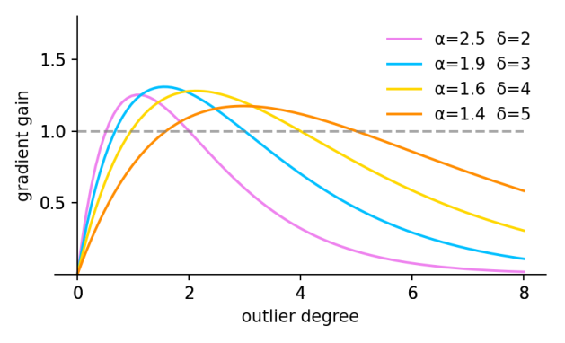

当锚框的离群度满足 $\beta=C$（C 为常数）时获得最高梯度增益；由于 $\overline{L_{IoU}}$ 是动态的，锚框的质量划分标准也随之动态变化，WIoU v3 能在每一时刻做出最符合当前情况的梯度增益分配。为防止低质量锚框在训练早期被落下，本文初始化 $\overline{L_{IoU}}=1$，使 $L_{IoU}=1$ 的锚框享有最高梯度增益，并以较小的动量 $m$ 延缓 $\overline{L_{IoU}}$ 接近真实值的时间：对 batch 数为 $n$、AP 上升在第 $t$ 个 epoch 显著放缓的训练（如下图所示），动量设置为：

$$m=1-\sqrt[tn]{0.05}$$

该设置使训练 $t$ 个 epoch 后 $\overline{L_{IoU}}\approx L_{IoU-real}$。AP 放缓时刻的示意如下图所示。

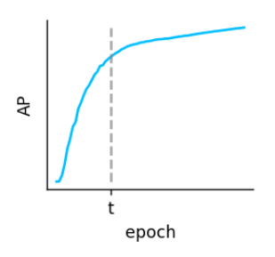

图中横轴为训练轮次、纵轴为 AP，曲线上升显著放缓的 epoch 即取作 $t$。训练中期与后期，WIoU v3 对低质量与高质量锚框同时分配小梯度增益、聚焦普通质量锚框，至此完成从基础损失到聚焦机制的完整设计。

## 实验结果

### 实验设置

全部实验在 PyTorch 框架上完成。数据集选取 MS-COCO 中的 20 个类别，取 28474 张图像作训练数据、1219 张图像作验证数据；模型选用层通道倍数 0.75 的 YOLOv7-w6，以 batch size 32 训练 120 epochs，$\overline{L_{IoU}}$ 的动量按 n = 890、t = 34 设置；评价指标为验证集的 AP75、AP50 与 AP。YOLOv7 检测头产生的锚框分为主导头锚框（ABLH）与辅助头锚框（ABAH）两部分：ABLH 拟合结果更好但信息量更少，ABAH 则相反；若均值只统计 ABLH，ABAH 的梯度增益会逐渐消失，使聚焦机制忽略 ABAH 丰富的信息量，因此本文的均值统计同时包含 ABLH 与 ABAH。

### 仿真实验对比

无聚焦机制的各 BBR 损失在仿真实验中的 $L_{IoU}$ 收敛曲线如下图所示。

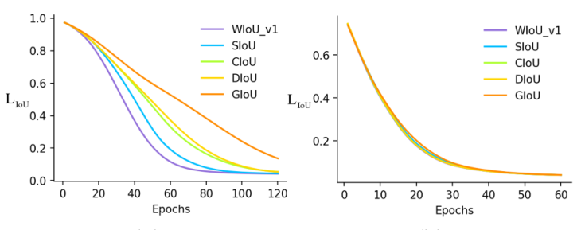

在现有一系列 BBR 损失中 SIoU 的收敛速度最快；而在主要案例中各损失的收敛速度极为接近，可见收敛速度的差异主要来自不重叠的边界框，本文提出的基于注意力的 WIoU v1 恰在这一部分效果最好。各损失引导的回归结果如下图所示。

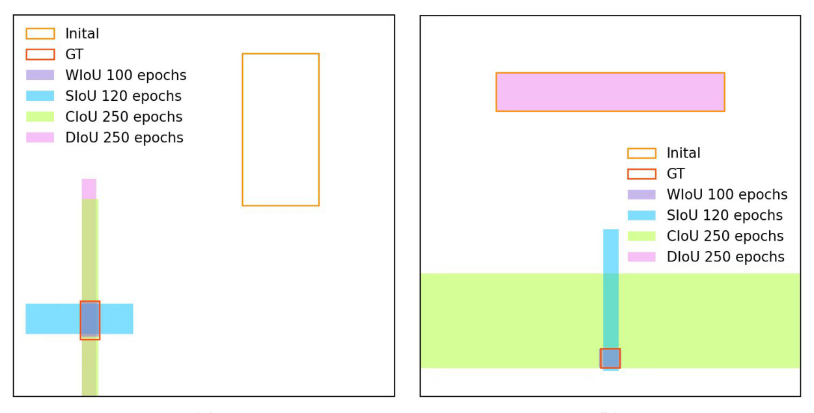

图中 WIoU 引导的锚框以更短的路径收敛到目标框，回归结果在各损失中最优，表明注意力机制对不重叠情形的改善确实转化为更直接的回归路径。

### 定性效果对比

聚焦机制对低质量样例的抑制效果先在含噪训练数据上验证，如下图所示。

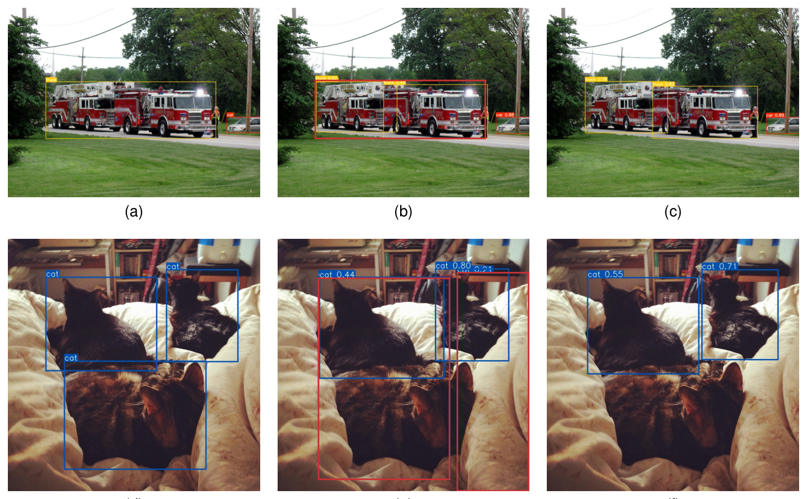

图 (a, d) 为含低质量样例的训练数据，(b, e) 为 WIoU v2 的训练结果，(c, f) 为 WIoU v3 的训练结果：带单调聚焦机制的 WIoU v2 受低质量样例影响产生较差的预测，而 WIoU v3 有效屏蔽了这些影响、得到理想的预测。在真实数据上，部分低质量样例与 WIoU v3 的预测如下图所示。

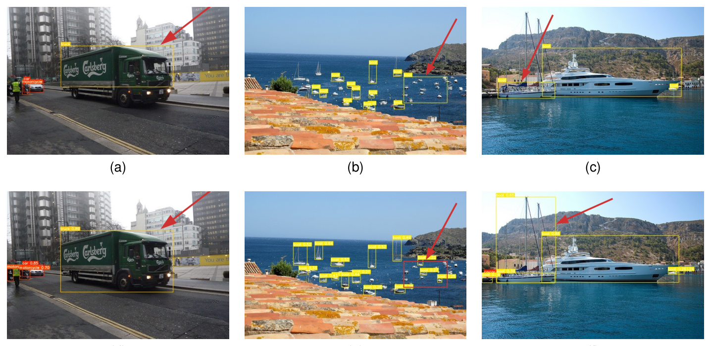

图 (a-c) 中部分目标框没有准确标注实例，使用 WIoU v3 训练的模型在这些样例上仍给出理想预测，说明动态非单调聚焦机制确实挡住了低质量样例的干扰。

### 定量对比与消融

各边界框损失在验证集上的性能如下表所示。

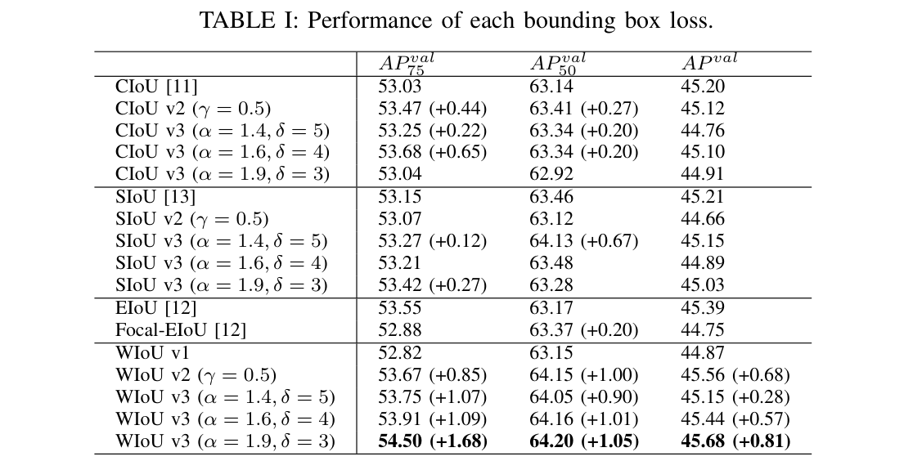

原始版本的性能排序为 EIoU > SIoU > CIoU > WIoU v1，与它们对距离度量惩罚的强弱顺序一致；而加上聚焦机制后性能增益的顺序恰好相反：单调聚焦机制对距离惩罚较强的 SIoU 与 EIoU 产生负面影响，对距离惩罚较弱的 CIoU 与 WIoU v1 则能有效削弱有害梯度的放大。WIoU v3 在 α = 1.9、δ = 3 时取得 54.50 / 64.20 / 45.68 的 AP75 / AP50 / AP，为全表最优，相比 CIoU 基线的 53.03 AP75 提升 1.47，可见每种 BBR 损失都存在一组最大化非单调聚焦机制增益的参数，而 WIoU v3 的增益最为显著。

### 可视化分析

训练过程中 YOLOv7 精度的变化如下图所示。

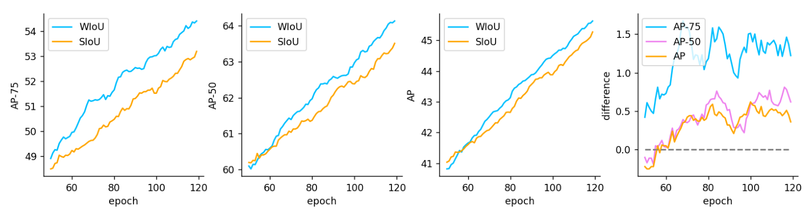

WIoU v3 训练的模型精度上升更快，AP 差值在整个训练过程中保持领先，表明动态非单调聚焦机制在训练全程屏蔽了许多负面影响。将 WIoU v3 与 SIoU、Focal-EIoU 逐类别比较，部分类别的精度如下表所示。

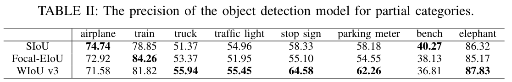

WIoU v3 在 stop sign、parking meter 等类别上精度大幅提升（分别达 64.58 与 62.26），而 airplane 与 bench 两个类别的精度反而下降。结合数据集的部分标签如下图所示，可以给出归因。

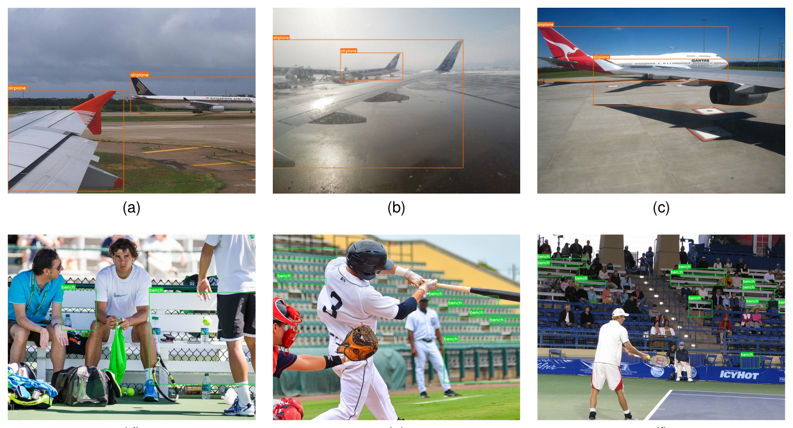

airplane 的部分标签存在争议或缺少机身等显著特征，这类样例与低质量样例一样难学，被 WIoU v3 的聚焦机制丢弃；bench 的标签存在大量错误且有大量 bench 未被标注，对泛化好、检出更多 bench 的模型并不公平。类别精度的升降与数据集标注质量一致，从侧面验证了聚焦机制确实在按样例质量分配梯度增益。

## 优点和创新点

个人认为，本文有如下一些优点和创新点可供参考学习：

1. 用离群度代替 IoU 评价锚框质量，使质量划分标准随训练状态动态更新，充分发掘了非单调聚焦机制的潜力，设计视角新颖。
2. 梯度增益分配策略同时压制高质量与低质量锚框、聚焦普通质量样本，为含噪标注下的检测训练提供了可复用的样本加权范式。
3. 实验覆盖仿真回归、聚焦机制消融、训练曲线与逐类别精度归因等多个维度，证据链完整，说服力强。
