# YOLO-FaceV2: A scale and occlusion aware face detector

Paper Reading 是从个人角度进行的一些总结分享，受到个人关注点的侧重和实力所限，可能有理解不到位的地方。具体的细节还需要以原文的内容为准，博客中的图表若未另外说明则均来自原文。

| 论文概况 | 详细 |
| --- | --- |
| 标题 | 《YOLO-FaceV2: A scale and occlusion aware face detector》 |
| 作者 | Ziping Yu、Hongbo Huang、Weijun Chen、Yongxin Su、Yahui Liu、Xiuying Wang |
| 发表期刊 | Pattern Recognition |
| 期刊等级 | CCF-B |
| 发表年份 | 2024 |
| 论文代码 | [https://github.com/Krasjet-Yu/YOLO-FaceV2](https://github.com/Krasjet-Yu/YOLO-FaceV2) |

作者单位：

1. 北京信息科技大学仪器科学与光电工程学院（School of Instrument Science and Opto-electronic Engineering, Beijing Information Science and Technology University）
2. 北京信息科技大学计算机学院（Computer School, Beijing Information Science and Technology University）
3. 蔚来数据算法部门（Data Algorithm NIO, Shanghai）
4. 北京信息科技大学机电工程学院（School of Mechanical and Electrical Engineering, Beijing Information Science and Technology University）
5. 北京信息科技大学信息管理学院（School of Information Management, Beijing Information Science and Technology University）

## 研究动机

人脸检测是人脸识别、验证与属性分析等面部分析应用的基础任务，表现为真实场景中需要同时应对尺度剧烈变化与遮挡的人脸，导致其质量直接决定下游智能监控系统的可用性。然而现有检测器在小脸与遮挡脸两类困难样本上仍有明显短板。尺度方面，人脸尺度连续变化而现有算法多基于离散 anchor，难以适应这种连续变化；监控等场景中小于 16×16 像素的人脸需要在整幅图密铺小 anchor 才能保证召回，这又加剧极端类不平衡，训练时累积的误检主导模型更新，造成低效训练。遮挡方面，遮挡带来部分数据丢失，模型难以提取足够特征做精确定位；拥挤场景中人脸重叠还使检测器对 NMS 阈值敏感，容易产生漏检。Focal Loss、GHM、PISA 等难样本挖掘方法缓解了不平衡但依赖众多超参数，FAN 的 anchor 级注意力又未充分利用通道间信息。暂少有单阶段人脸检测器能以更少的超参数同时应对尺度变化、遮挡与样本不平衡三类问题。

## 文章贡献

针对人脸尺度变化、遮挡与难易样本不平衡三类挑战，本文提出了基于 YOLOv5 的实时人脸检测器 YOLO-FaceV2，其核心是三个分别对准上述问题的模块组合：感受野增强模块 RFE 以共享权重的多分支空洞卷积提取多尺度像素信息并扩大感受野，配合按有效感受野设计的多尺度 anchor 与 NWD 度量应对小脸；分离增强注意力模块 SEAM 聚焦被遮挡区域以补偿缺失特征，并以 Repulsion Loss 降低检测器对 NMS 的敏感；滑动权重函数 SWF 自适应地给难样本分配更高权重。首先本文在 YOLOv5 上完成整体架构改造，接着以尺度不变性、遮挡感知、样本不平衡三组消融分别验证三类模块，最终在 WiderFace 上与主流人脸检测器对比。实验表明，YOLO-FaceV2l 在 WiderFace 验证集 easy、medium、hard 三个子集上取得 98.6%、97.9%、91.9%，超过此前 SOTA 2.3、2.5、1.1 个百分点，并在 FDDB 上取得 98.71% mAP。

## 本文方法

### 整体架构

YOLO-FaceV2 沿用 YOLOv5 的 backbone、neck、head 三段式结构，把改造集中在尺度与遮挡两个问题上。整体架构如下图所示。

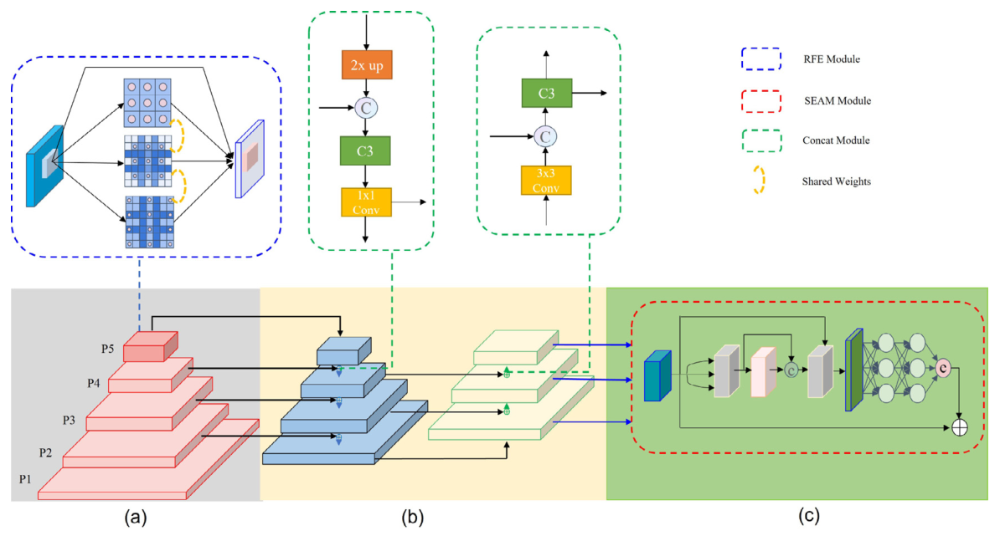

骨干采用前馈式 CSPDarknet53，由 CSP 与 CBS 块负责特征提取，其中 P5 层的 CSP 块被替换为 RFE 模块以扩大有效感受野、增强多尺度融合能力；颈部保留 SPP 与 PAN，SPP 分离出最显著的上下文特征并增大感受野，PAN 聚合骨干不同层级的特征供给不同检测层，为补偿感受野增大带来的分辨率损失，P2 层被并入 PAN 以提升小脸检测精度；颈部之后引入 SEAM 模块增强对遮挡人脸的响应。骨干的多尺度特征图经 RFE 增强后的 P5 与并入的 P2 送入 PAN，颈部输出再进入带 SEAM 的检测头完成预测。

### 尺度感知 RFE 模块

RFE 模块用于充分利用特征图中不同尺寸的感受野，捕获多尺度信息与不同范围的长程依赖。受 TridentNet 启发，本文以 dilation rate 取 1、2、3 的 3×3 空洞卷积与平均 pooling 层构成四个分支，所有分支共享权重、唯一差别是各自的感受野，既减少参数量与过拟合风险，又能充分利用每个样本；分支间以残差连接防止训练时梯度爆炸与消失。模块结构如下图所示。

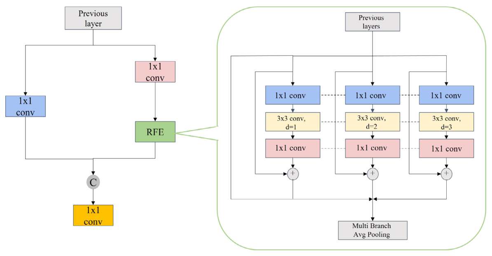

RFE 分为多分支空洞卷积与 gathering & weighting 层两部分：后者汇聚各分支信息并对每个分支的特征加权，用以平衡不同分支的表示。实现上把 YOLOv5 中 P5 层 C3 模块的 bottleneck 替换为 RFE，以增大特征图感受野、提升多尺度目标检测与识别精度，其输出送入颈部参与多尺度融合。

### Anchor 设计与 NWD 损失

anchor 设计策略用于为各检测层提供匹配人脸形状与有效感受野的先验。本文在 WiderFace 训练集上统计真值人脸的宽高比，据此把宽高比设为 1:1.2；anchor 尺寸先按卷积与 pooling 层的分布计算 P2 的理论感受野，但理论感受野内的像素并非同等贡献于输出，依据有效感受野近似高斯形状、且具有 1/√n 相对收缩的结论重新估计 anchor 尺寸，再以固定步长在 P2 基础上确定 P3 与 P4 的 anchor，如下图所示。

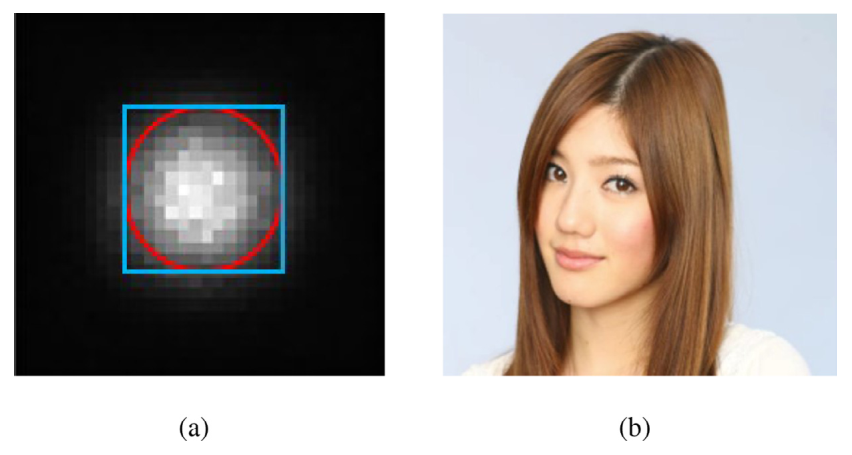

| 检测层 | 步长 | 宽高比 | anchor 尺寸 |
| --- | --- | --- | --- |
| P2 | 4 | 1.2 | 16, 20.16, 25.40 |
| P3 | 8 | 1.2 | 32, 40.32, 50.80 |
| P4 | 16 | 1.2 | 64, 80.63, 101.59 |

回归损失方面，本文引入归一化高斯 Wasserstein 距离缓解 IoU 对小尺度人脸微小偏移的敏感：先把边界框建模为二维高斯分布，再用分布间距离度量预测目标与真实目标的相似度，无论两者是否重叠都可度量。NWD 的计算为：

$$NWD(N_a, N_b) = exp\left(-\frac{\sqrt{W_2^2(N_a, N_b)}}{C}\right)$$

$$W_2^2(N_a, N_b) = \left\| \left( \left[cx_a, cy_a, \tfrac{w_a}{2}, \tfrac{h_a}{2}\right]^T, \left[cx_b, cy_b, \tfrac{w_b}{2}, \tfrac{h_b}{2}\right]^T \right) \right\|_2^2$$

| 符号 | 含义 |
| --- | --- |
| $C$ | 与数据集密切相关的常数 |
| $W_2^2(N_a, N_b)$ | 两个高斯分布间的距离度量 |
| $N_a$、$N_b$ | 由 $A = (cx_a, cy_a, w_a, h_a)$ 与 $B = (cx_b, cy_b, w_b, h_b)$ 建模的高斯分布 |

NWD 对目标尺度不敏感，更适合度量小目标相似度；而 IoU 更适合大目标，因此本文保留 IoU 损失并把两者比例调为 1:1 共同组成回归损失，在训练中与分类损失一起约束检测头的框回归。

### SEAM 遮挡感知注意力

SEAM 模块用于利用特征图之间的关系召回被遮挡的特征，应对类间遮挡表现出来的对齐误差、局部混叠与特征丢失。它服务三个目标：促进多尺度人脸检测、突出图像中的面部区域、反向削弱背景区域。结构如下图所示。

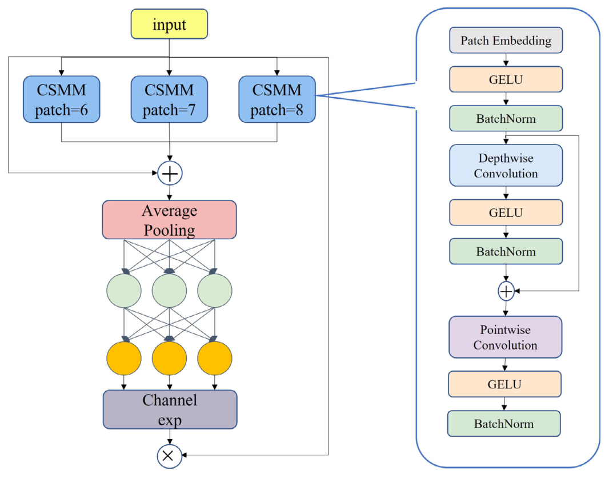

SEAM 的第一部分是带残差连接的深度可分离卷积，逐通道卷积学习不同通道的重要性并减少参数量；为弥补其忽略通道间关系的损失，不同深度卷积的输出随后用逐点 1×1 卷积组合；接着一个两层全连接网络聚合各通道信息、增强通道间连通性，借助学习到的被遮挡与未被遮挡面部区域之间的关系补偿遮挡造成的信息丢失；全连接层输出的 logits 经指数变换把取值范围从 [0, 1] 扩展到 [1, e]，这一单调映射使结果对位置误差更宽容。最终 SEAM 的输出作为注意力权重与原特征相乘，加权后的特征送入检测头。

### Repulsion Loss

Repulsion Loss 用于处理类内遮挡：人脸 A 的预测框可能包含人脸 B 的特征，导致误检率升高，排斥损失通过排斥作用缓解这一问题。它分为 RepGT 与 RepBox 两部分。RepGT 使当前边界框尽量远离周围真值框（即除自身回归目标外与该人脸 IoU 最大的脸标签），计算为：

$$L_{RepGT} = \frac{\sum_{P \in P^+} Smooth_{ln}(IoG(P, G^P_{Rep}))}{|P^+|}$$

| 符号 | 含义 |
| --- | --- |
| $P$ | 人脸预测框 |
| $G^P_{Rep}$ | 周围与该人脸 IoU 最大的真值框 |
| $IoG(P, G)$ | 交叠面积与真值面积之比，$area(P \cap G)/area(G) \in [0, 1]$ |

其中 $Smooth_{ln}$ 是 (0, 1) 上连续可微的 ln 函数：

$$Smooth_{ln} = \begin{cases} -ln(1-x) & x \leq \sigma \\ \frac{x-\sigma}{1-\sigma} - ln(1-\sigma) & x > \sigma \end{cases}$$

其中 $\sigma \in [0, 1)$ 是调节排斥损失对离群点敏感度的平滑参数。RepBox 部分则让预测框尽量远离周围预测框、降低彼此 IoU，避免分属两张人脸的预测框之一被 NMS 抑制：预测框按回归目标分成多个组，对组间预测框 $p_i$ 与 $p_j$ 希望其重叠面积越小越好，总体损失为：

$$L_{RepBox} = \frac{\sum_{i \neq j} Smooth_{ln}(IoU(B_{p_i}, B_{p_j}))}{\sum_{i \neq j} 1[IoU(B_{p_i}, B_{p_j}) > 0] + \epsilon}$$

实验中 RepGT 的增益 α 与 RepBox 的增益 β 分别设为 0.01 与 0.1。两个排斥项与分类、回归损失一起加入总损失，共同约束拥挤场景下预测框的落位。

### 滑动权重函数 SWF

SWF 用于缓解难易样本不平衡：简单样本数量大、主导总损失，模型倾向学习简单样本特征而忽略难样本。本文以预测框与真值框的 IoU 大小区分难易样本，取所有边界框 IoU 的均值作为阈值 μ（实验中取 0.5），小于 μ 为负样本、大于 μ 为正样本；边界附近的样本分类不清、损失大且数量少，是希望模型充分学习的对象，因此用 Slide 加权函数对其赋予更高权重，表达为：

$$f(x) = \begin{cases} 1 & x \leq \mu - 0.1 \\ e^{1-\mu} & \mu - 0.1 < x < \mu \\ e^{1-x} & x \geq \mu \end{cases}$$

其中 $x$ 是预测框与真值框的 IoU，$\mu$ 是难易样本阈值；中段分支的区间划分与原文 Fig 5 的曲线一致（原文 Eq (7) 中段条件存在排版笔误）。函数形状如下图所示。

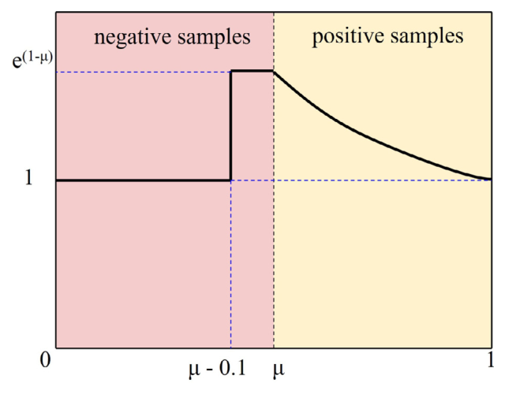

给出一个简单的例子，取 μ = 0.5：IoU 为 0.3 的简单样本权重为 1；IoU 为 0.45 的边界样本权重为 e^{0.5} ≈ 1.65；IoU 为 0.9 的正样本权重为 e^{0.1} ≈ 1.11。可以看到，SWF 在不引入额外难样本挖掘超参数的情况下，把难分类边界样本的相对损失抬到约 1.65 倍。SWF 的权重乘入样本损失后，与 RFE、SEAM 一起构成 YOLO-FaceV2 的完整训练目标。

## 实验结果

### 实验设置

实验主要在 WiderFace 上进行：训练集训练、验证集评测，easy、medium、hard 三个子集大致对应大、中、小人脸，hard 子集召回率超过 90% 即被认为性能相当好。FDDB 数据集含 2845 张图像、共 5171 张人脸，姿态角度困难、失焦与遮挡广泛，用于在不重新训练的前提下测试遮挡感知模块的有效性，以 mAP 为指标，mAP 达到 95% 以上即认为遮挡问题被有效解决。实现以 YOLOv5 为基线、PyTorch 实现，数据增强、训练与后处理超参数与 YOLOv5 相同（mosaic 概率、学习率、NMS 的 IoU 阈值）；完整模型先在 ImageNet 上预训练，再以 batch size 16 在 3090Ti 上微调约 50 个 iteration。

### 对比实验

密集小脸场景的定性检测结果如下图所示，单图数百张人脸的极端密集场景下 YOLO-FaceV2 仍能逐张召回。

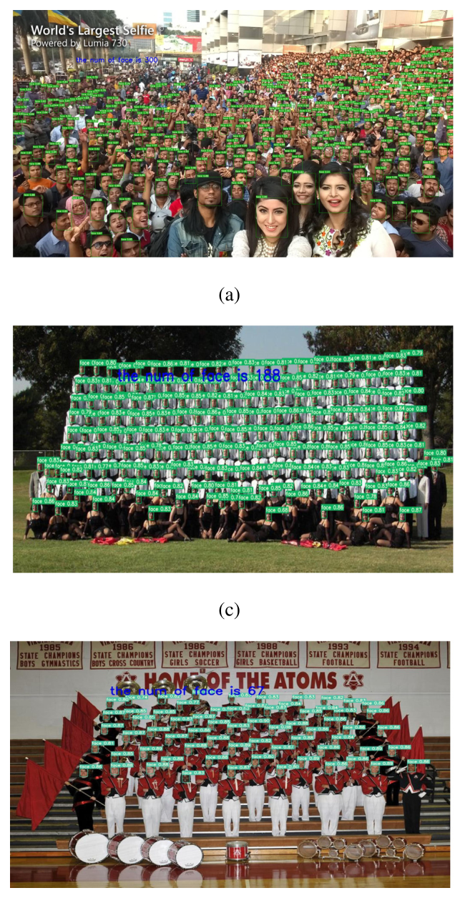

与主流人脸检测器在 WiderFace 验证集上的定量对比见原文 Table 7，截图如下。

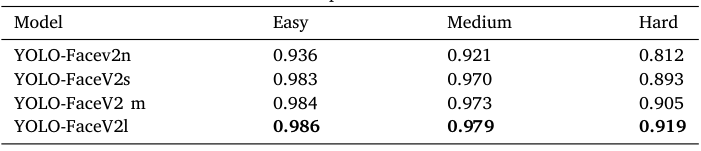

YOLO-FaceV2l 在 easy、medium、hard 三个子集上取得 98.6%、97.9%、91.9%，超过此前 SOTA 2.3、2.5、1.1 个百分点；在参数量大于 3M、FLOPs 大于 5G 的 YOLO 系模型中也全面领先 YOLOv5l-Face 与 YOLOv7。hard 子集上略逊于采用两阶段分类与回归的 RetinaNet 系最佳检测器，但后者以更多计算资源为代价。FDDB 上模型不重训即取得 98.71% mAP，超过 PyramidBox 的 0.9869 与 YOLO5Face 的 0.9843，达到 SOTA。各检测器的 PR 曲线如下图所示。

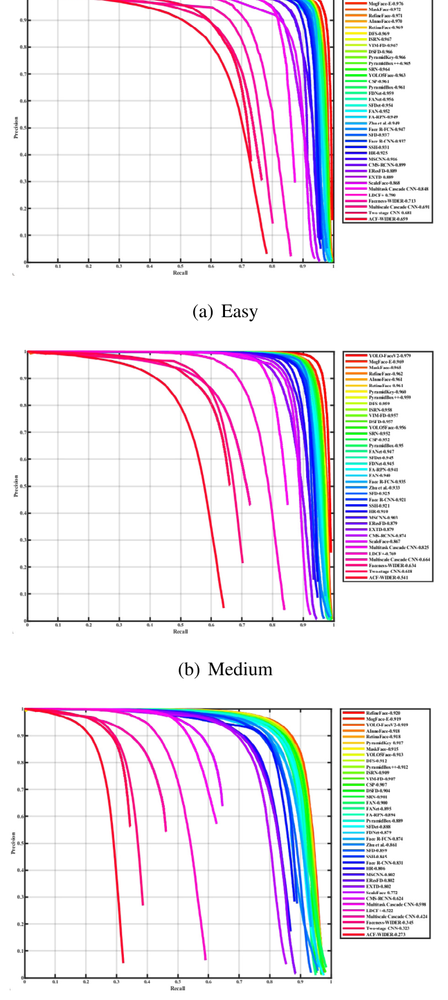

PR 曲线显示该检测器在小、中子集上超过 SOTA，hard 子集优于 YOLO 系方法。按 nano、small、medium、large 四档扩展模型规模（原文 Table 6），精度随参数增加持续上升（hard 子集从 0.812 升到 0.919），表明该架构的容量潜力仍未释放完毕。

### 消融实验

尺度不变性消融（原文 Table 2）显示，单独使用 RFE 时 hard 子集提升 0.57%，把 P2 并入 PAN 后 easy、medium、hard 升到 95.06、93.60、85.47，参数量反而从 7.063M 降到 5.097M；单独用 NWD 替换 IoU 时精度骤降，两者按 1:1 组合后三个子集分别提升 0.17%、0.87%、1.01%，表明 NWD 与 IoU 在大、小目标上互补；按有效感受野估计的 anchor 相比理论感受野 anchor 在三个子集上提升 0.24%、0.75%、0.9%。

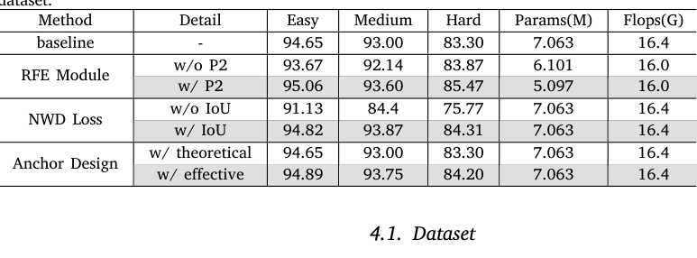

遮挡感知消融（原文 Table 3）显示，SEAM 相比基线在三个子集上提升 0.88%、0.82%、1.06%，超过 SE、CBAM、EMA 等主流注意力模块；Repulsion Loss 分别提升 0.71%、0.63%、0.5%。样本不平衡与模块组合消融（原文 Table 5）显示，SWF 单独加入即提升 medium 与 hard 子集，SWF、RFE、SEAM 依次叠加后三个子集达到 98.39、97.07、89.39，三个模块均带来正向增益。

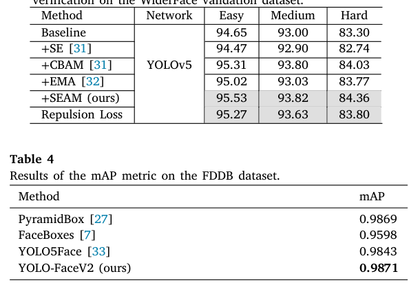

### 可视化分析

基于梯度定位的遮挡人脸热力图如下图所示，三行分别对应基线、仅加 Repulsion Loss、加 SEAM 模块三种设置。

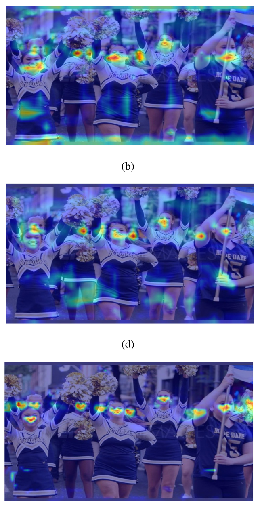

基线没有注意到画面右侧被手臂遮挡的脸；加入 Repulsion Loss 后该脸被检出，左侧相邻的两张脸也被清楚区分；再加入 SEAM 后每张脸都获得聚焦的响应，所有被遮挡的脸都被召回。可见遮挡感知模块的收益来自特征响应的真实变化，与 WiderFace、FDDB 上的定量指标互相印证。

## 优点和创新点

个人认为，本文有如下一些优点和创新点可供参考学习：

1. 把尺度、遮挡、样本不平衡三类人脸难题组织进统一的 YOLOv5 改进框架，RFE、SEAM、SWF 分别对准一个问题且消融独立自证，问题与模块的映射关系清晰。
2. 将有效感受野理论引入 anchor 尺寸估计，以高斯分布形状的有效感受野重估离散 anchor，并配合 NWD 度量缓解小脸对 IoU 偏移的敏感，设计依据扎实。
3. SWF 以单一阈值 μ 与分段指数加权实现难易样本的自适应加权，避开传统难样本挖掘方法的众多超参数，形式简单且在三子集上增益明确。
