# 基于 YOLO-GESCW 的盛花期红花轻量化检测方法

Paper Reading 是从个人角度进行的一些总结分享，受到个人关注点的侧重和实力所限，可能有理解不到位的地方。具体的细节还需要以原文的内容为准，博客中的图表若未另外说明则均来自原文。

| 论文概况 | 详细 |
| --- | --- |
| 标题 | 《基于 YOLO-GESCW 的盛花期红花轻量化检测方法》 |
| 作者 | 程义锋，王超，董广翔，李晓娟，黄腾龙，苏君红 |
| 发表期刊 | 《农业工程学报》 |
| 期刊等级 | 未获取 |
| 发表年份 | 2026 |
| 论文代码 | 未获取 |

作者单位：

1. 新疆大学机械工程学院，乌鲁木齐 830017
2. 新疆农牧机器人及智能装备工程研究中心，乌鲁木齐 830017
3. 西北农林科技大学机械与电子工程学院，杨凌 712100
4. 裕民县农业技术推广站，塔城 834800

## 研究动机

红花花丝采收是红花生产中的重要问题，表现为盛花期花丝形态饱满、颜色橘红、经济价值高，但花丝易损、果球位姿多变，必须在短时间内及时采收，目前仍以人工采摘为主，采收成本占种植收益的一半以上。然而，现有基于 YOLO 系列的红花检测方法仍存在局限：部分方法检测精度较好但未开展边缘设备部署测试，部分方法的参数量与浮点计算量偏大，难以适配算力受限的采收装备，还有一些轻量化方法在边缘设备上的单图推理耗时或检测速度仍不理想。具体到盛花期田间场景，检测难点集中在三个方面：一是红花果球位姿各异且易晃动、花丝尺度变化大且属于小目标，增加检测难度；二是复杂自然环境下光照变化、枝叶遮挡与花丝重叠，模型检测精度不足；三是模型体积与计算资源占用偏高，无法满足边缘设备高效部署需求。基于以上背景，该论文旨在同时解决复杂田间环境下盛花期红花检测精度不足与模型难以轻量化边缘部署的两个瓶颈。

## 文章贡献

针对盛花期红花检测中目标位姿各异、花丝尺度变化大、复杂环境下光照与遮挡导致的检测精度不足，以及模型体积大无法满足边缘设备高效部署需求的问题，本文提出了基于 YOLOv8n 改进的轻量化检测模型 YOLO-GESCW。其核心是幽灵卷积（Ghost Conv）、高效通道注意力（ECA）、空间金字塔池化高效层聚合网络（SPPELAN）、C3k2 模块与 Wise-IoUv3 损失函数的协同优化。首先引入幽灵卷积替换标准卷积，以"基础特征提取-廉价特征衍生"两步法压缩参数量与计算量；接着用 ECA 模块替换主干网络及颈部网络中的部分 C2f 模块，自适应捕捉通道间依赖关系；进一步用 SPPELAN 模块替换 SPPF 模块、用 C3k2 模块替换颈部网络中的 C2f 模块，分别强化多尺度特征均衡提取与精细轮廓细节捕捉；最后以 Wise-IoUv3 损失优化边界框回归，缓解遮挡场景下的定位误差。实验表明，YOLO-GESCW 的参数量、模型大小与浮点计算量较 YOLOv8n 分别降低 67.44%、65.10% 和 58.02%，测试集 mAP0.5 达 98.1%，并可在 NVIDIA Jetson Xavier NX 边缘设备上以平均 52.36 帧/s 实时检测，实现了检测轻量化与检测精度的平衡。

## 本文方法

### 数据集构建与图像增强

本文首先构建面向盛花期红花检测的田间图像数据集，采集地点为新疆塔城地区裕民县，红花品种为"裕红 1 号"，覆盖晴天与阴天的早、中、晚时段及顺光、侧光、逆光等光照条件，不同场景下的盛花期红花图像如下图所示。

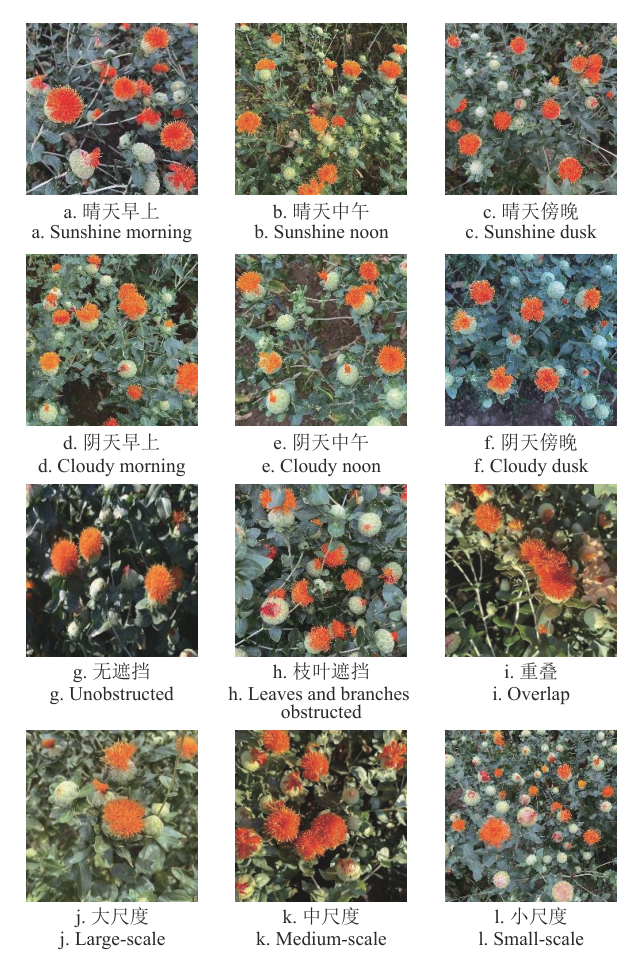

从图中可以看出，数据涵盖了无遮挡、枝叶遮挡、花丝重叠以及大、中、小多种尺度的花丝目标。原始图像共 2 521 张，随后通过调整亮度、调节饱和度、引入高斯噪声进行增强，分别对应自然光照强度变化、强光下反射效应的图像偏差与风力晃动造成的模糊，增强后共 7 563 张并统一缩放至 640×640 像素；仅对盛花期红花以 LabelImg 人工标注"Blooming"标签，最后按 7∶2∶1 划分为训练集 5 294 张、验证集 1 512 张与测试集 757 张。该数据集为后续基线模型训练以及全部对比、消融试验提供数据基础。

### YOLO-GESCW 整体结构

本文以 YOLOv8n 为基线，从卷积结构、注意力机制、多尺度特征融合、细节捕捉与损失函数 5 个方面改进构建 YOLO-GESCW，改进后模型的结构如下图所示。

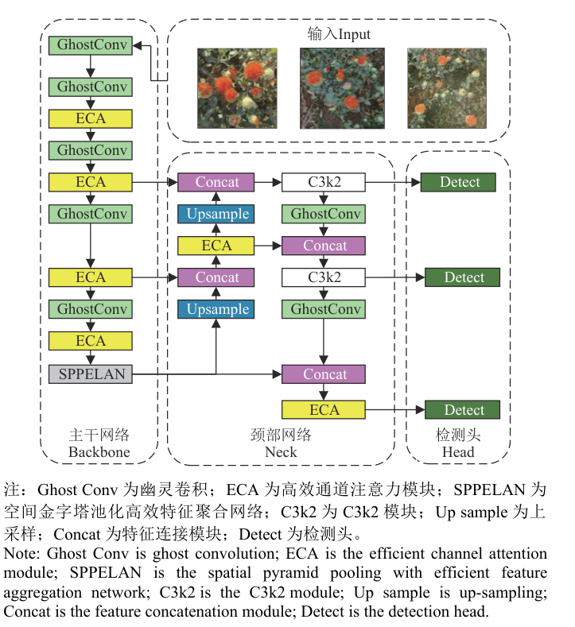

图中主干网络以 GhostConv 与 ECA 交替堆叠并以 SPPELAN 收尾，颈部网络在特征融合路径中引入 C3k2 与 ECA，检测头沿用 YOLOv8n 的解耦头与无锚框设计，在大、中、小三种尺度上完成目标分类与检测框定位。按数据流顺序，上述结构可拆分为幽灵卷积、ECA、SPPELAN、C3k2 与 Wise-IoUv3 损失 5 个改进部分，下文逐一展开介绍。

### GhostConv 幽灵卷积

GhostConv 的目标是在保证特征表达能力的同时初步减少参数量与计算量，用于替换主干网络中的标准卷积，标准卷积与幽灵卷积的结构对比如下图所示。

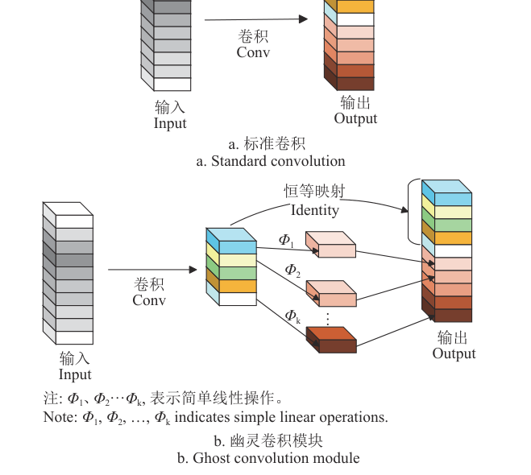

原 YOLOv8n 采用的标准卷积卷积核数量多、计算开销大，图中 Φ1、Φ2…Φk 表示简单线性操作。幽灵卷积通过"基础特征提取-廉价特征衍生"两步法降低开销：第一步以 1×1 标准卷积压缩输入通道数并融合跨通道信息，生成通道数更少的核心基础特征；第二步对每个基础特征执行低成本线性操作，衍生出"幽灵特征"；最后将基础特征与幽灵特征在通道维度拼接，得到与原标准卷积输出通道数、空间尺寸一致的特征图。该模块是骨干数据流的第一环改进，其输出为后续 ECA 模块提供基础特征。

### ECA 高效通道注意力

ECA 模块的目标是增强特征筛选能力并进一步降低参数量与计算量，本文用它替换主干网络全部 C2f 模块及颈部网络第 12、21 层的 C2f 模块，其网络结构如下图所示。

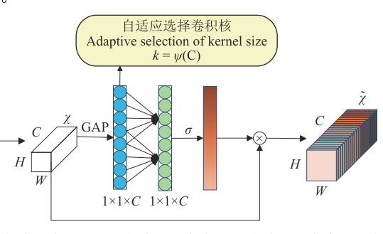

ECA 首先对输入特征图执行全局平均池化，将每个通道的空间信息压缩为单个特征向量，再送入一维卷积层捕捉通道间依赖关系，该一维卷积核大小 $k$ 与特征图通道数 $C$ 的自适应关系如式（1）所示：

$$k = \psi(C) = \left|\frac{\log_2(C)}{\gamma} + \frac{b}{\gamma}\right|_{\text{odd}}$$

该公式涉及的符号及其含义如下表所示：

| 符号 | 含义 |
| --- | --- |
| $k$ | 一维卷积核大小 |
| $C$ | 特征图通道数 |
| $\gamma$ | 超参数，设为 2 |
| $b$ | 超参数，设为 1 |
| $\|\cdot\|_{\text{odd}}$ | 取最近奇数 |

直观上，卷积核大小随通道数自适应增长，无需降维或展平操作即可建立通道间的局部依赖。一维卷积输出再经 Sigmoid 归一化得到各通道注意力权重，与原特征图逐通道相乘以增强重要通道、抑制次要通道；该模块的输出为后续 SPPELAN 模块提供更聚焦的特征表示，是骨干与颈部数据流的第二环改进。

### SPPELAN 多尺度特征融合

SPPELAN 模块的目标是强化多尺度特征均衡提取能力，用于替换原 SPPF 模块以缓解小目标红花局部簇状结构细节丢失的问题，其结构如下图所示。

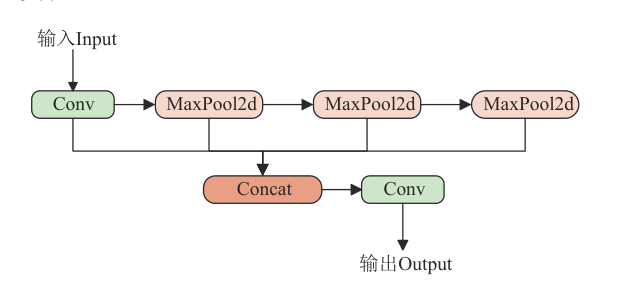

输入特征先经 1×1 卷积统一通道维度生成基础特征，再由 3 个不同池化卷积核大小的最大池化层并行处理，随后将原始基础特征与 3 个池化特征拼接以整合多尺度信息，最后经 1×1 卷积完成特征聚合并将通道数调整至与后续网络匹配的维度。该模块融合了空间金字塔池化的多尺度覆盖能力与高效特征聚合网络的特征整合能力，既保留小目标局部细节又兼顾大目标全局上下文；其输出的多尺度特征送入颈部网络的 C3k2 模块，是颈部数据流的第三环改进。

### C3k2 细节捕捉模块

C3k2 模块的目标是增强对盛花期红花精细轮廓和局部细节特征的快速精准捕捉能力，本文将颈部网络第 15、18 层的 C2f 模块替换为 C3k2 模块，其结构如下图所示。

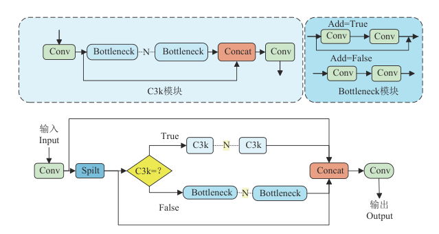

输入特征经 1×1 卷积调整通道数后分为两个并行分支：主分支直接传递基础特征，确保红花原始轮廓等低层级信息不丢失；残差分支进入由 N 个计算单元组成的残差序列，计算单元设"C3k=False"，启用轻量化标准 Bottleneck 单元，并通过 shortcut 跳跃连接将输入与输出特征直接相加，缓解深层训练的梯度消失问题。两个分支的特征在通道维度拼接后，再经 1×1 卷积统一通道数输出。该模块的输出为检测头提供更丰富的细节特征，是颈部数据流的第四环改进。

### Wise-IoUv3 损失函数

Wise-IoUv3 损失的目标是通过精细化误差惩罚机制缓解遮挡场景下的边界框定位误差，用于替换原 YOLOv8n 采用的 CIoU 损失。类间枝叶遮挡与类中花丝重叠易使边界框出现"定位偏移"或"形状偏差"，而 CIoU 损失的计算如式（2）所示：

$$L_{\text{CIoU}} = 1 - \text{IoU} + \frac{\rho^2(b^{pt}, b^{gt})}{d^2} + \alpha v$$

该公式涉及的符号及其含义如下表所示：

| 符号 | 含义 |
| --- | --- |
| $L_{\text{CIoU}}$ | CIoU 损失 |
| $\text{IoU}$ | 预测框与真实框交并比 |
| $b^{pt}$、$b^{gt}$ | 预测框中心点与真实框中心点 |
| $\rho$ | 两个中心点欧氏距离 |
| $d$ | 两个矩形框最小外接矩形对角线长度 |
| $\alpha$ | 平衡参数 |
| $v$ | 高宽比一致性度量 |

CIoU 兼顾重叠度、中心点距离与宽高比，但对宽高比的约束刚性过强，且对高重叠遮挡目标的定位误差惩罚不足。为此 Wise-IoUv3 将边界框回归误差拆解为"位置偏差"与"形状偏差"独立优化，其损失计算如式（3）所示：

$$L_{\text{WIoU}} = r \cdot \exp\left(\frac{(x-x^{gt})^2 + (y-y^{gt})^2}{(H_g^2 + W_g^2)^*}\right) \cdot (1-\text{IoU})$$

其中非单调聚焦系数 $r$ 与离群值 $\beta$ 的计算如式（4）、式（5）所示：

$$r = \frac{\beta}{\delta\alpha^{\beta-\delta}}$$

$$\beta = \frac{(1-\text{IoU})^*}{1-\overline{\text{IoU}}} \in [0, +\infty]$$

上述公式涉及的符号及其含义如下表所示：

| 符号 | 含义 |
| --- | --- |
| $L_{\text{WIoU}}$ | Wise-IoUv3 损失 |
| $(x, y)$、$(x^{gt}, y^{gt})$ | 预测框与真实框中心点坐标 |
| $H_g$、$W_g$ | 预测框与真实框最小外接矩形的高和宽 |
| $*$ | 分离操作 |
| $r$ | 非单调聚焦系数 |
| $\beta$ | 离群值 |
| $\delta$ | 学习参数 |
| $\alpha$ | 原文未单独说明（未获取） |
| $\overline{\text{IoU}}$ | 预测框与真实框交并比的平均值 |

直观上，位置偏差强化中心点微调，形状偏差采用柔性权重约束，配合分离操作使训练初期对小误差宽松惩罚、后期对大误差增强惩罚，将遮挡红花的边界框从枝叶区域调整至实际花体；动态非单调聚焦机制则降低低质量样本的干扰，增强"中度遮挡、主体可见"样本的训练权重。Wise-IoUv3 作为最终的边界框损失指导整个网络的训练优化，是检测数据流的最后一环改进。

## 实验结果

### 实验设置

本文的训练、验证与测试在同一平台完成，输入尺寸 640×640 像素，批大小 16，训练 300 轮，软件环境为 Pytorch 2.6.0 与 Ultralytics 8.3.162。评价指标采用精确率 P、召回率 R、平均精度均值 mAP0.5、参数量、浮点计算量、模型大小与帧率，其中帧率的计算如式（6）所示：

$$\text{FPS} = \frac{1/(T_{\text{pre}} + T_{\text{in}} + T_{\text{post}})}{1000}$$

其中 $T_{\text{pre}}$、$T_{\text{in}}$、$T_{\text{post}}$ 分别表示预处理、推理、后处理耗时，单位为 ms。直观上，帧率由三段耗时之和共同决定。

### 对比实验

本文选取 YOLOv9t、YOLOv10n、YOLOv11n、YOLOv12n 四种主流模型与本领域 9 种相关模型进行性能对比，结果如下表所示。

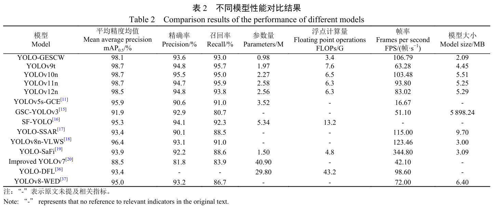

YOLO-GESCW 的参数量较四种主流模型降低约 50.25%~62.02%、浮点计算量降低约 46.0%~55.3%，模型大小仅为 2.09 MB、帧率达 106.79 帧/s，均优于四种主流模型。从表中可以看出，其 mAP0.5 为 98.1%，较四种主流模型与 SF-YOLO 低 1~3 个百分点，其余指标均不低于对比模型，可见轻量化改进以微小精度代价换取了计算规模与检测速度优势，这主要源于 GhostConv 与 ECA 对参数量和计算量的压缩。

### 消融实验

本文以 YOLOv8n 为基准对 5 个改进模块开展逐项与组合消融，结果如下表所示。

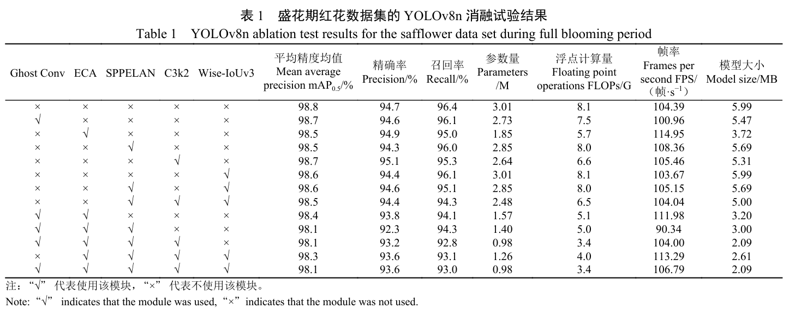

单独引入 Ghost Conv 或 ECA 后参数量与浮点计算量均下降，其中 ECA 替换 C2f 后降幅最大；单独引入 SPPELAN 后 mAP0.5 维持在 98.5%，说明其未增加计算负担；单独引入 C3k2 后精确率达 95.1% 为单模块最优，说明细节提取能力得到增强。5 个模块全部引入后，参数量、模型大小与浮点计算量较 YOLOv8n 分别下降约 67.44%、65.10%、58.02%，mAP0.5 仅下降 0.7 个百分点，帧率提升至 106.79 帧/s，表明各模块在轻量化与检测精度之间取得了较好平衡。

### 速度-精度权衡

本文在 NVIDIA Jetson Xavier NX 上导出 best.pt、best.onnx、best.engine 三种部署文件，在 4 种典型场景下测试帧率与推理耗时，结果如下表所示。

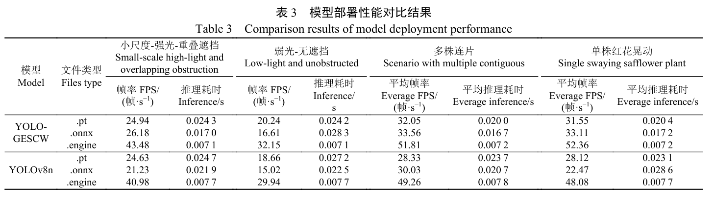

best.engine 文件的检测速度与推理速度最优，单图推理耗时约 0.007 1~0.007 2 s，三种部署文件较 YOLOv8n 分别缩小约 65.1%、66.0%、52.9%。从表中可以看出，小尺度-强光-重叠遮挡等复杂场景下帧率仍保持在 32.15~52.36 帧/s，可见参数量与计算量的下降直接转化为边缘设备上的推理速度收益，TensorRT 加速与 FP16 量化进一步巩固了小体积、高速度的优势。

### 可视化分析

本文在 4 种典型场景下开展定性检测测试，检测效果如下图所示。

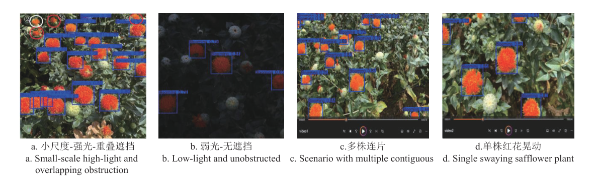

强光重叠场景下模型准确检测 17 朵盛花期红花、错检 0 朵，弱光无遮挡场景下 4 朵目标的置信度均高于 0.65，多株连片与单株晃动视频流中检测框实时跟踪且无帧间丢失，可见模型在复杂田间场景下具备较高的检测可靠性。进一步采用 Grad-CAM 对主干网络第 7、8、9 层进行特征可视化，改进前后模型的热力图对比如下图所示。

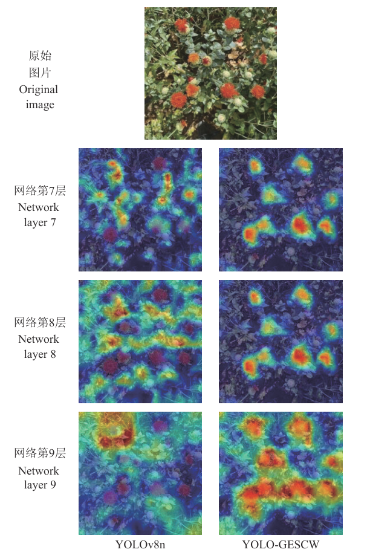

YOLOv8n 第 7 层对目标区域关注度不高、第 8 层关注背景特征、第 9 层仅关注部分目标边缘，而 YOLO-GESCW 各层均更聚焦于盛花期红花目标区域，表明 ECA 等改进增强了模型对目标区域的聚焦能力。

### 跨数据集泛化

本文的全部训练与测试均在自建盛花期红花数据集上完成，公开数据集以及跨地域、跨机型的定量泛化结果未获取。不过图 8 与表 3 覆盖晴天与阴天、遮挡与重叠、多株连片与单株晃动等场景变化，可以看出模型在跨场景条件下保持了稳定的检测性能，可视为泛化能力的间接证据。

### 失败案例与局限性

本文将未参与训练的 757 张测试集图像在 NVIDIA Jetson Xavier NX 上进行部署检测，改进前后的典型样例如下图所示。

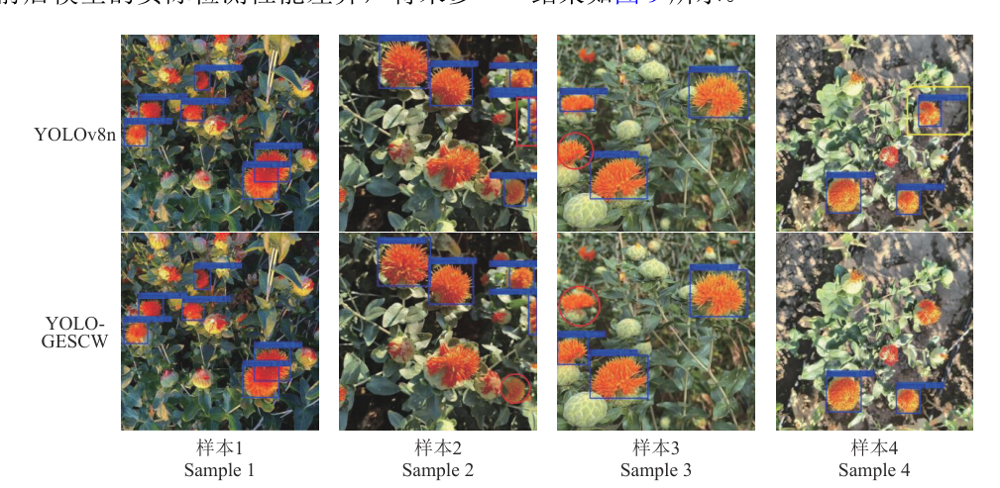

图中红色矩形标记检测框重复、红色圆形标记漏检、黄色矩形标记误检。改进后模型的检测框更贴合目标边缘，改进前模型存在检测框偏移与重复标注现象，可见 Wise-IoUv3 的误差惩罚缓解了遮挡场景下的定位偏差。同时，改进前后模型均存在漏检现象，改进后模型的漏检主要源于目标虚化，且虚化目标的检测效果与置信度低于基线模型，表明远景虚化与严重遮挡是该模型的主要失效场景。

## 优点和创新点

个人认为，本文有如下一些优点和创新点可供参考学习：

1. 从卷积结构、注意力机制、多尺度特征融合、细节捕捉与损失函数 5 个维度协同改进 YOLOv8n，消融试验覆盖单模块与组合增益，各模块对参数量、计算量与精度的贡献清晰可归因。
2. 面向边缘部署完成"训练-导出-加速量化-实测"的完整验证链，best.engine 文件仅 3.48 MB、单株晃动场景平均帧率达 52.36 帧/s，轻量化与实时性的平衡可供参考，工程可用性说服力强。
3. 综合定性检测效果图组、Grad-CAM 热力图与改进前后部署对比三类可视化证据，并对漏检样例给出场景归因，分析直观具体、证据链完整。
4. 数据集覆盖晴天与阴天、顺光侧光逆光、多尺度与遮挡重叠等田间变化，并以亮度、饱和度与高斯噪声增强模拟光照变化与风致模糊，训练数据的多样性为模型的场景适应性提供了支撑。
