# YOLO-Master: MOE-Accelerated with Specialized Transformers for Enhanced Real-time Detection

Paper Reading 是从个人角度进行的一些总结分享，受到个人关注点的侧重和实力所限，可能有理解不到位的地方。具体的细节还需要以原文的内容为准，博客中的图表若未另外说明则均来自原文。

| 论文概况 | 详细 |
| --- | --- |
| 标题 | 《YOLO-Master: MOE-Accelerated with Specialized Transformers for Enhanced Real-time Detection》 |
| 作者 | Xu Lin、Jinlong Peng、Zhenye Gan、Jiawen Zhu、Jun Liu（Xu Lin 与 Jinlong Peng 共同一作） |
| 发表会议 | 未获取（arXiv 预印本，编号 arXiv:2512.23273） |
| 会议等级 | 未获取 |
| 发表年份 | 2025 |
| 论文代码 | github.com/isLinXu/YOLO-Master |

作者单位：

1. Tencent Youtu Lab（腾讯优图实验室）
2. Singapore Management University（新加坡管理大学）

## 研究动机

实时目标检测是计算机视觉的关键任务，表现为在自动驾驶、视频监控与机器人系统中以极低时延完成目标定位与分类，其精度-速度平衡直接决定系统能否落地。YOLO 系列凭借单阶段框架长期主导这一方向，近年的改进也集中在骨干表示增强与颈部多尺度融合两条线上，但是这些架构共享一个根本限制：静态稠密计算，即无论输入复杂与否，所有图像都经过完全相同的网络通路、消耗完全相同的计算预算。于是稀疏大目标的简单场景与密集小目标的复杂场景被一视同仁地处理，既浪费算力又损害特征纯度；计算预算与网络容量在设计期就被固定，面向复杂城区调优的检测器在简单高速场景下过参数化，面向效率调优的检测器又难以应付困难样本。另一条线索上，大语言模型的稀疏激活模式已经证明条件计算能同时提升效率与适应性，但把 MoE 搬到检测这类稠密预测任务仍属空白：分类的路由作用于全局图像表示，而检测要面对多尺度空间特征与变化的目标密度，已有的 ViT 检测器 MoE 尝试又带来不适合实时场景的计算开销。暂未有工作把实例级条件计算引入轻量 CNN 实时检测器，并按输入复杂度动态分配模型容量。

## 文章贡献

针对上述局限，本文提出了 YOLO-Master，一个把混合专家条件计算引入 YOLO 流水线的实时检测框架。其核心是高效稀疏 MoE 块 ES-MoE：轻量动态路由网络按场景复杂度为每个输入动态分配计算资源，训练期以多样性增强目标引导专家专业化，推理期只激活最相关的少数专家。本文首先设计训练期软 Top-K、推理期硬 Top-K 的分阶段路由策略，兼顾梯度连续与真实稀疏；接着以不同感受野的深度可分离卷积构造多尺度专家组，并配以面向检测的负载均衡监督防止专家坍缩；最终在 MS COCO、PASCAL VOC、VisDrone、KITTI 与 SKU-110K 五个基准上完成验证。实验表明，YOLO-Master-N 在 COCO 上以 1.62 ms 延迟取得 42.4% AP，比 YOLOv13-N 高 0.8% mAP 且推理快 17.8%，增益在密集困难场景上最为显著，同时在典型输入上保持实时效率。

## 本文方法

YOLO-Master 建立在 YOLOv12 一类近期 YOLO 架构之上，沿用 Backbone、Neck、Detection Head 的标准设计，并把 ES-MoE 模块同时插入骨干与颈部：在骨干中按目标尺度与场景复杂度动态增强特征提取，在颈部中实现多尺度自适应融合。整体框架如下图所示。

图上方为主干流水线，ES-MoE 以 Conv-ES-MoE-Conv 的形式嵌入骨干与颈部，头部在 P3、P4、P5 三层预测；图下方为 ES-MoE 内部信息流：输入特征先经动态路由网络与 Softmax 门控得到权重，Top-K 选择的专家输出再做加权聚合；图右侧的决策逻辑按运行阶段在 Standard、Soft Top-K（训练）与 Hard Top-K（推理）三种路由策略间切换。下面按模块展开。

### 门控权重与加权聚合

ES-MoE 的目标是把计算资源按输入特征的局部特性与复杂度动态分配给不同专家。给定输入特征图 $X \in \mathbb{R}^{C\times H\times W}$，动态路由网络先提取路由特征，Softmax 门控据此计算每个专家的门控权重：

$$w_i = \frac{\exp(g_i(X))}{\sum_{j=1}^{E} \exp(g_j(X))}, \quad i = 1, 2, \dots, E$$

其中 $g_i(\cdot)$ 为第 $i$ 个专家的门控函数，$E$ 为专家总数。Softmax 把 $E$ 个 logits 归一化为和为 1 的权重分布，各专家的入选权重相互竞争，门控响应高的专家获得更大的聚合系数。按权重选出最高的 top-K 个专家（$K \ll E$ 以保证稀疏激活），其输出经加权聚合得到增强特征图：

$$Y = Norm\Big(\sum_{i \in T_K} w_i \cdot Expert_i(X)\Big)$$

其中 $T_K$ 为 top-K 选中专家的索引集合，$Norm(\cdot)$ 为稳定聚合特征的归一化操作。这等价于让每个空间区域只为自己需要的专家付费，简单区域激活更少专家、复杂区域获得更大模型容量；由于求和只覆盖 $T_K$ 中的 K 个专家，未入选专家对输出没有贡献，稀疏性由此直接进入前向计算。门控权重由输入内容决定，不同输入会激活不同的专家组合，这正是条件计算的含义。聚合输出 $Y$ 送回主干通路继续前传。

### 高效专家组与多感受野

专家网络的目标是在实时约束下提供多样化的特征变换路径。每个专家 $Expert_i$ 以深度可分离卷积 DWconv 为基本构建块替代标准卷积，把空间滤波与通道信息整合解耦：

$$Expert_i(X) = DWconv_{k_i, C_{in} \to C_{out}}(X)$$

其中 $k_i$ 为第 $i$ 个专家的卷积核大小。深度可分离卷积把逐通道的空间滤波与逐点的通道整合分开计算，相对标准卷积显著降低参数量与计算量。借鉴 Inception 的多核思路，专家组配置 $k_i \in \{3, 5, 7, \dots\}$ 等奇数核以覆盖一段感受野谱，路由机制引导下不同专家可被动态激活，使模型在不同空间范围内自适应聚合上下文；由于各专家的有效感受野不同，路由选择同时决定了特征变换的容量与上下文范围。每个专家输出 $Y_i \in \mathbb{R}^{C_{out}\times H\times W}$ 保持与输入相同的空间尺寸，全部专家输出再按路由权重 $\Omega = [\omega_1, \dots, \omega_E]$ 聚合为 $Y_{MoE} = \sum_{i=1}^{E} \omega_i Y_i$。DWconv 的采用保证即使 $E$ 较大，专家网络的总参数量与计算量仍可控，是 YOLO-Master 保持轻量的基础。专家组接收输入特征 $X$ 与路由权重 $\Omega$，输出的 $Y_{MoE}$ 交回主干或颈部的后续卷积，因此 ES-MoE 可以 Conv-ES-MoE-Conv 的形式插入任意位置。

### 轻量门控网络

门控网络的目标是生成激活 $E$ 个专家的原始 logits，且自身不能成为计算瓶颈。为提供对整幅特征图的统一指导，路由权重应来自全局上下文而非局部特征，故先用全局平均池化把输入压缩为紧凑描述子 $P = GAP(X) \in \mathbb{R}^{C\times 1\times 1}$；随后由两层 1×1 卷积（$C_{in} \to C_{red} \to E$）加非线性激活构成参数高效的门控网络，引入通道缩减比 $\gamma = 8$ 定义中间通道数 $C_{red} = \max(C/\gamma, 8)$，计算流为：

$$\Lambda = Conv_{1\times1}^{out=E}\Big(SiLU\big(Conv_{1\times1}^{out=C_{red}}(P)\big)\Big)$$

其中 $\Lambda \in \mathbb{R}^{E\times 1\times 1}$ 为 $E$ 个专家的统一 logits。两层 1×1 卷积构成瓶颈结构，中间通道数 $C_{red}$ 比输入通道小 $\gamma$ 倍，门控自身的参数与计算被约束在很低的量级。生成 logits 的复杂度只取决于通道数 $C$ 与专家数 $E$，与空间尺寸 $H\times W$ 无关，因此骨干与颈部中的高分辨率特征图也不会拖慢路由决策。logits 随后交给分阶段路由策略消费。

### 分阶段路由策略

分阶段路由的目标是训练期保证专家充分学习、推理期强制严格稀疏激活。门控网络输出 logits $\Lambda$ 后先经 Softmax 得到初始权重 $\Omega'$；训练模式采用 Soft Top-K：先取 $\Omega'$ 中 top-K 的索引集 $I_K$ 构造二值硬掩码 $M_K$（$i \in I_K$ 记 1，否则记 0），再逐元素相乘并重归一化：

$$\Omega_{train} = \frac{\Omega' \odot M_K}{\sum_{j=1}^{E} (\Omega')_j \odot (M_K)_j + \epsilon}$$

推理模式采用 Hard Top-K：直接对 top-K 个 logits 做 Softmax，其余 $E-K$ 个专家权重严格置零：

$$\Omega_{infer,i} = \begin{cases} \dfrac{\exp(\Lambda_i)}{\sum_{j \in I_K} \exp(\Lambda_j)}, & i \in I_K \\ 0, & \text{otherwise} \end{cases}$$

| 符号 | 含义 |
| --- | --- |
| $\Omega'$ | logits 经 Softmax 后的初始权重 |
| $M_K$ | 由 top-K 索引集构造的二值硬掩码 |
| $\epsilon$ | 防止除零的极小值 |
| $\Omega_{train}$、$\Omega_{infer}$ | 训练与推理模式下的最终路由权重 |

模型按 self.training 标志在两者间动态切换，两条路由权重按运行模式的选择形式化为：

$$\Omega = \begin{cases} \Omega_{train}, & \text{Training} \\ \Omega_{infer}, & \text{Inference} \end{cases}$$

其中 $\Omega_{train}$ 与 $\Omega_{infer}$ 分别是训练与推理模式下的路由权重。输出的 $\Omega$ 正是专家组聚合所需的路由权重，训练期经 $\Omega'$ 保留权重对 logits 的连续梯度，推理期只真实调用 K 个专家模块。给出一个简单的例子，假设 $E=4$、$K=2$、$\Lambda = (2.0, 1.0, 0.5, 0.2)$，则 $\Omega' \approx (0.569, 0.209, 0.127, 0.094)$，top-2 索引为前两位，重归一化后 $\Omega_{train} \approx (0.732, 0.268, 0, 0)$；Hard Top-K 只对前两个 logits 做 Softmax，得 $\Omega_{infer} \approx (0.731, 0.269, 0, 0)$。可以看到，两种模式的权重数值接近，但训练期权重经由 $\Omega'$ 保持对 logits 的连续梯度，推理期则只真实调用 2 个专家、实现 50% 稀疏，从而在真实硬件上获得加速。

### 损失函数设计

损失函数的目标是在保证检测精度的同时纠正 MoE 训练中的专家利用不均衡。总损失为标准 YOLOv8 检测损失与负载均衡损失之和：$L_{Total} = L_{YOLO} + \lambda_{LB} \cdot L_{LB}$，其中检测损失沿用分类、定位与 DFL 三分量之和 $L_{YOLO} = L_{cls} + L_{loc} + L_{DFL}$。负载均衡损失针对专家坍缩问题——路由网络倾向于把多数输入分给少数初始化更好的专家——它惩罚每个专家的平均利用频率 $\mu_i$ 与理想均匀分布 $1/E$ 的偏差。平均利用频率的定义如下：

$$\mu_i = \mathbb{E}\left[\frac{\sum_{h=1}^{H}\sum_{w=1}^{W}(\Omega_{train})_{i,h,w}}{\sum_{j=1}^{E}\sum_{h=1}^{H}\sum_{w=1}^{W}(\Omega_{train})_{j,h,w}}\right]$$

其中 $(\Omega_{train})_{i,h,w}$ 为第 $i$ 个专家在空间位置 $(h,w)$ 处的训练路由权重，$\mathbb{E}[\cdot]$ 表示对当前 batch 求平均。直观上，$\mu_i$ 就是第 $i$ 个专家在全部空间位置上分到的路由权重占比。负载均衡损失对该占比与均匀分布的偏差采用均方误差形式：

$$L_{LB} = \frac{1}{E} \sum_{i=1}^{E} \Big(\mu_i - \frac{1}{E}\Big)^2$$

其中 $\lambda_{LB} > 0$ 为控制负载均衡项贡献的超参数。最小化 $L_{LB}$ 使训练期全部 $E$ 个专家都被充分利用，增强整体泛化与鲁棒性；而推理期的硬 Top-K 仍保持真实稀疏，训练期的均匀监督与部署期的稀疏激活互不冲突。该损失只作用于训练期路由权重 $\Omega_{train}$，监督门控与路由网络的学习过程，不改变专家结构。

## 实验结果

### 实验设置

实验覆盖五个基准，规模与类别数如下表所示。

| 数据集 | 训练规模 | 类别数 |
| --- | --- | --- |
| MS COCO 2017 | 118k 图 | 80 |
| PASCAL VOC 2007+2012 | 16.5k 图 | 20 |
| VisDrone-2019 | 6.5k 图 | 10 |
| KITTI | 7.5k 图 | 3 |
| SKU-110K | 8.2k 图 | 1 |

基线为 YOLOv12-Nano（宽度缩放 0.5）并集成 MoE 模块；全部模型在 640×640 分辨率下训练 600 个 epoch，SGD 优化器配余弦学习率调度，总 batch size 256，增强含 Mosaic（p=1.0）、Copy-Paste（p=0.1），Nano 变体关闭 MixUp。指标为 mAP50:95 与 mAP50；效率指标报告激活 K 个专家后的参数量、延迟与 FPS，按 YOLOv12 基线的标准硬件配置以 FP16、batch size 1 测量。

### 对比实验

四个典型困难场景的定性对比如下图所示，列从左到右为 YOLOv10-N、YOLOv11-N、YOLOv12-N、YOLOv13-N 与 YOLO-Master-N。

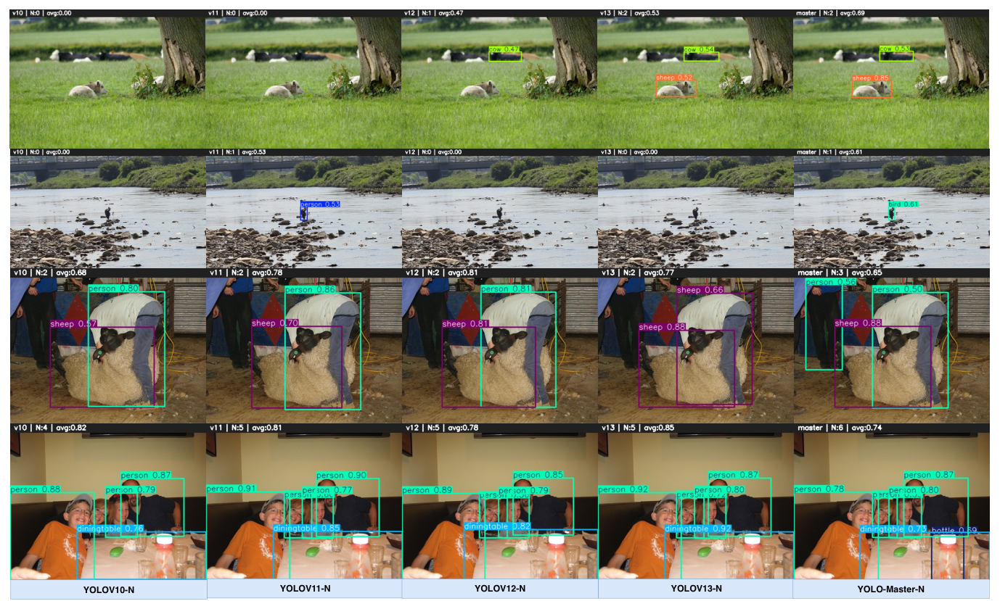

第一行草地上的远处小动物，v10 与 v11 完全漏检，v12 以 0.47 的低置信度检出、v13 提升到 0.53，YOLO-Master-N 以 0.65 到 0.82 的置信度准确定位；第二行海岸礁石旁的遮挡人物，仅 v11 与本文方法检出，本文定位更准；第三行剪羊毛的重叠场景，本文平均置信度 0.85 对 v13 的 0.77；第四行餐桌密集物体，早期版本漏掉大量小件，本文以 0.87 到 0.97 的置信度完整覆盖。可见尺度自适应的专家路由在小目标、遮挡与密集场景上收益最明显。五基准的定量主对比如下表所示。

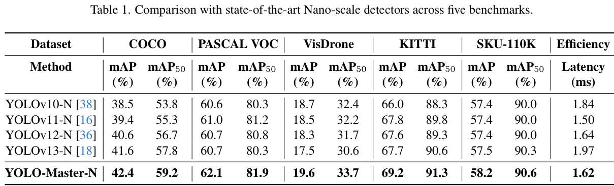

YOLO-Master-N 在五个基准上全部领先，相对 YOLOv13-N 的 mAP 增益为 +0.8（COCO）、+1.4（VOC）、+2.1（VisDrone）、+1.5（KITTI）、+0.7（SKU-110K），其中 VisDrone 与 KITTI 增益最大，印证了面向小目标与精确定位的设计；在平均每图 147 个对象的 SKU-110K 上取得 58.2% mAP，证明拥挤场景下的有效性。精度-延迟权衡如下图所示。

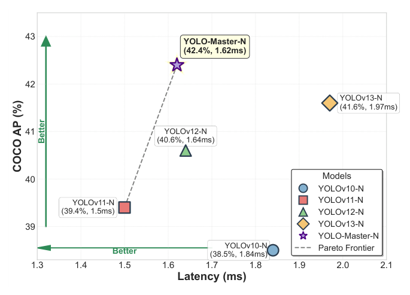

YOLO-Master-N 以 42.4% AP 与 1.62 ms 延迟落在 Pareto 前沿上：比 YOLOv13-N 快 18%，仅比最快的 YOLOv11-N 慢 8%，在提升精度的同时保持了效率-精度平衡。

### 下游任务泛化

把消融得到的最优配置扩展到分类与分割后，跨任务结果如下表所示。

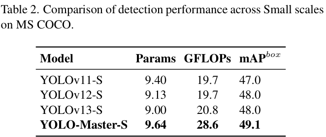

检测侧 YOLO-Master-S 以 9.64 M 参数取得 49.1% mAP box，刷新 small 规模纪录。分类侧如下表所示。

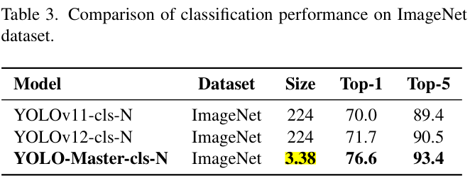

YOLO-Master-cls-N 在 ImageNet 上取得 76.6% Top-1 与 93.4% Top-5，比 YOLOv11 与 YOLOv12 分别高 6.6% 与 4.9%，说明骨干特征表示足够强。分割侧如下表所示。

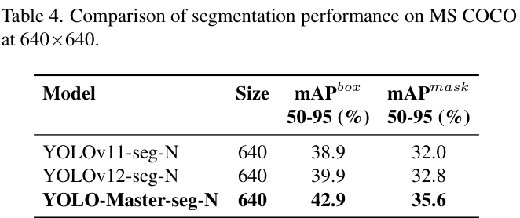

YOLO-Master-seg-N 的 mAP mask 达到 35.6%，比 YOLOv12-seg-N 高 2.8%，定位与掩码预测同时改善。可见条件计算带来的增益不局限于检测单一任务。

### 消融实验

ES-MoE 插入位置的消融如下表所示。

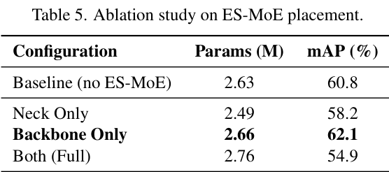

仅插入骨干取得最佳的 62.1% mAP（2.66 M 参数），比基线 60.8% 高 1.3%；仅插入颈部反而掉到 58.2%，因为缺乏骨干多样化输入时路由无法有效专业化；骨干与颈部同时插入更是崩到 54.9%，论文归因于级联路由机制在反传时产生冲突梯度。可见更多 ES-MoE 并不保证更好性能，谨慎放置是必要的设计原则，故默认只插骨干。专家数量的消融如下表所示。

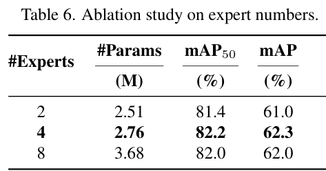

4 个专家以 2.76 M 参数取得最佳的 62.3% mAP 与 82.2% mAP50；2 个专家容量不足掉 1.3%，8 个专家参数增加 33% 却无增益，表明中等专家多样性已足够。Top-K 选择的消融如下表所示。

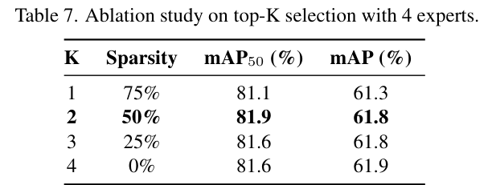

K=2 在 50% 稀疏度下取得最佳 61.8% mAP，K=1 容量不足掉 0.5%，K=3、4 无进一步提升，与视觉任务中 K=2 之后收益递减的 MoE 文献结论一致。损失配置的消融如下表所示。

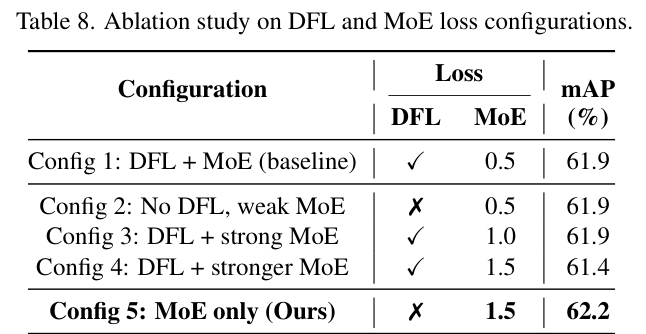

完全移除 DFL、只保留权重 1.5 的 MoE 损失（Config 5）取得最佳 62.2% mAP，而 DFL 与强 MoE 损失并存的 Config 4 只有 61.4%；论文假设两者梯度冲突——DFL 强制均匀的分布细化，MoE 损失鼓励实例自适应的专家专业化——移除 DFL 后冲突消失，MoE 损失同时接管回归与专家专业化 的引导。

### 可视化分析

五种损失配置的训练动态如下图所示，六个子图分别给出 DFL 损失、MoE 损失、验证 mAP、总损失、MoE 损失演化与 mAP 收敛曲线。

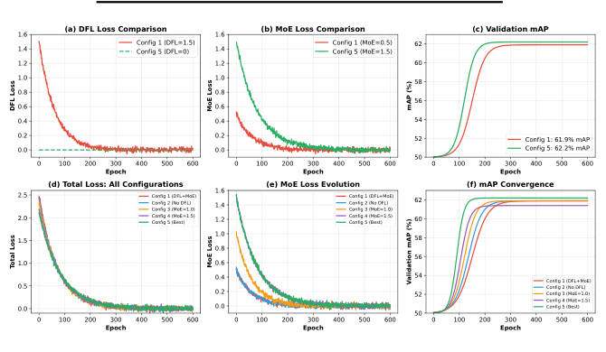

Config 4（DFL + MoE λ=1.5）的 MoE 损失曲线出现剧烈振荡，而 Config 5（仅 MoE）平滑收敛，验证 mAP 曲线也稳定爬升到 62.2%，高于 Config 1 的 61.9%。可见损失项之间的梯度竞争会直接反映在训练曲线上，为「MoE 损失可以取代 DFL 角色」这一结论提供了过程性证据。

## 优点和创新点

个人认为，本文有如下一些优点和创新点可供参考学习：

1. 把实时检测的静态稠密计算改造成实例级条件计算，训练期软 Top-K 保梯度、推理期硬 Top-K 保真实稀疏，用分阶段路由同时拿到优化稳定与部署加速。
2. 以面向检测的负载均衡损失防止专家坍缩，并通过位置消融给出「骨干颈部同时插入反而退化」的负面结论与梯度冲突归因，设计原则清晰可信。
3. 实验丰富、说服力强：五个基准一致提升且增益集中在 VisDrone 等密集小目标场景，并扩展到分类与分割验证架构通用性，定性图组与训练曲线互相印证。
