# 自然光环境下番茄穴盘苗缺苗检测的 YOLO-SFEP 模型

Paper Reading 是从个人角度进行的一些总结分享，受到个人关注点的侧重和实力所限，可能有理解不到位的地方。具体的细节还需要以原文的内容为准，博客中的图表若未另外说明则均来自原文。

| 论文概况 | 详细 |
| --- | --- |
| 标题 | 《自然光环境下番茄穴盘苗缺苗检测的 YOLO-SFEP 模型》 |
| 作者 | 张聪华、任玲（通信作者）、崔建谱、杨苗、张玉泉、朱祥建、刘军平 |
| 发表期刊 | 农业工程学报，2025，41(22)：215-225 |
| 期刊等级 | 未获取 |
| 发表年份 | 2025 |
| 论文代码 | 未获取 |

作者单位：

1. 石河子大学机械电气工程学院
2. 农业农村部西北农业装备重点实验室
3. 现代农业机械兵团重点实验室

## 研究动机

番茄穴盘苗缺苗检测是温室智能移栽中的重要问题，表现为需要在育苗早期快速定位密集穴盘中缺苗的穴孔，为后续补栽与移栽提供位置信息，漏检会导致大田移栽时漏栽，直接影响幼苗生长的一致性与作物产量。目前该工序主要依赖人工目检，不仅效率低、耗费人力，且准确性易受个人经验等主观因素影响，难以满足大规模番茄种植的需求。现有的自动检测方法历经两个发展阶段，但各有局限：传统图像处理方法多依赖颜色空间转换与阈值分割，然而温室自然光强度的变化会引起幼苗叶片颜色特征改变，固定阈值无法自适应调整，容易造成误检与漏检，检测稳定性不高；深度学习检测模型虽能显著提升精度，但计算复杂度也相应上升，通常依赖高性能 GPU 推理，而实际生产受成本与部署条件限制，多采用计算资源有限的边缘计算设备，难以直接落地。因此，暂未有检测模型能在温室番茄穴盘苗缺苗检测任务上同时兼顾小目标检测能力、光照鲁棒性、轻量化与训练性能这四个要求。

## 文章贡献

针对上述问题，本文提出了基于改进 YOLOv8n 的番茄穴盘苗缺苗检测模型 YOLO-SFEP，以提高密集穴盘苗缺苗小目标的检测能力、增强光照鲁棒性、缩减模型计算规模并优化训练性能。其核心是四项改进的组合：首先结合空间到深度卷积 SPDConv 与 Omni-Kernel 模块构建小目标改进网络 SION，优化 P3 检测层，把富含细节的 P2 层特征融合进来以增强小目标检测能力；接着在颈部网络加入高效多尺度注意力机制 EMA，使模型聚焦缺苗区域、抑制复杂光照条件的干扰；然后采用 FasterNet 网络中的 FasterNet Block 替换 C2f 模块内的 Bottleneck，构建 CFNB 模块实现轻量化；最终把 CIoU 损失函数替换为 PIoU，通过惩罚因子适应目标大小，优化收敛效果。实验表明，模型的精确率达 96.7%，较基准提升 2.4 个百分点，参数量与计算量仅为 2.62 M 和 7.6 G，部署到树莓派 5 后检测帧率达 13.8 帧/s，满足缺苗检测的边缘端实时性要求。

## 本文方法

### 整体架构

YOLO-SFEP 以 YOLOv8 系列中尺度最小的 YOLOv8n 为基准模型，保留 Backbone、Neck 与 Head 的三段式结构，改进集中在小目标检测层、注意力机制、模块轻量化与损失函数四处。改进后的整体网络结构如下图所示。

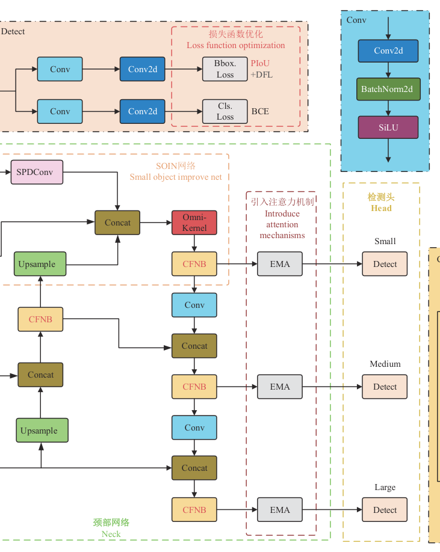

图中 P1～P5 分别为输入图像经 2 倍、4 倍、8 倍、16 倍和 32 倍下采样后的特征图，各改进组件的功能如下表所示。

| 组件 | 改进模块 | 功能 |
| --- | --- | --- |
| Backbone | CFNB（FasterNet Block 替换 C2f 内的 Bottleneck） | 轻量化地提取多层次缺苗特征 |
| Neck | SION（SPDConv + Omni-Kernel）与 EMA 注意力 | 融合 P2 层细节特征，抑制光照干扰 |
| Head | Anchor-free 解耦检测头 | 直接预测目标边界框与类别 |
| Loss | PIoU + DFL 与 BCE | 优化回归收敛，保留分布焦点损失与分类损失 |

骨干输出的多尺度特征经颈部上采样与 Concat 融合，P3 层在 SION 与 EMA 处理后送入对应检测头，输出缺苗检测框并由 PIoU 计算回归损失。下面按数据流依次介绍各模块。

### 小目标检测层优化：SION

SION（small object improve net）的目标是解决缺苗穴孔特征经深层网络多次下采样后细节丢失严重的问题，在不直接添加 P2 检测层的前提下提升小目标检测能力。原始 YOLOv8n 采用 P3、P4、P5 三个检测头，对应特征图的下采样倍数分别为 8、16 和 32，适用于中等及以上尺寸目标；而缺苗穴孔属于小目标，常规做法是增加 P2 检测层，但这会显著增加计算复杂度与后续处理难度。SION 改用空间到深度卷积 SPDConv 对富含细节的 P2 层特征进行压缩与编码，再把所得特征融合至 P3 层，随后用 Omni-Kernel 模块对融合后的多尺度特征进行高效整合。Omni-Kernel 模块的结构如下图所示。

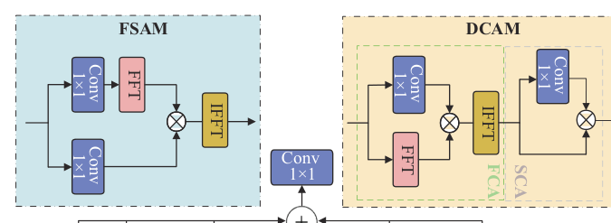

Omni-Kernel 含全局（Global）、大核（Large）与局部（Local）三个分支，分支内用深度可分离卷积（DConv）组合 1×1、31×1、31×31 与 1×31 等形状的卷积核，并借助快速傅里叶变换 FFT 及其逆变换 IFFT 引入频率通道注意力 FCA 与空间通道注意力 SCA。三分支协同学习从全局上下文到局部细节的特征表征，显著增强对微小缺苗目标的检测能力。SION 的输出送往颈部的 EMA 注意力模块做后续处理。

### EMA 高效多尺度注意力机制

EMA（efficient multi-scale attention）机制的目标是提升光照鲁棒性，使模型准确聚焦缺苗区域并抑制背景噪声，它被添加在颈部网络中。其双路径优化体现在：一方面增强全局上下文建模能力，精准区分缺苗区域与背景噪声，减少无效特征干扰；另一方面动态调整通道权重，优先强化含缺苗关键信息的通道响应，弱化光照变化引发的冗余特征影响。EMA 模块的网络结构如下图所示。

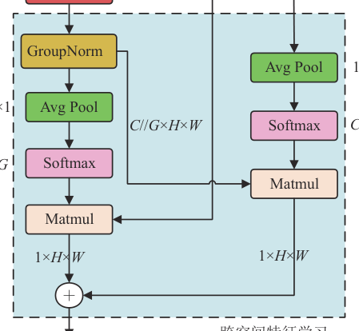

具体流程上，首先把输入特征图 $X \in \mathbb{R}^{C \times H \times W}$ 按通道维度划分为 $G$ 个独立分组，每组包含 $C' = C//G$ 个通道，即：

$$X = [X_0, X_i, \ldots, X_{G-1}]$$

其中 $X_i \in \mathbb{R}^{C' \times H \times W}$ 为分组后的子特征图。该操作既降低计算开销，又使模型聚焦不同分组的特征差异，提升多尺度特征表征能力。

接着对每个子特征图分别执行水平与垂直方向的一维全局平均池化，X 方向池化计算为：

$$X_{i,X\text{-}avg} = \frac{1}{W} \sum_{i=1}^{W} X_i$$

其中 $W$ 为特征图宽度，输出维度为 $C' \times 1 \times W$；Y 方向池化同理提取每列全局信息，输出维度为 $C' \times H \times 1$。这等价于用两条一维路径分别保留水平与垂直方向的空间全维信息。

双向池化结果融合后形成包含空间全维度信息的特征向量，经卷积层生成注意力权重，并通过跨空间学习进一步校准；最后用权重对原始子特征图加权增强，融合所有分组特征输出最终增强特征图。该过程既保留原始特征细节，又强化了缺苗特征的辨识度，EMA 的输出继续送往颈部后续的融合与检测层。

### 模型轻量化设计：CFNB

CFNB 的目标是在保障检测精度的前提下精简参数量与计算量，适配树莓派等边缘计算设备的资源约束。原始 YOLOv8n 中 C2f 模块的 Bottleneck 组件存在计算冗余，本文用 FasterNet 网络的 FasterNet Block 替换它，并把原网络中所有 C2f 模块全量替换，构成 CFNB 模块。FasterNet Block 的结构及 PConv 原理如下图所示。

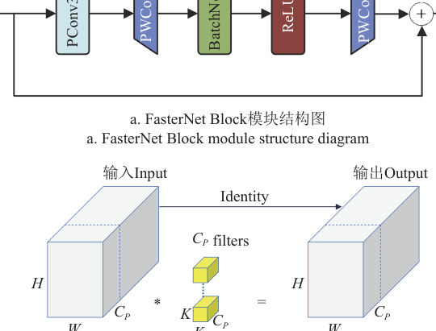

FasterNet Block 由部分卷积 PConv、逐点卷积 PWConv 以及标准化层与激活层构成，其核心 PConv 仅对输入通道的一部分应用常规卷积，其余通道保持不变，计算量为：

$$\mathrm{FLOPs_{PConv}} = H \cdot W \cdot K^2 \cdot C_p^2$$

其中 $H$、$W$ 为特征图的高和宽；$K$ 为卷积核大小；$C_p$ 为参与 PConv 计算的通道数。当 $C_p = C/4$ 时，PConv 的计算量只有常规卷积的 1/16。给出一个简单的例子，假设 $C = 64$、$K = 3$、$H = W = 40$：1. PConv 取 $C_p = 16$，计算得 $40 \times 40 \times 9 \times 16^2 = 3\,686\,400$；2. 常规卷积对全部 64 个通道计算，得 $40 \times 40 \times 9 \times 64^2 = 58\,982\,400$；3. 二者之比恰为 $(16/64)^2 = 1/16$。可以看到，PConv 利用特征图通道间的冗余性，以极小的精度代价换取计算负载的大幅下降。

此外 PConv 的内存访问次数也更少，其计算式为：

$$H \cdot W \cdot 2C_p + K^2 \cdot C_p^2 \approx H \cdot W \cdot 2C_p$$

当 $C_p = C/4$ 时，内存访问次数只有常规卷积的 1/4。其后附加的 PWConv 用于融合所有通道的信息，PConv 与 PWConv 的组合形成类似 T 型卷积的高效感受野，更专注于中心位置的特征聚合。CFNB 的输出与原始 C2f 一致，送往下一卷积或融合层，为边缘设备上的实时检测奠定基础。

### 损失函数优化：PIoU

YOLOv8n 原采用的 CIoU 损失虽考虑了中心点距离与宽高比，但难以准确反映预测框与真实框之间的整体形状差异，易导致训练收敛不稳定，限制检测精度提升。本文引入 PIoU（powerful-IoU）损失优化回归过程，其核心原理如下图所示。

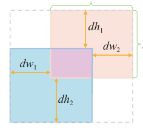

PIoU 在 IoU 基础上引入形状惩罚因子 $PF$，通过计算预测框与目标框四边绝对距离之和与其对应目标框宽高的比值来衡量形状差异，计算为：

$$PF = \left( \frac{\mathrm{d}w_1}{w_{gt}} + \frac{\mathrm{d}w_2}{w_{gt}} + \frac{\mathrm{d}h_1}{h_{gt}} + \frac{\mathrm{d}h_2}{h_{gt}} \right) \Big/ 4$$

其中 $\mathrm{d}w_1$、$\mathrm{d}w_2$、$\mathrm{d}h_1$、$\mathrm{d}h_2$ 分别为预测框和目标框对应边之间距离的绝对值，$w_{gt}$ 和 $h_{gt}$ 分别表示目标框的宽度和高度。同时 PIoU 通过梯度调整函数 $f(x) = 1 - e^{-x^2}$ 依据预测框质量进行动态梯度分配：对低质量预测框抑制有害梯度，对中等质量预测框加速回归，对高质量预测框稳定优化过程。PIoU 值及其损失函数定义如下：

$$PIoU = IoU - f(PF), \quad -1 \le PIoU \le 1$$

$$L_{PIoU} = 1 - PIoU = L_{IoU} + f(PF), \quad 0 \le L_{PIoU} \le 2$$

其中 $L_{IoU}$ 为 IoU 损失。直观上，该自适应梯度机制缓解了预测框扩大问题，既加快收敛又增强训练稳定性。PIoU 只替换检测头中的回归损失分支，分类仍用 BCE 损失并保留 DFL 分布焦点损失。

## 实验结果

### 实验设置

数据集以苗龄 20 d 的新疆新红 49 号番茄穴盘苗为对象，图像于 2024 年 4 月上旬和 2025 年 3 月下旬在石河子大学农试场培育基地的温室大棚采集，设备为 Canon EOS 600D 相机，分辨率 5 184×3 456 像素。为覆盖温室内自然光的显著时段性变化，采集在早上、中午及下午等不同时段进行，试验区域及番茄穴盘苗样例如下图所示。

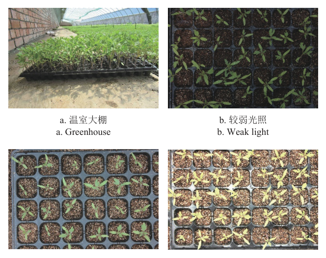

图中给出了温室大棚场景与较弱光照、正常光照、较强光照三种条件下的穴盘苗图像，据此筛选构建出较弱光照 360 张、正常光照 380 张及较强光照 360 张的原始数据集。图像经裁剪统一尺寸，每张包含 24 个穴孔且至少含一个缺苗穴孔；研究采用单类别检测，仅标注缺苗穴孔（类别标记为 none）并用 LabelImg 绘制边界框。为提升泛化能力，再经随机翻转、裁剪、高斯模糊及亮度与色彩调整等变换扩充数据，增强效果如下图所示，最终构建的数据集共 7 700 张图像，按 8:1:1 随机划分为训练集、验证集与测试集。

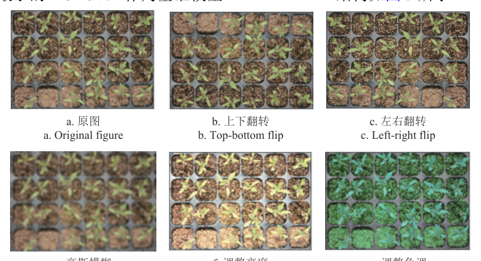

图中展示了上下翻转、左右翻转、裁剪、高斯模糊、调整亮度与色调等变换生成的增强样例，为模型提供了多尺度、多视角和不同光照条件的训练样本。模型训练与评估均在配备 NVIDIA GeForce RTX 3060 Laptop GPU 的设备上完成，试验环境配置如下表所示。

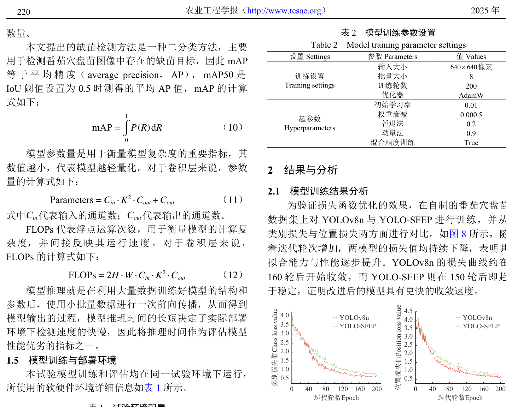

表中列出了 GPU、CPU、显存、内存、操作系统、CUDA 与深度学习框架等软硬件环境。训练参数设置如下表所示。

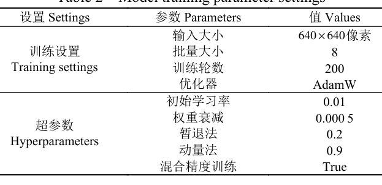

训练采用 640×640 像素输入、批量大小 8、训练轮数 200、AdamW 优化器，初始学习率 0.01、权重衰减 0.0005、暂退法 0.2、动量法 0.9，并启用混合精度训练。评价指标为精确率 P、召回率 R 与平均精度均值 mAP50（单类别检测下 mAP 等于 AP），以及参数量、FLOPs、模型大小与推理时间。

### 训练收敛性分析

为验证损失函数优化效果，本文对比了 YOLOv8n 与 YOLO-SFEP 的训练过程，类别损失与位置损失的变化曲线如下图所示。

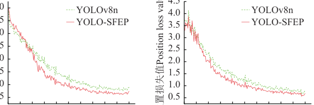

随迭代轮次增加，两模型损失值均持续下降；YOLOv8n 的损失曲线约在 160 轮后开始收敛，而 YOLO-SFEP 在 150 轮后即趋于稳定，且收敛时类别损失与位置损失值均更小，表明改进后的模型收敛速度更快，分类性能与定位能力更好。

### 消融实验

本文对 SION、CFNB、EMA 与 PIoU 四项改进依次叠加进行消融试验，结果如下表所示。

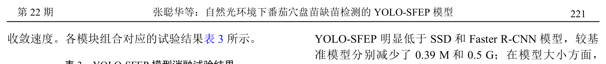

由表可见，优化小目标检测层后精确率从基准的 94.3% 升至 97.8%，mAP50 提升 2.4 个百分点，代价是参数量与计算量升至 3.31 M 和 11.8 G；替换 CFNB 后参数量较上一组减少 0.7 M、计算量减少 3.2 G，实现轻量化；引入 EMA 后在参数量与计算量基本不变的同时取得更高检测精度；最后替换 PIoU，精确率与 mAP50 进一步升至 96.7% 和 97.9%。这说明四项改进分别在检测精度、轻量化、光照干扰抑制与收敛优化上贡献增益，改进后的模型能在保持较高检测精度的同时降低计算成本，适合边缘设备部署。

### 不同目标检测模型性能对比

为研究 YOLO-SFEP 与其他检测模型的差异，本文选取 SSD、Faster R-CNN、YOLOv5n、YOLOv6n、YOLOv8n、YOLOv10n 与 YOLOv11n 等常见目标检测模型开展对比试验，结果如下表所示。

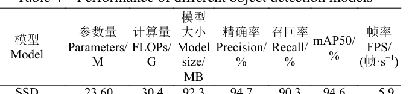

YOLO-SFEP 的精确率、召回率与 mAP50 分别达 96.7%、98.8% 和 97.9%，均为表中最高，较基准 YOLOv8n 分别提升 2.4、2.1 和 1.7 个百分点；参数量与计算量较基准分别减少 0.39 M 和 0.5 G，模型大小仅 5.5 MB，帧率达 128 帧/s，同样高于其他模型。可见 YOLO-SFEP 实现了检测精度与速度的同步提升，可以满足番茄穴盘苗缺苗检测的精度和实时性要求。

### 不同光照强度下的检测结果

用照度计测得温室内自然光光照强度范围为 500～80 000 lx，研究将其划分为弱光（500～5 000 lx）、中光（5 000～50 000 lx）与强光（5 000～80 000 lx）三档分别测试，结果如下表所示。

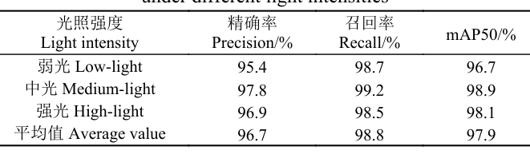

模型在中光下取得最优性能，精确率、召回率与 mAP50 分别达 97.8%、99.2% 与 98.9%；强光下过曝掩盖了部分缺苗区域的边缘细节，召回率略降至 98.5%；弱光下低对比度环境使部分背景被误判为缺苗，精确率降至 95.4%，但召回率仍保持 98.7%，表明模型对自然光变化具有良好适应性。可视化对比上，弱光下部分对比模型因叶片与基质特征相似而把正常穴孔误判为缺苗，强光下过曝导致其漏检，而 YOLO-SFEP 均未出现此类问题且检测置信度普遍更高，验证了注意力机制的有效性。

### 可视化分析

本文采用 HIResCAM 算法对改进前后模型的决策过程进行可视化，热力图直观反映模型对图像不同区域的关注程度，红黄色为高度关注、蓝色为关注较低，对比结果如下图所示。

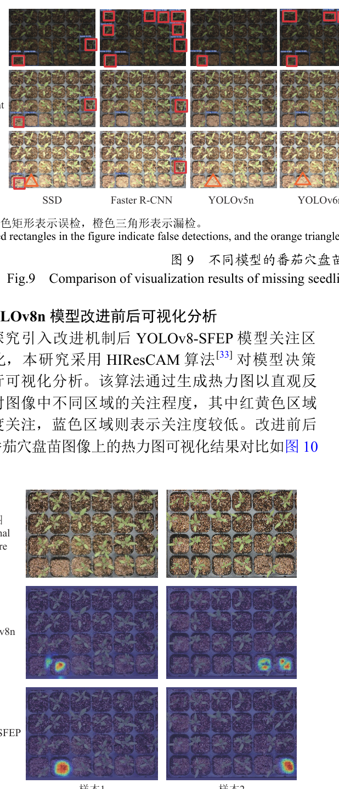

YOLOv8n 的热力图显示其注意力过度集中于穴孔中心区域，并明显受到穴孔边缘干扰，穴盘苗倾斜或相邻穴孔幼苗存在时易导致误判；YOLO-SFEP 的热力图则更精准地聚焦于实际缺苗区域，有效抑制了非关键背景特征的干扰，表明其学习到更具判别力的特征信息。

### 边缘端部署与验证

为评估边缘设备上的实际性能，本文将训练完毕的 PyTorch 权重转换为 ONNX 格式，进而转化为 NCNN 格式，把 YOLOv8n 与 YOLO-SFEP 分别部署在搭载 2.4 GHz 四核 Cortex-A76 处理器与 4 GB 运行内存的树莓派 5 上测试，性能对比如下表所示。

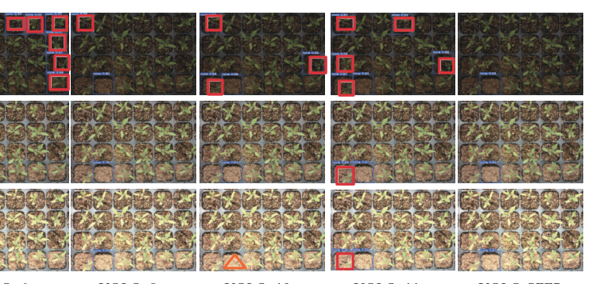

YOLO-SFEP 在树莓派 5 上的检测精确率达 96.1%，较 YOLOv8n 提升 2.5 个百分点；单张图像平均推理时间仅 74.3 ms，缩短 12.2 ms，检测帧率提升至 13.8 帧/s；NCNN 模型体积减少 2.7 MB，降低了边缘设备的运行负载。实际缺苗检测的可视化结果如下图所示。

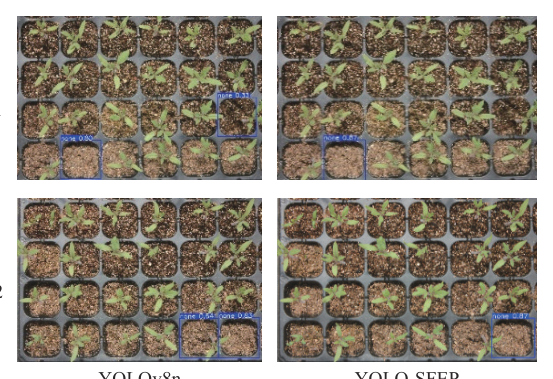

YOLOv8n 有小概率把穴盘孔中存在倾斜的穴盘苗误判为缺苗，YOLO-SFEP 则能正确判断缺苗情况，且实际缺苗位置的预测框置信度由 0.80 提高到 0.87，说明该模型平衡了树莓派 5 上的检测精度与速度，更适用于实时缺苗检测任务。

## 优点和创新点

个人认为，本文有如下一些优点和创新点可供参考学习：

1. 小目标检测层优化没有直接添加 P2 检测头，而是用 SPDConv 压缩 P2 层特征融合进 P3 层，再以 Omni-Kernel 三分支协同整合，把精确率提升 3.5 个百分点，设计思路可供参考。
2. 用 FasterNet Block 替换 C2f 内的 Bottleneck，借助 PConv 只计算部分通道的特性把参数量与计算量分别压低 0.7 M 和 3.2 G，是一条可复用的轻量化路线，工程实用性强。
3. 实验覆盖逐项消融、多模型对比、三档光照鲁棒性测试与 HIResCAM 热力图归因，并完成树莓派 5 的 NCNN 部署验证，形成「改进-验证-部署」的完整证据链，说服力强。
