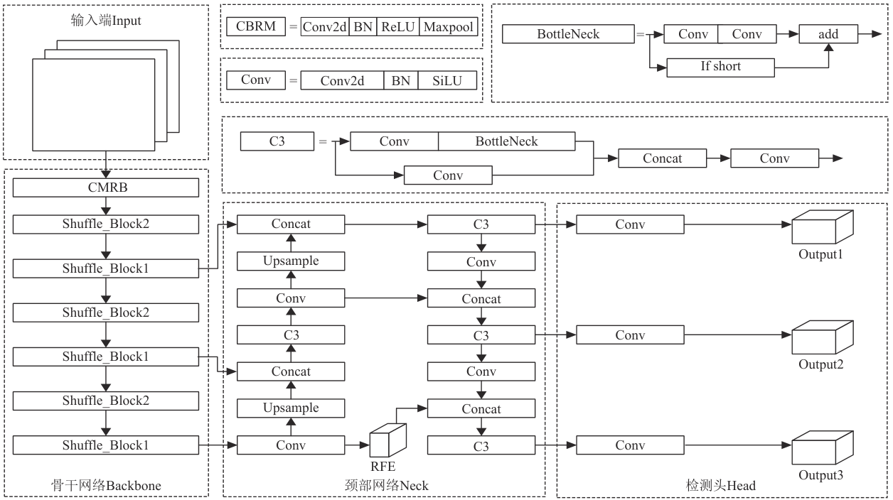
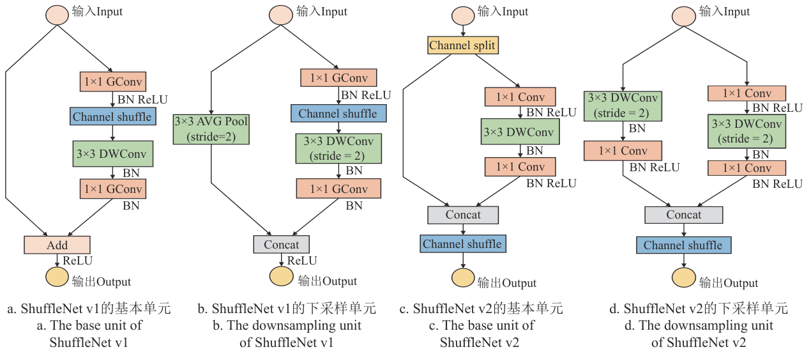
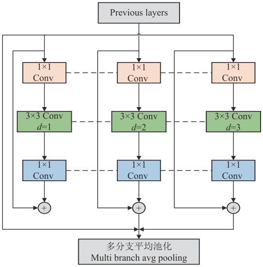
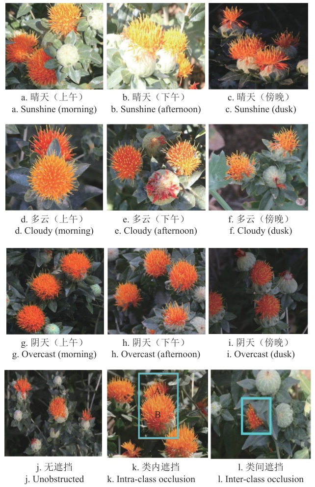
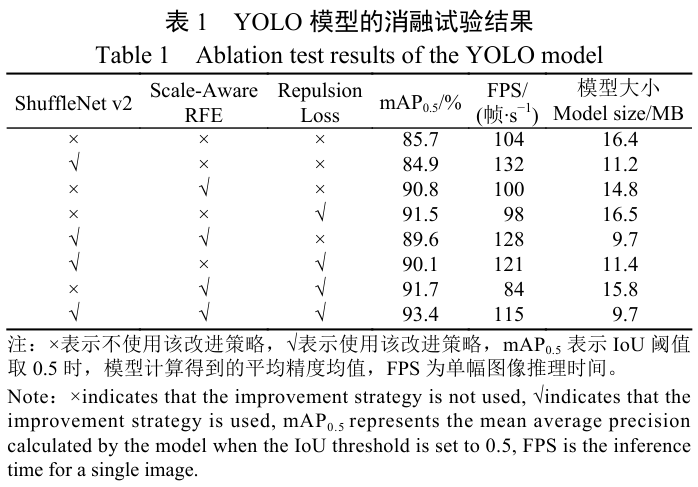
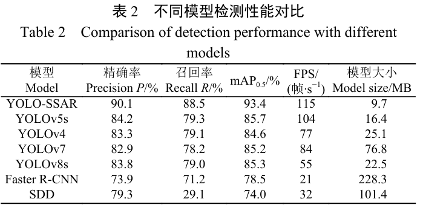
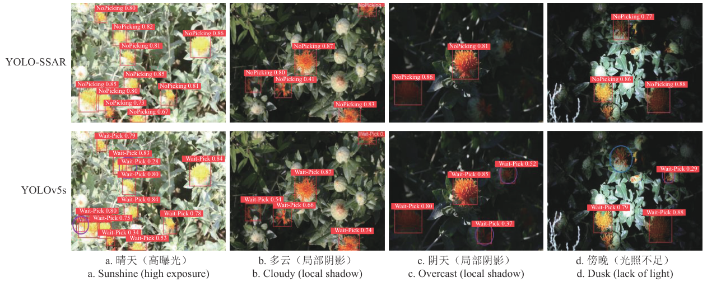
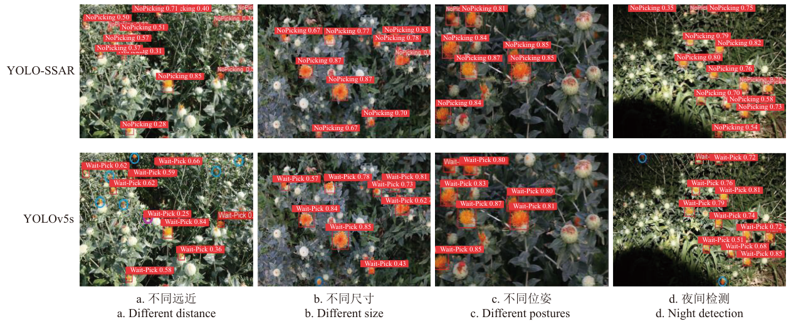
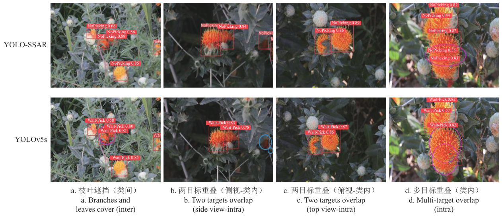

# 基于 YOLO-SSAR 的自然环境下红花检测算法

Paper Reading 是从个人角度进行的一些总结分享，受到个人关注点的侧重和实力所限，可能有理解不到位的地方。具体的细节还需要以原文的内容为准，博客中的图表若未另外说明则均来自原文。

| 论文概况 | 详细 |
| --- | --- |
| 标题 | 《基于 YOLO-SSAR 的自然环境下红花检测算法》 |
| 作者 | 陈金荣，许燕，周建平，王小荣，罗鸣，徐声彪 |
| 发表期刊 | 农业工程学报 |
| 期刊等级 | 未获取 |
| 发表年份 | 2025 |
| 论文代码 | 未获取 |

作者单位：

1. 新疆大学机械工程学院，乌鲁木齐 830017
2. 新疆维吾尔自治区农牧机器人及智能装备工程研究中心，乌鲁木齐 830017
3. 吉木萨尔县农牧业技术推广中心，昌吉回族自治州 831700

## 研究动机

红花采摘机器人视觉系统的首要环节，是在非结构自然环境中准确识别处于不同尺度、不同光照与不同遮挡状态下的红花果球，识别失败会直接造成采摘漏抓与亩产量下降。近年来基于深度学习的红花检测已取得一定进展，轻量化骨干、注意力机制与不均衡样本损失等手段相继被引入，然而面向田间真实场景的检测仍然存在三类待解决的问题：1）果球姿态变化、植株幅展不同与待检目标摆动，使拍摄到的红花以各种角度出现；2）红花果球大小不一，同一视野下远近目标的尺度变化大，细节特征容易丢失；3）红花遮挡可以分为无遮挡、类间遮挡和类内遮挡 3 个类别，但现有研究大多基于类间遮挡情况来强化边界框损失或局部特征，忽视了类内遮挡情况对于真实目标回归所造成的干扰。暂未有工作在同一检测框架内同时兼顾任意位姿目标标注、大跨度尺度特征提取与类内遮挡回归这三方面的需求。

## 文章贡献

针对上述尺度变化大与遮挡情况复杂的问题，本文提出了基于多尺度特征提取的 YOLO-SSAR 目标检测算法。其核心是在 YOLOv5s 的三层结构中分别植入轻量化、多尺度与抗遮挡三项改进。首先采用 ShuffleNet v2 轻量化结构对 Backbone 层主干特征提取网络进行替换，减少模型参数量和计算量；接着在 Neck 层添加基于空洞卷积和共享权重的 Scale-Aware RFE 模块，提高模型对于多尺度特征信息的提取能力；最终在 Head 层引入排斥损失函数对原损失函数进行替换，减少因非极大值抑制阈值选取不当造成的漏检或误检。实验表明，YOLO-SSAR 算法在测试集上的精确率、召回率和平均精度均值分别为 90.1%、88.5%、93.4%，比 YOLOv5s 原始模型分别提升了 5.9、9.2 和 7.7 个百分点，推理速度为 115 帧/s，模型大小为 9.7 MB。

## 本文方法

### 整体架构

YOLO-SSAR 的目标是在保持 YOLOv5s 单阶段实时检测框架的前提下，逐层修补骨干冗余、颈部尺度单一与头部遮挡敏感三处短板。本文以 YOLOv5s 为基础网络，其 Input 层结合 Mosaic 数据增强、自适应锚框计算及自适应图片缩放来提高样本多样性，Backbone 层前端利用 Focus 结构的切片功能经卷积获得二倍下采样特征图并应用 CSP1_X 结构改善遮挡物特征获取能力，Neck 层沿袭 FPN 和 PAN 组合并新增 CSP2_X 结构加强特征融合，Head 层原采用 CIOU_LOSS 作为边界框损失函数并通过 NMS 消除冗余重叠边界框。改进后的组件对应关系如下表所示。

| 网络层 | 改进模块 | 功能 |
| --- | --- | --- |
| Backbone | ShuffleNet v2 替换 CSP-Darknet53 | 通道二划分与深度可分离卷积降低参数量和计算量 |
| Neck | Scale-Aware RFE | 空洞率 1、2、3 的三分支空洞卷积捕获多尺度特征 |
| Head | Repulsion Loss 替换 CIOU_LOSS | 吸引加双排斥约束缓解类间、类内遮挡的漏检误检 |

改进后模型结构如下图所示。

由图 2 可见，输入图像经 CBRM 与多级 Shuffle_Block 下采样后送入颈部网络，Neck 中原本的特征融合路径被插入 RFE 模块，三路输出 Output1、Output2、Output3 仍由检测头 Head 给出，三项改进完全嵌入原有数据流而不额外增加检测头负担。

### ShuffleNet v2 轻量化骨干网络

ShuffleNet v2 轻量化骨干网络的目标是在检测性能基本不变的前提下降低计算和内存访问的成本。YOLOv5 原始骨干 CSP-Darknet53 会对所有输入特征进行全面表征，而目标标注区域存在着大量的冗余信息，导致模型复杂度提高，并不适用于计算能力有限的移动端设备。ShuffleNet v1 与 ShuffleNet v2 的构建单元如下图所示。

从图 3 可以发现，ShuffleNet v2 在特征图输入进入卷积操作前进行了通道二划分，一个分支采取恒等映射方式来消除多分支结构、避免多路结构造成的网络碎片化，另一个分支通过常规卷积层和深度可分离卷积层保证输入与输出通道对等，最小化内存访问成本；其下采样单元则由步长 2 的 3×3 深度可分离卷积与 3×3 平均池化两路 Concat 而成。该骨干逐级下采样输出的特征图送入 Neck 层，为后续多尺度融合提供低冗余的输入。

### Scale-Aware RFE 模块

Scale-Aware RFE 模块用于弥补 YOLOv5 网络在单一尺寸下容易丢失不同大小、不同尺度目标特征的缺陷。真实场景中的红花图像由于光照的程度不同、目标错落分布的远近不同，导致红花尺寸跨度与特征差异较大，本文在 Neck 层采用一种基于空洞卷积和共享权重的 Scale-Aware RFE 模块提升多尺度检测性能，使用 4 种不同比例的扩展卷积分支捕获多尺度信息和不同的依赖范围；若检测尺度未知，Scale-Aware 策略将会控制不同尺度的分支负责训练其对应尺度的边界框，但这也可能造成有效样本减少、产生各分支的过拟合问题。模块结构如下图所示。

由图 4 可知，Scale-Aware RFE 模块是由 3 个空洞卷积支路、收集和加权层两部分构成：多分支实现主要是通过设置不同空洞率（1、2、3）的 3×3 空洞卷积与 1×1 普通卷积结合，然后利用加权层收集来自不同分支的信息并对特征的每个分支进行加权；模块将主路分支权值与其他支路共享，减少模型参数量的同时通过融合残差连接降低过拟合风险，使不同尺度的物体可以通过相同的表征能力进行统一转换。模块输出回注入 Neck 的特征融合路径，供检测头进行多尺度预测。

### 遮挡问题与排斥损失总体形式

排斥损失函数改进的目标是解决密集场景下类间遮挡与类内遮挡所导致的漏检、误检问题。类间遮挡主要是由枝干、枝叶交叉生长以及植株倒伏后出现的相邻行红花枝干相互缠绕所导致；类内遮挡大多产生于同类物体在检测区域中聚集分布，当红花果球 A 被红花果球 B 遮挡时，由于两物体的纹理特征和颜色特征相似，红花果球 A 容易出现漏检现象。本文通过引入排斥损失函数在标准边界框回归损失中施加额外惩罚，不仅要求预测框接近待检物体的真实目标框，而且迫使每个预测框远离非待检物体的真实目标框。排斥损失函数主要由一个吸引项、两个排斥项和平衡系数组成，排斥损失计算如式（1）所示：

$$L = L_{Attr} + \alpha L_{RepGT} + \beta L_{RepBox}$$

| 符号 | 含义 |
| --- | --- |
| $L$ | 排斥损失函数总值 |
| $L_{Attr}$ | 吸引项，预测框和真实目标框之间的损失值 |
| $L_{RepGT}$ | 同类排斥项，预测框和相邻同类真实目标框之间的损失值 |
| $L_{RepBox}$ | 异类排斥项，预测框和异类真实目标框之间的损失值 |
| $\alpha$、$\beta$ | 平衡两种排斥项损失值的权重系数 |

直观上，吸引项负责把预测框拉向自己的目标框，两个排斥项同时把预测框推离邻近的其他真实目标框，从而有效防止预测的边界框移动至相邻的重叠目标。该总损失在 Head 层替换原回归损失后参与训练。

### 吸引项与同类排斥项

吸引项与同类排斥项共同塑造预测框与真实框之间一拉一推的回归关系。吸引项的构造沿用了 YOLOv4 位置回归中的 SmoothL1 函数，该函数解决了最小绝对误差在零点处不可导问题、提高收敛精度，同时在最小平方误差基础上最小化预测值与真实值的误差以降低函数对异常值的敏感度，吸引损失计算如式（2）所示：

$$L_{Attr} = \frac{\sum_{h \in H} \mathrm{Smooth}_{L1}(B^h, G^h_{Attr})}{|H|}$$

| 符号 | 含义 |
| --- | --- |
| $H$ | 正候选框集合，候选框与集合中一个真实框的 IoU 大于 0.5 时记为 $h \in H$ |
| $B^h$ | 回归调整所获取的预测框 |
| $G^h_{Attr}$ | 与候选框 h 有最大 IoU 的真实框 |

同类排斥项的设计目标在于排斥邻近非目标类内物体的真实框：对于一个候选框 h 而言，其排斥真实框对象被定义为除其指定目标外具有最大 IoU 区域的对象；为避免模型优化失衡问题，使用 IoG 函数计算候选框 h 与邻近非目标物体真实框的距离，减少候选框 h 与非目标的真实框重叠，同类排斥项计算如式（3）所示：

$$L_{RepGT} = \frac{\sum_{h \in H} \mathrm{Smooth}_{ln}(\mathrm{IoG}(B^h, G^h_{Rep}))}{|H|}$$

其中 $G^h_{Rep}$ 为除指定目标外与 h 具有最大 IoU 的邻近真实框，$\mathrm{Smooth}_{ln}$ 是一个在区间（0，1）内连续可微分的平滑函数，其定义如式（4）所示：

$$\mathrm{Smooth}_{ln} = \begin{cases} -\ln(1-x), & x \le \sigma \\ \frac{x-\sigma}{1-\sigma} - \ln(1-\sigma), & x > \sigma \end{cases}$$

其中 $x$ 为输入自变量、$\sigma$ 为分段阈值。可以看到，式（3）与式（2）形式同构，只是把作用对象从指定目标换成了邻近非目标真实框，二者方向相反地约束同一个预测框。两项结果加权后汇入式（1）的总损失。

### 异类排斥项

异类排斥项是用于降低检测器对非极大值抑制算法 NMS 的敏感度，即避免两个不同类别物体的预测框受阈值影响，其中一个物体的预测框被 NMS 抑制或合并。LRepBox 函数是根据图像包含的物体标签，首先将 H 集合划分成互斥的 q 个子集，q 表示目标物体数量，同组候选框回归同一样本标签、不同组候选框对应不同的样本标签，异类排斥项计算如式（5）所示：

$$L_{RepBox} = \frac{\sum_{i,j} \mathrm{Smooth}_{ln}(\mathrm{IoU}(B^{h_i}, B^{h_j}))}{\sum_{i,j} I[\mathrm{IoU}(B^{h_i}, B^{h_j})] + \varepsilon}$$

其中 $I$ 表示恒等函数、$\varepsilon$ 为功能常数，用于避免出现 LRepBox 函数的分母为 0 的情况。当两个目标不同的预测框重叠区域越小时，检测器在密集场景下鲁棒性越高。该项与吸引项、同类排斥项汇合为式（1）的总损失，替换 Head 层原回归损失后驱动边界框回归。

### 训练策略与评价指标

模型训练与评价环节的目标是以统一口径验证上述三项改进各自的收益。本文以 PyTorch 1.11.0 和 CUDA 11.3 作为深度学习框架，基于 Python 3.6，训练时调用 YOLOv5s.pt 作为预训练权重，采用 Adam 优化器并设置初始学习率为 0.01；为避免模型过拟合并获得更好的泛化性能，在训练策略中加入早停机制，即当固定周期内模型在验证集上的性能不再提升时立即终止训练，经测试训练轮数最终设置为 150，数据样本喂入量 batchsize 与子进程数量 workers 均设置为 8，图像输入大小为 640×640 像素。评价指标采用精确率 P、召回率 R、平均精度均值 $\mathrm{mAP}_{0.5}$ 与推理速度 FPS，其中 $\mathrm{mAP}_{0.5}$ 表示 IoU 阈值取 0.5 时模型计算得到的平均精度均值、FPS 为单幅图像推理时间。训练完成的模型直接在测试集上与消融试验、对比试验衔接。

## 实验结果

### 实验设置

数据集与训练口径如下：本研究以新疆吉木萨尔县红花种植基地种植的平原红花与山地红花为研究对象，使用像素 1 920×1 080 的 CCD 工业相机在俯仰角 30°～90° 范围内随机采集自然环境中不同位姿的红花图像，覆盖上午、下午、傍晚 3 个时间段，初筛得到 2 852 幅图像，人工剔除模糊失真、尺度变化过大的图像后最终得到 2 650 幅，经标注后按照 8:1:1 划分为训练集 2 120 幅、验证集 265 幅与测试集 265 幅，标注类别为盛花期待采摘红花 Wait-Pick 与不可采摘红花 No-Pick。不同场景下的红花样本如下图所示。

图 1 前三行给出晴天、多云、阴天在三个时段的曝光与阴影差异，末行给出无遮挡、类内遮挡与类间遮挡三类样本，矩形框标出的区域即存在被相邻红花或枝叶遮挡的目标红花，可以看出数据集对光照与遮挡两类干扰均有覆盖。

### 消融试验

为验证本文改进方法的有效性，以自然环境下红花图像为数据集进行消融试验，结果如下表所示。

由表 1 可知，CSP-Darknet53 特征提取网络被 ShuffleNet v2 网络替换后 mAP0.5 值下降了 0.8 个百分点但模型的推理速度得到提升，在此基础上将 Scale-Aware RFE 模块引入 Neck 层使 mAP0.5 值增加了 4.7 个百分点，再替换排斥损失函数后 mAP0.5 值又增加了 3.8 个百分点，最终达到 93.4%、推理速度 115 帧/s、模型大小 9.7 MB，相较于原始模型模型大小减少 6.7 MB，说明针对 Backbone 层、Neck 层及 Head 层的不同改进策略均可以改善模型的检测性能。

### 与主流算法对比

为评估 YOLO-SSAR 算法模型的检测性能，本文在 two-stage 方法中选择 Faster R-CNN 算法、在 one-stage 方法中选择 YOLOv4、YOLOv7、YOLOv8s、SSD 分别与改进算法模型进行比较，不同模型的检测性能如下表所示。

从表 2 可以发现，改进模型的 P 值、R 值、mAP0.5 值较原模型分别提升了 5.9、9.2 和 7.7 个百分点，mAP0.5 值分别高出 YOLOv4、YOLOv7、YOLOv8s、Faster R-CNN、SSD 等主流模型 8.8、8.2、8.1、14.9、19.4 个百分点；推理速度 115 帧/s 是两阶段目标检测算法 Faster R-CNN 的 5.5 倍、多尺度目标检测算法 SSD 的 3.6 倍，模型大小 9.7 MB 仅占 Faster R-CNN 的 4% 和 SSD 的 10%，可见本文网络模型参数量最小且精度领先，更适合部署在算力资源受限的移动端设备中。

### 可视化分析

为了验证 YOLO-SSAR 目标检测算法的识别效果，挑选不同天气、不同光照的 50 幅红花图像进行测试，检测效果如下图所示。

晴天高曝光条件下 YOLO-SSAR 能够准确区分重合度较高的红花目标、避免重复框选和选框混乱，阴天局部阴影情况下均准确识别出 2 个误检红花，傍晚光照不足时不仅检测出 1 个漏检红花而且筛除了原始网络误检出的 1 个败花期衰败红花，多云天气中改进算法检测框较原始 YOLOv5s 检测框的平均置信度更高，可见 YOLO-SSAR 算法在面对复杂光照背景时综合检测性能更佳。针对不同尺度目标的检测效果如下图所示。

俯仰角为 45° 时 YOLO-SSAR 准确识别出 YOLOv5s 算法漏检的 6 个红花目标并剔除了 1 个近距离误检红花，俯仰角为 60° 时可以在图像边缘检测出相对尺寸较小的漏检目标，夜间检测时在远、近距离各识别出 1 个漏检红花，表明模型在引入 Scale-Aware RFE 模块后能够准确识别出相对位置较远或较近的目标。不同遮挡情况下的红花检测效果如下图所示。

枝叶交错、重叠的类间遮挡下改进算法在筛除 1 个误检框的同时合理框选了目标区域，类内遮挡中存在多目标重合度高且部分果球可见度较低的情况时 YOLOv5s 算法将 2 个目标红花识别成 1 个，而 YOLO-SSAR 利用排斥损失函数合理选取 NMS 阈值，将 2 个同类簇生遮挡的红花分割成置信度分别为 0.82 和 0.83 的检测框且框选区域较为准确，说明模型在更换排斥损失函数后可以解决同类、目标重叠情况下的边界框混乱问题。

## 优点和创新点

个人认为，本文有如下一些优点和创新点可供参考学习：

1. 将 ShuffleNet v2、Scale-Aware RFE 与排斥损失分别对应 Backbone、Neck、Head 三层的尺度与遮挡痛点逐项改造，消融试验给出逐项增益，改进路径清晰，可供参考。
2. Scale-Aware RFE 用空洞率 1、2、3 的三支空洞卷积共享主路权值并融合残差连接，以少量参数统一表征不同尺度目标，单独引入即带来 4.7 个百分点的 mAP0.5 提升，思路巧妙。
3. 实验除消融与六模型对比外，还给出光照、尺度、遮挡三组定性效果图并逐图标注漏检误检，配合 115 帧/s 与 9.7 MB 的轻量化指标，说服力强，对移动端部署有参考价值。
