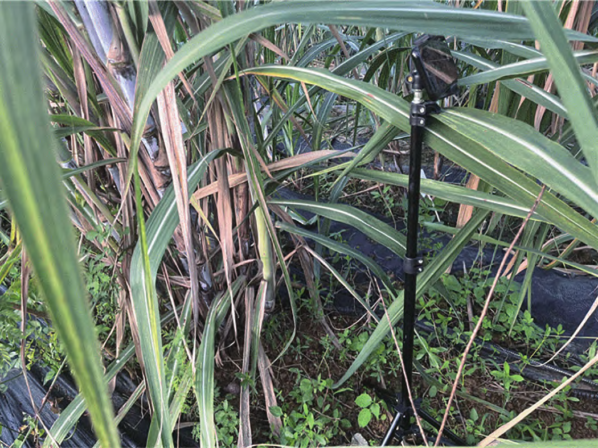
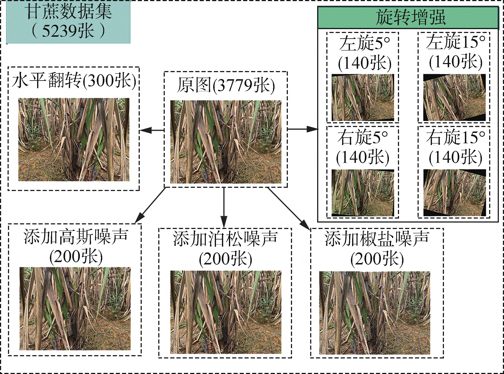
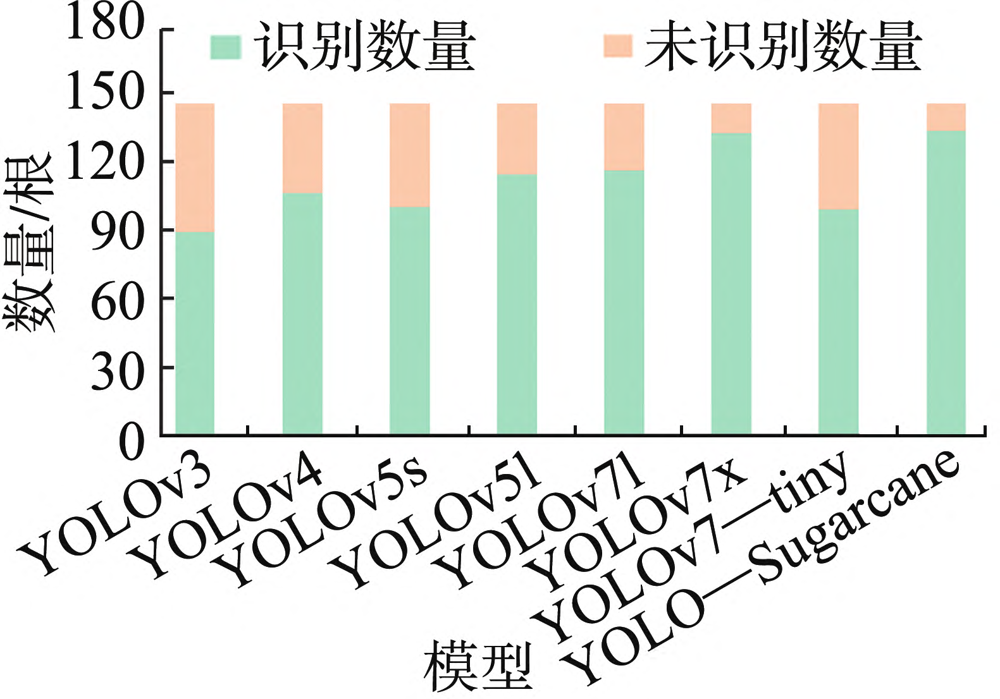
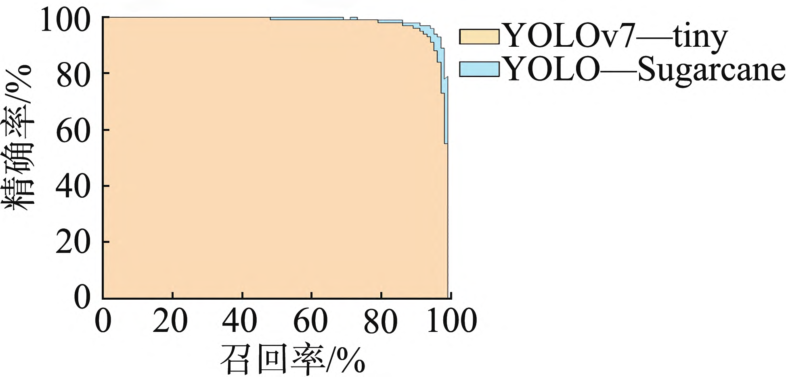
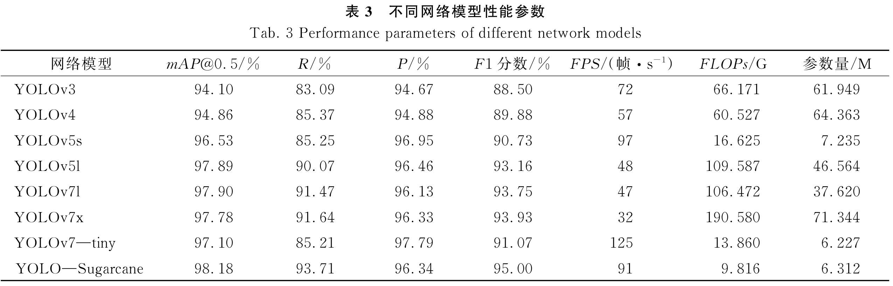
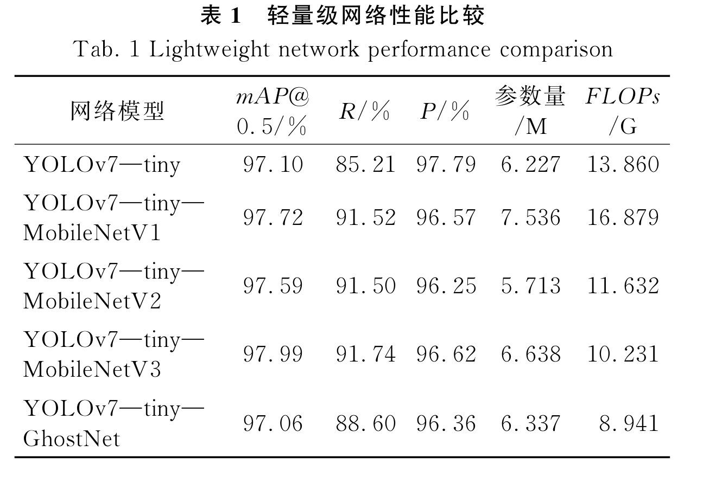
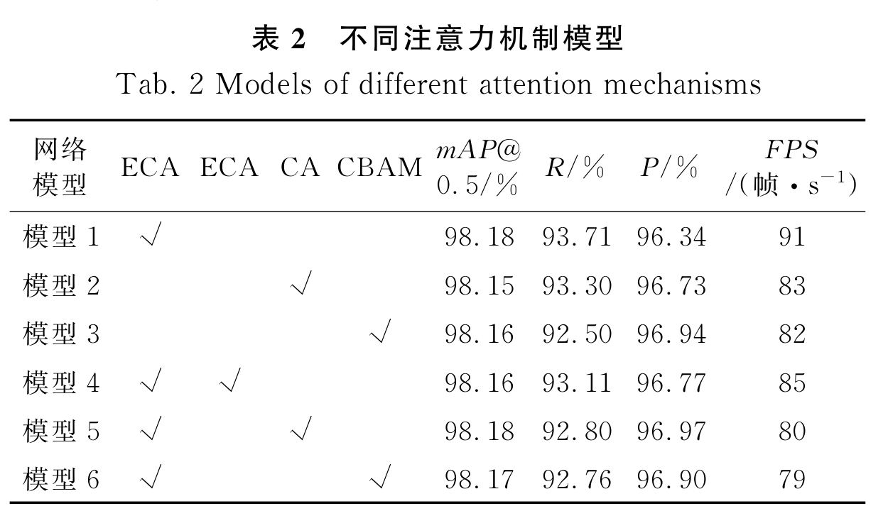

# 2025 YOLO—Sugarcane_用于快速检测复杂背景下甘蔗植株的轻量级神经网络

Paper Reading 是从个人角度进行的一些总结分享，受到个人关注点的侧重和实力所限，可能有理解不到位的地方。具体的细节还需要以原文的内容为准，博客中的图表若未另外说明则均来自原文。

| 论文概况 | 详细 |
| --- | --- |
| 标题 | 《YOLO—Sugarcane：用于快速检测复杂背景下甘蔗植株的轻量级神经网络》 |
| 作者 | 张志鹏，张铁异，陆静平，熊灵聪，袁安路，韦俊 |
| 发表期刊 | 中国农机化学报 |
| 期刊等级 | 未获取 |
| 发表年份 | 2025 |
| 论文代码 | 未获取 |

作者单位：

1. 广西大学机械工程学院，南宁市，530004
2. 广西交通职业技术学院汽车工程学院，南宁市，530023

## 研究动机

甘蔗是全球制糖工业的重要原料作物，甘蔗收获的机械化程度直接决定蔗糖产业的生产成本，在丘陵山地蔗区尤为如此。对甘蔗收割机而言，实时识别割台前方的甘蔗植株是整个控制系统的关键步骤，识别的准确度直接影响后续甘蔗定位、路径规划与执行机构的效率和效果。然而，现有的检测手段难以在复杂田间背景下稳定工作：传统机器视觉方法依赖手工设计的颜色与纹理特征来检测目标，检测精度容易受到背景颜色以及光照条件的影响；面向甘蔗的深度学习检测工作又大多侧重于甘蔗茎节等局部目标的识别，忽略了对甘蔗植株整体的检测。如果不能准确识别收割机前方的甘蔗，轻则漏检误检拉低收割效率，重则导致收割机卡死甚至损坏刀盘；而以 YOLOv7—tiny 为代表的轻量级网络虽能满足收割机的算力约束，却在植株相互遮挡、叶片包裹和逆光虚化时暴露出召回率不足的问题。因此，在保证轻量化的同时提高复杂背景下甘蔗整株检测的召回率与鲁棒性，是甘蔗智能收割机视觉系统亟待解决的问题。

## 文章贡献

针对轻量级网络在复杂背景下检测甘蔗植株时容易出现漏检和误检的问题，本文提出了改进的 YOLO—Sugarcane 轻量级神经网络模型，其核心是在 YOLOv7—tiny 框架内同时压低运算成本、提高模型对遮挡目标的召回率。首先，本文用 MobileNetV3 的 Bneck 模块替换主干网络内的 MP 和 ELAN 模块，以反向残差结构增强主干的特征表达能力；其次，用深度可分离卷积 DPConv 替代 Neck 中的标准 3×3 卷积，降低模型的运算成本，保证模型在甘蔗收割机上的稳定部署；最后，在主干有效特征层传出通道引入轻量级通道注意力模块 ECA，使模型有效捕捉不同通道间的特征关联，专注于有效特征并丢弃冗余特征。试验结果表明，与 YOLOv7—tiny 模型相比，YOLO—Sugarcane 的浮点运算量减少 29.18%，mAP 从 97.10% 提升到 98.18%，召回率从 85.21% 提升到 93.71%，检测速度达到 91 帧/s。

## 本文方法

### 1. 整体架构设计与数据流

YOLO—Sugarcane 的目标是在 YOLOv7—tiny 的框架内同时降低运算成本、提高召回率，模型整体沿用 Input、Backbone、Neck、Prediction 的四段式数据流，各部分的组成与功能如下表所示。

| 部分 | 组成模块 | 功能 |
| --- | --- | --- |
| Input | 数据加载与预处理 | 载入数据集并完成必要的预处理 |
| Backbone | CBL、MP、ELAN（本文改为 Bneck） | 多层卷积获取高级语义特征，扩大感受野 |
| Neck | SPPCSPC、FPN、PAN（标准 3×3 卷积改为 DPConv） | 多尺度信息捕捉，获取物体边缘与轮廓 |
| Prediction | CBL 与 1×1 卷积 | 映射出边界框位置、置信度与类别概率 |

Input 部分把数据集加载进模型并做预处理；Backbone 部分通过多层卷积获取高级语义特征、扩大感受野并获取上下文信息；Neck 部分借助 SPPCSPC 模块与 FPN、PAN 结构捕捉多尺度信息；Prediction 部分先用 CBL 模块调整不同尺度特征层的通道，再用 1×1 卷积把特征图映射为检测输出。本文在这个基线之上做三处改动：Backbone 内的 MP 与 ELAN 换成 Bneck、Neck 内的标准 3×3 卷积换成 DPConv、有效特征层传出通道挂上 ECA，后续小节依次展开。上述数据流中，Backbone 的输出经位置 1 进入 Neck，Neck 的输出经位置 2 进入 Prediction，这两处也是注意力机制的候选插入点。

### 2. Backbone 改进：MobileNetV3 的 Bneck 模块

Bneck 模块用于替换主干内的 MP 与 ELAN 模块，目标是以含瓶颈结构的轻量化模块增强主干的非线性表达与召回率。Bneck 是 MobileNetV3 网络的核心模块，而 MobileNetV3 由网络架构搜索与 NetAdapt 算法得到，并在 MobileNetV2 基础上引入 SE 注意力机制和 H—Swish 激活函数；本文使用经过优化的 Bneck 模块，其工作流程如下图所示。

图 4 Bneck 模块工作流程

Bneck 是一个具有反向残差结构的线性瓶颈模块，它先判断是否执行残差连接程序，再比较输入通道数与中间层通道数：相同则执行图 4 左侧虚线框流程，不同则执行右侧虚线框流程，MobileNetV3 运行时绝大多数情况走右侧分支。右侧流程分四步：先用 1×1 卷积扩展特征图通道数并做批归一化，再用深度卷积调整特征图尺寸并批归一化，然后判断是否使用 SE 注意力模块（不使用则调用 PyTorch 的 nn.Identity 模块做恒等映射）并施加激活函数，最后用 1×1 卷积降低通道数、批归一化后传出。该模块接收 Input 段传来的图像特征，其输出一方面经残差连接与后续 Bneck 堆叠继续提取特征，另一方面作为有效特征层向 Neck 传递。

### 3. H—Swish 激活函数

Bneck 在卷积步之后需要激活函数引入非线性，本文按 MobileNetV3 的设计以 H—Swish 替代默认的 ReLU，用于缓解梯度消失问题。ReLU 及其截断版本 ReLU6 的计算如原文式 (1) 所示：

$$ \text{ReLU}(x) = \max(0, x), \quad \text{ReLU6}(x) = \min(\max(0, x), 6) $$

其中 $x$ 表示任意实数的输入，ReLU6 把 ReLU 的输出截断在 6 以内。H—Swish 的计算如原文式 (2) 所示：

$$ \text{H--Swish}[x] = \frac{x \cdot \text{ReLU6}(x + 3)}{6} $$

其中 $x$ 表示输入，$\text{ReLU6}(\cdot)$ 为上式定义的截断函数。直观上，H—Swish 用输入自身对截断后的 ReLU6 做缩放，这等价于在保留分段线性计算廉价性的同时引入平滑的非线性段，从而在 Bneck 堆叠加深时缓解梯度消失问题。激活函数嵌在 Bneck 各卷积步之间，为随后的 SE 判断与降维卷积提供非线性表达。

### 4. Neck 轻量化：深度可分离卷积 DPConv

DPConv 模块的目标是替换 Neck 中参数量集中的标准 3×3 卷积，在保持检测性能的同时缩减参数量。YOLOv7—tiny 的加强特征提取网络中参数量大多集中在 Neck 的标准 3×3 卷积上，本文改用由深度卷积和逐点卷积组合而成的深度可分离卷积，其结构如下图所示。

图 5 DPConv 模块

DPConv 先执行深度卷积，让每个输入通道与一个独立的 3×3 卷积核卷积，生成与输入通道数相同数量的特征图；随后执行逐点卷积，用 1×1 卷积核对深度卷积生成的特征图卷积，把彼此独立的通道组合起来并引入通道间的混合信息，生成最终输出。深度卷积负责空间滤波、逐点卷积负责通道混合，两者串联即完成与标准卷积同口径的特征变换。该模块嵌在 Neck 内部，接收 Backbone 传来的多尺度特征，输出再送入 SPPCSPC、FPN 与 PAN 的后续计算以及 Prediction。

### 5. 参数量与计算成本分析

为量化 DPConv 的轻量化收益，原文给出了一个具体的卷积算例。给出一个简单的例子，假设输入图片为 RGB 三通道，大小为 3×3、步长为 1，输出通道数为 64，输出特征图尺寸为 3×3，卷积核尺寸为 3×3。标准卷积的参数量与计算成本分别为：

$$ 3 \times 3 \times 3 \times 64 = 1\,728, \qquad 3 \times 3 \times 3 \times 3 \times 3 \times 64 = 15\,552 $$

其中左侧为卷积核的参数量，右侧为对应的计算成本。深度可分离卷积的参数量与计算成本分别为：

$$ 3 \times 3 \times 3 + 3 \times 64 = 219, \qquad 3 \times 3 \times 3 \times 3 \times 3 + 3 \times 3 \times 3 \times 64 = 1\,971 $$

其中左侧第一项是深度卷积的参数量、第二项是逐点卷积的参数量，右侧两项则对应两段卷积的计算成本。可以看到，标准卷积的参数量和计算量约为深度可分离卷积的 8 倍，这使 YOLO—Sugarcane 有希望部署在性能较低的甘蔗收割机上。这一结论为上一小节的 DPConv 替换提供了量化依据，并直接对应实验部分 FLOPs 与参数量的下降。

### 6. ECA 通道注意力机制

ECA（Efficient Channel Attention）是一种轻量级通道注意力模块，用于给有效特征层的通道加权，使模型专注于有效特征、丢弃冗余特征。本文将其添加在 Backbone 网络有效特征层传出通道上，注意力机制的插入位置与 ECA 的内部流程如下图所示。

图 6 注意力机制插入位置图

ECA 先对输入特征图做自适应平均池化，再通过一维卷积层做通道注意力加权；卷积核大小的选择影响不同通道之间信息交互的覆盖程度，原文插图以 $K = 3$ 为例示意，选择合适的卷积核尤为关键。随后用 Sigmoid 激活函数生成通道权重，再把原始输入特征图与通道注意力权重按元素相乘，加权调整每个通道的特征表示，使模型更加集中地关注图中重要特征信息。该模块接收 Backbone 传出的有效特征层并原位完成加权，加权结果随即传入 Neck，不改变特征图的尺寸与通道数。

### 7. 注意力类型与插入位置的设计空间

注意力改造的效果不仅取决于注意力机制的类型，还取决于添加位置，本文把模型按有效特征图维度划分为 80×80×C、40×40×C 和 20×20×C 的高、中、低 3 个维度，并在位置 1（主干有效特征层前传到 Neck 处）与位置 2（Neck 前传到预测部分处）分别考察 3 种注意力，候选配置如下表所示。

| 注意力机制 | 类型 | 考察位置 |
| --- | --- | --- |
| CA | 空间注意力 | 位置 1、位置 2 |
| ECA | 通道注意力 | 位置 1、位置 2 |
| CBAM | 混合注意力 | 位置 1、位置 2 |

其中 CA 关注空间位置、ECA 关注通道关联、CBAM 兼顾二者，位置 1 贴近特征提取末端、位置 2 贴近检测输出端。这 6 种配置构成消融实验的搜索空间，实验部分将据此确定最终的注意力类型与插入位置，并把胜出配置命名为 YOLO—Sugarcane。

## 实验结果

### 1. 实验设置

实验数据采集自广西壮族自治区崇左市某甘蔗种植基地，用 iPhone 14 Pro 手机共拍摄 3 779 张原始甘蔗图片；为匹配甘蔗收割机的实际工况，采集时用固定三脚架保持约 0.5 m 的拍摄距离和约 1 m 的镜头高度，数据采集过程如下图所示。

图 1 数据采集过程示意图

图中的三脚架与手机布置模拟了收割机前方的取景条件，画面里交错的蔗叶与杂草正是后续检测要面对的复杂背景。本文从中挑选 1 460 张高清图片做数据增强扩充，增强方式与最终得到的数据集如下图所示。

图 2 甘蔗数据集

增强包含水平翻转、左旋与右旋 5°、15° 的旋转增强，以及高斯、泊松、椒盐 3 类加噪，最终获得 5 239 张甘蔗图片；图像等比例缩放到 1 209 像素×907 像素后用 LabelImg 标注 sugarcane，以 8∶1∶1 随机划分为训练集、验证集和测试集。模型在一台配备 NVIDIA GeForce RTX 3060Ti 8 G 显卡、运行 Windows 11 的台式机上训练，使用 SGD 优化器训练 300 个 epoch，batch size 为 8，初始学习率 0.001 并按余弦退火动态调整，权重衰减系数为 $5 \times 10^{-4}$、动量为 0.937；YOLOv3 与 YOLOv4 的输入图像大小为 416 像素×416 像素，其余模型为 640 像素×640 像素。

评价指标采用精确率 P、召回率 R 与 F1 分数，精确率 P 与召回率 R 的计算如下：

$$ P = \frac{TP}{TP + FP} \times 100\% $$

$$ R = \frac{TP}{TP + FN} \times 100\% $$

其中 TP 表示标注为甘蔗且被正确检测的目标，FP 表示被错误检测为甘蔗的背景，FN 表示被错误检测为背景的甘蔗目标。F1 分数对精确率与召回率做调和平均，其计算如下：

$$ F1 = 2 \times \frac{P \times R}{P + R} \times 100\% $$

其中 P、R 即上文的精确率与召回率。直观上，F1 分数越高，模型的预测性能越好。平均精度 AP 与平均精度均值 mAP 的计算如下：

$$ AP = \int_{0}^{1} P(R) \, \mathrm{d}R \times 100\% $$

$$ mAP = \frac{1}{n} \sum_{i=1}^{n} AP(i) \times 100\% $$

其中 $n$ 为目标类别数量，$AP(i)$ 为第 $i$ 类的 AP 值；本文只检测甘蔗，$n = 1$，mAP 等于该类的 AP 值。此外，FLOPs 表示浮点运算量，参数量是模型中的权重和偏差，FPS 表示每秒处理的图像数量。

### 2. 可视化分析

本文先从检测效果的定性对比入手，图 9 给出 YOLO—Sugarcane 与对照模型在 4 类复杂场景下的实际检测结果，涵盖甘蔗遮挡、甘蔗叶遮挡、逆光环境和甘蔗叶包裹遮挡，如下图所示。

图 9 不同网络模型的实际检测结果

图中 (a) 的 YOLOv5s 把前方甘蔗叶片误检为后方甘蔗，(b)、(d) 的 YOLOv7—tiny 把包裹的叶片误检为甘蔗本体或出现大量漏检，(c) 的 YOLOv7—tiny 只检出近处甘蔗而漏检逆光虚化的远处目标；YOLO—Sugarcane 在 4 组场景中均稳定输出检测框，可见改进后的模型对遮挡和光照干扰的鲁棒性更强。本文又随机挑选 40 张不同遮挡程度的图片做计数验证，这些图片共标注 145 根甘蔗，各模型的计数结果如下图所示。

图 8 不同网络模型计数对比

YOLO—Sugarcane 共检测出 133 根甘蔗，比 YOLOv7—tiny 多检测出 34 根，与规模大得多的 YOLOv7x（132 根）相当，而其 FLOPs 和参数量比 YOLOv7x 分别下降 94.85%、91.15%，可见轻量级的 YOLO—Sugarcane 具备与大模型相媲美的检测性能，摆脱了轻量级模型在复杂环境中检测不稳定、容易误检的情况。

### 3. 对比实验

YOLOv7—tiny 与 YOLO—Sugarcane 在 IoU 阈值 0.5 时的 PR 曲线如下图所示。

图 7 YOLOv7—tiny 和 YOLO—Sugarcane 的 P—R 曲线

YOLO—Sugarcane 的 PR 曲线完全包裹住 YOLOv7—tiny 的曲线，曲线内的封闭区域即上文式中的平均精度，可见其 mAP 更高。与 YOLOv3、YOLOv4 等主流模型同台对比的完整性能参数如下表所示。

表 3 不同网络模型性能参数

YOLO—Sugarcane 的 mAP、召回率和 F1 分数（98.18%、93.71%、95.00%）均为表中最高，FLOPs（9.816 G）与参数量（6.312 M）均为最低；与 YOLOv7—tiny 相比，mAP、召回率和 F1 分数分别提高 1.08%、8.5%、3.93%，浮点运算量下降 29.18%，并保持 91 帧/s 的检测速度，说明模型在保持轻量化的同时提升了检测精度和召回能力，更适合在硬件性能较低的甘蔗收割机上部署。

### 4. 消融实验

消融实验先考察轻量化主干的替换效果，4 种轻量级网络替换 Backbone 后的性能如下表所示。

表 1 轻量级网络性能比较

替换为 MobileNetV3 后，mAP 与召回率分别提高 0.89%、6.53%，精确率下降 1.17%，浮点运算量下降 26.18%，且 mAP、召回率、精确率均为 4 种轻量级网络中最高，表明 MobileNetV3 是替换原 Backbone 的最佳选择。注意力机制的 6 种配置对应的性能如下表所示。

表 2 不同注意力机制模型

在位置 1 单独使用 ECA 的模型 1 取得最高的 mAP 和召回率（98.18%、93.71%），并保持 91 帧/s 的最快检测速度；在位置 2 追加注意力机制的模型 4~模型 6 性能没有进一步提高，检测速度反而降至 79~85 帧/s，可见在位置 1 添加单个 ECA 就是综合性能最佳的配置。本文最终选用 YOLOv7—tiny—MobileNetV3—ECA 作为输出模型并命名为 YOLO—Sugarcane。

## 优点和创新点

个人认为，本文有如下一些优点和创新点可供参考学习：

1. 针对遮挡漏检问题用 MobileNetV3 的 Bneck 模块重构主干网络，以反向残差结构增强特征表达，再用 4 种轻量级主干的横向对比确认选型，设计与验证形成闭环；
2. 用深度可分离卷积替换标准 3×3 卷积，并给出参数量与计算成本的具体算例，把轻量化收益论证到可复算的粒度，便于评估甘蔗收割机等边缘设备上的部署可行性；
3. 实验涵盖复杂遮挡场景的检测效果与计数验证、注意力类型和插入位置的系统消融，从定性和定量两个方面论证改进效果，说服力强；
4. 在保持 91 帧/s 实时检测速度的同时把浮点运算量压低近三成，兼顾检测精度、召回能力与部署开销，对算力受限的农机平台很有参考价值。
