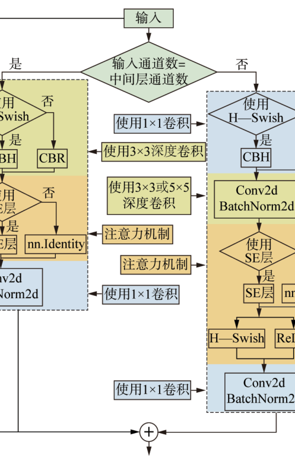
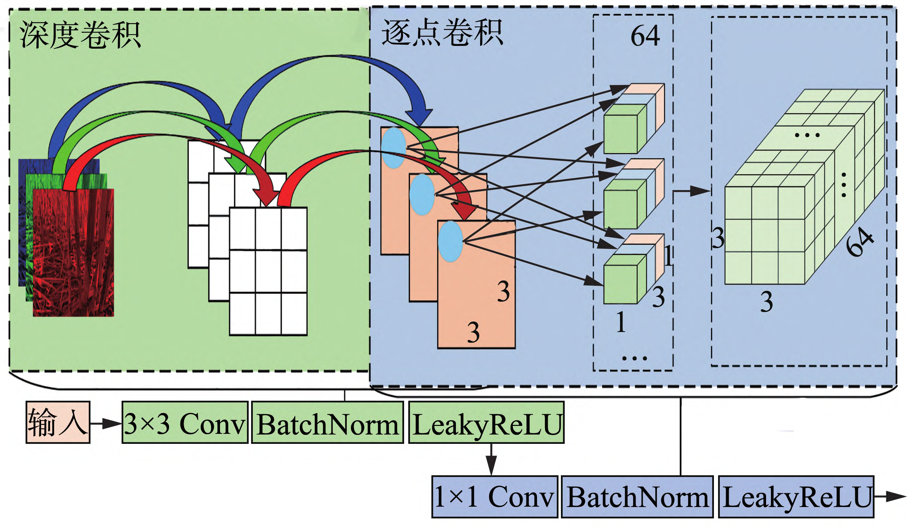
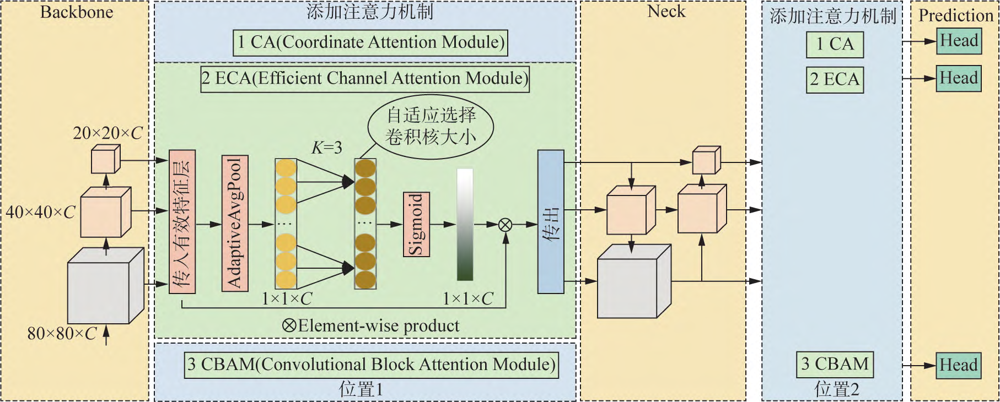
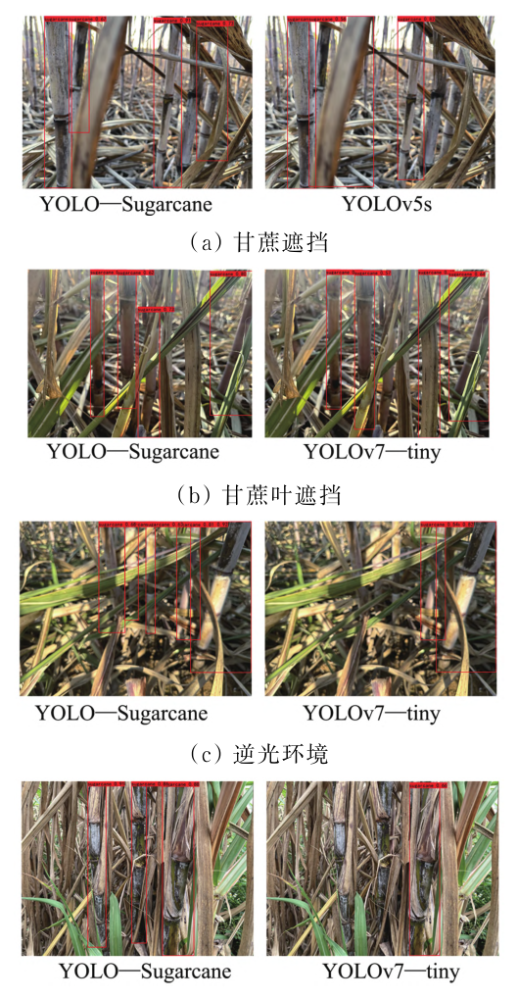

# 2025 YOLO—Sugarcane_用于快速检测复杂背景下甘蔗植株的轻量级神经网络

Paper Reading 是从个人角度进行的一些总结分享，受到个人关注点的侧重和实力所限，可能有理解不到位的地方。具体的细节还需要以原文的内容为准，博客中的图表若未另外说明则均来自原文。

| 论文概况 | 详细 |
| --- | --- |
| 标题 | 《2025 YOLO—Sugarcane_用于快速检测复杂背景下甘蔗植株的轻量级神经网络》 |
| 作者 | 张志鹏，张铁异，陆静平，熊灵聪，袁安路，韦俊 |
| 发表期刊 | 中国农机化学报 |
| 期刊等级 | 未获取 |
| 发表年份 | 2025 |
| 论文代码 | 未获取 |

作者单位：

1. 广西大学机械工程学院，南宁市，530004
2. 广西交通职业技术学院汽车工程学院，南宁市，530023

## 研究动机

丘陵山地甘蔗收割是中国农业生产的重要挑战，全国 90% 以上的甘蔗采用机械化收割，但我国甘蔗种植成本远高于巴西。现有切段式和整杆式甘蔗收割机难以在丘陵地貌地区充分发挥效能，设计针对中国丘陵地貌的智能甘蔗收割机显得尤其重要。智能甘蔗收割机控制系统中，对甘蔗植株进行实时识别检测是整个控制系统的关键步骤，其识别准确度直接影响后续操作的效率和效果。随着人工智能发展，深度学习目标检测算法已广泛应用于农业生产场景。单阶段目标检测算法如 YOLOv1 将输入图像划分为多个网格，经过特征提取后根据各网格单独预测可能包含的目标，相较于双阶段检测算法只需一次特征提取即可完成目标检测，速度更快且计算资源更低。然而，现有轻量级网络模型易受到甘蔗遮挡影响而导致漏检和误检问题，特别是在复杂背景下的甘蔗植株检测任务中，模型的召回率和鲁棒性仍有待提升。

## 文章贡献

针对现有轻量级网络模型易受甘蔗遮挡影响导致漏检误检的问题，本文提出了改进的 YOLO—Sugarcane 轻量级神经网络模型。其核心是在 YOLOv7-tiny 基础上进行三处关键改进：首先，用 MobileNetV3 的 Bneck 模块替换主干网络内的 MP 和 ELAN 模块，有效提高模型的召回率；其次，用深度可分离卷积替代标准 3×3 卷积，降低模型的运算成本，保证其在甘蔗收割机上的稳定部署；最后，引入轻量级通道注意力模块 ECA，使模型能够有效捕捉不同通道间的特征关联，专注于有效特征并丢弃冗余特征。试验结果表明，与 YOLOv7-tiny 模型相比，YOLO—Sugarcane 模型的浮点运算量减少 29.18%，平均精度均值 mAP 从 97.10% 提升到 98.18%，召回率显著提升。

## 本文方法

### 1. 整体架构设计

为提高 YOLOv7-tiny 模型的召回率和鲁棒性，降低甘蔗漏检概率，将 YOLOv7-tiny 模型改进为 YOLO—Sugarcane 模型。YOLOv7-tiny 模型由 Input、Backbone、Neck 和 Prediction 组成，Input 部分将数据集加载到模型并进行必要的预处理，Backbone 部分由 CBL 模块、MP 模块和 ELAN 模块组成，通过多层卷积来获取高级语义特征，扩大感受野，获取上下文信息。Neck 部分由 SPPCSPC 模块与 FPN 和 PAN 结构组成，有助于多尺度信息捕捉和更好地获取物体的边缘及轮廓信息。Prediction 部分将传入进来的不同尺度特征层，用 CBL 模块进行通道调整，最后再用一个 1×1 的卷积层将网络学到的特征图映射为目标检测的输出，其中包括边界框位置、置信度及类别概率。

### 2. 基于 MobileNetV3 的 Backbone 改进

Bneck 模块是一种含有瓶颈结构的轻量化模块，是 MobileNetV3 网络的核心组件。首先，Bneck 模块会判断是否执行卷曲卷积映射，接着，根据输出通道数是否大于输入通道数而选择不同分支执行流程。当输出通道数小于等于输入通道数时执行左侧流程，反之则执行右侧流程。MobileNetV3 的不同版本中，残差块也会执行对应流程。Bneck 模块的第一个卷积是一个 1×1 的升维卷积，用于扩展输入图像的通道数，增强模型的表达能力。中间会选择使用预激活的 HSwish 激活函数替代默认的 ReLU 激活函数，以改善梯度消失问题。ReLU 激活函数与 HSwish 激活函数的数学表达式如下：

$$ \text{ReLU}(x) = \max(0, x) $$

其中 x 表示输入数据。

$$ \text{HSwish}[x] = \frac{x \cdot \text{ReLU6}(x + 3)}{6} $$

其中 x 表示输入数据，ReLU6 是对 ReLU 函数的截断版本。

然后，根据是否使用 SE 注意力模块，若不使用则直接调用 PyTorch 中的 nn.Identity 模块进行恒等映射，再使用相同的激活函数强化非线性表达，最后再次使用 1×1 的降维卷积以减少输出图像的通道数，通过这种下采样方式增大模型的 receptive field。

图 4 Bneck 模块工作流程

### 3. Neck 结构轻量化改进

基于 YOLOv7-tiny 模型的轻量化需求，在保留该模型性能的基础上，使用深度可分离卷积 DPconv 模块替换原有的标准 3×3 卷积，从而达到缩减参数量的目的。深度可分离卷积由深度卷积和逐点卷积两部分组成，可使用更少的参数量达到与原标准卷积相近的效果，从而降低模型的计算成本。

如图 5 所示，假设输入图片为 RGB 三通道，大小为 3×3，输出通道数为 64 个。输入图像尺寸为 3×3，卷积核尺寸为 3×3，标准卷积的计算量为 $3 \times 3 \times 3 \times 64 = 1728$，总参数量为 $3 \times 3 \times 3 \times 3 \times 64 = 15552$。深度可分离卷积的计算量为 $3 \times 3 \times 3 + 3 \times 3 \times 3 \times 64 = 621$，总参数量为 $3 \times 3 \times 3 + 3 \times 3 \times 3 \times 64 = 585$。通过深度可分离卷积，可有效降低模型的参数量和计算成本。

图 5 DPConv 模块

### 4. ECA 注意力机制引入

在 Backbone 网络有效特征层传出通道添加 ECA 注意力机制，如图 6 所示。ECA（Efficient Channel Attention）是一种轻量级通道注意力模块，能够自动学习通道权重，使模型能够聚焦于重要的特征通道，抑制无关通道的响应。该机制通过一维卷积操作实现跨通道信息的交互，无需降维和升维操作，显著降低了计算开销。

图 6 注意力机制插入位置

## 实验结果

### 实验设置

实验平台为一台运行 Windows 11 22H2 操作系统的台式计算机，配备 32 GB RAM 和 NVIDIA GeForce RTX 3060Ti 8 G 显卡，处理器为 13th Gen Intel(R) Core(TM) i5-13400F 2.50 GHz。主要软件包括 python 3.9.16、torchvision 0.13.0、PyTorch 1.12.0、OpenCV-python 4.7.0.72、CUDA 11.3 和 cuDNN 8.3.2。模型训练参数设置：YOLOv3 模型和 YOLOv4 模型的输入图像大小为 416×416 像素，本模型输入图像大小为 640×640 像素，训练时使用 SGD 优化器，batch size 为 8，总迭代次数 epoch 为 300，初始学习率为 0.001，采用余弦退火算法对学习率进行动态调整，权重衰减系数为 5×10^-4，动量为 0.937。

### 评价指标

为衡量模型的性能表现以及泛化能力，选用精确率 P、召回率 R、平均精度 AP、平均精度均值 mAP、F1 分数、速度和参数量 FLOPs 等指标来全面展示模型性能。精确率表示模型识别为目标的样本中实际为目标的比例，召回率表示所有实际目标中被模型正确识别的比例，F1 分数能够综合评估精确率和召回率，F1 分数越高，模型预测效果越好。计算公式如下：

$$ P = \frac{TP}{TP + FP} \times 100\% $$

其中 TP 表示真正例，即被正确识别的目标；FP 表示假正例，即错误识别的目标。

$$ R = \frac{TP}{TP + FN} \times 100\% $$

其中 FN 表示假负例，即未被识别的目标。

$$ F1 = 2 \times \frac{P \times R}{P + R} \times 100\% $$

AP 表示目标在不同阈值下的平均精度，mAP 表示模型对所有类别的平均精度 AP 的平均值。当只有一个类别时，mAP 即为该类别的 AP 值，mAP 值越高，模型性能越好。FLOPs 表示模型运算量，FLOPs 越低，意味着模型越轻量。FPS 表示模型每秒处理图像帧数，FPS 值越高，模型实时性越强。

### 主对比实验

试验结果表明，与 YOLOv7-tiny 模型相比，YOLO—Sugarcane 模型的浮点运算量减少 29.18%，平均精度均值 mAP 从 97.10% 提升到 98.18%，召回率显著提升。这表明改进后的模型在保持轻量化的同时，有效提升了检测精度和召回能力，更适合在甘蔗收割机上部署应用。

### 可视化分析

图 9 展示了不同网络模型的实际检测结果对比。从图中可以看出，YOLO—Sugarcane 模型在复杂背景下对甘蔗植株的检测效果明显优于原始 YOLOv7-tiny 模型，漏检和误检情况大幅减少，特别是在甘蔗叶片遮挡严重的情况下，改进模型仍能准确定位目标。这得益于 Bneck 模块对特征的更好提取、深度可分离卷积对计算效率的提升以及 ECA 注意力机制对关键通道的聚焦作用。

图 9 不同网络模型的实际检测结果对比

## 优点和创新点

个人认为，本文有如下一些优点和创新点可供参考学习：

1. 采用 MobileNetV3 的 Bneck 模块重构 Backbone，在保证精度的同时大幅提升模型召回率，适合甘蔗遮挡场景
2. 使用深度可分离卷积替代标准卷积，参数量降低约 96%，显著减轻模型负担，便于边缘设备部署
3. 引入轻量级 ECA 注意力机制，无需降维升维操作即可捕捉通道间关联，计算开销极小且效果显著
