# 2025 基于 YOLO_11n-EWL 的甘蔗芽检测方法

Paper Reading 是从个人角度进行的一些总结分享，受到个人关注点的侧重和实力所限，可能有理解不到位的地方。具体的细节还需要以原文的内容为准，博客中的图表若未另外说明则均来自原文。

| 论文概况 | 详细 |
| --- | --- |
| 标题 | 《基于 YOLO11n-EWL 的甘蔗芽检测方法》 |
| 作者 | 李尚平、刘建举、王恒、王宝银、李凯华 |
| 发表期刊 | 农业机械学报 |
| 期刊等级 | EI 收录、中文核心期刊 |
| 发表年份 | 2025 |
| 论文代码 | 未获取 |

作者单位：

1. 广西民族大学物理与电子信息学院
2. 广西蔗糖产业省部共建协同创新中心
3. 广西高校智慧无人系统与智能装备重点实验室

## 研究动机

蔗芽质量评价是甘蔗备种环节的重要问题，表现为蔗芽的好坏直接决定蔗种的出苗率与蔗田效益，导致劣种混入会拖累整片产区的糖料生产。目前蔗种筛选工作大多依赖人工目视挑拣，这种传统方式效率低、劳动强度大、成本高昂，还面临劳动力短缺的压力。随着深度学习在甘蔗茎节识别、播种与收获等任务上陆续落地，检测模型开始替代人眼，然而针对蔗芽本身的研究仍停留在基础阶段：现有蔗芽识别方法多在静态条件下进行，或者检测时间长、效率较低，难以匹配产线上蔗种连续翻滚的节奏；同时筛选机部署在边缘侧，对模型的浮点运算量和参数量提出苛刻约束，检测精度与轻量化之间的矛盾由此凸显。整体来看，暂未有工作同时兼顾静态图像中的蔗芽检测精度与蔗种滚动过程中的动态识别率，这两个关键点仍待同时解决。

## 文章贡献

针对蔗芽检测精度不足与动态识别率偏低两个局限，本文提出了基于改进 YOLO11n 的轻量级检测模型 YOLO11n-EWL。其核心是在基线模型中同时注入边缘信息增强、小波域池化与轻量化共享检测头三类改进。首先使用 Sobel 算子构造 C3k2-EIEM 模块替换原始 C3k2 模块，提高对边缘模糊蔗芽的检测精度；接着引入小波池化 Wavelet pooling 替换原有池化方式，在提升精度的同时降低模型复杂度；最终在轻量化共享卷积检测头 LSCD 上结合细节增强卷积 DEC 设计 LSCDECD 检测头，进一步压缩浮点运算量与参数量。实验表明 YOLO11n-EWL 的 mAP@0.5、精确率、召回率分别达到 99.4%、99.2%、98.3%，并在预切种式 360° 蔗种筛选机上以 99.0% 的动态识别率完成蔗芽滚动检测。

## 本文方法

本文方法沿「数据构建 → 筛选机平台 → 网络整体架构 → 三个改进模块」的流程展开，三个改进模块依次作用于骨干、下采样与检测头。

### 蔗芽数据集构建

数据集构建的目标是为好芽、坏芽与整根三类特征提供带标注样本。蔗种采自广西壮族自治区扶绥县农科新城基地实验田，切段后在研究室以 500 mm 高度拍摄，共采集完整甘蔗图像 6 000 幅，分辨率为 2 448 像素×2 048 像素；随后依据农艺专家指导与田间调研，使用显微镜从颜色、形态等角度区分蔗芽质量，并用 LabelImg 按好芽（Good bud）、坏芽（Bad bud）和整根（Whole）3 种标签手动标注，保存为检测所需的 .txt 文件。样本采集与显微判级过程如下图所示。

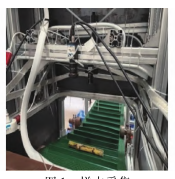

上图给出田间蔗种采集与室内拍摄的布置，蔗段在固定高度下成像，保证后续标注口径一致。

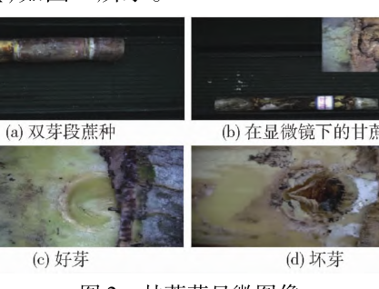

显微图像为好芽与坏芽的判定提供依据。为进一步扩充蔗芽特征数据集、提高模型鲁棒性和泛化能力，本文通过改变曝光度、添加高斯噪声、运动模糊 3 种图像处理技术随机组合的方式将数据集扩充 5 倍，增加到 30 000 幅，增强方式如下图所示。

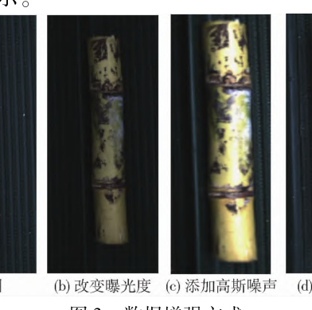

增强后数据集按照比例 8:1:1 随机划分为训练集、验证集以及测试集，各特征类别在三个子集中的数量分布见实验设置节的表 1，该数据集是后续所有改进模块与实验的统一输入。

### 预切种式 360° 蔗种筛选机

筛选机平台用于在蔗种滚动过程中提供连续图像流，是动态识别实验的载体。预切种式 360° 蔗种筛选机在课题组前期蔗芽 360° 动态识别筛选机基础上，选用无杆气缸替换旋转气缸、以 16 路晶体管继电器代替单片机，主要由输送带、摄像头、黑箱、无杆气缸、电机、辊轮及铝型材等结构组成，整机外观如下图所示。

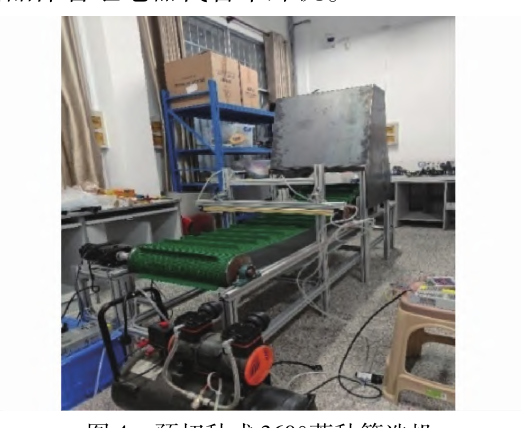

整机工作流程如下图所示：启动电机后由驱动器带动主辊轮转动，输送带向前持续不间断传送蔗种，蔗种在传送带倾斜最高点处向下翻滚，摄像头实时捕捉翻滚过程中的每帧图像并进行处理分析。

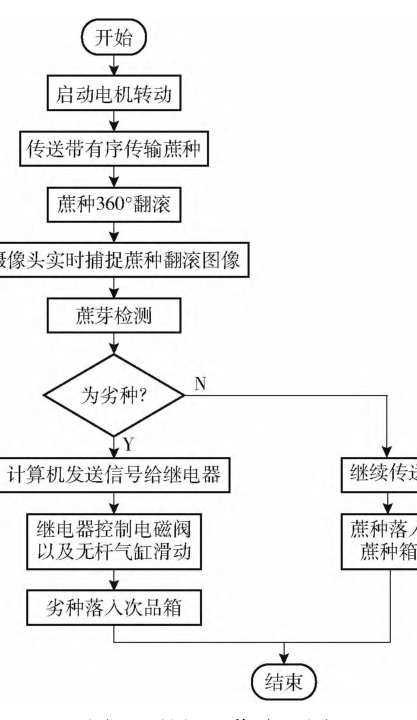

若识别结果为坏芽，计算机串口通过继电器使电磁阀使能，控制无杆气缸滑动，劣种顺挡板落入次品箱；若识别结果为好芽，则落入另一侧蔗种箱。该流程把模型推理嵌入机械动作闭环，分选正确率直接取决于检测精度与速度，由此引出下一节的网络改进。

### YOLO11n-EWL 整体架构

整体架构的目标是在基线 YOLO11n 上平衡检测精度与模型复杂度，使之满足低消耗、低功率的部署要求。本文以 YOLO11n 为基线，在骨干中用 C3k2-EIEM 模块替换原始 C3k2 模块、以 Wavelet pooling 替换原有池化下采样，在检测端换用 LSCDECD 检测头，模型名中的 E、W、L 即分别对应这三项改进，改进后的网络结构如下图所示。

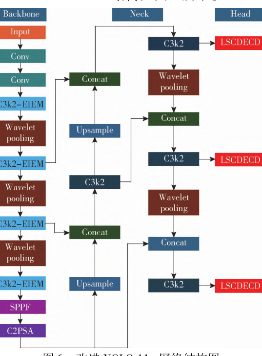

从图中可以看出，骨干自下而上依次堆叠 Conv、C3k2-EIEM 与 Wavelet pooling，并经 SPPF 与 C2PSA 输出多尺度特征；颈部通过 Concat 与 Upsample 完成特征融合，三个尺度的融合特征分别送入 LSCDECD 检测头。三项改进的位置与作用整理如下表所示。

| 改进（模型名后缀） | 网络位置 | 作用 |
| --- | --- | --- |
| E：C3k2-EIEM | 骨干，替换原始 C3k2 模块 | 融合 Sobel 边缘分支，提高蔗芽检测精度 |
| W：Wavelet pooling | 骨干与颈部的下采样，替换原有池化 | 提升检测精度的同时降低模型复杂度 |
| L：LSCDECD | 三个尺度的检测头 | 减少浮点运算量与参数量，提高检测速度 |

三个改进模块的结构细节在下文三个子节展开。

### C3k2-EIEM 边缘信息增强模块

C3k2-EIEM 模块用于让骨干同时具备提取空间语义信息与边缘结构信息的能力。Sobel 算子通过 2 个 3×3 卷积核分别提取图像在 x、y 方向的梯度，并最终合成梯度幅值图以突出边缘信息；相较 Canny 算子的多阶段处理流程，Sobel 更易于嵌入 CNN 架构且其梯度输出可直接用于构建空间注意力机制，相较 Laplacian 对噪声敏感的问题，Sobel 在保留边缘细节的同时具备更强的抗噪能力，更适合农业图像中蔗芽这类边缘模糊、背景复杂的检测任务。改进后的模块结构如下图所示。

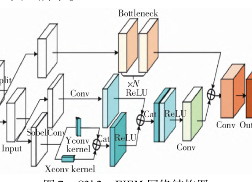

图中输入特征经 Split 分为两支：一支走常规 Conv 与 Bottleneck 提取空间信息，另一支走 SobelConv 分支，由 Xconv kernel 与 Yconv kernel 提取两个方向的边缘梯度，两支特征经 Cat 拼接与 ReLU 激活后再由 Conv 输出。该模块替换骨干中全部原始 C3k2 模块，其输出继续送入后续的 Wavelet pooling 下采样。

### 小波池化 Wavelet pooling

Wavelet pooling 用于替换基线模型中的池化下采样，克服最大池化易丢失图像细节、平均池化可能稀释关键特征的局限，也避免传统多尺度池化计算量显著增加的问题。该方法基于快速小波变换 FWT，在小波域内对输入特征图进行二阶离散小波分解，分解公式如下：

$$W_\varphi[j+1,k]=h_\varphi[-n]\,W_\varphi[j,n]\big|_{n=2k,\,k\le 0}$$

$$W_\theta[j+1,k]=h_\theta[-n]\,W_\theta[j,n]\big|_{n=2k,\,k\le 0}$$

其中各符号含义如下表所示。

| 符号 | 含义 |
| --- | --- |
| $\varphi$ | 近似函数 |
| $\theta$ | 细节函数 |
| $W_\varphi$ | 近似系数 |
| $W_\theta$ | 细节系数 |
| $h_\varphi[-n]$ | 时间反转缩放函数 |
| $h_\theta[-n]$ | 小波矢量 |
| $n$ | 求和索引变量 |
| $j$ | 分辨率级别 |

在图像上使用 FWT 时应用 2 次，1 次在行上、1 次在列上，组合执行后可获得每个分解级别的细节子带 LH、HL、HH 以及最高分解级别的近似子带 LL。高阶小波分解会显著增加计算量和参数规模，而二阶分解能够有效捕捉图像的主要结构信息 LL、水平边缘 LH、垂直边缘 HL 和对角线边缘 HH，满足大多数视觉识别任务的需求。模块网络结构如下图所示。

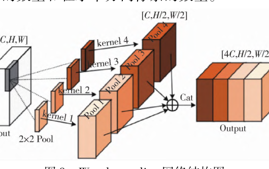

图中输入特征图的通道数量、垂直方向像素数量与水平方向像素数量分别记为 C、H、W，经 2×2 池化与 4 组小波核得到 4 个子带，拼接后通道数变为 4C、尺寸减半为 H/2 与 W/2。在二阶分解后，再使用二阶小波子带重建图像特征，重建公式如下：

$$W_\varphi[j,k]=h_\varphi[-n]\,W_\varphi[j+1,n]+h_\theta[-n]\,W_\theta[j+1,n]\big|_{n=\frac{k}{2},\,k\le 0}$$

其中符号含义与分解公式一致。直观上，分解-重建过程把下采样从「取最大或取平均」变为「按方向保留子带」，增强了模型对目标轮廓的感知能力，尤其适用于蔗芽这类边缘模糊、形状细长的目标；其输出特征图送入骨干下一层 C3k2-EIEM 或颈部融合节点。

### LSCDECD 轻量化检测头

LSCDECD 检测头用于在压缩浮点运算量与参数量的同时保持检测精度。YOLO11n 检测头采用解耦头，其模型运算量约占整个模型的 40%，解耦头包含 3 个分支，每 1 个分支由 3 个 3×3 卷积层以及 2 个 1×1 卷积层组成，需遍历这些卷积层才能实现目标检测；本文对轻量化共享卷积检测头 LSCD 使用细节增强卷积 DEC 进一步改进，LSCD 采用通道分组归一化 Group Norm 并通过共享卷积大幅减少参数量，DEC 则利用缩放层 Scale 对特征进行缩放，以应对每个检测头所检测目标尺度不一致的问题。其网络结构如下图所示。

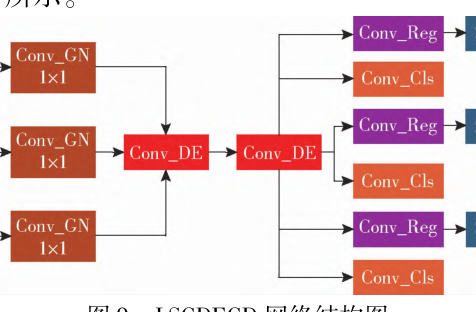

图中 P3、P4、P5 三个尺度特征先经 1×1 的 Conv_GN 归一化压缩，汇入共享的 Conv_DE 细节增强卷积，再为每个尺度分出 Conv_Reg 回归支与 Conv_Cls 分类支，回归支后接 Scale 层。该检测头接收颈部三个尺度的融合特征并输出蔗芽的类别与位置，在对蔗芽进行检测时不仅减少了浮点运算量和参数量，精度也有所提升，是整网的最后一个模块。

## 实验结果

### 实验设置

模型训练与测试均在 Windows 11 操作系统环境下完成，硬件采用 AMD Ryzen 7840H 中央处理器与 NVIDIA GeForce RTX 4060 独立显卡，软件基于 PyTorch 2.2.2 深度学习框架与 Python 3.10.16；初始学习率设置为 0.001，输入图像尺寸统一调整为 640 像素×640 像素，整个训练过程共设定为 300 个迭代周期。评价采用精确率 P、召回率 R、mAP@0.5、参数量、帧率 FPS 以及浮点运算量等指标。数据集各特征类别在训练集、验证集与测试集中的分布如下表所示。

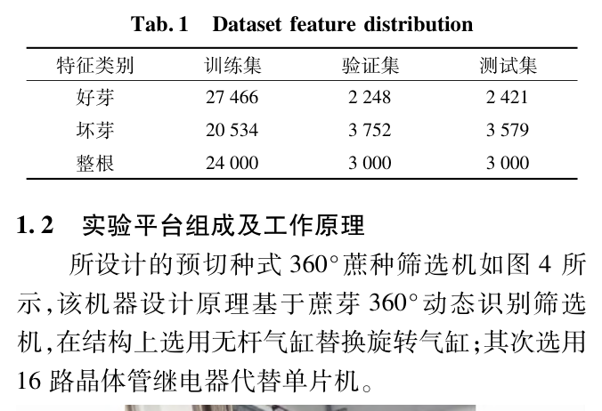

表中好芽、坏芽、整根三类样本在三个子集上的数量与 8:1:1 的划分比例一致，为后续消融实验与对比实验提供统一基准。

### 可视化分析

8 个模型在同一批堆叠蔗段图像上输出的检测框与置信度如下图所示。

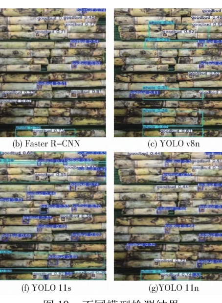

从图中可以看出，各子图在相同蔗段堆叠场景下给出好芽与坏芽的检测框，YOLO11n-EWL 子图的检测框覆盖更完整、置信度更高，与后文表 3 的定量结果相互印证。

### 主流模型对比

为进一步验证改进后模型的优越性，本文将 YOLO11n-EWL 与 7 个主流目标检测模型进行比较，结果如下表所示。

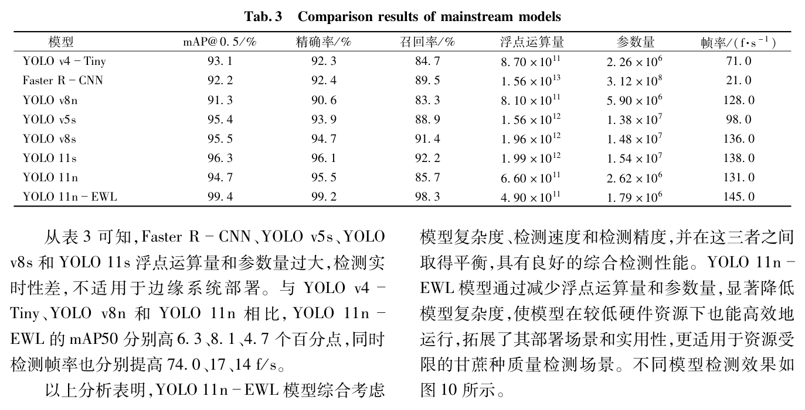

从表 3 可知，Faster R-CNN、YOLOv5s、YOLOv8s 和 YOLO11s 浮点运算量和参数量过大、检测实时性差，不适用于边缘系统部署；与 YOLOv4-Tiny、YOLOv8n 和 YOLO11n 相比，YOLO11n-EWL 的 mAP@0.5 分别高 6.3、8.1、4.7 个百分点，同时检测帧率也分别提高 74.0、17、14 f/s。可见 YOLO11n-EWL 综合考虑模型复杂度、检测速度和检测精度并在这三者之间取得平衡，更适用于资源受限的甘蔗种质量检测场景。

### 消融实验

消融实验按 E、W、L 三项改进逐一替换基线对应组件：YOLO11n-E 为使用 C3k2-EIEM 模块替换原始 C3k2 模块，YOLO11n-W 为将池化模块替换为 Wavelet pooling，YOLO11n-L 为将检测头替换为 LSCDECD 检测头，结果如下表所示。

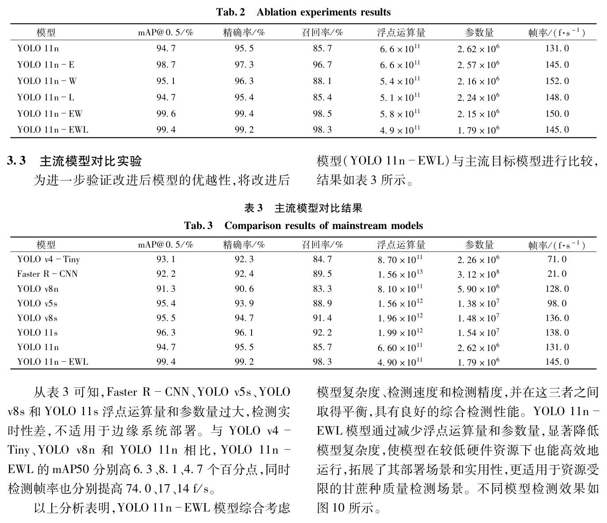

从表 2 可以看出，使用 C3k2-EIEM 模块替换原始 C3k2 模块使模型的 mAP@0.5、精确率和召回率分别提高 4.0、1.8、11 个百分点；使用 Wavelet pooling 使模型浮点运算量和参数量分别减小 18.2% 和 17.6%；使用 LSCDECD 检测头使二者分别减小 22.7% 和 14.5%；三者组合的 YOLO11n-EWL 相较基线 mAP@0.5、精确率和召回率分别提升 4.7、3.7、12.6 个百分点，浮点运算量和参数量分别减小 25.8% 和 31.7%，帧率提高 14 f/s，表明三项改进在精度与复杂度上互为补充。

### 整机部署与动态识别实验

动态识别效果受输送带速度、环境光照强度和相机曝光时间三个关键因素影响，其中输送带速度直接影响图像运动模糊程度。实验选用海康 MV-CS020-10UC 工业相机（200 万像素、CMOS 全局快门、90 f/s）与手动切种的 100 段双芽段甘蔗种共 200 个蔗芽，在筛选机上开展，实验准备如下图所示。

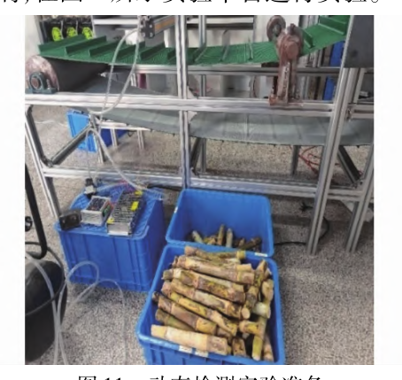

为精确控制输送带速度，将步进电机驱动器拨码开关设为 1 600 p/r，并通过 KH-01 型控制器输入不同频率脉冲信号调节转速，测量输送带运行 1 m 所需时间计算对应速度，标定结果如下表所示。

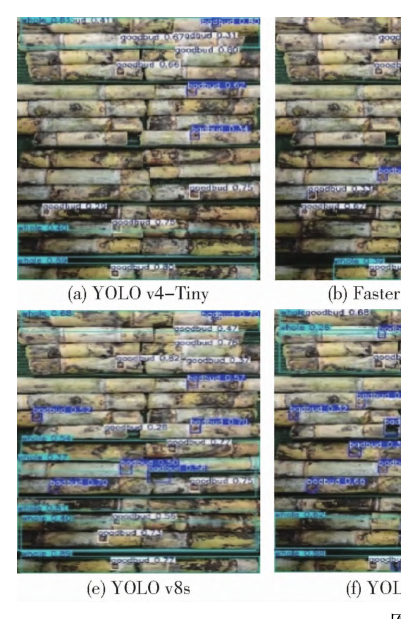

在 7 种速度下探究蔗芽动态识别效果与输送带速度之间的关系，结果如下表所示。

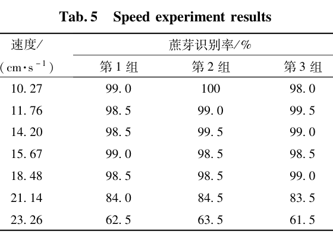

由表 5 可知，当输送带速度大于 18.48 cm/s 时蔗芽识别率显著降低，速度为 18.48 cm/s 时蔗芽动态识别率最合适。

### 光照与曝光单因素实验

亮度直接影响图像质量以及后续处理效果，亮度太低图像昏暗、细节丢失，亮度过高则图像过曝、同样丢失细节。7 种光照强度下的识别率结果如下表所示。

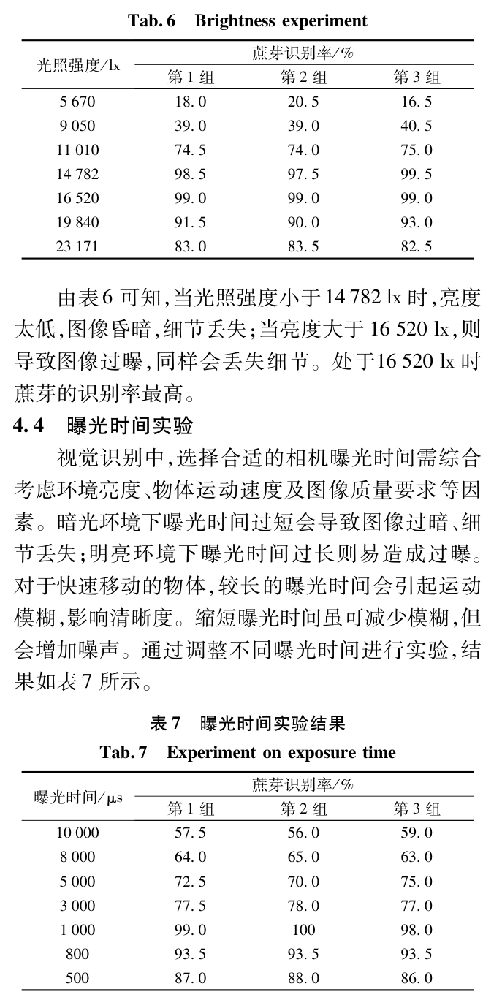

由表 6 可知，当光照强度小于 14 782 lx 时亮度太低、细节丢失，当亮度大于 16 520 lx 时图像过曝，处于 16 520 lx 时蔗芽的识别率最高。曝光时间方面，较长的曝光时间会引起运动模糊、过短则会增加噪声，7 种曝光时间下的结果如下表所示。

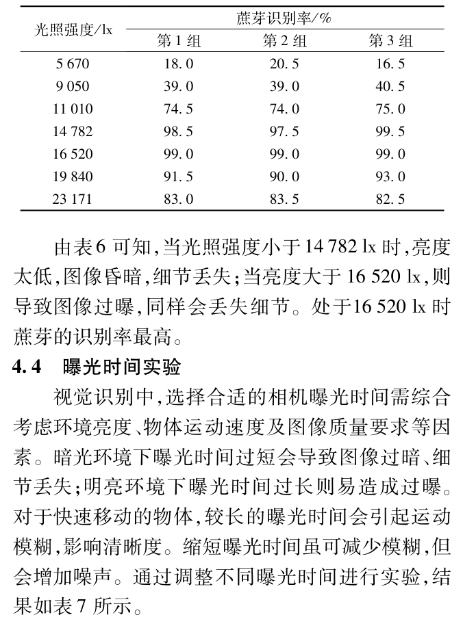

由表 7 可知，当相机曝光时间为 1 000 μs 时蔗芽识别率最高。

### 正交实验与参数优化

为系统评估三因素及其不同水平对蔗芽动态识别效果的影响，本文进行三因素三水平正交实验设计，并使用 SPSSAU 软件进行正交实验分析，因素水平如下表所示。

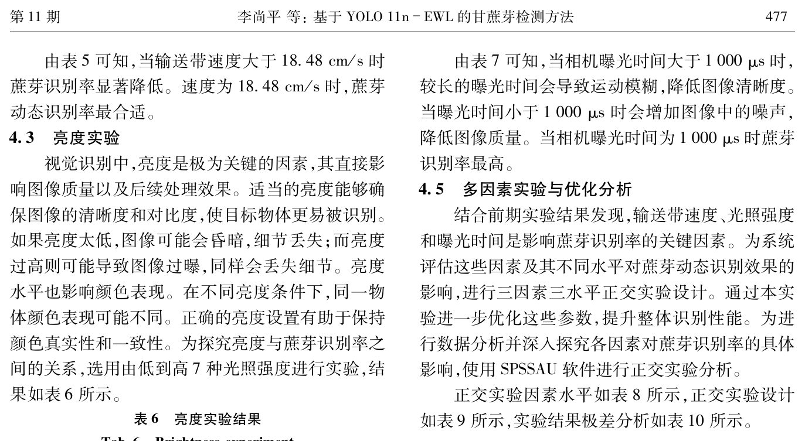

正交实验设计与各组识别率结果如下表所示。

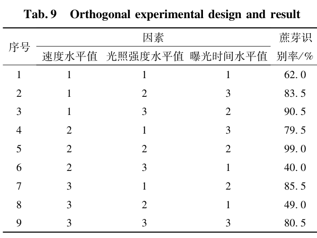

实验结果的极差分析如下表所示。

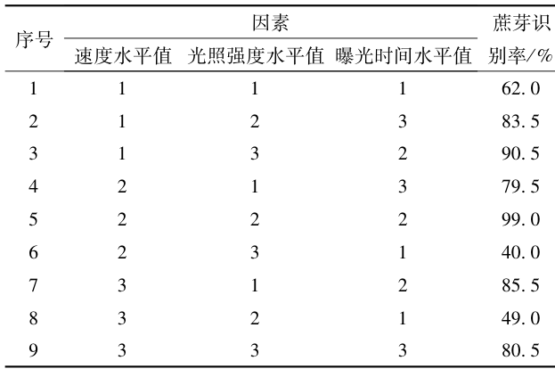

由表 10 可知，3 个因素对蔗芽识别率的影响由大到小依次为曝光时间、速度、光照强度，最优实验水平为 1、2、2，即速度、光照强度和曝光时间分别为 15.67 cm/s、16 520 lx 和 1 000 μs；结合生产节拍要求，当速度、光照强度和曝光时间分别为 18.48 cm/s、16 520 lx 和 1 000 μs 时生产效果最佳，蔗芽识别率可达到 99.0%，平均每小时识别蔗种 4 522 段，验证了整机方案在真实产线节奏下的可用性。

## 优点和创新点

个人认为，本文有如下一些优点和创新点可供参考学习：

1. 针对蔗芽边缘模糊的特点，将 Sobel 算子嵌入 C3k2 模块构造 C3k2-EIEM，使骨干同时提取空间语义与边缘结构信息，mAP@0.5 提升 4.0 个百分点。
2. 用小波池化和 LSCDECD 检测头替换基线的池化方式与解耦头，在精度上升的同时把浮点运算量和参数量分别压缩 25.8% 和 31.7%，适合边缘系统部署。
3. 围绕速度、光照强度和曝光时间开展单因素与正交实验，把模型指标落到整机动态识别率 99.0% 与每小时 4 522 段的生产节拍上，实验链条完整、说服力强。
