# Ultralytics YOLO26: Unified Real-Time End-to-End Vision Models

Paper Reading 是从个人角度进行的一些总结分享，受到个人关注点的侧重和实力所限，可能有理解不到位的地方。具体的细节还需要以原文的内容为准，博客中的图表若未另外说明则均来自原文。

| 论文概况 | 详细 |
| --- | --- |
| 标题 | 《Ultralytics YOLO26: Unified Real-Time End-to-End Vision Models》 |
| 作者 | Glenn Jocher、Jing Qiu、Mengyu Liu、Shuai Lyu、Fatih Cagatay Akyon、Muhammet Esat Kalfaoglu |
| 发表会议 | 未获取（arXiv 预印本，编号 arXiv:2606.03748） |
| 会议等级 | 未获取 |
| 发表年份 | 2026 |
| 论文代码 | github.com/ultralytics/ultralytics |

作者单位：

1. Ultralytics

## 研究动机

实时目标检测是工业界部署最广的视觉任务之一，表现为在严格时延与功耗预算内对图像目标完成定位与分类，直接支撑自动驾驶、机器人、监控与增强现实等应用。YOLO 家族凭借标准卷积算子带来的全平台导出能力与多任务统一流水线，长期保持主流地位，但是当前 YOLO 系检测器仍存在四个互相独立的结构性局限：

1. **NMS 依赖与双头训练不充分**：多数 CNN 检测器推理期仍依赖非极大值抑制，YOLOv10 的双头设计虽去掉 NMS，但训练全程对一对一分支与一对多分支施加相同损失权重，唯一用于推理的一对一分支反而欠训练；
2. **DFL 参数膨胀与回归范围受限**：Distribution Focal Loss 把每条边的回归从标量扩展为几十个 logits，显著抬高检测头参数量，且离散支撑集给回归距离设了上界，高分辨率下对大目标尤其不利；
3. **训练周期过长**：标准 SGD 配方需要约 600 个 epoch 才能达到有竞争力的 COCO 精度，快速迭代代价高昂，而大语言模型训练中已验证高效的 Muon 优化器尚未被引入检测；
4. **小目标零分配**：TAL 标签分配要求锚点中心落在真值框内，下采样后极小目标的框内可能不含任何锚点中心，从而拿不到正样本与梯度信号。

暂未有工作在同一个 YOLO 家族内，从架构与训练两个层面对这四类局限给出协同的解答。

## 文章贡献

针对上述局限，本文提出了 Ultralytics YOLO26，一个统一实时视觉模型家族。其核心是架构与训练的协同改造：架构上采用双头设计原生支持免 NMS 的端到端推理，并完全移除 DFL，得到更轻、回归范围不受限的检测头；训练上以 MuSGD 混合优化器、Progressive Loss 课程式重加权与 STAL 小目标感知标签分配三个组件联合提升精度并压缩训练成本。本文首先给出共享检测器的端到端公式与轻量回归头，接着为实例分割、姿态估计与旋转框检测设计任务专用的头与损失，最终把同一套改进扩展到开放词汇的 YOLOE-26。实验表明，YOLO26 在 COCO 上以 1.7 到 11.8 ms 的 T4 TensorRT 延迟取得 40.9 到 57.5 mAP，推进了精度-延迟 Pareto 前沿；相比 YOLO11，实例分割 mask AP 最高提升 3.7，姿态 AP 最高提升 7.2，DOTA-v1.0 旋转框 mAP 最高提升 3.4，YOLOE-26x 在 LVIS minival 文本提示下达到 40.6 AP。

## 本文方法

YOLO26 建立在 YOLO11 家族之上，围绕端到端简洁性、部署效率与更强优化三个目标组织设计。训练流水线的整体交互如下图所示。

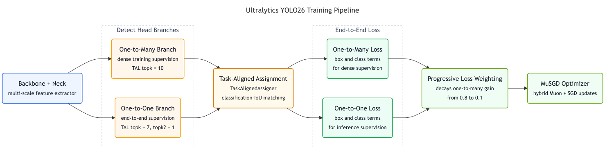

图中共享骨干与颈部同时喂给一对多与一对一两个检测分支，任务对齐分配器为两条分支生成不同基数的监督，Progressive Loss 随训练推进衰减一对多分支的权重，MuSGD 完成最终参数更新；STAL 则在分配环节保证极小目标的正样本覆盖。主要组件与代码实现的对应关系如下表所示。

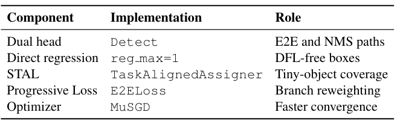

表中双头、直接回归、STAL、Progressive Loss 与 MuSGD 分别对应仓库中的 Detect 头、reg max=1 设置、TaskAlignedAssigner、E2ELoss 与 MuSGD 优化器，下面按模块逐一展开。

### 双头端到端检测架构

双头设计的目标是在同一模型内同时提供免 NMS 的端到端解码与常规稠密预测两条推理路径，把精度-延迟的取舍交给部署侧。一对一头为默认路径，输出固定大小的预测集合，每张图最多 300 个检测框（形状为 (N, 300, 6)）；沿用 YOLOv10 的一致性双路标签分配，两条分支共用同一 TAL 公式但匹配基数不同：一对一路径先以 topk = 7 构造 TAL 候选集，再施加 topk2 = 1 的二次过滤，为每个真值实例产生唯一的端到端分配。一对多头保留标准稠密 YOLO 式预测，使用 topk = 10 的 TAL 提供更丰富的正样本监督，输出形状为 (N, nc + 4, 8400)，其中 nc 为类别数，推理期需要 NMS，通常精度略高但带后处理开销。该模块的输出分别进入两条分支损失，是 Progressive Loss 重加权的直接对象。

### DFL 移除与直接回归

DFL 移除的目标是砍掉检测头中最重的回归组件，同时用训练侧手段补回定位质量。DFL 把每条框边预测为 K 个离散 bin 上的分布，再以期望解码：

$$d = \sum_{i=0}^{K-1} i \cdot \mathrm{softmax}(z)_i, \quad z \in \mathbb{R}^K$$

| 符号 | 含义 |
| --- | --- |
| $z$ | 回归分支输出的 logits 向量 |
| $K$ | 离散 bin 数，通常取 16 |
| $d$ | 解码后的单边距离 |

这把每个空间位置的回归从 4 个标量膨胀为 4K 个 logits；同时 d 的取值被限制在 [0, K−1]，乘以 stride s 后单边最大距离为 (K−1)s 像素，K=16 时约 30s（s=32 时约 960 像素），在 1280 分辨率下对大目标构成硬约束。YOLO26 直接以标量回归加 L1 损失替代 DFL，定位质量交给 Progressive Loss 与 STAL 补偿；移除 DFL 还简化了导出，对偏好标准算子的受限运行时更友好。该决策的定量与定性证据见实验节的 DFL 消融。

### MuSGD 优化器

MuSGD 的目标是把大语言模型训练中验证过的 Muon 正交化更新引入检测器训练，同时保留 SGD 的稳健性。Muon 先做动量更新，再对动量导出的更新做少量 Newton-Schulz 迭代近似正交化，改善更新的条件数并稳定优化。MuSGD 对多维参数（卷积核与线性权重）施加 Muon 更新与 SGD 更新的加权混合，对偏置与归一化缩放等一维参数则使用纯 SGD，使尺度/位移参数保持稳定、高维权重张量享受正交化更新。该优化器作用于全网络参数，是训练流水线中最后一步参数更新的执行者。

### Progressive Loss 课程式重加权

Progressive Loss 用于解决双头检测器固有的优化不对称：稠密一对多分支正样本多、早期易优化，而一对一分支约束强却最终决定端到端推理行为，固定相同权重会让推理分支欠优化。总检测损失写为：

$$L_{total} = \alpha(t) L_{one2many} + (1 - \alpha(t)) L_{one2one}$$

其中 $t$ 为当前 epoch，$\alpha(t)$ 为线性递减调度：

$$\alpha(t) = \max\left(1 - \frac{t}{\max(E-1, 1)}, 0\right)(\alpha_{init} - \alpha_{final}) + \alpha_{final}$$

| 符号 | 含义 |
| --- | --- |
| $E$ | 训练总 epoch 数 |
| $\alpha_{init}$、$\alpha_{final}$ | 一对多分支的初始与最终权重 |
| $L_{one2many}$、$L_{one2one}$ | 稠密分支与端到端分支的损失 |

实现中权重从 (0.8, 0.2) 线性过渡到 (0.1, 0.9)，每个 epoch 更新一次。给出一个简单的例子，假设 E=101、α_init=0.8、α_final=0.1，则 t=0 时 α=0.8，t=50 时 α=0.5×0.7+0.1=0.45，t=100 时 α=0.1，一对一分支权重 1−α 相应地从 0.2 升到 0.9。可以看到，优化重心随训练平滑地从稠密监督转向与部署一致的端到端监督。

### STAL 小目标感知标签分配

STAL 的目标是消除 TAL 在极小目标上的零正样本病理：候选过滤只要求锚点中心落在真值框内，下采样后过小的框可能不含任何锚点中心。STAL 把候选选择所用的几何与回归所用的几何解耦，仅在候选过滤阶段构造分配代理框：

$$\tilde{d}_i = \begin{cases} s_{ref}, & d_i < s_{min} \\ d_i, & \text{otherwise} \end{cases}, \quad d_i \in \{w_i, h_i\}$$

其中 $s_{min}$ 为特征金字塔最小 stride，$s_{ref}$ 为取自金字塔的固定参考尺寸（实现中取第二级 stride，即 s_min=8、s_ref=16），代理框 $\tilde{g}_i = (x_i, y_i, \tilde{w}_i, \tilde{h}_i)$ 只用于生成二值候选掩码 $M_{ij}$：锚点中心 $a_j$ 落在 $\tilde{g}_i$ 内记 1，否则记 0。例如一个宽 5 像素的真值框，其宽度小于 8 而被钳到 16，stride 8 特征层上原本落空的锚点中心重新成为候选；而任务对齐打分、最终分配与框回归仍使用原始框，监督不被放大。STAL 因此是刻意保守的修补，只防止极小目标被分配流水线整体丢弃，其输出掩码交给 TAL 继续完成打分与匹配。

### 任务专用扩展

任务专用扩展在共享骨干与颈部之上，为分割、姿态与旋转框三类任务定制头与监督。实例分割保留原型-系数重建规则 $\hat{M}_i = \sum_{k=1}^{K} c_{ik} P_k$，即每个实例用系数向量对共享原型张量做线性组合；YOLO26 的改动是把原型生成从最高分辨率单层特征改为多尺度融合：

$$F_{proto} = X_1 + \sum_{\ell=2}^{L} U(\phi_\ell(X_\ell))$$

其中 $\phi_\ell(\cdot)$ 为可学习的 1×1 投影，$U(\cdot)$ 把特征上采样到 $X_1$ 的空间分辨率，融合特征再经原型生成栈得到共享原型张量；同时在 $F_{proto}$ 上挂一个仅训练期的辅助语义分割分支，以 BCE+Dice 目标提供稠密类别梯度，评估与模型融合时该分支被移除，不引入推理开销。姿态估计在 OKS 损失之外引入 RLE：sigma 分支为每个关节预测逐轴不确定度 $\sigma = (\sigma_x, \sigma_y)$，坐标残差归一化为：

$$\varepsilon = \frac{\hat{x} - x^*}{\sigma}$$

其中 $\hat{x}$ 为预测关节位置，$x^*$ 为真值；共享的 RealNVP 归一化流估计归一化残差的对数密度 $\log \varphi(\varepsilon)$，训练目标为：

$$L_{RLE} = \log \sigma - \log \varphi(\varepsilon) + \underbrace{\log(2\sigma) + |\varepsilon|}_{-\log \mathrm{Laplace}(\hat{x}; x^*, \sigma)}$$

其中残差项锚定不确定度尺度、稳定训练早期；预测 σ 较高的被遮挡或歧义关节被自动降权，而不是被丢弃。旋转框检测把角度定义从 OpenCV 的 (0, 90°] 改为 MMRotate 的长边定义 [−45°, 135°)，宽度约束大于高度，缓解 0° 与 90° 附近的边交换不连续；角度不再经 sigmoid 压缩（旧式 $\hat{\theta} = (\sigma(z)-0.25)\pi$），而是直接回归 $\hat{\theta} = z$。针对方形目标 ProbIoU 对角度不敏感的问题，角度损失定义为：

$$L_{angle} = \frac{1}{S} \sum_{i \in F} q_i \omega_i \sin^2\big(2 \tilde{\Delta\theta}_i\big), \quad \omega_i = \exp\left(-\frac{\log^2(w^*_i / h^*_i)}{\lambda^2}\right)$$

| 符号 | 含义 |
| --- | --- |
| $\tilde{\Delta\theta}_i$ | 模 π 意义下的角度残差，$\tilde{\Delta\theta}_i = \Delta\theta_i - \mathrm{round}(\Delta\theta_i / \pi)\pi$ |
| $F$、$q_i$ | 前景分配集合与 TAL 给出的分配权重 |
| $\omega_i$ | 由目标框宽高比计算的感知因子，$\lambda$ 为超参数 |

细长框的 ω_i 较小、仍主要由旋转 IoU 损失约束，方形与近方形框则由双倍角惩罚提供辅助监督。三条扩展与共享检测器改进叠加，构成统一的五任务模型家族，并支持 19 种非 PyTorch 导出目标。

## 实验结果

### 实验设置

检测基准为 MS COCO，采用两阶段配方：全部规模先在 Objects365-v1 上预训练 150 个 epoch，再在 COCO 上微调，微调轮数按 n/s/m/l/x 分别为 245/70/80/60/40 个 epoch，两阶段全局 batch size 均为 128；分割与姿态在 COCO 对应子集上评估，旋转框在 DOTA-v1.0（2,806 图、188,282 实例、15 类，切 1024×1024 重叠图块）上评估，开放词汇在 LVIS minival 上评估。指标为 mAP50:95（E2E 与 Non-E2E 两种口径）、AP50、AP_S/AP_M/AP_L、参数量、FLOPs 与延迟，速度报告 CPU ONNX（Intel Xeon @ 2.00 GHz）与 T4 TensorRT10 两个口径。

### 对比实验

COCO val2017 上的精度-延迟权衡如下图所示。

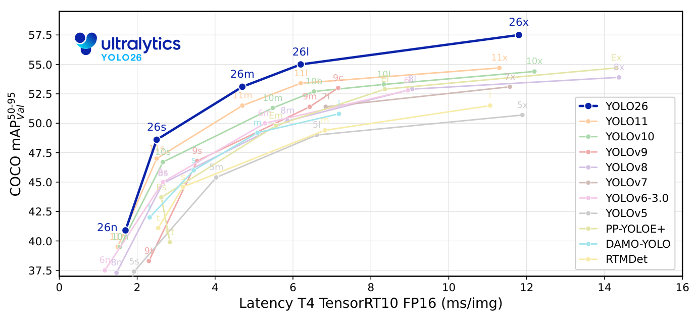

YOLO26 各变体落在或推进了相对先前 YOLO 版本与其他实时检测器的 Pareto 前沿，在 m/l/x 规模上 AP-延迟权衡最强；同规模下相比 YOLO11 提升 1.6 到 2.8 个 AP。发布模型的完整基准如下表所示。

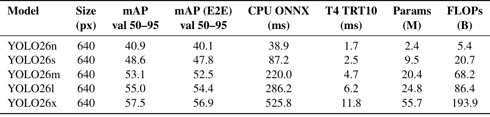

五个规模的 mAP 为 40.9 到 57.5，对应 T4 TensorRT10 延迟 1.7 到 11.8 ms；端到端一对一路径仅比 NMS 路径低 0.6 到 0.8 AP，部署侧可按需二选一。与近期实时检测器的分组对比中，YOLO26 在标准 NMS 工作点上给出总体最强的 AP-延迟权衡，在 m、l、x 组取得最佳 AP 且延迟保持竞争力。

### 可视化分析

三组定性效果图分别对应三个核心组件的失效场景。DFL 移除的定性对比如下图所示，每行从左到右为带 DFL 模型、去 DFL 模型与真值标注。

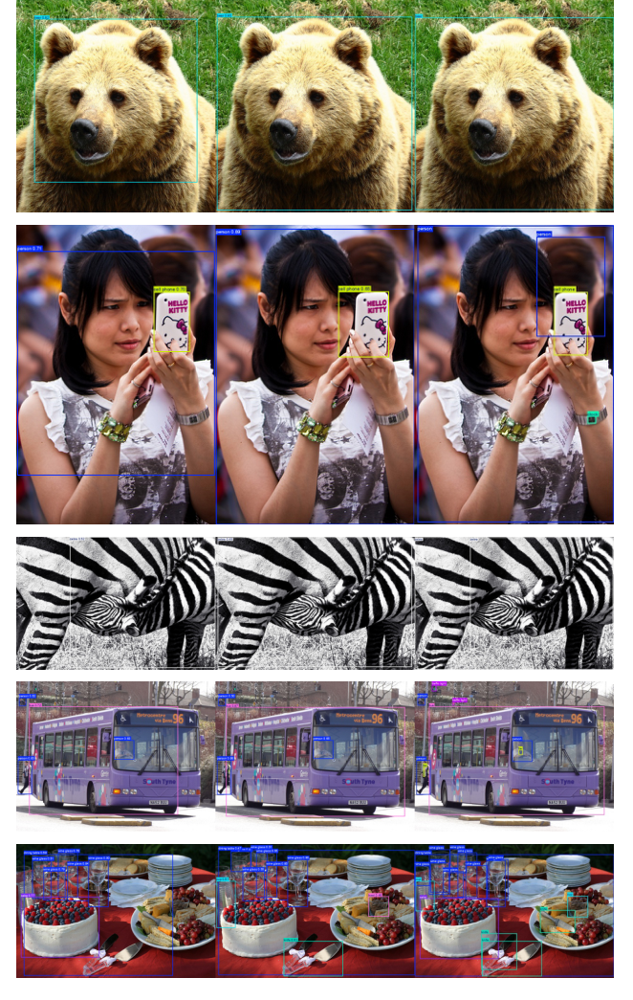

在 1280 分辨率下，去 DFL 的头更完整地保留了大目标的全部轮廓，带 DFL 的预测则倾向于截断目标边界，与定量表中 APL 的提升相互印证。STAL 的定性对比如下图所示，从左到右为 TAL 基线、s_ref=16 的 STAL 与真值。

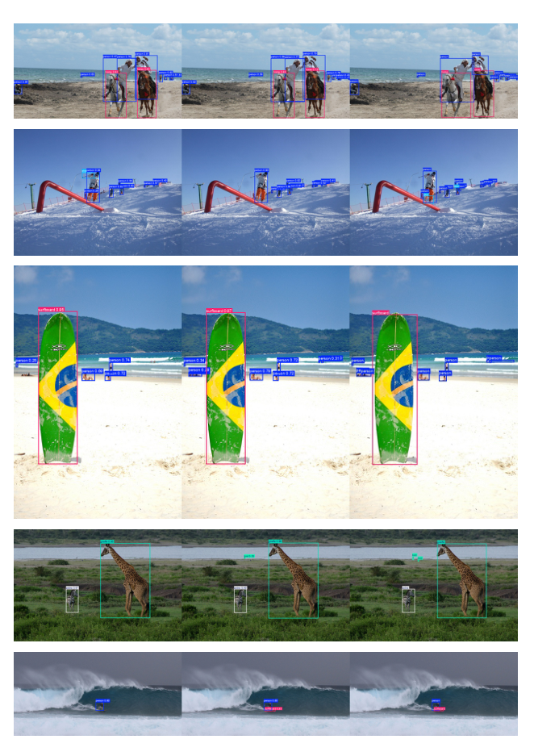

TAL 基线在密集小目标处出现漏检与松散定位，STAL 通过保证极小真值框的锚点覆盖减少了漏检，框也更贴近真值。旋转框的定性对比如下图所示，绿框为真值、红框为预测。

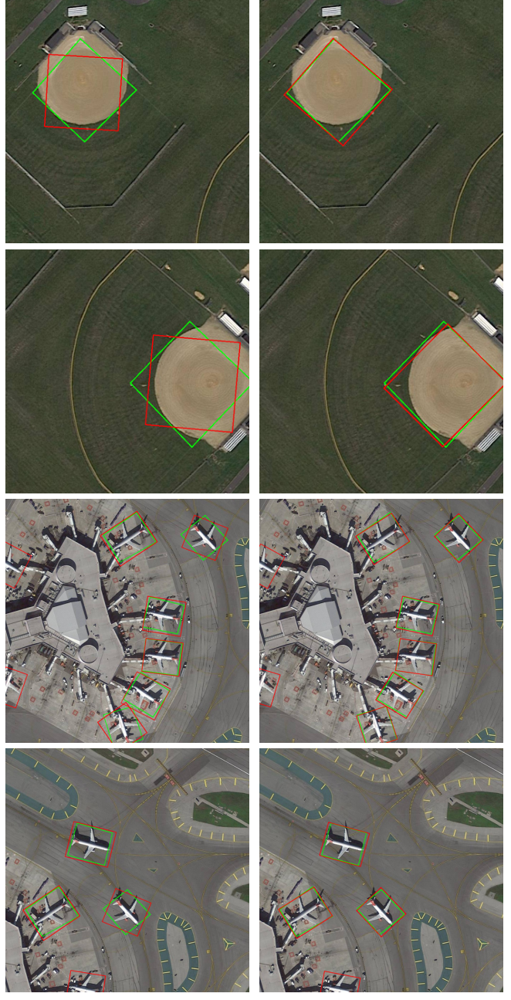

YOLO11x-obb 在方形旋转对象上角度预测明显偏斜，YOLO26x-obb 的角度与真值对齐更好，与 AP75 增益大于 AP50 增益的定量现象一致。

### 消融实验

从 YOLO11s 到 YOLO26s 的逐步消融如下表所示。

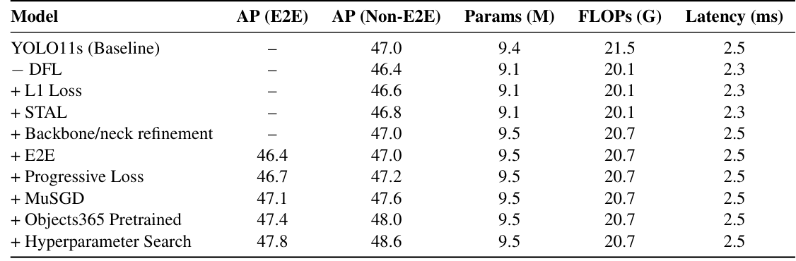

移除 DFL 使 Non-E2E AP 从 47.0 降到 46.4，但 L1 损失、STAL 与骨干/颈部精炼各补回 0.2，最终在参数量减 0.3 M、FLOPs 减 1.4 G、延迟减 0.2 ms 的同时持平基线；受控的 640/1280 对比中，去 DFL 在两种分辨率下都提升 AP，APL 增益从 640 的 +1.0 扩大到 1280 的 +2.2，表明 DFL 的有限支撑在高分辨率下已成为回归瓶颈。Progressive Loss 调度消融如下表所示。

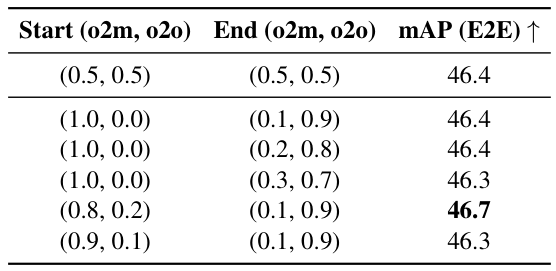

固定等权基线为 46.4 E2E AP，(0.8, 0.2) 到 (0.1, 0.9) 的默认调度达到最佳的 46.7，而从 (1.0, 0.0) 或 (0.9, 0.1) 起步均更差，表明一对一分支需要从一开始就保留非零监督。STAL 参考尺寸消融如下表所示。

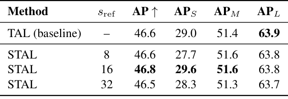

s_ref=16 取得最佳的 46.8 AP，AP_S 从 29.0 升到 29.6；s_ref=8 调整过弱反而拉低 AP_S，s_ref=32 放大过度开始扭曲尺度先验。MuSGD 在 COCO 上从头训练以 500 个 epoch 达到 47.4 mAP，超过 SGD 600 个 epoch 的 47.0，epoch 数减少 16.7%；角度损失超参消融中 λ=3 取得最高 50.2 mAP，全部带角度损失的配置都优于不用的 49.0。

### 效率与部署

部署流水线如下图所示。

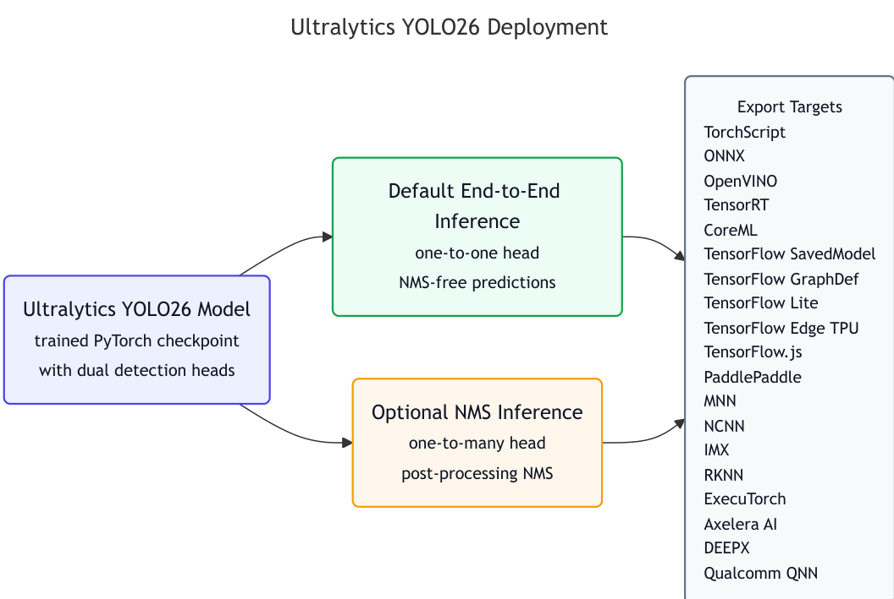

训练得到的同一 checkpoint 既可走默认的一对一免 NMS 路径，也可走可选的一对多 NMS 路径；不支持端到端解码所需 top-K 算子的运行时在导出时自动回退到非端到端分支。架构层面 YOLO26n 相对 YOLO11n 在 ONNX 格式下 CPU 推理最多快 43%（Intel Xeon @ 2.00 GHz），模型尺寸与内存占用同步下降，对无 GPU 的边缘场景尤其友好；导出目标覆盖 TorchScript、ONNX、OpenVINO、TensorRT、CoreML、TFLite、NCNN、RKNN、ExecuTorch 等 19 种非 PyTorch 格式。

### 开放词汇结果

YOLOE-26 在 YOLOE 公式之上引入骨干升级、分割解耦训练、文本编码器升级（MobileCLIP2）与伪标签数据引擎四项改动，LVIS minival 上的逐步消融如下表所示。

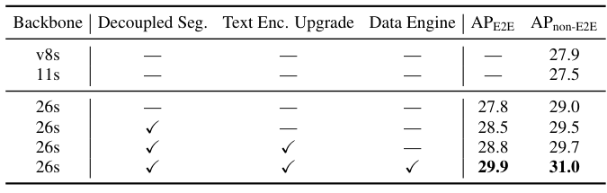

从 YOLOE-11s-TP 的 27.5 AP（non-E2E）出发，骨干升级带来 +1.5，分割解耦 +0.5，编码器升级 +0.2，数据引擎贡献最大的 +1.3，最终达到 29.9/31.0 AP（E2E/non-E2E）。最大模型 YOLOE-26x 在文本提示下达到 40.6 AP、视觉提示下 38.5 AP，轻量级 YOLOE-26n 仅 3.9 M 参数也有 24.7 AP，表明检测器与开放词汇两侧的改进可以叠加。

## 优点和创新点

个人认为，本文有如下一些优点和创新点可供参考学习：

1. 把端到端推理与稠密预测改造为同一模型内的双路径可选设计，配合 Progressive Loss 让训练重心逐步对齐免 NMS 推理路径，部署侧可按算力自由取舍。
2. 从训练配方视角统一引入 MuSGD、Progressive Loss 与 STAL 三个互补组件，并以逐步消融逐项归因各增益，500 个 epoch 即超过 SGD 600 个 epoch 的精度。
3. 实验丰富、说服力强：覆盖检测、分割、姿态、旋转框与开放词汇五类任务，给出 Pareto 前沿、多硬件延迟与三组定性效果图组，定量与定性互相印证。
