# 基于改进 YOLOv10n 的复杂田间小麦幼苗检测和计数方法

Paper Reading 是从个人角度进行的一些总结分享，受到个人关注点的侧重和实力所限，可能有理解不到位的地方。具体的细节还需要以原文的内容为准，博客中的图表若未另外说明则均来自原文。

| 论文概况 | 详细 |
| --- | --- |
| 标题 | 《基于改进 YOLOv10n 的复杂田间小麦幼苗检测和计数方法》 |
| 作者 | 李慎可，朱俊科，黄傲群，唐志成，杨宁，杜常亮，朱雨昕，兰玉彬 |
| 发表期刊 | 《农业工程学报》 |
| 期刊等级 | 未获取 |
| 发表年份 | 2026 |
| 论文代码 | 未获取 |

作者单位：

1. 山东理工大学农业工程与食品科学学院，淄博 255000
2. 齐鲁师范学院生命科学学院，济南 250200
3. 山东理工大学生态无人农场研究院，淄博 255000
4. 山东省农业航空智能装备工程技术研究中心，淄博 255000
5. 山东农业大学农学院，泰安 271000

## 研究动机

小麦幼苗的检测和计数是小麦苗期管理与育种的重要问题，表现为出苗数量直接关系到分蘖能力、光合效率及最终产量，也是计算出苗率、衡量种子活力、土壤环境与播种技术的重要依据，导致田间对出苗情况的精准监测需求持续存在。然而传统检测方法依赖人工田间调查，存在效率低、主观性强、难以规模化等弊端。深度学习检测模型引入农业后，已有小麦幼苗研究多通过叶尖、根茎部等局部特征实现检测计数，但幼苗重叠会导致局部信息丢失，增加错检与漏检风险；同时小麦幼苗叶片尺寸微小且形态相似，易于混淆与漏检，农田背景复杂，光照变化、阴影遮挡及植株重叠使特征提取困难；实时监测需求又对模型参数与计算复杂度提出更高要求。暂未有工作从整体特征建模与多尺度特征增强的角度同时化解微小重叠目标与复杂背景带来的漏检错检问题，本文即从这一空白切入。

## 文章贡献

针对复杂田间环境下小麦幼苗目标微小、分布密集、相互遮挡导致的漏检与错检问题，本文提出了基于 YOLOv10n 的改进算法 DSM-YOLOv10。其核心是 DCC2f、SDI 与 MSDA 三个模块的协同优化。首先引入双卷积 DualConv 构建 DCC2f 模块，替代骨干网络中的 C2f 结构，以减少冗余计算并增强特征融合能力；接着采用 SDI 语义细节融合模块替换颈部网络的 Concat 操作，将高层语义信息显式注入底层细节特征，实现语义指导下的细节增强，提升重叠区域特征的解耦与复用能力；最终引入 MSDA 多尺度空洞注意力机制强化多尺度特征表达，提升模型对幼苗交叉重叠的理解能力。实验表明，该模型在自建小麦幼苗数据集上平均精度均值、精确率、召回率和 F1 分数分别达到 91.4%、85.2%、81.7% 和 83.4%，参数量和浮点运算量较 YOLOv10n 分别减少 4.7% 和 10.7%，推理时间降至 13.2 ms，计数任务的决定系数、均方根误差和平均绝对误差分别为 0.92、5.68 株和 4.33 株。

## 本文方法

### 数据集构建与增强

数据集构建的目标是为小麦幼苗检测提供覆盖复杂田间变化的训练样本。冬小麦试验田位于山东省淄博市山东理工大学生态无人农场，于 2024 年 10 月 24 日使用 DJI MAVIC 3M 无人机搭载可见光相机采集图像，飞行高度设为 0.8 m、云台倾斜 45° 拍摄，原始分辨率为 5280×3956 像素，随机裁剪为 640×640 像素并人工筛选后得到 1760 张初始图像，再用 LabelImg 软件进行边界框标注。数据增强效果如下图所示。

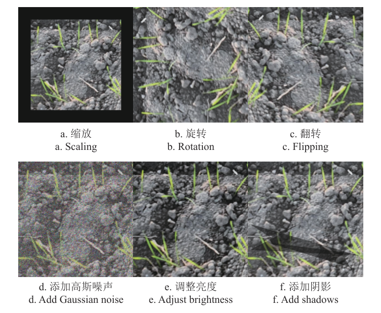

增强方式包括缩放（70%~100%）、逆时针旋转 90°、水平翻转 180°、添加方差 10.0~50.0 的高斯噪声、亮度调整 ±15% 与添加 1~3 个阴影六类，样本扩展至 12320 张、共 166558 个标注，其中小目标（占图像总面积 1% 以下）占比约 35%、中等目标（占 1%~5%）占比约 57%。最终数据集划分如下表所示。

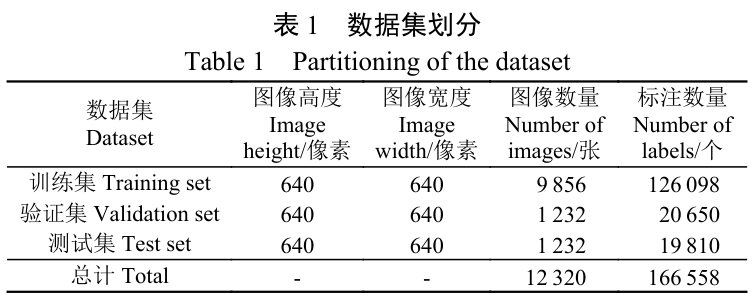

训练集、验证集、测试集按 8:1:1 划分为 9856、1232、1232 张图像，该数据集作为后续全部模块改进与对比试验的统一输入。

### DSM-YOLOv10 总体结构

DSM-YOLOv10 是本文的总体检测框架，用于以多模块协同解决复杂田间幼苗的漏检与错检。基线 YOLOv10 是实时端对端的单阶段目标检测算法，通过双重标签分配策略消除对 NMS 后处理的依赖，并引入 SCDown 下采样与大核卷积、PSA 部分自注意力增强感受野；本文综合考虑参数量与终端部署可能性选用 YOLOv10n 作为基线。总体结构如下图所示。

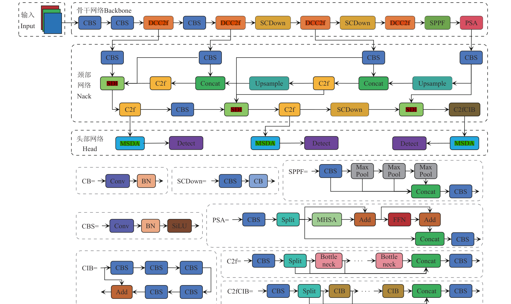

结构上的改进共有四处：骨干网络中以 DCC2f 替换 C2f；在骨干与颈部之间引入 3 个步长与卷积核尺寸均为 1 的 CBS 模块存储骨干特征并作为 SDI 的输入；从骨干第 2 层抽取浅层特征、经下采样后引入一条额外的特征融合路径；在检测头前加入 MSDA。各组件的改动与功能对照如下表所示。

| 组件 | 本文改动 | 功能 |
| --- | --- | --- |
| Backbone | DCC2f 替换 C2f，保留 SCDown、SPPF、PSA | 减少冗余计算，增强基础特征融合 |
| Neck | SDI 替换 Concat，增设 CBS 存储与浅层融合路径 | 语义指导下的细节增强与跨尺度融合 |
| Head | 三尺度 Detect 前加入 MSDA | 聚合多尺度信息并完成检测输出 |

网络以 640×640 的幼苗图像为输入，骨干与颈部增强后的三尺度特征依次进入 MSDA 与检测头输出边界框，以下按数据流顺序展开各模块。

### DualConv 双卷积结构

DualConv 是 DCC2f 的卷积基础，用于在保留跨通道融合能力的同时压缩参数量与计算成本，其结构如下图所示。

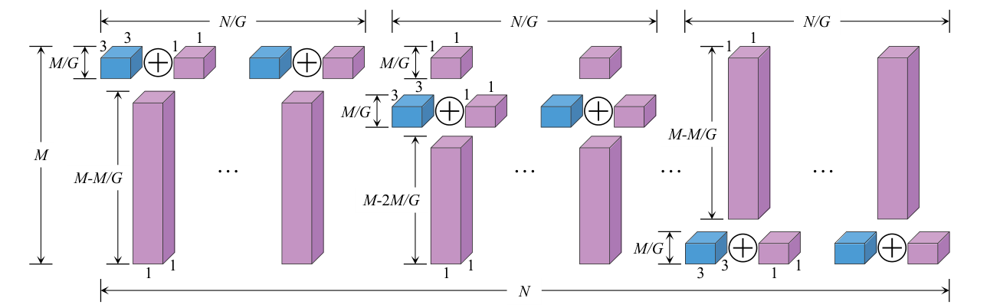

DualConv 结合分组卷积与异构卷积的优势，包含 3×3 和 1×1 两种卷积核：操作时一部分输入特征图同时执行 3×3 分组卷积和 1×1 逐点卷积，另一部分仅进行 1×1 逐点卷积。分组卷积捕捉空间局部特征，逐点卷积连续在所有输入通道上执行以保留原始信息，实现最大程度的跨通道特征融合；将输入通道与卷积核数量划分为组、每组卷积核仅作用于对应输入通道，既解决了分组卷积通信不畅的问题，又减少了骨干网络的参数量。其输出被组装为 DCBottleneck，供 DCC2f 模块堆叠使用。

### DCC2f 模块

DCC2f 模块的目标是替代骨干网络中的 C2f，减少冗余计算并增强梯度流。C2f 通过多分支、全连接结构提升梯度流与特征融合能力，但多个 Bottleneck 的堆叠以及将所有中间特征图进行 Concat 操作，不可避免地增加计算复杂度和内存访问开销，还造成大量信息冗余。模块结构如下图所示。

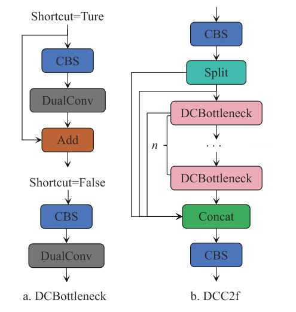

DCC2f 利用双卷积改进的 DCBottleneck 替代原 Bottleneck，通过并行部署分组卷积与逐点卷积并结合残差连接，既缓解深层训练的梯度消失问题、完整传递跨层特征，又最大限度减少冗余卷积操作；图中 n 为 DCBottleneck 的堆叠数量，shortcut 控制残差连接是否启用。该模块的输出为颈部融合提供高效、清晰的基础特征，是骨干数据流的第一环。

### SDI 模块

SDI 模块用于重构颈部网络，解决原 PANet 双向跨尺度融合面对像素级目标时空间分辨率衰减、跨层级语义与细节难以协同、关键特征复用率低的问题，其结构如下图所示。

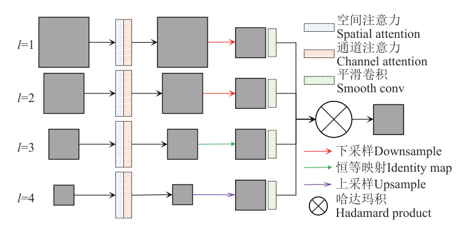

SDI 的核心是将高级特征的语义信息注入低级特征，并通过元素级哈达玛乘积从高级特征中提取更丰富的细节。首先对各层级 i 的初始特征同时应用空间注意力和通道注意力机制，以融合局部空间信息和全局通道信息，计算式为：

$$f_i^1 = \phi_i^c(\varphi_i^s(f_i^0))$$

| 符号 | 含义 |
| --- | --- |
| f_i^0 | 第 i 层级的初始特征图 |
| f_i^1 | 第 i 层经注意力处理后的特征图 |
| φ_i^s | 第 i 层级的空间注意力参数 |
| φ_i^c | 第 i 层级的通道注意力参数 |

这等价于对每层特征先做空间、再做通道的两阶段重标定，为跨层级融合提供统一表征。接着使用 1×1 卷积将 $f_i^1$ 的通道数缩减至超参数 c 得到 $f_i^2 \in R^{H_i \times W_i \times c}$；在解码器中以 $f_i^2$ 为目标参考特征，调整每一层级 j 的特征尺寸使其分辨率与之一致，调整后的特征图为：

$$f_{ij}^3 = \begin{cases} D(f_j^2,(H_i,W_i)), & j<i \\ I(f_j^2), & j=i \\ U(f_j^2,(H_i,W_i)), & j>i \end{cases}$$

| 符号 | 含义 |
| --- | --- |
| D | 自适应平均池化 |
| I | 恒等映射 |
| U | 双线性插值 |
| H_i、W_i | 目标参考特征 f_i^2 的高度与宽度 |

对齐之后不同层级的特征才具备相同分辨率，可以进入同一融合运算。再对每个调整后的特征图应用 3×3 卷积进行平滑处理，计算式为：

$$f_{ij}^4 = \theta_{ij}(f_{ij}^3)$$

其中 θ_ij 代表平滑卷积的参数，f_ij^4 代表第 i 层的第 j 个平滑后特征图。平滑卷积抑制重采样引入的混叠，使同层特征在空间上对齐可比。最后将所有第 i 层特征图执行逐元素哈达玛积运算，输出特征图为：

$$f_i^5 = H([f_{i1}^4, f_{i2}^4, \ldots, f_{iM}^4])$$

其中 H(·) 代表哈达玛积，M 代表特征图的总层数。直观上，高层语义与低层细节在像素级相乘放大，实现语义指导下的细节增强而非简单通道堆叠；f_i^5 送入第 i 层解码器进行分辨率重建，为颈部提供兼具语义与细节的融合特征。

### MSDA 模块

MSDA 模块是一种面向视觉任务的注意力机制，其目标是通过多尺度膨胀策略优化计算效率与特征表达能力，具体结构如下图所示。

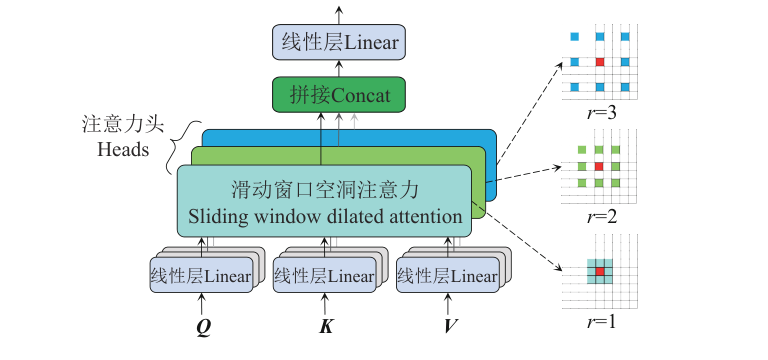

针对输入特征图，通过线性投影获取对应矩阵 Q、K 和 V 值，随后将通道划分为多个注意力头，各头采用不同的膨胀率执行多尺度滑动窗口空洞注意力 SWDA 操作：以查询块为中心、在其周围窗口内稀疏选择键和值进行自注意力运算，多头并行计算不同尺度的局部依赖关系。本文采用 3×3 的卷积核尺寸，膨胀率 r 取值为 1、2 和 3，各头的注意力感受野尺寸分别为 3×3、5×5 和 7×7。计算式为：

$$h_i = \mathrm{SWDA}(Q_i, K_i, V_i, r_i), \quad 1 \le i \le n$$

各头特征拼接后输入线性层完成特征聚合，计算式为：

$$X = \mathrm{Linear}(\mathrm{Concat}[h_i, \ldots, h_n])$$

| 符号 | 含义 |
| --- | --- |
| r_i | 第 i 个注意力头的膨胀率 |
| Q_i、K_i、V_i | 第 i 个注意力头的输入特征图切片 |
| h_i | 第 i 个注意力头的输出特征图 |
| X | 经拼接和线性聚合后的特征图 |
| n | 注意力头数量 |

这等价于在不同头上以不同膨胀率于窗口内稀疏采样键值，在单层注意力内完成多尺度上下文建模。相较传统全局注意力，MSDA 无需复杂操作与额外计算成本即可降低自注意力机制的冗余性，增强局部细节与上下文信息的融合能力；其输出经线性聚合后进入检测头，是检测数据流上特征增强的最后一环。

## 实验结果

### 实验设置

训练平台为 64 位 Windows 10 操作系统，CPU 为 AMD EPYC 7713 64 核处理器，GPU 为 NVIDIA GeForce RTX 3090 24 GB，深度学习框架使用 PyTorch 2.0.1 搭建、CUDA 版本为 12.1、Python 版本为 3.9；输入图像大小为 640×640 像素，训练批次大小为 32，训练轮数为 100，初始学习率为 0.01。评价指标采用精确率 P、召回率 R、平均精度均值 mAP、F1 分数、浮点运算量和参数量，计数性能另采用决定系数 R²、均方根误差 RMSE 和平均绝对误差 MAE。数据集按方法节表中比例划分为训练、验证与测试三部分，小目标与中等目标占比分别约 35% 与 57%。

### 可视化分析

各模型在同一批测试图像上的检测效果对比如下图所示，其中红色边框代表检测结果，黄色边框代表漏检，蓝色边框代表错检。

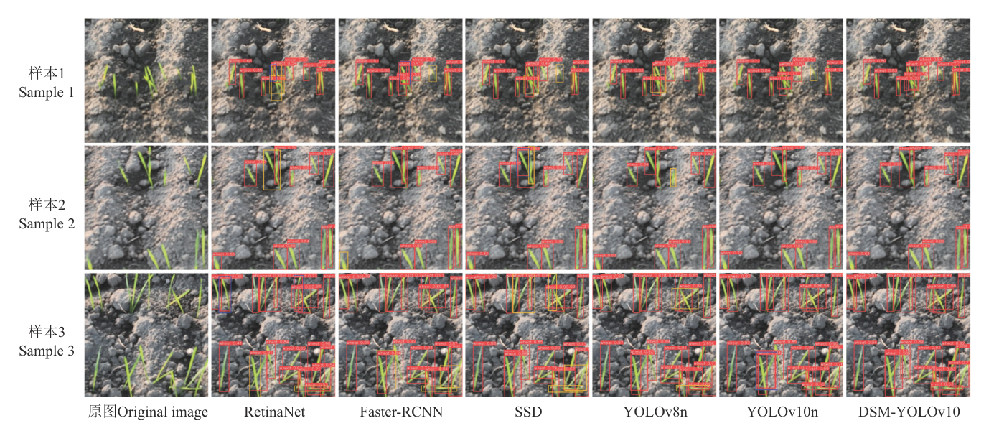

RetinaNet 和 SSD 的漏检与错检情况最为严重，YOLOv8n 和 YOLOv10n 漏检较少但对复杂特征的辨别能力仍较差，DSM-YOLOv10 则能检出尺寸较小或被部分遮挡的幼苗。阴天、幼苗密集重叠与幼苗生长杂乱三种复杂场景下的检测效果对比如下图所示。

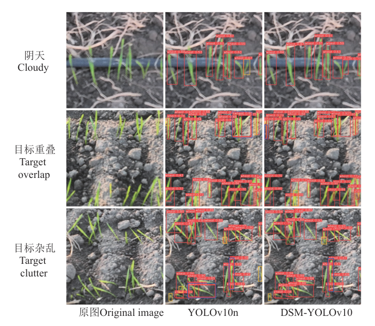

YOLOv10n 在三类场景中存在漏检、单个目标错检为多个目标以及多个目标错检为单个目标的情况，DSM-YOLOv10 凭借 SDI 对细节特征和边缘信息的提取能力与 MSDA 多尺度特征融合机制协同工作，在三种场景下均实现精准检测，漏检和错检率明显下降。小目标补充试验的检测效果如下图所示。

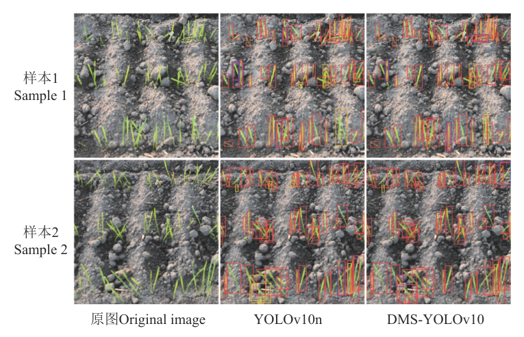

在 350 张小目标占比 90% 以上的图像上，YOLOv10n 在幼苗重叠场景中存在较多漏检和错检，DSM-YOLOv10 的平均精度均值达到 86.3%，漏检率和错检率分别为 9.1% 和 3.8%，定量结果如下表所示，可以看出改进模型对小目标具有更强的特征提取能力。

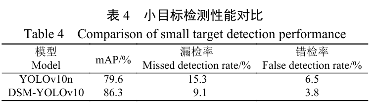

### 对比试验

本文将其与 RetinaNet、Faster-RCNN、SSD、YOLOv8n、YOLOv10n 等主流目标检测算法在同一数据集上进行对比，结果如下表所示。

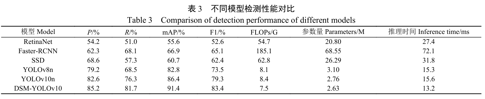

DSM-YOLOv10 的平均精度均值较 RetinaNet、Faster-RCNN、SSD 和 YOLOv8n 分别提高 35.8、24.5、30.7 和 8.6 个百分点，参数量分别降低 87.4%、96.2%、90.0% 和 15.2%，浮点运算量分别降低 86.3%、96.0%、88.1% 和 7.4%；相较 YOLOv10n，精确率、召回率、平均精度均值、F1 分数分别增长 2.6、5.4、5.0 和 4.1 个百分点，推理时间降至 13.2 ms、检测速度约 76 帧/s。精度提升与参数量、计算量下降同时出现，表明增益来自结构改进而非容量堆叠。

### 消融试验

以 YOLOv10n 为基线、保持训练条件和超参数一致的消融试验结果如下表所示。

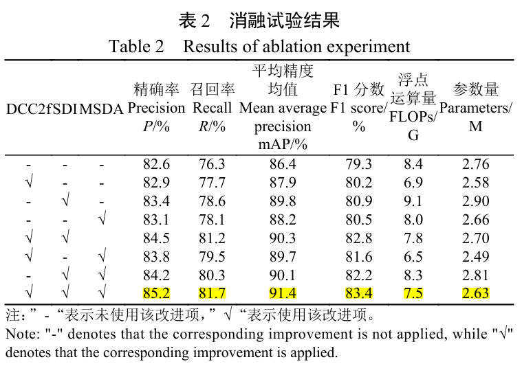

单独引入 DCC2f 后参数量和浮点运算量分别减少 6.5% 和 17.9%，平均精度均值和 F1 分数分别提高 1.5 和 0.9 个百分点；单独加入 SDI 后平均精度均值和 F1 分数分别提升 3.4 和 1.6 个百分点；单独加入 MSDA 后分别提升 1.8 和 1.2 个百分点；三项改进同时引入时平均精度均值、精确率、召回率和 F1 分数达到 91.4%、85.2%、81.7% 和 83.4%，参数量和浮点运算量较基线分别减少 4.7% 和 10.7%。各改进模块与基线模型的特征响应热力图如下图所示。

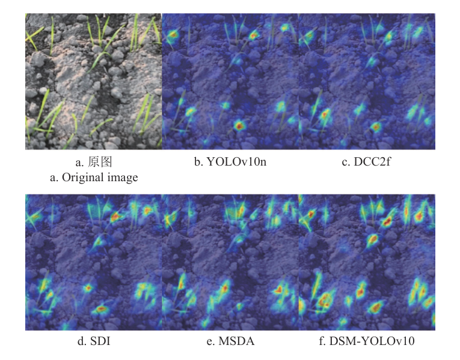

基线 YOLOv10n 对幼苗特征的关注度欠佳，引入 DCC2f、SDI、MSDA 后关注度有不同程度提高，整合 3 个模块的 DSM-YOLOv10 对幼苗的特征响应强度最高、覆盖最完整，表明多模块协同增强了模型对目标的特征提取与定位能力。

### 计数结果分析

本文选取 30 幅图像分别利用不同模型进行检测计数，与实测数据的对比结果如下表所示。

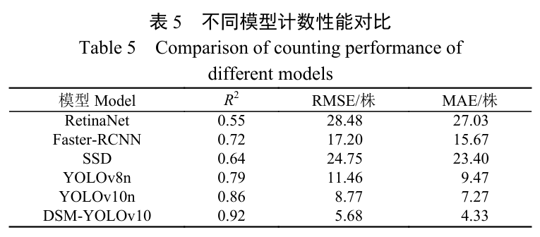

DSM-YOLOv10 的决定系数、均方根误差、平均绝对误差分别为 0.92、5.68 株、4.33 株，与前 5 个模型中表现最好的 YOLOv10n 相比，R² 提升了 6.98%，RMSE、MAE 分别降低了 35.23% 和 40.44%；RetinaNet、Faster-RCNN、SSD、YOLOv8n 的检测值明显低于实测值。检测值与实测值的拟合结果如下图所示。

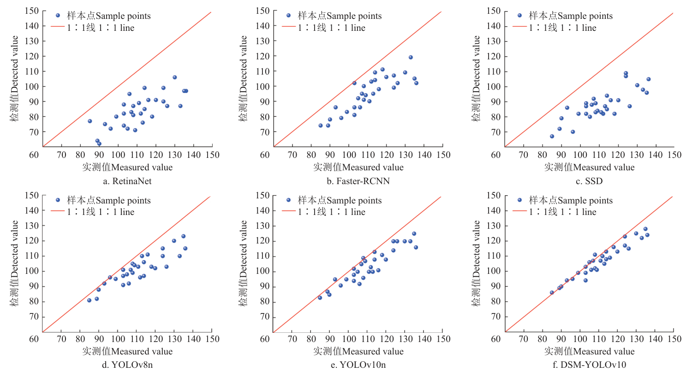

R² 的提升说明改进模型的检测结果与实测结果之间有更强的相关性，RMSE、MAE 的降低说明检测误差更小、精度更高，可见 DSM-YOLOv10 能对复杂场景下的小麦幼苗实现精准计数。

## 优点和创新点

个人认为，本文有如下一些优点和创新点可供参考学习：

1. 三个改进模块分别对应骨干计算冗余、颈部特征复用困难与多尺度上下文建模困难三类问题，消融试验给出单模块与两模块组合下 mAP、F1 与参数量的变化，模块增益清晰可归因。
2. 围绕阴天、密集重叠、生长杂乱三类场景构建检测效果图组，并辅以小目标补充试验与特征响应热力图，将漏检错检的改善归因到 SDI 细节提取与 MSDA 多尺度融合，可视化证据链说服力强。
3. 将评价从检测指标延伸到计数指标，用 R²、RMSE、MAE 三项指标验证检测值与实测株数的一致性，使模型性能直接对应出苗调查的农艺需求，实验设计可供参考。
