# 融合 SFAR-Net 图像增强与 YOLOv12-DMFA 的高铁接触网支持装置故障检测方法

Paper Reading 是从个人角度进行的一些总结分享，受到个人关注点的侧重和实力所限，可能有理解不到位的地方。具体的细节还需要以原文的内容为准，博客中的图表若未另外说明则均来自原文。

| 论文概况 | 详细 |
| --- | --- |
| 标题 | 《融合 SFAR-Net 图像增强与 YOLOv12-DMFA 的高铁接触网支持装置故障检测方法》 |
| 作者 | 顾桂梅、蹇靖宇、赵克进 |
| 发表期刊 | 湖南大学学报（自然科学版） |
| 期刊等级 | 未获取 |
| 发表年份 | 2026 |
| 论文代码 | 未获取 |

作者单位：

1. 兰州交通大学 自动化与电气工程学院，甘肃 兰州 730070
2. 中国铁路兰州局集团有限公司 银川供电段，宁夏 银川 750000

## 研究动机

高铁接触网支持装置的故障检测是牵引供电系统运行安全的重要问题，表现为螺母缺失、绝缘子脏污等缺陷若识别不及时将直接危害受电弓受流与行车安全，导致支持装置状态必须依赖巡检图像逐帧确认。基于 4C（接触网悬挂状态检测监测装置）检测系统的自动巡检图像分析已成为主流手段，然而实际场景中受列车震颤、成像距离及户外光照干扰，采集图像普遍存在对比度低、运动模糊及压缩伪影严重等问题，使现有检测算法面临特征提取困难与定位准度差的挑战。基于算法的图像增强是缓解该问题的低成本路线，但现有增强方法多聚焦于空间域特征建模，面对复杂复合退化时单纯的空域建模难以充分表征全局频率分布；检测一侧的现有工作大多侧重于检测网络结构改进，对低质量巡检图像带来的特征退化问题关注不足，增强与检测两个环节在任务逻辑与特征流转上缺乏协同。暂未有工作面向高铁巡检的耦合退化场景，将空频联合增强与实时检测网络做深度耦合。

## 文章贡献

针对低质量 4C 巡检图像细节缺失、以及检测网络对多尺度小目标与复杂背景特征表达不足的问题，本文提出一种「图像增强—目标检测」协同的两阶段框架：先构建空频联合注意力增强网络 SFAR-Net 对低质量图像进行细节增强，再将增强图像输入引入动态多尺度频域自适应模块 DMFA 的改进 YOLOv12 完成检测。其核心是用空频双分支并行结构与频域自注意力实现视觉修复与语义增强的融合，并用 DMFA 内部的 DFFN、DyT、Mona 三个组件在骨干与特征融合网络关键节点做动态特征对齐与关键区域强化。首先 SFAR-Net 以频域分支强化高频纹理、空域分支保持空间结构，接着 FFTSA 在频域完成特征权重的自适应重标定，最终 YOLOv12-DMFA 在增强图像上完成螺母与绝缘子等缺陷的定位与分类。实验表明，SFAR-Net 在 PSNR、SSIM、LPIPS 上分别达到 39.08 dB、0.9747 与 0.1014，最终框架的 mAP@0.5 提升至 74.9%、mAP@0.5:0.95 达到 65.9%，推理速度为 230.1 fps。

## 本文方法

### 两阶段总体框架

本文方法的整体是「视觉增强—特征自适应」深度耦合的两阶段流水线，总体框架如下图所示。

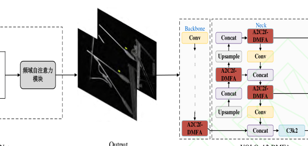

第一阶段 SFAR-Net 采用空频双分支并行结构：频域提取分支重构全局结构信息，空域提取分支还原局部纹理细节，两路特征汇合后进入频域自注意力模块 FFTSA 做全局建模与加权，输出增强图像；第二阶段将 DMFA 模块集成于 YOLOv12 的骨干网络与特征融合网络关键节点，以 A2C2f-DMFA 替换原 A2C2f 模块，构成耦合架构完成检测。两个阶段的分工是：增强阶段从像素层提升目标可辨识性，检测阶段从特征层补偿多尺度表征，二者通过增强图像衔接，前一阶段的输出即后一阶段的输入。

### SFAR-Net 频域分支

频域分支的目标是把输入图像映射至频域解耦高低频成分，以大感受野频率聚合强化高频细节与纹理重构。该过程的形式化表示如下：

$$\boldsymbol{F} = T_{\mathrm{DCT}}(\boldsymbol{I}), \quad \hat{\boldsymbol{F}} = \phi_c(\phi_{\mathrm{FFT}}(\boldsymbol{F})), \quad \boldsymbol{X}_f = T_{\mathrm{DCT}}^{-1}(\hat{\boldsymbol{F}})$$

| 符号 | 含义 |
| --- | --- |
| $\boldsymbol{I}$ | 输入图像 |
| $\boldsymbol{F}$、$\hat{\boldsymbol{F}}$ | 变换后与增强后的频域特征 |
| $\boldsymbol{X}_f$ | 频域分支的输出特征 |
| $T_{\mathrm{DCT}}$、$T_{\mathrm{DCT}}^{-1}$ | DCT 与 IDCT 算子 |
| $\phi_{\mathrm{FFT}}$、$\phi_c$ | 基于 FFT 的卷积模块与常规卷积堆叠 |

这等价于在分支内部完成「变换—增强—逆变换」三步：FFT 卷积先实现大感受野频率聚合，常规卷积堆叠在其上做细粒度局部建模，最后经 IDCT 重返空间域，确保与空域分支在统一表征空间内融合。频域分支的输出 $\boldsymbol{X}_f$ 随后与空域分支输出做通道级联，送入融合模块。

### SFAR-Net 空域分支

空域分支用于弥补频域分支在结构稳定性上的不足，通过建模长程依赖与保持结构一致性，提升复杂背景及遮挡下的定位鲁棒性。该分支引入非局部稀疏注意力（non-local sparse attention, NLSA），利用球面局部敏感哈希将特征分桶计算，设空间特征序列为 $\{\boldsymbol{x}_i\}_{i=1}^{N}$、桶映射为 $B(i)$，则桶内注意力可表示为：

$$\boldsymbol{y}_i = \sum_{j \in B(i)} \alpha_{ij} g(\boldsymbol{x}_j), \quad \alpha_{ij} = \mathrm{softmax}_{j \in B(i)}(f(\boldsymbol{x}_i, \boldsymbol{x}_j))$$

| 符号 | 含义 |
| --- | --- |
| $\boldsymbol{y}_i$ | 位置 i 的聚合特征 |
| $\alpha_{ij}$ | 位置 i 与 j 之间的注意力权重 |
| $f$、$g$ | 相似度函数与线性嵌入 |
| $B(i)$ | 球面局部敏感哈希的桶映射 |

利用 softmax 归一化相似度，实现稀疏约束下的长程依赖建模。直观上，分桶把注意力计算限制在同桶特征之间，在保留非局部全局上下文聚合能力的同时显著降低了计算复杂度。空域分支的输出与频域特征一同进入跨域融合环节。

### 跨域特征级联与通道对齐

级联与对齐环节用于消除空频异构特征之间的语义鸿沟，构建统一的联合表征空间，结构如下图所示。

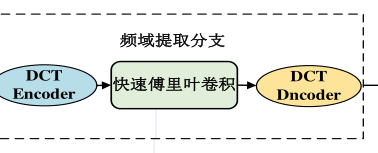

SFAR-Net 提取的空域局部细节与频域全局拓扑特征首先通过通道级联实现初步汇聚；随后利用轻量级卷积层执行特征维度的自适应映射与通道对齐，平抑两域特征的量级分布差异；该卷积层通过特征动态重加权，在压缩冗余特征的同时强化跨域特征间的非线性交互。对齐后的特征被送入 FFTSA 模块做高阶空频融合，是双分支提取与自注意力加权之间的桥梁。

### 频域自注意力模块 FFTSA

FFTSA 用于在频域执行自注意力计算，实现特征权重的自适应重标定，弥补线性映射难以表征跨频带非线性依赖、关键故障特征易被背景噪声淹没的问题，其结构如下图所示。

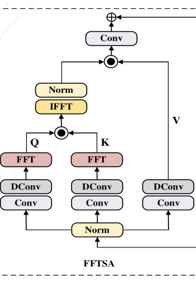

模块先通过 FFT 将输入特征映射到频域表示 $\boldsymbol{F}$，再经线性映射生成查询 $\boldsymbol{Q}$、键 $\boldsymbol{K}$ 和值 $\boldsymbol{V}$。注意力权重通过查询与键的内积计算得到：

$$\alpha_{ij} = \mathrm{softmax}\left(\frac{\boldsymbol{Q}_i \cdot \boldsymbol{K}_j^{\mathrm{T}}}{\sqrt{d_k}}\right)$$

其中 $d_k$ 是键的维度；$\alpha_{ij}$ 表示查询 $\boldsymbol{Q}_i$ 与键 $\boldsymbol{K}_j$ 之间的相似度。将该权重作用于值上，完成频域特征的加权合并：

$$\boldsymbol{F}_{\mathrm{Attn}} = \sum_j \alpha_{ij} \cdot \boldsymbol{V}_j$$

其中 $\boldsymbol{F}_{\mathrm{Attn}}$ 是 FFTSA 模块的核心加权算子，代表自注意力机制对频域特征 $\boldsymbol{F}$ 的加权合并操作。相较于传统的空间域矩阵乘法，FFTSA 能更高效地建模全局依赖并精准捕捉不同频带间的相关性，这等价于在全图尺度下用宏观拓扑约束微观纹理重建，同时抑制冗余噪声与特征冲突。FFTSA 的输出即 SFAR-Net 的增强结果，作为第二阶段检测网络的输入。

### YOLOv12 基线与 DMFA 的嵌入位置

检测阶段采用兼顾实时性与精度的 YOLOv12 作为基线检测器，其结构如下图所示。

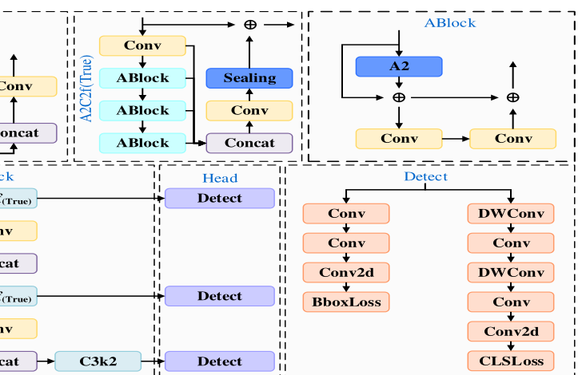

YOLOv12 由用于多尺度语义提取的 Backbone、强化跨尺度特征聚合的 Neck 以及执行状态感知的 Head 组成；相比传统 YOLO 架构，其核心优势在于引入区域注意力（Area Attention）机制，通过区域级信息交互扩大有效感受野。然而接触网缺陷多表现为极细粒度的小目标，标准卷积受限于固定的局部感受野，在深层下采样中难以捕获跨区域的长程上下文；隧道暗纹、密集承力索与支柱等冗余背景又引入大量背景响应，干扰关键缺陷特征的提取。为此本文在骨干网络与特征融合网络关键节点引入 DMFA 模块，以 A2C2f-DMFA 替换原 A2C2f 模块，改进后的结构如下图所示。

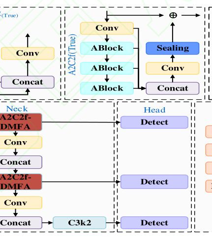

DMFA 整合了动态特征融合网络（Dynamic Feature Fusion Network, DFFN）、动态调优模块（Dynamic Tuning, DyT）与多认知视觉适配器（Multi-cognitive Visual Adapter, Mona）三大组件，模块内部结构如下图所示。

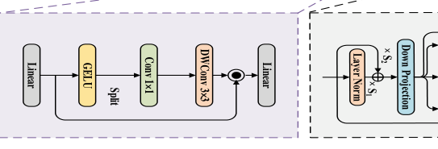

其中 DFFN 利用多维特征自适应对齐机制补偿运动模糊等因素造成的边缘纹理损失；DyT 借鉴 Transformer 标准化层设计，实现不同退化环境下特征表示的全局一致性增强；Mona 利用深度可分离卷积对不同层级的语义特征进行精炼与精确对齐。三者在 DMFA 内协同工作，共同改善低照度、复杂背景等严苛条件下的表征能力；DMFA 的输出沿原 A2C2f 的路径继续送入 Neck 与 Head，不改变 YOLOv12 的整体数据流。

### DFFN 模块

DFFN 模块用于通过逐通道卷积（depthwise convolution, DWConv）与线性变换的高效耦合优化多尺度特征融合，其结构如下图所示。

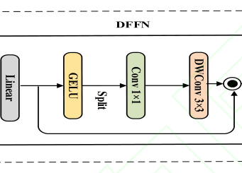

DFFN 的核心是多维特征自适应对齐机制：动态滤波算子根据图像退化程度（如运动模糊）在空间、频域及数值维度上动态重构频率拓扑并调节融合策略，从而补偿退化造成的边缘纹理损失。从结构图可见，模块先对输入特征做线性变换，再经 Split 拆分多路并行处理，以轻量代价换取对退化程度的自适应。DFFN 的输出作为 DMFA 内部子路径汇入 A2C2f-DMFA 的特征流，为 DyT 与 Mona 提供初步对齐后的特征。

### DyT 模块

DyT 模块用于提升复杂环境下的特征鲁棒性，受 Transformer 归一化层启发，通过动态调制逐层特征的动态范围来优化特征表达，其结构如下图所示。

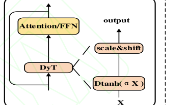

区别于传统静态归一化，DyT 引入内容自适应调节机制，能够基于输入图像特征实时优化特征分布。其核心操作定义如下：

$$\mathrm{DyT}(\boldsymbol{x}) = \gamma \cdot \tanh(\alpha \boldsymbol{x}) + m$$

| 符号 | 含义 |
| --- | --- |
| $\boldsymbol{x}$ | 输入特征 |
| $\alpha$ | 可学习的标量 |
| $\gamma$、$m$ | 可学习参数，分别对应特征的缩放和偏移 |

直观上，tanh 的有界性会压制特征图中的离群值，可学习的缩放与偏移则保留每层特征表达的灵活性。在结构中 DyT 置于 Attention/FFN 之前替代静态归一化层，其调制后的特征继续参与后续注意力与前馈计算，并输出给 Mona 做进一步精炼。

### Mona 模块

Mona 模块用于通过多认知视觉滤波器设计增强网络对多维度视觉特征的感知能力，其结构如下图所示。

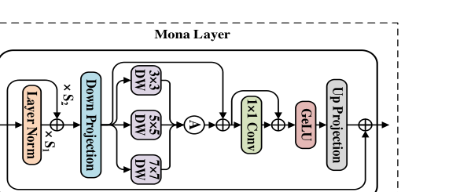

不同于依赖线性滤波器的传统适配器，Mona 利用多尺度的 DWConv 提取多样化特征，在保持参数高效性的同时提升视觉信息的传递效率。其计算过程可以通过以下公式表达：

$$\boldsymbol{x}_{\mathrm{norm}} = s_1 \cdot |\boldsymbol{x}_0|_{\mathrm{LN}} + s_2 \cdot \boldsymbol{x}_0$$

| 符号 | 含义 |
| --- | --- |
| $\boldsymbol{x}_0$ | 输入特征 |
| $\boldsymbol{x}_{\mathrm{norm}}$ | 经多认知视阈加权后的输出特征 |
| LN | 层归一化算子 |
| $s_1$、$s_2$ | 可学习的权重，用于调节输入特征的分布 |

随后特征经级联的 DWConv 与 1×1 卷积实现多尺度融合，并结合 GeLU 激活与上投影完成输出重构，辅以残差连接优化信息流转。这等价于把 3×3、5×5、7×7 多条感受野的认知路径打包进一个轻量适配器；Mona 的输出回注 DMFA 主路径，完成对螺母、绝缘子等关键语义区域的表征强化，也是 DMFA 的最后一个组件。

## 实验结果

### 实验设置

数据集依托高铁 4C 装置自动采集构建，覆盖多运行速度及复杂气象工况，涵盖四类典型目标：nut_normal（382 张）、nut_missing（1400 张）、Insulator_normal（1000 张）与 Insulator_pollution（386 张），典型样本如下图所示。

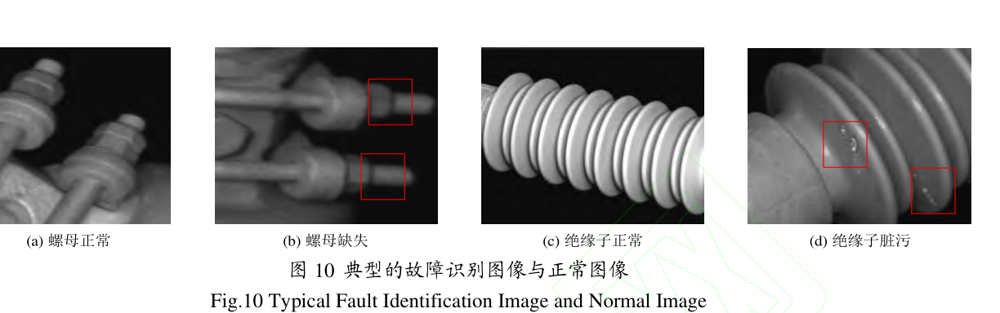

数据集按约 7:1:2 的比例划分为训练集（2199 张）、验证集（631 张）与测试集（338 张），并执行「场景、ID 隔离」原则防止数据泄露。针对真实工况中配对样本匮乏的问题，本文在 2500 张高清图像基础上借鉴 BSRGAN 的退化流水线设计，通过随机退化算子序列生成合成配对数据，使合成样本与现场采集的 668 张真实低质图像分布趋同，退化模型如下图所示。

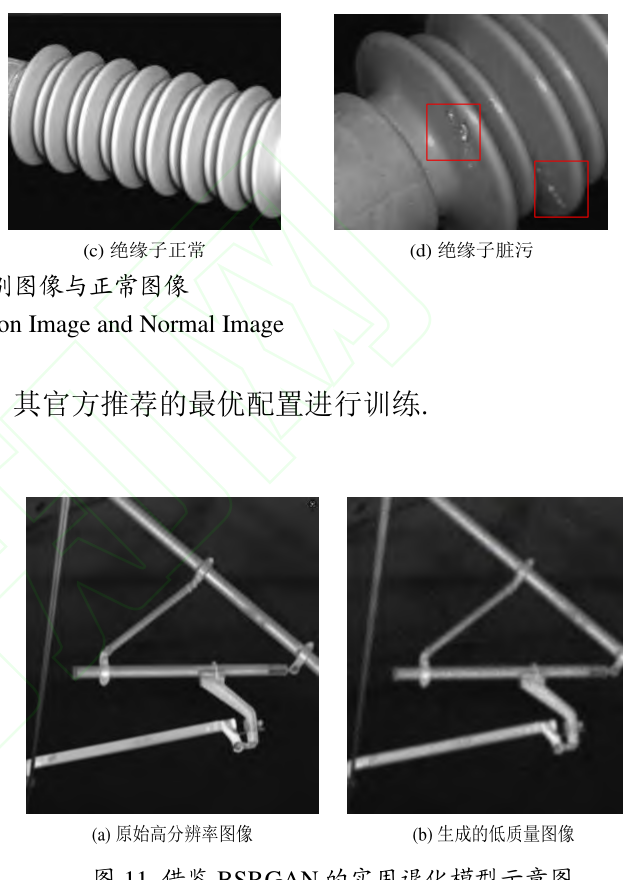

增强实验以 U-Net、NAFNet、Uformer-B 与 Restormer 为对比基准，指标为 PSNR、SSIM 与 LPIPS；检测实验以 Faster R-CNN、DEIM-D-FINE、RT-DETR 与 UAV-DETR 为基准，指标涵盖 mAP@0.5、mAP@0.5:0.95、参数量与 fps。实验基于 PyTorch 2.7.1 框架，运行于配备 NVIDIA RTX A40（24GB）GPU 的工作站，训练超参数如下表所示。

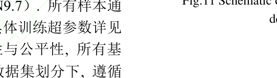

即批量 16、初始学习率 0.01、学习率动量 0.937、训练 250 轮，所有基准模型均在相同硬件与数据划分下按其官方推荐配置训练。

### 图像增强效果对比

各增强算法在像素级细节与结构级部件两个维度上的定性对比如下图所示，先给出像素级细节的对比。

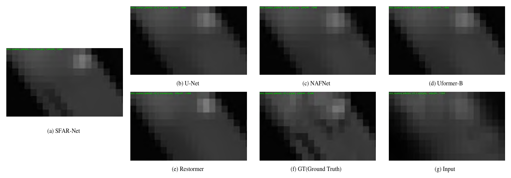

像素级视角下，U-Net 与 NAFNet 的输出仍带有模糊感，SFAR-Net 螺纹与边缘细节最锐利，最接近 GT。结构级部件的对比如下图所示。

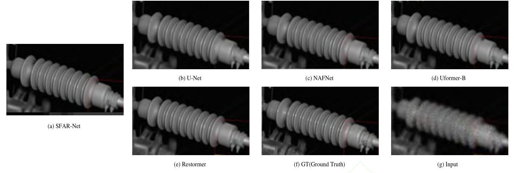

结构级视角下，U-Net 在处理低照度及模糊图像时高频细节增强严重欠缺，图 13(b) 中绝缘子边缘极度模糊；NAFNet 在像素边缘锐度与结构完整性方面均有所欠缺；Uformer-B 在不利光照下对微小语义信息的提取能力受限；Restormer 生成的纹理存在轻微模糊感。SFAR-Net 在处理螺母缺失等小目标缺陷时能够实现更精细的纹理还原，边缘锐度与结构完整性均最高。定量结果如下表所示。

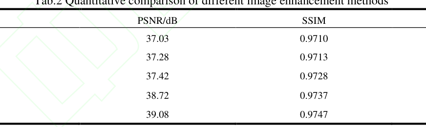

SFAR-Net 以 PSNR 39.08 dB、SSIM 0.9747、LPIPS 0.1014 在三项指标上均取得最优，而 U-Net 各项指标均为最低（PSNR 37.03 dB、SSIM 0.9710、LPIPS 0.1078），Restormer 的 PSNR 虽达 38.72 dB 但 LPIPS 仍高于本文方法，可见空频双分支与频域自注意力的协同设计在宏观结构与微观像素两个层面都实现了高保真还原。

### 检测性能对比实验

各算法在自建数据集上的检测性能对比如下表所示。

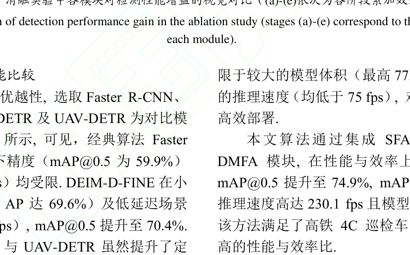

本文算法的 mAP@0.5 为 74.9%、mAP@0.5:0.95 为 65.9%，参数量 2.82 M、模型仅 6.0 MB，推理速度达 230.1 fps；Faster R-CNN 在复杂背景下精度与速度均受限（mAP@0.5 为 59.9%、17.1 fps），DEIM-D-FINE 的 mAP@0.5 为 70.4%，RT-DETR 与 UAV-DETR 的 mAP@0.5 分别为 68.3% 与 67.7%，且模型体积最高达 77.0 MB、推理速度均低于 75 fps。可以看出，SFAR-Net 与 DMFA 的组合在精度、复杂度与实时性三个维度上同时占优，满足高铁 4C 巡检车的部署需求。

### 消融实验

逐步引入 SFAR-Net 与 DMFA 各组件的消融结果如下表所示。

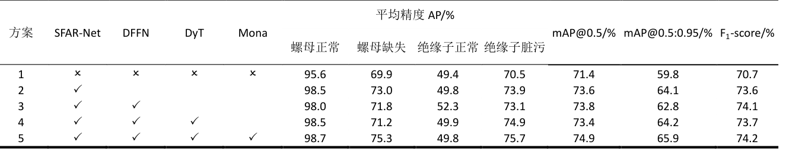

基线的 mAP@0.5 为 71.4%、mAP@0.5:0.95 为 59.8%；引入 SFAR-Net 后分别提升至 73.6% 与 64.1%；加入 DFFN 后 mAP@0.5 增至 73.8%；引入 DyT 后 mAP@0.5 出现微幅波动但 mAP@0.5:0.95 回升至 64.2%；最终集成 Mona 达到 74.9% 与 65.9%。逐类 AP 中螺母缺失类从 69.9% 提升至 75.3%、绝缘子脏污类从 70.5% 提升至 75.7%，说明增强阶段与 DMFA 各组件对弱纹理小目标的检测均有正向贡献。

### 可视化分析

消融实验中各阶段累加效果的视觉对比如下图所示。

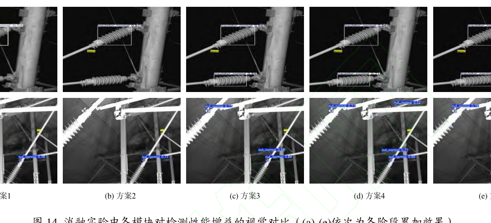

基线在低质图像上置信度较低且漏检明显（图 14(a)）；引入 SFAR-Net 后图像清晰度显著改善，目标置信度从 0.59 优化至 0.67（图 14(b)）；加入 DFFN 后原本因模糊而漏检的目标被找回（图 14(c)）；引入 DyT 后边界框回归过程被精细化（图 14(d)）；集成 Mona 后关键区域表征被强化、背景干扰被抑制，目标置信度提升至 0.76，密集目标的检出率显著优化（图 14(e)）。置信度沿 (a) 到 (e) 逐级抬升，表明每个模块的增益都能在检测框层面被直接观察到。

### 进一步讨论

从逐类结果看，绝缘子正常类在全模型下的 AP 为 49.8%，本文将其归因于弱纹理特征及复杂背景干扰，判别边界仍存在不稳定性，后续研究将聚焦于难例扩充和目标对齐增强策略。从部署角度看，模型推理速度快、稳定性高，230.1 fps 与 6.0 MB 的体积能够满足 4C 检测车快速响应的需求，具备较好的精度-效率平衡。

## 优点和创新点

个人认为，本文有如下一些优点和创新点可供参考学习：

1. 面向低质量巡检图像设计「增强—检测」两阶段协同框架，SFAR-Net 用空频双分支与 FFTSA 互补建模，增强指标全面优于 U-Net、Restormer 等基线，且对下游检测的增益可量化。
2. 将 DMFA 拆解为 DFFN、DyT、Mona 三个轻量组件嵌入 YOLOv12 关键节点，消融实验逐级给出增益，并配以置信度变化的可视化对比，模块作用直观可信。
3. 实验同时覆盖增强、检测、消融与可视化四组证据，并报告参数量、模型体积与推理速度，6.0 MB 与 230.1 fps 兼顾精度增益与边缘部署需求，工程参考价值高。
