# 基于改进 YOLOv12 的轻量化复杂环境红花识别方法

Paper Reading 是从个人角度进行的一些总结分享，受到个人关注点的侧重和实力所限，可能有理解不到位的地方。具体的细节还需要以原文的内容为准，博客中的图表若未另外说明则均来自原文。

| 论文概况 | 详细 |
| --- | --- |
| 标题 | 《基于改进 YOLOv12 的轻量化复杂环境红花识别方法》 |
| 作者 | 王超，于海洋，张小栋，李晓娟，罗秀芝，程义锋 |
| 发表期刊 | 《农业机械学报》 |
| 期刊等级 | 未获取 |
| 发表年份 | 2026 |
| 论文代码 | 未获取 |

作者单位：

1. 新疆大学机械工程学院，新疆 乌鲁木齐 830017
2. 新疆农牧机器人及智能装备工程研究中心，新疆 乌鲁木齐 830017
3. 西安交通大学机械工程学院，陕西 西安 710049

## 研究动机

红花是集药用、油用、饲用与工业加工于一体的特色经济作物，我国红花产量主要集中于新疆，盛花期随开随采且需多茬采收，采收时又不能损伤花蕾，否则将影响后续花丝开放。然而目前红花采摘环节仍以人工为主，熟练采花工短缺、采摘劳动强度大、采收费用逐年上涨等问题交织，选择性采收机器人因而成为必然趋势，而机器视觉系统对田间红花的快速精准识别正是其前提。田间光照在早晨、中午、傍晚与顺光、侧光、逆光之间持续变化，枝叶与花丝又相互重叠遮挡，直接造成识别漏检与准确度下降；两阶段与多尺度经典检测器在此场景下分别存在计算冗余与浅层语义缺失的局限，已有的轻量化改进模型则常以精度换取体积，仍难以同时满足采收机器人边缘设备的算力约束。暂未有工作在光照变化与遮挡下兼顾边缘纹理保持、多维特征融合与模型体积压缩，本文即从这一空白切入。

## 文章贡献

针对田间光照变化和枝叶花丝重叠遮挡等复杂背景干扰下红花识别漏检、准确度低，以及模型体积过大不利于边缘设备部署的问题，本文提出了基于 YOLOv12 改进的轻量化识别网络 LNSR。其核心是四个模块的协同设计。首先设计 HEP-DSF 异构边缘-池化双流融合模块，在网络初始阶段增强边缘与纹理信息的提取；接着构建 TriCAFusion 三重协同自适应融合模块，同时建模通道、空间与像素级协同注意力；再次引入 AdaPool 自适应邻域池化下采样模块，并开发 LSBNet 轻量化共享卷积-分离 BN 检测头，从下采样与检测头两端压缩模型复杂度。实验表明，LNSR 在自建红花数据集上 mAP50 达 98.9%、参数量仅 $1.72\times10^6$，在菊花数据集泛化试验中 mAP50 达 97.0%，部署于 Jetson 边缘设备的实时帧率达到 30 帧/s。

## 本文方法

### 基线模型 YOLOv12

YOLOv12 是本文的改进基线，它通过对注意力机制与整体网络架构的创新，在保持实时性能的同时取得高检测精度。其模型结构如下图所示。

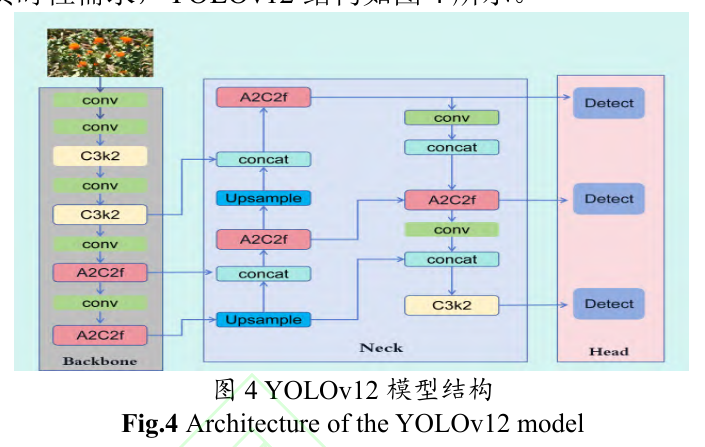

从结构图可以看出，YOLOv12 依旧遵循 Backbone-Neck-Head 的三段式数据流，但以注意力模块替代了以往纯 CNN 的特征建模方式，并具备在边缘设备高效部署的能力，与红花检测的实时性需求相匹配。本文的四处改进即嵌入这条数据流的起始卷积、下采样、特征融合与检测头环节。

### LNSR 总体架构

LNSR 的目标是在复杂田间环境下同时解决漏检、精度与体积三个矛盾，其整体结构如下图所示。

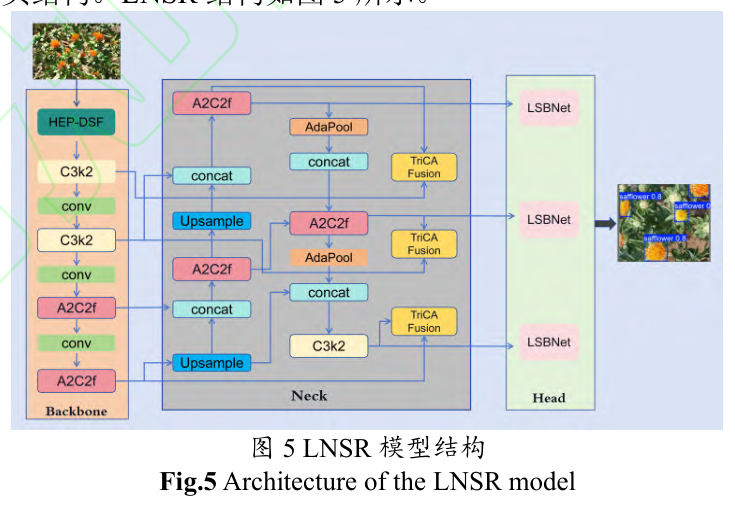

结构图中 HEP-DSF 位于 Backbone 起始位置，负责强化低级边缘与纹理特征；AdaPool 与 TriCAFusion 插入 Neck 的下采样与特征融合节点，分别负责保细节下采样和多维注意力融合；检测头三支路统一替换为 LSBNet。网络接收田间红花图像，输出红花检测框，以下按数据流顺序逐节展开四个模块。

### HEP-DSF 异构边缘-池化双流融合模块

HEP-DSF 用于克服传统卷积层难以捕捉边缘与纹理信息、导致关键特征在深层传递中流失的问题，其模块结构如下图所示。

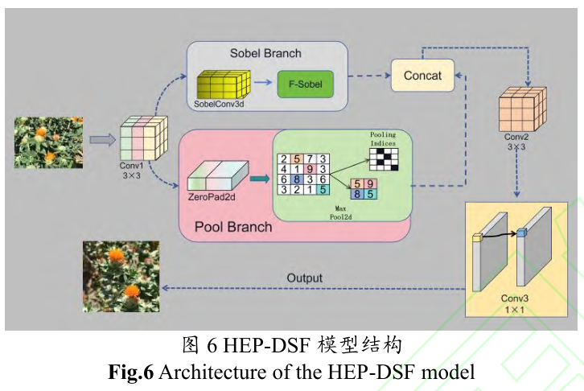

输入图 X 先经 Conv1 完成初始特征提取与空间下采样得到 X'，随后进入双分支结构。Sobel 分支通过预定义的 X 方向与 Y 方向梯度卷积核计算三维深度梯度分量，梯度分量计算公式为：

$$G_x = K_x X', \quad G_y = K_y X'$$

再经欧几里得范数融合输出边缘增强特征，范数融合公式为：

$$F_s = \sqrt{G_x^2 + G_y^2}$$

池化分支中 X' 依次通过 ZeroPad2d 层向右下方向填充 1 像素，再由 MaxPool2d 层执行空间最大值运算，运算公式为：

$$F_p = \max_{(i,j)\in R} (X'_{i,j})$$

| 符号 | 含义 |
| --- | --- |
| Kx、Ky | 水平方向、垂直方向 Sobel 核 |
| X' | Conv1 初始特征提取与空间下采样后生成的特征图 |
| Gx、Gy | 图像在水平方向、垂直方向的梯度估计 |
| Fs | 边缘增强特征图 |
| Fp | 最大池化特征图 |
| X'i,j | 通道位置 (i, j) 处的特征值 |

直观上，边缘流与池化流分别从方向梯度与局部最强响应两个侧面补足低级特征，其中边缘流响应花瓣轮廓走向、池化流保留窗口内最强纹理响应，双分支输出在通道维度拼接形成 128 通道融合特征，再经 Conv2 空间压缩与 Conv3 通道映射后送入后续骨干层，为特征金字塔提供更丰富的低级特征。

### TriCAFusion 三重协同自适应融合模块

TriCAFusion 用于克服传统注意力机制独立处理通道或空间特征、特征融合仅靠简单相加或拼接的缺点，其模块结构如下图所示。

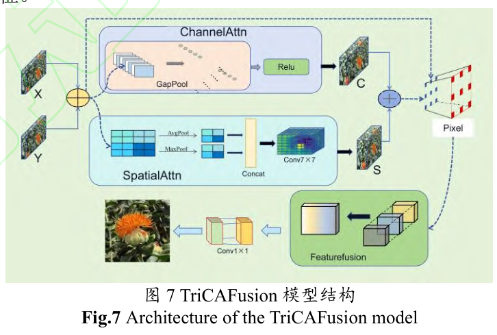

模块首先接收来自 Backbone 的浅层特征图 X 和 Neck 的深层特征图 Y，通过逐元素相加生成初始融合特征，特征融合公式为：

$$I = X + Y$$

通道注意力分支通过全局平均池化压缩空间维度后经两层全连接层生成通道权重 ca，权重生成公式为：

$$c_a = f_a(I) = \sigma\left(W_2 \cdot \delta \cdot W_1 \left(\frac{1}{HW}\sum_{i=1}^{H}\sum_{j=1}^{W} (I)_{ij}\right)\right)$$

空间注意力分支联合平均池化与最大池化特征，经 7×7 卷积生成空间权重 $s_a = f_a(I) = W_s \cdot \left[\frac{1}{C}\sum_{c=1}^{C}|I| + \max_c|I|\right]$；接着双注意力权重相加后同初始特征输入像素注意力模块，采用通道分组卷积输出动态像素级权重图 $p = \sigma(W_p \cdot (I + (s_a + c_a)))$。最终执行自适应特征融合，特征融合公式为：

$$F = I + p \cdot X + (1-p) \cdot Y$$

| 符号 | 含义 |
| --- | --- |
| I | 初始融合特征图 |
| fa | 通道注意力映射函数 |
| σ | Sigmoid 激活函数 |
| W1、W2 | 第 1 个、第 2 个全连接层的权重矩阵 |
| δ | ReLU 激活函数 |
| H、W | 输入特征图的高度、宽度 |
| Ws | 空间卷积核 |
| C | 输入通道数 |
| Wp | 分组卷积核 |
| p | 像素级动态权重图 |
| F | 最终融合特征 |

直观上，p 充当逐像素的门控系数，在每个位置决定更信任浅层细节还是深层语义，融合结果经 1×1 卷积重整后输出。该模块集成于检测头的特征融合阶段，接收浅层与深层两路特征并输出优化后的融合特征。

### AdaPool 自适应邻域池化下采样模块

AdaPool 用于缓解传统下采样易丢失花瓣纹理细节、难以区分重叠目标边界并在复杂背景中放大噪声的问题，其模块结构如下图所示。

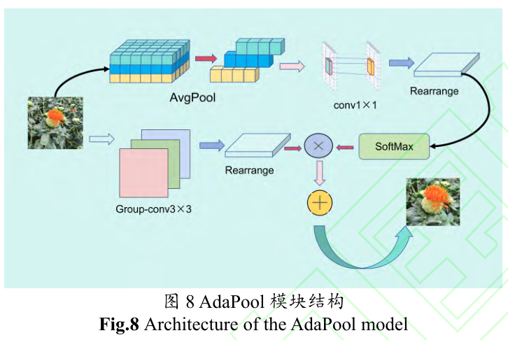

输入特征图 X 并行进入注意力分支与下采样分支。注意力分支先经平均池化提取空间上下文，再经 1×1 卷积生成原始注意力图，通过空间重排将维度从 C×2H×2W 变换为 C×H×W，最后应用 Softmax 函数沿最后一维归一化，生成位置自适应权重矩阵 W，Softmax 函数公式为：

$$S(z)_i = \frac{e^{z_i}}{\sum_{j=1}^{K} e^{z_j}} \quad (i = 1, 2, \ldots, K)$$

| 符号 | 含义 |
| --- | --- |
| S | Softmax 函数 |
| zi | 第 i 个元素的原始值 |
| K | 向量维度 |
| W | 位置自适应权重矩阵 |

下采样分支中输入通过分组卷积层进行空间下采样，再经通道重排将维度从 4C×H×W 重组为 C×H×W×4；融合阶段位置加权模块将权重矩阵 W 与下采样特征逐元素相乘，并沿最后一维求和完成空间聚合，生成最终输出特征图。直观上，下采样不再是对窗口内位置的无差别取舍，而是由学习到的位置权重决定各像素的贡献，因而能在压缩尺度的同时保留极端光照下仍可辨别的特征信息。

### LSBNet 轻量化共享卷积-分离 BN 检测头

LSBNet 用于解决传统检测头为每个检测层独立设计卷积层与批量归一化层所带来的参数冗余，其结构如下图所示。

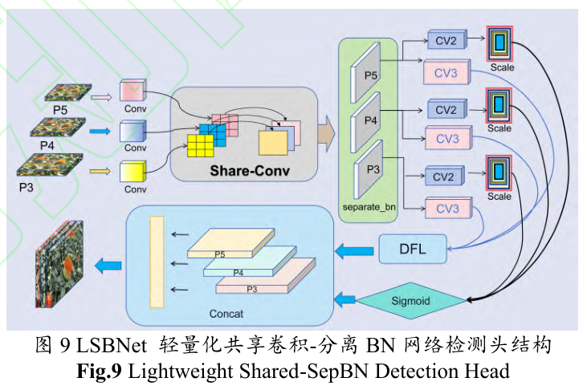

检测头接收主干网络的 P3、P4、P5 三尺度特征，每个尺度先经独立的 3×3 卷积+BN+SiLU 模块将通道数统一为 256 维；随后进入共享卷积组，先以 3×3 卷积进行空间特征增强、再以 1×1 卷积实现跨通道信息融合，两层权重在所有尺度间完全共享；共享卷积的输出进入尺度专属 BN 层完成归一化，归一化公式为：

$$\hat{F}_i = \gamma_i \left(\frac{H_i - \mu_i}{\sqrt{\nu_i^2 + \epsilon}}\right) + \beta_i$$

| 符号 | 含义 |
| --- | --- |
| F̂i | 第 i 个检测尺度下经 BN 层归一化后的特征图 |
| Hi | 共享卷积输出特征图 |
| μi、νi | 均值、方差 |
| γi、βi | 可学习参数 |
| ϵ | 数值稳定常量 |

归一化后的特征送入双路径预测层：回归路径经 cv2 卷积生成 64 通道边界框参数并由可学习 Scale 模块动态缩放，分类路径经 cv3 卷积输出类别概率，边界框参数最终由 DFL 解码器将 16 个离散分布值转换为 4 个连续坐标值。直观上，两类机制分工明确，其中卷积权重共享压缩参数量，分离 BN 保持多尺度特征分布的特异性，共同在轻量化与多尺度表征之间取得平衡，检测头输出即为网络最终的红花检测结果。

## 实验结果

### 实验设置

红花图像采集于新疆维吾尔自治区昌吉回族自治州吉木萨尔县庆阳湖乡，使用尼康 D7200 型相机在 10~40 cm 距离、6:00-22:00 时段以顺光、侧光、逆光角度拍摄，分辨率为 4496 像素×3000 像素，采集原始图像共计 2437 幅，不同场景样例如下图所示。

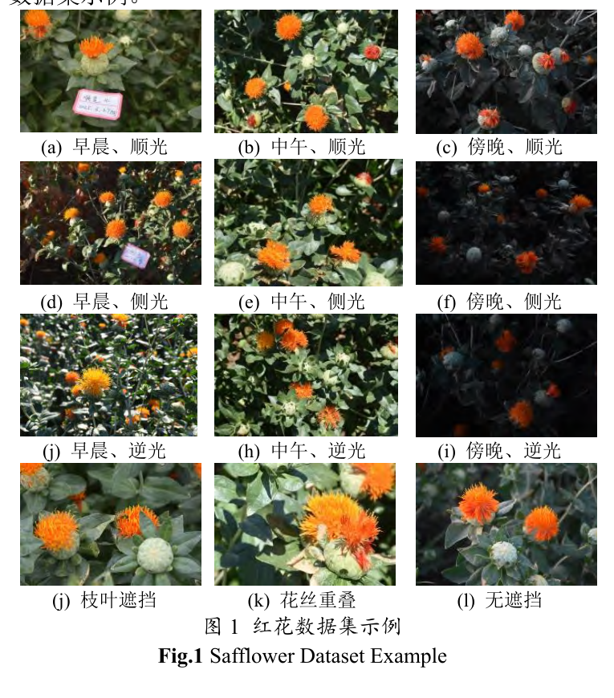

样例覆盖早晨、中午、傍晚三个时段与顺光、侧光、逆光三种光角的组合，并包含枝叶遮挡、花丝重叠与无遮挡三类目标状态。筛选剔除模糊与遮挡严重的无效图像后得到 2178 幅可用图像，经添加脉冲噪声与混合背景干扰等增强策略扩展至 6534 幅，使用 Labelme 标注后按 8:1:1 划分训练集、验证集与测试集，增强样例如下图所示。

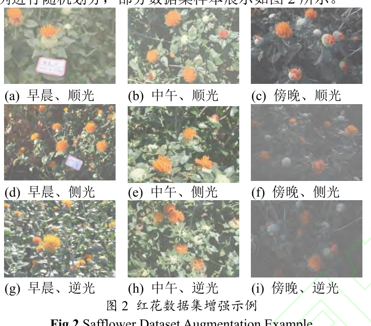

增强样本在保持目标位置不变的前提下叠加了噪声与背景干扰，标签分布散点图显示红花样本分布较为均匀。训练输入尺寸为 640×640，训练 100 轮、每批次 16 幅，平台为 Intel Xeon Silver 4214R CPU 与 NVIDIA GeForce RTX 3080 Ti GPU，基于 PyTorch 2.1.0 与 CUDA 12.1 搭建；评价指标为精确率、召回率、mAP50、参数量与模型大小。

### 可视化分析

早晨、中午、傍晚、遮挡与添加噪声四种环境下的检测效果对比如下图所示。

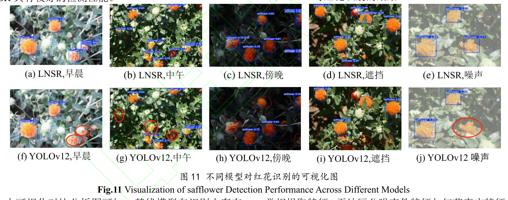

基线模型在四种环境中均存在不同程度漏检，目标较多时尤为明显：遮挡场景下基线出现 6 处漏检而 LNSR 为 3 处，噪声场景下基线出现漏检而 LNSR 未漏检、仅一处边界框发生偏移。Grad-CAM 热力图进一步给出特征聚焦层面的证据，如下图所示。

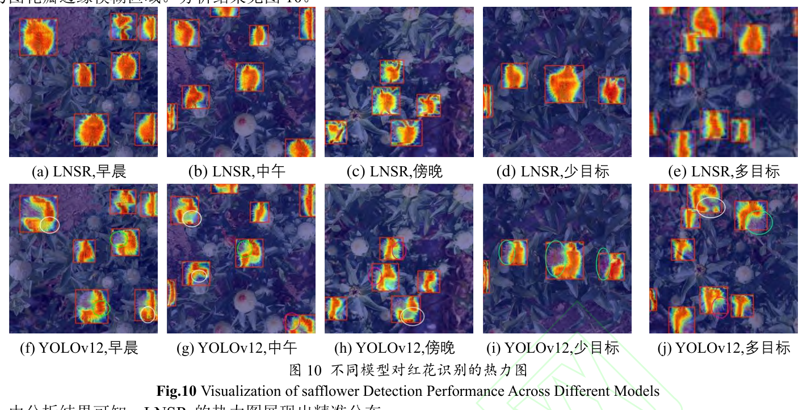

LNSR 的热力图花蕊中心高热区密集、花丝边缘呈现连贯亮红色窄条带分界、背景保持冷色调，而 YOLOv12 存在花蕊高热区位置不精准、花冠区多点分裂、花瓣边缘分界条带模糊等现象。检测效果与热力图两组定性证据相互呼应，可以看出 LNSR 对花瓣边缘与花蕊纹理的聚焦更准、更稳定。

### 对比试验

对比试验选取 Faster-RCNN、SSD、RT-Detr 与 YOLOv5 至 YOLOv12 各版本模型，结果如下表所示。

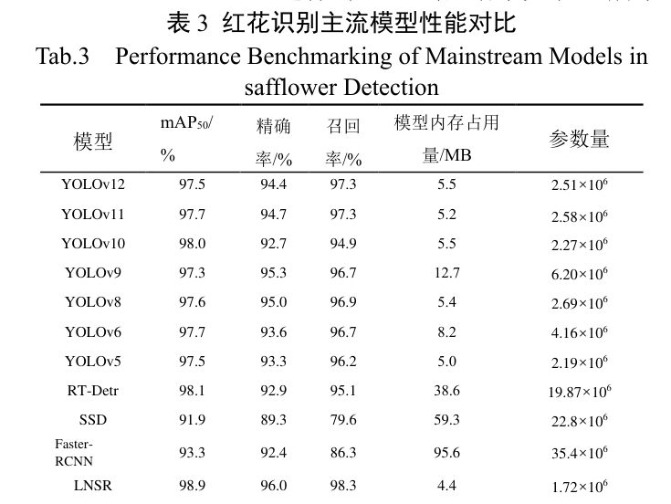

LNSR 的 mAP50 达 98.9%、召回率达 98.3%，较基线 YOLOv12 分别提升 1.4 和 1.0 个百分点，参数量降低 31.5%、模型内存占用量减少 1.1 MB；相较 RT-Detr、SSD 和 Faster-RCNN，mAP50 分别高出 0.8、7.0 和 5.6 个百分点，参数量降低 91.3%、92.5% 和 95.1%。精度提升与参数量压缩同时出现，表明增益来自模块结构本身而非容量堆叠。

### 消融试验

消融试验按 AdaPool、HEP-DSF、LSBNet、TriCAFusion 的顺序渐进叠加，结果如下表所示。

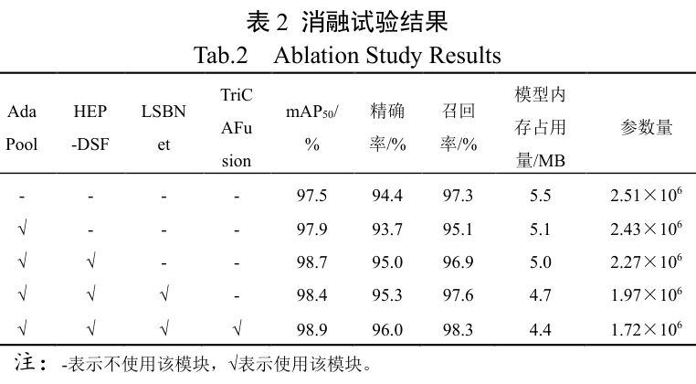

引入 AdaPool 后 mAP50 升至 97.9%、参数量降低 3.2%，但召回率下降 2.2 个百分点；集成 HEP-DSF 后 mAP50 升至 98.7% 且召回率回升 1.8 个百分点至 96.9%；植入 LSBNet 后参数量压缩 13.2% 至 $1.97\times10^6$、召回率提升至 97.6%；最终融合 TriCAFusion 后参数量再降 12.7%，mAP50 与召回率达到峰值 98.9% 与 98.3%。四个模块的增益逐级互补，可见 AdaPool 与 LSBNet 主要承担压缩、HEP-DSF 与 TriCAFusion 主要承担精度补偿与提升的分工。

### 泛化与边缘部署

为检验模型是否过度拟合特定分布，本文在与红花同属菊科、具备头状花序同源形态的菊花数据集上开展泛化试验，结果如下表所示。

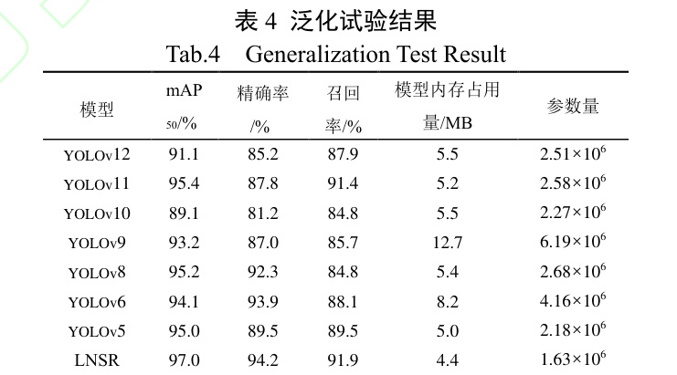

LNSR 在菊花数据集上 mAP50 达 97.0%、召回率达 91.9%，较 YOLOv12 分别提升 5.9 和 4.0 个百分点，参数量降低 35.1%；与 YOLOv11、YOLOv8、YOLOv5 相比 mAP50 增益 0.6、1.8、2.0 个百分点，表明模型未过度拟合特定数据分布。将模型部署于 NVIDIA Jetson Orin Nano 边缘设备实测，LNSR 检测速率为 30 帧/s，基线 YOLOv12 为 21 帧/s，相对性能提升 42.9%，说明 LNSR 能与边缘算力约束设备良好适配。

## 优点和创新点

个人认为，本文有如下一些优点和创新点可供参考学习：

1. 四个模块分别对应边缘纹理流失、多维特征融合、下采样细节保持与检测头冗余四类问题，消融试验逐阶段给出参数量与 mAP50 的变化，模块增益清晰可归因。
2. 用 Grad-CAM 热力图与早晨、中午、傍晚、遮挡、噪声四种环境的检测效果图组相互验证，并将漏检与边界框偏移逐项归因到具体模块，可视化分析说服力强。
3. 在菊科同源的菊花数据集上验证跨场景泛化，并在 Jetson Orin Nano 边缘设备完成 30 帧/s 的实测部署，算法到工程的证据链完整，可供参考。
