# 改进 YOLOv12 的水面垃圾检测方法

Paper Reading 是从个人角度进行的一些总结分享，受到个人关注点的侧重和实力所限，可能有理解不到位的地方。具体的细节还需要以原文的内容为准，博客中的图表若未另外说明则均来自原文。

| 论文概况 | 详细 |
| --- | --- |
| 标题 | 《改进 YOLOv12 的水面垃圾检测方法》 |
| 作者 | 朱宇凡，杨吉凯，李威 |
| 发表期刊 | 《计算机工程与应用》 |
| 期刊等级 | 未获取 |
| 发表年份 | 2026 |
| 论文代码 | 未获取 |

作者单位：

1. 华中科技大学电气与电子工程学院，湖北 武汉 430074
2. 华中科技大学船舶与海洋工程学院，湖北 武汉 430074

## 研究动机

水面垃圾污染是制约水生态环境可持续发展的重要问题，表现为破坏水体自然景观、威胁水生生物生存环境，甚至经食物链传递对人类健康产生潜在危害。传统清理工作主要依赖人工打捞，效率低下、难以覆盖所有水面垃圾且存在安全隐患。然而以视觉检测为前提的自动化清理方式在水面场景中面临一连串困难：倒影与光照干扰制造伪目标，水面纹理变化模糊垃圾边界，远距离小目标在标注对象中占比较高。二阶段检测器依赖候选区域生成，计算资源与速度难以满足水上部署；已有的一阶段改进工作或小目标检测头引入更多噪声、计算量增加过多，或依赖过多超参数手动调节而牺牲泛化能力，且基线模型相对陈旧，检测精度与实时性均弱于最新的 YOLOv12。而 YOLOv12 基线自身仍存在感受野有限、特征信息捕捉能力不足、CIoU 损失加剧低质量样本惩罚导致小目标检测能力弱三处短板，针对水面垃圾场景的 YOLOv12 改进暂无相关研究，本文即从这一空白切入。

## 文章贡献

针对现有水面垃圾检测方法模型较老、易漏检错检、无法满足高效水面环境治理的问题，本文提出了改进 YOLOv12 的水面垃圾检测方法 WDW-YOLO。其核心是感受野、特征捕捉与样本平衡三条线的改进。首先引入基于小波变换的 WTConv 改进颈部网络的 C3k2 模块，设计 C3k2_WTConv 模块，在参数可控的前提下扩大感受野；接着引入 DynamicConv 改进骨干网络的 C3k2 模块，得到 C3k2_DynamicConv 模块，在限制计算量增长的同时增加可学习参数；最终将 CIoU 替换为基于动态非单调聚焦机制的 WiseIoUv3，并在水面垃圾数据集上探究最佳超参数组合以平衡难易样本。实验表明，WDW-YOLO 在 FloW_IMG 数据集上较基线 YOLOv12n 的 mAP50 和 mAP50-95 分别提高 2.7 和 1.8 个百分点，达到 90.7% 和 50.6%。

## 本文方法

### 基线模型 YOLOv12

YOLOv12 是本文的改进基线，延续单阶段检测架构，在单次前向传播中直接预测所有目标的类别和边界框。其网络结构如下图所示。

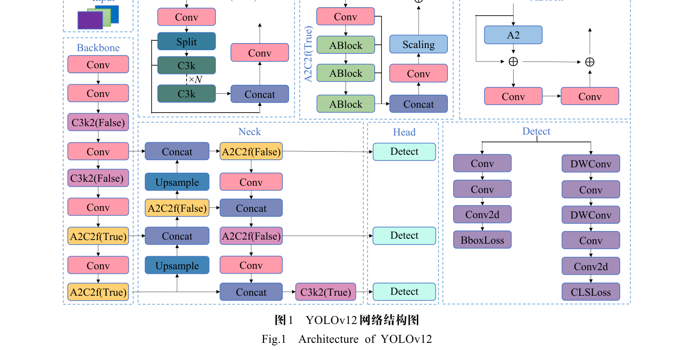

结构上仍分为 Backbone、Neck、Head 三部分，创新在于以区域注意力替换传统 CNN 的特征建模，默认将特征图划分为 4 个区域以避免复杂的窗口划分，并引入带缩放因子残差捷径的 R-ELAN 保证训练稳定。本文的三处改进分别作用于 Neck 的 C3k2、Backbone 的 C3k2 与边界框损失函数，以下逐节展开。

### C3k2_WTConv 模块

C3k2_WTConv 用于解决标准卷积局限于局部特征融合、感受野有限的问题，其模块结构如下图所示。

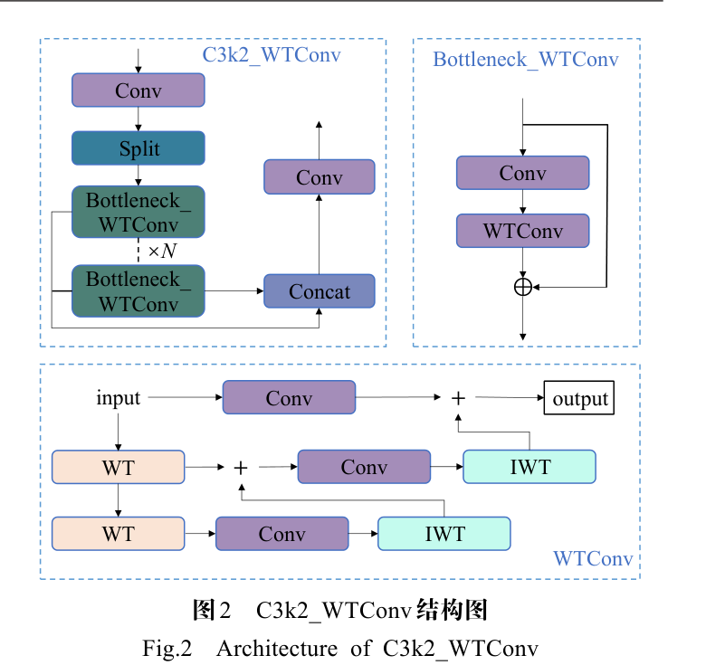

WTConv 采用 Haar 小波变换把输入信号分解到不同频率带再分别卷积，一维 Haar 小波变换表示为：

$$X_{LL}, X_{LH}, X_{HL}, X_{HH} = WT(X)$$

对二维图像，一维小波变换分别作用于行和列实现二维小波变换：

$$[X_{LL}, X_{LH}, X_{HL}, X_{HH}] = Conv([f_{LL}, f_{LH}, f_{HL}, f_{HH}], X)$$

四种滤波器形成一组正交基，可用转置卷积实现逆小波变换 IWT 将频率带重新组合为空间域信号：

$$X = Conv\text{-}transposed([f_{LL}, f_{LH}, f_{HL}, f_{HH}], [X_{LL}, X_{LH}, X_{HL}, X_{HH}])$$

WTConv 进一步通过递归分解低频分量实现级联小波分解，每一层分解表示为：

$$X_{LL}^{(i)}, X_{LH}^{(i)}, X_{HL}^{(i)}, X_{HH}^{(i)} = WT(X_{LL}^{(i-1)})$$

在不同频率图上执行小卷积核深度卷积后用 IWT 构建输出，整个过程表示为：

$$Y = IWT(Conv(W, WT(X)))$$

| 符号 | 含义 |
| --- | --- |
| X | 输入信号（输入张量） |
| WT、IWT | 小波变换、逆小波变换操作 |
| XLL | 低频分量，对应图像轮廓 |
| XLH、XHL、XHH | 水平、垂直、对角的高频分量 |
| fLL | 低频滤波器 |
| fLH、fHL、fHH | 一组高频滤波器 |
| Conv、transposed | 卷积操作、转置操作 |
| W | k×k 的深度卷积核权重张量，输入通道数为 X 的 4 倍 |
| i | 当前分解层级，且 XLL(0) = X |
| Y | 模块输出 |

直观上，卷积操作与频率分量分离后，感受野随级联深度指数级增长而参数量仅对数级增长；频率信息的分解与重构还使模型对目标形状更敏感，能够过滤水面纹理等高频噪声。本文用 WTConv 替换 YOLOv12 颈部网络 C3k2 模块的 Bottleneck 得到 C3k2_WTConv，其输出继续进入 Neck 的多尺度融合路径。

### C3k2_DynamicConv 模块

C3k2_DynamicConv 用于在保持低计算量的同时获得更多网络参数，以增强特征信息捕捉能力，其模块结构如下图所示。

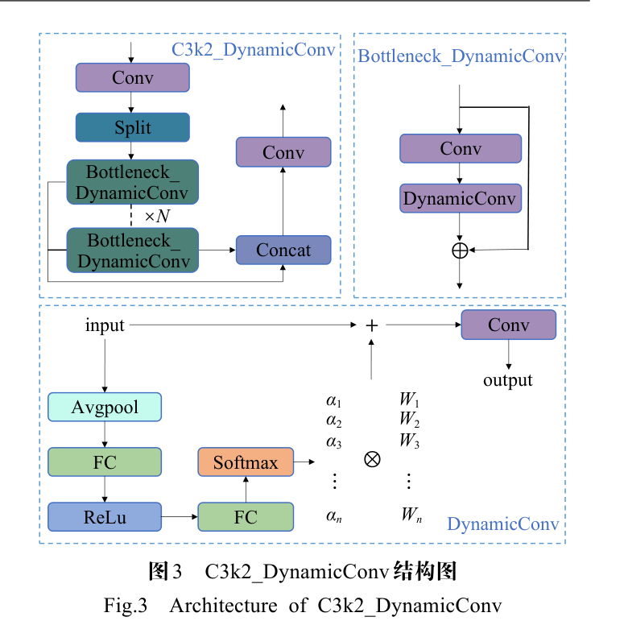

不同于固定的卷积核，DynamicConv 为每个输入样本动态生成卷积核权重。多个动态专家各自持有一个卷积核权重，对每个输入样本生成一组动态系数并按系数加权融合出最终卷积核：

$$W' = \sum_{i=1}^{M} \alpha_i W_i$$

权重系数由输入样本动态生成：对输入样本 X 全局平均池化压缩为向量后，经两层 MLP 处理并由 softmax 归一化：

$$\alpha = softmax(MLP(Pool(X)))$$

最终 DynamicConv 的输出表示为：

$$Y = X * W' = X * \sum_{i=1}^{M} \alpha_i W_i$$

| 符号 | 含义 |
| --- | --- |
| M | 动态专家数量 |
| αi | 第 i 个动态专家的权重系数，满足各系数之和为 1 |
| Wi | 第 i 个动态专家对应的卷积核权重 |
| α | 生成的系数向量 |
| Pool | 全局平均池化操作 |
| X、Y | 输入特征、卷积输出 |

直观上，卷积核不再全样本共享，而是随输入内容在专家权重之间插值，使同一层卷积能按样本特性切换响应模式。本文用 DynamicConv 替换 YOLOv12 骨干网络 C3k2 模块的 Bottleneck 得到 C3k2_DynamicConv，其输出送入后续骨干层与 Neck。

### DynamicConv 参数量与计算量分析

该小节用于回答「动态专家是否会拖垮部署」这一疑问，给出 DynamicConv 与标准卷积的开销比。标准卷积的参数量与计算量为 $Params = C_{out} \times C_{in} \times K \times K$、$FLOPs = W' \times H' \times C_{out} \times C_{in} \times K \times K$，DynamicConv 则额外包含系数生成模块与动态权重融合两部分开销，二者之比化简为：

$$Ratio_{param} \approx \frac{1}{K \times K} + M, \quad Ratio_{FLOPs} \approx 1$$

其中近似条件为 M ≪ Cout×K×K、Cin ≈ Cout 以及 1 ≪ M ≪ W'×H'，K 为卷积核大小，Cin 与 Cout 为输入和输出通道数。可以看出，DynamicConv 的计算量相比标准卷积层几乎没有增加，而参数量扩大至约 M 倍，这正是上一节模块「加参数不加计算量」设计的定量依据，也为后文消融试验中 GFLOPs 保持不变的现象提供了解释。

### WiseIoUv3 损失函数

WiseIoUv3 用于替换 CIoU，解决几何因素强调过度、低质量样本惩罚被放大而损害小目标检测的问题。YOLOv12 默认的 CIoU 损失各分量表示为：

$$\begin{cases} \alpha = \dfrac{v}{(1-IoU)+v} \\[2mm] v = \dfrac{4}{\pi^2}\left(\arctan\dfrac{w_{gt}}{h_{gt}} - \arctan\dfrac{w}{h}\right)^2 \\[2mm] CIoU = IoU - \left(\dfrac{\rho^2(b,b_{gt})}{c^2} + \alpha v\right) \\[2mm] L_{CIoU} = 1 - CIoU \end{cases}$$

WiseIoUv3 改用离群度评估锚框质量，其具有距离注意力的一代损失表示为：

$$L_{WIoUv1} = R_{WIoU}(1 - IoU), \quad R_{WIoU} = \exp\left(\frac{(x-x_{gt})^2 + (y-y_{gt})^2}{W_g^2 + H_g^2}\right)$$

| 符号 | 含义 |
| --- | --- |
| α | 权重因子 |
| v | 预测边界框和真实边界框的宽高比一致性 |
| w、h | 预测框的宽和高 |
| wgt、hgt | 实际框的宽和高 |
| ρ2(b,bgt) | 预测框中心点和真实框中心点欧几里得距离的平方 |
| c | 预测框和真实框最小外接矩形的对角线长度 |
| (x,y)、(xgt,ygt) | 预测框、真实框的中心坐标 |
| Wg、Hg | 同时包含预测框和真实框的最小外围框宽高 |
| β | 离群度，为目标 IoU 损失与当前 IoU 损失的比值 |
| RWIoU | 距离损失 |
| LWIoUv1 | 具有距离注意力的 1 代 WiseIoU |

LWIoUv3 即在 LWIoUv1 之上乘以由离群度 β 与超参数 α、δ 调节的比例因子。梯度增益分配策略对离群度小与离群度大的锚框都分配较小的梯度增益，使回归聚焦于数量最多的普通质量锚框，同时防止低质量锚框产生有害梯度。WiseIoUv3 原作者在 MS-COCO 数据集上得出的最佳超参数为 α=1.9 和 δ=3，本文则针对水面纹理影响严重、小目标多的场景重新探究最佳组合，结果见实验节。

### WDW-YOLO 总体结构

WDW-YOLO 是上述三项改进的集成，模型结构如下图所示。

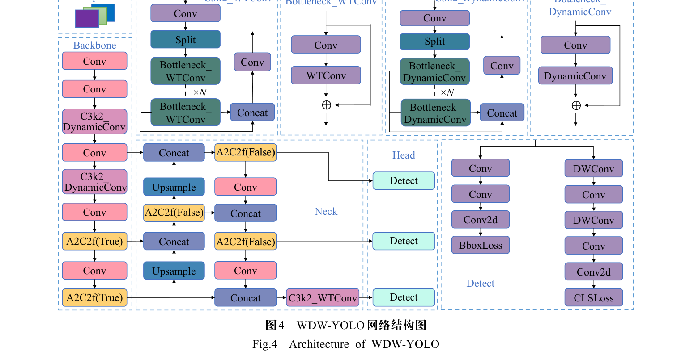

对照结构图可以看出三处改进的落点：Backbone 中的 C3k2 被替换为 C3k2_DynamicConv，通过动态生成卷积核权重在不引入过多计算量的前提下增加网络参数；Neck 中的 C3k2 被替换为 C3k2_WTConv，通过小波变换扩大感受野和频率响应；检测头的边界框损失采用最佳超参数组合的 WiseIoUv3，提高对普通质量锚框的关注以增强小目标检测能力。网络接收水面图像，输出垃圾目标的类别概率与边界框坐标。

## 实验结果

### 实验设置

实验基于 Linux 20.04 操作系统与 NVIDIA GeForce RTX 4090D GPU，使用基于 Python 3.8.0 的 PyTorch 2.0.0 搭建模型并采用 CUDA 11.7 加速，完整配置参数如下图所示。

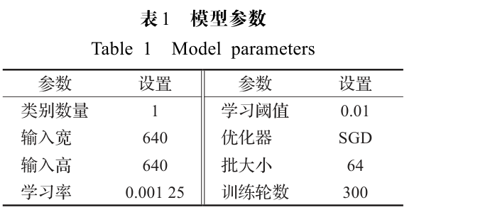

配置中类别数量为 1，即只检测水面垃圾单一类别，优化器为 SGD、学习率 0.001 25、学习阈值 0.01，训练 300 轮、批大小 64、输入 640×640。数据集采用 FloW_IMG，由欧卡智舶公司发布，是全球第一个无人船视角的水面漂浮垃圾检测数据集，共 2 000 张图像和 5 271 个标注对象，尺寸小于 32×32 的小目标占比较高，典型场景如下图所示。

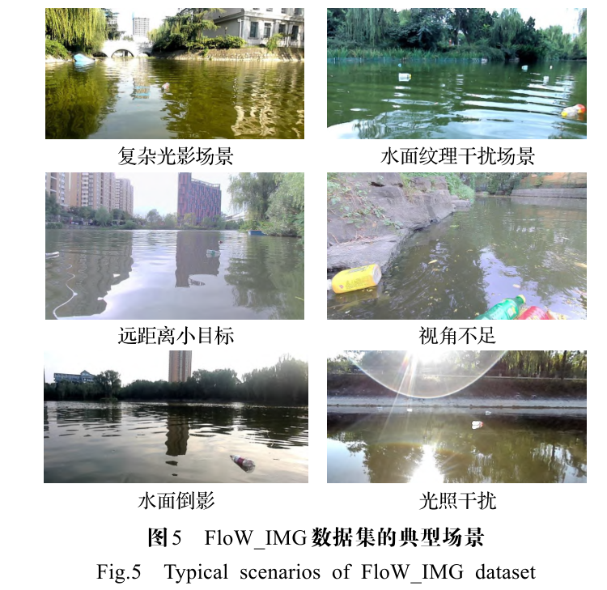

场景覆盖复杂光影、水面倒影、光照干扰、水面纹理干扰、视角不足与远距离小目标六类挑战。评价指标为准确率 P、召回率 R、mAP50、mAP50-95 以及参数量与计算量，精确率与召回率的计算公式如下：

$$P = \frac{TP}{TP+FP}, \quad R = \frac{TP}{TP+FN}$$

mAP 的计算公式如下：

$$mAP = \frac{1}{n}\sum_{i=1}^{N} AP_i = \frac{1}{n}\sum_{i=1}^{N} \int P\,dR$$

其中 TP 为检测垃圾正确的目标数量，FP 为检测错误垃圾的目标数量，FN 为漏检垃圾的目标数量，AP 为 PR 曲线下的面积，N 为目标检测类别的数量。直观上，mAP50-95 在 IoU 阈值 0.5 到 0.95 区间取平均，对边界框定位质量的要求比 mAP50 更严格。

### 可视化分析

远距离小目标场景下的检测效果对比如下图所示，WDW-YOLO 凭借更强的小目标检测能力，对图像中部偏右小目标的识别准确率提高 7 个百分点。

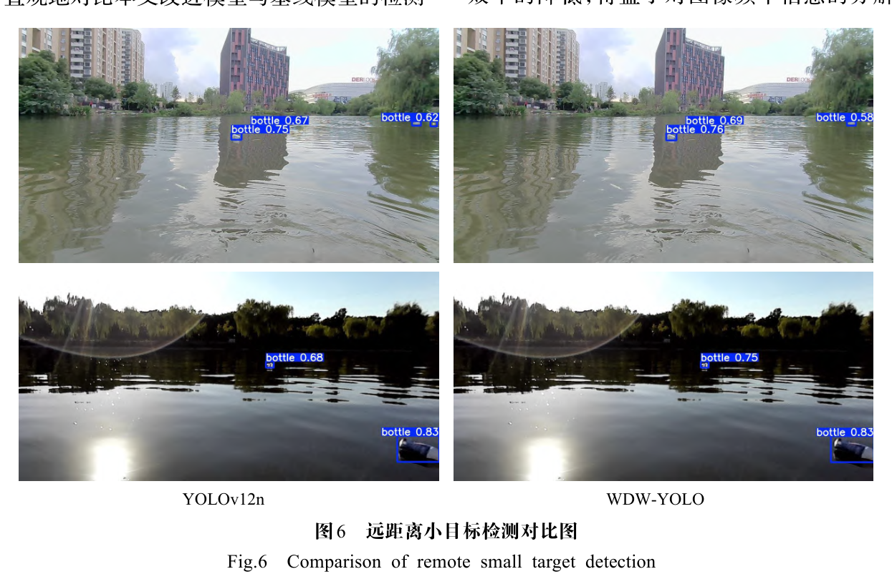

视角不足与光照影响场景下，基线模型未能识别图像左下角受影响较大区域中的水面垃圾，而 WDW-YOLO 成功识别该目标并对其余垃圾的识别准确率也有提升，对比如下图所示。

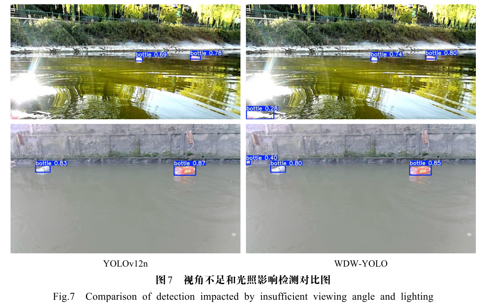

水面纹理变化及干扰物体场景下，基线模型出现错误识别，而 WDW-YOLO 得益于对图像频率信息的分解和重构，更好地捕捉低频部分的全局结构信息、抑制高频部分的水面纹理变化，未错判非水面垃圾物体，对比如下图所示。

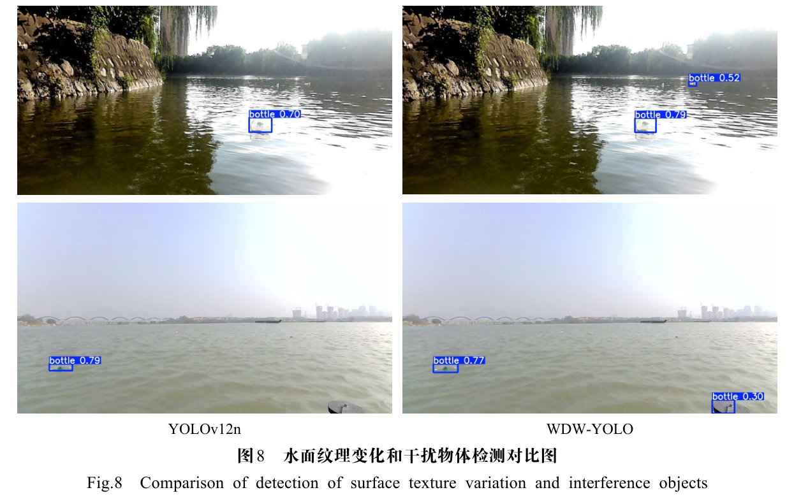

Grad-CAM++ 热力图进一步给出注意力层面的证据，如下图所示。

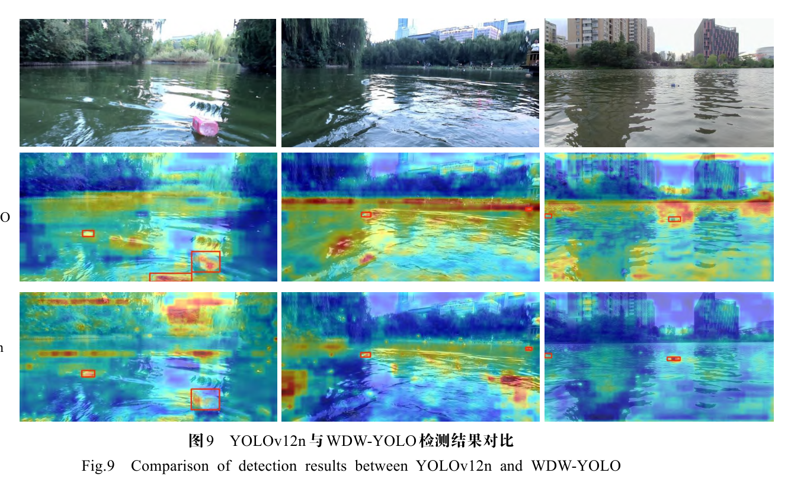

第 1 列中基线模型对远距离楼房和树木给予过多关注而缺乏对水面的关注，改进模型则聚焦于可能出现垃圾的水面；第 2 列中基线模型对水面纹理干扰部分关注不足容易漏检，改进模型对水面投入更均衡的关注度；第 3 列中受岸边楼房倒影与波纹影响基线模型无法有效覆盖水面，改进模型虽错误分配一部分关注度至天空，但对水面的关注仍高于基线。检测效果图组与热力图相互印证，可以看出改进模型的关注策略更好地覆盖了更可能出现垃圾的水面区域。

### WiseIoUv3 超参数实验

在添加前两项改进的前提下，以 mAP50 为指标对 WiseIoUv3 的超参数组合进行网格实验，结果如下表所示。

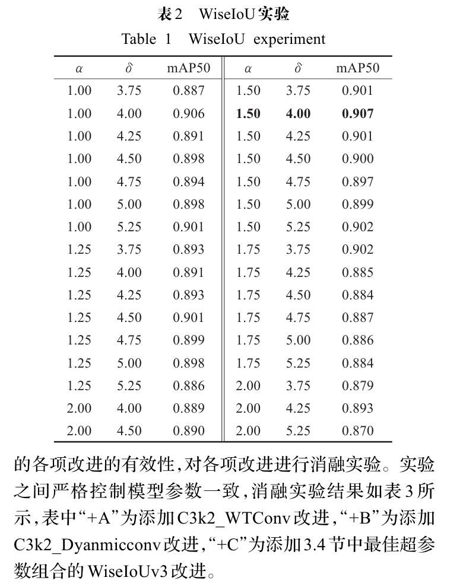

α=1.5 和 δ=4.0 时 mAP50 达到最大值 90.7%，相比不替换 CIoU、仅采用前两个改进时的 89.9% 提升 0.8 个百分点；当 α=1.5 且 δ∈[3.75,4.5] 时 mAP50 落入 [0.9,0.907] 的极大值区间，而其他不佳超参数组合对 mAP50 作用不大甚至起到负作用。可见在水面垃圾与类似小目标场景中，WiseIoUv3 超参数的最佳组合为 α=1.5 和 δ∈[3.75,4.5]。

### 消融实验

消融实验逐项叠加三项改进，表中 +A 为添加 C3k2_WTConv、+B 为添加 C3k2_DynamicConv、+C 为添加最佳超参数组合的 WiseIoUv3，结果如下表所示。

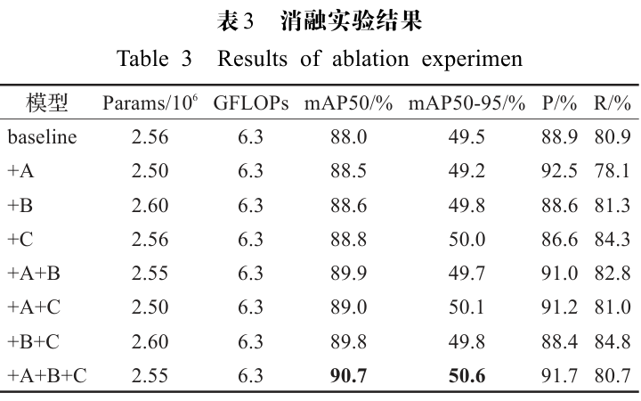

引入 WTConv 后 mAP50 增长 0.5 个百分点、准确率增长 3.6 个百分点，且参数量由 $2.56\times10^6$ 降至 $2.50\times10^6$；引入 DynamicConv 后参数量增长而计算量保持 6.3 GFLOPs 不变，mAP50 与 mAP50-95 都有明显提升；最终叠加 WiseIoUv3 后 mAP50 与 mAP50-95 达到 90.7% 与 50.6%。三项改进的增益逐级叠加，可见感受野、特征捕捉与样本平衡三条改进线路各自生效且互不冲突。

### 对比实验

对比实验将 WDW-YOLO 与 8 种 YOLO 系列经典模型及 ASF-YOLO、Hyper-YOLO 系列在同数据集下比较，结果如下表所示。

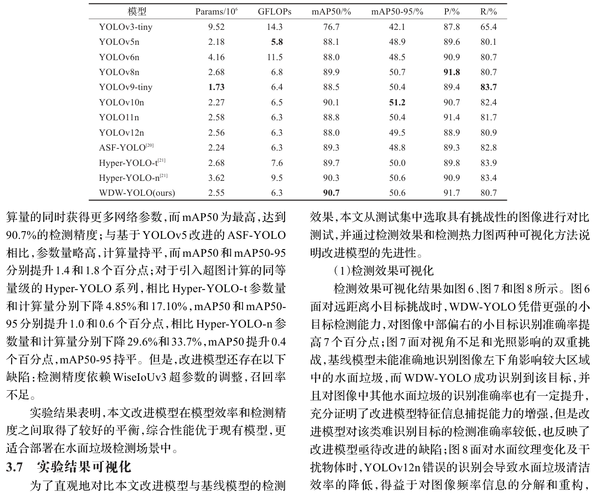

WDW-YOLO 的 mAP50 达到最高的 90.7%，参数量仅略高于 YOLOv5n、YOLOv9-tiny 和 YOLOv10n，计算量仅高于 YOLOv5n；与 ASF-YOLO 相比 mAP50 和 mAP50-95 分别提升 1.4 和 1.8 个百分点；相比 Hyper-YOLO-t 参数量和计算量分别下降 4.85% 和 17.10%、mAP50 和 mAP50-95 分别提升 1.0 和 0.6 个百分点，相比 Hyper-YOLO-n 参数量和计算量分别下降 29.6% 和 33.7%、mAP50 提升 0.4 个百分点而 mAP50-95 持平。精度领先与开销持平同时出现，表明 WDW-YOLO 在模型效率和检测精度之间取得了较好的平衡，更适合部署在水面垃圾检测场景中。

## 优点和创新点

个人认为，本文有如下一些优点和创新点可供参考学习：

1. 三项改进分别对应感受野有限、特征捕捉弱与小目标检测能力弱三处短板，并给出参数量与计算量比值公式，证明参数量扩大约 M 倍而计算量几乎不变。
2. 针对 WiseIoUv3 超参数在水面小目标场景开展网格实验，给出 α=1.5 与 δ∈[3.75,4.5] 的最佳组合及极大值区间，弥补原作者 MS-COCO 结论难以直接迁移的场景差异。
3. 可视化覆盖远距离小目标、光照干扰与水面纹理干扰三类挑战场景及 Grad-CAM++ 热力图，逐列说明改进模型与基线的关注差异，结论证据直观可信。
