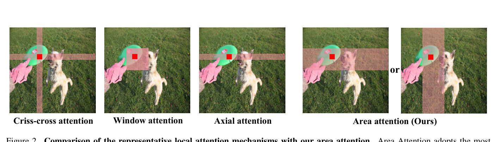
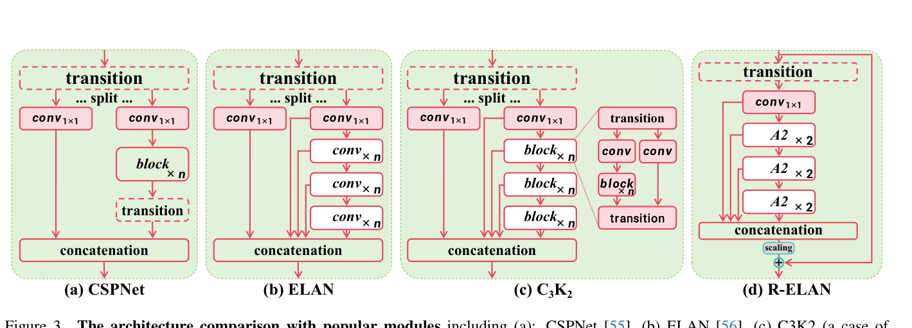
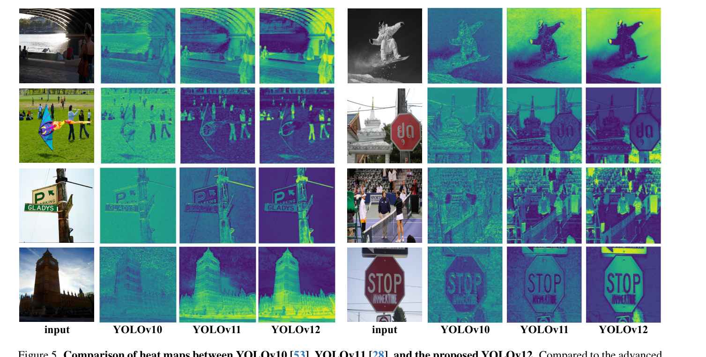
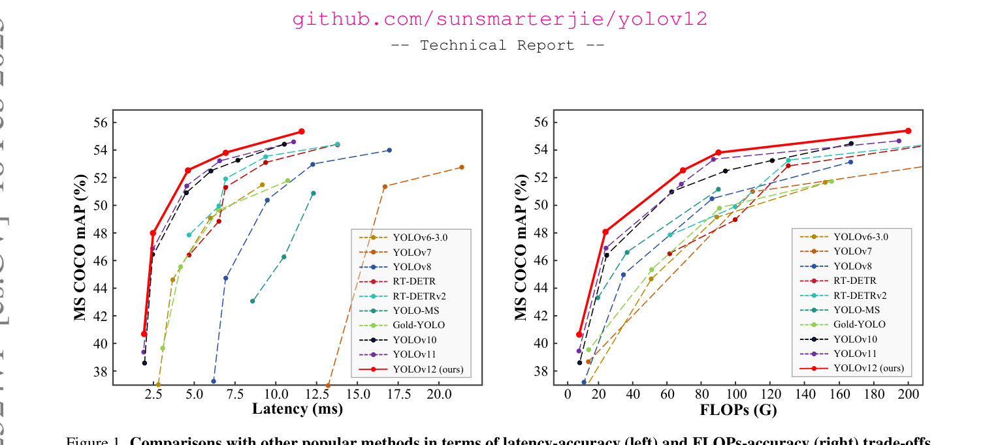
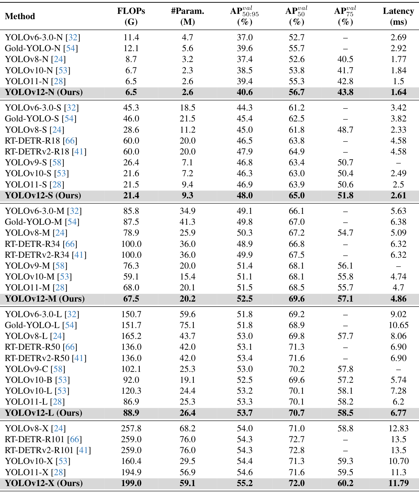
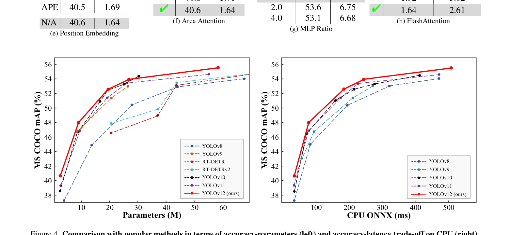
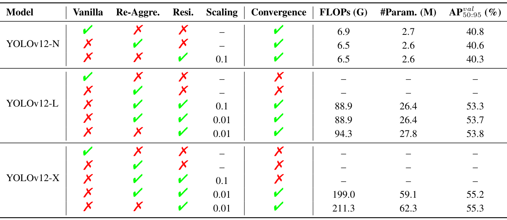
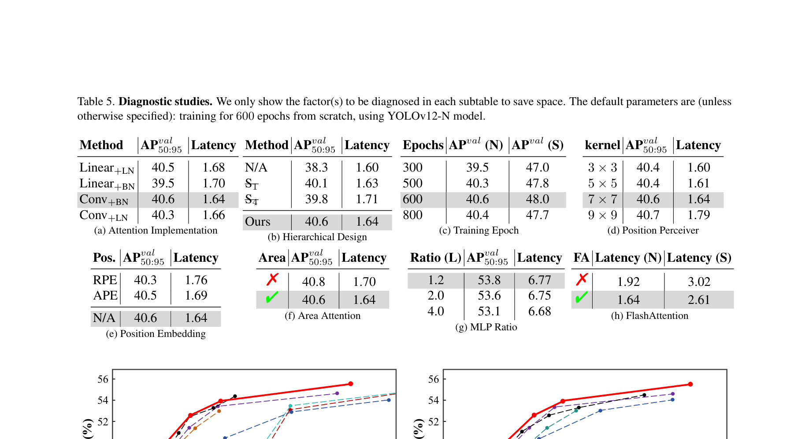
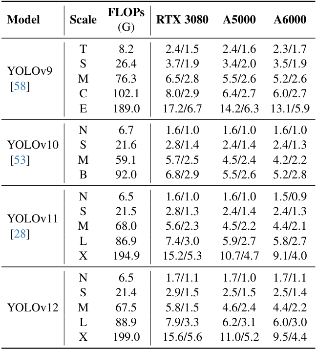

# YOLOv12: Attention-Centric Real-Time Object Detectors

Paper Reading 是从个人角度进行的一些总结分享，受到个人关注点的侧重和实力所限，可能有理解不到位的地方。具体的细节还需要以原文的内容为准，博客中的图表若未另外说明则均来自原文。

| 论文概况 | 详细 |
| --- | --- |
| 标题 | 《YOLOv12: Attention-Centric Real-Time Object Detectors》 |
| 作者 | Yunjie Tian、Qixiang Ye、David Doermann |
| 发表会议 | 未获取（arXiv 技术报告，编号 arXiv:2502.12524） |
| 会议等级 | 未获取 |
| 发表年份 | 2025 |
| 论文代码 | [https://github.com/sunsmarterjie/yolov12](https://github.com/sunsmarterjie/yolov12) |

作者单位：

1. 纽约州立大学布法罗分校（University at Buffalo）
2. 中国科学院大学（University of Chinese Academy of Sciences）

## 研究动机

实时目标检测是计算机视觉领域的重要问题，表现为需要在资源受限的平台上以足够低的时延给出检测结果，导致网络架构设计始终是 YOLO 系研究的首要议题。YOLO 系列凭借时延与精度的最佳平衡长期主导该领域，损失函数、标签分配与架构设计三条改进路线中，架构改进又最为关键。然而以注意力为中心的视觉 Transformer 架构已被证明拥有更强的建模能力，即便在小模型上也是如此，却始终没有成为 YOLO 的主线。原因落在注意力机制的低效上：一方面自注意力的计算复杂度随序列长度二次增长，卷积却只线性增长；另一方面注意力计算要把注意力图与 softmax 图在 GPU SRAM 与高带宽内存之间反复存取，不规则的访存模式进一步推高时延。Swin 一类窗口划分、位置编码等复杂设计还会逐层累积速度开销，使相似计算预算下 CNN 架构明显跑赢注意力架构。在推理速度即生命线的 YOLO 系统里，注意力机制的采用因此长期受限，暂未有工作把注意力作为核心建模组件引入 YOLO 框架的同时保住实时速度。

## 文章贡献

针对注意力机制追不上 CNN 速度、因而难以进入 YOLO 框架的问题，本文提出了以注意力为中心的实时检测框架 YOLOv12。其核心是三层设计：用区域注意力降低注意力复杂度、用 R-ELAN 解决注意力带来的优化难题、对原生注意力做系统性改造以适配 YOLO。首先区域注意力模块 A2 把特征图沿竖直或水平方向均分为若干区域，仅需一次 reshape 即把注意力计算量降到原来的四分之一，同时保住大感受野；接着 R-ELAN 在 ELAN 基础上引入块级残差与缩放因子，并把特征聚合改为瓶颈结构，化解大尺度模型的收敛困难；最终框架引入 FlashAttention 攻克访存瓶颈，移除位置编码、把 MLP 比例从 4 调到 1.2、用 Conv+BN 替换 Linear+LN，并加入 7×7 位置感知器帮助注意力感知位置。实验表明，YOLOv12-N 在 MSCOCO 2017 上以 1.64 ms 时延取得 40.6% mAP，超过 YOLOv10-N 与 YOLOv11-N 达 2.1% 与 1.2% mAP，且优势在 N 到 X 五个尺度上一致保持。

## 本文方法

### 注意力效率瓶颈分析

效率分析用于定量回答「注意力为什么比 CNN 慢」，为后续每个设计提供靶点。自注意力与卷积的计算复杂度分别表示为：

$$C_{attn} = O(L^2 d), \quad C_{conv} = O(k L d)$$

其中 $L$ 是输入序列长度；$d$ 为特征维度；$k$ 是卷积核大小，通常远小于 $L$。复杂度之外，第二个瓶颈在访存：自注意力过程中注意力图 $QK^T$ 与 $L \times L$ 的 softmax 图需要从高速 GPU SRAM 存到高带宽内存 HBM、计算时再取回，而前者的读写速度是后者的十倍以上，不规则的访存模式相比 CNN 结构化、局部化的滑动窗口访存又引入额外时延。直观上，这两个因素一个拖慢「算」、一个拖慢「搬」，共同构成注意力的速度劣势；本文用 A2 对付前者、用 FlashAttention 对付后者，其余设计则避免再叠加新的速度开销。

### 整体架构

YOLOv12 保留此前 YOLO 系统的层级式设计而非 plain 视觉 Transformer 结构，共含 N、S、M、L、X 五个尺度。骨干前两阶段继承 YOLOv11 的 C3k2 块、不引入注意力，后续阶段以 R-ELAN 为基本块、块内嵌 A2 注意力；最近版本在骨干末阶段堆叠三个块的做法被移除，只保留单个 R-ELAN 块以减少块数、利于优化；颈部与检测头沿用 YOLOv11 的设定，不使用 YOLOv11 之外的额外技巧。各组件的分工如下表所示。

| 组件 | 模块 | 功能 |
| --- | --- | --- |
| Backbone 前两阶段 | C3k2（GELAN 特例） | 继承 YOLOv11 的高效浅层特征提取 |
| Backbone 后两阶段 | R-ELAN + A2 | 注意力建模与稳定聚合 |
| 末阶段 | 单个 R-ELAN 块 | 减少块数、利于优化 |
| 加速组件 | FlashAttention | 攻克注意力访存瓶颈 |

骨干输出的多尺度特征进入颈部融合后由检测头输出结果，A2 与 R-ELAN 的产物都在骨干内部完成。

### 区域注意力 A2

A2 的目标是以最简单的方式降低注意力的计算复杂度，同时保住足够大的感受野。线性注意力虽能把复杂度从 $2n^2hd$ 降到 $2nhd^2$，却存在全局依赖退化、不稳定与分布敏感等问题，且受低秩瓶颈限制，在 640×640 输入的 YOLO 上速度优势有限；窗口、criss-cross、轴向等局部注意力则因划分操作引入开销或缩小感受野。A2 的做法如下图所示。

A2 把分辨率为 $(H, W)$ 的特征图均分为 $l$ 段、每段大小为 $(H/l, W)$ 或 $(H, W/l)$，默认 $l = 4$；与窗口注意力不同，它不需要显式的窗口划分与还原，只需一次 reshape。注意力的计算量因此表示为：

$$C_{A2} = \frac{1}{4} \cdot 2n^2 h d$$

其中 $n$ 是 token 数；$h$ 为注意力头数；$d$ 是头尺寸。感受野缩到原来的四分之一但仍属大感受野；当输入为 640×640、$n$ 固定时，即便复杂度仍是 $n^2$ 量级也足以满足 YOLO 的实时要求。直观上，等分区域是最朴素的局部化方案，省去一切划分开销，实验显示它对精度只有轻微影响却显著提速。A2 嵌入 R-ELAN 块内部，替换原生全局注意力。

### 残差高效层聚合网络 R-ELAN

R-ELAN 用于解决注意力引入后的优化难题，主要影响大尺度模型。原 ELAN 把 transition 层（1×1 卷积）的输出分成两支，一支经多个模块处理后与另一支拼接、再过 transition 对齐维度；该结构会造成梯度阻塞、缺少输入到输出的残差连接，叠加注意力后问题更严重：L 与 X 尺度模型即使换用 Adam 或 AdamW 也无法收敛或持续不稳定。R-ELAN 的结构与 CSPNet、ELAN、C3K2 的对比如下图所示。

R-ELAN 的两处改进为：其一，在块内引入输入到输出的残差捷径并乘缩放因子（默认 0.01），思路类似构建深层视觉 Transformer 的 layer scaling，但实验表明把 layer scaling 加在每个 A2 上既不能解决收敛问题又会拖慢时延，说明症结在 ELAN 结构本身；其二，重新设计聚合方式，transition 层只调整通道数产出单张特征图，经后续块处理后再做拼接，形成瓶颈结构，在保留原有特征整合能力的同时降低计算量与参数、内存占用。R-ELAN 作为骨干后段的基本块承载 A2，其残差与缩放配置在消融节按尺度给出。

### 结构层面的适配改造

结构层面的改造用于让注意力架构贴合 YOLO 的实时约束，共三项。第一，引入 FlashAttention 攻克注意力的 HBM 访存瓶颈，这是直接采用而非本文首创；第二，保留层级式设计，诊断实验显示 plain 视觉 Transformer 会让精度大幅下跌，而省略第一或第四阶段的折中方案也有可见损失；第三，移除最近版本在骨干末阶段堆叠三个块的设计，只保留单个 R-ELAN 块，减少总块数以利于优化。这三项分别对应访存、拓扑与深度三个维度，与块内改造共同构成完整框架。

### 注意力内部的适配改造

注意力内部的改造用于在精度与速度之间重新分配计算资源，各改进项与目的如下表所示。

| 改进项 | 设定 | 目的 |
| --- | --- | --- |
| FlashAttention | 直接采用 | 解决注意力访存低效 |
| 位置编码 | 移除 | 架构更干净、推理更快 |
| MLP 比例 | 4 调至 1.2（N/S/M 为 2） | 在注意力与前馈网络间重新分配计算 |
| Linear+LN | 改为 nn.Conv2d+BN | 充分利用卷积算子的计算效率 |
| 位置感知器 | 7×7 大核可分离卷积作用于注意力值 v，输出加到 v@attn 上 | 借卷积的平滑效应保留像素位置、帮助 A2 感知位置 |
| 末阶段块数 | 三块堆叠改为单个 R-ELAN | 减少块数、利于优化 |

位置感知器的卷积核扩大自 YOLOv10 的 PSA 模块，本文把核扩到 7×7，在不影响速度的前提下提升性能。MLP 比例下调把更多计算量让给注意力机制，凸显区域注意力的地位。这些改造的输出汇入 R-ELAN 块，与结构层改造一起完成从原生注意力到 YOLO 可用注意力的转换。

## 实验结果

### 实验设置

本文在 MSCOCO 2017 数据集上验证，含 N、S、M、L、X 五个变体。所有模型从零训练 600 个 epoch，SGD 优化器初始学习率 0.01、动量 0.937、权重衰减 5×10⁻⁴、batch size 为 32×8，线性学习率衰减并在前 3 个 epoch 线性 warm-up，训练硬件为 8 块 NVIDIA A6000；时延统一在 T4 GPU 上以 TensorRT FP16 测得，与 YOLOv10、RT-DETR 的评测协议一致。基线为 YOLOv11，模型缩放策略与其相同，不使用 YOLOv11 之外的任何技巧。评测指标为 mAP@0.5:0.95、mAP@0.5、mAP@0.75 及按尺度划分的 AP。

### 定性效果对比

X 尺度模型骨干第三阶段的热力图对比如下图所示，高亮区域代表模型激活的位置。

相比 YOLOv10 与 YOLOv11，YOLOv12 给出更清晰的物体轮廓与更精确的前景激活。本文的解释是区域注意力拥有比卷积网络更大的感受野，更擅长捕获整体上下文，从而带来更准的前景激活，这一特性被视为 YOLOv12 性能优势的来源。

### 定量对比

各尺度模型与主流实时检测器的时延-精度、FLOPs-精度权衡如下图所示。

YOLOv12 在两张散点图上都压出更优的边界。完整数字如下表所示。

N 尺度上 YOLOv12-N 以 6.5 G FLOPs、2.6 M 参数取得 40.6% mAP 与 1.64 ms 时延，比 YOLOv6-3.0-N、YOLOv8-N、YOLOv10-N、YOLOv11-N 分别高 3.6%、3.3%、2.1%、1.2% mAP；S 尺度上 YOLOv12-S 以 21.4 G、9.3 M 取得 48.0 mAP，比 YOLOv8-S 至 YOLOv11-S 高 3.0%、1.2%、1.7%、1.1%，且比 RT-DETR-R18 / RT-DETRv2-R18 快 42%、只用其 36% 的计算与 45% 的参数；L 尺度上 YOLOv12-L 比 YOLOv10-L 少 31.4 G FLOPs 仍取胜，比 RT-DETR-R50 / RT-DETRv2-R50 少 34.6% FLOPs 与 37.1% 参数；X 尺度上 YOLOv12-X 以 55.2 mAP 超过 YOLOv10-X / YOLOv11-X 达 0.8% 与 0.6%，可见注意力红利在五个尺度上一致兑现。按目标尺度细分的指标如下表所示。

从 N 到 X，小目标 AP 由 20.2% 升到 39.6%、大目标 AP 由 58.4% 升到 70.9%，各尺度子指标随模型容量单调改善，说明架构收益并非只集中在某一类目标上。参数量-精度与 CPU 时延-精度权衡如下图所示。

左图中 YOLOv12 的边界越过以参数少著称的 YOLOv10，右图中在 Intel Core i7-10700K 上 YOLOv12 同样占住更优边界，表明其效率优势不依赖特定 GPU。

### 消融实验

R-ELAN 各组件在 N、L、X 三个尺度上的消融如下表所示。

小模型上残差连接不影响收敛但会损害性能（YOLOv12-N 从 40.8% 降到 40.6% 再到加残差后的 40.3%），大模型上残差却是稳定训练的必要条件：YOLOv12-L 与 X 在无残差的两种配置下均不收敛，YOLOv12-X 还需要最小缩放因子 0.01 才能收敛；提出的特征整合方法则把 YOLOv12-L 的 FLOPs 从 94.3 G 压到 88.9 G、参数从 27.8 M 压到 26.4 M，mAP 仅从 53.8% 微降到 53.7%，说明瓶颈聚合以几乎免费的精度代价换来了复杂度下降。八组设计诊断如下表所示。

Conv+BN 以 40.6% mAP、1.64 ms 胜过 Linear+LN 的 40.5%、1.68 ms；plain 结构只有 38.3% mAP，省略第一或第四阶段分别损失 0.5% 与 0.8%，层级设计仍是最优；训练轮数在 600 epoch 达峰（N/S 为 40.6%/48.0%），800 epoch 反而回落；位置感知器核从 3×3 扩到 7×7 提升 0.2% mAP 而时延仅增 0.04 ms，9×9 则明显变慢；不用任何位置编码反而最好（40.6% 对 RPE 的 40.3%、APE 的 40.5%）；开启 FlashAttention 后区域注意力只损失 0.2% mAP 却把时延从 1.70 ms 降到 1.64 ms；MLP 比例 1.2 在 L 尺度上以 53.8% 胜过 2.0 与 4.0；FlashAttention 单独为 N/S 提速约 0.3 ms 与 0.4 ms。八张子表逐条印证了第 3 节的每项改造。

### 速度与效率

区域注意力在不同硬件上的提速效果如下表所示（该实验未启用 FlashAttention，以免掩盖速度差）。

RTX 3080 上 FP32 时延从 YOLOv12-N 的 2.7 ms 降到 2.0 ms，CPU 上从 62.9 ms 降到 31.4 ms；YOLOv12-S 的 CPU 时延从 130.0 ms 降到 78.4 ms，YOLOv12-X 从 804.2 ms 降到 512.5 ms，提速在 GPU 与 CPU、FP32 与 FP16 上全面一致。跨 GPU 的推理速度对比如下表所示。

RTX 3080 上 YOLOv9-T 的 FP32/FP16 时延为 2.4/1.5 ms，YOLOv12-N 为 1.7/1.1 ms，显著快于 YOLOv9 并与 YOLOv10、YOLOv11 持平，A5000 与 A6000 上趋势相同，说明注意力架构首次在速度上追平了 CNN 阵营。

## 优点和创新点

个人认为，本文有如下一些优点和创新点可供参考学习：

1. 把注意力作为核心建模组件引入 YOLO 框架，用区域注意力与 FlashAttention 攻克复杂度与访存两大瓶颈，YOLOv12-N 以同档速度超 YOLOv11-N 达 1.2% mAP。
2. R-ELAN 以块级残差加 0.01 缩放与瓶颈式聚合改造 ELAN，化解注意力大模型的收敛难题，N、L、X 三档消融把收敛性、FLOPs 与 mAP 的证据链给得完整。
3. 诊断实验体系完备，注意力实现、层级结构、训练轮数、位置感知器、位置编码、区域注意力、MLP 比例与 FlashAttention 八项设计逐条配表验证，结论可复核、说服力强。
