# 基于改进 YOLOv12n 的 PCB 缺陷检测算法研究

Paper Reading 是从个人角度进行的一些总结分享，受到个人关注点的侧重和实力所限，可能有理解不到位的地方。具体的细节还需要以原文的内容为准，博客中的图表若未另外说明则均来自原文。

| 论文概况 | 详细 |
| --- | --- |
| 标题 | 《基于改进 YOLOv12n 的 PCB 缺陷检测算法研究》 |
| 作者 | 王宇、魏利胜、张平改、胡保玲 |
| 发表期刊 | 电子测量与仪器学报（网络首发） |
| 期刊等级 | 北大核心、CSCD 核心 |
| 发表年份 | 2026 |
| 论文代码 | 未获取 |

作者单位：

1. 安徽工程大学电气工程学院，芜湖 241000
2. 巢湖学院计算机与人工智能学院，巢湖 238024
3. 上海大学机电工程与自动化学院，上海 200444

## 研究动机

印刷电路板 PCB 是电子产品的核心基础部件，其设计精度与制造良率直接决定电子设备的运行稳定性与综合性能，生产全流程中任意环节的工艺偏差都可能引发短路、断路、毛刺等各类细微缺陷。然而，这类缺陷普遍尺寸微小、隐蔽性强、特征辨识度低，传统人工目视检测不仅效率难以匹配规模化生产线节拍，还易受检测人员主观状态与视觉疲劳影响而出现误检、漏检。现有方法沿两条脉络推进：电气性能测试、超声扫描、红外热成像等传统手段精度低、效率差、成本高且易损伤元器件；深度学习方法已成为主流，其中 Faster R-CNN 等两阶段检测器结构冗余、推理速度慢、硬件部署门槛高，YOLO 系列单阶段方法更轻量，但已有改进仍存在各自取舍——有工作引入 SPD-Conv 与 BiFPN 提升精度却计算量大，有工作设计多尺度加权通道融合与混合空间金字塔卷积却增加网络复杂度、精度与速度无法兼顾，有工作增设小目标检测头与并行补丁感知注意力却使计算量增加较多，有工作增强多尺度表征却使计算成本略微上升。在工业边缘设备计算资源受限的约束下，现有模型仍难以兼顾轻量化与检测精度，暂未有工作从骨干参数、跨尺度信息完整性、多尺度上下文融合与分类-定位任务协同四个方面联合优化。

## 文章贡献

针对上述局限，本文提出一种基于 YOLOv12n 的轻量化 PCB 缺陷检测算法，其核心是对骨干、Neck 与检测头的四处改进。首先设计融合令牌混合器采用深度可分离卷积的 C3K2-CF 模块，在具有更少参数的同时提高对小目标的感知能力；接着提出特征融合增强网络 FFEN，在跨尺度特征传递中保证目标信息的完整，强化模型对目标的关注能力；然后设计特征聚焦融合模块 FFF，实现多尺度上下文信息的充分融合，增强模型对复杂特征的提取能力；最终引入任务对齐动态检测头 TADDH，打通定位与分类双检测头的信息交互通道，提升对小尺寸缺陷的检测精度。实验表明，在数据增强后的 PKU-Market-PCB 数据集上改进算法 mAP@0.5 达到 98.6%，更严格的 mAP@0.5:0.95 提升 7.2%，参数量和计算量分别减少 47.2% 和 16.9%；在 Deep PCB 公开数据集上 mAP@0.5 达到 97.5%。

## 本文方法

改进模型以 YOLOv12n 为基底，四处改进分别落在骨干特征提取、Neck 特征融合与检测头任务协同三个环节。

### YOLOv12n 基线与整体结构

改进模型的整体结构如下图所示，骨干、Neck 与检测头三处均被替换或增强。

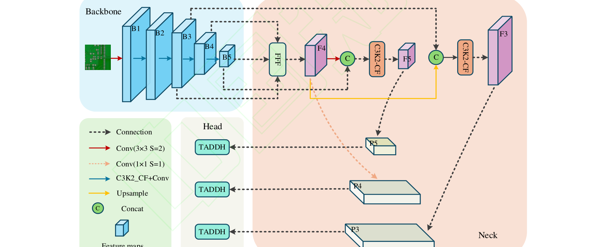

YOLOv12 的主干网络通过五阶段特征提取生成 S0–S4 五层特征，区域注意力模块 Area Attention 对中高层特征 S2–S4 划分 K 个区域（默认 K=4）做尺度内优化，R-ELAN 以单路径瓶颈结构重构特征聚合路径，模型还通过动态锚框生成机制自适应调整先验框尺寸并采用双路径监督策略。但基线在 PCB 场景存在三点不足：大网格设计与深层次预测机制对小目标的检测能力弱；标准卷积主干全局感受野受限，复杂背景下缺陷特征辨识度不足；轻量化模型参数量与网络深度受限，难以充分提取细节特征与语义信息。对应地，本文以 C3K2-CF 替换骨干中的 C3K2、在 Neck 中引入 FFEN 与 FFF、以 TADDH 替换检测头，三者输出沿 Backbone、Neck、Head 的数据流依次衔接。

### C3K2-CF 轻量化特征提取模块

C3K2-CF 用 ConvFormer 令牌混合器重构 C3K2 模块，在压缩参数的同时增强微小特征感知，ConvFormer 结构与原 Bottleneck 的对比如下图所示。

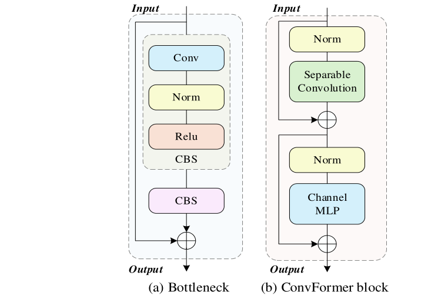

ConvFormer 作为 MetaFormer 体系中纯卷积范式的实例化模型，完全摒弃计算昂贵的注意力机制，仅依靠卷积操作实现全局特征交互；其核心算子 SConv 由逐深度卷积 DWConv 与逐点卷积 PWConv 两部分组成，如下图所示。

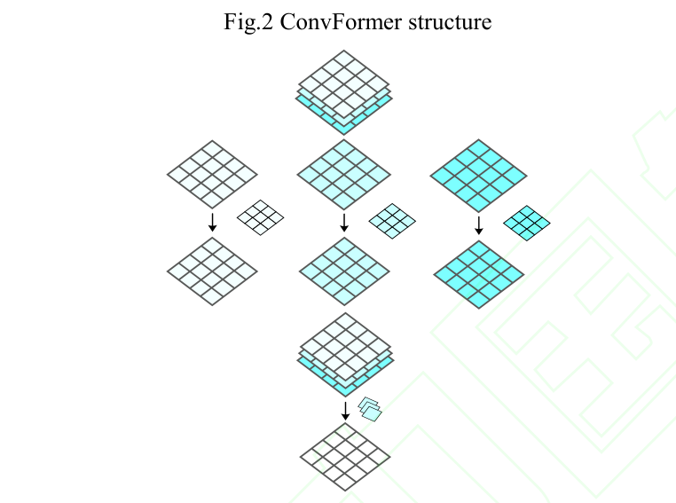

对于尺寸为 H×W×C 的输入特征图，标准卷积的参数量与计算量可分别表示为：

$$
\begin{aligned}
Parm_{conv} &= N \times K^{2} \times C \\
Calc_{conv} &= N \times K^{2} \times W \times H \times C
\end{aligned}
$$

SConv 先通过 DWConv 对每个通道单独进行空间特征提取，再通过 PWConv 完成通道维度的融合与输出通道数调整，其参数量与计算量及二者与标准卷积的比例关系为：

$$
\begin{aligned}
Parm_{dsc} &= K^{2} \times C + C \times N \\
Calc_{dsc} &= K^{2} \times W \times H \times C + W \times H \times C \times N \\
\frac{Parm_{dsc}}{Parm_{conv}} = \frac{Calc_{dsc}}{Calc_{conv}} &= \frac{1}{K^{2}} + \frac{1}{N}
\end{aligned}
$$

其中各符号的含义为：

| 符号 | 含义 |
| --- | --- |
| $N$ | 输出通道数 |
| $K$ | 卷积核尺寸 |
| $C$ | 输入通道数 |
| $H$、$W$ | 输入特征图的高度与宽度 |

直观上，替换后参数量与计算量按 1/K²+1/N 的比例压缩；实际应用中通道数 N 通常大于卷积核尺寸 K，因此采用 SConv 替换标准卷积可大幅降低网络的参数量与计算量，同时减少冗余卷积操作对 PCB 小目标缺陷弱特征的干扰，保障小目标特征的完整传递。C3K2-CF 替换骨干中的 C3K2 后，其输出特征按原路径送入 Neck。

### 特征融合增强网络 FFEN

FFEN 用于解决 Neck 跨尺度特征传递不完整、小目标细节易丢失的问题，浅层与深层特征图的尺度差异如下图所示。

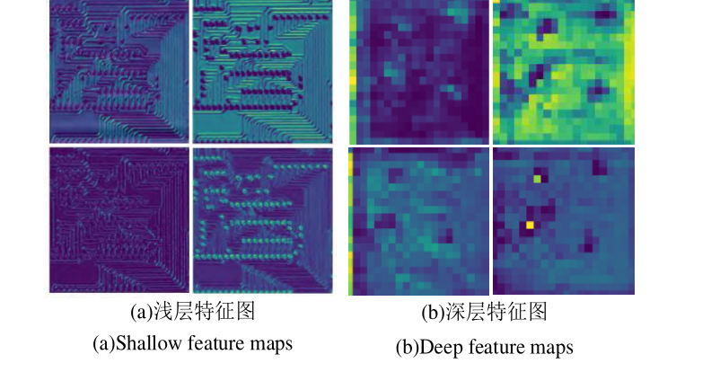

小目标检测依赖浅层高分辨率特征保留完整的空间位置与边缘细节，但 Neck 将深层语义特征上采样至浅层时，因上采样算法的局限性导致细节信息丢失，高低层特征间存在语义鸿沟与尺度错位。改进后的颈部结构如下图所示。

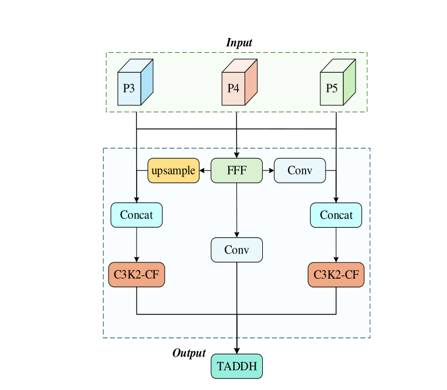

FFEN 接收来自主干网络输出的三组不同尺度输入特征：先通过尺度归一化与逐通道卷积完成特征分辨率与维度的对齐，消除跨尺度融合的错位干扰；随后将对齐后的多尺度特征拼接，充分保留各层特征的独有信息；在此基础上采用多尺度深度可分离卷积构建多感受野特征提取分支，自适应捕捉不同尺度目标的特征响应；最后引入残差连接通路，强化梯度反向传播效率，抑制特征在多层传递过程中的衰减与丢失。FFEN 中还内嵌 FFF 模块促进高层语义与低层细节的互补融合，其输出送入后续检测头。

### 特征聚焦融合模块 FFF

FFF 用于打破传统 FPN 融合中高层语义信息与低层细节信息的割裂状态，结构如下图所示。

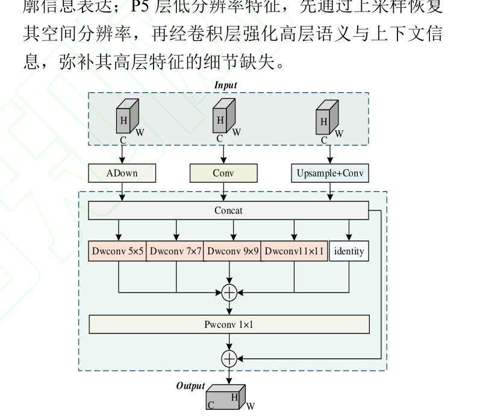

FFF 首先接收 P3、P4、P5 三层特征并做差异化处理：P3 层先经 Adown 模块降采样，在统一尺度的同时保留小目标与 PCB 缺陷的边缘、纹理等关键细节；P4 层直接通过卷积层提取中等尺度目标的语义特征；P5 层先上采样恢复空间分辨率，再经卷积层强化高层语义与上下文信息。预处理后的三层尺度特征拼接形成聚合特征，并经多卷积核深度卷积精细化增强：

$$
\begin{aligned}
x_{cat} &= \mathrm{torch.cat}(x_1', x_2', x_3') \in \mathbb{R}^{B \times C_h \times H/2 \times W/2} \\
f_{dw} &= x_{cat} + \sum_{k \in kernel\_sizes} dw\_conv_{k}(x_{cat})
\end{aligned}
$$

其中 $x_1'$、$x_2'$、$x_3'$ 为三层特征差异化处理后的结果，$x_{cat}$ 的通道数为 hid_c×3、空间尺寸与 x2 一致，$dw\_conv_k$ 表示卷积核尺寸为 k 的深度卷积层。融合后的特征再经加和与点卷积 Pwconv 操作得到最终输出特征 Y，尺寸与 x2 相同。文中以 1×1 卷积捕获局部细腻特征、7×7 卷积提取大范围上下文为例，说明多感受野分支与恒等映射的结合实现了局部细节与全局上下文的双重增强，避免单一尺度特征的信息局限；经 FFF 处理的特征同时具备丰富的位置细节与语义属性，输出至 Neck 输出层供检测头使用。

### 任务对齐动态检测头 TADDH

TADDH 用于打通分类与定位两个检测分支的信息交互通道，模块结构如下图所示。

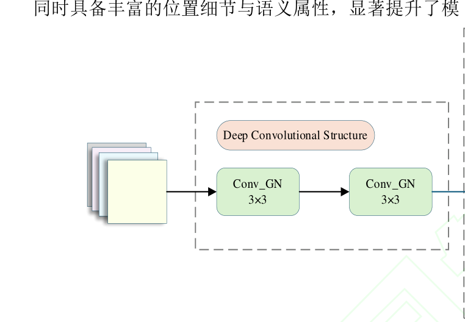

原检测头的分类与回归双分支完全独立，预测结果在空间位置上存在错位偏差、易导致小目标锚框匹配错误，且分支间缺乏特征交互与任务协同。TADDH 借鉴 TOOD 的思想：以共享卷积层替代双分支独立卷积以减少冗余参数；引入 Scale 层对多尺度特征动态缩放，适配不同检测头对应目标尺度的差异；通过特征提取器构建任务交互特征学习机制并引入可变形卷积 DCNv2，经多层偏移学习实现灵活的空间采样；任务分解模块从交互特征中分离利于边界框回归的关键空间特征，利用空间卷积生成偏移量和掩码实现回归特征的空间对齐。为缓解分类与定位两个任务的目标差异引入的特征冲突，任务对齐学习模块引入层注意力机制，在特征层级维度动态计算任务专属特征，其计算过程如下：

$$
\begin{aligned}
X_{task} &= \sum_{k=1}^{N} w_k \cdot X_{inter}^{k}, \quad k = 1, 2, \dots, N \\
w &= \sigma(f_{c2}(\sigma_1(f_{c1}(x_{inter}))))
\end{aligned}
$$

其中各符号的含义为：

| 符号 | 含义 |
| --- | --- |
| $N$ | 跨层交互特征的层数 |
| $X_{inter}^{k}$ | 第 k 层的跨层交互特征 |
| $w_k$ | 任务中的第 k 层注意力权重 |
| $f_{c1}$、$f_{c2}$ | 第一、第二全连接层，分别用于降维与映射至 N 维 |
| $\sigma_1$、$\sigma$ | 中间激活函数与 sigmoid 激活函数，后者将权重约束在 [0, 1] 区间 |

该动态层级加权机制可根据任务特征自适应分配权重，使分类分支更聚焦高层语义信息、定位分支更侧重低层空间细节，有效缓解单分支结构下的任务特征冲突，降低 PCB 缺陷小目标的误检与漏检率。TADDH 替换原检测头，接收 Neck 输出的三尺度特征并完成分类与回归预测。

### 改进组件对应与协同

下表给出四处改进与网络位置的对应关系，便于与后文消融实验对照阅读。

| 组件 | 作用位置 | 功能 |
| --- | --- | --- |
| C3K2-CF | 骨干 C3K2 | 深度可分离卷积令牌混合器，轻量化与小目标感知 |
| FFEN | Neck | 对齐、拼接与残差通路保障跨尺度信息完整 |
| FFF | Neck 融合点 | 多感受野深度卷积聚焦融合多尺度上下文 |
| TADDH | 检测头 | 共享卷积与任务对齐学习打通分类-定位交互 |

四处改进分别作用于特征提取、特征融合与预测输出三个阶段，层层衔接：C3K2-CF 提供轻量而完整的浅层特征，FFEN 与 FFF 保障跨尺度传递与融合质量，TADDH 在输出端完成分类与定位的协同优化。消融实验中逐组勾选的开关即对应表中各行组件。

## 实验结果

### 实验设置

首个数据集为北京大学智能机器人实验室公开发布的 PKU-Market-PCB，共 693 张原始 PCB 图像，涵盖缺孔、开路、短路、鼠咬、余铜及毛刺 6 类缺陷，各类别缺陷的可视化示例如下图所示。

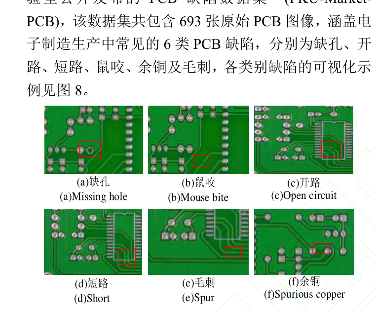

为避免过拟合，通过数据增强将原始数据集扩展至 10,668 张图片，缺陷在图片中的分布位置较为均匀（下图中颜色越深表示该区域缺陷分布数量越多），并按 8:1:1 划分为训练集、验证集与测试集。

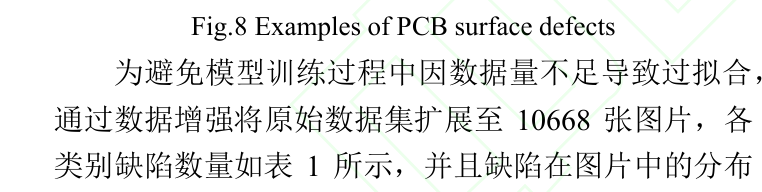

实验在 Windows 11、Python 3.11.4、PyTorch 2.0.0、RTX 3060 GPU、CUDA 11.8 环境下开展，输入尺寸统一为 640×640，学习率 0.01、动量 0.937、权重衰减 0.0005、批次大小 16、迭代次数 200、优化器 SGD；消融实验各组超参数完全一致且均不使用预训练权重。评价指标为精确率、召回率、mAP@0.5、mAP@0.5:0.95，并以参数量、GFLOPs 与 FPS 衡量复杂度与实时性，其中精确率与召回率计算为 $P = \frac{TP}{TP+FP}$ 与 $R = \frac{TP}{TP+FN}$，单类平均精度为 $AP = \int_{0}^{1} P(r) dr$，mAP 为 K 个类别 AP 的平均 $mAP = \frac{1}{K}\sum_{j=1}^{K} AP_j$，帧率计算为 $FPS = \frac{framNum}{elapsedTime}$。

### 可视化分析

先定性后定量，下图对比了六类典型缺陷的原始图像与原模型、改进模型的特征提取热力图。

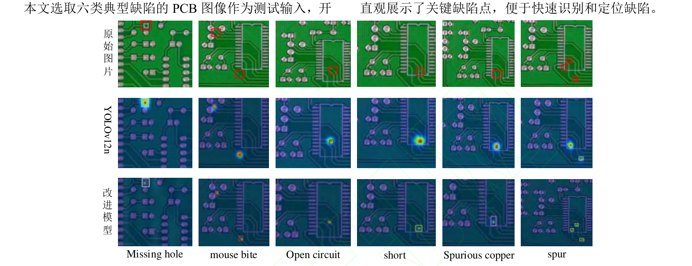

原模型对缺陷目标的聚焦能力不足，无法充分提取缺陷的有效特征信息，对毛刺类缺陷存在明显漏检；改进模型对 PCB 缺陷的特征提取能力明显增强，能够捕捉缺陷集中区域、更直观地展示关键缺陷点。下图进一步给出两个模型在 Deep PCB 数据集上的检测效果对比。

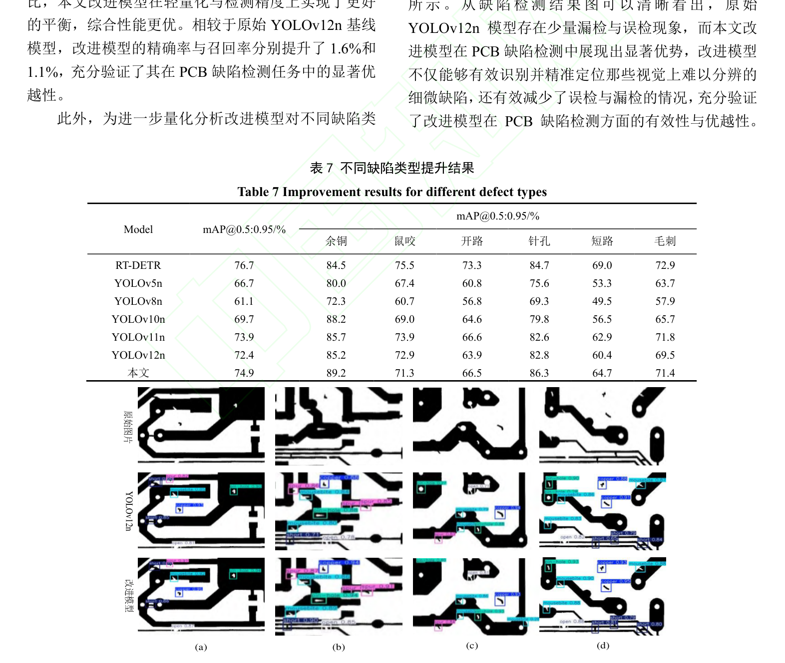

原始 YOLOv12n 存在少量漏检与误检现象，改进模型则能有效识别并精准定位视觉上难以分辨的细微缺陷，误检与漏检明显减少。

### 消融实验

在原始模型中逐步添加改进点的消融结果如下图所示。

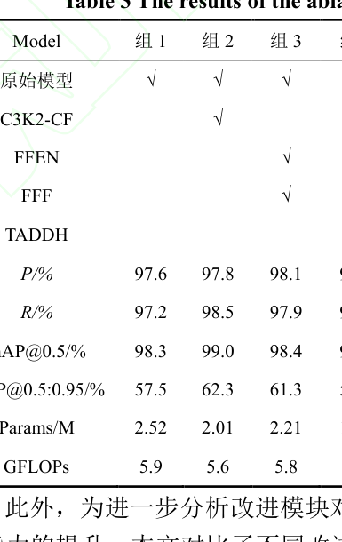

引入 C3K2-CF 后参数量下降 20.2%，mAP@0.5 与 mAP@0.5:0.95 分别提升 0.7 和 4.8；FFEN 与 FFF 协同使参数量减少 12.3%、mAP@0.5:0.95 提升 3.8；TADDH 使参数量与计算量分别减少 21%、10%，mAP@0.5:0.95 提升至 57.8%；四处改进齐备时参数量和计算量较基线分别减少 47.2% 和 16.9%，mAP@0.5 达到 98.6%、mAP@0.5:0.95 大幅提升 7.2%，可见改进在实现轻量化的同时实现了高精度检测。各改进组合在每类缺陷上的 mAP@0.5:0.95 如下图所示。

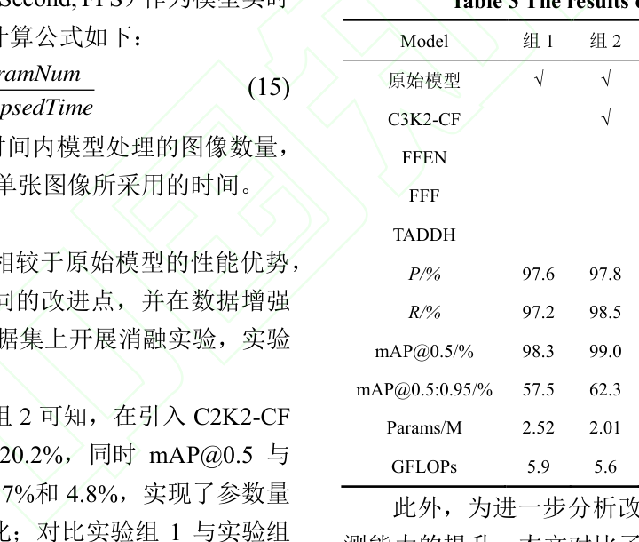

相较原模型，改进模型在鼠咬、毛刺、缺孔、短路、开路、余铜六类缺陷上分别提升 7.8、6.2、3.9、9.7、10.2、5.4 个百分点，短路、开路等小尺寸缺陷增益最大，说明各模块对小目标特征提取的增强是有效的。

### 对比实验

与主流算法在数据增强后 PKU-Market-PCB 数据集上的对比如下图所示。

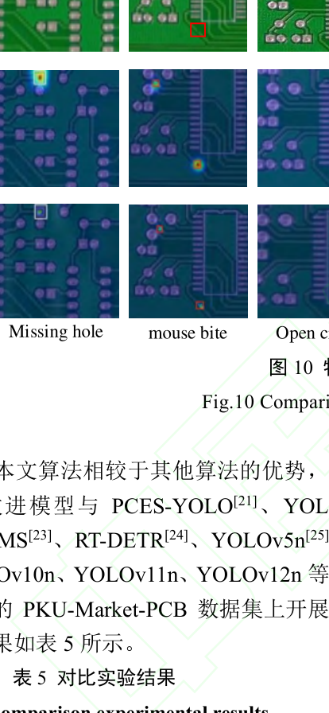

改进模型 mAP@0.5 增至 98.6%、mAP@0.5:0.95 达到 64.7%（较基线提升 7.2%），参数量与计算量仅 1.33M 与 4.9G，推理帧率可达 78.4 fps；RT-DETR 的 98.8% 与 64.8% 虽与本文接近，但参数量与计算量高达 19.88M 与 57.0G，YOLO-MS、PCES-YOLO 等模型精度接近而综合性能不及本文，说明改进模型在轻量化的同时检测精度显著提升，适用于实时性与高精度并重的工业检测场景。

### 跨数据集泛化

在 Deep PCB 公开数据集上的对比结果如下图所示，该数据集共 1,500 张由线阵 CCD 扫描采集的 PCB 图像，覆盖开路、短路、鼠咬、毛刺、余铜和针孔六种缺陷。

改进模型的精确率达到 97.2%、mAP@0.5 达到 97.5%，计算量仅为 4.9G、参数量低至 1.33M，精确率与召回率较原始 YOLOv12n 分别提升 1.6 和 1.1 个百分点，表明改进模型在跨数据集条件下仍在轻量化与检测精度上实现更好的平衡。按缺陷类别统计，改进模型在短路缺陷上的 mAP@0.5:0.95 提升最为明显、增加 4.3 个百分点，全类别缺陷检测精度达到 74.9%、提高 2.5 个百分点，进一步验证了改进模型在 PCB 缺陷检测方面的优越性。

## 优点和创新点

个人认为，本文有如下一些优点和创新点可供参考学习：

1. 以深度可分离卷积令牌混合器 ConvFormer 重构 C3K2，参数量下降 20.2% 的同时 mAP@0.5:0.95 提升 4.8 个百分点，实现了轻量化与小目标感知的双向优化。
2. 面向 Neck 跨尺度细节丢失的痛点设计 FFEN 与 FFF，以对齐-拼接-残差通路和多感受野深度卷积保留浅层弱特征，短路、开路等微小目标增益最大、证据充分。
3. 将任务对齐学习引入动态检测头，以层注意力与可变形卷积打通分类-定位信息交互，参数量仅 1.33M 即取得 98.6% 的 mAP@0.5，兼顾精度与实时性。
